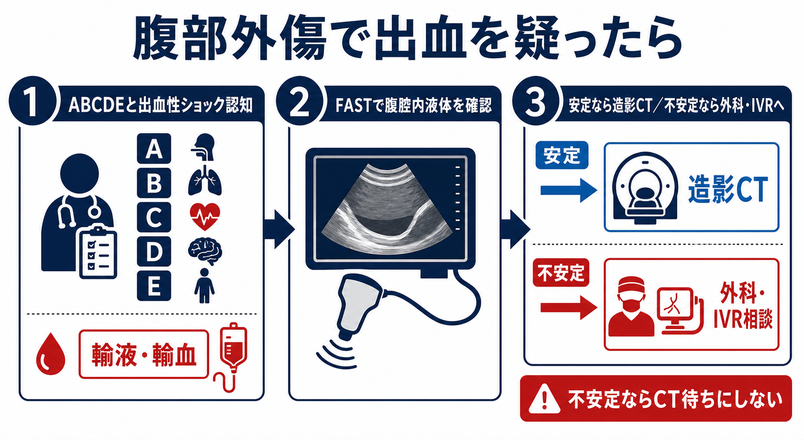
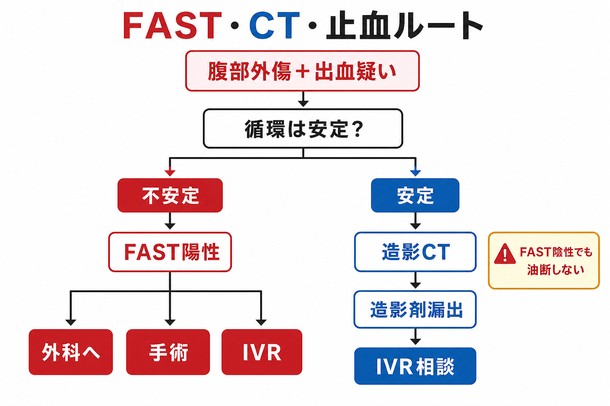
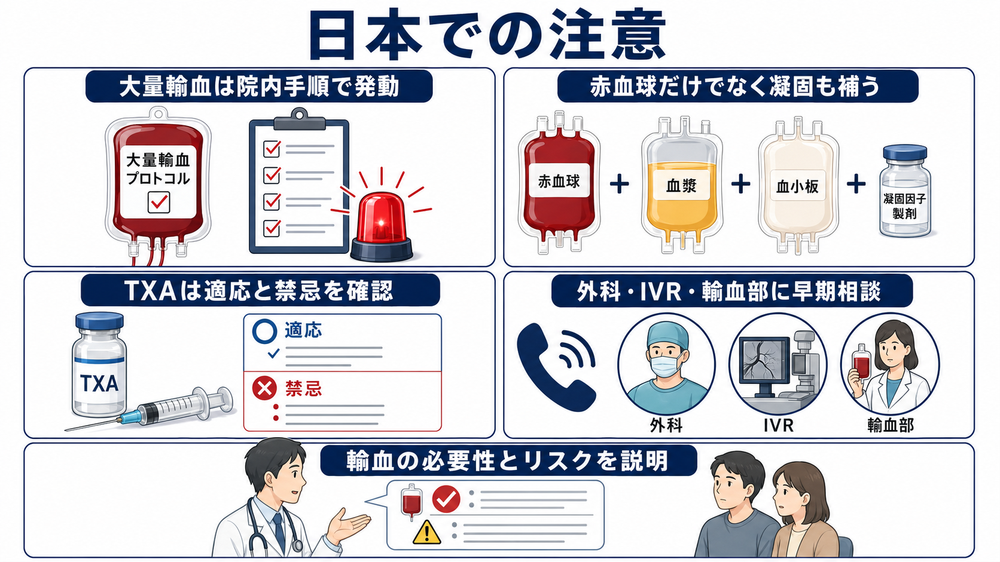

---
title: "腹部外傷で出血を疑ったら何をするか"
description: "腹部外傷で出血を疑う場面で、FAST、造影CT、輸液・輸血、外科・IVR相談をどう並行して進めるかを整理する。"
aliases:
  - "腹部外傷の出血対応"
tags:
  - 領域/救急・初期対応
  - 種類/クリニカルクエスチョン
  - 対象/研修医
question: "腹部外傷で出血を疑ったら何をするか"
clinical_area: "救急・初期対応"
audience: "研修医"
evidence_level: "guideline/review"
created: "2026-04-27"
updated: "2026-04-27"
enableToc: true
---

# 腹部外傷で出血を疑ったら何をするか

> このノートは研修医教育のための一般的整理であり、個別患者への診断・治療指示ではありません。緊急性が高い、判断に迷う、施設方針が関わる場合は上級医・外科・IVR・輸血部門へ早期に相談してください。

## クリニカルクエスチョン

腹部外傷で腹腔内または後腹膜出血を疑うとき、FAST、造影CT、輸液・輸血、外科・IVR相談をどの順番で考えるか。

## まず結論

- 最初に決めるのは「循環が安定しているか」である。ショック、反応不良な低血圧、意識障害、冷汗、乳酸上昇、出血性ショックを疑う受傷機転があれば、検査完了を待たずに止血ルートを動かす。[1],[6]
- FASTは不安定な腹部外傷で「腹腔内液体がありそうか」を素早く見る道具であり、出血を除外する検査ではない。陰性でも後腹膜出血、腸間膜損傷、早期出血、肥満・皮下気腫などでは見逃し得る。[1],[6],[7]
- 循環が安定または蘇生で一時安定した患者では、造影CTが損傷臓器、造影剤漏出、後腹膜血腫、腸管・腸間膜損傷、IVR適応を決める中心になる。[6],[7],[8]
- 不安定例でFAST陽性なら、CT室へ送る前に外科へ緊急相談し、開腹止血、ダメージコントロール手術、必要時のIVR併用を考える。[1],[6],[7]
- 輸液は「時間を稼ぐ手段」であり、根治は止血である。出血性ショックを疑えば温めた晶質液を最小限にし、早期に赤血球だけでなく凝固因子・血小板を含む大量輸血手順へ接続する。[2],[6]
- IVRは肝・脾・腎・骨盤などの動脈性出血で有効な止血手段だが、迅速に使える施設・人員・手術バックアップが前提になる。相談はCT後ではなく、疑った時点で早めに入れる。[3],[4],[7],[8]

## 判断の型

1. **ABCDEを進めながら循環不全を拾う。** 気道・呼吸を確保しつつ、血圧、脈拍、皮膚冷感、意識、尿量、乳酸、ショックインデックス、受傷機転を見て「出血性ショックとして動くか」を決める。[1],[6]
2. **不安定ならFASTを止血先の判断に使う。** FAST陽性なら腹腔内出血を強く疑い、外科へ緊急相談する。FAST陰性でも骨盤骨折、後腹膜出血、胸腔内出血、四肢・外出血、心タンポナーデを同時に探す。[1],[6]
3. **安定なら造影CTへ進む。** 造影CTで損傷臓器、造影剤漏出、血腫、腹腔内遊離ガス、腸間膜損傷、尿路損傷を確認し、保存、IVR、手術のいずれに乗せるか相談する。[6],[7],[8]
4. **輸液・輸血は止血と並行する。** 低血圧出血外傷では0.9%生理食塩液または平衡晶質液で開始しつつ、過剰輸液を避け、院内の緊急輸血・大量輸血手順に接続する。[2],[6]
5. **相談は早く、同時並行にする。** 外科、IVR、麻酔、輸血部、放射線、集中治療へ「腹部外傷、出血疑い、現在の循環、FAST/CT所見、輸血状況」を短く共有する。

## 初期対応

- **応援を呼ぶ。** 腹部外傷で出血性ショックを疑った時点で、上級医、外科、IVR、輸血部門へ早期連絡する。救急外来内だけで完結させようとしない。
- **モニターとルート。** 心電図、SpO2、非侵襲的血圧または動脈圧、体温を装着し、太い末梢静脈路を2本確保する。困難なら骨髄路や中心静脈路を早めに相談する。
- **採血。** CBC、血液型、不規則抗体、交差適合、PT-INR、APTT、フィブリノゲン、血液ガス、乳酸、電解質、Ca、腎機能、肝胆道系、妊娠可能性があれば妊娠反応を出す。
- **低体温を避ける。** 露出して全身観察した後は保温し、輸液・輸血は可能な範囲で加温する。低体温、アシドーシス、凝固障害は止血を難しくする。[6]
- **初期輸液。** 出血性ショックでは大量の晶質液で血圧だけを正常化しようとしない。脳損傷がなければ、止血まで制限的輸液を基本に考える。[6]
- **TXA。** 出血中または有意な出血リスクのある外傷では、受傷3時間以内のトラネキサム酸投与が国際的に推奨される。日本では添付文書、禁忌、血栓リスク、院内手順を確認して上級医と判断する。[5],[6],[9]

## 鑑別・見逃し

| 優先度 | 疾患・病態 | 見逃せない理由 | 手がかり |
|---|---|---|---|
| 高 | 肝損傷・脾損傷 | 急速な腹腔内出血、遅発性破裂、動脈性出血がある | 左右季肋部痛、FAST陽性、造影CTで造影剤漏出・仮性動脈瘤 |
| 高 | 腸間膜損傷・腸管損傷 | 初回FASTや早期CTで分かりにくく、腹膜炎・敗血症へ進む | シートベルト痕、腹痛増悪、腹膜刺激、遊離ガス、腸間膜血腫 |
| 高 | 後腹膜出血・腎損傷 | FAST陰性になり得る。血尿がない腎血管損傷もあり得る | 背部痛、側腹部打撲、骨盤骨折、造影CT遅延相、肉眼的血尿 |
| 高 | 骨盤骨折に伴う出血 | 腹部外傷に紛れて大量出血源になる | 骨盤痛、下肢長差、会陰部血腫、ショック、骨盤X線/CT |
| 高 | 胸腔内出血・心タンポナーデ | 腹部出血と同時に検索が必要 | 呼吸音左右差、頸静脈怒張、E-FASTで胸水・心嚢液 |
| 中 | 抗凝固薬・抗血小板薬内服 | 少量損傷でも出血が止まりにくい | DOAC、ワルファリン、抗血小板薬、肝硬変、透析 |

## 検査

| 検査 | 目的 | 注意点 |
|---|---|---|
| FAST/E-FAST | 腹腔内液体、胸腔内液体、心嚢液の迅速評価 | 陰性で出血を除外しない。後腹膜・腸管損傷は苦手。[1],[6],[7] |
| 骨盤X線 | 不安定例で骨盤出血源を拾う | 骨盤骨折が疑わしければ固定と外科・IVR相談を同時に行う。[6] |
| 造影CT | 損傷部位、造影剤漏出、仮性動脈瘤、血腫、腸管損傷の評価 | 原則として安定または蘇生で一時安定した患者で行う。CT室への移動リスクを上級医と判断する。[6],[7],[8] |
| 血液ガス・乳酸 | 灌流不全、アシドーシス、輸液・輸血反応の評価 | 初回値だけでなく推移を見る。正常値でも早期出血を否定しない。 |
| 凝固検査・フィブリノゲン | 外傷性凝固障害と補充方針の評価 | 結果待ちで輸血開始を遅らせない。院内大量輸血手順に従う。[2],[6] |
| 血液型・交差適合 | 安全な輸血準備 | 緊急時の未交差血・O型赤血球の運用は院内手順で確認する。[2] |

## 治療・マネジメント

- **止血が治療の中心。** 輸液・輸血で一時的に循環が戻っても、出血源が残れば再び破綻する。外科、IVR、骨盤固定、開腹、ダメージコントロールを早期に選択肢へ入れる。[1],[6]
- **不安定＋FAST陽性。** 腹腔内出血を強く疑い、CTより外科的止血を優先する状況がある。施設によってハイブリッドERやIVR併用の運用が異なるため、早期に上級医判断へつなぐ。[1],[6],[7]
- **安定＋造影剤漏出。** 肝・脾・腎の動脈性出血や仮性動脈瘤ではIVRが候補になる。WSESの肝・脾外傷ガイドラインでも、安定例の造影剤漏出では血管造影・塞栓術が選択肢になる。[7],[10]
- **一時反応例。** 輸液・輸血で一時的に血圧が戻るが再低下する患者では、CTに行けるか、手術室へ行くか、IVRへ直行できるかをチームで判断する。移動中の悪化に備え、輸血と蘇生体制を持って移動する。
- **輸血。** 日本では2026年3月24日に従来の「血液製剤の使用指針」などが廃止され、「輸血療法実践ガイド」参照へ整理された。現場では院内輸血療法委員会の緊急輸血・大量輸血手順に従う。[2]
- **凝固・Ca・体温。** 赤血球だけでは凝固障害を補えない。FFP、血小板、フィブリノゲン補充、カルシウム、保温、アシドーシス補正を並行して確認する。[2],[6]
- **日本での注意。** TXAは国内添付文書上の適応、禁忌、慎重投与、用法用量と、外傷出血に対する国際推奨用量が完全に同じ形で整理されているわけではない。実施時は施設プロトコル、上級医判断、血栓リスクを確認する。[5],[6],[9]

## 図解

## 指導医に確認するポイント

- この患者は「循環安定」「一時反応」「反応不良」のどれとして扱うか。
- CT室へ行ける状態か、それとも手術室・IVR室・ハイブリッドERを優先するか。
- FAST陰性でも疑うべき出血源はどこか。骨盤、後腹膜、胸腔、四肢、外出血は評価済みか。
- 院内の緊急輸血・大量輸血手順を発動する基準を満たすか。
- 外科、IVR、麻酔、輸血部、ICUへの連絡は誰が、何を伝えるか。
- 抗凝固薬・抗血小板薬、妊娠、小児、高齢者、腎機能障害、造影剤アレルギーなどの修正因子はあるか。

## 患者説明

- 「けがの影響で、お腹の中や後ろ側に出血している可能性があります。」
- 「血圧や脈拍、超音波、CTを見ながら、輸液・輸血で体を支えつつ、出血を止める方法を急いで決めます。」
- 「状態が不安定な場合は、詳しい検査を待つよりも手術やカテーテル治療を優先することがあります。」
- 「輸血や造影CT、手術、カテーテル治療にはそれぞれリスクがありますが、出血が続く危険と比べて必要性が高いと判断される場合があります。」

## ピットフォール

- FAST陰性で安心する。後腹膜出血、腸間膜損傷、早期出血では陰性になり得る。
- CT結果を待ってから外科・IVRへ連絡する。相談は「疑った時点」でよい。
- 晶質液を大量に入れて血圧だけを整え、低体温・希釈性凝固障害を悪化させる。
- 赤血球輸血だけに集中し、FFP、血小板、フィブリノゲン、Ca、体温を見落とす。
- 不安定例を準備不足のままCT室へ移動する。移動先で急変したときの人員、輸血、気道、止血手段を確認する。
- 腹部だけを見て、骨盤、胸腔、四肢、外出血、心タンポナーデを見落とす。
- 小児、高齢者、妊婦、抗凝固薬内服患者を成人標準フローだけで判断する。

## 関連ノート

- [[ショック患者を見たら最初に何をするか]]
- [[ショックの4分類を救急外来でどう見分けるか]]
- [[出血性ショックを疑ったとき輸液と輸血をどう考えるか]]
- 関連ノート候補: 骨盤外傷で出血を疑ったら何をするか、FAST陰性の腹部外傷をどうフォローするか、外傷患者の大量輸血プロトコルをどう発動するか、抗凝固薬内服中の外傷出血にどう対応するか。

## MOC更新候補

- [[MOC｜救急・初期対応]]
- [[MOC｜外傷・熱傷・中毒]]
- MOC｜血液・腫瘍・輸血.md（本サイト外）
- MOC｜検査・画像・手技.md（本サイト外）

## 参考文献

[1] 日本外傷学会, 日本救急医学会 監修. 外傷初期診療ガイドラインJATEC 改訂第6版. へるす出版; 2021. https://www.herusu-shuppan.co.jp/014-2/

[2] 厚生労働省. 「血液製剤の使用指針」、「輸血療法の実施に関する指針」及び「血液製剤保管管理マニュアル」の廃止並びに「輸血療法実践ガイド」の周知について. 2026-03-24. https://www.mhlw.go.jp/stf/newpage_72052.html

[3] 日本IVR学会. 肝外傷に対するIVRのガイドライン2016. https://www.jsir.or.jp/en/%E6%9C%AA%E5%88%86%E9%A1%9E/kangaisyo/

[4] 日本IVR学会. 外傷の治療としてのIVR. https://www.jsir.or.jp/shimin/gaisho_ivr/

[5] PMDA. トランサミン注5%／トランサミン注10% 医療用医薬品情報（一般名: トラネキサム酸）. https://www.pmda.go.jp/PmdaSearch/rdSearch/02/3327401A1127?user=1

[6] Rossaint R, Afshari A, Bouillon B, et al. The European guideline on management of major bleeding and coagulopathy following trauma: sixth edition. Critical Care. 2023;27:80. https://doi.org/10.1186/s13054-023-04327-7

[7] Coccolini F, Coimbra R, Ordonez C, et al. Liver trauma: WSES 2020 guidelines. World Journal of Emergency Surgery. 2020;15:24. https://doi.org/10.1186/s13017-020-00302-7

[8] Coccolini F, Moore EE, Kluger Y, et al. Kidney and uro-trauma: WSES-AAST guidelines. World Journal of Emergency Surgery. 2019;14:54. https://doi.org/10.1186/s13017-019-0274-x

[9] CRASH-2 trial collaborators. Effects of tranexamic acid on death, vascular occlusive events, and blood transfusion in trauma patients with significant haemorrhage. Lancet. 2010;376(9734):23-32. https://doi.org/10.1016/S0140-6736(10)60835-5

[10] Coccolini F, Montori G, Catena F, et al. Splenic trauma: WSES classification and guidelines for adult and pediatric patients. World Journal of Emergency Surgery. 2017;12:40. https://doi.org/10.1186/s13017-017-0151-4

## 更新ログ

- 2026-04-27: 初版作成。FAST、造影CT、輸液・輸血、外科・IVR相談の流れを整理し、imagegen由来のラスター図解3枚を添付。
