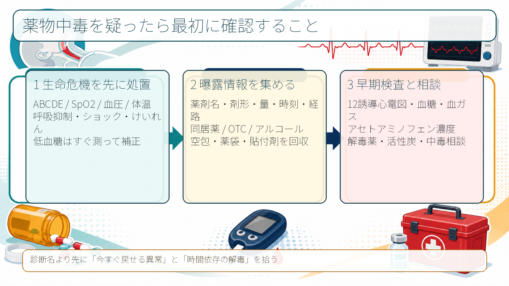
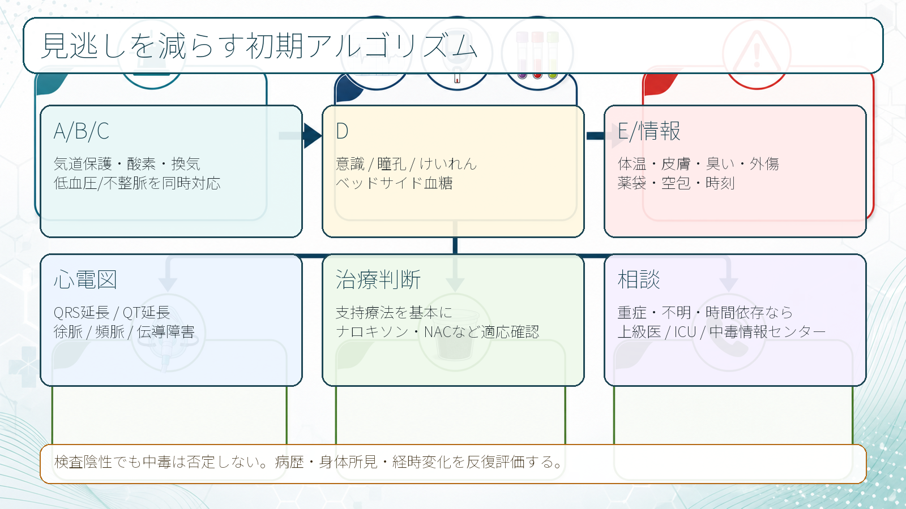
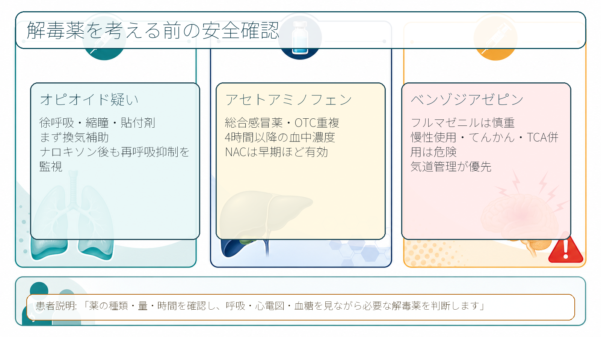

---
title: "薬物中毒を疑ったら最初に何を確認するか"
description: "ABC、服薬内容、時間、量、同居薬、心電図、血糖、解毒薬適応を初期対応として整理する。"
aliases:
  - "薬物中毒の初期対応"
tags:
  - 領域/救急・初期対応
  - 種類/クリニカルクエスチョン
  - 対象/研修医
question: "薬物中毒を疑ったら最初に何を確認するか"
clinical_area: "救急・初期対応"
audience: "研修医"
evidence_level: "guideline/review/mixed"
created: "2026-04-27"
updated: "2026-04-27"
enableToc: true
---

# 薬物中毒を疑ったら最初に何を確認するか

> このノートは研修医教育のための一般的整理であり、個別患者への診断・治療指示ではありません。緊急性が高い、判断に迷う、施設方針が関わる場合は上級医・専門科・中毒情報センターへ早めに相談してください。

## クリニカルクエスチョン

薬物中毒を疑った救急患者で、ABC、服薬内容、時間、量、同居薬、心電図、血糖、解毒薬適応をどの順番で確認するか。

## まず結論

- 最初に確認するのは「薬の名前」ではなく、**気道・呼吸・循環・意識・血糖・体温・心電図で今すぐ死に得る異常があるか**である。薬物中毒の初期対応は、蘇生、リスク評価、除染、解毒薬、排泄促進、観察・帰宅判断に分けて考える [3,4]。
- 問診は、**薬剤名、剤形、量、時刻、経路、同居薬、OTC、アルコール、サプリ、残薬・空包・貼付剤**をセットで集める。日本中毒情報センターも、起因物質、摂取量、経路、発生時刻、受診時刻、患者状態、既処置を確認項目としている [1]。
- 早期にベッドサイド血糖、12誘導心電図、SpO2/心電図モニターを入れる。低血糖、徐呼吸、ショック、不整脈、けいれん、低体温/高体温は診断確定を待たずに処置する [3,4]。
- 活性炭は「中毒なら全例」ではない。毒性量、吸着される物質、概ね摂取後1時間以内、意識清明または気道保護済みなどの条件を確認し、原則として上級医・中毒専門家と相談する [3,5]。
- 解毒薬は支持療法の代わりではない。ナロキソン、アセチルシステイン、フルマゼニルなどは、国内添付文書、禁忌、再悪化、施設採用薬を確認して使う [7-9]。

## 判断の型

1. **安定化を先にする。** A: 誤嚥・気道閉塞、B: 徐呼吸・低酸素・換気不全、C: 低血圧・頻脈/徐脈・wide QRS、D: 意識障害・けいれん・血糖、E: 体温・皮膚・臭い・貼付剤・外傷を確認する [3,4]。
2. **曝露を具体化する。** 「何を」「いつ」「どれくらい」「どの剤形で」「何と一緒に」「普段から飲んでいるか」を聞く。本人が話せない場合は家族、救急隊、薬袋、お薬手帳、処方アプリ、空包、瓶、貼付剤、同居者の薬を確認する [1,3]。
3. **心電図と血糖を早く見る。** 薬物中毒では心筋虚血が主訴でなくても、Naチャネル遮断によるQRS延長、Kチャネル遮断によるQT延長、徐脈、頻脈、伝導障害が治療選択に直結する [3]。
4. **時間依存の治療を拾う。** アセトアミノフェン、サリチル酸、リチウム、徐放製剤、経口血糖降下薬、β遮断薬、Ca拮抗薬、三環系抗うつ薬、オピオイド、農薬などは、早期相談と観察時間の設計が重要である [2,3]。
5. **自傷リスクも同時に扱う。** 意図的過量服薬では、身体安定化後に精神科的評価、安全確保、再企図リスク、同居薬管理を確認する。救急外来だけで「落ち着いたから帰宅」としない。

## 初期対応

- **安全確認:** 患者周囲の薬剤、化学物質、針、暴力リスク、二次曝露を確認する。衣服・皮膚汚染や吸入曝露が疑わしい場合は除染と換気を先に考える。
- **A/B:** いびき様呼吸、嘔吐、誤嚥、徐呼吸、SpO2低下、換気不全があれば、酸素、吸引、体位、バッグバルブマスク、気管挿管相談を進める。GCSだけでなく、気道反射と換気を直接見る [3,4]。
- **C:** 血圧、脈拍、末梢冷感、心電図モニター、12誘導心電図、静脈路を確認する。wide QRS、QT延長、ショック、重症徐脈はすぐ共有する [3]。
- **D:** JCS/GCS/AVPU、瞳孔、けいれん、発汗、筋強剛、クローヌス、ベッドサイド血糖を確認する。低血糖は中毒と併存し、意識障害の可逆的原因である。
- **E/情報:** 体温、皮膚乾燥/発汗、尿閉、腸蠕動、外傷、貼付剤、注射痕、アルコール臭、薬袋、空包、家族情報を集める。
- **相談:** 物質不明、重症、時間依存、特殊解毒薬、除染、透析適応、妊娠、小児、意図的過量服薬では、上級医、救急/集中治療、中毒情報センターへ早めに相談する [1,2]。

## 鑑別・見逃し

- **オピオイド:** 徐呼吸、縮瞳、意識障害、貼付剤、術後鎮痛薬、がん疼痛薬、同居薬。ナロキソンで改善しても再呼吸抑制を監視する [7]。
- **ベンゾジアゼピン・睡眠薬:** 意識障害、ふらつき、誤嚥。フルマゼニルは慢性使用、てんかん、三環系抗うつ薬併用などでけいれん・中毒症状顕在化の懸念があり、気道管理を優先する [9]。
- **アセトアミノフェン:** 初期症状が軽くても肝障害が遅れて出る。総合感冒薬、鎮痛薬、OTC重複、アルコール常用、低栄養、肝疾患を確認する [8]。
- **三環系抗うつ薬・抗精神病薬:** 意識障害、けいれん、低血圧、QRS延長、QT延長。心電図異常が治療選択に直結する [3]。
- **経口血糖降下薬・インスリン:** 低血糖が遅れて反復することがある。糖尿病薬の同居薬、腎機能、飲酒、食事摂取を確認する。
- **β遮断薬・Ca拮抗薬:** 徐脈、低血圧、ショック、低血糖を来し得る。少量でも重症化する薬剤がある。
- **抗コリン・セロトニン・交感神経刺激薬:** 散瞳、発汗/皮膚乾燥、頻脈、高体温、クローヌス、筋強剛、せん妄を身体所見で拾う。
- **中毒以外:** 頭部外傷、低血糖、敗血症、低酸素、高CO2、脳卒中、けいれん後、アルコール離脱、精神疾患単独では説明できない身体疾患を残す。

## 検査

- **ベッドサイド血糖:** 意識障害、不穏、けいれん、低体温、発汗ではすぐ測る。採血結果を待たない。
- **12誘導心電図:** 薬物中毒疑いでは早期に取得し、QRS、QTc、PR、徐脈/頻脈、伝導障害を確認する [3]。
- **血液ガス・乳酸・電解質:** 換気不全、代謝性アシドーシス、ショック、けいれん、サリチル酸、メトホルミン、CO中毒などを疑う時に有用。
- **一般採血:** 腎機能、肝機能、電解質、CK、浸透圧ギャップ、凝固、血算を病態に合わせて選ぶ。
- **薬物濃度:** アセトアミノフェン、サリチル酸、リチウム、ジゴキシン、バルプロ酸、カルバマゼピン、テオフィリンなど、濃度が治療に直結する薬剤を優先する。すべての薬物が迅速測定できるわけではない。
- **尿中薬物スクリーニング:** 陰性でも中毒を否定しない。臨床判断、薬袋、空包、経時変化を優先する。
- **妊娠反応:** 妊娠可能性がある場合、薬剤選択、画像、精神科対応、帰宅判断に関わる。
- **日本での注意:** 検査項目、薬物血中濃度の外注可否、アセトアミノフェン濃度の測定時間、院内採用解毒薬は施設差が大きい。救急カート、薬剤部、検査部の運用を事前に確認する。

## 治療・マネジメント

- **支持療法が基本:** 酸素、換気、輸液、昇圧薬相談、体温管理、けいれん治療、誤嚥対策、心電図モニター、反復評価を先に整える [3,4]。
- **活性炭:** AACT/EAPCCTは、単回活性炭を中毒患者へルーチン投与しないこと、吸着される毒物の毒性量を摂取し概ね1時間以内なら考慮すること、気道が保たれていない場合は禁忌と整理している [5]。日本の薬用炭添付文書では、薬物中毒における吸着・解毒が効能に含まれるが、実際の適応は物質、時間、意識、誤嚥リスクで判断する [6]。
- **ナロキソン:** オピオイドによる呼吸抑制が主問題なら、換気補助を優先しつつ検討する。国内添付文書では麻薬による呼吸抑制・覚醒遅延の改善が効能であり、作用時間差による呼吸抑制再発、血圧上昇、頻脈、退薬症候に注意する [7]。
- **アセチルシステイン:** アセトアミノフェン過量摂取では、摂取時刻、量、4時間以降の血中濃度、リスク因子を確認する。国内添付文書では早期開始、血中濃度ノモグラム、7.5 gまたは150 mg/kg以上疑い、アルコール常用・低栄養・肝疾患などの注意が示されている [8]。
- **フルマゼニル:** ベンゾジアゼピン中毒であっても安易に使わない。国内添付文書では、長期ベンゾジアゼピン投与中のてんかん患者は禁忌で、三環系抗うつ薬併用、自殺企図、再鎮静、けいれんに注意が必要である [9]。
- **排泄促進・透析:** サリチル酸、リチウム、毒性アルコール、バルプロ酸、テオフィリンなどでは専門的判断が必要である。重症、不明、腎不全、アシドーシス、意識障害遷延では早期相談する [3,4]。
- **観察と帰宅判断:** 徐放製剤、複数薬剤、経口血糖降下薬、アセトアミノフェン、長時間作用薬、自傷企図では、初期改善だけで帰宅可とはしない。

### 日本での注意

- 日本中毒情報センターの医療機関専用電話は365日24時間対応で、問い合わせ時には医療機関名、患者背景、起因物質、摂取量、経路、発生時刻、受診時刻、現在症状、既処置などを整理して伝える [1]。
- 海外ガイドラインに出てくる解毒薬、用量、電話相談窓口、観察時間をそのまま日本へ持ち込まない。国内添付文書、採用薬、保険適用、院内プロトコル、薬剤部在庫を確認する [6-9]。
- 国内では新版『急性中毒標準診療ガイド』が中毒診療の基本書として参照される。Webで全文閲覧できない場合も、院内図書、救急部、薬剤部で参照可能か確認しておく [2]。

## 図解

## 指導医に確認するポイント

- 気道確保、挿管準備、ICU相談を始める閾値。
- 心電図でQRS延長、QT延長、徐脈、wide QRS頻拍がある時の初期対応。
- 活性炭、胃洗浄、全腸洗浄を考えるか。気道保護は十分か。
- アセトアミノフェン濃度、サリチル酸、リチウムなど、今すぐ測るべき濃度は何か。
- ナロキソン、アセチルシステイン、フルマゼニル、その他解毒薬の適応・禁忌・投与後監視。
- 中毒情報センター、精神科、薬剤部、集中治療、腎臓内科、転院搬送のどれを先に動かすか。

## 患者説明

- 「薬の種類、量、飲んだ時間が治療判断に重要です。薬袋、空のシート、貼り薬、同居している方の薬も確認します。」
- 「まず呼吸、心電図、血糖、血圧を見て、命に関わる異常を先に治療します。」
- 「解毒薬が使える場合もありますが、薬の種類や時間、危険性を確認してから判断します。」
- 「最初に良く見えても、後から眠気、不整脈、低血糖、肝障害が出る薬があります。必要な時間は観察します。」
- 「自分を傷つける目的があった場合は、身体の治療後に安全確保と再発予防について一緒に相談します。」

## ピットフォール

- 「薬物中毒らしい」と思った時点で、血糖と心電図を後回しにする。
- 眠っているだけ、酔っているだけ、精神症状だけと判断し、低酸素、低血糖、頭部外傷、敗血症、脳卒中を除外しない。
- 薬毒物スクリーニング陰性で中毒を否定する。
- 活性炭を意識障害・嘔吐リスクのある患者に安易に投与する。
- ナロキソン投与後に一時的に改善し、再呼吸抑制の監視をやめる。
- フルマゼニルを「睡眠薬の解毒薬」として反射的に使い、けいれんや三環系抗うつ薬中毒の顕在化を招く。
- アセトアミノフェンを単剤名だけで探し、総合感冒薬やOTCの重複を見落とす。
- 自傷企図の安全評価、同居薬管理、精神科連携を身体症状改善後に抜かす。

## 関連ノート

- [[救急外来で患者を診るときABCDE評価はどの順番で進めるか]]
- [[救急外来で初期検査セットはどのように選ぶか]]
- [[意識障害患者を見たら最初に何を確認するか]]
- [[意識障害の鑑別をAIUEOTIPSでどう整理するか]]
- [[低血糖による意識障害を疑ったらどう対応するか]]
- [[アルコール関連の意識障害をどう評価するか]]
- 関連ノート候補（未作成）: オピオイド中毒を疑ったら何をするか
- 関連ノート候補（未作成）: アセトアミノフェン過量摂取をどう評価するか
- 関連ノート候補（未作成）: 三環系抗うつ薬中毒で心電図をどう読むか

## MOC更新候補

- [[MOC｜救急・初期対応]] に「外傷・熱傷・中毒」関連として本記事を追加候補。
- MOC｜薬剤・処方・副作用.md（本サイト外） に「薬物中毒・解毒薬」関連として本記事を追加候補。
- MOC｜精神・せん妄・睡眠.md（本サイト外） に「過量服薬・自傷リスク」関連として本記事を追加候補。

## 参考文献

[1] 公益財団法人 日本中毒情報センター. 中毒110番・電話サービス（医療機関専用）. https://www.j-poison-ic.jp/110serviece/service-guide-medical/

[2] 日本中毒学会 監修, 日本中毒学会学術委員会 急性中毒標準診療ガイド改訂委員会 編集. 新版 急性中毒標準診療ガイド. へるす出版, 2023. DOI: https://doi.org/10.32209/9784867190715

[3] The Royal Children's Hospital Melbourne. Clinical Practice Guidelines: Poisoning - Acute Guidelines For Initial Management. https://www.rch.org.au/clinicalguide/guideline_index/Poisoning_-_Acute_Guidelines_For_Initial_Management/

[4] Emergency Management of Poisoning. PMC. https://pmc.ncbi.nlm.nih.gov/articles/PMC7315350/

[5] Chyka PA, Seger D, Krenzelok EP, Vale JA; American Academy of Clinical Toxicology; European Association of Poisons Centres and Clinical Toxicologists. Position paper: Single-dose activated charcoal. Clin Toxicol (Phila). 2005;43(2):61-87. DOI: https://doi.org/10.1081/CLT-200051867

[6] PMDA. 薬用炭「日医工」 医療用医薬品情報. https://www.pmda.go.jp/PmdaSearch/rdSearch/02/2319003X1049?user=1

[7] PMDA. ナロキソン塩酸塩静注0.2mg「AFP」 医療用医薬品情報. https://www.pmda.go.jp/PmdaSearch/rdSearch/02/2219402A1049?user=1

[8] PMDA. アセチルシステイン内用液17.6%「あゆみ」 添付文書. https://www.pmda.go.jp/PmdaSearch/iyakuDetail/ResultDataSetPDF/172190_3929006S1049_4_02

[9] PMDA. フルマゼニル静注液0.5mg「テバ」 医療用医薬品情報. https://www.pmda.go.jp/PmdaSearch/rdSearch/02/2219403A1086?user=1

## 更新ログ

- 2026-04-27: 初版作成。日本中毒情報センター、日本中毒学会標準診療ガイド、PMDA添付文書、RCH初期対応、AACT/EAPCCT活性炭ポジションを確認し、imagegen由来PNG図解3枚を添付。
