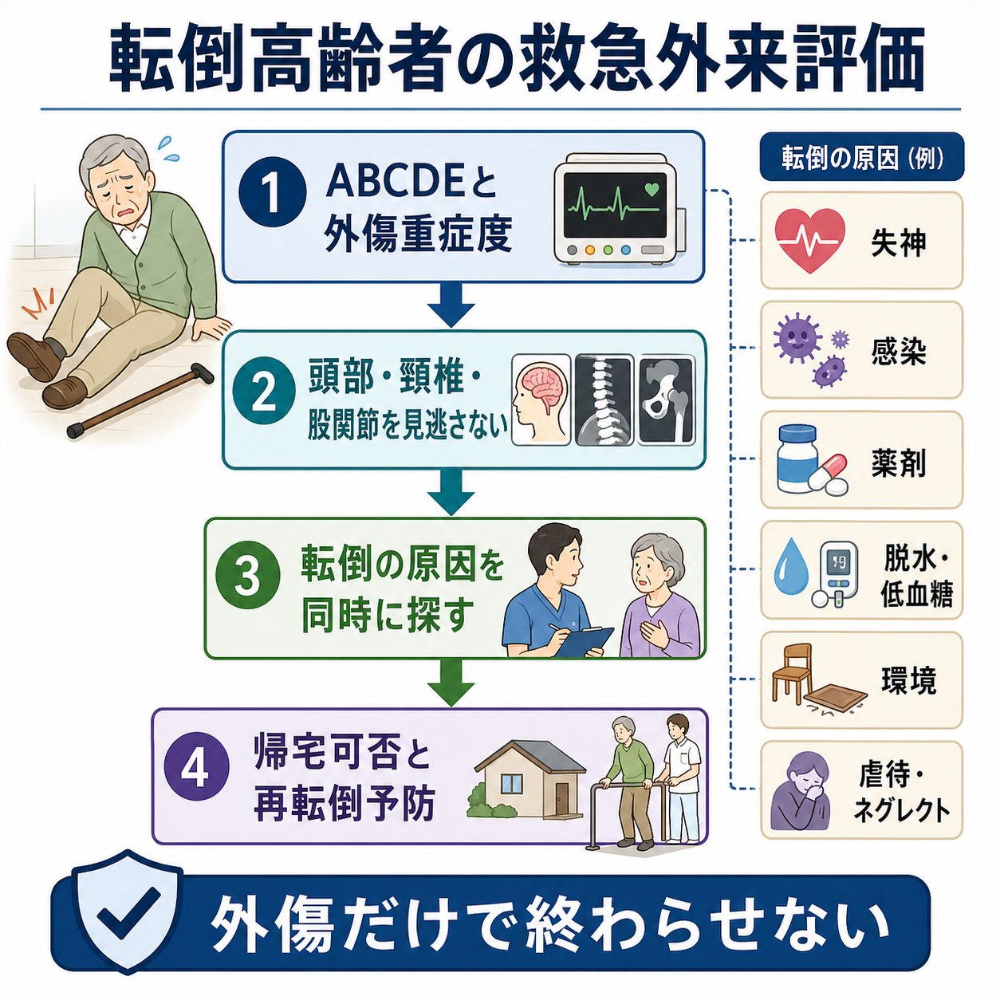
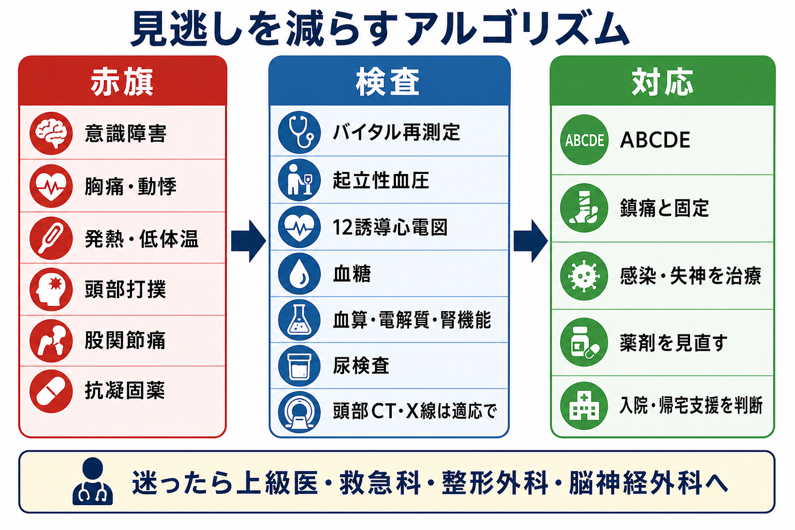
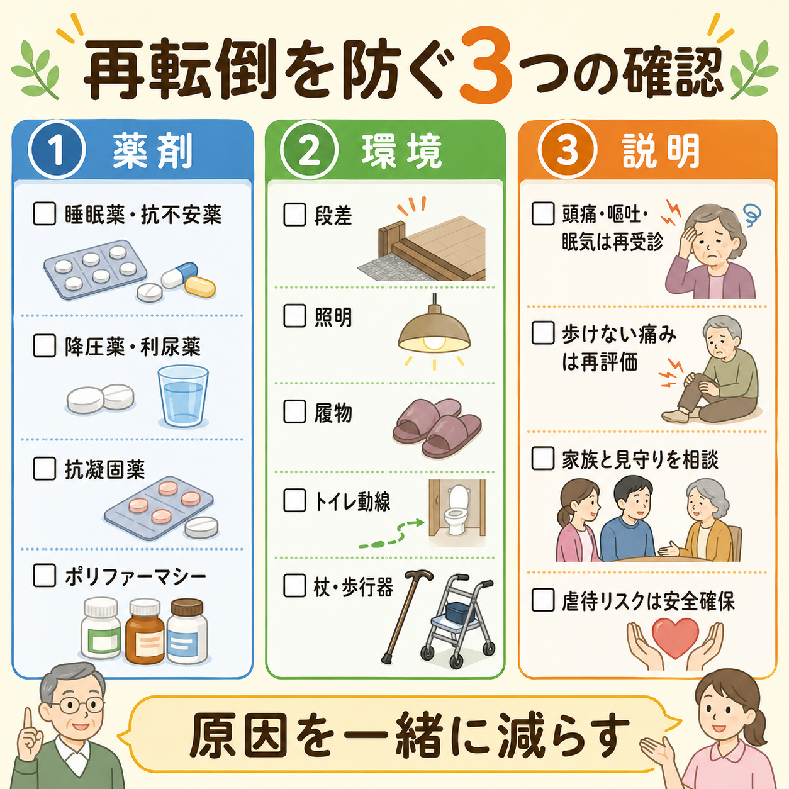

---
title: "転倒高齢者を救急外来でどう評価するか"
description: "外傷だけで終わらせず、失神、感染、薬剤、環境要因、虐待リスクまで同時に評価する。"
aliases:
  - "高齢者転倒の救急評価"
tags:
  - 領域/救急・初期対応
  - 種類/クリニカルクエスチョン
  - 対象/研修医
question: "転倒高齢者を救急外来でどう評価するか"
clinical_area: "救急・初期対応"
audience: "研修医"
evidence_level: "mixed"
created: "2026-04-27"
updated: "2026-04-27"
enableToc: true
---

# 転倒高齢者を救急外来でどう評価するか

> このノートは研修医教育のための一般的整理であり、個別患者への診断・治療指示ではありません。緊急性が高い、判断に迷う、施設方針が関わる場合は上級医・専門科に相談してください。

## クリニカルクエスチョン

転倒高齢者を救急外来で診たとき、外傷評価だけで終わらせず、失神、感染、薬剤、環境要因、虐待リスクまでどう評価するか。

## まず結論

- 高齢者の転倒は「外傷」かつ「転倒した理由を探す内科・老年医学的イベント」として扱う。NICE は包括的転倒評価に、心血管評価、臥位・立位血圧、認知・気分、視力、歩行・バランス、薬剤、住環境などを含めることを推奨している[1]。
- まず ABCDE、意識、バイタル、痛み、出血、抗凝固薬・抗血小板薬、頭部打撲、頸椎痛、股関節痛を確認する。高齢者では軽微な転倒でも頭蓋内出血、頸椎損傷、大腿骨近位部骨折を見逃しやすい[4],[5]。
- 「つまずいた」だけに見えても、失神、不整脈、起立性低血圧、感染、脱水、低血糖、貧血、薬剤性ふらつきを同時に探す。失神が疑われる場合は病歴、身体診察、立位血圧、12誘導心電図が初期評価の基本である[6]。
- 睡眠薬、抗不安薬、抗精神病薬、抗コリン薬、降圧薬、利尿薬、オピオイド、抗凝固薬は、転倒の原因・転倒後合併症の両方に関わる。AGS Beers Criteria と日本老年医学会ガイドラインは、高齢者でのベンゾジアゼピン系薬・Z-drug などを慎重に扱うよう示している[7],[8]。
- 帰宅可否は「画像が陰性」だけで決めない。歩行能力、疼痛コントロール、見守り、認知機能、再転倒リスク、虐待・ネグレクト、再受診説明まで確認する[1],[2],[3],[9]。

## 判断の型

1. **外傷の重症度を先に切る**  
   ABCDE、意識障害、出血、ショック、疼痛部位、神経所見を確認し、頭部・頸椎・胸腹部・骨盤・股関節を優先して評価する。
2. **「なぜ転んだか」を同時に聞く**  
   転倒前の胸痛、動悸、息切れ、めまい、失神、発熱、食思不振、排尿症状、下痢、服薬変更、飲酒、夜間トイレ、足元環境を確認する[1],[6]。
3. **薬剤と基礎疾患を原因候補に入れる**  
   睡眠薬・抗不安薬、抗精神病薬、抗コリン薬、降圧薬、利尿薬、血糖降下薬、オピオイド、抗凝固薬、抗血小板薬をリスト化する[7],[8],[10]。
4. **歩けるか、帰れるかを最後に再評価する**  
   痛み止め後も歩けない、いつものADLから落ちている、独居で見守りがない、認知症・せん妄がある、虐待・ネグレクトが疑わしい場合は、観察・入院・地域連携を検討する[1],[3],[9]。

## 初期対応

- **第一印象と ABCDE**: 気道、呼吸、循環、意識、低体温、活動性出血を確認する。高齢者は頻脈や発熱が目立たないことがあり、普段の血圧や抗凝固薬の有無も重視する。
- **外傷部位の固定と鎮痛**: 頸椎痛、神経症状、頭部打撲、股関節痛、骨盤痛があれば、動かす前に保護する。痛みが強いとせん妄・歩行評価不能につながるため、腎機能や呼吸状態を考慮して鎮痛する。
- **最低限の情報を早く集める**: 転倒時刻、目撃者、転倒前後の記憶、意識消失、頭部打撲、抗凝固薬、既往、普段の歩行、独居か、介護サービス、家族連絡先を確認する。
- **失神らしさを探す**: 前駆症状なしの突然転倒、仰臥位・労作時、動悸、胸痛、心疾患既往、心電図異常、低血圧、貧血、出血、脱水があればリスクが高い[6]。
- **感染・代謝を探す**: 発熱だけでなく、低体温、頻呼吸、食思不振、尿路症状、咳嗽、皮膚感染、低血糖、電解質異常、腎機能悪化を確認する。

## 鑑別・見逃し

| 優先度 | 見逃したくない病態 | 手がかり | 初期対応の方向 |
|---|---|---|---|
| 高 | 頭蓋内出血・頭部外傷 | 頭部打撲、意識障害、嘔吐、頭痛、抗凝固薬・抗血小板薬、認知症で病歴不明 | 頭部CT適応を検討し、帰宅時は遅発性出血の説明を行う[4],[5] |
| 高 | 頸椎損傷 | 頸部痛、神経症状、酩酊、意識障害、痛みで評価困難 | 頸椎保護、画像検査、整形外科・脳神経外科相談 |
| 高 | 大腿骨近位部骨折・骨盤骨折 | 股関節痛、鼠径部痛、歩行不能、外旋短縮、骨粗鬆症 | X線、必要時CT/MRI、鎮痛、整形外科相談 |
| 高 | 失神・不整脈・ACS | 前駆症状なし、動悸、胸痛、労作時、心疾患既往、心電図異常 | 12誘導心電図、モニター、採血、入院・循環器相談[6] |
| 中 | 起立性低血圧・脱水 | 立位でふらつく、食思不振、利尿薬、下痢、発汗、脱水所見 | 臥位・立位血圧、補液適応、薬剤見直し[1],[6] |
| 中 | 感染症・せん妄 | 発熱または低体温、頻呼吸、急な認知変化、尿路・肺炎・皮膚感染 | 感染巣検索、せん妄誘因除去、必要時抗菌薬 |
| 中 | 薬剤性転倒 | 睡眠薬、抗不安薬、抗精神病薬、抗コリン薬、降圧薬、利尿薬、オピオイド | 服薬照合、処方医への情報提供、減量・中止候補の整理[7],[8],[10] |
| 中 | 虐待・ネグレクト | 説明と合わない外傷、受診遅れ、複数時期のあざ、栄養不良、不衛生、介護者の説明不一致 | 安全確保、院内相談、地域包括支援センター・市町村への相談[9] |

## 検査

| 検査 | 目的 | 注意点 |
|---|---|---|
| バイタル再測定・SpO2・体温 | 悪化、低体温、感染、ショックの拾い上げ | 初回正常でも疼痛・出血・感染で変化する |
| 臥位・立位血圧 | 起立性低血圧、脱水、薬剤性低血圧 | 立位不能なら無理に実施しない。安全確保を優先 |
| 12誘導心電図 | 失神、不整脈、ACS、QT延長 | 失神疑いでは基本検査。必要時モニターへ[6] |
| 血糖 | 低血糖・高血糖 | 糖尿病薬、食事摂取低下、意識障害で優先 |
| 血算、電解質、腎機能、肝機能 | 貧血、感染、脱水、薬剤調整 | 抗凝固薬・鎮痛薬・造影検査の判断にも関わる |
| CRP、尿検査、胸部画像など | 感染巣検索 | 検査だけでなく症状・身体所見で絞る |
| 頭部CT | 頭蓋内出血評価 | 抗凝固薬・抗血小板薬、意識障害、頭痛、嘔吐、神経症状では閾値を下げる[4],[5] |
| X線・CT・MRI | 骨折、頸椎損傷、骨盤損傷 | X線陰性でも歩けない股関節痛では潜在骨折を考える |

## 治療・マネジメント

- **外傷治療**: 出血制御、創処置、固定、鎮痛、破傷風対応、整形外科・脳神経外科相談を行う。抗凝固薬内服中で頭部外傷がある場合、画像適応と観察方針を上級医と確認する[4],[5]。
- **原因治療**: 低血糖、脱水、感染、貧血、不整脈、ACS、起立性低血圧を見つけたら、それぞれの初期対応へ進む。転倒後の処置だけで原因を放置しない。
- **薬剤見直し**: 睡眠薬・抗不安薬・抗精神病薬・抗コリン薬・降圧薬・利尿薬・オピオイド・血糖降下薬は、転倒リスクと継続理由を確認する[7],[8]。
- **日本での注意**: 日本老年医学会の「高齢者の安全な薬物療法ガイドライン2015」は国内処方実態に即した慎重投与リストを提示している[8]。PMDAの添付文書検索で確認できるゾルピデム製剤の添付文書にも、ふらつき・眠気・転倒や高齢者の骨折例への注意が記載される[10]。救急外来単独で慢性薬を大きく変えるより、処方医・薬剤師・地域連携へ「転倒後なので見直し候補」と明確に伝える。
- **帰宅支援**: 歩行再評価、トイレ動線、履物、杖・歩行器、夜間照明、家族の見守り、再受診基準を確認する。CDC STEADI は、転倒リスクを Screen、Assess、Intervene の流れで整理する実装ツールを提供している[3]。
- **虐待・ネグレクト対応**: 不自然な外傷、説明不一致、受診遅れ、介護放棄が疑われる場合は、患者本人の安全を優先し、院内の医療安全・MSW・地域連携部門と相談する。厚労省マニュアルは早期発見、迅速で適切な対応、再発防止を目的としている[9]。

## 図解

## 指導医に確認するポイント

- 頭部CT、頸椎画像、股関節CT/MRIの適応をどこまで広げるか。
- 抗凝固薬・抗血小板薬内服中の頭部外傷で、観察入院・帰宅・再診説明をどうするか。
- 失神疑いとして扱うべき病歴・心電図所見・入院基準は何か。
- 歩けないがX線陰性の股関節痛を、どの時点で潜在骨折として追加画像に進めるか。
- 睡眠薬、降圧薬、利尿薬、抗凝固薬を救急外来で変更するか、処方医へ申し送るか。
- 虐待・ネグレクト疑いで、院内の誰に、どのタイミングで相談するか。

## 患者説明

- 「骨折や頭の出血がないかを確認しながら、なぜ転んだかも一緒に調べます。高齢の方では、感染、脱水、血圧、心臓、薬の影響で転ぶことがあります。」
- 「今日は問題が見つからなくても、頭痛、嘔吐、強い眠気、会話がおかしい、片側の手足が動きにくい、歩けない痛みが出た場合は再受診してください。」
- 「睡眠薬、血圧の薬、利尿薬、血をさらさらにする薬は、転倒や転倒後の出血に関わることがあります。自己判断で中止せず、処方医と見直しましょう。」
- 「家の段差、照明、履物、トイレまでの動線、杖や歩行器を家族と一緒に確認してください。」

## ピットフォール

- 「本人がつまずいたと言った」だけで失神・感染・薬剤性を除外する。
- 頭部打撲が軽そう、あるいは認知症で訴えが乏しいために、抗凝固薬や神経所見の確認を省く。
- 股関節X線が陰性という理由だけで、歩けない疼痛を帰宅にする。
- 鎮痛不足のまま歩行評価し、「歩けない」と判断する、または逆に痛みを過小評価する。
- 睡眠薬・抗不安薬・降圧薬・利尿薬の最近の追加や増量を聞かない。
- 独居、見守り不足、虐待・ネグレクト、受診遅れを医学的問題と切り離して扱う。

## 関連ノート

- 現時点で確認済みの関連ノートはありません。
- 関連ノート候補: 「失神とけいれんをどう見分けるか」「高齢者の意識障害でせん妄と器質疾患をどう見分けるか」「抗凝固薬内服中の頭部外傷をどう評価するか」「大腿骨近位部骨折をどう見逃さないか」

## MOC更新候補

- [[MOC｜救急・初期対応]]
- MOC｜外科・整形・皮膚.md（本サイト外）
- MOC｜薬剤・処方・副作用.md（本サイト外）
- MOC｜医療安全・法律・倫理.md（本サイト外）

## 参考文献

[1] National Institute for Health and Care Excellence. Falls: assessment and prevention in older people and in people 50 and over at higher risk. NICE guideline NG249. 2025. https://www.nice.org.uk/guidance/ng249

[2] Montero-Odasso M, van der Velde N, Martin FC, et al. World guidelines for falls prevention and management for older adults: a global initiative. Age Ageing. 2022;51(9):afac205. https://doi.org/10.1093/ageing/afac205

[3] Centers for Disease Control and Prevention. STEADI: Older Adult Fall Prevention. https://www.cdc.gov/steadi/

[4] National Institute for Health and Care Excellence. Head injury: assessment and early management. NICE guideline NG232. 2023. https://www.nice.org.uk/guidance/ng232

[5] American College of Emergency Physicians Clinical Policies Subcommittee. Clinical Policy: Critical Issues in the Management of Adult Patients Presenting to the Emergency Department With Mild Traumatic Brain Injury. Ann Emerg Med. 2023;81(5):e63-e105. https://doi.org/10.1016/j.annemergmed.2023.01.014

[6] Brignole M, Moya A, de Lange FJ, et al. 2018 ESC Guidelines for the diagnosis and management of syncope. Eur Heart J. 2018;39(21):1883-1948. https://doi.org/10.1093/eurheartj/ehy037

[7] American Geriatrics Society Beers Criteria Update Expert Panel. American Geriatrics Society 2023 updated AGS Beers Criteria for potentially inappropriate medication use in older adults. J Am Geriatr Soc. 2023;71(7):2052-2081. https://doi.org/10.1111/jgs.18372

[8] 日本老年医学会. 高齢者の安全な薬物療法ガイドライン2015. https://www.jpn-geriat-soc.or.jp/publications/other/pharmacotherapy_guideline_2015.html

[9] 厚生労働省. 市町村・都道府県における高齢者虐待への対応と養護者支援について（国マニュアル）. https://www.mhlw.go.jp/stf/seisakunitsuite/bunya/0000200478_00004.html

[10] 医薬品医療機器総合機構（PMDA）. 医療用医薬品情報検索（添付文書、患者向医薬品ガイド等）. https://www.pmda.go.jp/PmdaSearch/iyakuSearch/

## 更新ログ

- 2026-04-27: 初版作成。NICE、World falls guideline、CDC STEADI、ACEP、ESC、日本老年医学会、厚生労働省、PMDAを確認し、図解3点を追加。
