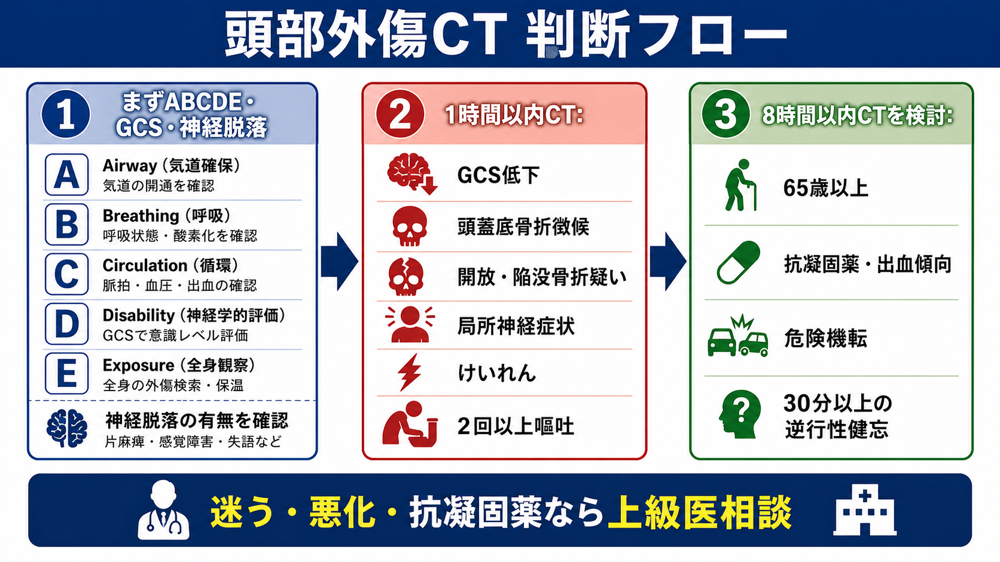
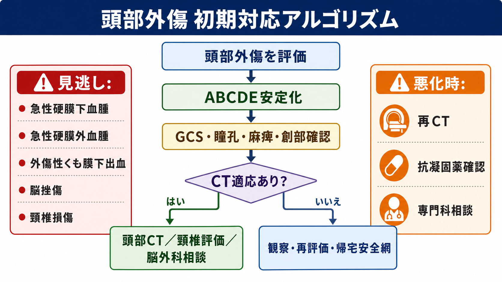
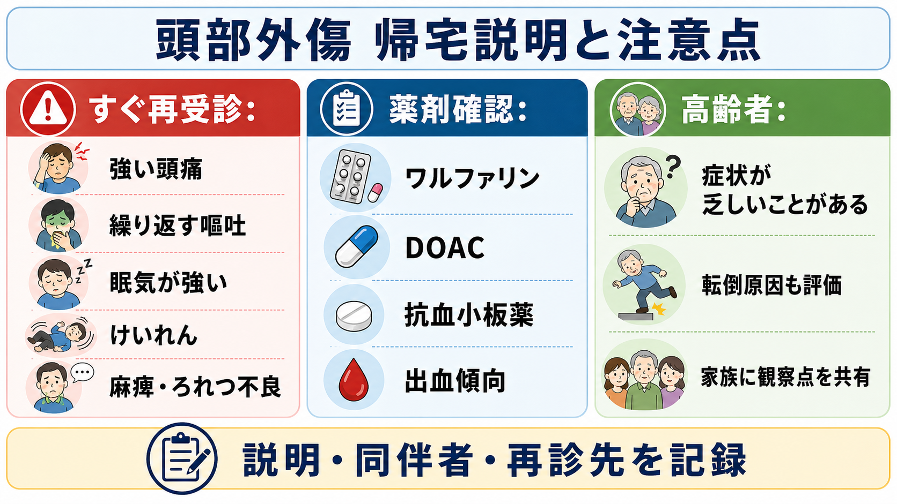

---
title: "頭部外傷患者でCTを撮るべき条件は何か"
description: "意識障害、嘔吐、抗凝固薬、高齢者、外傷機転から頭蓋内出血リスクを評価し、頭部CTと観察・相談の閾値を整理する。"
aliases:
  - "頭部外傷CT適応"
tags:
  - 領域/救急・初期対応
  - 種類/クリニカルクエスチョン
  - 対象/研修医
question: "頭部外傷患者でCTを撮るべき条件は何か"
clinical_area: "救急・初期対応"
audience: "研修医"
evidence_level: "guideline"
created: "2026-04-27"
updated: "2026-04-27"
enableToc: true
---

# 頭部外傷患者でCTを撮るべき条件は何か

> このノートは研修医教育のための一般的整理であり、個別患者の診断・治療指示ではありません。緊急性が高い、判断に迷う、施設方針が関わる場合は上級医・専門科に相談してください。

## クリニカルクエスチョン

頭部外傷患者でCTを撮るべき条件は何か。

意識障害、嘔吐、抗凝固薬、高齢者、外傷機転から頭蓋内出血リスクを評価し、救急外来で「今すぐCT」「観察しながらCTを検討」「帰宅安全網」をどう分けるかを整理する。

## まず結論

- 頭部外傷では、まずABCDE、GCS、瞳孔、局所神経症状、頸椎保護、創部・骨折徴候を確認する。生理学的に不安定、GCS低下、神経脱落があれば、CT適応の細かいルールより先に蘇生、モニター、上級医・脳神経外科相談を並行する[1],[2]。
- 成人では、GCS 13未満、初期GCS 13または14、受傷後2時間でGCS 15に戻らない、頭蓋底骨折徴候、開放・陥没骨折疑い、局所神経症状、外傷後けいれん、2回以上の嘔吐は、原則として頭部CTを急ぐ所見である[3],[5]。
- 意識消失または健忘がある成人で、65歳以上、出血傾向・抗凝固薬、危険機転、30分以上の逆行性健忘があれば、CTを撮る閾値を下げる[3],[5]。
- 抗凝固薬・抗血小板薬内服中の軽症頭部外傷では、CCHRなどの臨床判断ルールだけでCT不要と判断しない。初回CT陰性で神経所見が基準状態なら、ルーチンの再CTや入院観察は必須ではないが、施設方針と再受診説明が重要である[4]。
- 「CTを撮らない」判断は、軽症という印象ではなく、危険因子がないこと、症状が改善・安定していること、同伴者や再受診先を含む安全網があることまで確認して初めて成立する[7]。

## 判断の型

1. **最初に重症頭部外傷として扱うべきかを見る**  
   気道、呼吸、循環、意識、体温、外出血、頸椎損傷を評価する。GCS低下、瞳孔不同、片麻痺、けいれん、ショック、多発外傷、開放創や陥没骨折疑いがあれば、頭部CT、頸椎評価、脳神経外科相談を早める[1],[2]。

2. **成人のCT危険因子をチェックする**  
   NICEやCanadian CT Head Ruleでは、GCSが戻らない、頭蓋骨骨折徴候、頭蓋底骨折徴候、2回以上の嘔吐、65歳以上、危険機転、30分以上の逆行性健忘が重要なCT適応として整理される[3],[5]。
   NEXUS Head CTは別の選択肢だが、ACEPはCCHRの方が特異度の面で不要なCTを減らしやすい可能性を示しているため、施設で採用しているルールを確認する[4],[6]。

3. **判断ルールの対象外を先に分ける**  
   抗凝固薬・抗血小板薬、出血素因、妊娠、小児、穿通外傷、明らかな開放頭蓋骨骨折、多発外傷、受傷機転不明、薬物・アルコール中毒で診察信頼性が低い場合は、通常の軽症頭部外傷ルールをそのまま当てはめない[4],[5]。

4. **CT陰性後の方針を決める**  
   CT陰性でも症状が悪化する、GCSが下がる、反復嘔吐、頭痛増悪、神経症状、けいれん、抗凝固薬内服、同伴者なし、再診困難があれば観察・再評価・上級医相談を検討する[4],[7]。

5. **日本での注意を確認する**  
   日本では、日本脳神経外科学会・日本脳神経外傷学会監修の頭部外傷治療・管理のガイドラインが、画像診断、高齢者頭部外傷、軽症・中等症頭部外傷、抗凝固薬・抗血小板薬の影響を扱う国内の主要資料である[1]。CT撮像、脳外科コール、抗凝固薬中和、観察入院、救急搬送先選定は施設差が大きいため、院内プロトコルを優先して確認する。

## 初期対応

- **ABCDEと頸椎保護**: 頭部外傷は単独外傷とは限らない。気道閉塞、低酸素、低血圧は二次性脳損傷につながるため、CT室へ急ぐ前に安定化を図る[1],[2]。
- **GCSと神経所見を時刻付きで記録する**: 初回GCS、2時間後のGCS、瞳孔、麻痺、感覚障害、失語・構音障害、失調、けいれん、頭痛・嘔吐の回数を残す。あとで「悪化したか」を判断できる形にする。
- **受傷機転を具体化する**: 転倒か、階段からの転落か、歩行者・自転車対自動車か、車外放出か、高エネルギー外傷か、飲酒や薬剤の関与があるかを確認する[3],[5]。
- **薬剤と出血素因を確認する**: ワルファリン、DOAC、抗血小板薬、血液疾患、肝疾患、透析、抗がん薬などを確認し、ワルファリンではPT-INR、DOACでは最終内服時刻・腎機能・薬剤名を確認する[4],[8],[9]。
- **帰宅候補でも観察を入れる**: 症状が進行していないか、鎮痛後に神経所見が隠れていないか、同伴者がいるか、再受診先を理解しているかを確認する[7]。

## 鑑別・見逃し

| 優先度 | 疾患・状態 | 見逃さない理由 | 手がかり |
|---|---|---|---|
| 高 | 急性硬膜下血腫 | 高齢者・抗凝固薬で重症化しやすく、意識清明でも悪化しうる | GCS低下、頭痛増悪、片麻痺、瞳孔不同、抗凝固薬、高エネルギー外傷[1],[4] |
| 高 | 急性硬膜外血腫 | 初期に会話可能でも急変することがある | 側頭部打撲、意識消失後の清明期、頭蓋骨骨折、瞳孔不同 |
| 高 | 外傷性くも膜下出血・脳挫傷 | CTで検出され、観察・入院判断に影響する | 頭痛、嘔吐、意識障害、けいれん、局所神経症状 |
| 高 | 頭蓋骨骨折・頭蓋底骨折 | 髄液漏、感染、血管損傷、頭蓋内出血の手がかりになる | Battle徴候、パンダ眼、髄液鼻漏・耳漏、血鼓室、開放創[3] |
| 高 | 頸椎・脊髄損傷 | 頭部外傷に合併し、移動で悪化しうる | 頸部痛、しびれ、四肢脱力、高齢、危険機転、多発外傷[3] |
| 中 | 脳振盪 | CTで異常がなくても症状が残る | 頭痛、めまい、集中困難、健忘、睡眠変化、光過敏[7] |
| 中 | 転倒原因 | 高齢者では頭部外傷の背景に内因性疾患がある | 失神、不整脈、低血糖、感染、起立性低血圧、薬剤性ふらつき |

## 検査

| 検査 | 目的 | 注意点 |
|---|---|---|
| 頭部単純CT | 急性頭蓋内出血、脳挫傷、頭蓋骨骨折の評価 | CT適応はGCS、嘔吐、神経症状、骨折徴候、年齢、抗凝固薬、機転で判断する[3]-[5] |
| 頸椎CT・頸椎画像 | 頭部外傷に伴う頸椎損傷の評価 | 高齢、危険機転、神経症状、頸部痛、多発外傷では閾値を下げる[3] |
| 血糖 | 意識障害の可逆的原因を拾う | 外傷だけで説明しない。低血糖はすぐ補正対象 |
| 採血・凝固 | 出血素因、貧血、腎機能、抗凝固薬対応の確認 | ワルファリンではPT-INR、DOACでは腎機能・最終内服時刻が実務上重要[8],[9] |
| 心電図・内因性評価 | 転倒・失神の原因検索 | 高齢者、転倒状況不明、前失神症状、動悸、胸痛では検討 |
| 再診察・観察 | 遅れて出る意識障害・嘔吐・神経症状を拾う | 画像だけで安全宣言にしない。症状悪化なら再評価・再CTを検討[4],[7] |

## 治療・マネジメント

- **CTを急ぐ条件**: 成人では、GCS 13未満、初期GCS 13または14、受傷後2時間でGCS 15未満、頭蓋底骨折徴候、開放・陥没骨折疑い、局所神経症状、外傷後けいれん、2回以上の嘔吐があれば、頭部CTを急ぐ[3],[5]。
- **CTを強く検討する条件**: 意識消失または健忘があり、65歳以上、出血傾向・抗凝固薬、危険機転、30分以上の逆行性健忘がある場合は、CTを撮る方向で上級医と確認する[3],[5]。
- **抗凝固薬・抗血小板薬**: ACEP 2023は、抗凝固薬またはアスピリン単剤以外の抗血小板薬内服中では、臨床判断ルールだけでCT不要と判定しないよう推奨している[4]。PMDA添付文書でも、ワルファリンやアピキサバンなどは重大な出血に注意すべき薬剤として扱われる[8],[9]。
- **CT陰性後**: 抗凝固薬・抗血小板薬内服中でも、神経学的に基準状態で初回CTに出血がなければ、ACEPはルーチンの再CTや入院観察を必須とはしていない[4]。ただし、日本では夜間の再診アクセス、同伴者、院内プロトコル、脳外科体制により運用が変わる。
- **帰宅説明**: 頭痛増悪、繰り返す嘔吐、眠気が強く起こせない、けいれん、麻痺・しびれ、ろれつ不良、混乱、片側の瞳孔散大、異常行動はすぐ再受診するよう説明する[7]。
- **日本での注意**: DOAC中和薬、プロトロンビン複合体製剤、ビタミンK、輸血、脳外科手術適応は、薬剤名、最終内服、腎機能、出血の有無、施設採用薬、保険・院内手順に左右される。研修医単独で中和や休薬を決めず、上級医・脳神経外科・救急科に確認する。

## 図解

## 指導医に確認するポイント

- この患者は軽症頭部外傷の判断ルールの対象に入るか、それとも抗凝固薬、多発外傷、妊娠、小児、穿通外傷などで対象外か。
- CTを「今すぐ」撮る所見があるか、観察しながら撮像判断でよいか。
- 抗凝固薬・抗血小板薬の薬剤名、最終内服、腎機能、PT-INR、血小板数をどう評価するか。
- CT陰性後に帰宅できるか、観察延長・入院・再CT・脳外科相談が必要か。
- 頸椎画像、転倒原因検索、社会的安全網、家族説明をどこまで行うか。

## 患者説明

- 「頭をぶつけたあと、頭の中の出血がないかを症状、診察、薬、年齢、けがの強さから判断しています。」
- 「今すぐ危険な所見があればCTを撮ります。所見が乏しくても、血をサラサラにする薬、高齢、強い機転、繰り返す嘔吐がある場合は検査や観察の必要性が上がります。」
- 「CTで大きな出血が見つからなくても、まれにあとから症状が強くなることがあります。強い頭痛、繰り返す嘔吐、眠気が強い、けいれん、麻痺、ろれつが回らない、様子がおかしい時はすぐ受診してください。」
- 「帰宅する場合は、できれば同伴者と一緒に過ごし、薬の内容と再受診先を確認しておきましょう。」

## ピットフォール

- GCS 15だけでCT不要と判断する。嘔吐、65歳以上、抗凝固薬、危険機転、健忘、頭蓋底骨折徴候を別に確認する。
- 「酔っているから」「認知症だから」と意識障害や健忘を説明してしまう。診察信頼性が低い場合は観察・CT・相談の閾値を下げる。
- 抗凝固薬内服中にCCHRなどのルールだけで除外する。ACEPはこの集団で判断ルールのみの除外を推奨していない[4]。
- CT陰性で説明なしに帰す。遅発性出血はまれでも、再受診症状と同伴者への説明は必要である[4],[7]。
- 頭部CTだけに集中し、頸椎損傷、多発外傷、転倒原因、虐待・暴力、薬剤性転倒を見逃す。

## 関連ノート

- [[救急外来で見逃してはいけないレッドフラッグをどう拾うか]]
- [[意識障害患者で頭部CTを急ぐべき所見は何か]]
- [[意識障害患者を見たら最初に何を確認するか]]
- [[救急患者の帰宅可否はどう判断するか]]
- [[高齢者の意識障害でせん妄と器質疾患をどう見分けるか]]

## MOC更新候補

- [[MOC｜救急・初期対応]]
- MOC｜神経.md（本サイト外）
- MOC｜薬剤・処方・副作用.md（本サイト外）

## 参考文献

[1] 日本脳神経外科学会・日本脳神経外傷学会 監修, 頭部外傷治療・管理のガイドライン作成委員会 編集. 頭部外傷治療・管理のガイドライン 第4版. 医学書院, 2019. https://www.igaku-shoin.co.jp/book/detail/89453

[2] 日本外傷学会・日本救急医学会 監修, 日本外傷学会外傷初期診療ガイドライン改訂第6版編集委員会 編集. 外傷初期診療ガイドラインJATEC 改訂第6版. へるす出版, 2021. https://www.molcom.jp/products/detail/143545/

[3] National Institute for Health and Care Excellence. Head injury: assessment and early management. NICE guideline NG232. 2023. https://www.nice.org.uk/guidance/NG232/chapter/recommendations

[4] American College of Emergency Physicians Clinical Policies Subcommittee (Writing Committee) on Mild Traumatic Brain Injury, et al. Clinical Policy: Critical Issues in the Management of Adult Patients Presenting to the Emergency Department With Mild Traumatic Brain Injury. Ann Emerg Med. 2023;81(5):e63-e105. https://doi.org/10.1016/j.annemergmed.2023.01.014

[5] Stiell IG, Wells GA, Vandemheen K, et al. The Canadian CT Head Rule for patients with minor head injury. Lancet. 2001;357(9266):1391-1396. https://doi.org/10.1016/S0140-6736(00)04561-X

[6] Mower WR, Gupta M, Rodriguez R, Hendey GW. Validation of the sensitivity of the National Emergency X-Radiography Utilization Study Head CT decision instrument for selective imaging of blunt head injury patients. PLoS Med. 2017;14(7):e1002313. https://doi.org/10.1371/journal.pmed.1002313

[7] Centers for Disease Control and Prevention. Symptoms of Mild TBI and Concussion. 2025. https://www.cdc.gov/traumatic-brain-injury/signs-symptoms/index.html

[8] PMDA. 医療用医薬品情報 エリキュース錠2.5mg／エリキュース錠5mg（アピキサバン）. 2026年3月6日版. https://www.pmda.go.jp/PmdaSearch/rdSearch/02/3339004F2025?user=1

[9] PMDA. 医療用医薬品情報 ワーファリン錠0.5mg／1mg／5mg／顆粒0.2％（ワルファリンカリウム）. 2026年4月1日版. https://www.pmda.go.jp/PmdaSearch/rdSearch/02/3332001D1023?user=1

## 更新ログ

- 2026-04-27: 初版作成。
