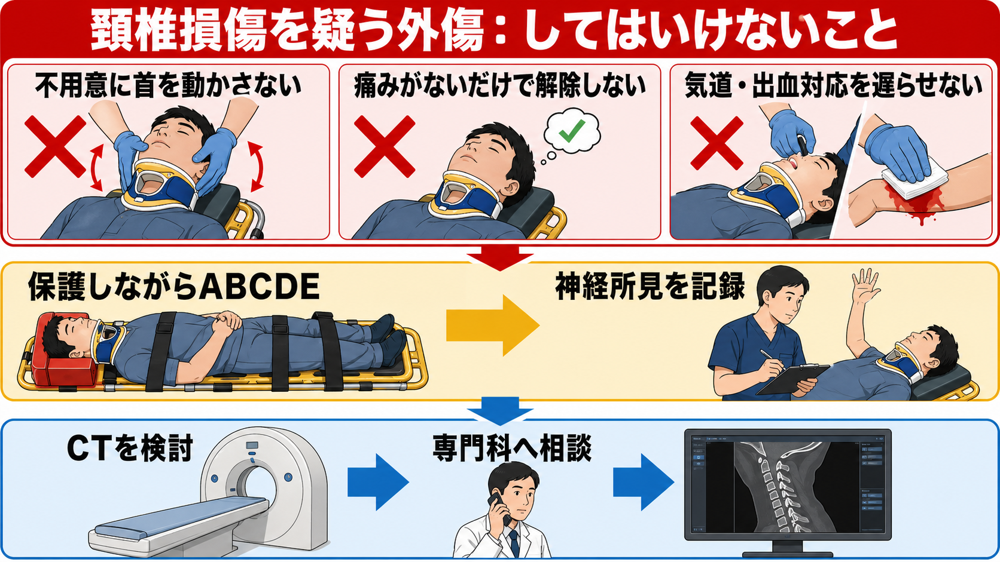
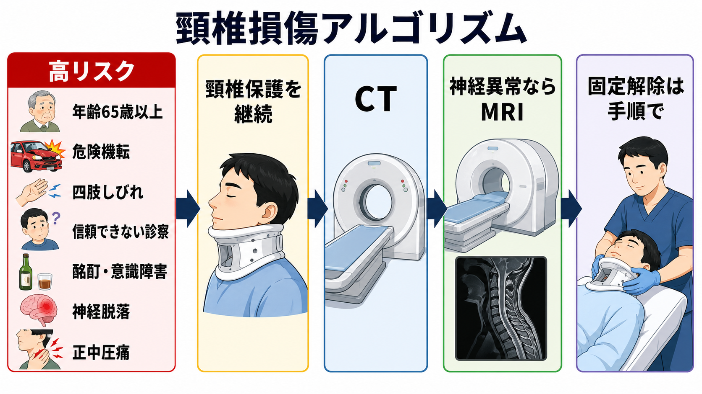
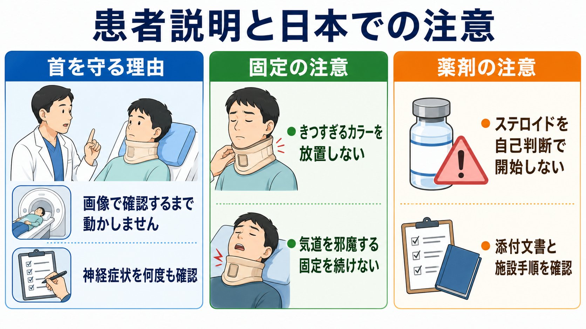

---
title: "頸椎損傷を疑う外傷では何をしてはいけないか"
description: "不用意な頸部運動を避け、頸椎保護、神経所見、画像評価、固定解除の基本を整理する。"
aliases:
  - "頸椎損傷疑いの禁忌"
tags:
  - 領域/救急・初期対応
  - 種類/クリニカルクエスチョン
  - 対象/研修医
question: "頸椎損傷を疑う外傷では何をしてはいけないか"
clinical_area: "救急・初期対応"
audience: "研修医"
evidence_level: "mixed"
created: "2026-04-27"
updated: "2026-04-27"
enableToc: true
---

# 頸椎損傷を疑う外傷では何をしてはいけないか

> このノートは研修医教育のための一般的整理であり、個別患者への診断・治療指示ではありません。緊急性が高い、判断に迷う、施設方針が関わる場合は上級医・救急科・整形外科・脳神経外科に相談してください。

## クリニカルクエスチョン

頸椎損傷を疑う外傷では、不用意な頸部運動を避けながら、何をしてはいけないか、何を優先して評価するか。

## まず結論

- **不用意に首を動かさない。** 高エネルギー外傷、頸部痛、正中圧痛、四肢しびれ・麻痺、意識障害、酩酊、 distracting injury では、評価が終わるまで頸椎保護を続ける。[1],[2]
- **頸椎保護を理由に、気道確保・止血・ショック対応を遅らせない。** 外傷初期診療は `<C>ABCDE` を優先し、気道介入時も manual in-line stabilization を保つ。[1],[2]
- **「痛くない」「動かせる」「単純X線が大丈夫そう」だけで解除しない。** 成人の画像適応は Canadian C-spine rule や NEXUS の前提を満たすか確認し、高リスクや信頼できない診察ではCTを検討する。[2]-[5]
- **神経所見を取らずに搬送・鎮静・固定解除へ進まない。** 運動、感覚、しびれ、膀胱直腸障害、呼吸状態を初回と経時で記録する。[1],[2]
- **きつすぎるカラーや不適切な固定を放置しない。** 固定は必要だが、気道障害、疼痛増悪、神経症状悪化、皮膚障害を起こす方法は見直す。[2],[6]
- **急性脊髄損傷疑いにステロイドを自己判断で開始しない。** 日本の添付文書には受傷後8時間以内の急性脊髄損傷への適応がある一方、国際的には弱い推奨の「選択肢」であり、感染・消化管出血・高血糖などを踏まえて専門科と判断する。[8],[9]

## 判断の型

1. **まず外傷全体の重症度を見る。** 大出血、気道閉塞、呼吸不全、ショック、意識障害を見つけたら、頸椎保護を保ちながら蘇生を進める。[1],[2]
2. **頸椎損傷を疑う条件を拾う。** 危険機転、65歳以上、四肢しびれ、頸部正中圧痛、神経脱落、意識障害、酩酊、強い別部位疼痛、コミュニケーション困難があれば、低リスク扱いにしない。[2]-[5]
3. **診察が信頼できるかを判定する。** GCS低下、鎮静、酩酊、認知症、言語障害、激痛、挿管中では、痛みや可動域の申告に依存しない。[2],[4],[5]
4. **画像と固定解除を分けて考える。** 成人で画像適応があれば頸椎CTを軸にし、神経異常がある場合はCT後のMRIや専門科評価を考える。[2],[6]
5. **固定解除は施設手順で行う。** 画像、神経所見、意識状態、疼痛、読影者、専門科判断がそろう前に、研修医単独で解除しない。

## 初期対応

- **人手を集める:** 頸椎保護、気道、モニター、点滴、脱衣、ログロール、搬送には人手が必要である。単独で頭頸部を動かして観察しない。
- **Manual in-line stabilization:** 気道評価、バッグ換気、挿管、嘔吐対応、移乗、ログロールでは、頭部と体幹を一直線に保つ担当を置く。[1],[2]
- **カラーは目的ではなく手段:** サイズ不適合、短頸、強直性脊椎炎などの変形、気道障害、強い不穏では、無理に標準姿勢へ矯正しない。現在の楽な位置で用手保持し、上級医と固定方法を調整する。[2]
- **神経所見:** 両上肢・両下肢の運動、感覚、しびれ、痛み、膀胱直腸障害、呼吸筋障害を確認し、悪化があれば時刻つきで共有する。
- **鎮痛・鎮静:** 痛みや不穏が固定を妨げる場合、呼吸・循環・神経評価への影響を考えて上級医と薬剤を選ぶ。鎮静前の神経所見記録を忘れない。

## 鑑別・見逃し

| 優先度 | 疾患・状態 | 見逃せない理由 | 手がかり |
|---|---|---|---|
| 高 | 不安定頸椎損傷 | 不用意な運動で二次性脊髄損傷につながる | 危険機転、正中圧痛、神経症状、変形、高齢者 |
| 高 | 急性脊髄損傷 | 呼吸不全、自律神経障害、不可逆的障害につながる | 四肢麻痺・しびれ、感覚障害、尿閉、低血圧・徐脈 |
| 高 | 頭部外傷・頭蓋内出血 | 意識障害で頸部痛を訴えられず、抗凝固薬で悪化する | 頭部打撲、嘔吐、GCS低下、片麻痺、抗血栓薬 |
| 高 | 気道損傷・顔面外傷 | 固定に気を取られると窒息を見逃す | 嗄声、血液・嘔吐、顔面骨折、頸部腫脹 |
| 高 | 胸腹部・骨盤の大量出血 | 頸椎だけに集中すると preventable trauma death につながる | ショック、腹部膨満、骨盤痛、FAST陽性、低体温 |
| 中 | 中心性脊髄損傷 | 高齢者の過伸展で骨折が目立たないことがある | 下肢より上肢優位の筋力低下、手のしびれ |
| 中 | 強直性脊椎炎など脊椎強直 | 軽微外傷でも不安定骨折になり、通常の仰臥位固定で悪化し得る | 亀背、長期腰背部痛、既往、通常姿勢からの矯正困難 |
| 中 | 酩酊・薬物・せん妄 | 痛みや可動域評価が信頼できない | 飲酒、薬剤、興奮、記憶欠落、説明不一致 |

## 検査

| 検査 | 目的 | 注意点 |
|---|---|---|
| バイタル・ABCDE | 生命危機と搬送可否を判断する | 頸椎損傷だけに固定せず、出血・気道・呼吸を同時に見る。[1] |
| 神経診察 | 脊髄損傷と経時変化を拾う | 鎮静、挿管、搬送前後で記録する。悪化は専門科へ即時共有する。 |
| 頸椎CT | 成人の頸椎骨傷評価 | 成人で画像適応があれば単純X線よりCTを優先する流れが強い。読影と臨床所見を分けて確認する。[2],[6],[10] |
| MRI | 脊髄、靱帯、椎間板、硬膜外血腫の評価 | 神経異常がCTで説明できない場合、CT後でもMRIを検討する。搬送リスクと施設体制を確認する。[2],[6] |
| 頭部CT・体幹CT・FAST | 併存損傷の評価 | 多発外傷では頸椎だけでなく全身評価を組み合わせる。[1],[2] |
| 単純X線 | 小児や胸腰椎など一部状況で検討 | 成人頸椎外傷の除外を単純X線だけに頼らない。[2],[6] |

## 治療・マネジメント

- **頸椎保護:** 低リスクと判断できるまで頸椎保護を続ける。用手保持、適切なカラー、固定具、体幹ごとの移動を組み合わせる。[1],[2]
- **気道管理:** 気道確保が必要なら、頸椎保護を保ちながら実施する。カラーで開口や換気が妨げられる場合は、用手保持へ切り替えて気道を優先する。[2]
- **画像後の方針:** CTで骨傷があれば専門科へ相談する。CT陰性でも神経異常があればMRIや専門科評価を検討する。[2],[6]
- **固定解除:** alert、非酩酊、神経異常なし、正中圧痛なし、distracting injury なしなど、NEXUSやCanadian C-spine ruleの前提を満たすか確認する。意識障害例では高品質CT後の解除を条件つきで認める指針もあるが、施設手順に従う。[4]-[7]
- **ステロイド:** 急性脊髄損傷への高用量メチルプレドニゾロンは、海外ガイドラインでは受傷8時間以内の成人で「24時間投与を治療選択肢として提示し得る」弱い推奨で、8時間超や48時間投与は勧められていない。[8]  
  **日本での注意:** PMDAのソル・メドロール添付文書では「受傷後8時間以内の急性脊髄損傷患者（運動機能障害及び感覚機能障害を有する場合）における神経機能障害の改善」が効能・効果に含まれる。適応があることと、研修医単独で開始してよいことは別であり、禁忌、感染、消化管出血、糖尿病、投与量、施設方針を必ず確認する。[9]

## 図解

## 指導医に確認するポイント

- この患者は「低リスク」と言えるか。NEXUSやCanadian C-spine ruleの前提を満たしているか。
- 気道介入、鎮静、ログロール、CT搬送、病院間搬送のどこで頸椎保護担当を置くか。
- 成人頸椎CTで評価する範囲、再構成、読影者、固定解除手順は施設でどう決まっているか。
- 神経異常がある場合、MRI、整形外科、脳神経外科、集中治療のどこへ、いつ相談するか。
- メチルプレドニゾロンを検討する場合、受傷時刻、神経障害、禁忌、投与量、説明、施設方針をどう確認するか。

## 患者説明

- 「首の骨や神経のけがは、最初は痛みがはっきりしないことがあります。画像と神経の診察で安全を確認するまで、首を大きく動かさないようにします。」
- 「息や出血の処置が必要なときも、首を守りながら同時に行います。」
- 「しびれ、力の入りにくさ、尿が出にくい感じ、息苦しさがあればすぐ教えてください。時間とともに変わることがあるため、何度か確認します。」
- 「固定具が苦しい、きつい、皮膚が痛い、吐き気がある場合も我慢せず知らせてください。固定の方法を調整します。」
- 「薬は利益と副作用を比べて専門医と判断します。ステロイドを必ず使う、または全く使わないと単純には決められません。」

## ピットフォール

- 頸部痛がないため頸椎損傷を否定する。
- 酩酊、意識障害、強い別部位疼痛があるのに、本人の「大丈夫」を信じてカラーを外す。
- 気道確保時に頸椎保護担当を置かない。
- 頸椎保護に集中しすぎて、出血、低酸素、緊張性気胸、頭部外傷を見逃す。
- 単純X線だけで成人頸椎損傷を除外する。
- CT陰性だが神経異常が残る患者を、MRIや専門科相談なしに帰宅させる。
- きついカラーを放置し、皮膚障害、嚥下・気道障害、不穏増悪を起こす。
- 急性脊髄損傷疑いで、受傷時刻・神経障害・禁忌・施設方針を確認せずステロイドを開始する。

## 関連ノート

- [[第一印象で重症そうな患者を見たら最初の1分で何をするか]]
- [[救急患者で上級医を呼ぶタイミングはどう判断するか]]
- [[アルコール関連の意識障害をどう評価するか]]
- 関連ノート候補（未作成）: `頭部外傷で頭部CTをいつ撮るか`
- 関連ノート候補（未作成）: `外傷初期診療でログロールと全身観察をどう行うか`
- 関連ノート候補（未作成）: `急性脊髄損傷を疑ったら何を確認するか`

## MOC更新候補

- [[MOC｜救急・初期対応]]
- MOC｜外科・整形・皮膚.md（本サイト外）
- MOC｜検査・画像・手技.md（本サイト外）
- MOC｜薬剤・処方・副作用.md（本サイト外）

## 参考文献

[1] 日本外傷学会, 日本救急医学会 監修. 改訂第6版 外傷初期診療ガイドラインJATEC. へるす出版, 2021. https://www.herusu-shuppan.co.jp/014-2/

[2] National Institute for Health and Care Excellence. Spinal injury: assessment and initial management. NICE guideline NG41. 2016. https://www.nice.org.uk/guidance/ng41/chapter/Recommendations

[3] Stiell IG, Wells GA, Vandemheen KL, et al. The Canadian C-Spine Rule for Radiography in Alert and Stable Trauma Patients. JAMA. 2001;286(15):1841-1848. https://doi.org/10.1001/jama.286.15.1841

[4] Hoffman JR, Mower WR, Wolfson AB, Todd KH, Zucker MI. Validity of a set of clinical criteria to rule out injury to the cervical spine in patients with blunt trauma. N Engl J Med. 2000;343:94-99. https://doi.org/10.1056/NEJM200007133430203

[5] Kwan I, Bunn F, Roberts IG. Spinal immobilisation for trauma patients. Cochrane Database of Systematic Reviews. 2001;(2):CD002803. https://doi.org/10.1002/14651858.CD002803

[6] American College of Radiology. ACR Appropriateness Criteria: Acute Spinal Trauma. Revised 2024. https://acsearch.acr.org/docs/69359/Narrative/

[7] Patel MB, Humble SS, Cullinane DC, et al. Cervical spine collar clearance in the obtunded adult blunt trauma patient: a systematic review and practice management guideline from the Eastern Association for the Surgery of Trauma. J Trauma Acute Care Surg. 2015;78(2):430-441. https://doi.org/10.1097/TA.0000000000000503

[8] Fehlings MG, Wilson JR, Tetreault LA, et al. A clinical practice guideline for the management of patients with acute spinal cord injury: recommendations on the use of methylprednisolone sodium succinate. Global Spine J. 2017;7(3 Suppl):203S-211S. https://doi.org/10.1177/2192568217703085

[9] PMDA. 医療用医薬品情報: ソル・メドロール静注用40mg/125mg/500mg/1000mg（メチルプレドニゾロンコハク酸エステルナトリウム）添付文書. 2026年3月更新. https://www.pmda.go.jp/PmdaSearch/rdSearch/02/2456400D1067?user=1

[10] 日本医学放射線学会. 画像診断ガイドライン2021年版（第3版）. 2021. https://www.radiology.jp/guideline/diagnostic_imaging_guideline.html

## 更新ログ

- 2026-04-27: 初版作成。
