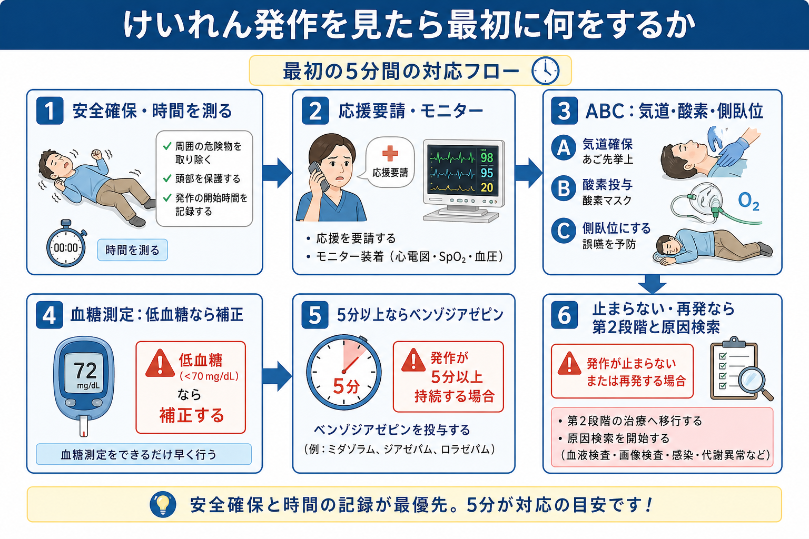
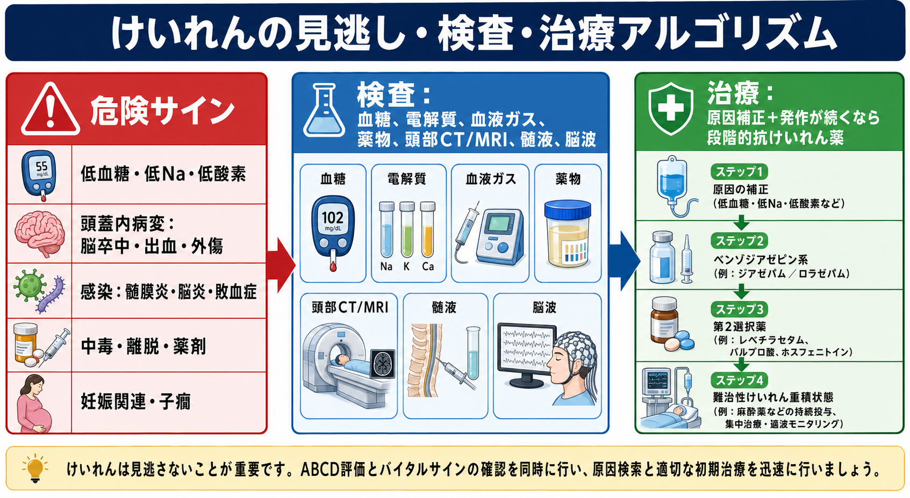
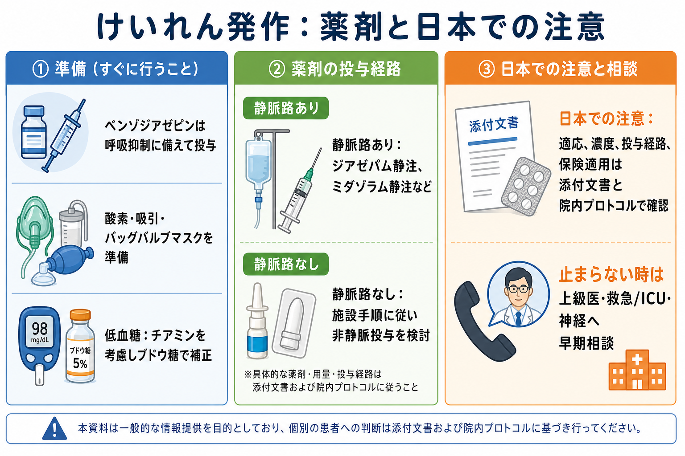

---
title: "けいれん発作を見たら最初に何をするか"
description: "安全確保、気道・酸素、血糖測定、ベンゾジアゼピン投与、原因検索の基本を整理する。"
aliases:
  - "けいれん初期対応"
tags:
  - 領域/救急・初期対応
  - 種類/クリニカルクエスチョン
  - 対象/研修医
question: "けいれん発作を見たら最初に何をするか"
clinical_area: "救急・初期対応"
audience: "研修医"
evidence_level: "mixed"
created: "2026-04-27"
updated: "2026-04-27"
enableToc: true
---

# けいれん発作を見たら最初に何をするか

> このノートは研修医教育のための一般的整理であり、個別患者の診断・治療指示ではありません。緊急性が高い、判断に迷う、施設方針が関わる場合は上級医・専門科に相談してください。

## クリニカルクエスチョン

けいれん発作を見たら最初に何をするか。

## まず結論

- 最初は「発作を止める薬」より先に、安全確保、開始時刻の確認、応援要請、気道・呼吸・循環の評価を行う。舌を噛まないように物を口へ入れる処置は避ける。
- けいれんが続いている間に、SpO2、心電図、血圧をモニターし、酸素、吸引、バッグバルブマスク、静脈路を準備する。呼吸抑制は発作自体でもベンゾジアゼピンでも起こり得るため、投与前から備える[1][6][8]。
- 血糖は早く測る。低血糖は可逆的で、発作・意識障害の原因として見逃せない。栄養不良、アルコール使用、妊娠悪阻などが疑われる場合はチアミンも考慮する。
- 全身けいれんが5分以上続く、または回復前に反復する場合は、けいれん性てんかん重積状態として扱い、上級医とともにベンゾジアゼピン投与を急ぐ[1][2][6][7]。
- 発作が止まっても終わりではない。低血糖、低Na血症、低酸素、頭蓋内出血・脳卒中、髄膜炎・脳炎、中毒・離脱、妊娠関連、外傷を並行して探す[6][8][9]。

## 判断の型

1. まず「今、危ないか」を見る。周囲の危険物、転落、外傷、嘔吐、気道閉塞、低酸素、チアノーゼ、ショック、妊娠、発熱、頭部外傷を同時に確認する。
2. 次に「いつ始まったか」を確認する。開始時刻が不明なら、発見時刻ではなく「最終正常時刻」と「見つけた時刻」を分けて記録する。
3. 5分を区切りにする。多くのけいれんは自然停止するが、5分以上続く全身けいれんは自然停止しにくく、早期治療が推奨される[2][6][7]。
4. 発作が止まったら「原因検索」に切り替える。発作後もうろう、Todd麻痺、非けいれん性てんかん重積、薬剤・中毒、感染、脳卒中を意識する。
5. 一人で薬剤を決めない。ベンゾジアゼピン、第2段階抗けいれん薬、挿管・ICU、画像・髄液検査は施設手順と上級医判断を早期に合わせる。

## 初期対応

- 安全確保: ベッド柵、酸素チューブ、点滴ルート、周囲の硬い物を確認し、転落・打撲を防ぐ。四肢を強く押さえつけない。口腔内へ指、舌圧子、ガーゼなどを入れない。
- 時間を測る: 発作開始時刻、発見時刻、発作の型、左右差、眼球偏位、失禁、外傷、投与薬、発作停止時刻を記録する。動画記録は施設ルールとプライバシーに従う。
- 応援要請: 「けいれんが続いています。開始から何分です。上級医、救急カート、酸素、吸引、モニター、血糖測定をお願いします」と具体的に声を出す。
- A/B: 気道開通、嘔吐・分泌物、誤嚥リスクを確認し、側臥位、吸引、酸素投与を行う。呼吸不全、SpO2低下、循環不安定、鎮静薬投与が予想される場合はバッグバルブマスクと挿管応援を準備する[6][8]。
- C/D: 心電図、SpO2、血圧を装着し、血糖を測定する。可能なら静脈路を確保し、採血、血液ガス、電解質、腎肝機能、抗てんかん薬濃度、薬毒物検査を状況に応じて進める。
- 5分以上: 上級医とともにベンゾジアゼピンを投与する。国内ではジアゼパム注射液や、成人のてんかん重積状態に適応を持つミダゾラム静注製剤などが使われるが、用量・濃度・投与経路・反復可否は添付文書と院内プロトコルで確認する[3][4]。
- 止まらない場合: ベンゾジアゼピンを漫然と反復せず、第2段階抗けいれん薬、気管挿管、ICU、神経内科/脳神経外科、小児・産婦人科などへ早期にエスカレーションする[1][6][8][9]。

## 鑑別・見逃し

| 優先度 | 疾患・状態 | 見逃さない理由 | 手がかり |
|---|---|---|---|
| 高 | 低血糖 | すぐ補正でき、遅れると脳障害リスクがある | 糖尿病薬、食事摂取不良、アルコール、発汗、血糖低値 |
| 高 | 低Na血症・電解質異常 | 発作の直接原因になり、補正速度にも注意が必要 | 利尿薬、水中毒、嘔吐下痢、SIADH、Na低値 |
| 高 | 頭蓋内出血・脳卒中 | 発作で始まる脳血管障害がある | 突然発症、頭痛、片麻痺、共同偏視、抗凝固薬 |
| 高 | 頭部外傷 | 出血、頸椎損傷、低酸素を伴う | 転倒、外傷痕、飲酒、抗血栓薬 |
| 高 | 髄膜炎・脳炎・敗血症 | 抗菌薬・抗ウイルス薬、髄液検査、集中治療が必要 | 発熱、項部硬直、意識障害、免疫不全、皮疹 |
| 高 | 中毒・離脱 | 解毒、拮抗、集中治療が必要なことがある | アルコール離脱、薬剤変更、過量服薬、散瞳/縮瞳 |
| 高 | 妊娠関連・子癇 | 母体・胎児双方の緊急対応が必要 | 妊娠後半から産褥、頭痛、血圧高値、蛋白尿 |
| 中 | 心因性非てんかん発作 | 初期は安全確保を優先し、決めつけない | 長い発作様運動、閉眼、経過の不一致。ただし併存もあり得る |

## 検査

| 検査 | 目的 | 注意点 |
|---|---|---|
| 血糖 | 低血糖の即時除外 | 発作中でも早く測る。低値なら原因検索と補正を並行する |
| 血液ガス | 低酸素、高CO2、乳酸、酸塩基、Kを把握 | 発作後乳酸上昇だけで敗血症と決めつけない |
| 電解質、Ca、Mg | 低Na、低Ca、低Mgなどを確認 | 補正速度や心電図変化に注意する |
| 血算、CRP、培養 | 感染、敗血症、髄膜炎・脳炎を疑う | 抗菌薬を不必要に遅らせない |
| 腎肝機能、CK、尿検査 | 薬剤選択、横紋筋融解、腎障害評価 | 長時間発作ではCK、K、腎機能を経時で見る |
| 薬剤濃度・薬毒物 | 抗てんかん薬不足、中毒、離脱を確認 | 結果を待って初期治療を遅らせない |
| 頭部CT/MRI | 出血、梗塞、腫瘍、外傷を評価 | 循環・呼吸が不安定ならベッドサイド蘇生を優先 |
| 髄液検査 | 髄膜炎・脳炎を評価 | 頭蓋内圧亢進や局在徴候があれば画像・上級医判断を先行 |
| 脳波 | 非けいれん性てんかん重積、発作後もうろうの鑑別 | けいれんが止まっても意識が戻らない時に重要[2][6] |

## 治療・マネジメント

- 発作中の身体保護: 転落・外傷を避け、頭部を守り、締め付けを緩める。四肢を押さえつける、口へ物を入れる、無理に飲ませる行為は避ける。
- 呼吸管理: 酸素投与、吸引、側臥位、バッグバルブマスクを準備する。発作が止まった直後も呼吸抑制、誤嚥、低酸素を観察する[6][8]。
- 低血糖補正: 血糖低値ならブドウ糖で補正する。栄養不良やアルコール関連が疑われる場合は、ウェルニッケ脳症予防の観点からチアミン投与も上級医と確認する。
- ベンゾジアゼピン: 5分以上続く全身けいれん、または発作間で意識が戻らない反復発作では、第1段階治療としてベンゾジアゼピンを用いる。呼吸抑制、血圧低下、過鎮静に備えてから投与する[1][3][4][6]。
- 第2段階治療: ベンゾジアゼピンで止まらない場合は、ホスフェニトイン、レベチラセタム、バルプロ酸、フェノバルビタールなどを施設方針に従って検討する。薬剤選択は妊娠、肝障害、心伝導障害、内服歴、禁忌を確認して上級医と決める[1][6][8][9]。
- 原因治療: 低Na血症、感染、中毒・離脱、頭蓋内病変、外傷、子癇などは、発作停止薬だけでは解決しない。抗菌薬、抗ウイルス薬、降圧・硫酸Mg、解毒、外科的処置など原因別治療へつなぐ。

### 日本での注意

- 日本神経学会のてんかん診療ガイドラインと追補版は、てんかん重積状態の段階的治療と、国内で使用可能な薬剤の更新を示している。古い海外アルゴリズムをそのまま日本の製剤・適応へ置き換えない[1][2]。
- PMDA医療用医薬品情報では、ミダフレッサ静注0.1%は成人のてんかん重積状態での使用上の注意資料があり、ジアゼパム注射液も国内添付文書を確認できる。製剤ごとに濃度、投与経路、警告、禁忌、併用注意が異なる[3][4]。
- 海外ガイドラインではロラゼパム静注や頬粘膜/鼻腔ミダゾラムが前面に出ることがあるが、日本では採用品、適応、剤形、保険適用、院内手順が異なる。救急外来では「海外推奨薬だから使える」と考えず、院内プロトコルを確認する[5][6]。
- 妊娠関連発作、子癇、小児、頭部外傷、低Na血症、薬毒物は、成人てんかん重積の標準アルゴリズムだけでは足りない。産婦人科、小児科、脳神経外科、集中治療、救急科へ早めに相談する。

## 図解

## 指導医に確認するポイント

- 発作開始から何分か。5分以上、または回復前に反復しているか。
- 気道・呼吸・循環は安定しているか。酸素、吸引、バッグバルブマスク、挿管応援は必要か。
- 血糖、Na、低酸素、頭蓋内病変、感染、中毒・離脱、妊娠関連のどれを最優先に疑うか。
- 使うベンゾジアゼピンは何か。用量、投与経路、反復可否、呼吸抑制時の対応は院内プロトコル上どうなっているか。
- 止まらない場合の第2段階薬、ICU、脳波、頭部画像、髄液検査、専門科相談をいつ起動するか。

## 患者説明

- 「けいれんが続くと呼吸や脳に負担がかかるため、まず安全を確保し、酸素、血糖測定、点滴、必要な薬を準備しています。」
- 「多くの発作は短時間で止まりますが、5分以上続く場合や繰り返す場合は、発作を止める薬を使い、原因を急いで調べます。」
- 「原因には血糖や電解質の異常、感染、脳の病気、薬やアルコール、妊娠に関連するものなどがあります。発作が止まった後も検査と経過観察が必要です。」

## ピットフォール

- 開始時刻を確認せず、「まだ様子を見よう」と待ち続ける。
- 口へ物を入れる、無理に押さえつける、飲水・内服をさせる。
- ベンゾジアゼピン投与の準備だけを急ぎ、酸素、吸引、バッグバルブマスク、モニターを準備しない。
- 血糖測定を後回しにする。低血糖は発作の可逆的原因で、最初に拾う価値が高い。
- 発作が止まったため、頭部外傷、脳卒中、髄膜炎・脳炎、中毒、妊娠関連を見逃す。
- ベンゾジアゼピンを反復し続け、第2段階薬、挿管、ICU、専門科相談が遅れる。
- 海外の薬剤名・投与経路を国内の採用品や添付文書確認なしに当てはめる。

## 関連ノート

- [[MOC｜救急・初期対応]]
- MOC｜神経（本サイト外）
- 関連ノート候補: 「意識障害を見たら最初に何をするか」「低血糖を見たらどう補正するか」「低Na血症でけいれんしたらどう対応するか」「髄膜炎・脳炎を疑う意識障害をどう診るか」「頭部外傷後けいれんをどう考えるか」

## MOC更新候補

- [[MOC｜救急・初期対応]] に「意識障害・けいれん」項目として本記事を追加候補。
- MOC｜神経.md（本サイト外） に「けいれん・てんかん重積」関連として本記事を追加候補。

## 参考文献

[1] 日本神経学会. てんかん診療ガイドライン2018. https://www.neurology-jp.org/guidelinem/tenkan_2018.html

[2] 日本神経学会. てんかん診療ガイドライン2018追補版2022. https://www.neurology-jp.org/guidelinem/tenkan_tuiho_2018_ver2022.html

[3] PMDA. ミダフレッサ静注0.1% 医療用医薬品情報. https://www.pmda.go.jp/PmdaSearch/rdSearch/02/1139401A1020?user=1

[4] PMDA. ジアゼパム注射液10mg「NIG」医療用医薬品情報. https://www.pmda.go.jp/PmdaSearch/rdSearch/02/1124402A2070?user=1

[5] National Institute for Health and Care Excellence. Epilepsies in children, young people and adults: NICE guideline NG217, section 7. Treating status epilepticus. Updated 2025. https://www.nice.org.uk/guidance/NG217/chapter/7-Treating-status-epilepticus

[6] Glauser T, Shinnar S, Gloss D, et al. Evidence-Based Guideline: Treatment of Convulsive Status Epilepticus in Children and Adults. Epilepsy Currents. 2016;16(1):48-61. DOI: https://doi.org/10.5698/1535-7597-16.1.48

[7] Trinka E, Cock H, Hesdorffer D, et al. A definition and classification of status epilepticus: Report of the ILAE Task Force. Epilepsia. 2015;56(10):1515-1523. DOI: https://doi.org/10.1111/epi.13121

[8] American College of Emergency Physicians. Clinical Policy: Critical Issues in the Evaluation and Management of Adult Patients Presenting to the Emergency Department With Seizure. Annals of Emergency Medicine. 2024;84:1-6. https://www.acep.org/siteassets/new-pdfs/clinical-policies/seizures.pdf

[9] 日本蘇生協議会. JRC蘇生ガイドライン2020. https://www.jrc-cpr.org/jrc-guideline-2020/

## 更新ログ

- 2026-04-27: 初版作成。国内外ガイドライン、PMDA医療用医薬品情報、救急関連ガイドラインを確認し、imagegen由来のPNG図解3枚を添付。
