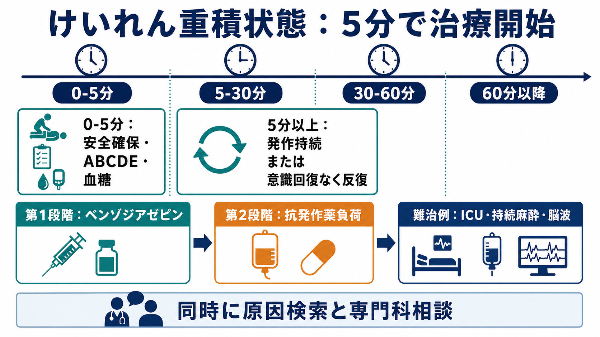
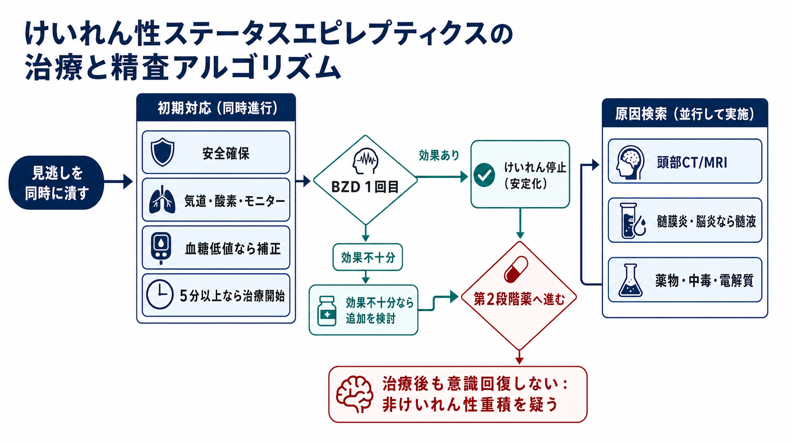
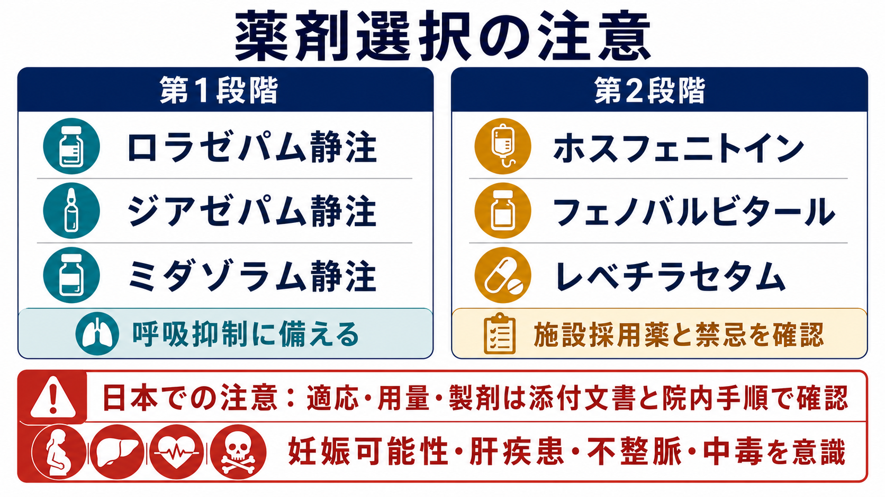

---
title: "けいれん重積状態をどう判断し治療するか"
description: "5分以上のけいれん発作や意識回復を挟まない反復発作を重積として扱い、初期蘇生、時間軸に沿った薬物治療、原因検索、専門科相談を整理する。"
aliases:
  - "けいれん重積"
tags:
  - 領域/救急・初期対応
  - 種類/クリニカルクエスチョン
  - 対象/研修医
question: "けいれん重積状態をどう判断し治療するか"
clinical_area: "救急・初期対応"
audience: "研修医"
evidence_level: "guideline/review/mixed"
created: "2026-04-27"
updated: "2026-04-27"
enableToc: true
---

# けいれん重積状態をどう判断し治療するか

> このノートは研修医教育のための一般的整理であり、個別患者の診断・治療指示ではありません。緊急性が高い、判断に迷う、施設方針が関わる場合は上級医・専門科に相談してください。

## クリニカルクエスチョン

けいれん重積状態をどう判断し治療するか。

## まず結論

- 全身けいれんが5分以上続く、または発作を反復して発作間に意識が戻らない場合は、自然停止を待たず「けいれん重積状態」として治療を開始する。5分は治療開始の目安、30分は神経障害リスクが高まる目安として使う [1,2]。
- 最初の5分は安全確保、ABCDE、酸素、モニター、静脈路、血糖測定、低血糖補正を同時に進める。薬剤投与だけでなく、気道・呼吸・循環の準備が治療の一部である [1,3]。
- 第1段階はベンゾジアゼピン系薬を遅れず投与する。静脈路があればロラゼパム静注やジアゼパム静注、静脈路がなければ施設手順に従いミダゾラム非静脈投与などを検討する [1,3-6]。
- ベンゾジアゼピンで止まらない、または再燃する場合は、30分を待たずに第2段階薬へ進む。候補はホスフェニトイン、フェノバルビタール、レベチラセタムなどで、禁忌、妊娠可能性、肝機能、心伝導障害、腎機能、院内採用薬を確認する [1,7-9]。
- 30-60分以降も持続する場合は難治例として、ICU、気管挿管・人工呼吸、持続麻酔、脳波モニタリングを前提に神経内科・救急集中治療・小児科などへ早期相談する [1,3,10]。
- 治療と同時に原因検索を行う。低血糖、低Na血症、脳卒中、頭部外傷、中枢神経感染症、中毒、抗発作薬中断、妊娠関連、非けいれん性重積を見逃さない [1,3,4]。
- 日本での注意: 2018年の国内ガイドライン本文には当時の薬剤状況が反映されている部分がある。2026年時点ではロラゼパム静注、ミダゾラム静注、ホスフェニトイン、レベチラセタムなどの国内添付文書・効能効果をPMDAで確認し、実際の用量・投与経路は添付文書と院内プロトコルに従う [5-9]。

## 判断の型

1. まず「これは止まる発作か」ではなく「5分を超えたら止めに行く発作か」で判断する。時計を見て、発作開始時刻、救急隊・家族からの目撃時刻、前医投薬を確認する [1,2]。
2. 意識回復を挟まない反復発作は、1回ごとの発作が短くても重積として扱う [1]。
3. 発作様運動が止まっても、意識障害が持続する場合は非けいれん性てんかん重積状態、薬剤性鎮静、低酸素、代謝性脳症、脳卒中などを考える [1,10]。
4. 薬剤投与は時間軸で考える。5分以上で第1段階、ベンゾジアゼピン不応なら第2段階、30-60分以降はICU管理を見越した第3段階へ進む [1,3,4]。
5. 原因検索は「発作が止まってから」ではなく「止めながら」行う。低血糖、低Na血症、頭蓋内病変、感染、中毒は初期対応の中で拾う [1,3]。

## 初期対応

- 周囲の危険物を除き、転落・外傷を防ぐ。口に物を入れない。押さえつけによる外傷を避ける。
- 応援要請を早めに行う。救急外来では上級医、看護師、薬剤師、気道管理担当、神経内科または小児科へ並行して連絡する。
- ABCDEを確認し、酸素投与、吸引、バッグバルブマスク、気管挿管の準備を行う。ベンゾジアゼピン投与後の呼吸抑制に備える [3,5,6]。
- 心電図、SpO2、血圧、体温をモニターし、末梢静脈路を確保する。困難なら骨髄路や施設の非静脈投与手順を検討する。
- すぐに血糖を測る。低血糖が疑われる、または測定が遅れる状況では、チアミン投与を含めた低血糖対応を施設手順で行う [1]。
- 発作開始時刻、既往、抗発作薬内服、飲酒・離脱、妊娠可能性、感染徴候、頭部外傷、中毒・服薬内容、透析や電解質異常の背景を確認する。

## 鑑別・見逃し

| 優先度 | 疾患・状態 | 見逃さない理由 | 手がかり |
|---|---|---|---|
| 高 | 低血糖 | 迅速に補正でき、遅れると脳障害につながる | 発汗、糖尿病薬、低栄養、アルコール、血糖低値 |
| 高 | 低Na血症・Ca/Mg異常 | 補正方針が原因で異なり、再発しやすい | 嘔吐、利尿薬、SIADH、腎不全、採血異常 |
| 高 | 脳卒中・頭蓋内出血 | 発作が初発症状になり、画像・専門治療が必要 | 片麻痺、瞳孔異常、突然発症、抗凝固薬、頭痛 |
| 高 | 髄膜炎・脳炎 | 抗菌薬・抗ウイルス薬・髄液検査の遅れが致命的 | 発熱、項部硬直、免疫不全、意識障害遷延 |
| 高 | 中毒・離脱 | 標準的な抗発作薬だけでは不十分なことがある | 服薬瓶、違法薬物、アルコール離脱、散瞳、頻脈 |
| 中 | 抗発作薬中断・血中濃度低下 | 再発予防と維持治療の調整が必要 | 服薬不良、嘔吐、薬剤変更、相互作用 |
| 中 | 妊娠関連、子癇 | 母体・胎児双方の緊急対応が必要 | 妊娠可能年齢、高血圧、蛋白尿、産褥期 |
| 中 | 心因性非てんかん発作 | 不要な鎮静・挿管を避ける必要があるが、まず危険な重積を除外する | 発作様運動の特徴、意識保持、既往。ただし救急初期は決めつけない |

## 検査

| 検査 | 目的 | 注意点 |
|---|---|---|
| 血糖 | 低血糖の即時確認 | 治療を遅らせない。ベッドサイドで反復確認する |
| 血算、生化学、Na/Ca/Mg、腎肝機能 | 代謝性原因と薬剤選択の確認 | 低Na血症、腎機能、肝機能は第2段階薬の選択にも関わる |
| 血液ガス、乳酸 | 低酸素、換気、代謝性アシドーシスの評価 | 発作直後の乳酸上昇だけで敗血症と断定しない |
| 抗発作薬血中濃度 | 服薬不良・中毒・補充方針の確認 | 測定可能な薬剤に限る。採血で治療を遅らせない |
| 頭部CT/MRI | 出血、梗塞、腫瘍、外傷の確認 | 不安定な発作持続中は気道・循環と治療を優先する |
| 髄液検査 | 髄膜炎・脳炎の評価 | 頭蓋内圧亢進や凝固異常を確認。必要なら抗菌薬を先行する |
| 脳波 | 非けいれん性重積、治療反応、難治例の評価 | けいれん停止後も意識が戻らない場合に重要 [10] |
| 妊娠反応、毒物スクリーニング | 妊娠関連、中毒の拾い上げ | 結果を待たずに救命処置を進める |

## 治療・マネジメント

### 0-5分: 初期安定化

- 時計を動かし、発作開始からの時間を共有する。
- 安全確保、酸素、吸引、モニター、静脈路、血糖測定を同時に行う。
- 気道確保が難しい、低酸素が続く、外傷や誤嚥リスクが高い場合は、早めに気道管理できる人を呼ぶ。

### 5分以上: 第1段階薬

- 5分以上続く全身けいれん、または意識回復を挟まない反復発作では、ベンゾジアゼピン系薬を投与する [1,3,4]。
- 静脈路がある場合の代表例はロラゼパム静注、ジアゼパム静注、ミダゾラム静注である。ロラゼパム静注の国内添付文書では、成人では通常4 mgを緩徐に静注し、必要時追加を検討する記載がある [5]。
- 静脈路がない場合は、口腔粘膜、鼻腔、筋注、注腸などの経路が施設手順で整備されているか確認する。NICEは地域や静脈路未確保時の初期治療として頬粘膜ミダゾラムや直腸ジアゼパム、静脈路と蘇生設備がある場合の静注ロラゼパムを示している [4]。
- ベンゾジアゼピンは呼吸抑制、血圧低下、鎮静を起こし得る。投与前後でバッグバルブマスク、吸引、挿管準備、拮抗薬の扱いを含む院内手順を確認する [5,6]。

### ベンゾジアゼピン不応: 第2段階薬

- 発作が止まらない、いったん止まっても再燃する、または意識回復が乏しく重積が疑われる場合は、第2段階薬へ遅れず進む [1,3]。
- 国内ガイドラインでは、ホスフェニトイン、フェノバルビタール、ミダゾラム静注から持続静注、レベチラセタムなどが第2段階以降の候補として扱われる [1]。
- ESETT試験では、ベンゾジアゼピン不応のけいれん重積に対し、レベチラセタム、ホスフェニトイン、バルプロ酸の有効性・安全性に明確な優劣は示されなかった。日本ではバルプロ酸静注の適応・院内採用状況が施設で異なるため、添付文書と院内手順に従う [9]。
- ホスフェニトインは心伝導障害、不整脈、血圧低下に注意する。フェノバルビタールは呼吸抑制と鎮静が問題になる。レベチラセタムは腎機能に応じた調整を意識する [7,8]。

### 30-60分以降: 難治例

- 30分を超える持続は後遺障害リスクが高まり、60分前後まで止まらなければ難治例としてICU管理を見越す [1,2]。
- 持続麻酔、気管挿管、人工呼吸、持続脳波モニタリングが必要になり得るため、救急集中治療、神経内科、小児なら小児科・小児神経、麻酔科へ早期に相談する [1,10]。
- 発作様運動が消えても脳波上の発作が続くことがある。鎮静後の意識障害を「薬のせい」と決めつけず、非けいれん性重積を評価する [10]。

### 日本での注意

- 国内ガイドラインは日本神経学会・関連学会協力の資料を起点にする。一方で薬剤の承認状況や添付文書は更新されるため、実際の投与ではPMDAの最新添付文書を確認する [1,5-8]。
- ロラゼパム静注、ミダゾラム静注、ホスフェニトイン、レベチラセタムなどは、製剤、効能効果、年齢、用量、投与速度、禁忌、相互作用が添付文書で規定される [5-8]。
- 妊娠可能性、重症肝疾患、心伝導障害、腎機能障害、薬物中毒、オピオイド併用、人工呼吸管理の可否は薬剤選択に影響する。
- 救急外来で迷う場合は、単独判断で第2・第3段階薬を引き延ばさず、上級医・専門科・薬剤師に同時相談する。

## 図解

## 指導医に確認するポイント

- 発作開始時刻、前医・救急隊・家族による投薬歴、既に投与されたベンゾジアゼピン量。
- 気道管理を先行するべきか、薬剤投与と並行でよいか。
- 第2段階薬の選択。心疾患、肝疾患、腎機能、妊娠可能性、中毒、既服薬を踏まえて確認する。
- 頭部CT、髄液検査、抗菌薬・アシクロビル、毒物対応、脳波の優先順位。
- ICU入室、神経内科・小児科・麻酔科への相談タイミング。
- 発作停止後の維持抗発作薬、再発予防、運転・生活指導の担当科。

## 患者説明

- 「けいれんが長く続くと脳や全身に負担がかかるため、5分を超える場合は自然に止まるのを待たず、薬で止める治療を行います。」
- 「薬で呼吸が弱くなることがあるため、酸素、吸引、場合によっては人工呼吸の準備をしながら治療します。」
- 「けいれんを止める治療と同時に、低血糖、電解質異常、脳の病気、感染症、薬や中毒など原因を調べます。」
- 「発作の動きが止まっても意識が戻らない場合は、脳波などで発作が続いていないか確認することがあります。」

## ピットフォール

- 「もう少しで止まりそう」と待ち、5分を超えてもベンゾジアゼピン投与が遅れる。
- 発作開始時刻を記録せず、チーム内で時間軸が共有されない。
- ベンゾジアゼピン投与だけに集中し、気道・呼吸抑制への準備が遅れる。
- 血糖測定を忘れる、または採血結果待ちで低血糖対応が遅れる。
- ベンゾジアゼピン不応なのに第2段階薬や専門科相談へ進まない。
- 発作様運動が止まった後の意識障害を鎮静だけで説明し、非けいれん性重積を見逃す。
- 日本の添付文書、院内採用薬、投与経路、禁忌を確認せず、海外資料の用量をそのまま使う。

## 関連ノート

- 作成候補: `低血糖をどう初期対応するか`
- 作成候補: `意識障害をどう初期評価するか`
- 作成候補: `非けいれん性てんかん重積状態をいつ疑うか`
- 作成候補: `救急外来での気道管理をいつ上級医に呼ぶか`

## MOC更新候補

- [[MOC｜救急・初期対応]]
- MOC｜神経.md（本サイト外）

## 参考文献

[1] 日本神経学会. てんかん診療ガイドライン2018 第8章 てんかん重積状態. https://www.neurology-jp.org/guidelinem/epgl/tenkan_2018_08.pdf

[2] Trinka E, Cock H, Hesdorffer D, et al. A definition and classification of status epilepticus: Report of the ILAE Task Force on Classification of Status Epilepticus. Epilepsia. 2015;56(10):1515-1523. https://doi.org/10.1111/epi.13121

[3] Glauser T, Shinnar S, Gloss D, et al. Evidence-Based Guideline: Treatment of Convulsive Status Epilepticus in Children and Adults. Epilepsy Currents. 2016;16(1):48-61. https://doi.org/10.5698/1535-7597-16.1.48

[4] National Institute for Health and Care Excellence. Epilepsies in children, young people and adults: NICE guideline NG217, section 7 Treating status epilepticus. Published 2022, updated 2025. https://www.nice.org.uk/guidance/NG217/chapter/7-Treating-status-epilepticus

[5] PMDA. ロラピタ静注2mg 医療用医薬品情報. https://www.pmda.go.jp/PmdaSearch/rdSearch/02/1139403A1020?user=1

[6] PMDA. ミダフレッサ静注0.1％ 医療用医薬品情報. https://www.pmda.go.jp/PmdaSearch/rdDetail/iyaku/1139401A1020_1?user=1

[7] PMDA. ホストイン静注750mg 添付文書・審査資料. https://www.pmda.go.jp/drugs/2011/P201100120/620095000_22300AMX00594_B100_1.pdf

[8] PMDA. イーケプラ点滴静注500mg 医療用医薬品情報. https://www.pmda.go.jp/PmdaSearch/rdSearch/02/1139402A1025?user=1

[9] Kapur J, Elm J, Chamberlain JM, et al.; NETT and PECARN Investigators. Randomized Trial of Three Anticonvulsant Medications for Status Epilepticus. N Engl J Med. 2019;381(22):2103-2113. https://doi.org/10.1056/NEJMoa1905795

[10] Brophy GM, Bell R, Claassen J, et al. Guidelines for the Evaluation and Management of Status Epilepticus. Neurocritical Care. 2012;17(1):3-23. https://doi.org/10.1007/s12028-012-9695-z

## 更新ログ

- 2026-04-27: 初版作成。
