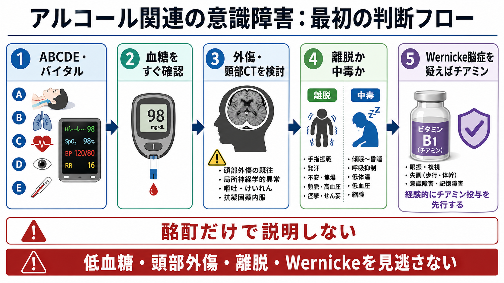
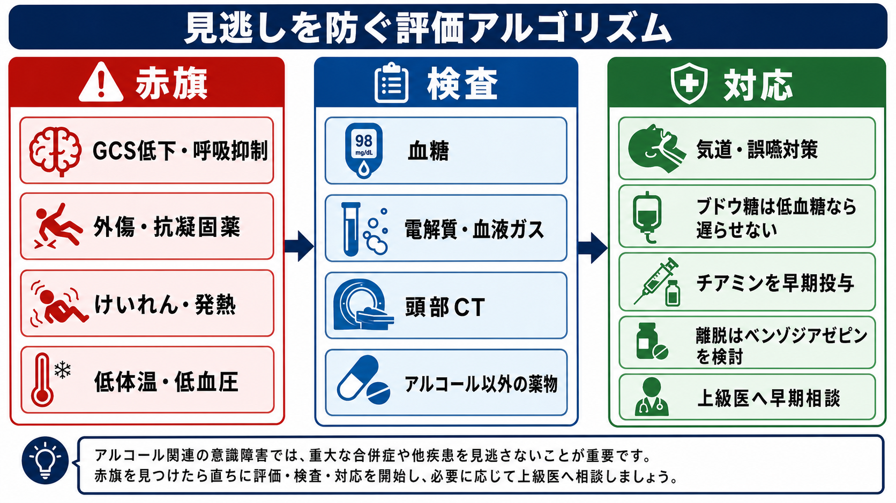
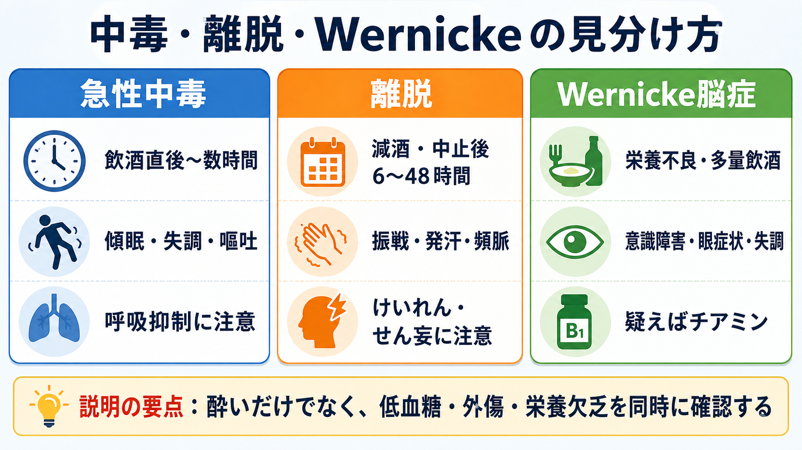

---
title: "アルコール関連の意識障害をどう評価するか"
description: "急性アルコール中毒だけで説明せず、低血糖、頭部外傷、離脱、Wernicke脳症、併用薬物を同時に確認する。"
aliases:
  - "アルコール関連意識障害"
  - "急性アルコール中毒"
  - "アルコール離脱"
  - "Wernicke脳症"
tags:
  - 領域/救急・初期対応
  - 種類/クリニカルクエスチョン
  - 対象/研修医
question: "アルコール関連の意識障害をどう評価するか"
clinical_area: "救急・初期対応"
audience: "研修医"
evidence_level: "mixed"
created: "2026-04-27"
updated: "2026-04-27"
enableToc: true
---

# アルコール関連の意識障害をどう評価するか

> このノートは研修医教育のための一般的整理であり、個別患者への診断・治療指示ではありません。緊急性が高い、判断に迷う、施設方針が関わる場合は上級医・救急担当医に相談してください。

## クリニカルクエスチョン

飲酒後、酩酊、アルコール依存症、減酒・断酒後の患者で意識障害をみたとき、急性アルコール中毒だけでなく、低血糖、頭部外傷、アルコール離脱、Wernicke脳症をどう見逃さずに評価するか。

## まず結論

- アルコール関連の意識障害は、**「酔っている」ではなく「意識障害」** として扱う。急性アルコール中毒では意識低下、嘔吐、呼吸悪化、低体温、低血圧が生命リスクになりうる[1]。
- 最初の5分は、**ABCDE、バイタル、SpO2、体温、GCS/JCS、迅速血糖、外傷検索** を同時に行う。血糖は待てる検査ではなく、低血糖なら治療を遅らせない[4]。
- 「飲酒後に倒れた」「路上で発見」「抗凝固薬内服」「頭部打撲が不明」「GCS低下が説明しにくい」では、アルコールで意識障害を説明せず、頭部外傷・頭蓋内出血を考える[6][7]。
- 減酒・中止後の振戦、発汗、頻脈、不眠、不安、幻覚、けいれん、せん妄はアルコール離脱を疑う。離脱けいれんには速効性ベンゾジアゼピンが検討され、フェニトイン単独での離脱けいれん治療は推奨されない[2][8]。
- 栄養不良、多量飲酒、反復嘔吐、眼振・眼球運動障害、失調、意識変容があれば Wernicke脳症を疑い、チアミン投与を早期に上級医と相談する。NICEは中毒中でも疑いを高く持ち、疑い例には非経口チアミンを推奨している[3][8]。

## 判断の型

1. **まず生理学的に危ないかを決める**: 気道閉塞、嘔吐・誤嚥、呼吸抑制、低酸素、ショック、低体温、けいれんを先に拾う[1]。
2. **血糖を即時に測る**: 冷汗、異常行動、傾眠、けいれん、ろれつ困難は低血糖でも起こる。糖尿病薬内服、食事摂取不良、肝障害、長時間飲酒では特に疑う[4]。
3. **外傷を前提に全身をみる**: 飲酒者は病歴が不確かで、転倒・暴行・交通外傷を隠しやすい。頭部、顔面、頸椎、体幹、四肢を観察し、抗凝固薬・抗血小板薬を確認する[6][7]。
4. **時間軸で中毒と離脱を分ける**: 飲酒直後から数時間の傾眠・失調・嘔吐は中毒が主だが、減酒・断酒後6から48時間の振戦、発汗、頻脈、不眠、不安、幻覚、けいれんは離脱を考える[2][8]。
5. **Wernicke脳症を後回しにしない**: 三徴がそろうのを待たない。多量飲酒・栄養不良・眼症状・失調・意識変容があれば、チアミンを検討する[3][8]。
6. **アルコール以外の中毒を探す**: 睡眠薬、ベンゾジアゼピン、オピオイド、抗精神病薬、抗ヒスタミン薬、違法薬物、消毒用アルコールなどの併用を、薬袋・空包・同伴者情報から確認する。

## 初期対応

- **応援を呼ぶ基準**: GCS 8以下、気道保持困難、嘔吐反復、SpO2低下、呼吸数低下、低血圧、低体温、けいれん、外傷疑い、暴力・自傷他害リスク、妊娠可能性、未成年、同伴者不在では早めに上級医へ共有する。
- **気道と誤嚥対策**: 嘔吐、泡沫状分泌物、いびき様呼吸、舌根沈下、顔面外傷があれば側臥位、吸引、酸素、モニター、気道確保の準備を進める。無理に吐かせない[1]。
- **血糖**: 迅速血糖を測定する。低血糖があれば、ブドウ糖投与をチアミン待ちで遅らせない。Wernickeリスクが高ければ、ブドウ糖投与と並行または直後にチアミンを検討する。
- **体温**: 低体温は飲酒、屋外発見、濡れた衣服、外傷、敗血症で起こる。保温し、深部体温測定を検討する。
- **外傷**: 頭皮裂創、皮下血腫、顔面外傷、瞳孔不同、局所神経症状、頸部痛、抗凝固薬、受傷機転不明があれば、酩酊として帰宅判断に進まない。
- **安全確保**: 興奮・せん妄・暴力リスクがある場合は、身体疾患の除外と同時にスタッフの安全、転倒予防、観察環境を整える。鎮静は呼吸抑制を悪化させうるため、上級医と方針を合わせる。

## 鑑別・見逃し

| 優先度 | 疾患・状態 | 見逃さない理由 | 手がかり |
|---|---|---|---|
| 高 | 急性アルコール中毒 | 呼吸抑制、嘔吐・窒息、低体温、低血圧で致死的になりうる | 飲酒直後、傾眠、失調、嘔吐、大いびき、刺激に反応しない[1] |
| 高 | 低血糖 | 可逆的で、放置するとけいれん・昏睡に進む | 糖尿病薬、食事摂取不良、肝障害、冷汗、異常行動、けいれん[4] |
| 高 | 頭部外傷・頭蓋内出血 | 受傷機転が不明で、アルコールで症状が隠れる | 転倒、頭部打撲、抗凝固薬、局所神経症状、GCS低下、頭痛、嘔吐[6][7] |
| 高 | アルコール離脱・離脱けいれん | 減酒・中止後にけいれん、せん妄、循環動態悪化を起こす | 6から48時間の振戦、発汗、頻脈、不眠、不安、幻覚、けいれん[2][8] |
| 高 | Wernicke脳症 | 見逃すと Korsakoff症候群など後遺症に進む | 栄養不良、多量飲酒、眼振、眼球運動障害、失調、意識変容[3][8] |
| 中 | 併用薬物・中毒 | アルコールとの相加的な呼吸抑制・せん妄を起こす | 睡眠薬、ベンゾジアゼピン、オピオイド、抗精神病薬、空包、縮瞳 |
| 中 | 敗血症・髄膜炎・肝性脳症 | 「酔い」「離脱」と紛らわしい | 発熱または低体温、頻呼吸、黄疸、羽ばたき振戦、感染巣、項部硬直 |
| 中 | 脳卒中・てんかん後 | 酩酊様に見えることがある | 片麻痺、失語、共同偏視、けいれん目撃、舌咬傷、尿失禁 |

## 検査

| 検査 | 目的 | 注意点 |
|---|---|---|
| バイタル、SpO2、体温、GCS/JCS | 生命リスクと経時変化を把握する | 数字だけでなく、発語、従命、痛み刺激への反応を記録する |
| 迅速血糖 | 低血糖を即時に拾う | 意識障害、異常行動、けいれんでは早期に測る[4] |
| 血液ガス、電解質、乳酸 | 低酸素、換気不全、代謝異常、ショックを評価 | 採血待ちで気道・呼吸・循環対応を遅らせない |
| CBC、生化学、肝腎機能、CK、凝固、アンモニア | 感染、肝性脳症、横紋筋融解、出血リスクを拾う | 屋外発見や長時間臥床ではCK、腎機能、体温も見る |
| 血中エタノール濃度 | アルコール関与の補助情報 | 高値でも他疾患を除外しない。低値なら離脱や他疾患を考える |
| 頭部CT | 頭蓋内出血、外傷性病変を除外する | 酩酊で神経所見が取りにくい、外傷不明、抗凝固薬、GCS低下では閾値を下げる[6][7] |
| 心電図 | 不整脈、低体温、電解質異常、併用薬物を拾う | QT延長、徐脈、頻脈、低K/Mgを確認する |
| 薬毒物関連検査 | 併用薬物の評価 | 検査陰性でも中毒を否定しない。薬袋・空包・同伴者情報を重視する |

## 治療・マネジメント

- **急性中毒**: 基本は支持療法で、気道、呼吸、循環、体温、誤嚥予防を管理する。嘔吐・大いびき・痛み刺激に反応しない・呼吸不安定・低体温では救急対応を強める[1]。
- **低血糖**: 迅速血糖で低ければブドウ糖を投与する。Wernickeリスクがあっても、低血糖補正を遅らせない。チアミンは並行して準備・投与を相談する。
- **Wernicke脳症疑い**: 三徴がそろわなくても、栄養不良または多量飲酒に意識変容、眼症状、失調があれば疑う。NICEは疑い例に非経口チアミンを推奨している[8]。
- **離脱**: 振戦、発汗、頻脈、不安、不眠、幻覚、けいれん、せん妄を評価し、重症化リスクがあればモニター下で上級医と治療方針を決める。NICEとASAMはアルコール離脱管理でベンゾジアゼピンを中心に扱う[8][9]。
- **頭部外傷**: 飲酒により病歴と診察が不確かになる。外傷が否定しきれない、抗凝固薬、神経所見、GCS低下、嘔吐、頭痛がある場合は画像と観察方針を上級医と相談する[6][7]。
- **帰宅判断**: 「歩ける」「会話できる」だけで帰宅にしない。意識レベル改善、バイタル安定、低血糖・外傷・離脱・Wernicke・併用薬物の評価、保護者または安全な帰宅手段、再受診説明を確認する。
- **日本での注意**: 国内の PMDA 添付文書では、チアミン塩化物塩酸塩注射液やフルスルチアミン注射液に Wernicke脳炎・Wernicke脳症の効能がある製剤が存在する[5][10]。一方、NICEなど海外ガイドラインの「高用量非経口チアミン」運用とは製剤規格・用量設計・施設採用薬が異なるため、院内プロトコル、採用薬、禁忌・過敏症歴、保険請求上の扱いを確認する。
- **日本での注意**: アルコール離脱に対する薬剤、投与経路、観察場所、入院適応は施設差が大きい。せん妄、けいれん、肝障害、呼吸抑制、併用薬物がある場合は、救急・精神科・総合内科・集中治療の連携を早める。

## 図解

## 指導医に確認するポイント

- この患者の意識障害は、アルコールだけで説明してよいか。低血糖、外傷、感染、脳卒中、併用薬物をどこまで除外したか。
- 気道確保、誤嚥対策、モニター、観察場所、CT室搬送の安全性は十分か。
- 頭部CTや頸椎評価の閾値を下げるべき所見はあるか。
- 離脱の時間軸、既往、けいれん歴、せん妄歴、最終飲酒時刻は確認できたか。
- Wernicke脳症を疑う所見があるか。チアミン投与の製剤、用量、タイミング、院内ルールはどうするか。
- 帰宅可能と判断する場合、誰が付き添い、どの悪化サインで再受診するか説明できているか。

## 患者説明

- 「お酒の影響だけでなく、血糖低下、頭のけが、薬の影響、栄養不足、離脱症状が隠れていないかを確認します。」
- 「眠っているように見えても、呼吸が弱い、吐いたものが詰まる、体温が下がる、頭の中で出血している、といった危険があります。」
- 「低血糖は早く治療すれば改善することがあります。指先の血糖をすぐ確認します。」
- 「多量飲酒や食事が取れていない状態では、ビタミンB1不足で脳の症状が出ることがあります。疑う場合は早めに補充を検討します。」
- 「帰宅できるかは、酔いが覚めたかだけでなく、意識、呼吸、歩行、頭部外傷、付き添い、再受診できる環境を確認して決めます。」

## ピットフォール

- 「酒臭いから酩酊」と決め、血糖を測らない。
- 飲酒後の転倒を本人が覚えていないのに、頭部外傷を十分に評価しない。
- 血中アルコール濃度が高いことを、他疾患除外の根拠にしてしまう。
- 離脱を急性中毒と誤り、最終飲酒時刻・減酒歴を確認しない。
- Wernicke脳症の古典的三徴がそろうまでチアミンを考えない。
- 興奮を精神症状だけで扱い、低酸素、低血糖、頭蓋内病変、薬物中毒、離脱せん妄を見逃す。
- 帰宅時に、保護者、転倒リスク、再受診基準、夜間の観察者を確認しない。

## 関連ノート

- [[MOC｜救急・初期対応]]
- MOC｜精神・せん妄・睡眠（本サイト外）
- MOC｜神経（本サイト外）
- 関連ノート候補（未作成）: 意識障害を見たら最初に何を確認するか
- 関連ノート候補（未作成）: 救急外来で血糖をいつ測るか
- 関連ノート候補（未作成）: 頭部外傷でCTをいつ撮るか
- 関連ノート候補（未作成）: アルコール離脱をどう評価するか
- 関連ノート候補（未作成）: Wernicke脳症をいつ疑うか

## MOC更新候補

- [[MOC｜救急・初期対応]] に「意識障害・けいれん」配下の記事として追加候補。
- MOC｜精神・せん妄・睡眠.md（本サイト外） に「アルコール離脱・せん妄」関連として追加候補。
- MOC｜神経.md（本サイト外） に「Wernicke脳症・意識障害」関連として追加候補。
- MOC｜薬剤・処方・副作用.md（本サイト外） に「チアミン製剤・低血糖・併用薬物」関連として追加候補。

## 参考文献

[1] 厚生労働省 e-ヘルスネット. 急性アルコール中毒. 2021年12月21日最終更新. https://kennet.mhlw.go.jp/information/information/alcohol/a-01-001

[2] 厚生労働省 e-ヘルスネット. アルコールと依存. 2026年4月27日閲覧. https://kennet.mhlw.go.jp/information/information/alcohol/a-05-001.html

[3] 厚生労働省 e-ヘルスネット. ウェルニッケ・コルサコフ症候群. 2021年6月10日最終更新. https://kennet.mhlw.go.jp/information/information/dictionary/alcohol/ya-052.html

[4] 独立行政法人 医薬品医療機器総合機構. 重篤副作用疾患別対応マニュアル（医療関係者向け）: 低血糖. 2023年12月改定. https://www.pmda.go.jp/safety/info-services/drugs/adr-info/manuals-for-hc-pro/0001.html

[5] 独立行政法人 医薬品医療機器総合機構. 医療用医薬品情報: チアミン塩化物塩酸塩注射液10mg「ツルハラ」／50mg「ツルハラ」. https://www.pmda.go.jp/PmdaSearch/rdSearch/02/3121400A2230?user=1

[6] 一般社団法人 日本脳神経外傷学会. 頭部外傷治療・管理のガイドライン作成委員会. https://www.neurotraumatology.jp/committee/guideline/

[7] National Institute for Health and Care Excellence. Head injury: assessment and early management. NICE guideline NG232. Published 18 May 2023. https://www.nice.org.uk/guidance/NG232

[8] National Institute for Health and Care Excellence. Alcohol-use disorders: diagnosis and management of physical complications. NICE guideline CG100. Published 2 June 2010, updated 12 April 2017. https://www.nice.org.uk/guidance/cg100/chapter/recommendations

[9] American Society of Addiction Medicine. The ASAM Clinical Practice Guideline on Alcohol Withdrawal Management. SAMHSA Evidence-Based Practices Resource Center. Last updated 2024-10-11. https://www.samhsa.gov/resource/ebp/asam-clinical-practice-guideline-alcohol-withdrawal-management

[10] 独立行政法人 医薬品医療機器総合機構. 医療用医薬品情報: フルスルチアミン注50mg「日新」. https://www.pmda.go.jp/PmdaSearch/rdSearch/02/3122401A4137?user=1

## 更新ログ

- 2026-04-27: 初版作成。
