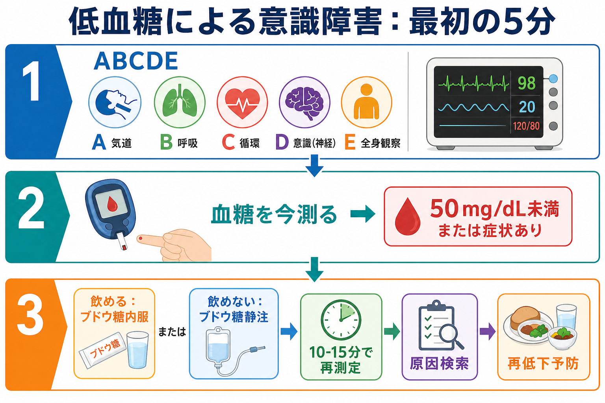
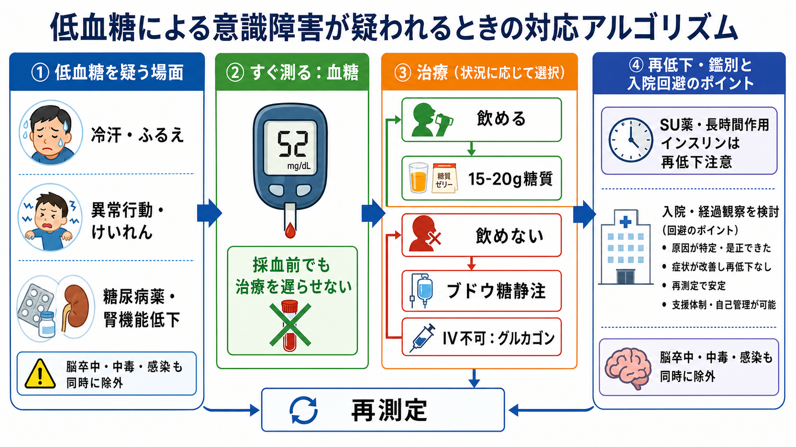
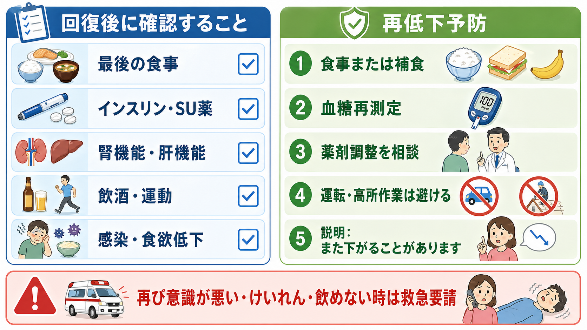

---
title: "低血糖による意識障害を疑ったらどう対応するか"
description: "血糖測定を急ぎ、ブドウ糖投与と原因検索、再低下予防を行う流れを学ぶ。"
aliases:
  - "低血糖による意識障害"
tags:
  - 領域/救急・初期対応
  - 種類/クリニカルクエスチョン
  - 対象/研修医
question: "低血糖による意識障害を疑ったらどう対応するか"
clinical_area: "救急・初期対応"
audience: "研修医"
evidence_level: "guideline"
created: "2026-04-27"
updated: "2026-04-27"
enableToc: true
---

# 低血糖による意識障害を疑ったらどう対応するか

> このノートは研修医教育のための一般的整理であり、個別患者の診断・治療指示ではありません。緊急性が高い、判断に迷う、施設方針が関わる場合は上級医・専門科に相談してください。

## クリニカルクエスチョン

低血糖による意識障害を疑ったら、血糖測定、ブドウ糖投与、原因検索、再低下予防をどの順序で進めるか。

## まず結論

- 意識障害、けいれん、異常行動、冷汗、ふるえ、動悸、強い空腹感では、低血糖を「すぐ治療できる可逆的原因」として最初から鑑別に入れる。[1],[2]
- ABCDE、モニター、静脈路確保と並行して、ベッドサイド血糖をただちに測る。採血結果を待って治療を遅らせない。[2],[8],[9]
- 意識清明で嚥下できるなら速効性糖質を内服し、10-15分後に再測定する。意識障害、けいれん、誤嚥リスク、絶食中ではブドウ糖静注を上級医・院内手順に沿って行う。[3],[8]
- 静脈路確保が難しい、または院外・病棟で静注まで時間がかかる場合は、グルカゴン製剤が選択肢になる。ただし飢餓、アルコール性低血糖、副腎不全などでは効果が乏しいことがある。[5],[6]
- 糖を入れて意識が改善しても終了ではない。インスリン、SU薬、グリニド、腎機能低下、食事摂取不良、飲酒、感染、肝不全、副腎不全を確認し、再低下を防ぐ。[1],[2],[4]
- 脳卒中、中毒、敗血症、低酸素、けいれん後、頭蓋内病変は低血糖と並行して除外する。血糖補正後も意識障害や局在所見が残る場合は低血糖だけで説明しない。[4],[9]
- 日本での注意として、ブドウ糖濃度、グルカゴン注射・点鼻製剤、院内低血糖プロトコル、保険・採用品は施設差がある。実際の投与量と経路は添付文書と院内手順で確認する。[5],[6],[7]

## 判断の型

1. **まず生命危機として見る。** 反応、気道、呼吸、循環、体温、外傷、けいれん持続を確認し、必要なら応援要請、酸素、吸引、側臥位、モニターを同時に進める。[8],[9]
2. **血糖を今測る。** 低血糖の症状は非特異的で、精神症状、脳卒中様症状、けいれん、せん妄として見える。糖尿病薬使用、腎機能低下、食事摂取不良があれば疑いを強める。[1],[2]
3. **飲めるか、飲めないかで分ける。** 嚥下できるなら速効性糖質、飲めない・誤嚥が怖い・けいれん中なら静脈路からブドウ糖を検討する。[3],[8]
4. **10-15分で再評価する。** 血糖、意識、発汗、神経所見、バイタルを再確認する。改善しなければ追加治療だけでなく、測定誤差、別疾患、持続する薬剤作用を考える。[3],[8]
5. **原因と再低下リスクを言語化する。** 「食べていないのに通常量のインスリン」「SU薬内服と腎機能低下」「飲酒後」「感染で食欲低下」など、再低下しやすい理由を探す。[1],[4]

## 初期対応

- **応援要請:** 意識障害、けいれん、低体温、ショック、低酸素、外傷、誤嚥リスクがあれば、単独対応をやめて上級医・看護師に共有する。[8],[9]
- **ABCDE:** 気道閉塞、嘔吐・誤嚥、低酸素、ショック、けいれん持続を先に処置する。低血糖があっても、気道・呼吸・循環の異常は同時に扱う。[9]
- **血糖測定:** 指先血糖や静脈血ガスで迅速に確認する。末梢循環不全、体動、採血条件で誤差が出ることがあるため、臨床像と合わなければ再測定や血漿血糖で確認する。[4]
- **採血:** 治療を遅らせない範囲で、血糖、電解質、腎機能、肝機能、血算、血ガス、乳酸、ケトン、感染評価を検討する。原因不明・非糖尿病では、低血糖時のインスリン、Cペプチド、プロインスリン、βヒドロキシ酪酸、SU薬・グリニド検索を上級医と相談する。[4]
- **治療開始:** 意識障害があり低血糖が疑わしい場合、採血の完了を待ってブドウ糖投与を遅らせない。院内プロトコルに従い、投与後は血糖を再測定する。[2],[8]
- **再低下対策:** 意識が戻って嚥下できるようになったら、食事または補食につなげる。長時間作用型インスリン、SU薬、腎不全、肝不全、飲酒、敗血症では経過観察や入院を検討する。[1],[4]

## 鑑別・見逃し

| 優先度 | 疾患・状態 | 見逃さない理由 | 手がかり |
|---|---|---|---|
| 高 | 糖尿病薬関連低血糖 | インスリン、SU薬、グリニドは再低下しやすい | 薬剤変更、重複内服、食事抜き、腎機能低下、高齢者 [1],[4] |
| 高 | 脳卒中・頭蓋内病変 | 低血糖は脳卒中様症状を作るが、合併もある | 片麻痺、共同偏視、失語、突然発症、抗凝固薬、血糖補正後も残る局在所見 |
| 高 | けいれん重積・けいれん後 | 低血糖が原因にも結果にもなり、低酸素や外傷を伴う | 目撃情報、舌咬傷、尿失禁、乳酸上昇、意識回復不良 |
| 高 | 中毒・アルコール | 低血糖、意識障害、呼吸抑制を同時に起こす | 飲酒、睡眠薬、オピオイド、残薬、縮瞳、徐呼吸 |
| 高 | 敗血症・重症感染 | 糖消費増加、摂取低下、臓器障害で低血糖を来す | 発熱または低体温、頻呼吸、低血圧、乳酸上昇、免疫抑制 |
| 中 | 肝不全・腎不全 | 糖新生低下、薬剤蓄積で遷延する | 黄疸、腹水、尿量低下、Cr上昇、内服薬蓄積 |
| 中 | 副腎不全・下垂体不全 | 補正後も再発し、ショックや低Naを伴う | ステロイド中断、倦怠感、低血圧、低Na、高K、色素沈着 |
| 中 | インスリノーマ・内因性高インスリン血症 | 非糖尿病の反復低血糖では専門的評価が必要 | 空腹時発作、体重増加、Whipple三徴、低血糖時のインスリン不適切高値 [4] |

## 検査

| 検査 | 目的 | 注意点 |
|---|---|---|
| ベッドサイド血糖 | 低血糖の迅速確認 | 意識障害では最優先。末梢循環不全や測定条件で誤差があり得るため、臨床像と合わなければ再確認する。[4] |
| 静脈血糖・血ガス | 血糖、pH、電解質、乳酸を同時に把握 | 採血で治療を遅らせない。血糖補正前に採れるなら原因検索に役立つ。 |
| 電解質・腎機能・肝機能 | 薬剤蓄積、臓器障害、再低下リスクを評価 | SU薬、インスリン、腎不全、肝不全では経過観察の判断に関わる。[1],[4] |
| 血算・CRP・培養・画像 | 感染、敗血症、誤嚥、外傷を探す | 低血糖で説明しきれないバイタル異常がある時に検討する。 |
| 薬剤確認 | インスリン、SU薬、グリニド、飲酒、相互作用を確認 | お薬手帳、残薬、家族情報、薬局情報を使う。 |
| 低血糖時ホルモン・薬剤検査 | 非糖尿病・原因不明・反復例の原因検索 | インスリン、Cペプチド、プロインスリン、βヒドロキシ酪酸、SU薬検索は「低血糖の最中」に採る価値が高い。上級医・内分泌へ相談する。[4] |
| 頭部CT/MRI・心電図 | 脳卒中、中毒、不整脈などの併存評価 | 血糖補正後も意識障害、局在所見、外傷、抗凝固薬使用があれば低血糖だけで片づけない。 |

## 治療・マネジメント

- **嚥下できる軽症例:** 速効性糖質15-20g程度を内服し、10-15分後に血糖を再測定する。改善後も次の食事が遠い場合は補食を検討する。[3],[8]
- **意識障害・けいれん・飲めない例:** 誤嚥を避け、静脈路からブドウ糖投与を検討する。高濃度ブドウ糖は血管外漏出による組織障害に注意し、ルート確認、投与後フラッシュ、再測定を行う。[7],[8]
- **静脈路がすぐ取れない例:** グルカゴン注射または点鼻グルカゴンは救急処置の選択肢になる。投与後も食事・ブドウ糖補充と原因検索が必要で、再低下があれば追加対応を行う。[5],[6]
- **グルカゴンの限界:** グルカゴンは主に肝グリコーゲン分解で血糖を上げるため、飢餓、アルコール性低血糖、副腎機能低下、一部の糖原病では効果が期待しにくい。[5]
- **再低下しやすい状況:** SU薬、長時間作用型インスリン、腎不全、肝不全、高齢、食事摂取不良、飲酒、感染、認知症、独居では、短時間で改善しても観察、反復測定、入院適応を上級医と相談する。[1],[4]
- **日本での注意:** ブドウ糖注射液は濃度と容量の種類が多く、施設採用品も異なる。グルカゴンGノボ、バクスミー点鼻粉末剤なども適応、用法、使用者、禁忌・注意が製剤ごとに異なるため、PMDA電子添文と院内プロトコルを確認する。[5],[6],[7]
- **糖尿病治療の見直し:** 原因が糖尿病薬なら、退院・帰宅前にインスリン量、SU薬・グリニド、食事量、腎機能、自己血糖測定、家族支援、運転や危険作業の回避を確認し、主治医・内分泌へつなぐ。[1],[3]

## 図解

## 指導医に確認するポイント

- この患者は、気道確保、酸素、けいれん対応、CT搬送を先に考える状態か。
- 静脈路、ブドウ糖濃度、投与量、投与速度、再測定間隔は院内プロトコルに合っているか。
- SU薬、長時間作用型インスリン、腎不全、肝不全、飲酒、感染があり、再低下を見込んだ観察や入院が必要か。
- 低血糖時採血として、インスリン、Cペプチド、プロインスリン、βヒドロキシ酪酸、SU薬検索を採るべきか。
- 血糖補正後も意識障害や神経局在が残る場合、脳卒中、中毒、感染、外傷、けいれん重積をどう除外するか。
- 帰宅可能とする場合、食事、内服・インスリン調整、自己血糖測定、家族見守り、再受診基準、運転制限を説明できているか。

## 患者説明

- 「今の症状は血糖が下がったことで起きている可能性があり、まず血糖を上げる処置をします。」
- 「血糖が上がって意識が戻っても、薬の効き方や食事量によってまた下がることがあります。」
- 「原因として、インスリンや糖尿病の薬、食事を取れなかったこと、飲酒、感染、腎臓や肝臓の働きの低下などを確認します。」
- 「再びぼんやりする、けいれんする、飲み込めない、冷汗やふるえが強い時は、早めに周囲へ知らせて救急要請してください。」

## ピットフォール

- 意識障害を脳卒中、せん妄、精神症状、酩酊と決めつけ、血糖測定が遅れる。
- 採血や画像検査を優先し、低血糖補正が遅れる。
- ブドウ糖投与で一度覚醒したため、再測定と補食を忘れる。
- SU薬や長時間作用型インスリンによる再低下を軽視して帰宅させる。
- グルカゴンを使えば終わりと考える。飢餓やアルコール性低血糖では効きにくく、投与後の糖補充と観察が必要である。[5]
- 低血糖補正後に残る麻痺、失語、発熱、低酸素、ショック、外傷を見逃す。
- 日本で実際に使う製剤濃度、採用品、院内手順を確認せず、海外資料の用量をそのまま当てはめる。

## 関連ノート

- [[第一印象で重症そうな患者を見たら最初の1分で何をするか]]
- [[救急外来で初期検査セットはどのように選ぶか]]
- [[救急外来で病歴聴取が難しい患者から何を聞くべきか]]
- [[救急外来でバイタルサイン異常を見たとき何を優先して確認するか]]
- [[ショック患者を見たら最初に何をするか]]
- 関連ノート候補（未作成）: 意識障害を見たとき何を除外するか
- 関連ノート候補（未作成）: 糖尿病薬による低血糖をどう予防するか

## MOC更新候補

- [[MOC｜救急・初期対応]]
- MOC｜内分泌・代謝.md（本サイト外）
- MOC｜薬剤・処方・副作用.md（本サイト外）

## 参考文献

[1] 日本糖尿病学会. 糖尿病診療ガイドライン2024. https://www.jds.or.jp/modules/publication/index.php?content_id=40

[2] 独立行政法人 医薬品医療機器総合機構. 重篤副作用疾患別対応マニュアル（医療関係者向け）: 低血糖. 2023年12月改定. https://www.pmda.go.jp/safety/info-services/drugs/adr-info/manuals-for-hc-pro/0001.html

[3] American Diabetes Association Professional Practice Committee for Diabetes. 6. Glycemic Goals, Hypoglycemia, and Hyperglycemic Crises: Standards of Care in Diabetes-2026. Diabetes Care. 2026;49(Suppl 1):S132-S149. https://doi.org/10.2337/dc26-S006

[4] Cryer PE, Axelrod L, Grossman AB, et al. Evaluation and Management of Adult Hypoglycemic Disorders: An Endocrine Society Clinical Practice Guideline. J Clin Endocrinol Metab. 2009;94(3):709-728. https://doi.org/10.1210/jc.2008-1410

[5] 医薬品医療機器総合機構. グルカゴンGノボ注射用1mg（添付溶解液あり） 医療用医薬品情報・添付文書. https://www.pmda.go.jp/PmdaSearch/rdSearch/02/7229402D1036?user=1

[6] 医薬品医療機器総合機構. バクスミー点鼻粉末剤3mg 医療用医薬品情報・添付文書. https://www.pmda.go.jp/PmdaSearch/rdSearch/02/2492700R1022?user=1

[7] 医薬品医療機器総合機構. 大塚糖液5%／10%／20%／40%／50%／70% 医療用医薬品情報・添付文書. https://www.pmda.go.jp/PmdaSearch/rdSearch/02/3231401J3038?user=1

[8] Joint British Diabetes Societies for Inpatient Care. Diabetes at the Front Door guideline, Appendix: Algorithm for the Management of Hypoglycaemia in Adults with Diabetes in Hospital. https://www.diabetes.org.uk/sites/default/files/2023-06/JBDS%2016%20Diabetes%20at%20the%20Front%20Door%20Guideline%20qr%20code.pdf

[9] National Institute for Health and Care Excellence. Acutely ill adults in hospital: recognising and responding to deterioration. Clinical guideline CG50. https://www.nice.org.uk/guidance/cg50

## 更新ログ

- 2026-04-27: 初版作成。
