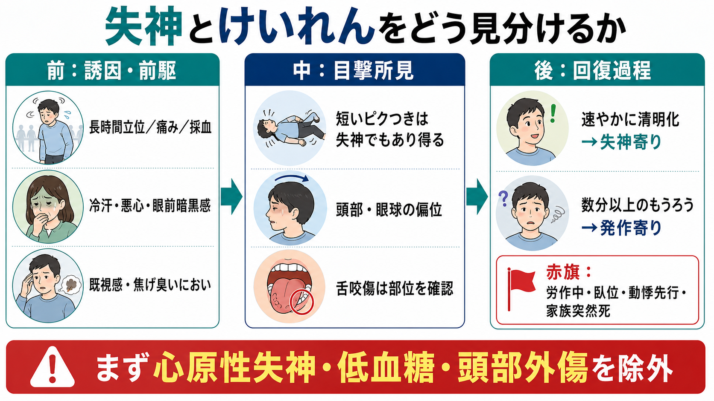
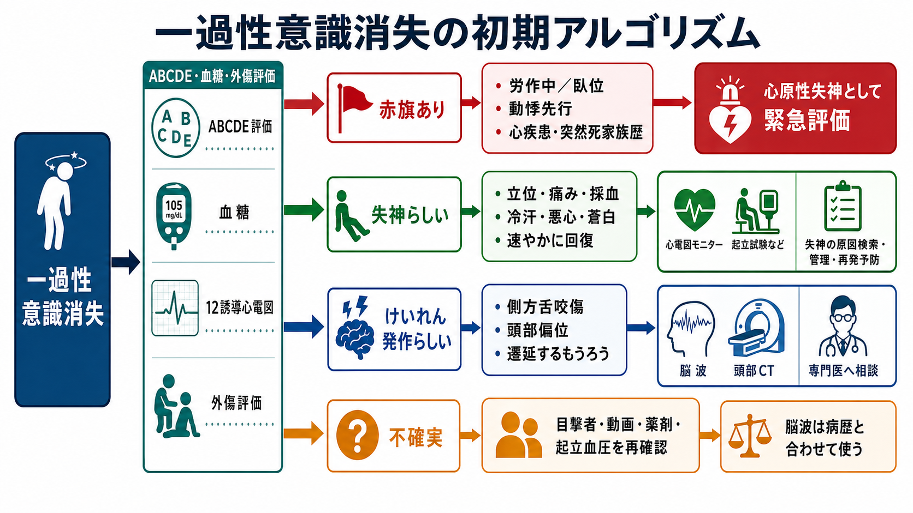
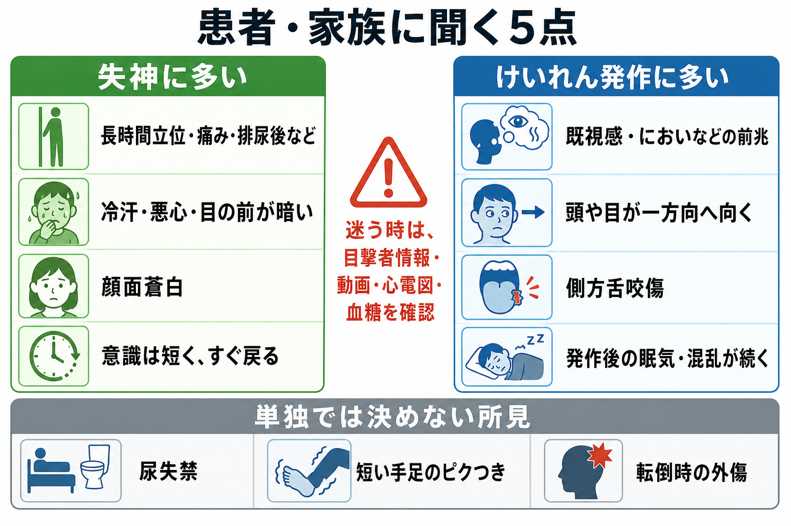

---
title: "失神とけいれんをどう見分けるか"
description: "前駆症状、発作時所見、回復過程、舌咬傷、尿失禁などから、失神とてんかん発作を初期対応で見分けるための実践的整理。"
aliases:
  - "失神とけいれん"
  - "一過性意識消失の鑑別"
tags:
  - 領域/救急・初期対応
  - 種類/クリニカルクエスチョン
  - 対象/研修医
question: "失神とけいれんをどう見分けるか"
clinical_area: "救急・初期対応"
audience: "研修医"
evidence_level: "mixed"
created: "2026-04-27"
updated: "2026-04-27"
enableToc: true
---

# 失神とけいれんをどう見分けるか

> このノートは研修医教育のための一般的な整理であり、個別患者への診断・治療指示ではありません。緊急性が高い、判断に迷う、施設方針が関わる場合は上級医・専門科に相談してください。

## クリニカルクエスチョン

失神とけいれんをどう見分けるか。前駆症状、発作時所見、回復過程、舌咬傷、尿失禁などから、初期対応で何を確認すればよいか。

## まず結論

- 一過性意識消失では、最初に「本当に意識消失か」「外傷・低血糖・低酸素・脳卒中様症状・中毒・心原性失神の赤旗がないか」を確認する。失神診療では病歴、身体診察、起立血圧、12誘導心電図が初期評価の柱である[1,6,7]。
- 失神でも短い四肢のピクつきは起こり得るため、「けいれんがあった」だけでてんかん発作と決めない[6,7]。
- 失神寄りの所見は、長時間立位、痛み、採血、排尿・咳嗽などの誘因、冷汗・悪心・熱感・眼前暗黒感、顔面蒼白、短時間での完全回復である[1,6,7]。
- てんかん発作寄りの所見は、既視感・異臭などの前兆、発作中の頭部・眼球の一方向偏位、側方舌咬傷、長い強直間代運動、発作後のもうろう・眠気・筋痛が数分以上続くことである[3,4,6,8,9]。
- 舌咬傷は特異度が高いが感度は低い。特に側方舌咬傷は発作を強く示唆する一方、舌尖部の咬傷は失神でも起こり得る[6,9]。
- 尿失禁は失神でもてんかん発作でも起こるため、単独では鑑別に使わない[10]。
- 労作中、臥位、動悸先行、心疾患既往、心電図異常、若年突然死の家族歴は心原性失神の赤旗であり、けいれん様運動があっても心臓を優先して評価する[1,2,6,7]。

## 判断の型

1. まず安全確認：ABCDE、バイタル、SpO2、血糖、外傷、意識回復の程度を確認する。
2. 次に赤旗確認：労作中・臥位・動悸先行・胸痛・息切れ・心疾患・突然死家族歴・心電図異常があれば心原性失神として急ぐ[1,2,6,7]。
3. 病歴は「前・中・後」で聞く。前は誘因と前駆症状、中は目撃所見、後は回復過程と神経脱落症状を確認する[6,8]。
4. けいれん様運動は、持続時間、左右差、頭部・眼球偏位、強直相と間代相、発作後もうろうの長さで解釈する。短いミオクローヌス様の動きだけでは失神を除外しない[6,7]。
5. 所見を1つで決めず、目撃者、救急隊記録、家族のスマートフォン動画、薬剤、飲酒、睡眠不足、起立血圧、心電図を組み合わせる[6,7]。

## 初期対応

- ABCDE、気道確保、側臥位、外傷予防、酸素化、循環評価を行う。意識が戻らない、発作が持続する、外傷がある場合は同時並行で上級医を呼ぶ。
- ベッドサイド血糖を早期に確認する。低血糖は失神・けいれん様発作のどちらにも見える。
- 12誘導心電図を記録する。徐脈、房室ブロック、QT延長/短縮、Brugada型、WPW、虚血性変化、頻拍性不整脈を探す[1,2,6,7]。
- 起立性低血圧が疑われる場合は、臥位・立位血圧を安全に測る。脱水、出血、降圧薬、利尿薬、α遮断薬、抗精神病薬などを確認する[6,7]。
- てんかん発作が持続または反復し、てんかん重積状態が疑われる場合は、施設プロトコルに従ってベンゾジアゼピン系薬などを検討する。日本ではミダゾラム静注製剤などの添付文書で呼吸抑制・血圧低下への継続監視、人工呼吸器具・蘇生薬の準備が求められている[5]。

## 鑑別・見逃し

| 優先度 | 疾患・状況 | 見逃さない理由 | 手がかり |
|---|---|---|---|
| 高 | 心原性失神 | 突然死リスクがある | 労作中、臥位、動悸先行、心疾患、心電図異常、突然死家族歴[1,2,6,7] |
| 高 | 低血糖・低酸素 | すぐ介入可能で、けいれん様に見える | 血糖低値、SpO2低下、糖尿病薬、敗血症、呼吸不全 |
| 高 | 頭部外傷・頭蓋内病変 | 転倒後意識障害、抗凝固薬、局所神経徴候では緊急画像を考える | 頭部打撲、抗凝固薬、片麻痺、失語、強い頭痛 |
| 中 | 反射性失神・状況失神 | 頻度が高く、問診で診断に近づける | 長時間立位、痛み、採血、排尿、咳嗽、嚥下、冷汗、悪心[1,6,7] |
| 中 | てんかん発作 | 再発予防、安全指導、専門評価が必要 | 既視感、異臭、頭部偏位、側方舌咬傷、発作後もうろう[3,4,6,9] |
| 中 | 心因性非てんかん発作・心因性偽失神 | 診断は複雑で、安易な断定が有害 | 発作様式が変動、長時間、複数の身体症状。神経評価を検討[6] |

## 検査

| 検査 | 目的 | 注意点 |
|---|---|---|
| 血糖 | 低血糖の除外 | 初期対応で早めに確認する。 |
| 12誘導心電図 | 不整脈・QT異常・虚血・Brugada型など | TLoCでは標準的初期評価。異常があれば心原性を優先する[1,2,6,7]。 |
| 起立血圧 | 起立性低血圧の評価 | 症状、薬剤、脱水、出血と合わせて解釈する。 |
| 採血 | 貧血、電解質異常、感染、腎機能、薬物影響の評価 | ルーチンではなく、病歴・身体所見から目的を決める。 |
| 頭部CT/MRI | 外傷、局所神経徴候、抗凝固薬、頭痛などの評価 | 単純な反射性失神らしさだけで routine に撮る検査ではない。 |
| 脳波 | てんかん診断の補助 | 病歴と合わせて使う。TLoC全例に routine に行う検査ではない[3,6]。 |
| 動画・目撃者情報 | 発作時所見の再構成 | 診断不確実例では非常に有用。家族・救急隊記録も確認する[6]。 |

## 治療・マネジメント

- 失神らしい場合：誘因回避、水分・塩分、立位時の前駆症状への対応、薬剤調整の必要性を確認する。反射性失神や起立性低血圧では、診断説明と誘因回避が再発予防の基本である[6,7]。
- 心原性失神が疑わしい場合：けいれん様運動の有無に引きずられず、モニター、心電図再評価、循環器相談、入院・緊急評価を検討する[1,2,6,7]。
- てんかん発作が疑わしい場合：発作持続、反復、外傷、妊娠、感染、中毒、初発、高齢発症、神経脱落症状を確認し、神経内科・救急上級医へ相談する[3,4,6]。
- 日本での注意：薬剤名、適応、用量、投与経路は国際資料と日本の添付文書・施設プロトコルで異なることがある。ミダゾラムなど鎮静・抗けいれん目的の薬剤は呼吸抑制、舌根沈下、血圧低下に備えて監視・蘇生準備を行う[5]。
- 運転、危険作業、入浴、登山・水辺作業などの安全指導は、診断が確定するまで慎重に行い、地域の法制度・職場規定・専門医判断を確認する。

## 図解

## 指導医に確認するポイント

- 心原性失神を疑う赤旗があり、循環器評価や入院が必要か。
- 初発けいれんとして扱うべきか、反射性失神に伴うけいれん様運動として説明できるか。
- 頭部CT/MRI、脳波、ホルター心電図、植込み型ループレコーダーなどの次の検査をどの順番で行うか。
- 抗けいれん薬を急性期に使う状況か、施設プロトコル上の第一選択薬と投与監視体制は何か。
- 運転・勤務・入浴・スポーツ制限について、どの診療科で誰が説明するか。

## 患者説明

- 「一時的に意識を失う原因には、脳の発作だけでなく、血圧や脈、血糖、脱水などもあります。」
- 「手足が少しピクついたことだけでは、てんかん発作とは決められません。倒れる前、倒れている間、目が覚めた後の様子を合わせて判断します。」
- 「舌を横から強く咬んでいた、発作後にぼんやりした時間が長い、頭や目が一方向を向いていた、という情報は発作を疑う手がかりになります。」
- 「尿失禁は失神でも起こるため、それだけでは区別できません。」
- 「スマートフォン動画や目撃者の話が診断に役立ちます。次に起きた場合は安全を確保したうえで、可能なら時間や様子を記録してください。」

## ピットフォール

- 「けいれんがあった」だけでてんかん発作と決める。失神でも短いけいれん様運動は起こる[6,7]。
- 尿失禁をてんかん発作の決め手にする。尿失禁の診断的価値は低い[10]。
- 舌咬傷の有無だけを見る。側方か舌尖部か、転倒外傷かを確認する[6,9]。
- 若年者・一見元気な患者で心原性失神の赤旗を見落とす。
- 意識が戻らない、片麻痺、失語、低血糖、低酸素、頭部外傷を「発作後だから」と見過ごす。
- 脳波や頭部CTだけで診断を決め、病歴・目撃者情報・心電図を軽視する。

## 関連ノート

- 確認済み内部リンク：[[MOC｜救急・初期対応]]
- 関連ノート候補：一過性意識消失の初期対応、低血糖への初期対応、てんかん重積状態の初期対応、心原性失神の赤旗、起立性低血圧の評価

## MOC更新候補

- [[MOC｜救急・初期対応]] に「失神とけいれんをどう見分けるか」を追加候補。
- 将来 神経カテゴリ（本サイト未同梱） にてんかん関連ノートが増えた場合は、神経MOCからも相互参照候補。

## 参考文献

[1] 日本循環器学会. 失神の診断・治療ガイドライン（2012年改訂版）. https://www.j-circ.or.jp/cms/wp-content/uploads/2020/02/JCS2012_inoue_h.pdf

[2] Japanese Circulation Society and Japanese Heart Rhythm Society Joint Working Group. JCS/JHRS 2022 Guideline on Diagnosis and Risk Assessment of Arrhythmia. Circ J. 2024;88:1509-1595. https://doi.org/10.1253/circj.CJ-22-0827

[3] 日本神経学会. てんかん診療ガイドライン2018. https://www.neurology-jp.org/guidelinem/tenkan_2018.html

[4] 厚生労働省. てんかん対策. https://www.mhlw.go.jp/stf/seisakunitsuite/bunya/0000070789_00008.html

[5] PMDA. ミダフレッサ静注0.1％ 添付文書・医療用医薬品情報. https://www.pmda.go.jp/PmdaSearch/rdDetail/iyaku/1139401A1020_1?user=1

[6] National Institute for Health and Care Excellence. Transient loss of consciousness ('blackouts') in over 16s: CG109. Published 2010, last updated 2023. https://www.nice.org.uk/guidance/cg109

[7] Brignole M, Moya A, de Lange FJ, et al. 2018 ESC Guidelines for the diagnosis and management of syncope. Eur Heart J. 2018;39:1883-1948. https://doi.org/10.1093/eurheartj/ehy037

[8] Sheldon R, Rose S, Ritchie D, et al. Historical criteria that distinguish syncope from seizures. J Am Coll Cardiol. 2002;40:142-148. https://doi.org/10.1016/S0735-1097(02)01940-X

[9] Brigo F, Nardone R, Bongiovanni LG. Value of tongue biting in the differential diagnosis between epileptic seizures and syncope. Seizure. 2012;21:568-572. https://doi.org/10.1016/j.seizure.2012.06.005

[10] Brigo F, Nardone R, Ausserer H, et al. The diagnostic value of urinary incontinence in the differential diagnosis of seizures. Seizure. 2013;22:85-90. https://doi.org/10.1016/j.seizure.2012.10.011

## 更新ログ

- 2026-04-27: 初版作成。国内外の失神・てんかん関連資料を確認し、図解3枚を追加。

