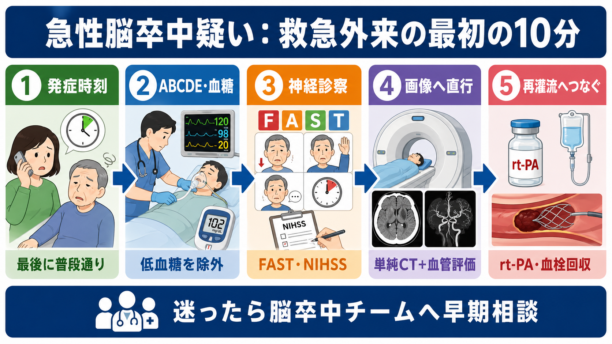
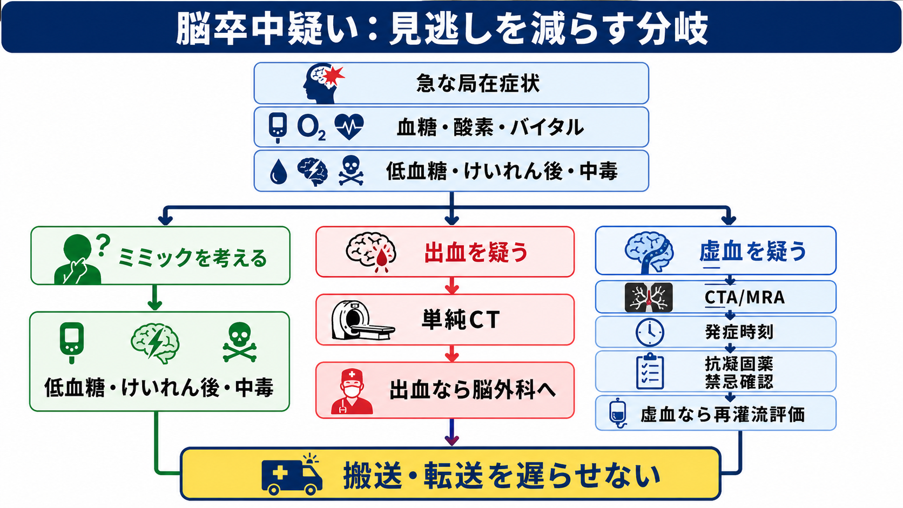
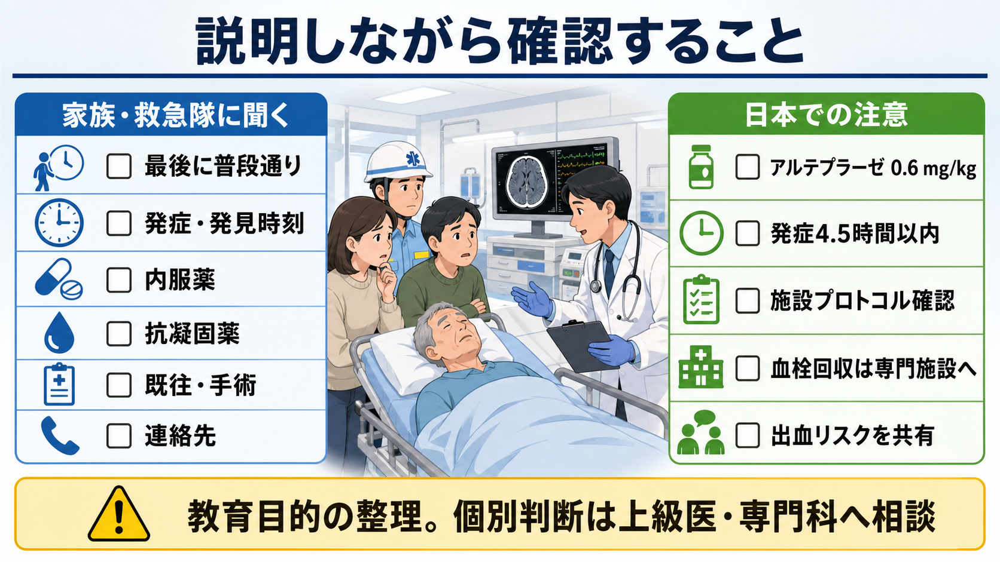

---
title: "急性脳卒中を疑ったら救急外来で何をするか"
description: "発症時刻確認、神経診察、血糖、画像、血栓溶解・血栓回収適応評価へのつなぎを整理する。"
aliases:
  - "急性脳卒中初期対応"
  - "脳卒中疑い"
  - "stroke alert"
tags:
  - 領域/救急・初期対応
  - 種類/クリニカルクエスチョン
  - 対象/研修医
question: "急性脳卒中を疑ったら救急外来で何をするか"
clinical_area: "救急・初期対応"
audience: "研修医"
evidence_level: "guideline"
created: "2026-04-27"
updated: "2026-04-27"
enableToc: true
---

# 急性脳卒中を疑ったら救急外来で何をするか

> このノートは研修医教育のための一般的整理であり、個別患者の診断・治療指示ではありません。緊急性が高い、判断に迷う、施設方針が関わる場合は上級医・専門科に相談してください。

## クリニカルクエスチョン

救急外来で急な片麻痺、失語、構音障害、共同偏視、めまい・失調、意識障害、突然の激しい頭痛などから急性脳卒中を疑ったとき、研修医は最初に何を確認し、どの順番で画像・再灌流治療評価へつなぐべきか。

## まず結論

- 急性脳卒中疑いは「診断名を確定してから動く」のではなく、**発症時刻・最後に普段通りだった時刻、ABCDE、血糖、神経局在、画像、脳卒中チーム連絡**を並行して進める時間依存疾患として扱う[2],[5],[6]。
- 最初に確認する時刻は、本人が「症状に気づいた時刻」だけでなく、**最後に普段通りだった時刻 last known well**である。睡眠中発症、発見時発症、失語・意識障害では家族・救急隊から確認する[2],[5]。
- 低血糖、低酸素、けいれん後、中毒、片頭痛、末梢性めまいなどは脳卒中に似る。血糖は画像より前に短時間で確認し、ただし血糖測定のために画像搬送を不必要に止めない[5],[6]。
- 頭部単純CTまたはMRIで出血を除外し、主幹動脈閉塞が疑われる場合はCTA/MRAなど血管評価へつなぐ。画像は「rt-PA静注療法」「血栓回収療法」「出血性脳卒中対応」「転送」の判断に直結する[1],[2],[4],[5]。
- 日本では虚血性脳血管障害急性期のアルテプラーゼは添付文書上0.6 mg/kg、上限60 mgで、海外の0.9 mg/kg前提の記載をそのまま使わない[2],[3],[7]。
- 血栓回収療法は専門施設・専門チームの治療である。救急外来では適応を一人で決めるより、発症時刻、神経所見、画像、抗凝固薬、ADL、禁忌情報をそろえて早期に相談・転送判断へつなぐ[4],[5],[8]。

## 判断の型

1. **脳卒中アラートとして扱う**: FAST陽性、突然の神経脱落、共同偏視、失語、半側空間無視、急な重度めまい・失調、突然の激しい頭痛では、救急・神経内科・脳外科・放射線・看護へ早めに共有する[5],[6]。
2. **時刻を固定する**: 発症時刻、最後に普段通りだった時刻、発見時刻、救急隊接触時刻、到着時刻を分けて記録する。本人が話せなければ家族、施設、目撃者、救急隊に確認する[2],[5]。
3. **ABCDEと血糖を同時に見る**: 気道、呼吸、循環、SpO2、血圧、体温、血糖、意識レベルを確認する。低血糖や低酸素は脳卒中様症状を作り、補正できる[5],[6]。
4. **神経所見を短く標準化する**: 顔面麻痺、上肢・下肢麻痺、失語・構音障害、共同偏視、視野、感覚、失調、無視を確認し、可能ならNIHSSで重症度を共有する[5],[6]。
5. **画像へ進める**: 頭部単純CTまたはMRIで出血を確認し、虚血性脳卒中・主幹動脈閉塞が疑われる場合は施設プロトコルに沿ってCTA/MRAや灌流画像を追加する[1],[4],[5]。
6. **再灌流治療へつなぐ**: rt-PA静注療法、血栓回収療法、出血性脳卒中対応、脳卒中専門施設への転送を、上級医・専門科と同時進行で判断する[2],[4],[5]。

## 初期対応

- 到着直後に「脳卒中疑い」と声に出して共有し、バイタル測定、心電図モニター、静脈路、採血、血糖、同伴者聴取、画像依頼の役割分担をする。
- 気道保護が必要な意識障害、嘔吐、けいれん持続、低酸素、ショックでは、再灌流評価と同時にABCDEを優先する。重症例では救急科、麻酔科、集中治療、脳卒中チームへ早期に応援を呼ぶ。
- 発症時刻は「何時何分から」だけでなく、「最後に普段通り話せた・歩けた・見られた時刻」を聞く。起床時発見では就寝時刻と起床時刻、夜間トイレなど途中で普段通りだった証言を確認する[2],[7]。
- 内服薬はお薬手帳、薬袋、施設薬剤表で確認する。特にワルファリン、DOAC、抗血小板薬、インスリン・SU薬、降圧薬、抗てんかん薬、睡眠薬・向精神薬を優先する。
- 採血は血算、電解質、腎機能、肝機能、血糖、凝固、心筋マーカーなどを施設手順に沿って出す。ただし、血糖や抗凝固薬情報など治療判断に直結する項目を除き、採血結果待ちで画像を遅らせない[5],[6]。
- 血圧は治療適応で扱いが変わる。高血圧を見ただけで反射的に下げず、rt-PA、血栓回収、脳出血、くも膜下出血、大動脈解離などの文脈を上級医と確認する[1],[5]。

## 鑑別・見逃し

| 優先度 | 疾患・状態 | 見逃さない理由 | 手がかり |
|---|---|---|---|
| 高 | 脳出血・くも膜下出血 | 抗血栓薬や血栓溶解は危険になりうる。脳外科対応が必要 | 突然の激しい頭痛、嘔吐、意識障害、高血圧、抗凝固薬 |
| 高 | 急性期脳梗塞・主幹動脈閉塞 | rt-PA、血栓回収、転送判断が時間依存 | 片麻痺、失語、共同偏視、半側空間無視、NIHSS高値[4],[5] |
| 高 | 低血糖・高血糖緊急症 | 可逆的で脳卒中様症状を来す | 糖尿病薬、食事摂取不良、冷汗、意識変容、血糖異常[5] |
| 高 | けいれん後麻痺・非けいれん性てんかん重積 | Todd麻痺は脳卒中に似る。発作持続なら治療が遅れる | 目撃発作、舌咬傷、尿失禁、意識回復遅延、反復する眼球偏位 |
| 高 | 大動脈解離 | 脳梗塞様症状で来ることがあり、血栓溶解が危険 | 胸背部痛、失神、血圧左右差、脈拍左右差、縦隔拡大 |
| 中 | 片頭痛、末梢性めまい、Bell麻痺 | mimicだが、脳幹・小脳梗塞を除外する必要がある | 頭痛歴、前兆、眼振、歩行不能、構音障害、顔面以外の神経所見 |
| 中 | 中毒・薬剤性・代謝性脳症 | 意識障害や構音障害の原因になる | アルコール、睡眠薬、向精神薬、オピオイド、肝腎不全、電解質異常 |

## 検査

| 検査 | 目的 | 注意点 |
|---|---|---|
| 迅速血糖 | 低血糖・高血糖緊急症を拾う | 脳卒中様症状の可逆的原因。測定は早く、画像搬送を止めすぎない[5],[6] |
| 神経診察、FAST、NIHSS | 局在と重症度を共有する | NIHSSが低くても失語、半盲、巧緻運動障害など生活に影響する症状は軽視しない[5] |
| 頭部単純CT | 出血、広範な早期虚血変化、腫瘤性病変の確認 | 「CTで異常なし」は脳梗塞否定ではない。症状と時間で次の画像を考える |
| MRI DWI/FLAIR | 早期虚血、発症時刻不明例の補助 | 施設で即時実施できるか、モニター・気道リスクに耐えられるかを確認する[7] |
| CTA/MRA | 主幹動脈閉塞、血栓回収候補の評価 | 腎機能や造影リスクよりも治療可能性が優先される場面があるため、上級医・放射線と相談する[4],[5] |
| 採血、凝固、腎機能、心電図 | 禁忌、抗凝固状態、造影、塞栓源評価の補助 | 全結果を待って再灌流判断を止めない。抗凝固薬内服時は薬剤名と最終内服時刻が重要 |
| 胸部X線、心エコー、頸動脈エコー | 鑑別・入院後評価 | 初期の再灌流評価を遅らせる検査にしない |

## 治療・マネジメント

- 救急外来での主目標は、脳梗塞・脳出血・くも膜下出血・mimicを見分けながら、治療可能な患者を**再灌流治療または専門治療に間に合わせる**ことである[1],[2],[4],[5]。
- rt-PA静注療法候補では、発症または最後に普段通りだった時刻、症状の程度、画像での出血否定、血圧、血糖、抗凝固薬、最近の手術・出血、既往脳出血などをチームで確認する[2],[3],[7]。
- 血栓回収療法候補では、主幹動脈閉塞、発症時刻、画像所見、病前ADL、重症度、搬送時間をそろえ、実施可能施設へ相談する。適正使用指針第5版は2024年版として公開されており、施設要件と適応判断を専門チームで扱う[4]。
- 脳出血やくも膜下出血が疑われる、または画像で確認された場合は、血圧管理、抗凝固薬中和、脳外科相談、集中治療適応を上級医と判断する。研修医だけで降圧目標や中和薬を決めない。
- 嚥下評価前の経口摂取は避け、誤嚥リスクを確認する。AHA/ASAの急性期ガイドラインでも嚥下スクリーニングは入院後管理の重要項目として扱われる[5]。
- **日本での注意: アルテプラーゼ用量。** 日本のアクチバシン添付文書では虚血性脳血管障害急性期に伴う機能障害の改善は発症後4.5時間以内、0.6 mg/kg、上限60 mgで、総量10%を急速投与し残りを1時間で投与する記載である[3]。海外ガイドラインの0.9 mg/kgを日本の救急外来でそのまま使わない。
- **日本での注意: tenecteplase。** AHA/ASA 2026は急性期脳梗塞の4.5時間以内血栓溶解でtenecteplaseを含めた推奨を示しているが[5]、日本の院内運用では国内承認、添付文書、採用薬、学会指針、施設プロトコルを確認する。海外動向を理由に独自判断で置き換えない。
- **日本での注意: 医療提供体制。** 厚生労働省の第2期循環器病対策推進基本計画は、脳卒中を含む循環器病の急性期から回復期・慢性期までの医療提供体制整備を国の課題として扱う[8]。救急外来では、自施設で完結できない場合の転送先、画像共有、搬送手順を普段から確認しておく。

## 図解

## 指導医に確認するポイント

- この患者の「最後に普段通りだった時刻」はいつか。発症時刻と発見時刻を混同していないか。
- NIHSSまたは神経所見から、主幹動脈閉塞を疑う所見はあるか。
- rt-PA静注療法候補として、血圧、血糖、画像、抗凝固薬、最近の手術・出血、既往をどこまで確認できたか。
- 血栓回収療法候補として、CTA/MRAや専門施設への相談・転送を急ぐべきか。
- 脳出血、くも膜下出血、大動脈解離、低血糖、けいれん後麻痺など、血栓溶解前に見落とすと危険な病態はないか。
- 自施設の脳卒中アラート、画像プロトコル、rt-PAチェックリスト、転送基準は何か。

## 患者説明

- 「脳の血管が詰まったり出血したりしている可能性があるため、時間を区切って検査と専門医への連絡を同時に進めています。」
- 「治療できる時間が限られることがあるので、最後に普段通りだった時刻、症状に気づいた時刻、飲んでいる薬を急いで確認しています。」
- 「血糖やけいれん後など、脳卒中に似た状態もあるため、血糖や画像で確認します。」
- 「血栓を溶かす薬やカテーテル治療が使えるかは、画像、時間、出血リスク、普段の生活状況を合わせて専門チームで判断します。」

## ピットフォール

- 「発症時刻」だけ聞いて、最後に普段通りだった時刻を記録しない。
- 意識障害や失語の患者で、本人の病歴だけに頼り、救急隊・家族・施設から時刻と薬剤情報を取らない。
- 血糖を測らずに脳卒中と決めつける、または血糖・採血待ちで画像を不必要に遅らせる。
- CTで出血がないだけで安心し、急性期脳梗塞や主幹動脈閉塞を否定したつもりになる。
- NIHSSが低いことだけで「軽症」と判断し、失語、半盲、手の巧緻運動障害、歩行不能を軽視する。
- 海外資料のアルテプラーゼ0.9 mg/kgやtenecteplase推奨を、日本の添付文書・施設手順を確認せずに持ち込む。
- 自施設で血栓回収ができないのに、相談・転送判断を画像後まで先送りする。

## 関連ノート

- [[MOC｜救急・初期対応]]
- MOC｜神経（本サイト外）
- [[救急外来で病歴聴取が難しい患者から何を聞くべきか]]
- [[第一印象で重症そうな患者を見たら最初の1分で何をするか]]
- 関連ノート候補（未作成）: 意識障害を見たら最初に何を確認するか
- 関連ノート候補（未作成）: 救急外来で血糖をいつ測るか
- 関連ノート候補（未作成）: 突然の頭痛を見たら何を疑うか
- 関連ノート候補（未作成）: めまいで中枢性を疑う所見は何か

## MOC更新候補

- [[MOC｜救急・初期対応]] に「意識障害・けいれん」または「時間依存疾患」配下の記事として追加候補。
- MOC｜神経.md（本サイト外） に「急性脳卒中・神経救急」の入口ノートとして追加候補。
- MOC｜検査・画像・手技.md（本サイト外） に「頭部CT・CTA/MRAを急ぐ場面」として関連候補。
- MOC｜薬剤・処方・副作用.md（本サイト外） に「アルテプラーゼ、抗凝固薬、血栓溶解前確認」として関連候補。

## 参考文献

[1] 日本脳卒中学会 脳卒中ガイドライン委員会. 脳卒中治療ガイドライン2021〔改訂2025〕. 協和企画; 2025. DOI: https://doi.org/10.24733/9784877942410

[2] 日本脳卒中学会 脳卒中医療向上・社会保険委員会／静注血栓溶解療法指針改訂部会. 静注血栓溶解（rt-PA）療法 適正治療指針 第三版 2019年3月. 脳卒中. 2019;41(3):205-246. DOI: https://doi.org/10.3995/jstroke.10731

[3] 独立行政法人 医薬品医療機器総合機構. 医療用医薬品情報: アクチバシン注600万／1200万／2400万（アルテプラーゼ〔遺伝子組換え〕）. 添付文書 2024年5月7日. https://www.pmda.go.jp/PmdaSearch/rdSearch/02/3959402D2023?user=1

[4] 日本脳卒中学会, 日本脳神経外科学会, 日本脳神経血管内治療学会. 経皮経管的脳血栓回収用機器 適正使用指針 第5版. 脳卒中. 2024;46(2):181-216. DOI: https://doi.org/10.3995/jstroke.11203

[5] Prabhakaran S, Gonzalez NR, Zachrison KS, et al. 2026 Guideline for the Early Management of Patients With Acute Ischemic Stroke: A Guideline From the American Heart Association/American Stroke Association. Stroke. Published online January 26, 2026. DOI: https://doi.org/10.1161/STR.0000000000000513

[6] Canadian Stroke Best Practices. Emergency Department Evaluation and Management of Patients with Transient Ischemic Attack and Acute Stroke. 2022 update. https://www.strokebestpractices.ca/recommendations/acute-stroke-management/emergency-department-evaluation-and-management

[7] Berge E, Whiteley W, Audebert H, et al. European Stroke Organisation (ESO) guidelines on intravenous thrombolysis for acute ischaemic stroke. European Stroke Journal. 2021;6(1):I-LXII. DOI: https://doi.org/10.1177/2396987321989865

[8] 厚生労働省. 循環器病対策推進基本計画（第2期）. 2023年3月28日閣議決定. https://www.mhlw.go.jp/stf/newpage_31654.html

## 更新ログ

- 2026-04-27: 初版作成。
