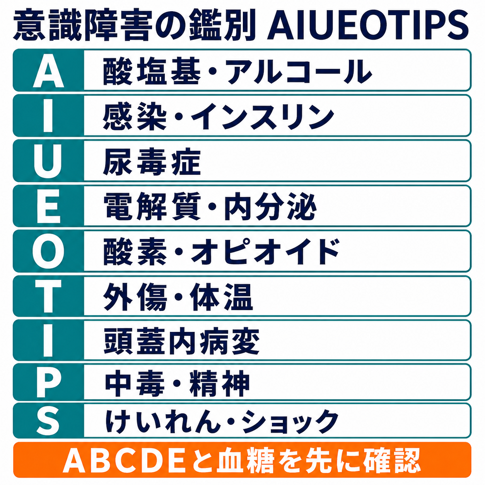
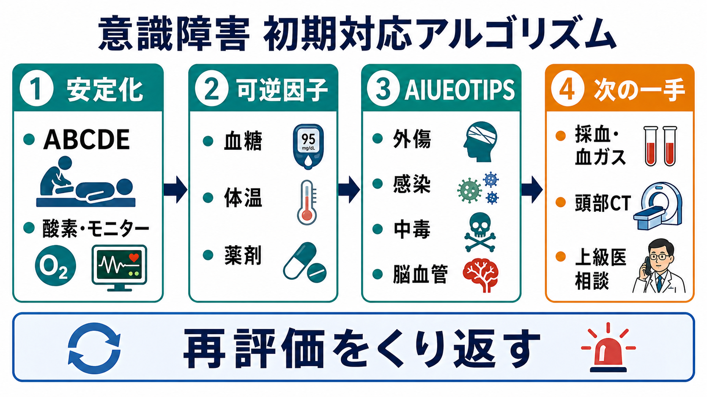

---
title: "意識障害の鑑別をAIUEOTIPSでどう整理するか"
description: "代謝・感染・外傷・中毒・脳血管障害などを漏れなく考えるため、AIUEOTIPSを安定化後のチェックリストとして使う。"
aliases:
  - "AIUEOTIPS"
  - "意識障害の鑑別"
tags:
  - 領域/救急・初期対応
  - 種類/クリニカルクエスチョン
  - 対象/研修医
question: "意識障害の鑑別をAIUEOTIPSでどう整理するか"
clinical_area: "救急・初期対応"
audience: "研修医"
evidence_level: "mixed"
created: "2026-04-27"
updated: "2026-04-27"
enableToc: true
---

# 意識障害の鑑別をAIUEOTIPSでどう整理するか

> このノートは研修医教育のための一般的整理であり、個別患者の診断・治療指示ではありません。緊急性が高い、判断に迷う、施設方針が関わる場合は上級医・専門科に相談してください。

## クリニカルクエスチョン

意識障害の患者を前にしたとき、代謝、感染、外傷、中毒、脳血管障害などを漏れなく考えるために、AIUEOTIPSをどの順番で使えばよいか。

## まず結論

- AIUEOTIPSは、最初に唱える語呂ではなく、**ABCDE、バイタル、SpO2、体温、血糖、けいれんの有無を見た後** に鑑別漏れを減らすチェックリストとして使う[1][2]。
- 最初に除外するのは、低酸素、ショック、低血糖、けいれん重積、頭蓋内出血・脳卒中、重症感染、外傷、中毒である。これらは原因検索と初期介入を同時に進める[1][3][5][7]。
- AIUEOTIPSの各文字は施設や教科書で少し異なる。研修医は「A=酸塩基/アルコール、I=感染/インスリン、U=尿毒症、E=電解質/内分泌、O=酸素/オピオイド、T=外傷/体温、I=頭蓋内病変、P=中毒/精神、S=けいれん/ショック」として整理すると使いやすい。
- 意識障害を精神症状、酩酊、認知症、せん妄だけで説明しない。低血糖や低酸素はすぐ測れる可逆因子であり、脳卒中や頭部外傷は治療時間と画像適応が問題になる[3][5][6]。
- 日本での注意: 意識レベルはJCSとGCSのどちらか一方だけでなく、可能なら併記し、開眼・発語・従命・痛み刺激への反応を言葉でも共有する。薬剤性を疑う場合は国内添付文書やPMDA情報を確認する[1][4]。

## 判断の型

1. **安定化を先に置く**: 気道、呼吸、循環、意識、体温、血糖を確認する。発語不能、低酸素、低血圧、けいれん、低血糖があれば、鑑別を待たずに対応を始める[2][3]。
2. **時間軸を押さえる**: 最終健常時刻、発見時刻、急変の速さ、外傷・転倒、けいれん、薬剤・飲酒、発熱を救急隊・家族から確認する。脳卒中や頭部外傷では時間情報が治療選択に直結する[5][6]。
3. **AIUEOTIPSで横断的に確認する**: 1つの異常で満足せず、代謝、感染、薬剤、中枢神経、循環・呼吸を並列に見る。高齢者や多疾患患者では原因が複数重なる。
4. **検査は目的別に出す**: 血糖、血液ガス、電解質、腎肝機能、感染評価、薬毒物、心電図、画像を「どの文字を確認するか」と結びつける。
5. **再評価で更新する**: 検査陰性1回で終えず、意識レベル、呼吸、循環、神経所見、体温、尿量、家族情報を反復評価する。

## 初期対応

- 到着直後は、呼びかけへの反応、発語、気道音、呼吸数、SpO2、血圧、脈拍、体温、外傷所見を同時に見る。意識障害はJCS/GCSだけでなく、具体的反応を記録する[1]。
- 迅速血糖は早期に確認する。PMDAの低血糖マニュアルでも、低血糖は発汗、振戦、異常行動、意識障害、けいれんを来しうる重篤な副作用として扱われている[3]。
- オピオイド中毒を疑う場合は、呼吸数低下、縮瞳、薬剤歴、貼付薬、注射痕、同居者情報を確認する。日本での注意として、ナロキソンは国内添付文書上の適応・用法用量・再鎮静リスクを確認し、施設手順と上級医判断で扱う[4]。
- けいれんが持続する、回復しない、反復する場合は、低血糖、低Na血症、頭蓋内病変、中毒、感染を同時に考え、上級医へ早期共有する。
- 発熱、低体温、頻呼吸、低血圧、末梢冷感、皮疹、項部硬直があれば、敗血症、髄膜炎・脳炎、熱中症、低体温を意識する。敗血症では意識変容が臓器障害の一部として扱われる[7][8]。

## 鑑別・見逃し

| 優先度 | 疾患・状態 | 見逃さない理由 | 手がかり |
|---|---|---|---|
| 高 | 低酸素・高CO2血症 | 意識障害の原因であり、処置が遅れると心停止に近づく | SpO2低下、呼吸数異常、喘鳴、COPD、鎮静薬 |
| 高 | 低血糖 | すぐ測れて可逆的。精神症状やけいれんに見える | 糖尿病薬、食事摂取不良、腎機能低下、発汗、振戦[3] |
| 高 | 脳卒中・頭蓋内出血 | 治療時間、抗凝固薬、画像判断が重要 | 片麻痺、失語、共同偏視、突然発症、頭痛、瞳孔差[5] |
| 高 | 頭部外傷 | 本人が受傷機転を話せず、抗凝固薬で出血リスクが上がる | 転倒、外表傷、酩酊、抗凝固薬、GCS低下[6] |
| 高 | 敗血症・髄膜炎・脳炎 | 発熱が目立たないことがあり、初期治療の遅れが害になる | 体温異常、頻呼吸、低血圧、皮疹、項部硬直、感染巣[7][8] |
| 高 | 中毒・薬剤性 | 呼吸抑制、低血圧、不整脈、低血糖を合併する | 眠剤、向精神薬、オピオイド、アルコール、薬袋、空包[4] |
| 中 | 電解質・内分泌 | 低Na血症、Ca異常、甲状腺・副腎疾患は非特異的に出る | 利尿薬、嘔吐下痢、脱水、徐脈、低体温、色素沈着 |
| 中 | 尿毒症・肝性脳症 | 慢性疾患の急性増悪として見逃す | 透析歴、腎不全、肝硬変、羽ばたき振戦、消化管出血 |
| 中 | 精神疾患・せん妄 | 除外診断に近く、器質疾患を先に見る必要がある | 変動する注意障害、睡眠覚醒リズム、薬剤変更、環境変化 |

## 検査

| 検査 | 目的 | 注意点 |
|---|---|---|
| 迅速血糖 | Iのインスリン/低血糖を確認 | 意識障害、異常行動、けいれんでは早期に測る[3] |
| 血液ガス、乳酸 | Oの酸素、Aの酸塩基、ショックを評価 | CO2ナルコーシス、代謝性アシドーシス、循環不全を拾う |
| 電解質、腎機能、肝機能、浸透圧 | U、E、肝性脳症、脱水を評価 | Na、Ca、尿毒症、肝不全は神経症状を起こす |
| CBC、CRP、血液培養、尿検査、胸部画像 | Iの感染、敗血症、肺炎、尿路感染を評価 | 培養採取で初期抗菌薬を過度に遅らせない[7][8] |
| 心電図、トロポニン | 不整脈、ACS、薬物中毒の合併を評価 | 意識障害だけでも循環器疾患は除外しにくい |
| 頭部CT/MRI | 頭蓋内出血、脳梗塞、外傷を評価 | GCS低下、神経局在、頭部外傷、抗凝固薬では適応を早めに相談する[5][6] |
| 薬毒物関連検査 | Pの中毒・薬剤性を評価 | 検査で拾えない薬剤も多く、薬袋・家族情報が重要 |
| 髄液検査、EEG | 髄膜炎・脳炎、非けいれん性てんかん重積を評価 | 画像や抗菌薬開始との順序は上級医・専門科と相談する |

## 治療・マネジメント

- 「AIUEOTIPSを埋めてから治療」ではなく、低酸素、低血糖、ショック、けいれん、敗血症疑い、脳卒中疑い、外傷を見つけた時点で対応を開始する[2][3][5][7]。
- 低血糖を疑うときは、施設手順に従って糖補正を行い、原因としてインスリン、SU薬、食事摂取不良、腎機能低下、アルコールを確認する。補正後も再低下を監視する[3]。
- 脳卒中疑いでは、最終健常時刻、抗凝固薬、血糖、血圧、神経局在を早期に共有する。日本では血栓溶解療法や血栓回収療法の適応・搬送先が施設体制に左右されるため、国内手順と国際ガイドラインの双方を踏まえて脳卒中対応手順に乗せる[5][9]。
- 頭部外傷では、GCS低下、神経局在、嘔吐、けいれん、抗凝固薬、受傷機転を確認する。NICEは成人頭部外傷でGCS低下などの危険因子がある場合、早期CTを推奨している[6]。
- 敗血症疑いでは、感染巣検索、培養、乳酸、循環評価、抗菌薬、輸液、昇圧薬の要否をチームで判断する。日本では抗菌薬選択、採用薬、AST/ICT運用、ICU入室基準に施設差がある[7][8]。
- 日本での注意: ナロキソン、ベンゾジアゼピン拮抗薬、抗てんかん薬、血栓溶解薬、抗菌薬などは、国内添付文書、禁忌、保険適用、施設プロトコルを確認する。海外資料の用量や製剤をそのまま持ち込まない[4][5]。

## 図解

## 指導医に確認するポイント

- この患者で、まず処置すべきABCDE異常、低血糖、けいれん、ショックはあるか。
- 最終健常時刻、発見時刻、薬剤、抗凝固薬、飲酒、転倒、発熱は確認できているか。
- AIUEOTIPSのどの項目がまだ未評価か。未評価のまま帰宅・病棟移動してよいか。
- 頭部CT、MRI、髄液検査、EEG、薬毒物検査の適応と順序は妥当か。
- 脳卒中、敗血症、髄膜炎・脳炎、中毒、非けいれん性てんかん重積について、専門科相談や転院判断が必要か。

## 患者説明

- 「意識がはっきりしない原因は、血糖、酸素、感染、脳の病気、薬、外傷など複数あり得ます。」
- 「まず呼吸、血圧、血糖、けいれんなど、命に関わる異常から確認しています。」
- 「検査結果がそろう前でも、危険な状態が疑われる場合は治療を並行して始めます。」
- 「ご家族や救急隊から、最後に普段通りだった時刻、薬、飲酒、転倒、発熱の情報を確認します。」

## ピットフォール

- AIUEOTIPSを唱えることに集中し、低酸素、ショック、低血糖、けいれんを後回しにする。
- 「酩酊」「認知症」「精神症状」として片づけ、頭蓋内病変、低血糖、感染、中毒を確認しない。
- 発症時刻だけ聞いて、**最後に普段通りだった時刻** を確認しない。
- 血糖補正後に安心し、再低下や併存する脳卒中・感染・外傷を見逃す。
- 薬毒物検査が陰性なら中毒ではない、と考える。検査で拾えない薬剤や時間差がある。
- JCS/GCSの数字だけを申し送り、具体的な反応と変化を共有しない。

## 関連ノート

- [[MOC｜救急・初期対応]]
- [[救急外来で病歴聴取が難しい患者から何を聞くべきか]]
- [[ショック患者を見たら最初に何をするか]]
- 関連ノート候補（未作成）: けいれん重積を疑ったとき最初に何をするか
- 関連ノート候補（未作成）: 救急外来で血糖をいつ測るか
- 関連ノート候補（未作成）: 頭部外傷で頭部CTをいつ撮るか

## MOC更新候補

- [[MOC｜救急・初期対応]] に「意識障害・けいれん」配下の記事として追加候補。
- MOC｜神経.md（本サイト外） に「急性意識障害の鑑別」として関連候補。
- MOC｜薬剤・処方・副作用.md（本サイト外） に「中毒・薬剤性意識障害」として関連候補。
- MOC｜感染症・抗菌薬.md（本サイト外） に「敗血症・髄膜炎での意識障害」として関連候補。

## 参考文献

[1] 日本救急医学会. 医学用語解説集: 意識障害. https://www.jaam.jp/dictionary/dictionary/word/1025.html

[2] 日本蘇生協議会. JRC蘇生ガイドライン2020. https://www.jrc-cpr.org/jrc-guideline-2020/

[3] 独立行政法人 医薬品医療機器総合機構. 重篤副作用疾患別対応マニュアル（医療関係者向け）: 低血糖. https://www.pmda.go.jp/safety/info-services/drugs/adr-info/manuals-for-hc-pro/0001.html

[4] 独立行政法人 医薬品医療機器総合機構. ナロキソン塩酸塩注射液 医療用医薬品情報. https://www.pmda.go.jp/PmdaSearch/rdSearch/02/2219402A1049?user=1

[5] 日本脳卒中学会. 静注血栓溶解（rt-PA）療法 適正治療指針 第三版. 2019. https://www.jsts.gr.jp/img/rt-PA03.pdf

[6] National Institute for Health and Care Excellence. Head injury: assessment and early management. NICE guideline NG232. 2023. https://www.nice.org.uk/guidance/ng232

[7] Egi M, Ogura H, Yatabe T, et al. The Japanese Clinical Practice Guidelines for Management of Sepsis and Septic Shock 2020 (J-SSCG 2020). Journal of Intensive Care. 2021. DOI: https://doi.org/10.1186/s40560-021-00597-1

[8] Evans L, Rhodes A, Alhazzani W, et al. Surviving Sepsis Campaign: International Guidelines for Management of Sepsis and Septic Shock 2021. Intensive Care Medicine. 2021. DOI: https://doi.org/10.1007/s00134-021-06506-y

[9] Powers WJ, Rabinstein AA, Ackerson T, et al. Guidelines for the Early Management of Patients With Acute Ischemic Stroke: 2019 Update. Stroke. 2019. DOI: https://doi.org/10.1161/STR.0000000000000211

## 更新ログ

- 2026-04-27: 初版作成。
