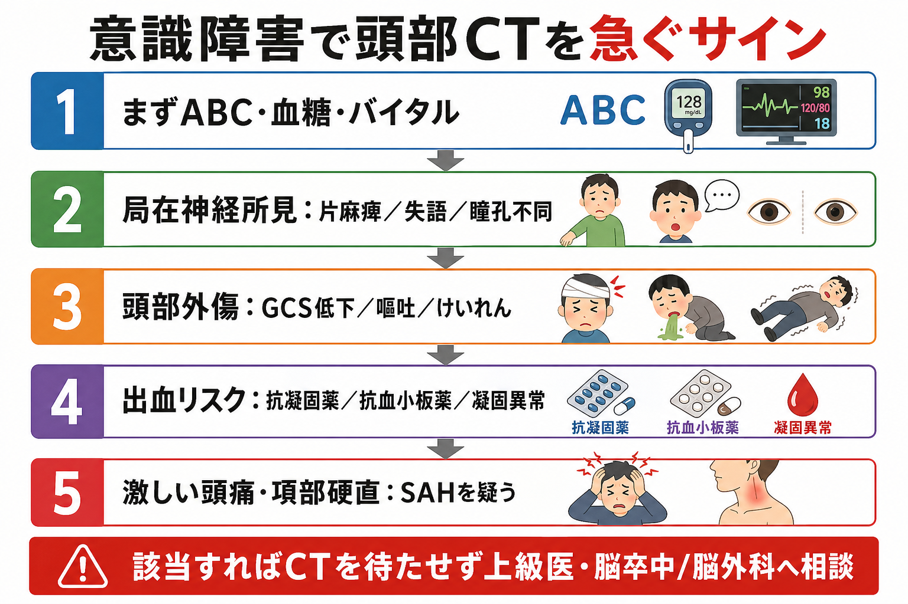
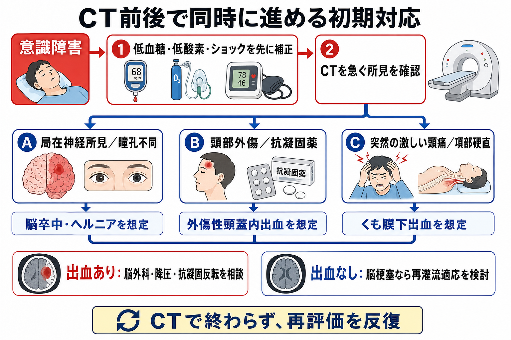
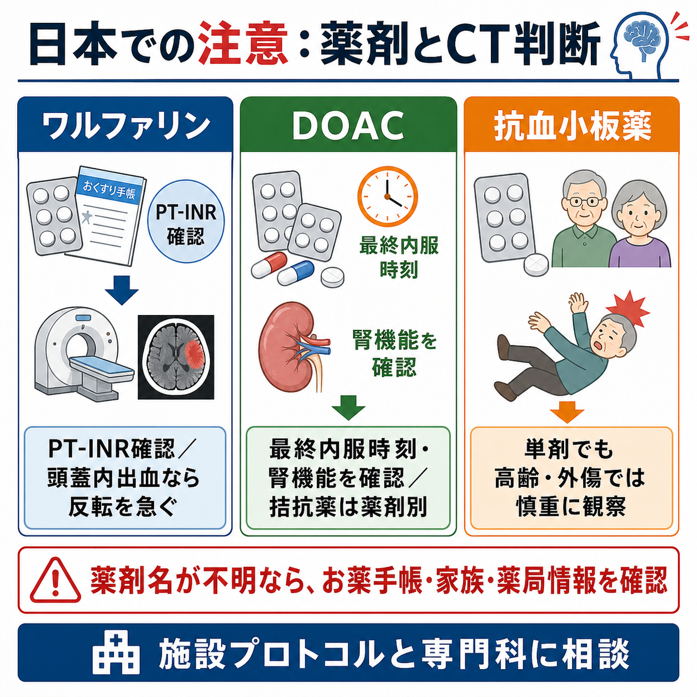

---
title: "意識障害患者で頭部CTを急ぐべき所見は何か"
description: "片麻痺・瞳孔不同・頭部外傷・抗凝固薬内服など、意識障害で頭蓋内病変を疑い頭部CTを急ぐ所見を整理する。"
aliases:
  - "意識障害と頭部CT"
tags:
  - 領域/救急・初期対応
  - 種類/クリニカルクエスチョン
  - 対象/研修医
question: "意識障害患者で頭部CTを急ぐべき所見は何か"
clinical_area: "救急・初期対応"
audience: "研修医"
evidence_level: "guideline/review"
created: "2026-04-27"
updated: "2026-04-27"
enableToc: true
---

# 意識障害患者で頭部CTを急ぐべき所見は何か

> このノートは研修医教育のための一般的整理であり、個別患者の診断・治療指示ではありません。緊急性が高い、判断に迷う、施設方針が関わる場合は上級医・専門科に相談してください。

## クリニカルクエスチョン

意識障害患者で頭部CTを急ぐべき所見は何か。

## まず結論

- 意識障害で「頭蓋内病変を見つけると初期対応が変わる」場面では、単純頭部CTを急ぐ。特に片麻痺、失語、共同偏視、瞳孔不同、けいれん後も戻らない意識障害は脳卒中・頭蓋内出血・脳ヘルニアを疑う所見である[1,2,8,9]。
- 頭部外傷では、GCS 12以下、受傷2時間後もGCS 15未満、開放/陥没骨折疑い、頭蓋底骨折徴候、外傷後けいれん、局在神経所見、複数回嘔吐はCTを急ぐ所見である[3,6,7]。
- ワルファリン、DOAC、抗血小板薬、血液疾患、肝不全、透析、抗凝固薬の可能性が不明な高齢者では、軽微な外傷でも出血リスクを低く見積もらない[5,7]。
- 突然発症の激しい頭痛、項部硬直、嘔吐、失神、神経脱落症状を伴う意識障害では、くも膜下出血を想定し、単純CTを急ぐ[10]。
- CTへ向かう前に、低血糖、低酸素、ショック、気道閉塞は同時並行で補正する。CTを理由にABCDEを止めない。
- CTで出血が見えた、またはヘルニア徴候がある場合は、脳神経外科・脳卒中チームへ早期相談する。抗凝固薬の反転、降圧、手術適応は施設プロトコルと専門科判断に従う[2,5,9]。

## 判断の型

1. まず「CT室へ運べる状態か」を確認する。気道、呼吸、循環、血糖、体温、SpO2を確認し、低血糖・低酸素・ショックはCT前から補正する。
2. 次に「頭の中で起きていそうなサイン」を探す。片麻痺、顔面麻痺、失語、構音障害、共同偏視、瞳孔不同、激しい頭痛、項部硬直、けいれん後遷延、急な血圧上昇を拾う。
3. 最後に「出血しやすい背景」を確認する。頭部外傷、転倒、抗凝固薬・抗血小板薬、凝固異常、血小板減少、透析、肝疾患、高齢、飲酒、虐待/非偶発外傷の可能性を確認する。

## 初期対応

- **ABCDEを先に見る**: 気道閉塞、低酸素、ショックは意識障害そのものの原因にもなり、CT室で急変しやすい。搬送前にモニター、酸素、静脈路、血糖測定を済ませる。
- **低血糖は即時補正する**: 片麻痺様に見える低血糖もある。血糖測定と補正はCT待ちにしない。
- **神経所見を短く記録する**: GCS、瞳孔径/対光反射、麻痺の左右、言語、共同偏視、けいれんの有無、最終健常確認時刻を記録する。脳梗塞の再灌流療法では発症時刻と画像検査が治療選択に直結する[1,2]。
- **外傷では頸椎保護も忘れない**: 高エネルギー外傷、意識障害、頸部痛、神経症状がある場合は頸椎損傷を並行して想定する[6]。
- **薬剤情報を集める**: お薬手帳、家族、施設、薬局、紹介状で、ワルファリン、ダビガトラン、リバーロキサバン、アピキサバン、エドキサバン、抗血小板薬の有無を確認する[5]。

## 鑑別・見逃し

| 優先度 | 疾患・状態 | 見逃さない理由 | 手がかり |
|---|---|---|---|
| 高 | 脳出血 | 降圧、抗凝固反転、脳外科判断が遅れると転帰に影響する | 急な意識障害、頭痛、嘔吐、片麻痺、著明高血圧、抗凝固薬[2,9] |
| 高 | 急性期脳梗塞/主幹動脈閉塞 | 再灌流療法は時間依存で、出血除外の画像が必要 | 片麻痺、失語、共同偏視、半側空間無視、最終健常確認時刻[1,2] |
| 高 | くも膜下出血 | 初回CTを逃すと再出血・急変につながる | 突然の激しい頭痛、項部硬直、嘔吐、失神、意識障害[10] |
| 高 | 外傷性頭蓋内出血 | 硬膜外/硬膜下血腫は早期手術判断が必要になりうる | 転倒・頭部打撲、GCS低下、嘔吐、けいれん、頭蓋底骨折徴候、抗凝固薬[3,6,7] |
| 中 | 脳ヘルニア | 気道・循環管理と専門科対応を急ぐ | 瞳孔不同、対光反射低下、除脳/除皮質肢位、徐脈・高血圧・呼吸異常 |
| 中 | 中枢神経感染症 | CTより先に抗菌薬/抗ウイルス薬が必要なことがある | 発熱、項部硬直、免疫不全、皮疹、けいれん、敗血症 |
| 中 | 代謝性・中毒性意識障害 | CTが正常でも重症で、原因治療が優先される | 低血糖、低Na血症、高CO2血症、薬物、アルコール、肝腎不全 |

## 検査

| 検査 | 目的 | 注意点 |
|---|---|---|
| 単純頭部CT | 出血、腫瘤効果、水頭症、外傷性病変の迅速評価 | 意識障害に局在神経所見や頭部外傷があれば初期画像として優先度が高い[6,8] |
| 血糖 | 低血糖の除外/補正 | CTより前にベッドサイドで確認する |
| 血算、生化学、電解質、腎機能、肝機能 | 代謝性意識障害、出血リスク、造影/薬剤判断 | DOACでは腎機能と最終内服時刻が重要[5] |
| PT-INR、APTT、フィブリノゲン、血小板 | 凝固異常と抗凝固薬背景の把握 | ワルファリン内服ではPT-INRを急ぐ[5] |
| 心電図、トロポニンなど | 不整脈、心原性塞栓、循環不全の評価 | 脳卒中疑いでも全身評価を並行する |
| CT angiography/灌流画像、MRI | 主幹動脈閉塞、脳梗塞、血管病変の追加評価 | 施設プロトコルに従い、単純CTや初期安定化を遅らせない[1,2,8] |

## 治療・マネジメント

- **CTを急ぐ所見があれば、検査室の空き待ちで放置しない**。上級医、救急、放射線、脳卒中/脳外科へ早めに共有し、搬送中の急変に備える。
- **脳出血が疑われる場合**は、血圧、抗凝固薬、凝固異常、気道管理、脳圧亢進徴候を確認し、降圧や反転の要否を専門科と相談する[2,5,9]。
- **脳梗塞が疑われる場合**は、最終健常確認時刻、発症様式、内服薬、禁忌候補を集める。単純CT/MRIで出血を除外し、再灌流療法の適応を脳卒中チームと判断する[1,2]。
- **外傷性頭蓋内出血が疑われる場合**は、抗血栓薬、受傷機転、GCS推移、嘔吐、けいれん、頭蓋底骨折徴候を明示して相談する。軽症頭部外傷のルールは、抗凝固薬/一部抗血小板薬内服者のCT除外には慎重に使う[6,7]。
- **日本での注意**: ダビガトランの中和はイダルシズマブ、アピキサバン・リバーロキサバン・エドキサバンの中和はアンデキサネット アルファなど、薬剤別に適応と運用が異なる。最終内服時刻、腎機能、薬剤名を確認し、施設採用薬とプロトコルに従う[5]。
- **CT正常でも終わりにしない**。早期脳梗塞、てんかん後、髄膜炎/脳炎、中毒、代謝性疾患は単純CTで説明できないことがある。神経所見と意識レベルを反復評価する。

## 図解

## 指導医に確認するポイント

- この意識障害はCTを先に急ぐ状況か、気道確保・循環管理を先に強化すべき状況か。
- 局在神経所見、瞳孔不同、けいれん後遷延、頭痛/項部硬直のどれがあるか。
- 頭部外傷の機転、受傷時刻、GCS推移、嘔吐、頭蓋底骨折徴候、頸椎評価をどう扱うか。
- 抗凝固薬・抗血小板薬の薬剤名、最終内服時刻、腎機能、PT-INR/APTTの結果をどう解釈するか。
- CT後に、脳卒中チーム、脳神経外科、集中治療、転院搬送のどれをいつ呼ぶか。

## 患者説明

- 「意識がはっきりしない原因の中に、脳出血や脳梗塞、頭のけがによる出血など、急いで確認すべき病気があります。」
- 「血糖や呼吸、血圧など命に関わる状態を整えながら、頭部CTで出血や大きな異常がないか確認します。」
- 「血をさらさらにする薬を飲んでいる場合は、軽い転倒でも出血が問題になることがあるため、薬の名前や最後に飲んだ時刻を確認します。」
- 「CTで異常がなくても、症状の変化や別の原因を見逃さないために、診察と検査を続けることがあります。」

## ピットフォール

- 低血糖や低酸素を見ずに「脳の問題」と決めつける。
- 意識障害があるために片麻痺、失語、共同偏視、瞳孔不同を十分に見ない。
- 高齢者の転倒を「軽い打撲」と扱い、抗凝固薬・抗血小板薬を確認しない。
- Canadian CT Head Ruleなどを、適用外の抗凝固薬内服、GCS 13未満、非外傷性意識障害にそのまま当てはめる[7]。
- CTが正常なら重症疾患を否定できたと考える。早期脳梗塞、髄膜炎/脳炎、てんかん、代謝性/中毒性疾患は残る。
- CT室搬送中のモニタリング、酸素、吸引、急変時対応を準備しない。

## 関連ノート

- 関連ノート候補: 意識障害の初期対応
- 関連ノート候補: 低血糖による意識障害の初期対応
- 関連ノート候補: けいれん後の意識障害をどう評価するか
- 関連ノート候補: 急性期脳卒中疑いの初期対応
- 関連ノート候補: 頭部外傷後にCTを撮る基準

## MOC更新候補

- [[MOC｜救急・初期対応]]
- MOC｜神経.md（本サイト外）
- MOC｜検査・画像・手技.md（本サイト外）

## 参考文献

[1] 日本脳卒中学会 脳卒中医療向上・社会保険委員会／静注血栓溶解療法指針改訂部会. (2019). 静注血栓溶解（rt-PA）療法 適正治療指針 第三版 2019年3月. 脳卒中, 41(3), 205-246. https://doi.org/10.3995/jstroke.10731

[2] 日本脳卒中学会 脳卒中ガイドライン委員会. (2025). 脳卒中治療ガイドライン2021〔改訂2025〕. https://doi.org/10.24733/9784877942410

[3] 日本脳神経外科学会・日本脳神経外傷学会 監修, 頭部外傷治療・管理のガイドライン作成委員会 編集. (2019). 頭部外傷治療・管理のガイドライン 第4版. 医学書院. https://www.neurotraumatology.jp/societybook/

[4] 厚生労働省. (2016). 第1回脳卒中に係るワーキンググループ 議事録. https://www.mhlw.go.jp/stf/shingi2/0000137748.html

[5] 医薬品医療機器総合機構（PMDA）. 医療用医薬品情報: プリズバインド静注液2.5g、オンデキサ静注用200mg. https://www.pmda.go.jp/PmdaSearch/rdSearch/02/3399412A1027?user=1 ; https://www.pmda.go.jp/PmdaSearch/rdSearch/02/3399414D1022?user=1

[6] National Institute for Health and Care Excellence. (2023). Head injury: assessment and early management. NICE guideline NG232. https://www.nice.org.uk/guidance/NG232/chapter/recommendations

[7] American College of Emergency Physicians Clinical Policies Subcommittee. (2023). Clinical Policy: Critical Issues in the Management of Adult Patients Presenting to the Emergency Department With Mild Traumatic Brain Injury. Annals of Emergency Medicine, 81(5), e63-e105. https://doi.org/10.1016/j.annemergmed.2023.01.014

[8] Expert Panel on Neurological Imaging. (2024). ACR Appropriateness Criteria Altered Mental Status, Coma, Delirium, and Psychosis: 2024 Update. Journal of the American College of Radiology, 21(11S), S372-S383. https://doi.org/10.1016/j.jacr.2024.08.018

[9] Greenberg SM, Ziai WC, Cordonnier C, et al. (2022). 2022 Guideline for the Management of Patients With Spontaneous Intracerebral Hemorrhage. Stroke, 53(7), e282-e361. https://doi.org/10.1161/STR.0000000000000407

[10] Hoh BL, Ko NU, Amin-Hanjani S, et al. (2023). 2023 Guideline for the Management of Patients With Aneurysmal Subarachnoid Hemorrhage. Stroke, 54(7), e314-e370. https://doi.org/10.1161/STR.0000000000000436

## 更新ログ

- 2026-04-27: 初版作成。
