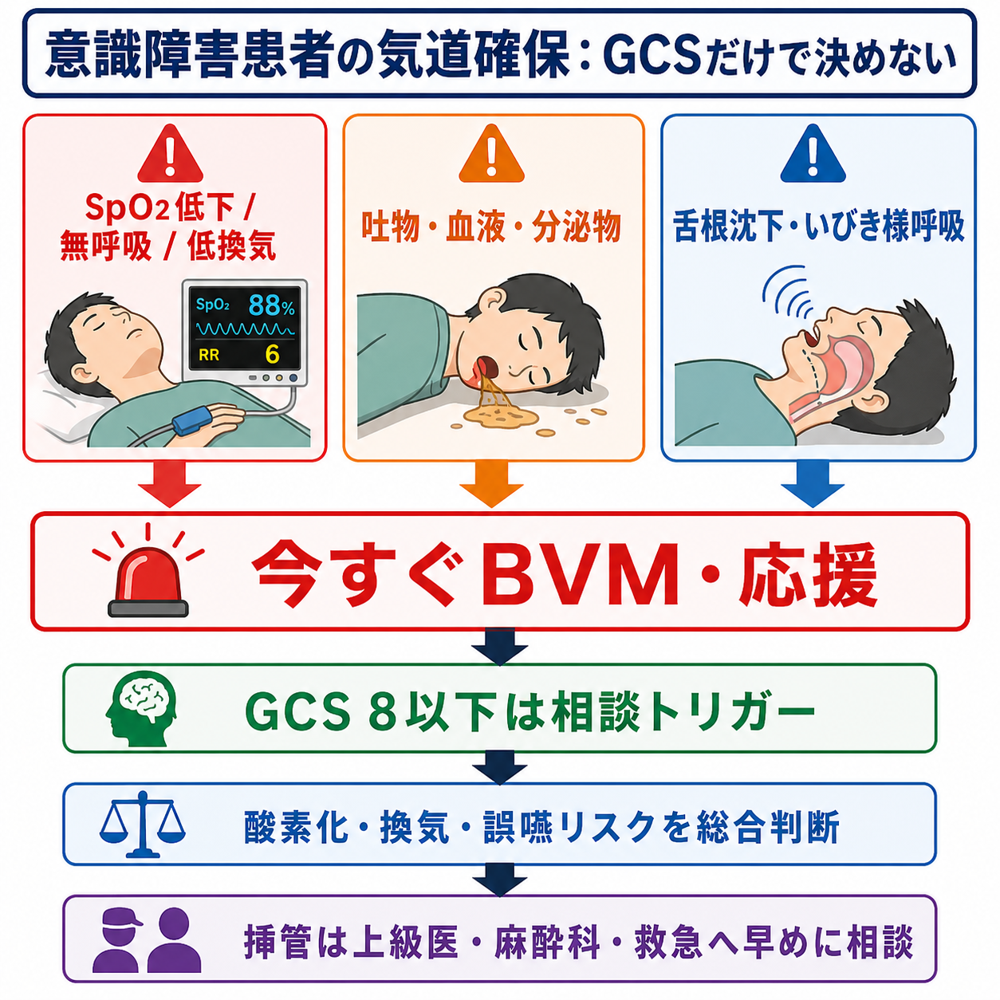
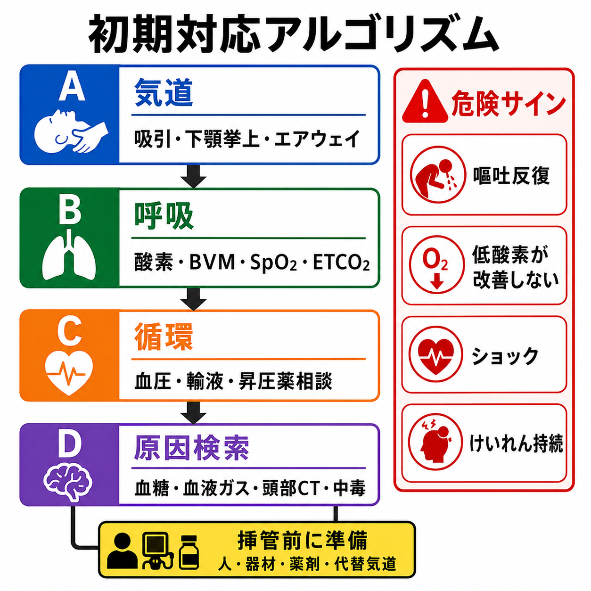
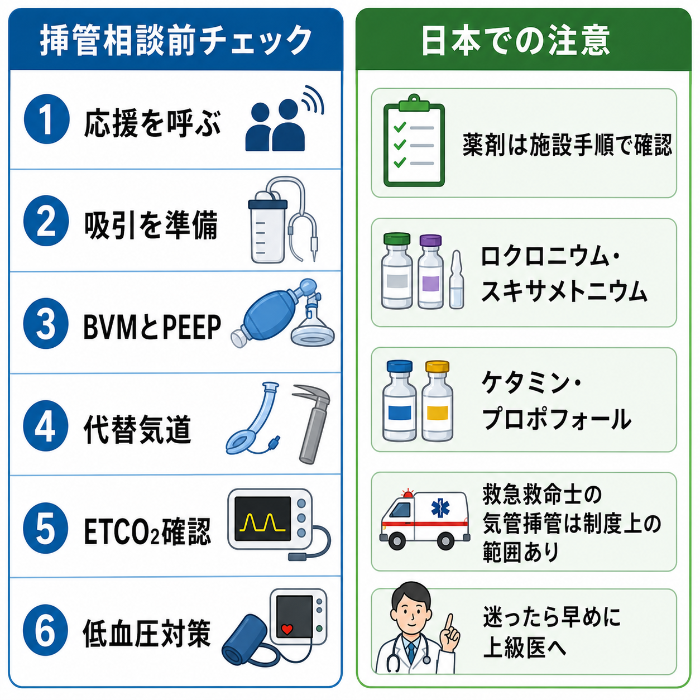

---
title: "意識障害患者の気道確保はいつ必要か"
description: "GCS、嘔吐、低酸素、誤嚥リスクからバッグ換気・挿管相談のタイミングを整理する。"
aliases:
  - "意識障害の気道確保"
tags:
  - 領域/救急・初期対応
  - 種類/クリニカルクエスチョン
  - 対象/研修医
question: "意識障害患者の気道確保はいつ必要か"
clinical_area: "救急・初期対応"
audience: "研修医"
evidence_level: "mixed"
created: "2026-04-27"
updated: "2026-04-27"
enableToc: true
---

# 意識障害患者の気道確保はいつ必要か

> このノートは研修医教育のための一般的整理であり、個別患者の診断・治療指示ではありません。緊急性が高い、判断に迷う、施設方針が関わる場合は上級医・専門科に相談してください。

## クリニカルクエスチョン

意識障害患者で、GCS、嘔吐、低酸素、誤嚥リスクをどう見て、バッグバルブマスク換気（BVM）や気管挿管の相談をいつ始めるか。

## まず結論

- 気道確保は「GCS 8以下なら必ず挿管」と機械的に決めず、酸素化、換気、気道防御、誤嚥リスク、原因の可逆性、処置できる人員を合わせて判断する。[10]
- ただし GCS 8以下、または GCSが急速に低下している患者は、挿管相談を始める強いトリガーとして扱う。特に頭部外傷では GCS 9未満で高度気道管理を直ちに検討する。[7],[8]
- 今すぐ手を動かすサインは、無呼吸・低換気、SpO2低下、舌根沈下、いびき様呼吸、反復嘔吐、血液・吐物・分泌物で気道が汚れている状態である。[1],[3],[8]
- 挿管を待つ間も、体位調整、吸引、下顎挙上、酸素投与、口咽頭・鼻咽頭エアウェイ、二人法BVMを並行する。JRCとJSAの気道管理では、酸素化の維持を最優先に考える。[1],[2]
- 挿管は「チューブを入れる処置」ではなく、低酸素、低血圧、誤挿管、挿管不能を起こし得る高リスク処置である。人、器材、薬剤、代替気道、ETCO2確認をそろえて上級医・救急・麻酔科へ早めに相談する。[2],[4],[9]
- 日本では使用できる鎮静薬・筋弛緩薬、救急救命士の気管挿管範囲、施設プロトコルが海外資料と異なるため、薬剤選択と実施者の範囲は国内添付文書と施設手順で確認する。[5],[6]

## 判断の型

1. まず「今、酸素化・換気が保てているか」を見る。SpO2、呼吸数、胸郭挙上、努力呼吸、無呼吸、チアノーゼ、血液ガス、可能ならETCO2を確認する。[1],[8]
2. 次に「気道防御が破綻しているか」を見る。吐物・血液・多量分泌物、反復嘔吐、咳が弱い、唾液を飲み込めない、舌根沈下、いびき様呼吸を重く見る。[10]
3. GCSは単独決定ではなく、相談トリガーとして使う。GCS 8以下、GCS低下傾向、外傷・中毒・けいれん後・敗血症・頭蓋内病変疑いでは、上級医に「挿管準備を始めるべきか」を早めに聞く。[7],[8],[10]
4. BVMで酸素化・換気が改善するかを評価する。二人法、適切なマスクシール、下顎挙上、エアウェイ、吸引で改善しなければ高度気道管理が必要になりやすい。[1],[8]
5. 挿管の前に「この患者は挿管で悪くならないか」を見る。ショック、重度低酸素、重症喘息・COPD、頭蓋内圧亢進疑い、妊娠、肥満、頸椎損傷疑い、困難気道では、準備不足の挿管が危険になる。[2],[4],[9]

## 初期対応

- 応援を呼ぶ。看護師、上級医、救急医、麻酔科、必要ならICU・放射線・耳鼻科を早めに巻き込む。
- モニターを装着し、SpO2、心電図、血圧、体温、呼吸数、意識レベル、瞳孔、血糖を確認する。低血糖は気道評価と同時に補正を急ぐ。
- 体位を整える。嘔吐・分泌物が多い場合は吸引できる体位を取り、頸椎損傷が疑われるときは頸椎保護を意識して気道手技を行う。[8]
- 酸素を開始する。低酸素があれば高流量酸素、必要ならBVMを行う。頭部外傷では低酸素を避けることが二次性脳損傷の予防として重要である。[8]
- 気道を開ける。下顎挙上、口腔内吸引、口咽頭エアウェイまたは鼻咽頭エアウェイ、二人法BVMを検討する。[1],[8]
- 挿管相談が必要な状況では、ビデオ喉頭鏡、吸引2系統、BVM、PEEP弁、声門上器具、外科的気道確保の連絡経路、ETCO2、昇圧薬、輸液を準備する。[2],[4],[9]

## 鑑別・見逃し

| 優先度 | 疾患・状態 | 見逃さない理由 | 手がかり |
|---|---|---|---|
| 高 | 低酸素・高CO2血症 | 挿管の適応そのものになり、意識障害の原因にもなる | SpO2低下、呼吸数低下、努力呼吸、血液ガス異常 |
| 高 | 頭部外傷・頭蓋内出血・脳卒中 | GCS低下、嘔吐、気道防御低下、二次性脳損傷のリスク | 外傷、片麻痺、瞳孔不同、頭痛、抗凝固薬 |
| 高 | けいれん重積・発作後遷延 | 無呼吸、誤嚥、低酸素、薬剤性呼吸抑制が重なる | けいれん持続、舌咬傷、乳酸上昇、発作後の遷延 |
| 高 | 中毒・薬物過量 | 気道反射低下が可逆的でも、経過中に悪化する | オピオイド、ベンゾジアゼピン、アルコール、三環系抗うつ薬 |
| 高 | ショック・敗血症 | 挿管後の陽圧換気と鎮静で循環が破綻しやすい | 低血圧、冷汗、発熱、乳酸上昇、感染巣 |
| 中 | 低血糖・電解質異常 | すぐに改善し得るが、治療までの気道管理が必要 | 血糖低値、Na異常、K異常、腎不全 |
| 中 | 誤嚥・吐血・喀血 | 気道汚染でBVMも挿管も難しくなる | 吐物、血液、湿性ラ音、酸素化不良 |

## 検査

| 検査 | 目的 | 注意点 |
|---|---|---|
| 血糖 | 可逆的な意識障害を即座に拾う | 採血結果を待たずベッドサイドで確認する |
| 動脈または静脈血液ガス | 低換気、高CO2、代謝性アシドーシス、乳酸を評価する | 採血で気道対応を遅らせない |
| SpO2・ETCO2 | 酸素化と換気の連続評価 | 挿管後はETCO2で気管内留置確認と換気を確認する。[8] |
| 胸部X線・肺エコー | 誤嚥、肺炎、気胸、肺水腫を評価する | 画像より酸素化・換気の安定化を優先する |
| 頭部CT | 頭蓋内出血、脳梗塞、外傷性病変を評価する | 気道が不安定なままCT室へ行かない |
| 薬毒物関連検査 | 中毒、オピオイド、アルコール、CO中毒などを評価する | 検査陰性でも臨床的に中毒を除外しきれない |

## 治療・マネジメント

- **BVMを開始する目安**: 無呼吸、低換気、SpO2低下、胸郭挙上不良、舌根沈下、酸素投与だけで改善しない低酸素がある場合。BVMは「挿管までのつなぎ」だけでなく、気道開通と換気可能性を評価する手段でもある。[1],[8]
- **挿管相談を始める目安**: GCS 8以下、GCS低下傾向、反復嘔吐、気道汚染、BVMが難しい、低酸素が持続、けいれんが止まらない、頭部外傷でGCS 9未満、CTや搬送のため気道を維持できない可能性がある場合。[7],[8],[10]
- **挿管前の準備**: 体位、前酸素化、吸引、BVM、PEEP、ビデオ喉頭鏡、チューブサイズ、スタイレット、声門上器具、外科的気道確保の連絡経路、ETCO2、昇圧薬、輸液、役割分担を確認する。[2],[4],[9]
- **挿管中の優先順位**: チューブ挿入の成功より酸素化維持を優先する。DASは、挿管困難時に試行回数を制限し、声門上器具や前頸部気道確保へ進む計画を事前に持つことを強調している。[9]
- **薬剤の一般論**: ED挿管では、ACEP 2026が低血圧リスクを減らす導入薬としてエトミデートまたはケタミンを推奨し、低血圧リスクが高い患者でフェンタニル、ミダゾラム、プロポフォールを導入・併用薬として避けることを検討するとしている。[4]
- **日本での注意**: 日本ではエトミデートが一般的な挿管導入薬として使えない施設が多い。ケタミン、プロポフォール、ロクロニウム、スキサメトニウムなどは国内添付文書、禁忌、供給状況、施設プロトコルに従う。スキサメトニウムは呼吸停止を起こし得るため、人工呼吸・挿管に熟練した医師が人工呼吸器等を準備して使用する薬剤である。[5]
- **救急救命士との連携**: 日本の救急救命士による気管挿管は、講習・メディカルコントロール等に基づく制度上の範囲がある。院内到着時は、実施者、確認方法、ETCO2、挿管困難や低酸素の有無を引き継ぐ。[6]

## 図解

## 指導医に確認するポイント

- GCS、呼吸状態、嘔吐・気道汚染、低酸素の経過から、挿管準備を開始するタイミングは今か。
- BVMで換気できているか。二人法、エアウェイ、PEEP、吸引、体位の改善余地はあるか。
- 困難気道、頸椎損傷、ショック、頭蓋内圧亢進、妊娠、肥満、上気道病変のリスクはあるか。
- 誰が挿管するか、誰が薬剤を指示するか、失敗時に声門上器具・外科的気道確保へどう進むか。
- CT室、搬送、ICU入室まで気道を維持できるか。

## 患者説明

- 「意識が下がると、舌が落ち込んだり、吐いたものを吸い込んだりして、呼吸が危なくなることがあります。」
- 「まず酸素、吸引、バッグでの補助呼吸を行い、必要なら呼吸の管を入れる処置を上級医と相談して進めます。」
- 「管を入れる処置には低酸素や血圧低下などのリスクがあるため、準備を整えながら安全に行います。」
- 「原因を調べる検査と、呼吸を守る対応を同時に進めます。」

## ピットフォール

- GCS 8以下だけで反射的に挿管を決め、低酸素・低血圧・困難気道の準備を後回しにする。
- GCS 9以上だから安全と考え、反復嘔吐、吐血、分泌物、舌根沈下を軽視する。
- 低酸素の患者を「CTを先に」と搬送し、CT室で気道破綻する。
- 挿管前に吸引、BVM、声門上器具、ETCO2、昇圧薬、役割分担を確認しない。
- 中毒や低血糖のように改善し得る病態であっても、改善までの気道リスクを過小評価する。
- 挿管後にETCO2や胸郭挙上を確認せず、食道挿管・片肺挿管・換気不良を見逃す。

## 関連ノート

- 関連ノート候補: 意識障害の初期対応
- 関連ノート候補: けいれん重積の初期対応
- 関連ノート候補: 低血糖の初期対応
- 関連ノート候補: 中毒患者の初期対応
- 関連ノート候補: ショック患者の挿管前準備

## MOC更新候補

- [[MOC｜救急・初期対応]]
- MOC｜神経.md（本サイト外）
- MOC｜呼吸器.md（本サイト外）

## 参考文献

[1] 日本蘇生協議会. JRC蘇生ガイドライン2020. https://www.jrc-cpr.org/jrc-guideline-2020/

[2] Japanese Society of Anesthesiologists. JSA airway management guideline 2014: to improve the safety of induction of anesthesia. Journal of Anesthesia. 2014;28:482-493. https://doi.org/10.1007/s00540-014-1806-x 日本語訳: https://anesth.or.jp/files/download/news/20150427-1.pdf

[3] 医学書院. JRC蘇生ガイドライン2020 書籍詳細. https://www.igaku-shoin.co.jp/book/detail/107281

[4] American College of Emergency Physicians. Critical Issues in the Management of Adult Patients Requiring Endotracheal Intubation in the Emergency Department. January 2026. https://www.acep.org/patient-care/clinical-policies/endotracheal-intubation

[5] 医薬品医療機器総合機構（PMDA）. 医療用医薬品情報: エスラックス静注（ロクロニウム臭化物）, スキサメトニウム注「マルイシ」, ケタラール静注用（ケタミン塩酸塩）, 1%ディプリバン注（プロポフォール）. https://www.pmda.go.jp/PmdaSearch/rdSearch/02/1229405A1028?user=1 ; https://www.pmda.go.jp/PmdaSearch/rdSearch/02/1224400A2050?user=1 ; https://www.pmda.go.jp/PmdaSearch/rdSearch/02/1119400A3026?user=1 ; https://www.pmda.go.jp/PmdaSearch/rdSearch/02/1119402A2029?user=1

[6] 総務省消防庁・厚生労働省. メディカルコントロール体制の整備について（消防救第178号・医政発第0728010号）および救急救命士既資格者に対する気管挿管講習の実施等について（消防救第179号）. 2003. https://www.fdma.go.jp/laws/tutatsu/post1331/ ; https://www.fdma.go.jp/laws/tutatsu/post1330/

[7] Lulla A, Lumba-Brown A, Totten AM, et al. Prehospital Guidelines for the Management of Traumatic Brain Injury - 3rd Edition. Prehospital Emergency Care. 2023. https://doi.org/10.1080/10903127.2023.2187905

[8] Brain Trauma Foundation. Guidelines for Prehospital Management of TBI, 3rd Edition. https://braintrauma.org/coma/guidelines/pre-hospital

[9] Frerk C, Mitchell VS, McNarry AF, et al. Difficult Airway Society 2015 guidelines for management of unanticipated difficult intubation in adults. British Journal of Anaesthesia. 2015;115(6):827-848. https://doi.org/10.1093/bja/aev371

[10] Orso D, Vetrugno L, Federici N, et al. Endotracheal intubation to reduce aspiration events in acutely comatose patients: a systematic review. Scandinavian Journal of Trauma, Resuscitation and Emergency Medicine. 2020;28:116. https://doi.org/10.1186/s13049-020-00814-w

## 更新ログ

- 2026-04-27: 初版作成。
