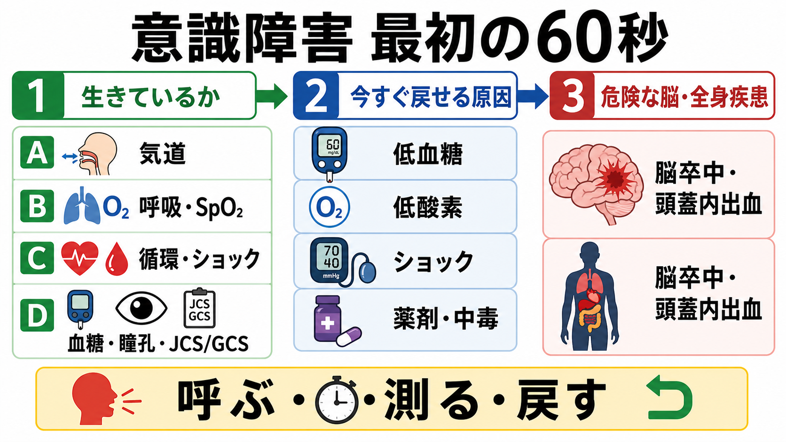
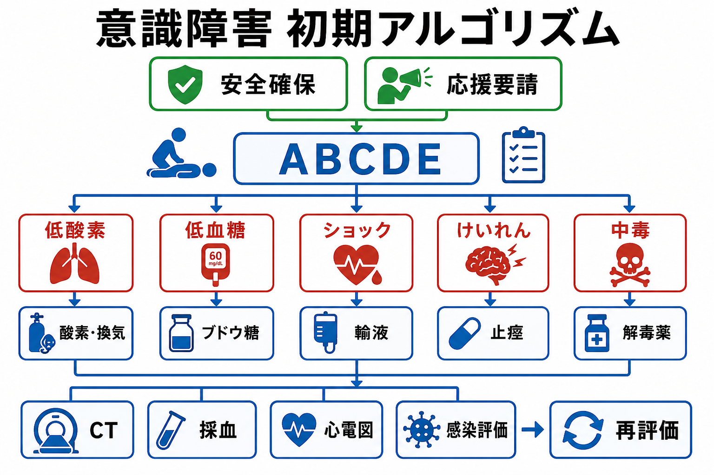
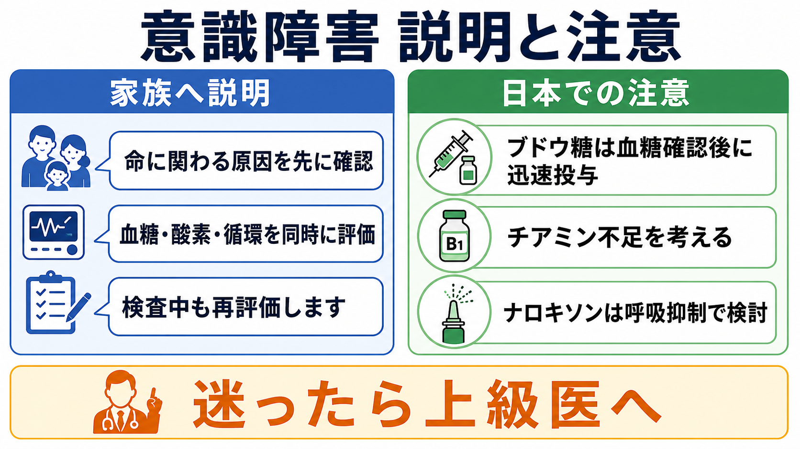

---
title: "意識障害患者を見たら最初に何を確認するか"
description: "低血糖・低酸素・ショックなど即時介入可能な原因を先に除外する意識障害の初期対応。"
aliases:
  - "意識障害の初期対応"
tags:
  - 領域/救急・初期対応
  - 種類/クリニカルクエスチョン
  - 対象/研修医
question: "意識障害患者を見たら最初に何を確認するか"
clinical_area: "救急・初期対応"
audience: "研修医"
evidence_level: "mixed"
created: "2026-04-27"
updated: "2026-04-27"
enableToc: true
---

# 意識障害患者を見たら最初に何を確認するか

> このノートは研修医教育のための一般的整理であり、個別患者への診断・治療指示ではありません。緊急性が高い、判断に迷う、施設方針が関わる場合は上級医・専門科に相談してください。

## クリニカルクエスチョン

意識障害患者を見たら、最初に何を確認し、どの可逆的原因を先に除外するか。

## まず結論

- 最初の目標は「意識障害の原因名を当てること」ではなく、**低酸素、気道閉塞、ショック、低血糖、けいれん、オピオイドなど、数分で戻せる原因を見つけて介入すること**である。ABCDEで生命危機を処置しながら、血糖・SpO2・血圧・呼吸数・意識レベルを同時に確認する [2,3]。
- 声かけに反応しない、呼吸が異常、脈が触れない可能性がある、GCS低下が強い、ショック徴候がある場合は、単独で評価を続けず、応援要請、モニター、酸素、静脈路、除細動器、気道管理準備を並行する [3,10]。
- 意識障害では**ベッドサイド血糖を初期評価に組み込む**。低血糖は異常行動、ろれつ困難、けいれん、昏睡として出ることがあり、確認後はブドウ糖投与と原因検索を並行する [4,6]。
- 低酸素は脳障害・心停止につながるため、SpO2の数字だけでなく、呼吸数、努力呼吸、いびき様呼吸、分泌物、誤嚥、CO2貯留リスクを同時に見る。重篤な低酸素やショックでは低酸素の是正を優先する [2,3]。
- 脳卒中・頭蓋内出血は重要だが、CTへ急ぐ前に気道、酸素化、循環、血糖を整える。日本ではJCSが共有されやすいが、国際的にはGCS/AVPUも使われるため、数値だけでなく「開眼、発語、従命、痛み刺激への反応」を言葉で伝える [1,9]。
- 日本での注意として、ブドウ糖、ナロキソン、チアミン製剤は製剤・用量・適応・院内プロトコルを確認する。添付文書上、ブドウ糖は低血糖時の糖質補給、ナロキソンは麻薬による呼吸抑制・覚醒遅延、チアミン製剤はビタミンB1欠乏症やウェルニッケ脳炎/脳症などが適応に含まれる [5,7,8]。

## 判断の型

1. **呼ぶ。** 意識障害は「観察しながら考える」より先に、看護師、上級医、救急/ICU、麻酔科、放射線部門など必要な人を早めに呼ぶ。Resuscitation Council UKのABCDE原則も、生命に関わる問題を順に処置し、早期に助けを呼び、再評価することを重視している [3]。
2. **測る。** 最低限、呼吸数、SpO2、血圧、脈拍、体温、意識レベル、血糖を同時に取る。NICEは急性期患者の初期評価で、心拍数、呼吸数、収縮期血圧、意識レベル、酸素飽和度、体温を最低限の観察項目としている [2]。
3. **戻す。** 低酸素なら酸素・換気、低血糖ならブドウ糖、ショックなら輸液・止血・昇圧薬相談、けいれんなら止痙、中毒なら気道保護と解毒薬適応を考える。診断確定を待たない。
4. **探す。** 生命危機を処置しながら、AIUEOTIPS（アルコール/薬剤、インスリン/内分泌、尿毒症、電解質、酸素/オピオイド、外傷/体温、感染、精神/けいれん/脳卒中）をチェックリストとして使う。
5. **言語化する。** 「JCS 200です」だけでなく、「痛み刺激で開眼なし、いびき様呼吸、SpO2 88%、血糖 38 mg/dL」のように、次の介入に直結する情報で共有する。

## 初期対応

- **安全確保と第一印象:** 周囲の安全、嘔吐・血液・針・暴力リスクを確認する。声かけ、肩たたき、痛み刺激への反応を見て、心停止または呼吸停止に近い状態を拾う。
- **A 気道:** いびき様呼吸、舌根沈下、嘔吐物、分泌物、義歯、顔面外傷を確認する。気道閉塞が疑わしければ頭部後屈あご先挙上または下顎挙上、吸引、エアウェイ、側臥位、BVM、挿管相談を検討する [3]。
- **B 呼吸:** 呼吸数、呼吸様式、SpO2波形、胸郭運動、聴診、チアノーゼを確認する。低酸素、無呼吸、徐呼吸、努力呼吸では酸素投与と換気補助を優先する。SpO2が保たれていても高CO2血症は除外できないため、徐呼吸・傾眠・COPD/肥満低換気・薬剤歴では血液ガスを考える [3]。
- **C 循環:** 血圧、脈拍、CRT、末梢冷感、皮膚色、出血、脱水、心電図モニターを確認する。低血圧、頻脈、冷汗、乏尿、乳酸上昇、網状皮斑を伴えばショックとして上級医へ共有し、静脈路、採血、輸液、止血、感染対応、昇圧薬相談を並行する [2,3]。
- **D 意識・神経:** JCS/GCS、瞳孔、共同偏視、片麻痺、構音障害、項部硬直、けいれん、血糖を確認する。血糖は採血結果を待たずベッドサイドで測る。脳卒中疑いでは発症時刻・最終健常確認時刻も同時に確認する [1,4,9]。
- **E 全身:** 体温、皮疹、外傷、薬剤貼付剤、注射痕、アルコール臭、髄膜刺激徴候、脱水、浮腫、腹部所見を確認する。低体温・高体温も意識障害の原因または悪化因子になる。

## 鑑別・見逃し

| 優先度 | 疾患・状態 | 見逃すと困る理由 | 手がかり |
|---|---|---|---|
| 高 | 気道閉塞・低酸素・換気不全 | 低酸素脳症、心停止に進む | いびき様呼吸、嘔吐、SpO2低下、呼吸数異常、CO2貯留 |
| 高 | 低血糖 | 迅速に補正可能で、けいれん・昏睡を来す | 糖尿病薬、食事摂取不良、腎機能低下、冷汗、異常行動 [4,6] |
| 高 | ショック | 脳低灌流で意識障害を来し、時間依存で悪化 | 低血圧、頻脈、冷汗、CRT延長、乏尿、乳酸上昇 |
| 高 | けいれん・非けいれん性てんかん重積 | 持続すると神経障害、誤嚥、低酸素を来す | 目偏位、口部自動症、けいれん後遷延、原因不明の昏迷 |
| 高 | 脳卒中・頭蓋内出血 | 再灌流、止血、脳圧管理、転送判断に直結 | 片麻痺、共同偏視、突然の頭痛、抗凝固薬、発症時刻 [9] |
| 高 | オピオイド・鎮静薬・アルコール・中毒 | 呼吸抑制、誤嚥、循環抑制を来す | 縮瞳、徐呼吸、薬剤歴、貼付剤、空包、低体温 [7] |
| 中 | 敗血症・髄膜炎/脳炎 | 発熱が目立たないことがあり、治療遅延で悪化 | 発熱/低体温、項部硬直、皮疹、免疫不全、乳酸上昇 |
| 中 | 電解質・内分泌・肝腎不全 | 意識障害の原因にも併存因子にもなる | Na/Ca異常、尿毒症、肝性脳症、甲状腺/副腎、低体温 |
| 中 | チアミン欠乏・ウェルニッケ脳症 | ブドウ糖投与だけで背景を見逃すと遷延する | アルコール、低栄養、妊娠悪阻、眼球運動障害、失調 [8] |

## 検査

| 検査 | 目的 | 注意点 |
|---|---|---|
| ベッドサイド血糖 | 低血糖・高血糖緊急症の迅速除外 | 意識障害では最初に確認する。低血糖なら治療後も再測定する [4,6] |
| SpO2・心電図・血圧モニター | 低酸素、不整脈、ショックの連続評価 | 波形不良や末梢冷感で値がずれる。呼吸数と意識変化も見る |
| 血液ガス・乳酸 | 換気不全、低酸素、アシドーシス、ショック評価 | SpO2正常でも高CO2血症はありうる |
| 採血 | 電解質、腎肝機能、炎症、血算、凝固、薬剤影響 | 治療を遅らせない。必要なら培養も同時に取る |
| 12誘導心電図 | ACS、不整脈、電解質異常、中毒の評価 | 意識障害だけでもショック・失神・高K血症が疑わしければ早期に取る |
| 頭部CT/MRI | 出血、梗塞、腫瘤、外傷の評価 | 搬送前に気道・酸素化・循環・監視体制を確認する |
| 感染評価 | 敗血症、髄膜炎/脳炎、尿路・肺炎など | 尿所見だけで診断せず、発熱、バイタル、身体所見、画像と合わせる |
| 中毒関連検査 | 薬剤・アルコール・一酸化炭素など | 検査陰性でも中毒を否定しきれない。空包・貼付剤・家族情報が重要 |

## 治療・マネジメント

- **低酸素・換気不全:** 酸素投与、吸引、体位調整、BVM、気管挿管相談を段階的に行う。意識障害で気道防御が弱い場合は、嘔吐・誤嚥・舌根沈下を繰り返し評価する [3]。
- **低血糖:** 経口摂取が危険な意識障害では経口糖分を無理に入れない。静脈路がある場合はブドウ糖投与、静脈路がなければ施設プロトコルに沿って代替経路やグルカゴンを検討する。補正後も再低下を監視し、糖尿病薬、腎不全、アルコール、敗血症、栄養不良を探す [4,6]。
- **ショック:** 低血圧だけでなく、冷汗、末梢冷感、CRT延長、意識障害、乏尿、乳酸上昇を合わせて判断する。輸液だけでなく、出血なら止血・輸血、敗血症なら抗菌薬・感染源検索、心原性なら心電図/エコー、閉塞性なら緊張性気胸・肺塞栓・心タンポナーデを考える。
- **けいれん:** けいれん持続、反復、意識回復不良では止痙、気道・酸素化、低血糖補正、原因検索を並行する。非けいれん性てんかん重積は見た目で分かりにくいため、遷延する意識障害では脳波適応を相談する。
- **オピオイド疑い:** 徐呼吸、縮瞳、オピオイド使用歴・貼付剤があり呼吸抑制が主問題なら、換気補助を優先しつつナロキソンを検討する。日本の添付文書ではナロキソン塩酸塩静注0.2 mgは麻薬による呼吸抑制・覚醒遅延の改善が適応で、効果不十分時の追加投与が記載されている [7]。
- **チアミン欠乏リスク:** アルコール使用、低栄養、妊娠悪阻、長期絶食、担癌、透析などではチアミン欠乏を考える。日本のチアミン製剤添付文書ではウェルニッケ脳炎/脳症が効能に含まれる製剤がある [8]。
- **脳卒中疑い:** 血糖・酸素化・循環を整えながら、発症時刻、最終健常確認時刻、抗凝固薬、神経局在を確認し、脳卒中チームや搬送先へ早期共有する。日本の脳卒中治療ガイドラインでは急性期脳梗塞のrt-PAは適応を慎重に判断し、適応例では迅速な開始が推奨される [9]。

### 日本での注意

- 50%ブドウ糖、10%ブドウ糖、グルカゴン、ナロキソン、チアミンの採用製剤・保管場所・投与手順は施設差がある。救急カートの配置と院内プロトコルを事前に確認する。
- 高濃度ブドウ糖は血管外漏出や高浸透圧に注意する。末梢静脈路が脆弱な患者では投与経路と観察を慎重に扱う。
- ナロキソンは「意識を完全に正常化する薬」ではなく、主に麻薬による呼吸抑制を改善する薬として考える。作用時間差による再呼吸抑制、疼痛、離脱症状に注意する [7]。
- JCSは国内で通じやすい一方、国際資料や転院先ではGCS/AVPUが使われることが多い。尺度が違う相手には具体的反応を添えて申し送る [1]。

## 図解

## 指導医に確認するポイント

- この患者の意識障害は、まず気道・呼吸・循環・血糖のどれが主問題か。
- CT室へ行く前に、気道、酸素、モニター、静脈路、付き添い、急変時対応は十分か。
- 低血糖補正後に意識が戻らない場合、次に疑う病態と検査は何か。
- ナロキソン、チアミン、止痙薬、抗菌薬、輸液、昇圧薬、挿管相談のどれを先に動かすか。
- JCS/GCSの数値だけでなく、具体的な反応と経時変化をどう記録・申し送るか。

## 患者説明

- 「意識が悪い原因は一つとは限らないため、命に関わる低酸素、血糖異常、循環不全を先に確認しています。」
- 「検査を進めながら、呼吸、血圧、血糖を繰り返し見て、必要な処置を同時に行います。」
- 「脳の病気も重要ですが、画像検査へ行く前に、移動中に悪化しないよう呼吸や循環を整えます。」
- 「薬、糖尿病治療薬、睡眠薬、痛み止め、貼り薬、飲酒、最後に普段通りだった時刻が治療判断に関わります。」

## ピットフォール

- 「酩酊」「認知症」「精神症状」と決めつけ、血糖・SpO2・呼吸数・血圧を確認しない。
- JCS/GCSの点数を付けることに集中し、気道閉塞、低酸素、ショックを見逃す。
- 血糖を採血結果待ちにして、低血糖補正が遅れる。
- CTを優先し、搬送中の気道閉塞・嘔吐・低酸素・低血圧に備えない。
- ナロキソン投与後に一時的に覚醒しても、再呼吸抑制の監視をやめる。
- ブドウ糖投与で意識が戻ったあと、原因検索と再低血糖監視を忘れる。
- JCS/GCSの数字だけを申し送り、神経局在、発症時刻、薬剤歴、処置への反応を伝えない。

## 関連ノート

- [[救急外来で初期検査セットはどのように選ぶか]]
- [[救急外来で病歴聴取が難しい患者から何を聞くべきか]]
- [[救急外来でバイタルサイン異常を見たとき何を優先して確認するか]]
- [[ショック患者を見たら最初に何をするか]]
- 関連ノート候補（未作成）: けいれん患者を見たら最初に何をするか
- 関連ノート候補（未作成）: 低血糖を見たら原因検索をどう進めるか
- 関連ノート候補（未作成）: オピオイド中毒を疑ったら何をするか

## MOC更新候補

- [[MOC｜救急・初期対応]] に「意識障害・けいれん」項目として本記事を追加候補。
- MOC｜神経.md（本サイト外） に「急性意識障害」関連として本記事を追加候補。
- MOC｜内分泌・代謝.md（本サイト外） に「低血糖」関連として本記事を追加候補。

## 参考文献

[1] 日本救急医学会. 医学用語解説集: 意識障害. https://www.jaam.jp/dictionary/dictionary/word/1025.html

[2] National Institute for Health and Care Excellence. Acutely ill adults in hospital: recognising and responding to deterioration. NICE Clinical guideline CG50. 2007. https://www.nice.org.uk/guidance/CG50/chapter/recommendations

[3] Resuscitation Council UK. The ABCDE Approach. Updated 2024. https://www.resus.org.uk/library/abcde-approach

[4] 厚生労働省/PMDA. 重篤副作用疾患別対応マニュアル（医療関係者向け）: 低血糖. 2023年12月改定. https://www.pmda.go.jp/safety/info-services/drugs/adr-info/manuals-for-hc-pro/0001.html

[5] PMDA. ブドウ糖注10%PL「フソー」／ブドウ糖注20%PL「フソー」／ブドウ糖注50%PL「フソー」 医療用医薬品情報. https://www.pmda.go.jp/PmdaSearch/rdSearch/02/3231401H1254?user=1

[6] Cryer PE, et al. Hypoglycemia. Endotext. Updated 2025. https://www.ncbi.nlm.nih.gov/books/NBK279137/

[7] PMDA. ナロキソン塩酸塩静注0.2mg「AFP」 医療用医薬品情報. https://www.pmda.go.jp/PmdaSearch/rdSearch/02/2219402A1049?user=1

[8] PMDA. チアミン塩化物塩酸塩注射液10mg「VTRS」／20mg「VTRS」 医療用医薬品情報. https://www.pmda.go.jp/PmdaSearch/rdSearch/02/3121400A3180?user=1

[9] Miyamoto S, Ogasawara K, Kuroda S, et al. Japan Stroke Society Guideline 2021 for the Treatment of Stroke. International Journal of Stroke. 2022;17(9):1039-1049. https://doi.org/10.1177/17474930221090347

[10] 日本蘇生協議会. JRC蘇生ガイドライン2020. https://www.jrc-cpr.org/jrc-guideline-2020/

## 更新ログ

- 2026-04-27: 初版作成。日本の救急医学会資料、JRC、PMDA/厚生労働省資料、国内脳卒中ガイドライン、NICE、Resuscitation Council UK、Endotextを確認し、$imagegen由来のPNG図解3枚を添付。
