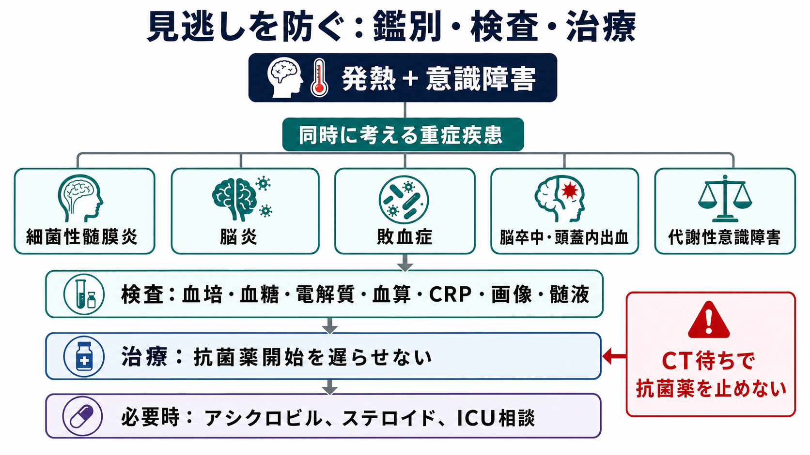
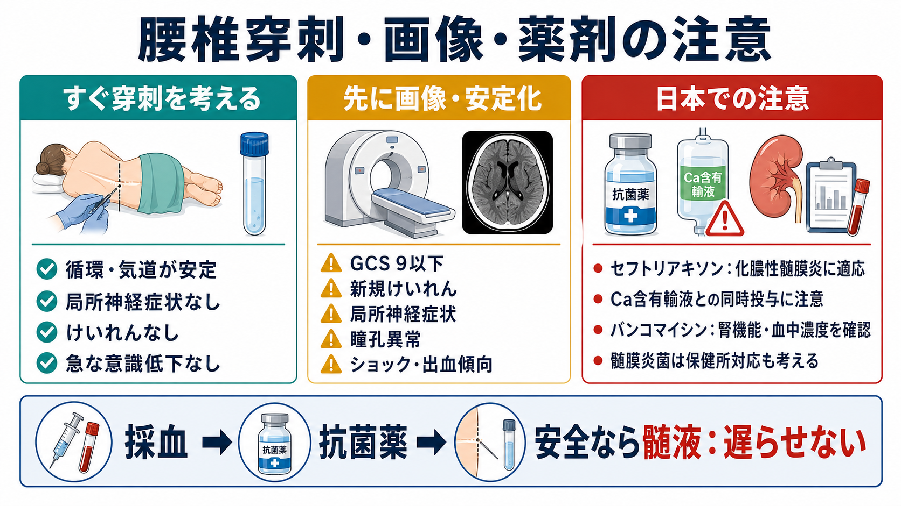
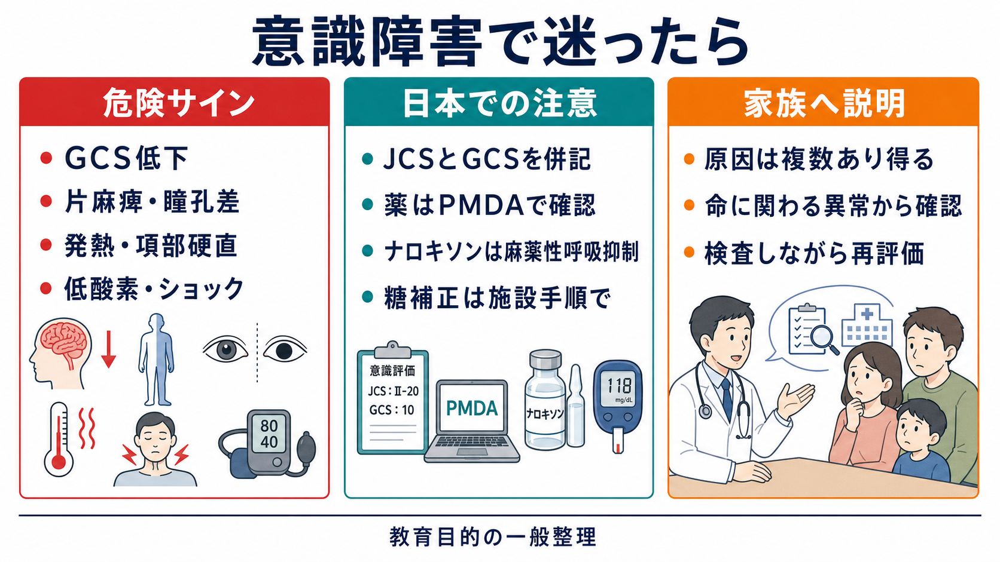

---
title: "発熱と意識障害がある患者で髄膜炎をどう疑うか"
description: "髄膜刺激徴候に頼りすぎず、血培・抗菌薬・画像・腰椎穿刺の優先順位を整理する。"
aliases:
  - "発熱意識障害と髄膜炎"
tags:
  - 領域/救急・初期対応
  - 種類/クリニカルクエスチョン
  - 対象/研修医
question: "発熱と意識障害がある患者で髄膜炎をどう疑うか"
clinical_area: "救急・初期対応"
audience: "研修医"
evidence_level: "guideline/review"
created: "2026-04-27"
updated: "2026-04-27"
enableToc: true
---

# 発熱と意識障害がある患者で髄膜炎をどう疑うか

> このノートは研修医教育のための一般的整理であり、個別患者の診断・治療指示ではありません。緊急性が高い、判断に迷う、施設方針が関わる場合は上級医・専門科に相談してください。

## クリニカルクエスチョン

発熱と意識障害がある患者で、髄膜刺激徴候に頼りすぎず、細菌性髄膜炎・脳炎・敗血症などをどう疑い、血液培養、抗菌薬、頭部画像、腰椎穿刺の優先順位をどう考えるか。

## まず結論

- 発熱と意識障害が同時にある患者では、項部硬直やKernig徴候がはっきりしなくても、中枢神経感染症を除外したことにはならない。成人細菌性髄膜炎では、発熱・項部硬直・意識障害の古典的三徴がそろわない例がある一方、頭痛を含めた複数所見の組み合わせが重要である [5]。
- 最初は「髄膜炎かどうか」より、ABCDE、低酸素、低血糖、ショック、けいれんを同時に処理しながら、敗血症・脳炎・脳卒中・代謝性意識障害も並行して考える [2]。
- 細菌性髄膜炎を疑う場合、血液培養を採取できるなら先に2セット採り、その後の抗菌薬開始を画像や腰椎穿刺待ちで遅らせない [1], [2], [3]。
- 腰椎穿刺は診断の要だが、GCS低下、局所神経症状、新規けいれん、乳頭浮腫・瞳孔異常、免疫不全、頭蓋内占拠病変が疑われる状況では、先に安定化と頭部画像を検討する [2], [4]。
- 画像を先に行う場合でも、血培後の経験的抗菌薬、必要時のアシクロビルやデキサメタゾン、ICU・神経内科・感染症科への相談を並行して進める [2], [3], [9]。
- 日本では、薬剤の適応・用量・禁忌・配合変化はPMDA添付文書と院内採用薬で確認する。髄膜炎菌が疑われる、または確定した場合は、保健所対応や接触者対応も意識する [6], [7], [8]。

## 判断の型

1. **意識障害の初期対応を優先する。** 気道、呼吸、循環、体温、SpO2、血糖、けいれん、外傷、薬物・アルコール、敗血症を同時に確認する。
2. **「発熱＋意識障害」を中枢神経感染症の入口として扱う。** 頭痛、項部硬直、羞明、嘔吐、発疹、けいれん、免疫不全、耳鼻科感染、肺炎、副鼻腔炎、最近の手術・外傷を聞く。
3. **血培を先に採り、治療を遅らせない。** 採血可能なら血液培養2セット、一般採血、血糖、電解質、腎肝機能、凝固、乳酸などを並行する。抗菌薬は「CTが終わってから」「腰椎穿刺が終わってから」と待ちすぎない [2], [3]。
4. **腰椎穿刺の前に画像が必要かを判断する。** 頭蓋内圧亢進・占拠性病変・脳ヘルニアリスクを疑う所見があれば、画像と専門科相談を優先する [2], [4]。
5. **髄液が採れたら、細胞数・糖・蛋白・Gram染色・培養をセットで見る。** 髄液糖は血糖と比較するため、同時血糖を忘れない。
6. **初回判断で終わらせない。** 意識、バイタル、発疹、けいれん、神経局在、検査結果は時間で変わる。診断が未確定でも再評価を続ける。

## 初期対応

- **ABCDEと安全確保**: 気道閉塞、低酸素、ショック、低血糖、持続けいれんは、髄膜炎の診断作業より先に補正する。
- **感染対策**: 髄膜炎菌が疑われる紫斑、急速な敗血症像、集団生活歴があれば、院内感染対策チームや上級医に早めに共有する [8]。
- **採血・培養**: 抗菌薬投与前に血液培養2セットを目指す。ただし、採取困難や循環不安定で治療が遅れる場合は、上級医と相談して抗菌薬を優先する [2], [3]。
- **経験的治療の準備**: 年齢、免疫不全、妊娠、腎機能、βラクタムアレルギー、院内発症、外傷・術後、薬剤相互作用を確認し、院内プロトコルに沿って抗菌薬を準備する。
- **早期相談**: 意識障害が強い、ショック、けいれん、呼吸不全、神経局在、免疫不全、抗菌薬選択に迷う場合は、救急・ICU・神経内科・感染症科へ早めに相談する。

## 鑑別・見逃し

| 優先度 | 疾患・状態 | 見逃さない理由 | 手がかり |
|---|---|---|---|
| 高 | 細菌性髄膜炎 | 治療遅延が死亡・後遺症につながる。髄膜刺激徴候が乏しいことがある [1], [5] | 発熱、頭痛、意識障害、項部硬直、発疹、けいれん、免疫不全 |
| 高 | 脳炎、特にHSV脳炎 | 抗菌薬だけでは不十分で、アシクロビルを考える場面がある [9] | 意識変容、異常行動、けいれん、側頭葉病変、髄液リンパ球優位 |
| 高 | 敗血症・髄膜炎菌血症 | 髄膜症状よりショックや紫斑が前面に出ることがある [8] | 低血圧、乳酸上昇、紫斑、四肢冷感、急速な悪化 |
| 高 | 脳卒中・頭蓋内出血 | 発熱を伴う意識障害でも、局所神経症状や突然発症なら並行評価が必要 | 片麻痺、失語、瞳孔左右差、突然の激しい頭痛、抗凝固薬 |
| 中 | 代謝性意識障害 | 低血糖、低Na血症、肝腎不全はすぐ補正可能な原因 | 血糖異常、Na異常、尿毒症、肝性脳症、内分泌疾患 |
| 中 | 薬物・アルコール・中毒 | 感染と併存し得る。鎮静薬やオピオイドは呼吸抑制を起こす | 服薬歴、瞳孔、呼吸数、アルコール臭、処方薬・市販薬 |

## 検査

| 検査 | 目的 | 注意点 |
|---|---|---|
| 血液培養2セット | 起炎菌同定、抗菌薬適正化 | 可能なら抗菌薬前。ただし採取で治療を大きく遅らせない [2], [3] |
| 血糖・電解質・血算・腎肝機能・凝固・乳酸 | 意識障害の可逆的原因、重症度、薬剤投与設計 | 腎機能はバンコマイシン、アシクロビルなどで重要 [7], [9] |
| 頭部CT/MRI | 腰椎穿刺前の危険所見、脳炎・脳卒中・膿瘍の評価 | 全例でCTを待つ必要はないが、意識障害が強い、局在徴候、新規けいれんなどでは先行を検討 [2], [4] |
| 腰椎穿刺 | 髄液細胞数、糖、蛋白、Gram染色、培養、必要時PCR | 循環・呼吸が不安定、頭蓋内圧亢進、出血傾向、抗凝固薬では上級医と適応を確認 |
| 髄液・血液PCRなど | 起炎微生物の補助診断 | 施設で出せる項目と搬送方法を確認。培養を置き換えるものではない |

**腰椎穿刺前に画像を考える代表例**: GCS低下または急速な意識低下、局所神経症状、乳頭浮腫・瞳孔異常、新規けいれん、免疫不全、中枢神経疾患の既往、頭蓋内占拠性病変が疑われる状況など [2], [4]。

## 治療・マネジメント

- **抗菌薬**: 成人の市中発症細菌性髄膜炎では、年齢・免疫不全・Listeriaリスク・耐性肺炎球菌リスクを考慮して経験的治療を選ぶ。具体的な薬剤・用量は院内プロトコル、感染症科、添付文書で確認する [1], [2], [3]。
- **CTや腰椎穿刺待ちで抗菌薬を止めない**: 画像先行が必要でも、血培後に経験的抗菌薬を始める流れを意識する [2], [3]。
- **デキサメタゾン**: 成人細菌性髄膜炎では、抗菌薬投与前または同時の副腎皮質ステロイドを検討する推奨がある。適応、タイミング、中止基準は施設方針と上級医判断で確認する [2], [3]。
- **脳炎を疑う場合**: 異常行動、けいれん、側頭葉病変、髄液リンパ球優位などがあれば、HSV脳炎を念頭にアシクロビルを考える。腎機能、補液、用量調整を確認する [9]。
- **日本での注意**: セフトリアキソンは化膿性髄膜炎に適応があり、成人では通常量と重症感染症での増量規定が添付文書に記載されている。一方でCa含有輸液との配合・同時投与、新生児禁忌などは添付文書で確認する [6]。
- **日本での注意**: バンコマイシンはMRSA/MRCNSによる化膿性髄膜炎に適応があり、急速投与によるinfusion reaction、腎機能障害時の調整、血中濃度モニタリングを意識する [7]。
- **髄膜炎菌**: 侵襲性髄膜炎菌感染症は感染症法上の届出対象であり、保健所、感染対策、接触者対応が関わる。疑う段階で院内の感染対策担当に相談する [8]。

## 図解

## 指導医に確認するポイント

- この患者で、細菌性髄膜炎、脳炎、敗血症、脳卒中のどれを最優先で扱うか。
- 血液培養を採った後、どの経験的抗菌薬を、どの用量で開始するか。Listeria、耐性肺炎球菌、院内発症、免疫不全をどう反映するか。
- 腰椎穿刺を今行うか、頭部画像を先に行うか。抗凝固薬、血小板、凝固異常、頭蓋内圧亢進の評価は十分か。
- デキサメタゾン、アシクロビル、ICU管理、感染症科・神経内科コンサルトのタイミング。
- 髄膜炎菌が疑われる場合の隔離、保健所連絡、接触者対応、院内感染対策。

## 患者説明

- 「発熱と意識の変化があるため、脳や髄膜の感染、全身の重い感染、脳卒中、血糖や電解質の異常など、命に関わる原因を同時に調べています。」
- 「髄膜炎は首の硬さが分かりにくいこともあります。血液検査、培養、画像、必要に応じて背中から髄液を調べる検査で確認します。」
- 「検査を待ちすぎると危険な感染症では治療が遅れるため、必要な培養を採ったうえで抗菌薬を先に始めることがあります。」
- 「状態が変わりやすいため、意識、呼吸、血圧、けいれんの有無を繰り返し確認します。」

## ピットフォール

- 項部硬直がないので髄膜炎ではない、と判断する。
- CTを待つ間、血液培養も抗菌薬も止まっている。
- 腰椎穿刺の禁忌・注意を確認せずに進める、または逆に必要以上に避けて診断が遅れる。
- 髄液糖を解釈するための同時血糖を忘れる。
- 細菌性髄膜炎だけに固定し、HSV脳炎、敗血症、脳卒中、低血糖、低Na血症を見落とす。
- PMDA添付文書、院内採用薬、腎機能、アレルギー、妊娠、年齢による用量調整を確認しない。
- 髄膜炎菌を疑う状況で、感染対策・保健所対応を後回しにする。

## 関連ノート

- 関連ノート候補: 意識障害の初期対応
- 関連ノート候補: けいれん重積の初期対応
- 関連ノート候補: 敗血症を疑う患者の初期対応
- 関連ノート候補: 腰椎穿刺の適応と禁忌
- 関連ノート候補: 発熱患者で血液培養をいつ採るか

## MOC更新候補

- [[MOC｜救急・初期対応]]
- MOC｜感染症・抗菌薬.md（本サイト外）
- MOC｜神経.md（本サイト外）

## 参考文献

[1] 日本神経学会, 日本神経治療学会, 日本神経感染症学会. 細菌性髄膜炎診療ガイドライン2014. https://www.neurology-jp.org/guidelinem/zuimaku_2014.html

[2] National Institute for Health and Care Excellence. Meningitis (bacterial) and meningococcal disease: recognition, diagnosis and management. NICE guideline NG240. 2024. https://www.nice.org.uk/guidance/ng240

[3] van de Beek D, Cabellos C, Dzupova O, et al. ESCMID guideline: diagnosis and treatment of acute bacterial meningitis. Clinical Microbiology and Infection. 2016;22 Suppl 3:S37-S62. https://doi.org/10.1016/j.cmi.2016.01.007

[4] Hasbun R, Abrahams J, Jekel J, Quagliarello VJ. Computed tomography of the head before lumbar puncture in adults with suspected meningitis. New England Journal of Medicine. 2001;345:1727-1733. https://doi.org/10.1056/NEJMoa010399

[5] van de Beek D, de Gans J, Spanjaard L, Weisfelt M, Reitsma JB, Vermeulen M. Clinical features and prognostic factors in adults with bacterial meningitis. New England Journal of Medicine. 2004;351:1849-1859. https://doi.org/10.1056/NEJMoa040845

[6] PMDA. ロセフィン静注用0.5g／1g／点滴静注用1gバッグ 添付文書（セフトリアキソンナトリウム水和物）. https://www.pmda.go.jp/PmdaSearch/rdSearch/02/6132419F2026?user=1

[7] PMDA. バンコマイシン点滴静注用 添付文書（バンコマイシン塩酸塩）. https://www.pmda.go.jp/PmdaSearch/rdSearch/02/6113400A1154?user=1

[8] 厚生労働省. 侵襲性髄膜炎菌感染症. https://www.mhlw.go.jp/stf/seisakunitsuite/bunya/0000137555_00002.html

[9] Tunkel AR, Glaser CA, Bloch KC, et al. The management of encephalitis: clinical practice guidelines by the Infectious Diseases Society of America. Clinical Infectious Diseases. 2008;47:303-327. https://doi.org/10.1086/589747

## 更新ログ

- 2026-04-27: 初版作成。
