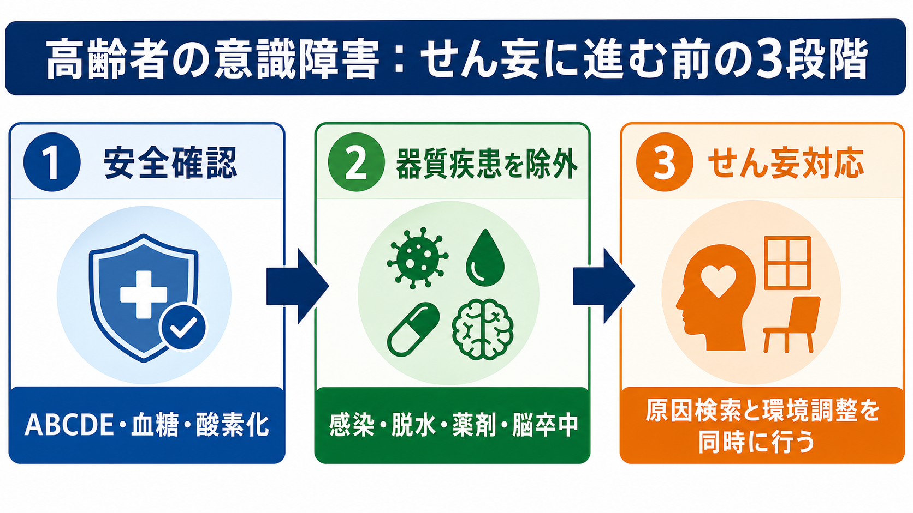
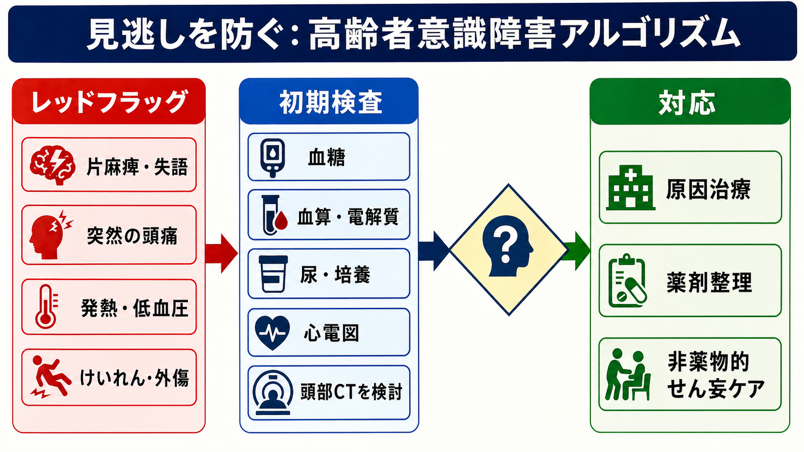
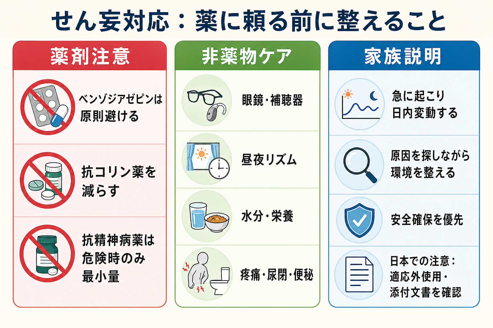

---
title: "高齢者の意識障害でせん妄と器質疾患をどう見分けるか"
description: "感染、脱水、薬剤、脳卒中などを除外しながら、せん妄対応へ進むための実践的な見分け方を整理する。"
aliases:
  - "高齢者意識障害とせん妄"
tags:
  - 領域/救急・初期対応
  - 種類/クリニカルクエスチョン
  - 対象/研修医
question: "高齢者の意識障害でせん妄と器質疾患をどう見分けるか"
clinical_area: "救急・初期対応"
audience: "研修医"
evidence_level: "mixed"
created: "2026-04-27"
updated: "2026-04-27"
enableToc: true
---

# 高齢者の意識障害でせん妄と器質疾患をどう見分けるか

> このノートは研修医教育のための一般的整理であり、個別患者への診断・治療指示ではありません。意識障害、神経局在、ショック、低酸素、低血糖、敗血症、頭蓋内疾患が疑われる場合は、上級医・専門科へ早めに相談してください。

## クリニカルクエスチョン

高齢者の意識障害で「せん妄らしい」と感じたとき、感染、脱水、薬剤、代謝異常、脳卒中などの器質疾患をどう除外しながら、せん妄対応に進むか。

## まず結論

- 高齢者のせん妄は「急性発症」「日内変動」「注意障害」を軸に疑うが、原因検索を止める診断名ではない。せん妄を疑った時点で、低酸素、低血糖、ショック、敗血症、頭蓋内疾患、薬剤性を同時に評価する。[1][2]
- 最初は ABCDE、血糖、SpO2、体温、血圧、GCS/JCS、瞳孔、神経局在、外傷、服薬歴を確認する。ここで異常があれば「せん妄対応」より先に蘇生・原因治療を進める。[1][7]
- 「いつから」「普段とどれくらい違うか」「波があるか」は家族・施設職員・救急隊から聞く。急性発症で変動する注意障害はせん妄を支持するが、片麻痺、失語、共同偏視、突然の頭痛、けいれん、頭部外傷、抗凝固薬内服は頭蓋内疾患を優先して考える。[1][8]
- 検査は全例同じセットではなく、血糖、血算、電解質、腎肝機能、CRP、尿、培養、心電図、画像を病歴と身体所見で選ぶ。低Na、Ca異常、腎不全、尿閉、便秘、疼痛、感染、脱水、薬剤変更は高齢者で特に拾いやすい。[2][4]
- 薬物による鎮静は最後の手段である。まず眼鏡・補聴器、疼痛、尿閉、便秘、睡眠覚醒リズム、脱水、環境刺激を整える。ベンゾジアゼピン、抗コリン薬、オピオイド、睡眠薬、H2遮断薬などはせん妄の原因・増悪因子になりうる。[4][5][9]
- 日本での注意: ハロペリドールなど抗精神病薬のせん妄への使用は、製剤・状況により添付文書上の適応、禁忌、慎重投与、QT延長、錐体外路症状、パーキンソン病・レビー小体型認知症での悪化リスクを必ず確認する。[6]

## 判断の型

1. **まず不安定を拾う**: A/B/C/D/E、血糖、SpO2、ショック、発熱、低体温、けいれん、外傷、薬物中毒を確認する。
2. **せん妄らしさを確認する**: 急性発症、日内変動、注意障害、睡眠覚醒リズムの乱れ、見当識障害、幻視、活動性の変化を確認する。[1][3]
3. **器質疾患の赤旗を除外する**: 神経局在、突然発症、頭痛、髄膜刺激、発熱・低血圧、低酸素、低血糖、電解質異常、腎不全、頭部外傷、抗凝固薬、免疫抑制を探す。
4. **原因治療とせん妄ケアを同時に行う**: 感染、脱水、薬剤、疼痛、尿閉、便秘、睡眠障害を直しながら、見守り、再見当識づけ、家族情報、環境調整を行う。[1][2]

## 初期対応

- **第一声で重症度を決める**: 呼びかけへの反応、会話の成立、努力呼吸、チアノーゼ、冷汗、末梢冷感、姿勢保持、異常行動の危険性を見て、人手を集める。
- **ABCDEを先に処理する**: 気道閉塞、誤嚥、低酸素、ショック、低血糖、けいれん、体温異常は、せん妄評価の前に介入対象である。[7]
- **血糖は早い**: 低血糖はせん妄様にも脳卒中様にも見える。測定が遅れるほど判断全体がずれる。
- **ベースラインを取る**: 認知症、普段のADL、会話レベル、食事・水分、排尿排便、発症時刻、最後に普段通りだった時刻、最近の薬剤変更を家族・施設・救急隊から確認する。
- **安全を確保する**: 転倒、ルート抜去、誤嚥、自傷他害のリスクがあれば、観察強化、環境調整、上級医相談を早める。身体拘束や鎮静は安易に選ばず、必要性と代替策をチームで確認する。

## 鑑別・見逃し

| 優先度 | 疾患・状態 | 見逃さない理由 | 手がかり |
|---|---|---|---|
| 高 | 低酸素・ショック・低血糖 | すぐ可逆的で、遅れると致命的 | SpO2低下、頻呼吸、低血圧、冷汗、血糖低値 |
| 高 | 脳卒中・頭蓋内出血 | 高齢者では訴えが乏しいことがある | 片麻痺、失語、共同偏視、急な頭痛、抗凝固薬、転倒、突然発症 [8] |
| 高 | 敗血症・髄膜炎・肺炎・尿路感染 | 高齢者は発熱が目立たず意識変容だけのことがある | 発熱/低体温、頻呼吸、低血圧、尿路症状、咳、項部硬直、乳酸上昇 [7] |
| 中 | 脱水・電解質異常・腎不全 | せん妄の誘因として頻度が高く治療可能 | 口渇、皮膚乾燥、BUN/Cr上昇、Na/Ca異常、利尿薬 |
| 中 | 薬剤性・中毒・離脱 | 新規処方や増量で急に悪化する | ベンゾジアゼピン、抗コリン薬、オピオイド、睡眠薬、アルコール、ポリファーマシー [4][5][9] |
| 中 | 尿閉・便秘・疼痛 | 検査値に出にくいが治すと改善する | 下腹部膨隆、残尿、腹部膨満、骨折、褥瘡、処置後疼痛 |
| 中 | 認知症の急な悪化に見えるせん妄 | 認知症があるほどせん妄を起こしやすい | 「昨日まで違った」「夕方悪い」「注意が続かない」[2] |

## 検査

| 検査 | 目的 | 注意点 |
|---|---|---|
| 血糖 | 低血糖・高浸透圧状態の確認 | ベッドサイドで最初に確認する。 |
| 血算、電解質、腎機能、肝機能、Ca、血液ガス | 感染、脱水、Na/Ca異常、腎不全、CO2ナルコーシスなど | 「高齢者だからせん妄」で止めず、可逆因子を拾う。 |
| CRP、プロカルシトニン、尿検査、血液培養、尿培養、胸部画像 | 感染源検索 | 発熱がなくても敗血症を否定しない。培養は抗菌薬前を原則に、遅らせすぎない。[7] |
| 心電図 | 不整脈、虚血、QT延長、薬剤リスク | 抗精神病薬を考える前にもQT延長を確認する。[6] |
| 頭部CT/MRI | 出血、梗塞、腫瘍、慢性硬膜下血腫など | 神経局在、突然発症、頭痛、外傷、抗凝固薬、けいれん、意識障害が深い場合は閾値を下げる。[8] |
| せん妄スクリーニング | 注意障害と変動性の構造化 | 4ATなど短時間ツールは急性期高齢者で有用。ただし陽性なら原因検索を続ける。[3] |

## 治療・マネジメント

- **原因治療を優先する**: 低酸素、低血糖、脱水、電解質異常、感染、脳卒中、尿閉、便秘、疼痛、薬剤性を見つけたら、それぞれの標準対応に進む。
- **薬剤を整理する**: 新規薬、増量、頓用、眠前薬、市販薬、漢方、貼付薬、抗コリン作用を持つ薬を確認する。薬剤性せん妄は高齢者で重要な鑑別であり、原因薬の中止・減量を検討する。[4][5]
- **非薬物的介入を標準治療として行う**: 眼鏡・補聴器、時計・カレンダー、日中覚醒、夜間睡眠、脱水補正、早期離床、家族情報、静かな環境、疼痛管理、尿閉・便秘解除をセットで行う。[1][2]
- **薬物は危険時に限る**: 激しい興奮で本人・周囲の安全や必須治療が保てない場合に、原因検索と非薬物介入を続けながら最小量・短期間を検討する。過鎮静、誤嚥、転倒、QT延長、錐体外路症状を監視する。[6][9]
- **日本での注意**: 海外ガイドラインでは短期ハロペリドールに触れるものがあるが、日本では各薬剤の添付文書上の適応、禁忌、用法用量、慎重投与を確認する。特にパーキンソン病、レビー小体型認知症、QT延長、電解質異常、併用薬がある患者では上級医・精神科・薬剤師に相談する。[6]

## 図解

## 指導医に確認するポイント

- 頭部CT/MRI、髄液検査、血液培養、抗菌薬開始、入院適応をどう判断するか。
- せん妄と認知症のどちらに見えるかではなく、「昨日からの急性変化」と「見逃すと危険な原因」をどう説明するか。
- 抗精神病薬を使う場合の適応、禁忌、初回量、再投与間隔、モニタリング、終了条件。
- 施設・家族へ、普段の認知機能とADL、服薬、飲水、転倒、発症時刻を誰が確認するか。

## 患者説明

- 「急にぼんやりしたり、話がかみ合わなかったりする状態は、せん妄と呼ばれることがあります。ただし、感染、脱水、薬、脳の病気などが隠れていることがあるため、原因を探しながら対応します。」
- 「症状は時間帯でよくなったり悪くなったりします。眼鏡や補聴器、時計、家族の声かけ、昼夜のリズムを整えることも治療の一部です。」
- 「危険な興奮があるときだけ薬を使うことがありますが、眠らせること自体が治療ではありません。ふらつき、誤嚥、心電図異常などを見ながら慎重に使います。」

## ピットフォール

- 「認知症だから」「高齢だから」で急性変化を見逃す。
- 低血糖、低酸素、ショック、敗血症を確認する前に鎮静する。
- 神経局在がないことだけで脳卒中・慢性硬膜下血腫を否定する。
- 発熱がないことで感染症を否定する。
- 薬剤性を疑わず、眠前薬や頓用薬を増やす。
- せん妄スクリーニング陽性を「原因が分かった」と誤解する。
- 夜間だけの興奮を睡眠薬で押さえ、昼夜逆転と転倒を悪化させる。

## 関連ノート

- [[意識障害患者を見たら最初に何を確認するか]]
- [[意識障害患者で頭部CTを急ぐべき所見は何か]]
- [[急性脳卒中を疑ったら救急外来で何をするか]]
- [[低血糖による意識障害を疑ったらどう対応するか]]
- [[発熱と意識障害がある患者で髄膜炎をどう疑うか]]
- [[アルコール関連の意識障害をどう評価するか]]

MOC更新候補:
- [[MOC｜救急・初期対応]]
- MOC｜神経.md（本サイト外）
- MOC｜精神・せん妄・睡眠.md（本サイト外）
- MOC｜薬剤・処方・副作用.md（本サイト外）

## 参考文献

[1] NICE. Delirium: prevention, diagnosis and management in hospital and long-term care. Clinical guideline [CG103]. Updated 2023. https://www.nice.org.uk/guidance/cg103

[2] Inouye SK, Westendorp RGJ, Saczynski JS. Delirium in elderly people. Lancet. 2014;383(9920):911-922. https://doi.org/10.1016/S0140-6736(13)60688-1

[3] Bellelli G, Morandi A, Davis DHJ, et al. Validation of the 4AT, a new instrument for rapid delirium screening: a study in 234 hospitalised older people. Age Ageing. 2014;43(4):496-502. https://doi.org/10.1093/ageing/afu021

[4] 厚生労働省. 重篤副作用疾患別対応マニュアル 薬剤性せん妄. https://www.mhlw.go.jp/topics/2006/11/tp1122-1j.html

[5] 日本老年医学会. 高齢者の安全な薬物療法ガイドライン2025. https://www.jpn-geriat-soc.or.jp/publications/other/guideline_koreisha_sdt_2025.html

[6] PMDA. 医療用医薬品情報検索: セレネース錠・細粒（ハロペリドール）添付文書. https://www.pmda.go.jp/PmdaSearch/rdDetail/iyaku/1179020C1191_1?user=1

[7] 日本集中治療医学会・日本救急医学会. 日本版敗血症診療ガイドライン2024. https://www.jsicm.org/news/news241225-J-SSCG2024.html

[8] 日本脳卒中学会. 脳卒中治療ガイドライン2021〔改訂2025〕. https://www.jsts.gr.jp/img/guideline2021_kaitei2025_kaiteikoumoku.pdf

[9] American Geriatrics Society Beers Criteria Update Expert Panel. American Geriatrics Society 2023 updated AGS Beers Criteria for potentially inappropriate medication use in older adults. J Am Geriatr Soc. 2023;71(7):2052-2081. https://doi.org/10.1111/jgs.18372

[10] Oh ES, Fong TG, Hshieh TT, Inouye SK. Delirium in Older Persons: Advances in Diagnosis and Treatment. JAMA. 2017;318(12):1161-1174. https://doi.org/10.1001/jama.2017.12067

## 更新ログ

- 2026-04-27: 初版作成。高齢者意識障害における器質疾患除外、せん妄対応、日本での薬剤注意を整理。
