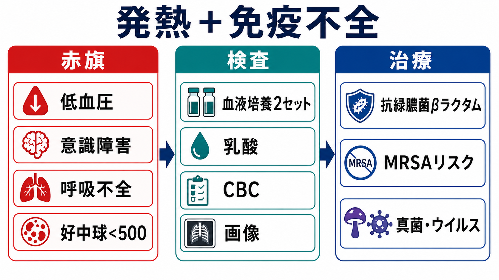
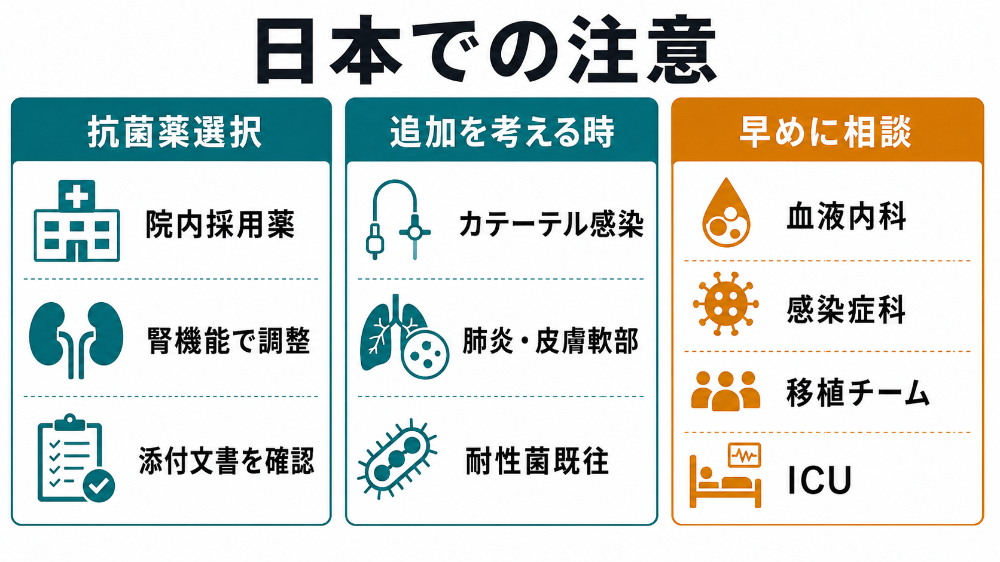

---
title: "免疫不全患者の発熱では何を急ぐべきか"
description: "好中球減少、ステロイド、化学療法、移植後などの発熱で、敗血症評価・培養・広域抗菌薬・専門科相談を急ぐ判断を整理する。"
aliases:
  - "免疫不全の発熱"
  - "発熱性好中球減少症"
tags:
  - 領域/救急・初期対応
  - 種類/クリニカルクエスチョン
  - 対象/研修医
question: "免疫不全患者の発熱では何を急ぐべきか"
clinical_area: "救急・初期対応"
audience: "研修医"
evidence_level: "guideline"
created: "2026-04-27"
updated: "2026-04-27"
enableToc: true
---

# 免疫不全患者の発熱では何を急ぐべきか

> このノートは研修医教育のための一般的な整理であり、個別患者への診断・治療指示ではありません。重症度が高い、判断に迷う、施設方針が関わる場合は上級医・専門科に相談してください。

## クリニカルクエスチョン

免疫不全患者の発熱では、どの状況で広域抗菌薬と専門科相談を急ぐべきか。

## まず結論

- 好中球減少、化学療法中、造血幹細胞移植・固形臓器移植後、高用量ステロイド・免疫抑制薬使用中の発熱は、症状が軽く見えても「重症感染を先に除外する」発熱として扱う。
- 発熱性好中球減少症（FN）が疑われる場合は、抗緑膿菌活性をもつ広域βラクタム系薬を早期に開始する。培養採取は重要だが、抗菌薬開始を大きく遅らせない[1,6]。
- 低血圧、意識障害、呼吸不全、乳酸上昇、乏尿、紫斑、急速な悪化があれば、敗血症・敗血症性ショックとして初期蘇生、1時間以内の抗菌薬、ICU/専門科相談を同時進行にする[8]。
- バンコマイシンなど抗MRSA薬は全例に機械的追加ではなく、カテーテル感染、皮膚軟部組織感染、肺炎、血行動態不安定、MRSA既往・定着などで検討する[6]。
- 日本では、院内採用薬、腎機能調整、添付文書上の適応・用量、TDM、抗菌薬適正使用チームの運用を確認する。セフェピム、タゾバクタム/ピペラシリン、メロペネムはいずれも国内添付文書で用法用量と注意点を確認する[3-5]。

## 判断の型

1. **免疫不全の型を確認する**: 好中球減少、化学療法後日数、移植後時期、ステロイド量、免疫抑制薬、生物学的製剤、脾摘、HIV、低ガンマグロブリン血症を確認する。
2. **不安定なら敗血症を優先する**: バイタル、意識、呼吸仕事量、末梢冷感、尿量、乳酸で「いま危ないか」を判断する[8]。
3. **培養と抗菌薬を同時に走らせる**: 血液培養2セット、カテーテルからの採血、尿・喀痰・創部などを採るが、採取困難で抗菌薬を待たせすぎない[1,6]。
4. **感染巣が見えなくても治療を始める**: 好中球減少では炎症所見が乏しく、肺炎、腹膜炎、蜂窩織炎が典型所見を示さないことがある[6,9]。
5. **原疾患チームと感染症の視点を早く入れる**: 血液内科、腫瘍内科、移植チーム、感染症科、ICUへ、施設の連絡基準に沿って早期相談する。

## 初期対応

- **ABCDEと隔離**: 気道・呼吸・循環を確認し、必要時は酸素、輸液、昇圧薬準備、モニター管理、感染対策を開始する。
- **最初に聞くこと**: 最終化学療法日、発熱時刻、抗菌薬内服、中心静脈カテーテル、最近の入院・耐性菌、予防内服、移植歴、ステロイド量、アレルギー、腎機能。
- **FNを疑う目安**: 好中球数500/μL未満、または1000/μL未満で48時間以内に500/μL未満へ低下が見込まれる状態で、単回38.3℃以上または38.0℃以上が持続する発熱を目安にする[1,2,6]。
- **高リスクFN**: 深い好中球減少、7日超の持続が見込まれる、臓器障害、肺炎、腹痛・粘膜炎、血行動態不安定、腎肝障害、移植後などは入院管理・静注抗菌薬・専門科相談を基本にする[6,7]。
- **低リスクでも独断外来管理にしない**: MASCCスコアなどは補助であり、施設体制、再診性、内服可否、患者背景を含めて上級医と決める[7]。

## 鑑別・見逃し

| 優先度 | 疾患・状況 | 見逃しやすい理由 | 手がかり |
|---|---|---|---|
| 高 | FNの菌血症・敗血症 | 局所症状が乏しい | 化学療法後7-14日、好中球低値、悪寒戦慄、乳酸上昇 |
| 高 | カテーテル関連血流感染 | 皮膚発赤がないことがある | CVC、ポート、透析カテーテル、カテーテル採血培養 |
| 高 | 肺炎・Pneumocystis jirovecii肺炎 | 胸部X線が初期に目立たない | 低酸素、乾性咳嗽、ステロイド、移植後、CT |
| 高 | 腹腔内感染・好中球減少性腸炎 | 腹膜刺激症状が弱い | 腹痛、下痢、粘膜炎、右下腹部痛、CT |
| 中 | HSV/VZV/CMVなどウイルス感染 | 発疹や臓器症状が遅れる | 移植後、リンパ球減少、潰瘍、肺炎、肝炎 |
| 中 | 侵襲性真菌症 | 抗菌薬後も発熱が続く | 長期好中球減少、移植後、結節影、β-Dグルカンなど |
| 中 | 薬剤熱・腫瘍熱・血栓症 | 感染と紛らわしい | 新規薬剤、培養陰性、DVT/PE症状、画像 |

## 検査

| 検査 | 目的 | 注意点 |
|---|---|---|
| CBC分画 | 好中球数と重症度評価 | ANCを確認し、直近推移も見る |
| 血液培養2セット | 菌血症・カテーテル感染の評価 | 末梢2セット、CVCがあればカテーテル培養も検討 |
| 乳酸、血ガス | 敗血症・循環不全評価 | 乳酸上昇はショックが明らかでなくても重症サイン[8] |
| 腎機能・肝機能・電解質 | 抗菌薬選択と用量調整 | 腎機能で用量調整が必要な薬剤が多い[3-5] |
| 尿検査・尿培養 | 尿路感染評価 | 膿尿が乏しくても否定しない |
| 胸部X線/CT | 肺炎・真菌・PJP評価 | 免疫不全ではCTを早めに検討することがある[9] |
| 部位別検査 | 感染巣同定 | 喀痰、便、皮膚・創部、髄液、ウイルスPCRなどを症状に応じて選ぶ |

## 治療・マネジメント

- **抗菌薬の基本**: 高リスクFNでは、セフェピム、タゾバクタム/ピペラシリン、メロペネムなど、抗緑膿菌活性をもつβラクタム系薬の単剤を基本候補として施設方針に沿って選ぶ[1,6]。
- **抗MRSA薬を足す場面**: 血行動態不安定、カテーテル感染疑い、皮膚軟部組織感染、肺炎、MRSA既往・定着、グラム陽性菌菌血症が疑われる場合に検討する[6]。
- **真菌・ウイルスを考える場面**: 4-7日以上の抗菌薬後も発熱が続く、長期・深い好中球減少、移植後、ステロイド高用量、特異的画像所見がある場合は、真菌・ウイルス診断と治療を専門科と相談する[6,9]。
- **G-CSF**: 予防・治療目的の使用は、FNリスク、がん種、化学療法レジメン、重症度により判断する。国内では日本癌治療学会の適正使用ガイドラインと原疾患チーム方針を確認する[2]。
- **de-escalation**: 培養結果、臨床経過、感染巣、好中球回復をもとに狭域化・中止・経口化を再評価する。不要な広域抗菌薬継続は耐性菌やClostridioides difficile感染のリスクになる[10]。

### 日本での注意

- 国内のFN診療では、日本臨床腫瘍学会のFN診療ガイドライン、日本癌治療学会のG-CSF適正使用ガイドライン、各施設のFNパスを優先して確認する[1,2]。
- セフェピム、タゾバクタム/ピペラシリン、メロペネムは国内添付文書で「発熱性好中球減少症」の効能・効果、腎機能別用量、重大な副作用、禁忌・慎重投与を確認する[3-5]。
- 海外ガイドラインの薬剤名・用量をそのまま移すと、国内承認、採用薬、希釈・投与時間、腎機能調整、TDM、保険運用とずれることがある。
- 抗菌薬は「早く、広く、あとで狭く」を意識し、開始時から培養提出、48-72時間での再評価、抗菌薬適正使用チームへの相談をセットにする[10]。

## 図解

## 指導医に確認するポイント

- この患者はFNとして扱うべきか。好中球数、化学療法後日数、移植後時期、免疫抑制薬から高リスクか。
- 抗菌薬は施設のFNプロトコルでは何を第一選択にするか。腎機能、アレルギー、耐性菌既往で変更が必要か。
- バンコマイシン等の追加適応はあるか。カテーテル抜去や画像検査、ICU相談が必要か。
- 外来管理を考える場合、低リスク評価、再診性、内服可否、家族支援、緊急連絡体制を満たすか。
- 培養結果が出た後の狭域化・治療期間・予防内服再開を誰が判断するか。

## 患者説明

- 「免疫を下げる治療中や白血球が少ない時の発熱は、症状が軽くても血液の感染や敗血症が隠れることがあります。」
- 「検査で原因を探しながら、遅れないように広めの抗菌薬を先に始めることがあります。」
- 「血液培養などの結果が出たら、薬を狭める、変更する、中止するかを再評価します。」
- 「血圧低下、息苦しさ、意識がぼんやりする、尿が少ない、発疹や紫斑、強い腹痛があればすぐ知らせてください。」

## ピットフォール

- 解熱している、元気に見える、CRPが高くない、局所所見がない、という理由だけで免疫不全患者の重症感染を否定しない。
- 培養採取に時間をかけすぎて抗菌薬開始が遅れる。
- すべてのFNにバンコマイシンを足す、または逆にカテーテル感染・不安定例で追加を忘れる。
- 腎機能低下時に通常用量をそのまま使う、または透析・腎代替療法中の投与設計を確認しない。
- 海外ガイドラインの用量を国内添付文書・院内採用薬・保険運用と照合しない。
- 培養陰性のまま広域抗菌薬を漫然と継続し、48-72時間の再評価を忘れる。

## 関連ノート

- 関連ノート候補: `敗血症の初期対応`, `血液培養はいつ何セット採るか`, `抗菌薬のde-escalation`, `発熱性好中球減少症`, `中心静脈カテーテル感染`
- 既存ノート確認後にのみ内部リンク化する。

## MOC更新候補

- [[MOC｜救急・初期対応]]
- MOC｜感染症・抗菌薬.md（本サイト外）
- MOC｜血液・腫瘍.md（本サイト外）

## 参考文献

[1] 日本臨床腫瘍学会 編. 発熱性好中球減少症（FN）診療ガイドライン 改訂第3版. 南江堂, 2024. https://www.nankodo.co.jp/g/g9784524233762/

[2] 日本癌治療学会. G-CSF適正使用ガイドライン. https://www.jsco-cpg.jp/guideline/30.html

[3] PMDA. セフェピム塩酸塩水和物 添付文書. https://www.pmda.go.jp/PmdaSearch/iyakuSearch/

[4] PMDA. タゾバクタム・ピペラシリン水和物 添付文書. https://www.pmda.go.jp/PmdaSearch/iyakuSearch/

[5] PMDA. メロペネム水和物 添付文書. https://www.pmda.go.jp/PmdaSearch/iyakuSearch/

[6] Freifeld AG, Bow EJ, Sepkowitz KA, et al. Clinical Practice Guideline for the Use of Antimicrobial Agents in Neutropenic Patients with Cancer: 2010 Update by the IDSA. Clinical Infectious Diseases. 2011;52(4):e56-e93. https://doi.org/10.1093/cid/cir073

[7] Taplitz RA, Kennedy EB, Bow EJ, et al. Outpatient Management of Fever and Neutropenia in Adults Treated for Malignancy: ASCO and IDSA Clinical Practice Guideline Update. Journal of Clinical Oncology. 2018;36(14):1443-1453. https://doi.org/10.1200/JCO.2017.77.6211

[8] Evans L, Rhodes A, Alhazzani W, et al. Surviving Sepsis Campaign: International Guidelines for Management of Sepsis and Septic Shock 2021. Intensive Care Medicine. 2021;47:1181-1247. https://doi.org/10.1007/s00134-021-06506-y

[9] Patel D, Cinti S. Fever in immunocompromised hosts. Emergency Medicine Clinics of North America. 2013;31(4):1059-1071. https://doi.org/10.1016/j.emc.2013.07.002

[10] 厚生労働省. 抗微生物薬適正使用の手引き 第四版. 2026. https://www.mhlw.go.jp/stf/seisakunitsuite/bunya/0000120172.html

## 更新ログ

- 2026-04-27: 初版作成。免疫不全患者の発熱における敗血症評価、FN対応、広域抗菌薬、専門科相談、日本での薬剤確認を整理。
