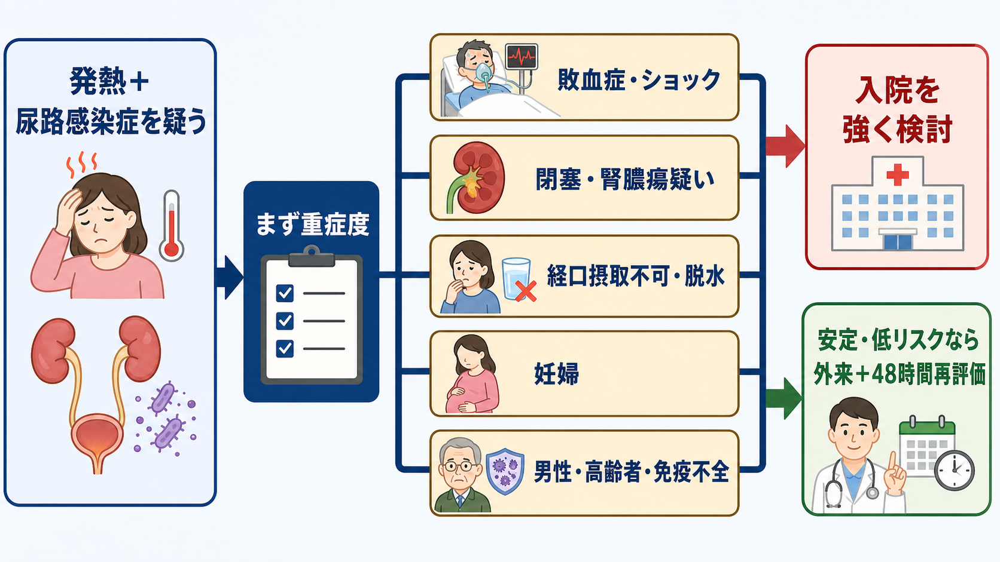
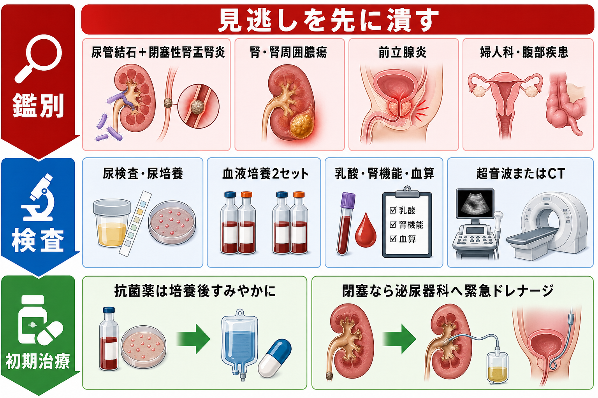
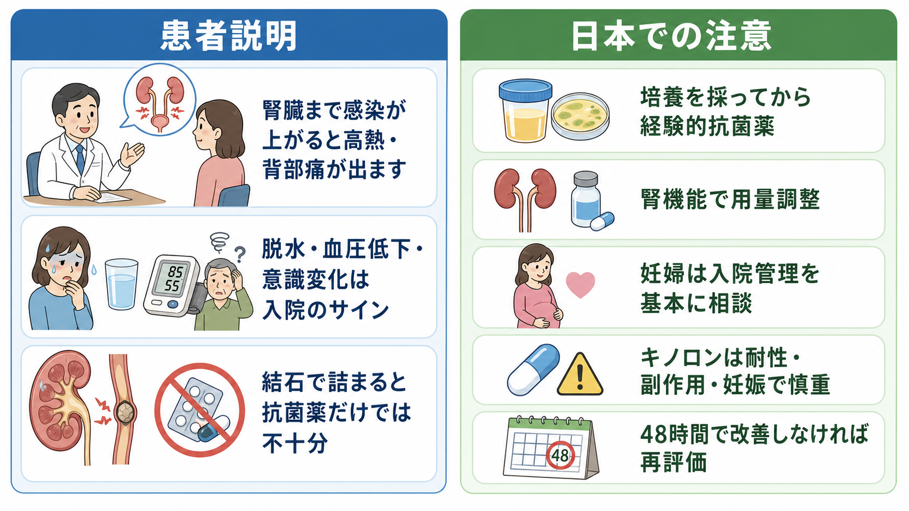

---
title: "尿路感染症による発熱で入院が必要な条件は何か"
description: "発熱を伴う尿路感染症では、敗血症、閉塞、腎膿瘍、経口摂取困難、妊婦、男性、高齢者、免疫不全などを手がかりに入院・専門相談の閾値を下げる。"
aliases:
  - "発熱性尿路感染症の入院判断"
tags:
  - 領域/救急・初期対応
  - 種類/クリニカルクエスチョン
  - 対象/研修医
question: "尿路感染症による発熱で入院が必要な条件は何か"
clinical_area: "救急・初期対応"
audience: "研修医"
evidence_level: "guideline/review/mixed"
created: "2026-04-27"
updated: "2026-04-27"
enableToc: true
---

# 尿路感染症による発熱で入院が必要な条件は何か

> このノートは研修医教育のための一般的整理であり、個別患者の診断・治療指示ではありません。緊急性が高い、判断に迷う、施設方針が関わる場合は上級医・専門科に相談してください。

## クリニカルクエスチョン

尿路感染症による発熱で受診した患者を、どの条件で入院管理にするべきか。

## まず結論

- 発熱を伴う尿路感染症は「単なる膀胱炎」ではなく、腎盂腎炎、前立腺炎、閉塞性腎盂腎炎、尿路性敗血症をまず想定する。
- **敗血症・ショック、意識変容、低酸素、乳酸高値、急性腎障害、乏尿、血小板低下**があれば、尿路感染症としての入院ではなく敗血症として入院・蘇生・早期抗菌薬・感染源コントロールを進める[5][6]。
- **尿管結石や水腎症を伴う閉塞、腎膿瘍・腎周囲膿瘍疑い、単腎・移植腎、尿路デバイス関連感染**では、抗菌薬だけでは不十分なことがあり、入院と泌尿器科相談を強く検討する[1][7]。
- **経口摂取不能、嘔吐、脱水、疼痛コントロール不良、独居で再受診困難、48時間以内の再評価が難しい**場合は、見た目が安定していても入院の閾値を下げる[7][8]。
- **妊婦の腎盂腎炎は原則として入院管理を基本に産婦人科へ相談**する。早産、敗血症、ARDSなどの母体・胎児リスクがある[9]。
- **男性、高齢者、糖尿病、免疫不全、腎機能低下、尿路奇形・神経因性膀胱、最近の抗菌薬使用や耐性菌既往**では治療失敗・重症化リスクを見積もり、外来にするなら具体的な再評価計画を置く[1][7][8][10]。

## 判断の型

1. まず「敗血症か」を切る  
   発熱の高さではなく、低血圧、頻呼吸、意識変容、SpO2低下、乳酸高値、急性腎障害、乏尿、血小板低下、末梢冷感で判断する。尿路感染症が疑わしくても、ショックなら敗血症性ショックとして蘇生を開始する[5][6]。
2. 次に「閉塞・膿瘍・感染源コントロールが必要か」を見る  
   尿管結石、水腎症、膿腎症、腎膿瘍、腎周囲膿瘍、尿路カテーテル・ステント関連感染は、抗菌薬だけで改善しないことがある。閉塞性腎盂腎炎は泌尿器科ドレナージが時間依存の介入になる[1][6][7]。
3. 「外来治療を安全に完遂できるか」を評価する  
   経口抗菌薬を飲めるか、水分を取れるか、嘔吐がないか、疼痛が抑えられるか、腎機能に応じた処方ができるか、48時間以内に再診できるかを確認する[7][8]。
4. 「患者背景で閾値を下げる」  
   妊婦、男性、高齢者、免疫不全、糖尿病、腎不全、透析、尿路異常、神経因性膀胱、単腎・移植腎、最近の入院・抗菌薬使用、ESBLなど耐性菌既往では、軽症に見えても入院または専門相談を考える[1][7][8][9]。
5. 外来にするなら「失敗時の戻り方」を決めてから帰す  
   48時間で解熱・症状改善がない、悪寒戦慄が続く、嘔吐・脱水、血圧低下、意識変化、尿量低下、背部痛増悪があれば再評価する。培養結果を誰が確認して抗菌薬を変更するかも決める[7][8]。

## 初期対応

- ABCDE、バイタル、意識、尿量、疼痛、悪寒戦慄、CVA叩打痛、下腹部痛、前立腺炎を示す会陰部痛・排尿困難を確認する。
- 敗血症が疑わしければ、酸素、モニター、静脈路、晶質液、乳酸、血液培養2セット、尿検査・尿培養を並行し、培養採取で抗菌薬を大きく遅らせない[5][6]。
- 尿路閉塞を疑う症状は、疝痛、片側背部痛、血尿、結石既往、単腎、乏尿、水腎症、腎機能悪化である。ベッドサイドエコーやCTを早めに検討する[1,7]。
- 嘔吐・脱水・経口摂取不能があれば、外来内服の前提が崩れる。補液、制吐、鎮痛を行い、改善しない場合は入院を考える[8]。
- 妊婦、移植腎、透析、免疫抑制薬使用、好中球減少、糖尿病性ケトアシドーシス疑いでは、早い段階で上級医・専門科へ相談する。

## 鑑別・見逃し

| 優先度 | 疾患・状態 | 見逃さない理由 | 手がかり |
|---|---|---|---|
| 高 | 尿路性敗血症・敗血症性ショック | 初期蘇生、早期抗菌薬、感染源コントロールが必要 | 低血圧、意識変容、頻呼吸、乳酸高値、乏尿、血小板低下[5][6] |
| 高 | 閉塞性腎盂腎炎・膿腎症 | 抗菌薬だけでは不十分で、緊急ドレナージが必要になりうる | 尿管結石、水腎症、片側背部痛、腎機能悪化、単腎[1][7] |
| 高 | 腎膿瘍・腎周囲膿瘍 | 抗菌薬反応不良の原因になり、ドレナージ判断が必要 | 72時間前後で改善乏しい、糖尿病、菌血症、局所痛持続[7][8][9] |
| 高 | 急性細菌性前立腺炎 | 男性の発熱性尿路感染症で、尿閉・菌血症を来す | 会陰部痛、排尿困難、尿閉、前立腺圧痛。強い前立腺マッサージは避ける[1] |
| 中 | 婦人科感染症・妊娠関連疾患 | 尿路感染症と症状が重なり、母体・胎児管理が必要 | 妊娠、下腹部痛、帯下、子宮収縮、胎動変化[9] |
| 中 | 胆道感染・腹腔内感染 | 尿検査異常があっても真の感染巣が別のことがある | 右上腹部痛、黄疸、腹膜刺激症状、下痢、術後 |
| 中 | 尿路結石のみ | 発熱がなければ抗菌薬不要のこともあるが、感染合併は危険 | 疝痛、血尿、画像で結石。発熱・膿尿・水腎症があれば危険 |
| 中 | カテーテル関連尿路感染 | 無症候性細菌尿との区別、カテーテル交換の判断が必要 | 尿道カテーテル、膀胱瘻、尿管ステント、発熱の他原因除外[1] |
| 中 | 高齢者の非尿路感染・非感染性疾患 | 尿混濁・膿尿に引きずられて誤診しやすい | 肺炎、胆道感染、脱水、薬剤性、せん妄、転倒 |

## 検査

| 検査 | 目的 | 注意点 |
|---|---|---|
| 尿定性・尿沈渣 | 膿尿、亜硝酸塩、血尿の確認 | 膿尿だけで発熱の原因を尿路と決めない。高齢者やカテーテルでは無症候性細菌尿が混じる |
| 尿培養 | 原因菌同定、感受性確認、後日の狭域化 | 抗菌薬前が望ましい。外来でも培養結果の確認担当を決める[1,8] |
| 血液培養2セット | 菌血症、敗血症、重症度評価 | 敗血症、悪寒戦慄、入院判断例、妊婦、免疫不全では特に採る。治療を大きく遅らせない[5][6] |
| 血算・血小板 | 炎症、好中球減少、重症度 | 白血球正常でも否定しない。血小板低下は敗血症・DICを考える |
| Cre/eGFR、電解質 | 急性腎障害、脱水、抗菌薬用量調整 | レボフロキサシンなど腎機能で投与設計が変わる薬剤がある[3] |
| CRP・プロカルシトニン | 補助的な重症度・経過評価 | 入院判断を単独で決めない。臨床像と培養・画像で判断する |
| 乳酸・血液ガス | 組織低灌流、敗血症性ショック評価 | 乳酸高値では敗血症として迅速に対応する[5,6] |
| 腹部エコー | 水腎症、膀胱内尿量、尿閉の評価 | ベッドサイドで早い。陰性でも閉塞を完全には除外しない |
| CT | 結石、閉塞、膿瘍、他の腹部感染巣 | 腎機能、造影可否、妊娠可能性を確認。閉塞疑いでは早めに相談 |

## 治療・マネジメント

- **即入院・緊急対応**: 敗血症・ショック、意識変容、低酸素、乳酸高値、急性腎障害、乏尿、DIC疑い、閉塞性腎盂腎炎、膿腎症、腎膿瘍疑い、単腎・移植腎の閉塞、経口摂取不能、強い嘔吐、疼痛コントロール不良は入院を基本に考える[1][5][6][7][8]。
- **入院を強く検討**: 妊婦、男性の発熱性尿路感染症、高齢者で全身状態低下やせん妄がある場合、糖尿病・免疫不全・腎不全・尿路異常・尿路デバイス、最近の入院や抗菌薬使用、耐性菌既往、独居や再診困難では、外来治療失敗時の余裕が少ない[1][7][8][9][10]。
- **外来治療を考えうる条件**: 若年から中年の非妊娠女性で、血圧・意識・呼吸が安定し、嘔吐がなく経口摂取可能、疼痛が軽く、閉塞や膿瘍を疑わず、腎機能に応じた抗菌薬を選べ、48時間以内に再評価できる場合に限って検討する[7][8]。
- 経験的抗菌薬は、尿培養・血液培養を採ったうえで、重症度、腎機能、妊娠、アレルギー、過去培養、最近の抗菌薬使用、地域・院内アンチバイオグラムに基づいて選ぶ[1][2][7][8]。
- 抗菌薬開始後48-72時間で改善しない場合は、耐性菌、閉塞、膿瘍、前立腺炎、別感染巣、非感染性疾患を再評価し、画像追加と専門科相談を行う[7][8][9]。
- 感染源コントロールが必要な尿路感染症では、抗菌薬だけで様子を見る時間が危険になる。閉塞なら尿管ステントや腎瘻、膿瘍ならドレナージ、カテーテル関連なら交換・抜去を検討する[1][6][7]。
- 日本での注意: NICEやEAUの薬剤名・用量をそのまま日本の処方に写さない。国内添付文書、院内採用薬、保険適用、腎機能、妊娠、授乳、薬剤師確認を優先する[2][3][8]。
- 日本での注意: レボフロキサシンなどキノロン系は尿路感染症で使われることがある一方、耐性、腱障害、精神症状、末梢神経障害などの安全性情報があり、妊婦では通常避ける。施設方針と培養結果を踏まえて慎重に扱う[3][4][8][9]。

## 図解

## 指導医に確認するポイント

- この患者は敗血症、閉塞、膿瘍、経口摂取不能、妊婦、免疫不全、単腎・移植腎のどれかに当てはまるか。
- 外来にする場合、48時間以内の再評価、培養結果確認、悪化時の受診先が具体的に決まっているか。
- 尿管結石・水腎症・尿閉があり、泌尿器科へ緊急相談すべき状況ではないか。
- 男性では急性細菌性前立腺炎、尿閉、前立腺膿瘍を疑う所見がないか。
- 妊婦では産婦人科へ相談し、母体の敗血症評価と胎児・早産リスクの評価をどう進めるか。
- 初期抗菌薬は、過去培養、腎機能、アレルギー、妊娠、院内アンチバイオグラム、日本の添付文書に合っているか。

## 患者説明

- 「熱が出る尿路感染症は、腎臓まで感染が上がっている、または尿の流れが詰まっていることがあります。」
- 「血圧低下、意識がぼんやりする、尿が少ない、強い寒気、嘔吐がある場合は、点滴や入院での治療が必要になることがあります。」
- 「結石などで尿が詰まっている場合は、抗菌薬だけでは治りにくく、尿を流す処置が必要になることがあります。」
- 「外来で治療する場合も、2日以内に良くならない、悪くなる、食事や水分が取れないときは再評価が必要です。」
- 「抗菌薬は培養結果で変更することがあります。これは薬が効かない菌を見逃さず、必要以上に広い薬を使い続けないためです。」

## ピットフォール

- 尿検査で白血球が多いだけで、発熱の原因を尿路感染症と決める。高齢者やカテーテル留置では無症候性細菌尿が多く、肺炎・胆道感染・腹部疾患を見落としうる。
- 「若いから外来」と決める。嘔吐、脱水、強い疼痛、低血圧、閉塞疑いがあれば年齢に関係なく入院を考える。
- 尿管結石を痛みの病気としてだけ扱い、感染合併を見逃す。発熱、膿尿、水腎症、腎機能悪化があれば閉塞性腎盂腎炎として危険である[1][7]。
- 妊婦の腎盂腎炎を通常の外来腎盂腎炎と同じに扱う。ACOGは妊娠中の腎盂腎炎を初期入院管理とすることを推奨している[9]。
- 男性の発熱性尿路感染症で前立腺炎・尿閉を見ない。尿閉や菌血症のリスクがあり、安易な短期外来治療は避ける[1]。
- 海外ガイドラインの抗菌薬名・用量をそのまま処方する。日本では添付文書、院内採用薬、保険適用、腎機能調整、薬剤安全性情報を確認する[2][3][4]。
- 画像を撮らずに抗菌薬反応不良を待ち続ける。48-72時間で改善しない場合は、閉塞・膿瘍・耐性菌・別診断を再評価する[7][8][9]。

## 関連ノート

- 関連ノート候補: 発熱患者を見たら抗菌薬の前に何を確認するか
- 関連ノート候補: 敗血症を疑ったら最初の1時間で何をするか
- 関連ノート候補: 尿管結石に発熱があるとき何を急ぐか
- 関連ノート候補: 急性腎盂腎炎の抗菌薬はどう選ぶか
- 関連ノート候補: 高齢者の尿検査陽性をどう解釈するか

## MOC更新候補

- [[MOC｜救急・初期対応]]
- MOC｜感染症・抗菌薬.md（本サイト外）
- MOC｜腎臓・泌尿器.md（本サイト外）

## 参考文献

[1] 日本感染症学会・日本化学療法学会. JAID/JSC感染症治療ガイドライン2015―尿路感染症・男性性器感染症―. https://www.chemotherapy.or.jp/modules/guideline/index.php?content_id=91

[2] 厚生労働省. 薬剤耐性（AMR）対策：抗微生物薬適正使用の手引き 第四版. https://www.mhlw.go.jp/stf/seisakunitsuite/bunya/0000120172.html

[3] 医薬品医療機器総合機構（PMDA）. 医療用医薬品情報：レボフロキサシン錠250mg/500mg 添付文書. https://www.pmda.go.jp/PmdaSearch/rdDetail/iyaku/6241013F2080_1?user=1

[4] 医薬品医療機器総合機構（PMDA）. 使用上の注意改訂情報：フルオロキノロン系及びキノロン系抗菌薬. https://www.pmda.go.jp/safety/info-services/drugs/calling-attention/revision-of-precautions/0360.html

[5] 桑名司. 日本版敗血症診療ガイドライン2024（J-SSCG 2024）要約. 日大医学雑誌. 2025;84(4):127-134. DOI: https://doi.org/10.4264/numa.84.4_127

[6] Evans L, Rhodes A, Alhazzani W, et al. Surviving Sepsis Campaign: International Guidelines for Management of Sepsis and Septic Shock 2021. Intensive Care Med. 2021;47:1181-1247. DOI: https://doi.org/10.1007/s00134-021-06506-y

[7] European Association of Urology. EAU Guidelines on Urological Infections. https://uroweb.org/guidelines/urological-infections/

[8] National Institute for Health and Care Excellence. Pyelonephritis (acute): antimicrobial prescribing. NICE guideline NG111. https://www.nice.org.uk/guidance/ng111/chapter/recommendations

[9] American College of Obstetricians and Gynecologists. Urinary Tract Infections in Pregnant Individuals. Clinical Consensus No. 4. Obstet Gynecol. 2023;142:435-445. https://www.acog.org/clinical/clinical-guidance/clinical-consensus/articles/2023/08/urinary-tract-infections-in-pregnant-individuals

[10] Infectious Diseases Society of America. IDSA 2025 Guideline Update on Complicated Urinary Tract Infections. https://www.idsociety.org/~/link/bc125f1fa47a47b7913b884cd368e8a0.aspx

## 更新ログ

- 2026-04-27: 初版作成。
