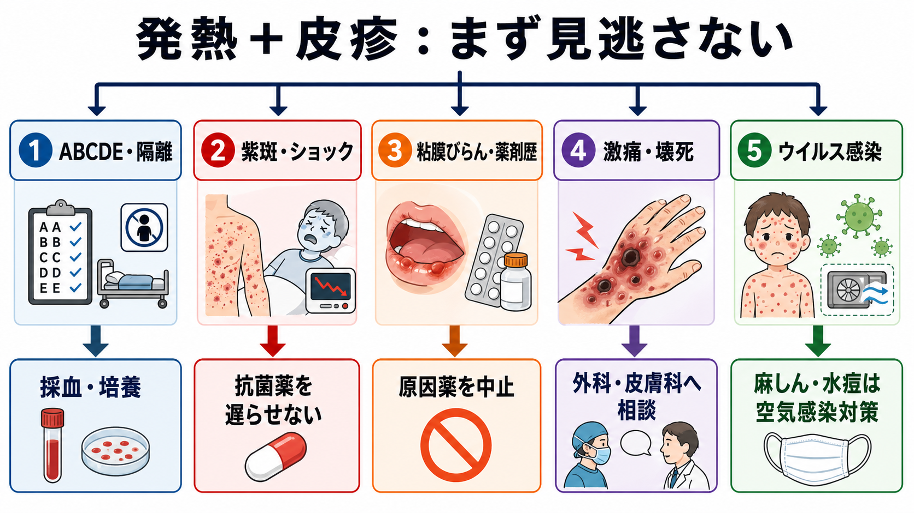
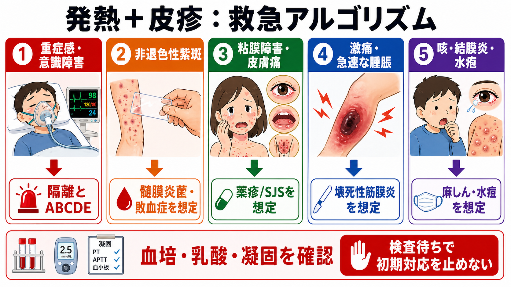
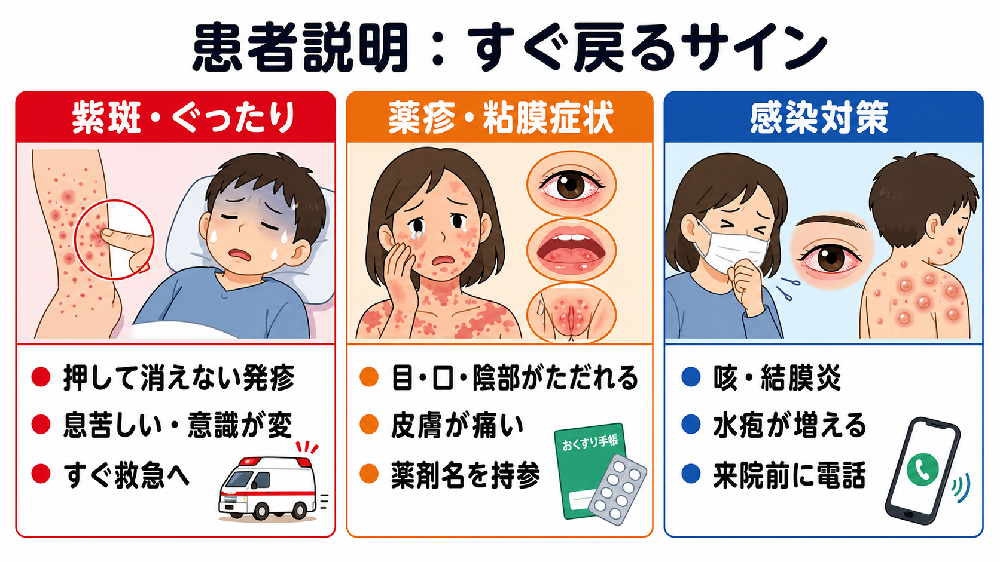

---
title: "発熱と皮疹がある患者で何を見逃してはいけないか"
description: "発熱と皮疹を見たときに、髄膜炎菌感染症、SJS/TEN、壊死性筋膜炎・STSS、麻しん・水痘などを初期対応で見落とさないための整理。"
aliases:
  - "発熱と皮疹"
tags:
  - 領域/救急・初期対応
  - 種類/クリニカルクエスチョン
  - 対象/研修医
question: "発熱と皮疹がある患者で何を見逃してはいけないか"
clinical_area: "救急・初期対応"
audience: "研修医"
evidence_level: "mixed"
created: "2026-04-27"
updated: "2026-04-27"
enableToc: true
---

# 発熱と皮疹がある患者で何を見逃してはいけないか

> このノートは研修医教育のための一般的整理であり、個別患者への診断・治療指示ではありません。重症感、紫斑、粘膜障害、急速な悪化、感染対策が関わる場合は、上級医・救急科・感染症科・皮膚科・外科へ早めに相談してください。

## クリニカルクエスチョン

発熱と皮疹がある患者で、髄膜炎菌感染症、薬疹、SJS/TEN、壊死性筋膜炎・STSS、麻しん・水痘などをどの順に疑い、何を初期対応で見逃してはいけないか。

## まず結論

- 発熱＋皮疹は、最初に「皮疹名を当てる」よりも、**紫斑・ショック、粘膜障害、強い疼痛、空気感染、薬剤歴**を拾う。これらは診断確定前に対応が必要になる。
- 押して消えない点状出血・紫斑、ショック、意識障害、髄膜刺激症状があれば、侵襲性髄膜炎菌感染症や敗血症を想定し、血液培養などを取りつつ抗菌薬を遅らせない[1],[2],[3]。
- 皮膚の痛み、目・口唇・陰部のびらん、広範な紅斑、水疱、最近開始した薬剤があれば、SJS/TENや重症薬疹として原因薬中止と皮膚科・眼科相談を急ぐ[6],[7]。
- 皮疹が地味でも「痛みが強すぎる」「腫脹が急に広がる」「低血圧・腎障害・DIC」があれば、壊死性筋膜炎・STSSを疑い、外科的評価と広域抗菌薬を同時に進める[4],[5]。
- 咳・鼻汁・結膜炎を伴う発熱後の全身発疹、または水疱が新旧混在する発疹では、麻しん・水痘を疑い、待合室に置かず空気感染対策を先に行う[8],[9]。

## 判断の型

1. **まず隔離とABCDE**  
   重症感、意識障害、呼吸不全、低血圧、SpO2低下、急速な皮疹拡大があれば、皮膚科診断より先に救急対応を始める。麻しん・水痘があり得るときは、受付時点から別室・陰圧室相当の運用を考える[8],[9]。
2. **紫斑か、消える紅斑かを分ける**  
   ガラス圧迫や指圧で消えない点状出血・紫斑は、髄膜炎菌菌血症、DIC、血管炎、血小板減少を考える。発熱・悪寒・虚脱・ショックを伴えば敗血症として扱う[1],[2]。
3. **粘膜と皮膚痛を確認する**  
   眼痛・充血、口唇びらん、咽頭痛、陰部びらん、排尿痛、皮膚が「かゆい」より「痛い」は、SJS/TENを疑う手がかりである[6],[7]。
4. **痛みの強さと進行速度を見る**  
   見た目に比べて痛みが強い、圧痛が深い、腫脹・水疱・紫斑・壊死が急速に広がる場合は、壊死性筋膜炎やSTSSを除外しきるまで帰さない[4],[5]。
5. **薬剤・曝露・ワクチン歴を短く聞く**  
   直近1-8週の新規薬、抗菌薬、抗てんかん薬、NSAIDs、アロプリノール、免疫チェックポイント阻害薬、ワクチン歴、寮・学校・渡航・家族内感染を確認する。

## 初期対応

- **重症なら同時進行**: モニター、静脈路、酸素、採血、血液培養2セット、乳酸、血算、凝固、腎肝機能、電解質、血糖、尿検査を並行する。敗血症を疑えば迅速評価と初期治療バンドルを開始する[3]。
- **髄膜炎菌を疑うとき**: 飛沫・接触予防策を取り、血液培養を確保したら抗菌薬を遅らせない。海外ガイダンスでは疑い例の経験的治療にセフトリアキソンまたはセフォタキシムなどの拡張スペクトラムセファロスポリンが示されている[2]。
- **SJS/TENを疑うとき**: 原因候補薬を一旦整理し、独断で再投与しない。眼・口腔・外陰部・気道症状を確認し、皮膚科、眼科、集中治療・熱傷管理が可能な診療体制へ早めに相談する[6],[7]。
- **壊死性筋膜炎・STSSを疑うとき**: 画像検査で手術相談を遅らせない。外科系診療科へ直ちに相談し、広域抗菌薬と循環管理を開始する。A群レンサ球菌が確認された壊死性筋膜炎では、IDSAはペニシリン＋クリンダマイシンを推奨している[5]。
- **麻しん・水痘を疑うとき**: 待合・処置室での曝露を最小化する。来院前電話、別導線、空気感染対策、保健所連絡・届出要否の確認を行う[8],[9]。
- **日本での注意**: 抗菌薬名・用量・適応、髄膜炎菌ワクチン、免疫グロブリン、抗ウイルス薬、ステロイドや免疫調整療法の扱いは、日本の添付文書、院内採用薬、保険適用、感染症法上の届出運用を確認して上級医と決める[10]。

## 鑑別・見逃し

| 優先度 | 疾患・病態 | 見逃しやすい理由 | 手がかり |
|---|---|---|---|
| 高 | 侵襲性髄膜炎菌感染症 | 初期は発熱・頭痛・嘔気だけで非特異的 | 急な発症、悪寒、虚脱、頭痛、項部硬直、点状出血、紫斑、ショック、寮・共同生活[1],[2] |
| 高 | 敗血症・DIC | 皮疹が主訴だと循環評価が遅れる | 低血圧、頻呼吸、意識変容、乳酸上昇、血小板低下、凝固異常[3] |
| 高 | SJS/TEN | 皮疹が出そろう前は薬疹・ウイルス感染に見える | 皮膚痛、高熱、眼充血、口唇・陰部びらん、水疱、表皮剥離、新規薬剤[6],[7] |
| 高 | 壊死性筋膜炎・STSS | 皮膚所見が軽く、痛みだけ先行する | 見た目以上の疼痛、急速な腫脹、水疱、紫斑、壊死、低血圧、多臓器障害[4],[5] |
| 高 | 麻しん | 発疹前は風邪に見え、待合で曝露を広げる | 発熱、咳、鼻汁、結膜炎、コプリック斑、解熱しかけた後の高熱と発疹、未接種[8] |
| 中 | 水痘 | 成人・妊婦・免疫不全では重症化しやすい | 紅斑・丘疹・水疱・痂皮が新旧混在、体幹優位、発疹前から発熱[9] |
| 中 | 薬剤性過敏症症候群、AGEP | 通常薬疹として帰しやすい | 高熱、顔面浮腫、リンパ節腫脹、肝障害、好酸球増多、小膿疱、薬剤開始後の時間差[6] |
| 中 | 血小板減少・血管炎 | 感染性発疹と混同しやすい | 紫斑、粘膜出血、関節痛、腎障害、血尿、血小板低下 |

## 検査

| 検査 | 目的 | 注意点 |
|---|---|---|
| バイタル再測定、意識、尿量 | 敗血症・ショックの早期認識 | 1回正常でも安全とはいえない。経時変化を見る。 |
| 血液培養2セット | 髄膜炎菌、STSS、菌血症の確認 | 抗菌薬前が望ましいが、採取で投与を大きく遅らせない[2],[3]。 |
| 血算、凝固、Dダイマー、フィブリノゲン | DIC、血小板減少、重症感染の評価 | 紫斑では血小板と凝固を必ず見る。 |
| 乳酸、血液ガス、腎肝機能、CK | 低灌流、多臓器障害、筋膜炎の補助評価 | 正常値だけで壊死性筋膜炎は否定しない。 |
| 皮膚・咽頭・血液・髄液の培養/PCR | 原因病原体の同定 | 髄液検査は循環・気道・頭蓋内圧リスクを評価してから。 |
| 皮膚生検 | SJS/TEN、血管炎、感染性皮膚病変の鑑別 | 初期対応や原因薬中止を生検待ちにしない。 |
| 画像検査 | 深部感染、ガス、膿瘍、感染巣検索 | 壊死性筋膜炎が強く疑わしいときは手術相談を画像待ちにしない[5]。 |

## 治療・マネジメント

- **敗血症型**: ショックまたは敗血症の可能性が高い場合は、乳酸測定、血液培養、適切な経験的抗菌薬、輸液、感染巣検索・コントロールを早期に進める[3]。
- **髄膜炎菌型**: 紫斑、ショック、髄膜刺激症状、急速悪化があれば、髄膜炎菌を含む重症細菌感染として扱う。確定例では感染症法上の届出と接触者対応が必要になる[1]。
- **薬疹/SJS型**: 原因薬の中止、皮膚・粘膜・眼の評価、疼痛・体液管理、二次感染対策、専門科相談を行う。SJS/TENは生命予後と眼後遺症に関わるため、早期の専門管理が重要である[6],[7]。
- **壊死性筋膜炎/STSS型**: 外科的デブリードマンの遅れが転帰に影響する。抗菌薬、循環管理、感染巣コントロール、ICU管理を同時に考える[4],[5]。
- **ウイルス感染型**: 麻しん・水痘は「診断がついてから隔離」では遅い。疑った時点で空気感染対策を取り、届出・接触者対応を施設ルールで確認する[8],[9]。

## 図解

## 指導医に確認するポイント

- 押して消えない紫斑、ショック、意識障害、項部硬直がある場合、髄膜炎菌を含む抗菌薬選択と投与タイミングは適切か。
- SJS/TENを疑う薬剤歴、粘膜障害、皮膚痛、眼症状があり、原因薬中止と皮膚科・眼科相談を行ったか。
- 壊死性筋膜炎を疑う疼痛・腫脹・水疱・壊死があり、画像検査より先に外科相談すべき状況ではないか。
- 麻しん・水痘を疑う症状・曝露歴・ワクチン歴があり、隔離、保健所連絡、職員曝露対策の導線が取れているか。
- 帰宅可能と判断する場合、再診条件、同居者・妊婦・免疫不全者への注意、受診前電話の説明ができているか。

## 患者説明

- 「発熱と発疹の中には、初めは軽く見えても急に悪くなる病気があります。血圧、呼吸、意識、発疹の広がりを繰り返し確認します。」
- 「押しても消えない紫色の発疹、ぐったりする、息苦しい、意識がぼんやりする、強い頭痛がある場合は、すぐに救急受診が必要です。」
- 「目・口・陰部のただれ、皮膚の痛み、水ぶくれ、皮膚がむける症状が出た場合は、薬の副作用を含めて急いで評価します。最近飲み始めた薬や市販薬も持参してください。」
- 「咳や目の充血を伴う発熱後の発疹、水ぶくれが増える発疹では、人にうつる病気の可能性があります。受診前に電話し、公共交通機関の利用はできるだけ避けてください。」

## ピットフォール

- 皮疹名を当てようとして、ABCDE、隔離、ショック対応が遅れる。
- 「圧迫で消えるか」を確認せず、紫斑をウイルス疹として帰す。
- SJS/TENの初期を「かぜ＋薬疹」とみなし、眼・口腔・陰部を確認しない。
- 壊死性筋膜炎で、画像や採血結果を待って外科相談が遅れる。
- 麻しん・水痘を疑いながら、待合室で長時間待たせる。
- 新規処方薬だけを聞き、市販薬、頓服、漢方、サプリ、前医処方、抗てんかん薬・アロプリノール・NSAIDsを聞き漏らす。
- 日本国内の添付文書、院内採用薬、保険適用、感染症法上の届出を確認せず、海外資料の薬剤運用をそのまま当てはめる。

## 関連ノート

- 既存ノート未確認。作成候補: 敗血症を疑ったとき初期対応をどう進めるか
- 既存ノート未確認。作成候補: 紫斑を見たとき血小板減少とDICをどう見分けるか
- 既存ノート未確認。作成候補: 薬疹を見たときSJS/TENをどう見逃さないか
- 既存ノート未確認。作成候補: 麻しんと水痘を疑ったとき外来導線をどうするか

## MOC更新候補

- 救急・初期対応.md（本サイト外） または既存の救急系MOCに、本記事を「発熱・敗血症」「感染対策」「皮疹のレッドフラッグ」として追加候補。
- 感染症.md（本サイト外） がある場合、髄膜炎菌、STSS、麻しん・水痘の関連項目として追加候補。
- 皮膚科.md（本サイト外） がある場合、SJS/TEN・重症薬疹の関連項目として追加候補。

## 参考文献

[1] 厚生労働省. 侵襲性髄膜炎菌感染症. https://www.mhlw.go.jp/stf/seisakunitsuite/bunya/0000137555_00002.html

[2] Centers for Disease Control and Prevention. Clinical Guidance for Meningococcal Disease. Updated 2026-03-16. https://www.cdc.gov/meningococcal/hcp/clinical-guidance/index.html

[3] 日本集中治療医学会, 日本救急医学会. 日本版敗血症診療ガイドライン2024（J-SSCG2024）バンドル. https://www.jsicm.org/pdf/cq/J-SSCG2024/bundle.pdf

[4] 厚生労働省. 劇症型溶血性レンサ球菌感染症（STSS）. https://www.mhlw.go.jp/stf/seisakunitsuite/bunya/0000137555_00003.html

[5] Stevens DL, Bisno AL, Chambers HF, et al. Practice Guidelines for the Diagnosis and Management of Skin and Soft Tissue Infections: 2014 Update by IDSA. Clinical Infectious Diseases. 2014. https://www.idsociety.org/practice-guideline/skin-and-soft-tissue-infections/

[6] 医薬品医療機器総合機構（PMDA）. 重篤副作用疾患別対応マニュアル（医療関係者向け）. https://www.pmda.go.jp/safety/info-services/drugs/adr-info/manuals-for-hc-pro/0001.html

[7] 重症多形滲出性紅斑診療ガイドライン策定委員会. 重症多形滲出性紅斑 スティーヴンス・ジョンソン症候群（皮膚粘膜眼症候群）・中毒性表皮壊死症診療ガイドライン補遺2025. 日本皮膚科学会雑誌. 2025;135(4):701-714. https://doi.org/10.14924/dermatol.135.701

[8] 厚生労働省. 麻しん（はしか）. https://www.mhlw.go.jp/seisakunitsuite/bunya/kenkou_iryou/kenkou/kekkaku-kansenshou/measles/index.html

[9] 厚生労働省. 水痘. https://www.mhlw.go.jp/stf/seisakunitsuite/bunya/kenkou_iryou/kenkou/kekkaku-kansenshou/chickenpox.html

[10] 医薬品医療機器総合機構（PMDA）. 医療用医薬品情報検索. https://www.pmda.go.jp/PmdaSearch/iyakuSearch/

## 更新ログ

- 2026-04-27: 初稿作成。日本資料（厚生労働省、PMDA、日本版敗血症診療ガイドライン、日本皮膚科学会）と海外資料（CDC、IDSA）を確認し、図解3枚を追加。
