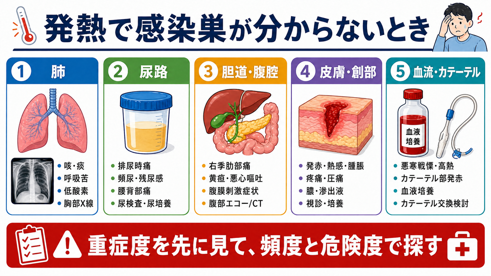
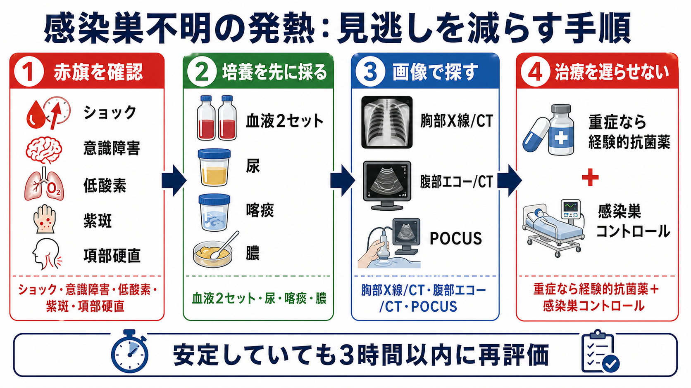
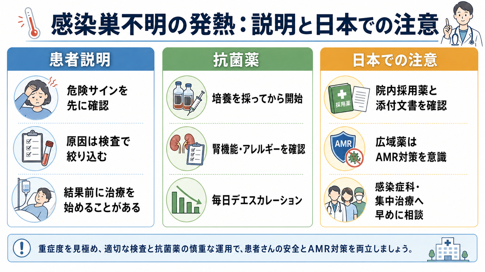

---
title: "発熱患者で感染巣が分からないときどう考えるか"
description: "発熱患者で明らかな感染巣が見えないとき、重症度を先に判定し、肺・尿路・胆道/腹腔・皮膚/創部・血流/カテーテルを頻度と危険度から検索する。"
aliases:
  - "感染巣不明の発熱"
  - "発熱の感染巣検索"
tags:
  - 領域/救急・初期対応
  - 領域/感染症・抗菌薬
  - 種類/クリニカルクエスチョン
  - 対象/研修医
question: "発熱患者で感染巣が分からないときどう考えるか"
clinical_area: "救急・初期対応"
audience: "研修医"
evidence_level: "guideline"
created: "2026-04-27"
updated: "2026-04-27"
enableToc: true
---

# 発熱患者で感染巣が分からないときどう考えるか

> このノートは研修医教育のための一般的な整理であり、個別患者への診断・治療指示ではありません。敗血症、髄膜炎、壊死性筋膜炎、胆管炎などを疑う場合は、初期対応と並行して上級医・専門科へ早めに相談してください。

## クリニカルクエスチョン

発熱患者で、初診時に肺炎、尿路感染、胆道感染、皮膚軟部組織感染、髄膜炎、カテーテル関連血流感染などの感染巣がはっきりしないとき、研修医はどの順番で考え、何を見逃さないように検索すればよいか。

## まず結論

- 感染巣探しの前に、まず「今すぐ敗血症・ショックとして動く患者か」を見る。意識障害、呼吸数増加、低酸素、収縮期血圧低下、乳酸上昇、乏尿、紫斑、項部硬直は、原因検索と治療を同時進行にするサインである[2,3]。
- 明らかな局在がない発熱でも、頻度が高い感染巣から、肺、尿路、胆道・腹腔、皮膚・創部、血流・カテーテルを順に探す。厚生労働省の手引きは、感染臓器が特定できない場合は血液培養2セットを採取し、臓器特異的所見に対応した培養を出す考え方を示している[1]。
- 重症例では、血液培養などの採取で抗菌薬を大きく遅らせない。敗血症または敗血症性ショックが疑われる場合は、感染源コントロール、経験的抗菌薬、輸液・循環管理を並行して考える[2,3]。
- 「感染巣不明」は「感染症で確定」ではない。感染症検索で所見が乏しいときは、薬剤熱、偽痛風、血栓塞栓症、悪性腫瘍、膠原病、輸血・手技関連発熱などを再評価する[1]。
- 日本では、経験的抗菌薬の候補は院内採用薬、地域のアンチバイオグラム、腎機能、アレルギー、PMDA添付文書、施設の抗菌薬適正使用ルールに合わせて確認する。広域薬を始めたら、培養結果と臨床経過で毎日デエスカレーションを検討する[1,4,10]。

## 判断の型

1. **重症度を先に決める**  
   発熱の高さではなく、臓器障害の有無で緊急度を決める。ABCDE、意識、呼吸数、SpO2、血圧、末梢冷感、尿量、乳酸、qSOFA/SOFAの要素を短時間で統合する[2,3]。
2. **頻度の高い感染巣を系統的に見る**  
   肺は咳・痰・呼吸苦・低酸素・胸部X線、尿路は排尿時痛・頻尿・残尿感・腰背部痛・尿検査、胆道/腹腔は右季肋部痛・黄疸・悪心嘔吐・腹膜刺激症状・肝胆道系酵素、皮膚/創部は発赤・熱感・腫脹・疼痛・排膿、血流/カテーテルは悪寒戦慄、カテーテル刺入部、血液培養を確認する[1,4]。
3. **危険度の高い感染症を別枠で拾う**  
   髄膜炎、壊死性筋膜炎、胆管炎、閉塞性腎盂腎炎、感染性心内膜炎、カテーテル関連血流感染、発熱性好中球減少症は、頻度だけで後回しにしない[4,6,7,9]。
4. **培養は「抗菌薬前に、ただし治療を止めない」**  
   血液培養2セットに加え、尿、喀痰、膿、ドレーン排液、髄液など、疑う臓器に対応した検体を採る。ショックや髄膜炎疑いでは、採取や画像待ちで治療開始を過度に遅らせない[1,3,6]。
5. **初回評価で決め切らない**  
   安定している患者でも、数時間以内にバイタル、診察、検査結果、画像、培養提出状況を再評価する。発熱初期は局在所見が遅れて出ることがある。

## 初期対応

- **隔離と感染対策**: 呼吸器症状、発疹、下痢、海外渡航歴、結核リスク、麻疹・水痘などを聞き、標準予防策に加えて必要な感染経路別予防策をとる。
- **ABCDEと敗血症スクリーニング**: 気道、呼吸、循環、意識、体温・皮膚所見を確認する。ショック、低酸素、意識障害、乳酸上昇、尿量低下があれば、原因検索より先に蘇生を始める[2,3]。
- **問診の最短セット**: 発症時刻、悪寒戦慄、局所症状、抗菌薬使用歴、入院・施設入所、手術・処置、デバイス、免疫抑制、糖尿病、腎不全、妊娠、渡航、動物・食事曝露を確認する。
- **診察の最短セット**: 口腔咽頭、肺音、心雑音、腹部、CVA叩打痛、皮膚全身、関節、背部・殿部、カテーテル刺入部、創部、項部硬直、意識変容を見落とさない。
- **検体採取**: 感染巣が不明なら血液培養2セットを基本に、疑う臓器に応じて尿、喀痰、膿、髄液、ドレーン排液を追加する[1]。
- **経験的抗菌薬**: 重症度、想定感染巣、市中/医療関連、耐性菌リスク、腎機能、アレルギー、院内採用薬を上級医と確認して選ぶ。抗菌薬は「広ければよい」ではなく、毎日の見直しが前提である[1,4,10]。

## 鑑別・見逃し

| 優先度 | 疾患・病態 | 見逃すと危ない理由 | 手がかり |
|---|---|---|---|
| 高 | 敗血症・敗血症性ショック | 初期治療の遅れが転帰に直結する | 意識障害、RR上昇、SBP低下、乳酸上昇、乏尿、末梢冷感[2,3] |
| 高 | 細菌性髄膜炎 | 頭痛・発熱・項部硬直が揃わないことがある | 意識障害、けいれん、紫斑、免疫抑制、神経巣症状。血液培養と抗菌薬を遅らせない[6] |
| 高 | 壊死性筋膜炎 | 皮膚所見が軽く見えても進行が速い | 痛みが所見に比べ強い、紫斑・水疱、皮膚壊死、握雪感、全身毒性。外科相談[7] |
| 高 | 急性胆管炎・胆嚢炎 | 抗菌薬だけでは不十分でドレナージが必要なことがある | 右季肋部痛、黄疸、肝胆道系酵素上昇、胆管拡張、ショック[8] |
| 高 | 閉塞性腎盂腎炎 | 尿路ドレナージが遅れると敗血症化する | 腰背部痛、CVA叩打痛、膿尿、尿路結石、腎盂拡張[4] |
| 高 | カテーテル関連血流感染 | 局所発赤がなくても血流感染を起こす | 中心静脈カテーテル、悪寒戦慄、血液培養陽性、刺入部発赤・排膿[9] |
| 中 | 感染性心内膜炎 | 初期は発熱だけのことがある | 心雑音、塞栓症状、人工弁、透析、血液培養陽性、持続菌血症 |
| 中 | 非感染性発熱 | 抗菌薬継続の害が大きい | 薬剤開始後、偽痛風、血栓、血腫、悪性腫瘍、膠原病、輸血・手技関連[1] |

## 検査

| 検査 | 目的 | 注意点 |
|---|---|---|
| 血液培養2セット | 菌血症、カテーテル関連血流感染、心内膜炎の拾い上げ | 感染巣不明なら基本。抗菌薬前が望ましいが、ショック時は治療を過度に遅らせない[1,3] |
| CBC、腎機能、肝胆道系酵素、電解質、凝固、血糖 | 臓器障害、胆道系、腎盂腎炎、DIC、抗菌薬投与量の判断 | 白血球数だけで感染の有無を決めない |
| CRP、プロカルシトニン | 炎症の推移、抗菌薬中止判断の補助 | 単独で感染症を確定・除外しない[3] |
| 乳酸、血液ガス | 循環不全、組織低灌流、呼吸不全の評価 | 乳酸上昇は敗血症以外でも起こるが、再測定で推移を見る[2,3] |
| 尿検査・尿培養 | 尿路感染、腎盂腎炎、閉塞性尿路感染 | 無症候性細菌尿と発熱原因を混同しない |
| 胸部X線、必要時CT | 肺炎、胸水、膿胸、肺塞栓など | 低酸素・呼吸器症状があるときは早めに行う[1] |
| 腹部エコー/CT | 胆管炎、胆嚢炎、腹腔内膿瘍、閉塞性腎盂腎炎 | 不安定なら搬送リスクを考え、POCUSやベッドサイド評価を挟む |
| 髄液検査 | 髄膜炎の診断 | CTや腰椎穿刺待ちで抗菌薬が遅れそうなら、血液培養後に治療を先行する状況がある[6] |
| カテーテル関連検体 | CRBSIの評価 | カテーテルと末梢血の培養、抜去要否、デバイス温存可否は上級医・感染症科と相談[9] |

## 治療・マネジメント

- **安定している発熱**: 診察と検査で感染巣を絞り、不要な広域抗菌薬を避ける。抗菌薬開始前に培養を採り、非感染性疾患も同時に考える[1]。
- **敗血症が疑わしい発熱**: 蘇生、血液培養、乳酸、経験的抗菌薬、感染源コントロールを並行する。J-SSCG2024とSSC 2021はいずれも、早期認識、適切な抗菌薬、感染源コントロールを重視している[2,3]。
- **感染源コントロール**: 胆管炎の胆道ドレナージ、膿瘍ドレナージ、壊死組織デブリードマン、閉塞性尿路感染の尿路ドレナージ、不要カテーテル抜去は、抗菌薬だけで代替しない[2,3,7,8,9]。
- **抗菌薬の考え方**: 初期は重症度と想定感染巣に合わせて十分にカバーし、培養・画像・臨床経過で狭域化、投与期間短縮、中止を検討する。胆道感染では耐性菌リスクと地域データ、急性胆管炎ではドレナージ適応を意識する[3,8]。
- **日本での注意**: JAID/JSC感染症治療ガイド2023は国内実情を踏まえた感染症治療と抗菌薬適正使用の実用資料であり、施設の採用薬・耐性菌状況と合わせて確認する[4]。メロペネムなど腎排泄性抗菌薬は、添付文書上も腎機能に応じた投与量・投与間隔調整が必要である[10]。
- **毎日の見直し**: 「感染巣は何か」「菌は何か」「抗菌薬は狭められるか」「ドレナージや抜去は必要か」「感染症ではない可能性はないか」を毎日確認する。

## 図解

## 指導医に確認するポイント

- この患者は「感染巣検索を進める発熱」か、「敗血症として治療を先行する発熱」か。
- 血液培養2セット以外に、どの臓器特異的検体を採るべきか。
- 経験的抗菌薬を始めるなら、想定感染巣、耐性菌リスク、腎機能、アレルギー、院内採用薬から何を選ぶか。
- 胆道、尿路、皮膚軟部組織、カテーテル、膿瘍など、感染源コントロールを要する病態がないか。
- いつ再評価し、どの時点で感染症科、集中治療、外科、泌尿器、消化器、神経内科へ相談するか。

## 患者説明

- 「発熱の原因がすぐに一つに決まらないため、まず危険なサインがないかを確認しています。」
- 「肺、尿、胆のう・胆管、お腹、皮膚や傷、血液や点滴の管など、頻度が高く重症になり得る場所から調べます。」
- 「重症の可能性がある場合は、培養などの検査を採ったうえで、結果が全部そろう前に抗菌薬や点滴を始めることがあります。」
- 「検査で感染症らしい所見が乏しい場合は、薬の影響、関節炎、血栓、自己免疫疾患など、感染以外の原因も調べます。」

## ピットフォール

- 発熱の高さだけで重症度を決める。低体温や平熱に近い敗血症もある。
- 「咳がないから肺炎ではない」「排尿時痛がないから尿路感染ではない」と早く切る。高齢者や免疫抑制患者では局在症状が乏しい。
- 血液培養を1セットだけにする、または抗菌薬後に慌てて採る。感染巣不明なら2セットを基本にする[1]。
- CT待ち、採血待ち、尿待ちで、ショックや髄膜炎疑いの治療を遅らせる。
- 尿培養陽性だけで発熱原因を尿路感染と決める。無症候性細菌尿、カテーテル尿、別感染巣を再評価する。
- 広域抗菌薬を開始した後に、培養結果、腎機能、投与量、デエスカレーション、感染源コントロールを見直さない。
- カテーテル刺入部がきれいならCRBSIではないと考える。血流感染では局所所見が乏しいことがある[9]。

## 関連ノート

- 関連ノート候補: ショックを疑ったとき最初に何をするか
- 関連ノート候補: 救急外来で血液培養をいつ何セット採るか
- 関連ノート候補: 発熱患者で抗菌薬をいつ始めるか
- 関連ノート候補: 意識障害を見たとき何を除外するか

## MOC更新候補

- [[MOC｜救急・初期対応]] に、本記事へのリンクを「発熱・敗血症」または「初期対応」セクションへ追加候補。
- MOC｜感染症・抗菌薬.md（本サイト外） に、本記事へのリンクを「感染巣検索」「敗血症初期対応」セクションへ追加候補。
- MOC｜検査・画像・手技.md（本サイト外） に、血液培養・培養検体・初期画像の関連ノートとして追加候補。

## 参考文献

[1] 厚生労働省. 抗微生物薬適正使用の手引き 第四版 医科・入院編. 2026. https://www.mhlw.go.jp/content/10900000/001630904.pdf

[2] 日本集中治療医学会, 日本救急医学会. 日本版敗血症診療ガイドライン2024（J-SSCG2024）. 日本集中治療医学会雑誌. 2024;31(Supplement). https://www.jstage.jst.go.jp/article/jsicm/31/Supplement/31_2400001/_article/-char/ja

[3] Evans L, Rhodes A, Alhazzani W, et al. Surviving Sepsis Campaign: International Guidelines for Management of Sepsis and Septic Shock 2021. Intensive Care Med. 2021;47:1181-1247. https://doi.org/10.1007/s00134-021-06506-y

[4] 日本感染症学会, 日本化学療法学会. JAID/JSC感染症治療ガイド2023. 2023（2025年2月6日更新情報）. https://www.kansensho.or.jp/modules/journal/index.php?content_id=11

[5] Metlay JP, Waterer GW, Long AC, et al. Diagnosis and Treatment of Adults with Community-acquired Pneumonia. ATS/IDSA Clinical Practice Guideline. Am J Respir Crit Care Med. 2019;200:e45-e67. https://doi.org/10.1164/rccm.201908-1581ST

[6] National Institute for Health and Care Excellence. Meningitis (bacterial) and meningococcal disease: recognition, diagnosis and management. NICE guideline NG240. 2024. https://www.nice.org.uk/guidance/ng240

[7] Stevens DL, Bisno AL, Chambers HF, et al. Practice Guidelines for the Diagnosis and Management of Skin and Soft Tissue Infections: 2014 Update by IDSA. Clin Infect Dis. 2014;59:e10-e52. https://doi.org/10.1093/cid/ciu296

[8] Gomi H, Solomkin JS, Schlossberg D, et al. Tokyo Guidelines 2018: antimicrobial therapy for acute cholangitis and cholecystitis. J Hepatobiliary Pancreat Sci. 2018;25:3-16. https://doi.org/10.1002/jhbp.518

[9] Mermel LA, Allon M, Bouza E, et al. Clinical Practice Guidelines for the Diagnosis and Management of Intravascular Catheter-Related Infection: 2009 Update by IDSA. Clin Infect Dis. 2009;49:1-45. https://doi.org/10.1086/599376

[10] 医薬品医療機器総合機構（PMDA）. メロペネム水和物 医療用医薬品情報・添付文書. 2026年確認. https://www.pmda.go.jp/PmdaSearch/rdSearch/02/6139400D2064?user=1

## 更新ログ

- 2026-04-27: 初版作成。厚生労働省、J-SSCG2024、JAID/JSC、PMDA、SSC、IDSA、NICE、Tokyo Guidelinesを確認し、imagegen由来のPNG図解3点を添付。
