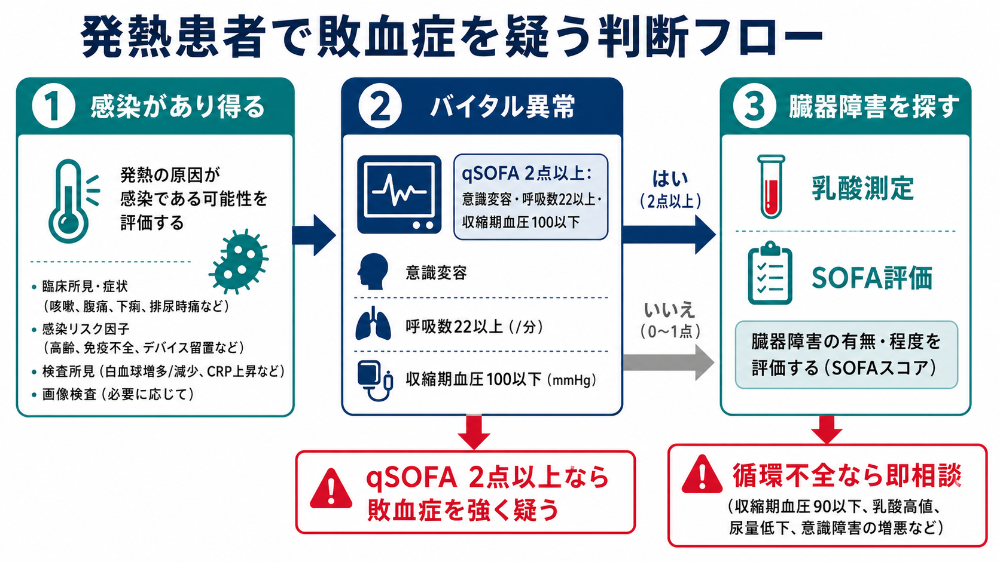
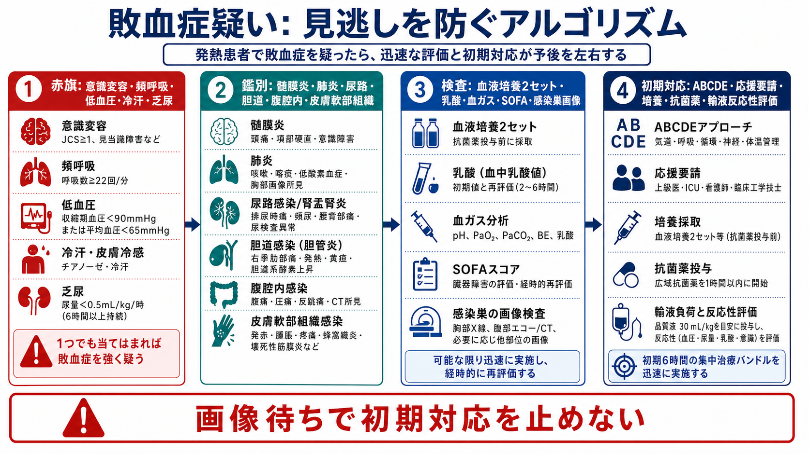
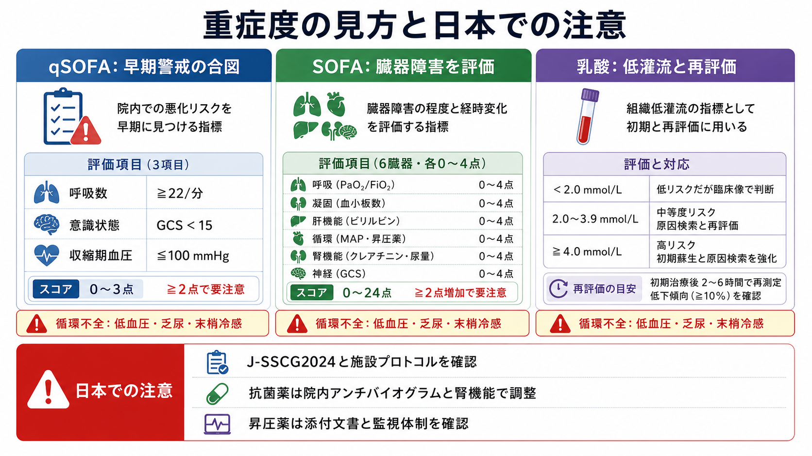

---
title: "発熱患者で敗血症を疑う基準は何か"
description: "qSOFA、SOFAで見る臓器障害、乳酸、循環不全を組み合わせ、発熱患者で敗血症を早期認識する。"
aliases:
  - "敗血症を疑う基準"
  - "発熱と敗血症"
tags:
  - 領域/救急・初期対応
  - 種類/クリニカルクエスチョン
  - 対象/研修医
question: "発熱患者で敗血症を疑う基準は何か"
clinical_area: "救急・初期対応"
audience: "研修医"
evidence_level: "guideline"
created: "2026-04-27"
updated: "2026-04-27"
enableToc: true
---

# 発熱患者で敗血症を疑う基準は何か

> このノートは研修医教育のための一般的整理であり、個別患者の診断・治療指示ではありません。緊急性が高い、判断に迷う、施設方針が関わる場合は上級医・専門科に相談してください。

## クリニカルクエスチョン

発熱患者で感染症が疑われるとき、qSOFA、SOFAで見る臓器障害、乳酸、低血圧・乏尿・末梢冷感などの循環不全をどう組み合わせて、敗血症を早期に疑うか。

## まず結論

- 敗血症は「感染に対する宿主反応の異常により生命を脅かす臓器障害」を来した状態であり、発熱そのものではなく、感染疑いに臓器障害が重なったときに疑う。[3]
- 発熱患者で、意識変容、呼吸数22回/分以上、収縮期血圧100 mmHg以下のうち2つ以上を満たす場合は、qSOFA陽性として敗血症を強く疑い、上級医へ早く共有する。[3,8]
- qSOFAは簡便な早期警戒であり、単独で敗血症を除外・確定する道具ではない。J-SSCG2024バンドルでは、感染と臓器障害を疑ったらSOFAスコア算出と乳酸測定を行う。[1,2,4]
- qSOFAが0-1点でも、低血圧、乳酸高値、乏尿、末梢冷感、酸素化悪化、血小板低下、腎機能悪化、ビリルビン上昇、凝固異常があれば敗血症として扱う閾値を下げる。[1-4]
- 循環不全を疑う所見は、収縮期血圧低下だけではない。冷汗、末梢冷感、網状皮斑、尿量低下、意識障害、乳酸上昇、頻呼吸を時系列で見る。[1,2,4]
- 敗血症を疑ったら、診断名を確定する前に、ABCDE、モニタリング、応援要請、血液培養2セット、乳酸、感染巣検索、経験的抗菌薬、輸液反応性評価を同時に進める。[2,4,5]

## 判断の型

1. **感染があり得るかを決める。** 肺炎、尿路感染、胆道感染、腹腔内感染、皮膚軟部組織感染、髄膜炎、カテーテル関連感染、術後感染を、症状・診察・検査・画像で短時間に拾う。
2. **qSOFAで危険サインを拾う。** 意識変容、呼吸数22回/分以上、収縮期血圧100 mmHg以下を確認する。2点以上なら「敗血症の可能性が高い」と考えて行動を速める。[3,8]
3. **臓器障害をSOFAの目で見る。** 呼吸、凝固、肝、循環、中枢神経、腎のどこが悪くなっているかを見る。急性にSOFAが2点以上増える感染疑いは敗血症の臨床基準になる。[3]
4. **乳酸と循環不全で重症度を上げて考える。** 乳酸は単独診断ではないが、低灌流と再評価の指標である。低血圧、乏尿、末梢冷感、乳酸高値があれば重症敗血症・敗血症性ショックを想定する。[2-4]
5. **qSOFA陰性で止まらない。** 高齢者、免疫不全、透析、肝硬変、ステロイド・抗がん薬使用中、妊産婦、術後、デバイス留置では、症状や発熱反応が乏しくても臓器障害を探す。
6. **「基準を満たすか」より「悪くなっているか」を追う。** 呼吸数、血圧、意識、尿量、乳酸、腎機能、血小板、酸素需要が数時間で悪化するなら、早期に指導医・ICU・感染症科へ相談する。

## 初期対応

- **第一印象で重症ならABCDEを先に行う。** 気道、呼吸仕事量、SpO2、循環、意識、体温、皮膚所見を見て、酸素、モニター、静脈路、応援要請を同時に始める。
- **バイタルを数値だけで見ない。** 呼吸数の実測、会話困難、チアノーゼ、冷汗、末梢冷感、尿量低下、見当識障害、家族から見た普段との差を確認する。
- **培養と抗菌薬を遅らせない。** 敗血症または敗血症性ショックが疑わしい場合、血液培養2セットと感染巣検体を可能な範囲で抗菌薬前に採取する。ただし採取困難を理由に抗菌薬を大きく遅らせない。[2,4]
- **乳酸を測る。** 初期値だけでなく、初期対応後の推移を見る。J-SSCG2024バンドルは敗血症・敗血症性ショックの診断のためSOFA算出と乳酸測定を示している。[2]
- **感染巣を探す。** 尿、肺、胆道、腹部、皮膚軟部組織、髄膜、カテーテル、骨関節、デバイス感染を、病歴・診察・検体・画像で並行して確認する。
- **循環不全なら早く相談する。** 低血圧、乳酸高値、乏尿、意識障害、末梢冷感があれば、輸液反応性、心エコー、昇圧薬、ICU/HCU管理を上級医と検討する。[1,2,4]
- **日本での注意:** 抗菌薬選択は、国内承認、施設採用薬、院内アンチバイオグラム、腎機能、アレルギー、AST/ICTの助言に合わせる。厚生労働省の抗微生物薬適正使用の手引きは最新版を確認する。[6]

## 鑑別・見逃し

| 優先度 | 疾患・状態 | 見逃さない理由 | 手がかり |
|---|---|---|---|
| 高 | 髄膜炎・髄膜脳炎 | 初期症状が発熱と意識変容だけのことがあり、抗菌薬・抗ウイルス薬・画像/腰椎穿刺判断が急ぐ | 頭痛、項部硬直、意識変容、けいれん、免疫不全 |
| 高 | 肺炎・重症呼吸器感染 | 頻呼吸と酸素化悪化はqSOFAにもSOFAにも反映され、急速に呼吸不全へ進む | 呼吸数増加、SpO2低下、湿性咳嗽、胸部画像 |
| 高 | 閉塞性腎盂腎炎・尿路性敗血症 | 抗菌薬だけでなくドレナージが必要になる | 側腹部痛、尿管結石、腎盂拡張、悪寒戦慄、菌血症 |
| 高 | 急性胆管炎 | 早期ドレナージが必要な感染巣コントロール疾患 | 右上腹部痛、黄疸、肝胆道系酵素上昇、胆管拡張 |
| 高 | 腹腔内感染・消化管穿孔 | 画像や外科判断が遅れるとショックへ進む | 腹膜刺激、腹痛、乳酸高値、免疫抑制、術後 |
| 高 | 壊死性軟部組織感染 | 皮膚所見が軽く見えても外科的治療が遅れると致命的 | 強い疼痛、急速進行、水疱、紫斑、握雪感、ショック |
| 高 | 非感染性ショック | 発熱と炎症反応があっても、心原性・出血性・閉塞性ショックが主因のことがある | 胸痛、出血、肺塞栓、心タンポナーデ、緊張性気胸 |
| 中 | 薬剤熱・膠原病・悪性腫瘍 | 感染症として固定すると不要な抗菌薬や診断遅れにつながる | 新規薬剤、皮疹、関節痛、リンパ節腫脹、培養陰性 |

## 検査

| 検査 | 目的 | 注意点 |
|---|---|---|
| qSOFAの3項目 | ベッドサイドで悪化リスクを早く拾う | 感染が疑われる患者で使う。陰性でも敗血症を除外しない。[3,4,8] |
| SOFA関連検査 | 臓器障害の有無と程度を評価する | PaO2/FiO2、血小板、ビリルビン、MAP/昇圧薬、GCS、Cr/尿量を確認する。[3] |
| 乳酸、血液ガス | 低灌流、代謝性アシドーシス、初期対応の反応を見る | 乳酸高値は敗血症以外でも起こる。単回値でなく推移を追う。[2-4] |
| 血液培養2セット | 菌血症の確認、抗菌薬の狭域化 | 抗菌薬前が原則。ただしショックなら採取困難で投与を遅らせすぎない。[2,4] |
| 感染巣検体 | 尿、喀痰、髄液、膿、胆汁、デバイス感染などの原因同定 | 検体品質を意識する。採取可否は侵襲と緊急度で判断する。 |
| CBC、生化学、凝固、肝胆道系、腎機能 | 臓器障害、DIC、薬剤調整、感染巣推定 | 血小板低下、Cr上昇、ビリルビン上昇、凝固異常は臓器障害として重い。 |
| 胸部X線、エコー、CT | 肺炎、胆道、尿路閉塞、腹腔内感染、膿瘍を探す | 不安定患者では搬送リスクを考え、ベッドサイド検査と初期対応を優先する。 |
| 心電図、心エコー | 心原性・閉塞性ショック、輸液反応性の評価 | 発熱患者でもACS、肺塞栓、心不全を併存しうる。 |

## 治療・マネジメント

- **基準は治療開始のブレーキではない。** qSOFA、SOFA、乳酸、臓器障害を確認しながら、重症ならABCDE、培養、抗菌薬、循環評価を同時進行にする。[2,4]
- **抗菌薬:** 敗血症性ショックまたは高い敗血症可能性では、認識後できるだけ早く経験的抗菌薬を開始する。感染巣、重症度、耐性菌リスク、腎機能、アレルギーで選択を調整する。[4,6]
- **輸液:** 低灌流・低血圧がある場合は調整晶質液を基本に初期蘇生を考える。高齢者、心不全、腎不全では、肺うっ血・酸素化・心エコー・尿量を見ながら過剰輸液を避ける。[1,4]
- **昇圧薬:** 低血圧が持続する、または輸液を入れにくい場合はノルアドレナリンを第一選択として検討する。日本ではPMDA添付文書、施設プロトコル、監視体制を確認し、上級医管理下で行う。[4,7]
- **感染巣コントロール:** 胆管炎、閉塞性尿路感染、腹腔内感染、膿瘍、壊死性軟部組織感染、感染デバイスでは、抗菌薬だけでなくドレナージ・手術・抜去を早く検討する。[1,4]
- **日本での注意:** J-SSCG2024は日本の診療環境を踏まえたガイドラインであり、SSC 2021やNICEの推奨と合わせて読む。薬剤名・用量・適応・保険・院内運用は海外資料をそのまま適用しない。[1,4-7]
- **小児・妊産婦・免疫不全:** このノートは主に成人救急の一般整理である。小児、妊産婦、好中球減少、移植後、透析、重度肝硬変では、早期に専門科へ相談する。

## 図解

## 指導医に確認するポイント

- この患者を「敗血症疑い」として扱う根拠は何か。qSOFA、SOFA、乳酸、循環不全、感染巣のどれが決め手か。
- 抗菌薬開始をどのタイミングで行うか。培養採取が難しい場合にどこまで待つか。
- 初期輸液をどの程度行うか。輸液反応性、心不全・腎不全・ARDSリスクをどう評価するか。
- 乳酸再検、尿量測定、動脈ライン、中心静脈路、ICU/HCU入室の必要性。
- 感染巣コントロールが必要か。外科、泌尿器科、消化器内科、放射線科、感染症科、AST/ICTのどこへ相談するか。
- 治療制限、DNAR、集中治療の適応、患者・家族説明を誰がどのタイミングで行うか。

## 患者説明

- 「発熱の原因が感染症で、その影響が血圧、呼吸、意識、腎臓など全身に及んでいないかを急いで確認しています。」
- 「敗血症は、感染に体が強く反応して臓器の働きが悪くなる状態です。早く見つけて治療を始めることが重要です。」
- 「原因菌を調べるための血液培養などを取り、必要に応じて抗菌薬、点滴、血圧を支える治療を同時に進めます。」
- 「胆道、尿路、お腹、皮膚などに原因がある場合は、薬だけでなく処置や手術が必要になることがあります。」

## ピットフォール

- qSOFAが0-1点だから敗血症ではない、と判断する。qSOFAは除外検査ではない。[4]
- 発熱があることだけで敗血症と呼ぶ。敗血症の本質は感染に伴う生命を脅かす臓器障害である。[3]
- 呼吸数を測らない。頻呼吸はqSOFAにも低灌流・代謝性アシドーシスにも関係する重要サインである。
- 乳酸が正常だから安心する。早期、局所虚血、高齢者、測定タイミングによって重症でも目立たないことがある。
- 画像で感染巣を確定しようとして、血液培養、抗菌薬、循環蘇生、応援要請が遅れる。
- 「血圧が保たれている」だけで循環不全を否定する。冷汗、末梢冷感、乏尿、意識変容、乳酸上昇を合わせて見る。
- 海外ガイドラインの薬剤・用量をそのまま使う。日本では添付文書、施設採用薬、腎機能、アンチバイオグラム、AST/ICTを確認する。[6,7]

## 関連ノート

- [[救急外来で敗血症性ショックを疑ったら何をするか]]
- [[乳酸値が高い患者をどう解釈するか]]
- [[ショック患者を見たら最初に何をするか]]
- [[救急外来で患者を診るときABCDE評価はどの順番で進めるか]]
- [[発熱患者を見たら抗菌薬の前に何を確認するか]]
- 関連ノート候補（未作成または所在未確認）: 発熱患者で血液培養はいつ何セット取るべきか、qSOFAとSOFAをどう使い分けるか、尿路感染でドレナージを急ぐ場面は何か

## MOC更新候補

- [[MOC｜救急・初期対応]]
- MOC｜感染症・抗菌薬.md（本サイト外）
- MOC｜検査・画像・手技.md（本サイト外）

## 参考文献

[1] 日本版敗血症診療ガイドライン2024特別委員会. 日本版敗血症診療ガイドライン2024. 日本集中治療医学会雑誌. 2024;31(Supplement):S1165-S1313. https://doi.org/10.3918/jsicm.2400001

[2] 日本版敗血症診療ガイドライン2024特別委員会. 初期治療とケアバンドル（J-SSCG2024バンドル）. 日本集中治療医学会・日本救急医学会. https://www.jsicm.org/pdf/cq/J-SSCG2024/bundle.pdf

[3] Singer M, Deutschman CS, Seymour CW, et al. The Third International Consensus Definitions for Sepsis and Septic Shock (Sepsis-3). JAMA. 2016;315(8):801-810. https://doi.org/10.1001/jama.2016.0287

[4] Evans L, Rhodes A, Alhazzani W, et al. Surviving Sepsis Campaign: International Guidelines for Management of Sepsis and Septic Shock 2021. Intensive Care Medicine. 2021;47:1181-1247. https://doi.org/10.1007/s00134-021-06506-y

[5] National Institute for Health and Care Excellence. Suspected sepsis in people aged 16 or over: recognition, assessment and early management. NICE Clinical Guidelines, No. 253. 2025. https://www.ncbi.nlm.nih.gov/books/NBK621385/

[6] 厚生労働省. 薬剤耐性（AMR）対策：抗微生物薬適正使用の手引き 第四版. 2026. https://www.mhlw.go.jp/stf/seisakunitsuite/bunya/0000120172.html

[7] 医薬品医療機器総合機構（PMDA）. ノルアドリナリン注1mg 医療用医薬品情報・添付文書. https://www.pmda.go.jp/PmdaSearch/rdDetail/iyaku/2451401A1034_2?user=1

[8] Seymour CW, Liu VX, Iwashyna TJ, et al. Assessment of Clinical Criteria for Sepsis: For the Third International Consensus Definitions for Sepsis and Septic Shock (Sepsis-3). JAMA. 2016;315(8):762-774. https://doi.org/10.1001/jama.2016.0288

## 更新ログ

- 2026-04-27: 初版作成。
