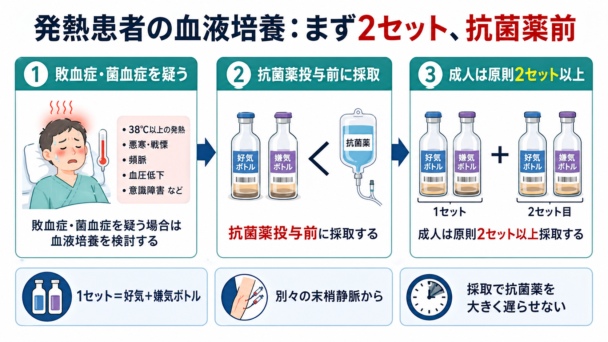
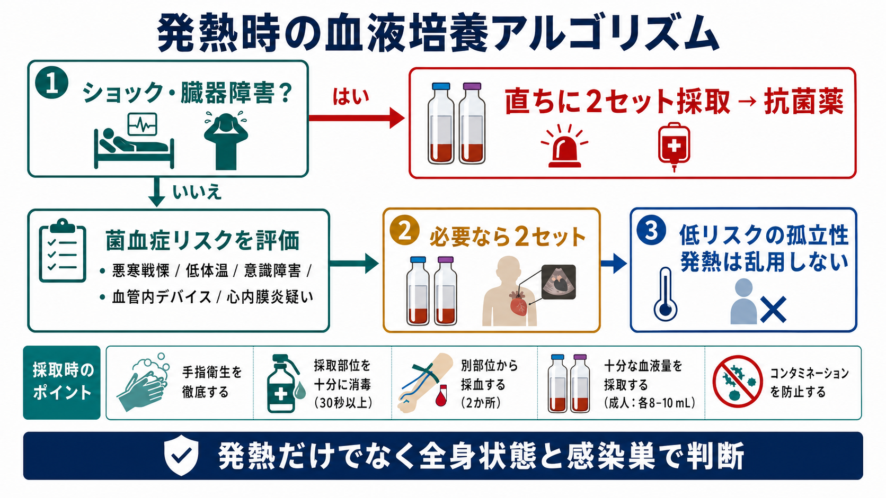
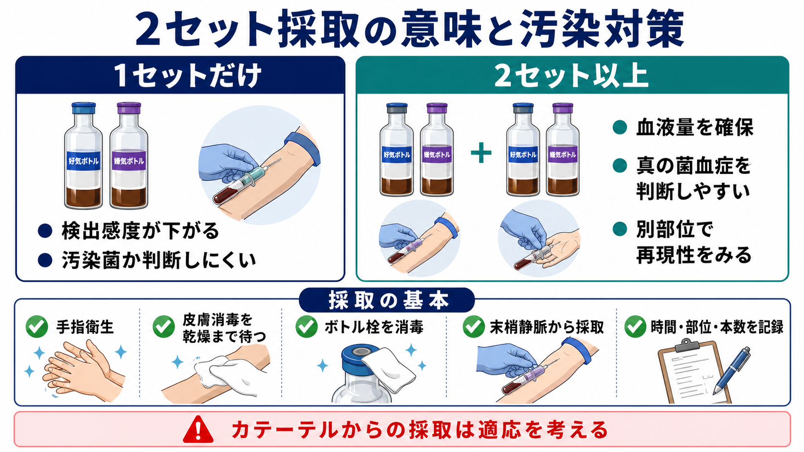

---
title: "発熱患者で血液培養はいつ何セット取るべきか"
description: "抗菌薬前の血液培養採取、2セットの意味、採取部位、汚染対策を初期対応で使える形に整理する。"
aliases:
  - "発熱時の血液培養"
  - "血培2セット"
tags:
  - 領域/救急・初期対応
  - 種類/クリニカルクエスチョン
  - 対象/研修医
question: "発熱患者で血液培養はいつ何セット取るべきか"
clinical_area: "救急・初期対応"
audience: "研修医"
evidence_level: "guideline/review/mixed"
created: "2026-04-27"
updated: "2026-04-27"
enableToc: true
---

# 発熱患者で血液培養はいつ何セット取るべきか

> このノートは研修医教育のための一般的整理であり、個別患者への診断・治療指示ではありません。緊急性が高い、判断に迷う、施設方針が関わる場合は上級医・感染症科・救急/集中治療チームに相談してください。

## クリニカルクエスチョン

発熱患者で血液培養はいつ、何セット、どこから採るべきか。特に、抗菌薬投与前の採取、2セット採取の意味、採取部位、汚染対策をどう考えるか。

## まず結論

- 敗血症、菌血症、血管内感染、感染性心内膜炎、重症感染症を疑う発熱では、可能な限り抗菌薬投与前に血液培養を採る。敗血症初期対応では、微生物検査と抗菌薬投与を同時並行で進め、採取そのものが抗菌薬開始を大きく遅らせないようにする[1][2]。
- 成人では原則2セット以上。1セットは通常、好気ボトル1本と嫌気ボトル1本で、成人では各ボトル8-10 mL程度、1セット20 mL前後を目標にする[3][4][5][7]。
- 2セットの意味は、検出感度を上げることと、皮膚常在菌などの汚染か真の菌血症かを判断しやすくすること。成人入院患者データでは、1セット、2セット、3セットでの検出率は順に73.1%、89.7%、98.2%だった[8]。
- 採取部位は原則として別々の末梢静脈穿刺。カテーテル関連血流感染を疑う場合などを除き、ラインからの採取を安易に優先しない[5][9]。
- 汚染対策は「手指衛生、皮膚消毒、乾燥を待つ、ボトル栓消毒、部位・時刻・本数の記録」。血液量不足と単セット採取は、偽陰性と解釈困難の原因になる[5][6]。
- 日本での注意: 厚生労働省の抗微生物薬適正使用の手引きは、抗菌薬投与前および広域抗菌薬への変更前の血液培養、原則2セット以上、1セット20 mLを明記している[3]。皮膚消毒薬は施設採用品と添付文書の禁忌・注意を確認し、クロルヘキシジン過敏歴などを問診する[10]。

## 判断の型

1. まず重症度を見る  
   ショック、低血圧、頻呼吸、意識障害、乳酸上昇、乏尿、SpO2低下、急速な悪化があれば、血液培養2セットと抗菌薬を同時進行で進める。J-SSCG 2024の初期治療バンドルでも、敗血症を疑う場合は直ちに血液培養2セットを含む微生物検査を行う流れになっている[1]。
2. 菌血症リスクを見る  
   悪寒戦慄、原因不明の低体温、血管内デバイス、感染性心内膜炎疑い、骨髄炎・椎体炎・硬膜外膿瘍疑い、免疫不全、人工物感染疑いでは、体温の数字だけでなく血液培養の適応を強く考える[3][9]。
3. 採るなら「2セット・十分量・別部位」  
   成人で1セットだけだと、検出感度が低く、コアグラーゼ陰性ブドウ球菌などが出たときに汚染か真の菌血症か判断しにくい[5][6][8]。
4. 低リスクの孤立性発熱では乱用しない  
   明らかなウイルス性上気道炎など、菌血症の可能性が低く、抗菌薬を開始しない場面では、血液培養を機械的に出さない。培養は「症状・感染巣・重症度・治療方針」を変えうるときに出す[3]。

## 初期対応

- ABCDE、バイタル、意識、末梢冷感、尿量、皮疹、項部硬直、呼吸状態、腹部所見、皮膚軟部組織、カテーテル刺入部を同時に評価する。
- 敗血症性ショックまたは敗血症の可能性が高い場合は、採血、乳酸、血液培養2セット、感染巣検体、輸液、酸素、抗菌薬準備を分担して進める[1][2]。
- 抗菌薬前採取が原則だが、血液培養の準備で抗菌薬開始が危険に遅れる状況では、上級医と相談し、治療遅延を避ける[2]。
- すでに抗菌薬が入っている場合でも、広域化・変更前、菌血症が疑われる悪化時、血管内感染疑いでは採取を検討する[3]。
- 採取後は、時刻、左右/部位、末梢かカテーテルか、ボトル本数、採取者、採血困難や消毒不十分などの事情を記録する[5]。

## 鑑別・見逃し

| 優先度 | 疾患・状況 | 見逃さない理由 | 手がかり |
|---|---|---|---|
| 高 | 敗血症・敗血症性ショック | 抗菌薬と蘇生の遅れが転帰に関わる | 低血圧、頻呼吸、意識障害、乳酸上昇、乏尿 |
| 高 | 感染性心内膜炎 | 血液培養の解釈と複数セット採取が診断に直結する | 心雑音、塞栓、点状出血、人工弁、透析、注射薬使用 |
| 高 | カテーテル関連血流感染 | カテーテル抜去・培養戦略が変わる | 中心静脈カテーテル、ポート、刺入部発赤、カテーテル使用中の悪寒 |
| 中 | 尿路感染、胆道感染、肺炎、皮膚軟部組織感染 | 菌血症化しやすい感染巣がある | CVA叩打痛、黄疸、低酸素、蜂窩織炎、壊死性変化 |
| 中 | 免疫不全・好中球減少性発熱 | 発熱だけでも重症化しやすい | 化学療法、移植、ステロイド、生物学的製剤 |
| 中 | 非感染性発熱 | 培養と抗菌薬だけでは解決しない | 薬剤熱、血栓症、膠原病、悪性腫瘍、輸血反応 |

## 検査

| 検査 | 目的 | 注意点 |
|---|---|---|
| 血液培養2セット以上 | 菌血症・真菌血症の検出、原因菌同定、感受性確認 | 原則、抗菌薬前。別々の末梢静脈から。成人は十分量を確保する[3][5] |
| 乳酸 | 敗血症の重症度・循環不全評価 | 採血だけで安心せず、臨床所見と合わせて再評価する[2] |
| CBC、腎肝機能、電解質、凝固、血糖 | 臓器障害、DIC、抗菌薬選択の前提確認 | 腎機能は抗菌薬用量調整にも関わる |
| 感染巣検体 | 血液以外の原因菌推定 | 尿、喀痰、髄液、膿、胆汁、創部深部検体など。表面ぬぐいだけに頼らない |
| 画像検査 | 感染巣・ドレナージ適応の評価 | 胸部X線/CT、腹部エコー/CT、心エコーなどを状況で選ぶ |

### 採取の実務

- 1セットは「好気ボトル＋嫌気ボトル」と考える。施設のボトル規格に従い、成人ではボトルあたり8-10 mL程度を目標にする[3][5]。
- 2セットは、同じ穿刺部位から連続で分けるより、別々の末梢静脈から採る方が汚染判定に有用である[5]。
- 採取タイミングは「発熱ピークを待つ」より「抗菌薬前に十分量」。持続菌血症や現代の自動血液培養では、タイミング差より血液量とセット数が重要になる[5]。
- カテーテル関連血流感染を疑う場合は、施設方針に従って末梢血とカテーテル採血の組み合わせ、カテーテル先端培養、抜去判断を上級医と確認する[9]。
- 黄色ブドウ球菌菌血症、カンジダ血症、感染性心内膜炎、血管内感染では、陰性化確認の再培養が必要になることがある[3]。

## 治療・マネジメント

- 血液培養は治療を遅らせるための検査ではなく、抗菌薬を適正化するための検査である。敗血症性ショックや敗血症の可能性が高い場合、微生物検査を速やかに済ませ、経験的抗菌薬を開始する[1][2]。
- 血液培養結果は、陽性菌名だけでなく、陽性本数、何セット中何セットか、採取部位、陽性化時間、臨床像と合わせて解釈する[6]。
- 皮膚常在菌が1セットのみ陽性の場合は汚染を考えるが、人工物、血管内デバイス、免疫不全、同一菌の複数セット陽性では真の菌血症を疑う[6]。
- 経験的抗菌薬開始後は、培養結果、感染巣、重症度、臓器機能、施設アンチバイオグラムをもとに、48-72時間を目安にde-escalationまたは中止を再評価する[2][3]。
- 日本での注意: 消毒薬は薬剤ごとに効能・効果、禁忌、使用上の注意が異なる。クロルヘキシジン製剤では過敏症既往、耳・中枢神経領域などへの使用禁忌、アナフィラキシーに注意する[10]。

## 図解

## 指導医に確認するポイント

- この患者は「発熱」ではなく「敗血症・菌血症リスク」として扱うべきか。
- 血液培養を2セット採る時間はあるか、抗菌薬開始を遅らせていないか。
- 採取部位は末梢2か所でよいか。カテーテル関連血流感染を疑い、カテーテル採血や抜去を考える状況か。
- 経験的抗菌薬の選択は、感染巣、重症度、耐性菌リスク、腎機能、アレルギー、施設採用品に合っているか。
- 陽性結果が返ったとき、汚染としてよいか、真の菌血症として対応すべきか。
- 再培養が必要な菌種・病態か。特に黄色ブドウ球菌、カンジダ、心内膜炎、血管内感染では確認する。

## 患者説明

- 「熱の原因が血液の中まで広がっていないかを調べるため、抗菌薬を始める前に血液培養を採ります。」
- 「2回分採るのは、菌を見つけやすくするためと、皮膚の菌が混じっただけか本当に血液の中にいる菌かを判断しやすくするためです。」
- 「結果が出るまでに時間がかかるため、重症が疑われる場合は結果を待たずに抗菌薬を始め、後で結果に合わせて薬を調整します。」
- 「採血部位の消毒を十分に行いますが、まれに皮膚の菌が混じることがあり、結果は症状や他の検査と合わせて判断します。」

## ピットフォール

- 発熱のピークを待って、抗菌薬前採取の機会を逃す。
- 1セットだけ採って安心する。単セット陽性は汚染か真の菌血症か判断しにくい。
- ボトルに入る血液量が少ない。血液量不足は偽陰性につながる。
- ラインから採った血液培養を、末梢血培養と同じように解釈する。
- 消毒後に乾く前に穿刺する、消毒後に再触診する、ボトル栓消毒を忘れる。
- 陽性結果を菌名だけで判断し、何セット中何セット陽性か、採取部位、臨床像を見ない。
- 培養結果が陰性だから感染症ではないと短絡する。抗菌薬投与後、採血量不足、局所感染、培養困難菌では陰性になりうる。

## 関連ノート

- 関連ノート候補: `敗血症を疑ったとき初期対応は何から始めるか`
- 関連ノート候補: `血液培養陽性は汚染か菌血症かどう判断するか`
- 関連ノート候補: `黄色ブドウ球菌菌血症で何を見逃してはいけないか`
- 関連ノート候補: `カテーテル関連血流感染を疑ったら何をするか`
- MOC更新候補: [[MOC｜救急・初期対応]]
- MOC更新候補: MOC｜感染症・抗菌薬.md（本サイト外）

## 参考文献

[1] 日本救急医学会. 日本版敗血症診療ガイドライン2024 初期治療とケアバンドル. https://www.jaam.jp/info/2024/files/bundle.pdf

[2] Shime N, Nakada TA, Yatabe T, et al. The Japanese Clinical Practice Guidelines for Management of Sepsis and Septic Shock 2024. Journal of Intensive Care. 2025. https://doi.org/10.1186/s40560-025-00776-0

[3] 厚生労働省健康・生活衛生局感染症対策部感染症対策課. 抗微生物薬適正使用の手引き 第四版. 2026. https://www.mhlw.go.jp/stf/seisakunitsuite/bunya/0000120172.html

[4] 日本臨床微生物学会. 血液培養検査ガイド. 日本臨床微生物学雑誌. 2013;23(Suppl.1):1-142. https://cir.nii.ac.jp/crid/1520853832934699648

[5] Centers for Disease Control and Prevention. Collect Adult Blood Culture Sets. 2026. https://www.cdc.gov/lab-quality/php/preventing-adult-blood-culture-contamination/collect.html

[6] Centers for Disease Control and Prevention. Prevent Adult Blood Culture Contamination: A Quality Tool for Clinical Laboratory Professionals. 2024. https://www.cdc.gov/lab-quality/php/prevent-adult-blood-culture-contamination/index.html

[7] Clinical and Laboratory Standards Institute. M47: Principles and Procedures for Blood Cultures, 2nd ed. 2022. https://clsi.org/standards/products/new-products/documents/m47/

[8] Lee A, Mirrett S, Reller LB, Weinstein MP. Detection of bloodstream infections in adults: how many blood cultures are needed? J Clin Microbiol. 2007;45(11):3546-3548. https://doi.org/10.1128/JCM.01555-07

[9] 荒川創一, 笠井正志, 河合伸, 坂田宏, 真弓俊彦. JAID/JSC感染症治療ガイドライン2017―敗血症およびカテーテル関連血流感染症―. 感染症学雑誌. 2018;92(1):10-45. https://doi.org/10.11150/kansenshogakuzasshi.92.10

[10] 医薬品医療機器総合機構. クロルヘキシジングルコン酸塩エタノール消毒液1％「東豊」医療用医薬品情報. https://www.pmda.go.jp/PmdaSearch/rdSearch/02/261970BQ5057?user=1

## 更新ログ

- 2026-04-27: 初版作成。J-SSCG 2024、厚生労働省AMR手引き、CDC/CLSI、日本臨床微生物学会資料、PMDA添付文書情報を確認し、血液培養の採取タイミング、2セット採取、採取部位、汚染対策を整理。
