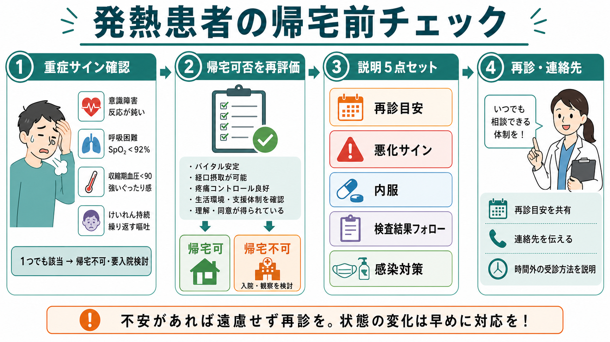
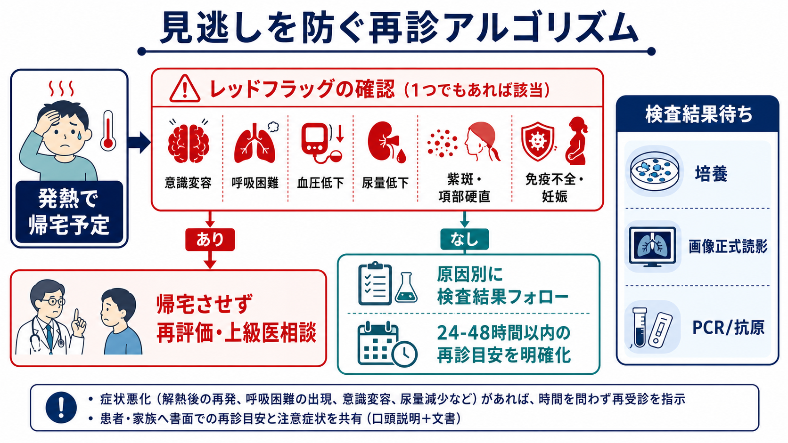
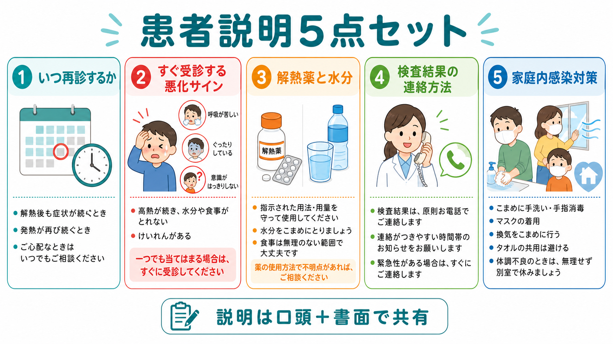

---
title: "発熱患者を帰宅させるとき何を説明するか"
description: "再診目安、悪化サイン、内服、検査結果フォロー、感染対策を明確に伝える。"
aliases:
  - "発熱帰宅説明"
tags:
  - 領域/救急・初期対応
  - 種類/クリニカルクエスチョン
  - 対象/研修医
question: "発熱患者を帰宅させるとき何を説明するか"
clinical_area: "救急・初期対応"
audience: "研修医"
evidence_level: "mixed"
created: "2026-04-27"
updated: "2026-04-27"
enableToc: true
---

# 発熱患者を帰宅させるとき何を説明するか

> このノートは研修医教育のための一般的整理であり、個別患者の診断・治療指示ではありません。緊急性が高い、判断に迷う、施設方針が関わる場合は上級医・専門科に相談してください。

## クリニカルクエスチョン

救急外来・時間外外来で、発熱患者を帰宅させると判断したとき、再診目安、悪化サイン、内服、検査結果フォロー、感染対策をどう説明するか。

## まず結論

- 帰宅説明の前に、「いま帰宅してよいか」をもう一度確認する。敗血症は高熱がなくても、意識変容、呼吸困難、低血圧、尿量低下、紫斑、項部硬直、強い全身状態不良、家族の「いつもと違う」という訴えで疑う[1,2]。
- 説明は「再診目安」「すぐ受診する悪化サイン」「内服・水分」「検査結果フォロー」「感染対策」の5点セットで、口頭だけでなく書面または診療録に残る形で共有する[7]。
- 「熱が続いたら来てください」では不十分である。時間、症状、連絡先、時間外の受診先を具体化する。
- 培養、画像正式読影、PCR・抗原、尿検査など未確定結果がある場合は、誰が、いつ、どの手段で確認し、患者へ連絡するかを帰宅前に決める。未フォローは救急外来の患者安全上のリスクである[7,8]。
- 解熱薬は症状緩和の補助であり、重症化を防ぐ薬ではない。アセトアミノフェンは重複内服、過量、飲酒、肝障害に注意して、処方・市販薬を含めて確認する[5]。
- 感染対策は原因別に調整する。COVID-19は発症後5日間、かつ症状軽快後24時間程度まで外出を控えることが日本で推奨され、インフルエンザは学校保健安全法上の出席停止基準がある[3,4]。

## 判断の型

1. 帰宅前に危険サインを再確認する  
   バイタルの再測定、意識、呼吸仕事量、SpO2、循環、尿量、皮疹、髄膜刺激症状、免疫不全、妊娠、高齢、独居・支援不足を確認する。
2. 「帰宅後に起こりうる悪化」を患者の言葉で説明する  
   発熱そのものより、呼吸、意識、循環、脱水、皮疹、痛みの増悪、経口摂取不能を重視する。
3. 再診条件を3段階で渡す  
   「すぐ救急」「本日から翌日までに再診」「予定フォロー」の3段階に分ける。
4. 未確定検査を一覧化する  
   例: 血液培養、尿培養、画像正式読影、迅速検査の確認、外注PCR、肝腎機能、炎症反応の再検。
5. 患者・家族の理解を確認する  
   「どんなときに救急へ戻るか、確認のため教えてください」と聞く。理解が不十分、独居、連絡不能、帰宅後の支援不足があれば帰宅方針を再検討する[7]。

## 初期対応

- 帰宅判断の直前に、少なくともバイタル、見た目、意識、呼吸、循環、疼痛、経口摂取、歩行・ADLを再評価する。
- qSOFAやNEWS2などのスコアは補助として有用だが、「スコアが低いから安全」と単独で判断しない。敗血症は非特異的に始まり、発熱が目立たないこともある[1,2]。
- 以下があれば帰宅説明ではなく、再評価・上級医相談・観察継続・入院適応を検討する。
  - 意識変容、けいれん、強い傾眠、家族から見て明らかに普段と違う。
  - 呼吸困難、SpO2低下、胸痛、チアノーゼ。
  - 収縮期血圧低下、冷汗、末梢冷感、頻脈が改善しない。
  - 尿量低下、経口摂取不能、反復嘔吐、脱水。
  - 紫斑、急速に広がる皮疹、項部硬直、強い頭痛。
  - 免疫不全、化学療法中、ステロイド・免疫抑制薬使用、無脾、妊娠、乳幼児、高齢、透析、臓器移植後。

## 鑑別・見逃し

| 優先度 | 疾患・状態 | 見逃さない理由 | 手がかり |
|---|---|---|---|
| 高 | 敗血症・敗血症性ショック | 初期は非特異的でも急速に悪化しうる | 意識変容、低血圧、頻呼吸、尿量低下、末梢冷感、家族の違和感[1,2] |
| 高 | 髄膜炎・脳炎 | 帰宅後の遅れが重篤な転帰につながる | 頭痛、項部硬直、意識変容、けいれん、紫斑 |
| 高 | 肺炎・低酸素 | 若年でも呼吸状態が悪化しうる | 呼吸困難、SpO2低下、胸痛、頻呼吸、画像所見 |
| 高 | 腎盂腎炎・尿路感染症の重症化 | 菌血症や敗血症に進むことがある | 悪寒戦慄、側腹部痛、嘔吐、尿路閉塞、男性、高齢 |
| 高 | 皮膚軟部組織感染症・壊死性筋膜炎 | 初期皮膚所見が軽くても進行が速い | 痛みが強い、急速な拡大、水疱、紫斑、免疫不全 |
| 中 | COVID-19・インフルエンザなど呼吸器ウイルス | 重症化リスクと周囲への感染対策が必要 | 咳、咽頭痛、流行状況、基礎疾患、ワクチン歴[3,4,6] |
| 中 | 薬剤熱・膠原病・悪性腫瘍 | 感染症として説明しすぎると再評価が遅れる | 発熱遷延、皮疹、関節痛、リンパ節腫脹、薬剤変更 |

## 検査

| 検査 | 目的 | 注意点 |
|---|---|---|
| バイタル再測定 | 帰宅前の安定性を確認する | 発熱時だけでなく解熱後の頻脈・低血圧・頻呼吸を確認する |
| 血液検査 | 脱水、腎機能、肝機能、炎症反応、臓器障害の手がかり | 正常値でも早期感染症を否定しない。再診条件を残す |
| 尿検査・尿培養 | 尿路感染症、腎盂腎炎、妊娠可能性の確認 | 培養結果の連絡担当と連絡期限を決める |
| 血液培養 | 菌血症が疑われる場合の原因検索 | 帰宅患者で採取した場合、陽性時の連絡・再診導線を必ず決める[8] |
| 胸部画像 | 肺炎、心不全、気胸などの確認 | 正式読影で所見が変わる可能性を説明し、連絡方法を残す[7,8] |
| 迅速抗原・PCR | COVID-19、インフルエンザなどの感染対策・治療判断 | 陰性でも発症早期は否定できない。症状悪化時の再診を説明する |

## 治療・マネジメント

- 帰宅時の説明は、処方よりも安全な行動計画を作る行為である。患者が「何を飲むか」だけでなく「いつ戻るか」を理解していることを確認する。
- 解熱薬は、苦痛、頭痛、筋肉痛、睡眠障害を和らげる目的で使う。熱を完全に下げることを目標にしない。
- アセトアミノフェンを使う場合は、医療用・市販薬・総合感冒薬の重複に注意する。肝障害、過量内服、飲酒量が多い患者では特に慎重にし、疑義があれば薬剤師・上級医へ確認する[5]。
- NSAIDsは腎機能障害、脱水、胃潰瘍、抗凝固薬内服、心不全、妊娠後期などで不利益が問題になりうる。発熱患者では脱水や腎機能を確認してから考える。
- 抗菌薬は「発熱だから」ではなく、感染巣、重症度、患者背景、地域・施設の抗菌薬方針に基づいて判断する。処方した場合は、飲み切り、中止・再診すべき副作用、培養結果で変更する可能性を説明する。
- 日本での注意: COVID-19とインフルエンザの外出・登校・就業の目安は、米国CDCの一般呼吸器ウイルス指針と完全には一致しない。患者の学校・職場・施設ルール、厚生労働省や学校保健安全法の基準、施設内感染対策方針を確認する[3,4,6]。

## 図解

## 指導医に確認するポイント

- 帰宅前バイタルに不安がある、頻脈・頻呼吸・低血圧が残る、または患者の見た目が悪い。
- 原因が特定できず、悪寒戦慄、免疫不全、妊娠、高齢、独居、支援不足がある。
- 血液培養を採取したが帰宅予定である。
- 画像正式読影や外注検査で治療方針が変わる可能性がある。
- 抗菌薬を出すか、出さないかで迷う。
- 患者が説明を理解できない、連絡手段が不安定、帰宅後に再受診できる見込みが乏しい。

## 患者説明

- 「本日の診察では、今すぐ入院が必要な所見は目立ちません。ただし、発熱の病気はあとから悪化することがあります。」
- 「息苦しい、胸が痛い、意識がぼんやりする、水分が取れない、尿が極端に少ない、ぐったりする、紫色の発疹が出る、強い頭痛や首の硬さが出る場合は、時間を待たず救急を受診してください。」
- 「熱が続く、解熱後にまた悪くなる、食事や水分が取れない、症状が改善しない場合は、明日から48時間以内を目安に再診してください。心配な変化があればその前でも受診してください。」
- 「解熱薬はつらさを和らげる薬です。指示された回数と量を守ってください。市販のかぜ薬にも同じ成分が入ることがあるため、重ねて飲まないでください。」
- 「結果がまだ出ていない検査があります。結果は原則として電話で連絡します。連絡がつきやすい時間と電話番号を確認させてください。緊急性がある結果なら、こちらから早めに連絡します。」
- 「咳や鼻水など呼吸器症状がある間は、できるだけ家で休み、手洗い、換気、マスク、タオル共有を避けることを意識してください。COVID-19やインフルエンザでは外出・登校・就業の目安が別にあります。」

## ピットフォール

- 「解熱したから安全」と説明してしまう。解熱薬で一時的に熱が下がっても、敗血症や肺炎の悪化は隠れうる。
- 「悪くなったら来てください」で終える。何が悪化サインか、いつ、どこへ来るかまで具体化する。
- 未確定検査を患者にも診療録にも残さない。培養陽性、画像読影差異、外注検査陽性は帰宅後に治療変更が必要になることがある[8]。
- 連絡先を確認しない。電話番号、留守電可否、家族連絡、時間帯を確認する。
- 市販薬との重複を聞かない。アセトアミノフェンやNSAIDsは総合感冒薬に含まれることがある[5]。
- 感染対策を原因別に説明しない。COVID-19、インフルエンザ、胃腸炎、麻疹・水痘疑いなどでは周囲への説明が変わる。

## 関連ノート

- 関連ノート候補: `発熱患者で敗血症を疑うサインは何か`
- 関連ノート候補: `血液培養を採った患者を帰宅させてよいか`
- 関連ノート候補: `インフルエンザ患者に何を説明するか`
- 関連ノート候補: `COVID-19患者に何を説明するか`

## MOC更新候補

- [[MOC｜救急・初期対応]]
- MOC｜感染症・抗菌薬.md（本サイト外）

## 参考文献

[1] 日本版敗血症診療ガイドライン2024特別委員会. 日本版敗血症診療ガイドライン2024. 日本集中治療医学会雑誌. 2024. https://www.jstage.jst.go.jp/article/jsicm/advpub/0/advpub_2400001/_article/-char/ja/

[2] National Institute for Health and Care Excellence. Suspected sepsis in people aged 16 or over: recognition, assessment and early management. NICE guideline NG253. Published 2025, updated 2026. https://www.nice.org.uk/guidance/ng253

[3] 厚生労働省. 新型コロナウイルス感染症の5類感染症移行後の対応について. https://www.mhlw.go.jp/stf/corona5rui.html

[4] 厚生労働省. 令和6年度インフルエンザQ&A. https://www.mhlw.go.jp/stf/seisakunitsuite/bunya/kenkou_iryou/kenkou/kekkaku-kansenshou/infulenza/QA2024.html

[5] PMDA. カロナール錠200／カロナール錠300／カロナール錠500 医療用医薬品情報・患者向医薬品ガイド. https://www.pmda.go.jp/PmdaSearch/rdDetail/iyaku/1141007F1063_5?user=1

[6] Centers for Disease Control and Prevention. Preventing Spread of Respiratory Viruses When You're Sick. Updated 2025. https://www.cdc.gov/respiratory-viruses/prevention/precautions-when-sick.html

[7] Agency for Healthcare Research and Quality. Re-Engineered Discharge (RED) Toolkit. https://www.ahrq.gov/patient-safety/settings/hospital/red/toolkit/index.html

[8] Hohl CM, et al. Quality Assurance Processes Ensuring Appropriate Follow-up of Test Results Pending at Discharge in Emergency Departments: A Systematic Review. Ann Emerg Med. 2020;76(5):659-674. https://doi.org/10.1016/j.annemergmed.2020.07.024

## 更新ログ

- 2026-04-27: 初版作成。
