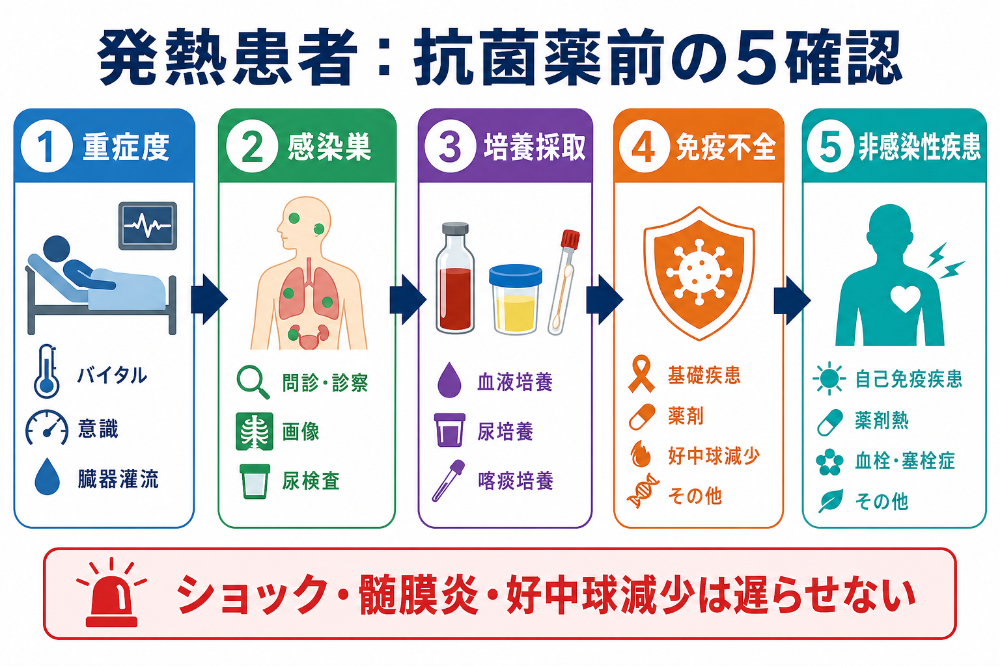
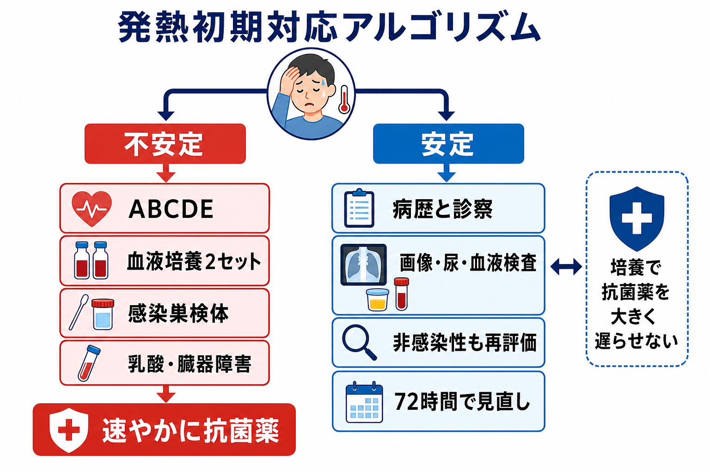
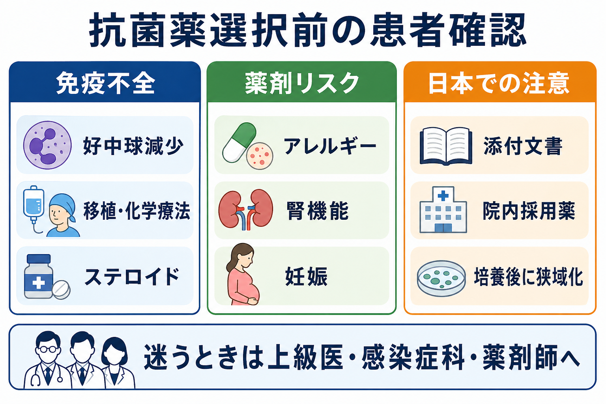

---
title: "発熱患者を見たら抗菌薬の前に何を確認するか"
description: "重症度、感染巣、培養採取、免疫不全、非感染性疾患を評価して、抗菌薬を急ぐ場面と情報を集める場面を切り分ける。"
aliases:
  - "発熱と抗菌薬前確認"
tags:
  - 領域/救急・初期対応
  - 種類/クリニカルクエスチョン
  - 対象/研修医
question: "発熱患者を見たら抗菌薬の前に何を確認するか"
clinical_area: "救急・初期対応"
audience: "研修医"
evidence_level: "guideline/review/mixed"
created: "2026-04-27"
updated: "2026-04-27"
enableToc: true
---

# 発熱患者を見たら抗菌薬の前に何を確認するか

> このノートは研修医教育のための一般的整理であり、個別患者の診断・治療指示ではありません。緊急性が高い、判断に迷う、施設方針が関わる場合は上級医・専門科に相談してください。

## クリニカルクエスチョン

発熱患者を見たら、抗菌薬を出す前に何を確認すればよいか。

## まず結論

- 最初に確認するのは「抗菌薬名」ではなく、重症度、感染巣、培養採取、免疫不全、非感染性疾患の5つである。
- ショック、臓器障害、意識障害、髄膜炎疑い、発熱性好中球減少症では、培養採取を試みつつ抗菌薬を大きく遅らせない。敗血症・敗血症性ショックでは早期治療が推奨される[1,2]。
- 血液培養は、可能なら抗菌薬前に2セット以上を別部位から採る。採れないことで治療開始が大きく遅れるなら、上級医に共有して抗菌薬を優先する[2,5]。
- 安定していて感染の確からしさが低い患者では、短時間で病歴・診察・検査を集め、感染性か非感染性かを再評価してから抗菌薬を判断する[2,8]。
- 日本では、抗菌薬の選択・用量・投与間隔は国内添付文書、院内採用薬、腎機能、妊娠、アレルギー、地域・院内アンチバイオグラムを確認して決める[3,7]。

## 判断の型

1. まず重症度を切る  
   ABCDE、血圧、意識、呼吸数、SpO2、尿量、末梢冷感、皮疹、乳酸、腎・肝・凝固などの臓器障害を確認する。敗血症は「感染に対する制御不能な宿主反応による生命を脅かす臓器障害」として扱い、疑った時点で蘇生と治療を並行する[1,2]。
2. 次に感染巣を探す  
   肺、尿路、胆道・腹腔内、皮膚軟部組織、髄膜・中枢神経、カテーテル、関節、心内膜炎、渡航・動物・職業曝露を、病歴と診察で絞る。感染巣が分からない場合も、採れる検体を先に決める。
3. 抗菌薬前に培養を採る  
   血液培養2セットを基本に、尿、喀痰、髄液、膿、創部、胆汁、腹水、関節液など、感染巣に対応した検体を採る。培養は後の狭域化・中止判断に直結する[2,5,8]。
4. 免疫不全を拾う  
   好中球減少、化学療法、造血幹細胞移植、臓器移植、HIV、ステロイド・免疫抑制薬、生物学的製剤、脾摘後、透析、糖尿病、肝硬変では、典型症状が乏しくても重症感染として扱う閾値を下げる[4,6]。
5. 非感染性疾患を同時に考える  
   薬剤熱、血栓症、悪性腫瘍、膠原病・血管炎、甲状腺クリーゼ、熱中症、輸血反応、膵炎、術後・外傷、深部血腫、中枢熱などは発熱を来す。感染が不確かなら、抗菌薬を始めた後も毎日「本当に感染か」を見直す[2,9]。

## 初期対応

- 不安定なら、診断を待たずに人を呼ぶ。酸素、モニター、静脈路、輸液、血液ガス・乳酸、血算・生化学・凝固、尿量評価を並行する[1,2]。
- 抗菌薬前に「採れる検体」を決める。血液培養2セット、尿、喀痰、髄液、膿、カテーテル先端やカテーテル採血の要否を、感染巣ごとに考える[5]。
- 髄膜炎、壊死性軟部組織感染症、胆管炎、腎盂腎炎、肺炎、腹腔内感染、カテーテル関連血流感染、感染性心内膜炎は、初期診察で必ず意識して探す。
- 発熱性好中球減少症では、抗緑膿菌活性を持つ経験的抗菌薬を早く開始する前提で、血液培養と上級医・血液内科・感染症科への相談を急ぐ[6]。
- 解熱薬を先に使う場合も、発熱パターンだけで重症度を判断しない。解熱でバイタルが改善しても、低血圧、頻呼吸、意識変容、乳酸高値、皮疹は別に評価する。

## 鑑別・見逃し

| 優先度 | 疾患・状態 | 見逃さない理由 | 手がかり |
|---|---|---|---|
| 高 | 敗血症・敗血症性ショック | 抗菌薬、蘇生、感染源コントロールの遅れが転帰に関わる | 低血圧、意識障害、頻呼吸、乳酸高値、尿量低下、末梢冷感[1,2] |
| 高 | 髄膜炎・脳炎 | 培養や画像の調整で治療が遅れると危険 | 頭痛、項部硬直、意識障害、けいれん、紫斑 |
| 高 | 発熱性好中球減少症 | 局所症状が乏しくても急速に悪化する | 化学療法後、ANC低値、口腔粘膜炎、カテーテル[6] |
| 高 | 壊死性軟部組織感染症 | 早期外科介入が必要 | 強い疼痛、皮膚変色、水疱、握雪感、急速進行 |
| 高 | 胆管炎・閉塞性尿路感染 | ドレナージが必要になる | 黄疸、右上腹部痛、尿路閉塞、側腹部痛 |
| 中 | カテーテル関連血流感染 | カテーテル温存の可否が治療に関わる | 中心静脈カテーテル、出口部発赤、透析アクセス |
| 中 | 感染性心内膜炎 | 血液培養と心エコーが重要 | 心雑音、塞栓症状、人工弁、透析、注射薬使用 |
| 中 | 薬剤熱・アレルギー | 抗菌薬追加でかえって混乱する | 新規薬剤、皮疹、好酸球増多、肝障害[9] |
| 中 | 血栓症・肺塞栓 | 発熱だけで感染と誤認しやすい | 片側下肢腫脹、低酸素、胸痛、術後・臥床[9] |
| 中 | 膠原病・悪性腫瘍 | 不要な抗菌薬継続につながる | 関節痛、皮疹、体重減少、リンパ節腫脹、炎症反応遷延[9] |

## 検査

| 検査 | 目的 | 注意点 |
|---|---|---|
| 血液培養2セット以上 | 菌血症、心内膜炎、カテーテル関連血流感染の確認 | 可能なら抗菌薬前。別部位から十分量を採る。採取で治療が大きく遅れる重症例では抗菌薬を優先[2,5] |
| 血算・白血球分画 | 好中球減少、白血球増多・減少、血小板低下 | 好中球減少では局所所見が乏しくても重症扱い[6] |
| 生化学・腎機能・肝機能 | 臓器障害、薬剤用量、胆道系評価 | 腎機能は抗菌薬の用量・投与間隔に直結する[7] |
| 凝固・Dダイマー | DIC、血栓症、重症度評価 | 敗血症以外の血栓・悪性腫瘍も考える |
| 血液ガス・乳酸 | 組織低灌流、呼吸不全、代謝性アシドーシス | 乳酸高値は感染以外でも上がるため、臨床像と合わせる[2] |
| 尿検査・尿培養 | 尿路感染、閉塞性尿路感染 | 尿培養は抗菌薬前が望ましい。無症候性細菌尿との区別が必要 |
| 喀痰グラム染色・培養 | 肺炎の原因菌推定 | 良質な喀痰か確認する。上気道混入に注意 |
| 画像検査 | 感染巣、膿瘍、閉塞、肺炎の確認 | 不安定例ではベッドサイドエコーや単純X線から始める |
| 髄液検査 | 髄膜炎・脳炎の評価 | 適応と禁忌を上級医と確認し、治療遅延を避ける |
| 迅速検査 | インフルエンザ、COVID-19など | 陰性でも感染を否定しない。隔離判断と合わせる |

## 治療・マネジメント

- 抗菌薬を急ぐ場面は、ショック、臓器障害を伴う敗血症疑い、髄膜炎、発熱性好中球減少症、壊死性軟部組織感染症、胆管炎などである。これらは培養採取と抗菌薬投与を並行し、診断が未確定でも上級医と早く動く[1,2,6]。
- 安定していて感染の確からしさが低い場合は、短時間で追加情報を集める。SSC 2021は、ショックなしの「可能性のある敗血症」では感染性・非感染性の迅速評価を行い、感染懸念が残る場合に時間を区切って抗菌薬を投与する考え方を示している[2]。
- 抗菌薬を開始した後は、培養結果、画像、臨床経過、感染巣コントロールの有無を毎日見直し、不要なら中止、広すぎるなら狭域化する。これは抗菌薬適正使用の中心である[2,3,8]。
- 日本での注意: 経験的抗菌薬の候補は海外ガイドラインの薬剤名をそのまま写さず、日本の添付文書、院内採用薬、地域・院内耐性状況、保険適用、腎機能、透析、妊娠、薬剤アレルギーを確認する[3,4,7]。
- 日本での注意: メロペネムなど腎機能で投与量・投与間隔の調整が必要な薬剤がある。初回投与を急ぐ場面でも、継続投与設計では腎機能、体重、透析、TDM対象薬の有無を薬剤師と確認する[7]。
- 感染源コントロールが必要な病態では、抗菌薬だけでは不十分である。膿瘍ドレナージ、胆道・尿路ドレナージ、壊死組織デブリードマン、感染カテーテル抜去などを上級医・専門科と相談する[1,2]。

## 図解

## 指導医に確認するポイント

- この患者はショック、臓器障害、髄膜炎、発熱性好中球減少症など「抗菌薬を遅らせない群」に入るか。
- 抗菌薬前に採るべき検体は何か。血液培養2セット以外に、尿、喀痰、髄液、膿、胆汁、腹水、関節液、カテーテル関連検体が必要か。
- 感染巣はどこまで絞れているか。感染巣コントロールのために救急科、外科、泌尿器科、消化器内科、感染症科、ICUへ相談する必要があるか。
- 免疫不全、耐性菌リスク、最近の抗菌薬使用、入院・施設入所歴、海外渡航、デバイス、透析、妊娠、薬剤アレルギーを踏まえた初期抗菌薬でよいか。
- 抗菌薬開始後、いつ誰が培養結果を確認し、狭域化・中止・投与期間を見直すか。

## 患者説明

- 「熱の原因が細菌感染かどうか、重症度と感染の場所を急いで確認しています。」
- 「重症感染が疑われる場合は、検査と同時に抗菌薬を早く始めます。」
- 「一方で、抗菌薬は副作用や耐性菌の問題もあるため、必要性を確認しながら使います。」
- 「血液培養などの検体は、原因菌を調べて後で薬を絞るために重要です。」
- 「結果が出たら、薬を続けるか、狭めるか、中止できるかを見直します。」

## ピットフォール

- 「発熱=抗菌薬」と反射的に考える。安定例では感染性・非感染性を短時間で見直す余地がある[2,9]。
- 培養を採らずに抗菌薬を始める。後で原因菌が分からず、広域抗菌薬をやめにくくなる[5,8]。
- 培養採取にこだわってショック例の抗菌薬が遅れる。培養は大切だが、重症例では治療遅延を避ける[2]。
- 尿検査異常だけで尿路感染と決める。症状、発熱の説明力、閉塞、他感染巣を合わせて判断する。
- 好中球減少、ステロイド、生物学的製剤、移植後などの免疫不全を聞き漏らす。局所症状が乏しくても重症化しうる[6]。
- 海外ガイドラインの用量・薬剤をそのまま日本で使う。国内添付文書、院内採用、腎機能、保険適用、施設プロトコルを確認する[3,7]。
- 抗菌薬開始後に見直さない。培養陰性、非感染性疾患、改善後の狭域化・中止を毎日検討する[2,8]。

## 関連ノート

- [[救急外来で敗血症性ショックを疑ったら何をするか]]
- 関連ノート候補: 発熱患者で血液培養はいつ何セット取るべきか
- 関連ノート候補: 発熱患者で感染巣が分からないときどう考えるか
- 関連ノート候補: 免疫不全患者の発熱では何を急ぐべきか

## MOC更新候補

- [[MOC｜救急・初期対応]]
- MOC｜感染症・抗菌薬.md（本サイト外）

## 参考文献

[1] 日本版敗血症診療ガイドライン2024特別委員会. 日本版敗血症診療ガイドライン2024. 日本集中治療医学会雑誌. DOI: https://doi.org/10.3918/jsicm.2400001

[2] Evans L, Rhodes A, Alhazzani W, et al. Surviving Sepsis Campaign: International Guidelines for Management of Sepsis and Septic Shock 2021. Intensive Care Med. 2021. DOI: https://doi.org/10.1007/s00134-021-06506-y

[3] 厚生労働省. 薬剤耐性（AMR）対策：抗微生物薬適正使用の手引き 第四版. https://www.mhlw.go.jp/stf/seisakunitsuite/bunya/0000120172.html

[4] 日本感染症学会・日本化学療法学会. JAID/JSC感染症治療ガイドライン2017―敗血症およびカテーテル関連血流感染症―. https://www.chemotherapy.or.jp/modules/guideline/index.php?content_id=95

[5] Centers for Disease Control and Prevention. Collect Adult Blood Culture Sets. https://www.cdc.gov/lab-quality/php/preventing-adult-blood-culture-contamination/collect.html

[6] Taplitz RA, Kennedy EB, Bow EJ, et al. Outpatient Management of Fever and Neutropenia in Adults Treated for Malignancy: ASCO and IDSA Clinical Practice Guideline Update. J Clin Oncol. 2018. DOI: https://doi.org/10.1200/JCO.2017.77.6211

[7] 医薬品医療機器総合機構（PMDA）. 医療用医薬品情報：メロペン点滴用バイアル／キット（メロペネム水和物）添付文書. https://www.pmda.go.jp/PmdaSearch/rdSearch/02/6139400D1033?user=1

[8] Centers for Disease Control and Prevention. Core Elements of Hospital Antibiotic Stewardship Programs. https://www.cdc.gov/antibiotic-use/hcp/core-elements/hospital.html

[9] David A, Quinlan JD. Fever of Unknown Origin in Adults. Am Fam Physician. 2022;105(2):137-143. https://pubmed.ncbi.nlm.nih.gov/35166499/

## 更新ログ

- 2026-04-27: 初版作成。
