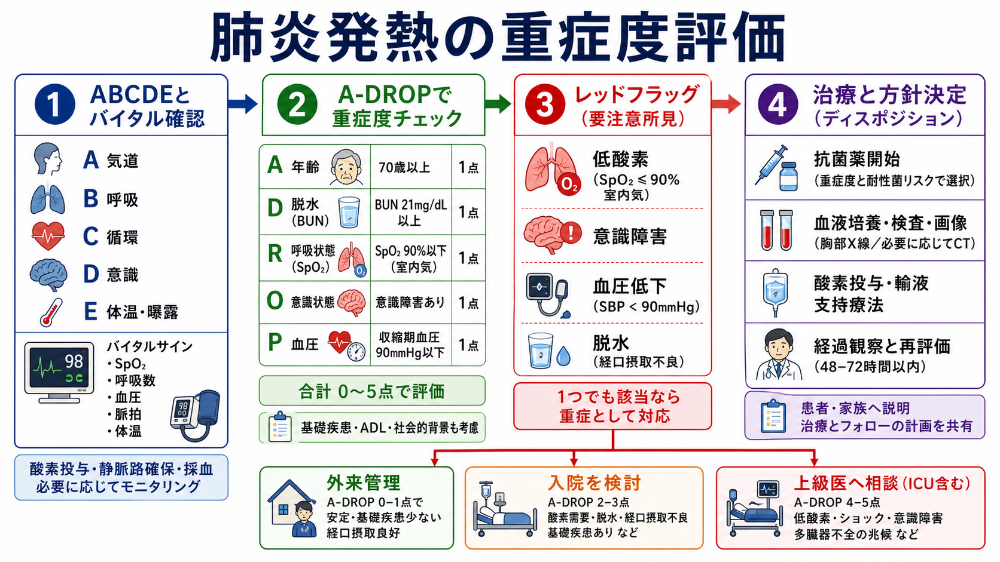
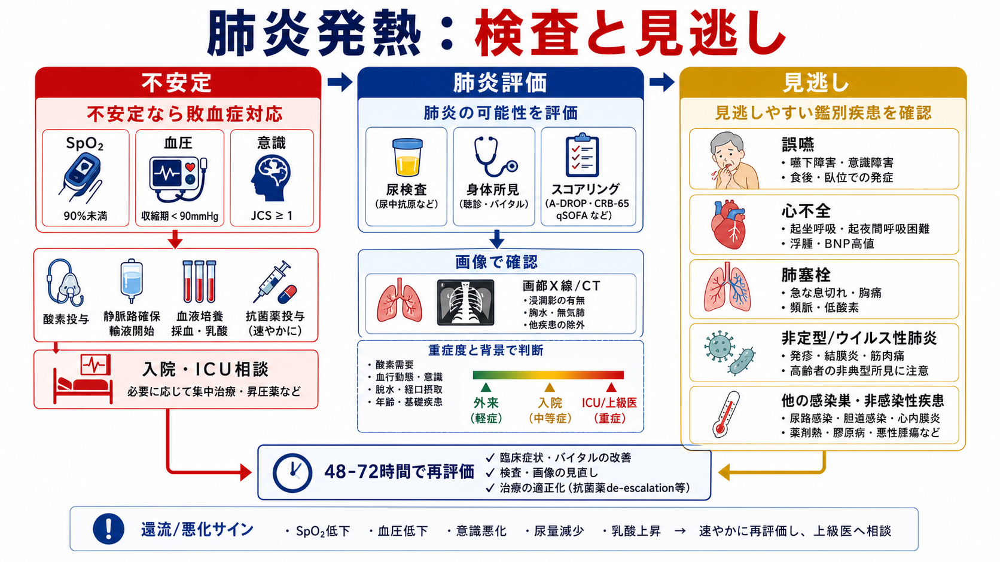
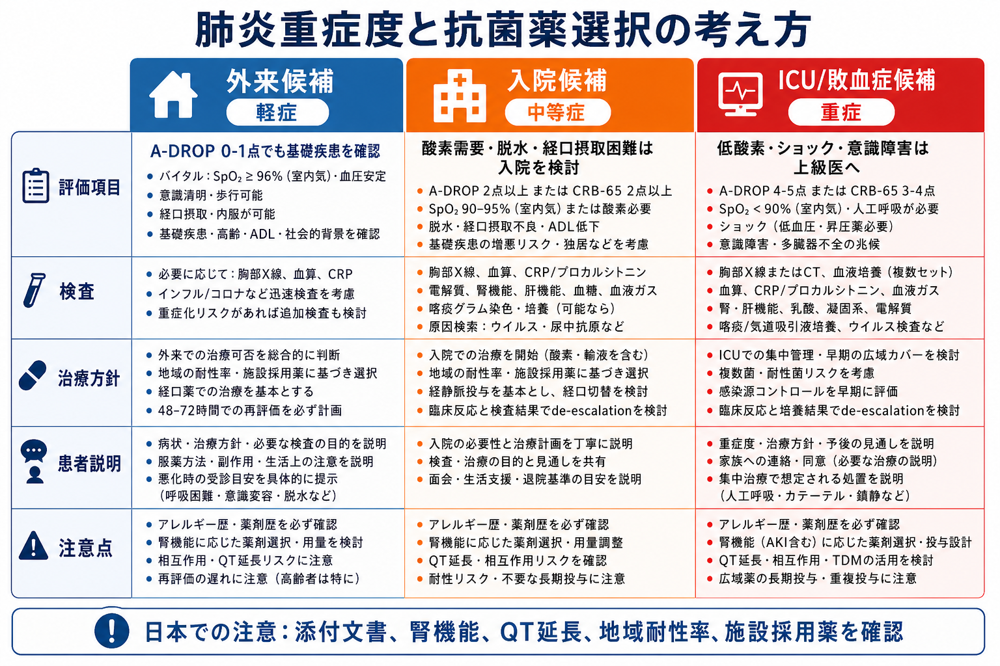

---
title: "肺炎による発熱で重症度をどう評価するか"
description: "肺炎による発熱では、呼吸状態・意識・血圧・脱水・年齢・基礎疾患を同時に見て、外来管理、入院、ICU相談、抗菌薬選択を考える。"
aliases:
  - "肺炎発熱の重症度評価"
tags:
  - 領域/救急・初期対応
  - 種類/クリニカルクエスチョン
  - 対象/研修医
question: "肺炎による発熱で重症度をどう評価するか"
clinical_area: "救急・初期対応"
audience: "研修医"
evidence_level: "guideline"
created: "2026-04-27"
updated: "2026-04-27"
enableToc: true
---

# 肺炎による発熱で重症度をどう評価するか

> このノートは研修医教育のための一般的整理であり、個別患者の診断・治療指示ではありません。緊急性が高い、判断に迷う、施設方針が関わる場合は上級医・専門科に相談してください。

## クリニカルクエスチョン

肺炎による発熱を疑う成人で、呼吸状態、意識、血圧、脱水、年齢、基礎疾患から、入院の要否と初期抗菌薬選択をどう考えるか。

## まず結論

- まずスコアではなく、ABCDE、SpO2、呼吸数、血圧、意識、尿量、末梢冷感を見て、低酸素・ショック・意識障害・敗血症疑いがあれば重症として扱い、酸素、静脈路、採血・培養、乳酸、画像、抗菌薬、入院・ICU相談を並行する [5][9]。
- 日本では成人肺炎の重症度評価として A-DROP が実用的で、年齢、脱水、呼吸不全、意識障害、収縮期血圧低下を確認する。0-1点でも、基礎疾患、ADL、経口摂取困難、社会的背景で入院が必要になることがある [1]。
- 海外では PSI、CURB-65、CRB65 がよく使われる。ATS/IDSA は入院要否に PSI を重視しつつ臨床判断を併用し、NICE は CRB65/CURB65 と臨床判断で療養場所を決める [6][8]。
- 抗菌薬は「肺炎らしさ」だけでなく、重症度、誤嚥、医療・介護関連、耐性菌リスク、腎機能、アレルギー、QT延長、施設採用薬で選ぶ。培養結果と経過で狭域化・内服切替を検討する [1][2][3][9]。
- 日本での注意: 国内ガイドライン、施設アンチバイオグラム、PMDA 添付文書、腎機能別用量、保険適用を確認する。海外推奨薬・投与量をそのまま日本の処方に置き換えない [2][3][4]。

## 判断の型

1. **不安定性を先に拾う**: SpO2低下、呼吸数増加、チアノーゼ、努力呼吸、収縮期血圧90 mmHg以下、意識障害、尿量低下、乳酸上昇、末梢冷感があれば、スコア計算を待たずに重症として上級医へ共有する [5][9]。
2. **A-DROPで肺炎としての重症度をそろえる**: Age、Dehydration、Respiration、Orientation、Pressure を各1点で確認する。呼吸不全、意識障害、血圧低下は点数以上に重く扱う [1]。
3. **入院理由を言語化する**: 酸素需要、脱水、経口摂取困難、独居、認知機能低下、重い併存症、免疫不全、誤嚥リスク、治療失敗リスクを確認し、「外来で安全に再評価できるか」を考える [6][8]。
4. **抗菌薬選択に必要なリスクを確認する**: 市中肺炎か、医療・介護関連肺炎か、院内肺炎か、緑膿菌・MRSA・ESBL などの耐性菌リスクがあるかを分ける [1][2]。
5. **48-72時間で再評価する計画を置く**: 解熱だけでなく、呼吸数、酸素需要、血圧、意識、食事・内服可否、画像・培養結果、合併症を見直す [6][9]。

## 初期対応

- **ABCDE**: 気道、呼吸仕事量、SpO2、酸素投与の必要性、循環、意識、体温を最初に確認する。
- **重症サイン**: SpO2 90%以下、呼吸数30/分以上、収縮期血圧90 mmHg未満、意識障害、乳酸上昇、乏尿、末梢冷感、急速な悪化は、敗血症・呼吸不全として扱う [5][8][9]。
- **酸素・静脈路・採血**: 低酸素や循環不全があれば、酸素投与、静脈路確保、血算、生化学、腎機能、電解質、肝胆道系、CRP、必要時プロカルシトニン、血液ガス、乳酸、血液培養を同時に進める [5][9]。
- **画像**: 胸部X線を基本に、診断が不明、重症、合併症、胸水、膿胸、肺塞栓、心不全、悪性腫瘍が問題になる場合は CT を検討する。2026年 ATS ガイドラインでは、専門性がある施設では肺エコーも選択肢とされる [7]。
- **感染対策**: インフルエンザ、COVID-19、結核、麻疹などを疑う所見や流行状況があれば、院内手順に従い隔離・検査を先行する。

## 鑑別・見逃し

| 優先度 | 疾患・状態 | 見逃さない理由 | 手がかり |
|---|---|---|---|
| 高 | 敗血症・敗血症性ショック | 抗菌薬、輸液、循環管理、ICU相談の遅れが予後に関わる | 低血圧、意識障害、乳酸上昇、乏尿、末梢冷感 [5][9] |
| 高 | 呼吸不全を伴う重症肺炎 | 酸素化悪化や人工呼吸管理が必要になりうる | SpO2低下、呼吸数増加、努力呼吸、広範な陰影 [1][6] |
| 高 | 誤嚥性肺炎 | 高齢者・嚥下障害では発熱や咳が目立たないことがある | 食後発症、湿性嗄声、意識障害、脳血管障害、ADL低下 [1] |
| 高 | 心不全 | 肺炎に似た発熱・呼吸困難、肺うっ血を示すことがある | 起坐呼吸、浮腫、BNP高値、心拡大、両側陰影 |
| 高 | 肺塞栓 | 発熱と低酸素で肺炎に見えることがある | 急な胸痛・息切れ、DVTリスク、頻脈、低酸素に比して陰影乏しい |
| 中 | ウイルス性肺炎・COVID-19・インフルエンザ | 抗菌薬だけでは改善せず、隔離や抗ウイルス薬判断が必要 | 流行、筋痛、咽頭痛、曝露歴、両側すりガラス影 [7] |
| 中 | 膿胸・肺膿瘍 | 抗菌薬単独で不十分なことがある | 胸水、空洞、持続発熱、炎症反応遷延 [9] |
| 中 | 薬剤熱・膠原病・悪性腫瘍 | 抗菌薬追加だけで迷走しやすい | 培養陰性、画像非典型、皮疹、関節痛、体重減少 |

## 検査

| 検査 | 目的 | 注意点 |
|---|---|---|
| SpO2、呼吸数、血圧、意識、尿量 | 重症度と入院要否の即時判断 | 低酸素・血圧低下・意識障害はスコアより優先する [5][9] |
| 血算、生化学、BUN/Cr、電解質、肝胆道系 | 脱水、腎機能、臓器障害、薬剤投与設計 | A-DROP の脱水評価と抗菌薬用量調整に関わる [1][4] |
| CRP、必要時プロカルシトニン | 炎症の基準値、経過評価補助 | 抗菌薬開始を単独で決める検査ではない [6][9] |
| 血液培養2セット | 重症例、入院例、敗血症疑いで原因菌検索 | 抗菌薬開始を大きく遅らせない範囲で採取する [9] |
| 喀痰グラム染色・培養 | 原因菌推定とde-escalation | 良質検体か確認する。重症例や耐性菌リスクで優先度が上がる [2][6] |
| 胸部X線、必要時CT | 肺炎確認、範囲、胸水、膿胸、鑑別 | 画像が軽くても低酸素やショックがあれば重症として扱う [6][8] |
| インフルエンザ、SARS-CoV-2、尿中抗原など | 流行・重症例・入院例で原因検索 | 陽性でも細菌混合感染や重症度評価を省略しない [7] |
| 血液ガス、乳酸 | 呼吸不全、代謝性アシドーシス、敗血症評価 | 乳酸は臨床文脈とあわせて解釈する [9] |

## 治療・マネジメント

- **外来候補**: A-DROP 0-1点程度で、SpO2が保たれ、血圧・意識が安定し、経口摂取と内服が可能で、短期間の再診・悪化時受診が可能な場合。基礎疾患や独居、ADL低下があれば外来候補から外れることがある [1][8]。
- **入院候補**: 酸素需要、A-DROP 2点以上、脱水、経口摂取困難、併存症悪化、誤嚥リスク、治療失敗リスク、社会的に安全な再評価が難しい場合 [1][6][8]。
- **ICU・上級医即相談**: ショック、人工呼吸を要する呼吸不全、意識障害、多臓器障害、急速な酸素需要増加、乳酸上昇、重症敗血症が疑われる場合 [5][6][9]。
- **抗菌薬選択の考え方**: 市中肺炎、医療・介護関連肺炎、院内肺炎を分け、重症度、耐性菌リスク、誤嚥、非定型菌、腎機能、アレルギー、QT延長、相互作用を確認する。JAID/JSC ガイドと施設採用薬を照合し、培養結果と臨床改善で狭域化を考える [1][2][3]。
- **日本での注意**: セフトリアキソン、レボフロキサシン、アモキシシリン・クラブラン酸などは日本の添付文書で効能・効果、用法・用量、禁忌、腎機能、重要な副作用を確認する。ニューキノロン系はQT延長、腱障害、中枢神経症状、耐性化の観点から安易な第一選択化を避ける [3][4]。
- **再評価**: 48-72時間で呼吸数、SpO2、酸素需要、血圧、意識、食事、尿量、炎症反応、画像、培養を見直す。悪化・不変なら、耐性菌、膿胸・肺膿瘍、肺塞栓、心不全、薬剤熱、非感染性疾患を再検討する [6][9]。

## 図解

## 指導医に確認するポイント

- A-DROP、PSI/CURB-65、バイタル、ADL、基礎疾患を合わせた入院判断が妥当か。
- 低酸素、ショック、意識障害、乳酸上昇があり、敗血症対応・ICU相談を要するか。
- 市中肺炎、医療・介護関連肺炎、院内肺炎、誤嚥性肺炎のどれとして扱うか。
- 初期抗菌薬は施設採用薬、地域耐性率、腎機能、アレルギー、QT延長、内服可否に合っているか。
- 血液培養、喀痰検査、尿中抗原、ウイルス検査、CT、胸水評価を追加する条件は何か。
- いつ、どの指標で、内服切替・狭域化・退院可否を再評価するか。

## 患者説明

- 「肺炎では熱だけでなく、酸素の値、呼吸の速さ、血圧、意識、脱水の程度を見て重症度を判断します。」
- 「酸素が必要、血圧が低い、意識がぼんやりする、水分や薬を飲めない場合は、入院で点滴や酸素を使いながら治療することがあります。」
- 「抗菌薬は原因菌を予想して始めますが、検査結果や経過で薬を変更したり、狭い薬に切り替えたりします。」
- 「帰宅する場合も、息苦しさ、意識の変化、水分が取れない、尿が少ない、熱や咳の悪化があれば早めに再受診してください。」

## ピットフォール

- A-DROP 0-1点だけで帰宅可能と判断する。独居、ADL低下、経口摂取困難、免疫不全、併存症悪化を見落とす。
- SpO2 90%以下、血圧低下、意識障害があるのに、胸部X線の陰影が軽いことを理由に重症扱いしない。
- 高齢者の誤嚥性肺炎で、発熱や咳が乏しいために肺炎を除外してしまう。
- 抗菌薬開始前の培養にこだわり、ショックや重症例で抗菌薬開始を遅らせる。
- 海外ガイドラインの薬剤・用量を、日本の添付文書、腎機能、施設採用薬、地域耐性率を確認せずに使う。
- 初期治療後の48-72時間再評価を計画せず、悪化時に耐性菌・膿胸・肺塞栓・心不全・非感染性疾患の再検討が遅れる。

## 関連ノート

- 現時点で、この保存先内に確認済みの関連ノートはありません。
- 関連ノート候補: 「敗血症を疑ったら最初に何をするか」「低酸素を見たとき酸素投与をどう選ぶか」「誤嚥性肺炎をどう評価するか」「抗菌薬をいつ狭域化するか」

## MOC更新候補

- [[MOC｜救急・初期対応]]
- MOC｜感染症・抗菌薬.md（本サイト外）
- MOC｜呼吸器.md（本サイト外）

## 参考文献

[1] 日本呼吸器学会成人肺炎診療ガイドライン2024作成委員会. 成人肺炎診療ガイドライン2024. 日本呼吸器学会; 2024. https://www.jrs.or.jp/publication/jrs_guidelines/20240319125656.html

[2] 日本感染症学会・日本化学療法学会. JAID/JSC感染症治療ガイド2023. 2023. https://www.kansensho.or.jp/modules/journal/index.php?content_id=11

[3] 厚生労働省. 抗微生物薬適正使用の手引き 第四版. 2026. https://www.mhlw.go.jp/stf/seisakunitsuite/bunya/0000120172.html

[4] 医薬品医療機器総合機構. 医療用医薬品情報検索: レボフロキサシン水和物、セフトリアキソンナトリウム水和物、アモキシシリン水和物・クラブラン酸カリウム添付文書. https://www.pmda.go.jp/PmdaSearch/iyakuSearch/

[5] 日本版敗血症診療ガイドライン2024特別委員会. 日本版敗血症診療ガイドライン2024 (J-SSCG2024). 日本集中治療医学会・日本救急医学会; 2024. https://www.jaam.jp/info/2024/info-20241118.html

[6] Metlay JP, Waterer GW, Long AC, et al. Diagnosis and Treatment of Adults with Community-acquired Pneumonia. An Official Clinical Practice Guideline of the ATS and IDSA. Am J Respir Crit Care Med. 2019;200(7):e45-e67. https://doi.org/10.1164/rccm.201908-1581ST

[7] Jones BE, Ramirez JA, Oren E, et al. Diagnosis and Management of Community-acquired Pneumonia. An Official American Thoracic Society Clinical Practice Guideline. Am J Respir Crit Care Med. 2026. https://doi.org/10.1164/rccm.202507-1692ST

[8] National Institute for Health and Care Excellence. Pneumonia: diagnosis and management. NICE guideline NG250. 2025. https://www.nice.org.uk/guidance/ng250

[9] Evans L, Rhodes A, Alhazzani W, et al. Surviving Sepsis Campaign: International Guidelines for Management of Sepsis and Septic Shock 2021. Intensive Care Med. 2021;47:1181-1247. https://doi.org/10.1007/s00134-021-06506-y

## 更新ログ

- 2026-04-27: 初版作成。
