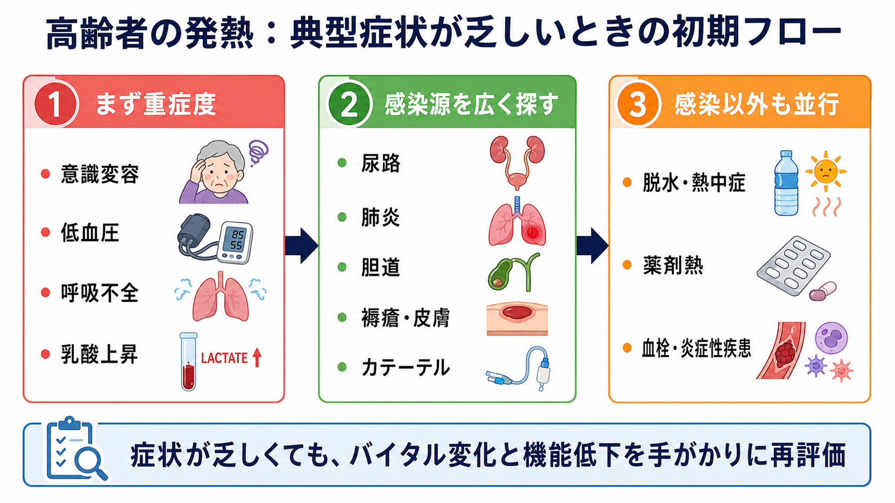
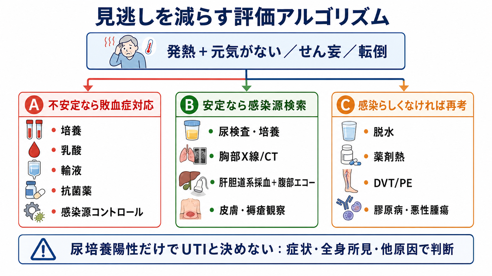
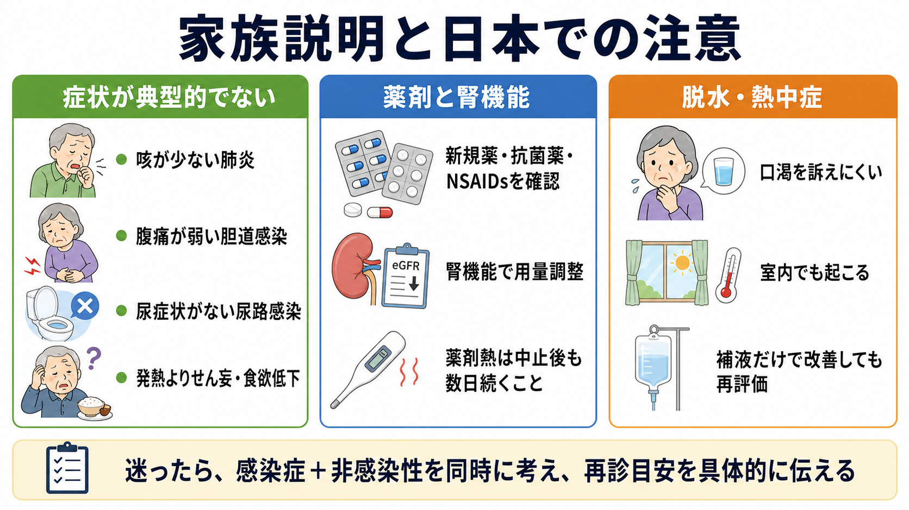

---
title: "高齢者の発熱で典型症状が乏しいとき何を考えるか"
description: "高齢者の発熱では典型症状が乏しくても、敗血症の重症度評価を先に行い、尿路感染、肺炎、胆道感染、褥瘡感染、脱水、薬剤熱を並行して評価する。"
aliases:
  - "高齢者の発熱"
tags:
  - 領域/救急・初期対応
  - 種類/クリニカルクエスチョン
  - 対象/研修医
question: "高齢者の発熱で典型症状が乏しいとき何を考えるか"
clinical_area: "救急・初期対応"
audience: "研修医"
evidence_level: "mixed"
created: "2026-04-27"
updated: "2026-04-27"
enableToc: true
---

# 高齢者の発熱で典型症状が乏しいとき何を考えるか

> このノートは研修医教育のための一般的整理であり、個別患者への診断・治療指示ではありません。緊急性が高い、判断に迷う、施設方針や薬剤選択が関わる場合は、上級医・専門科に相談してください。

## クリニカルクエスチョン

高齢者が発熱しているが、咳、尿路症状、腹痛などの典型症状が乏しいとき、どのように鑑別し、初期評価を進めるか。

## まず結論

- 高齢者の感染症は、発熱そのものが弱い、または発熱以外の「せん妄、食欲低下、転倒、ADL低下、頻呼吸」で始まることがある。平熱からの上昇や機能低下も感染の手がかりにする [1]。
- まず敗血症・ショック・呼吸不全を拾う。低血圧、SpO2低下、頻呼吸、意識変容、尿量低下、乳酸上昇があれば、感染源検索と並行して初期蘇生、培養採取、抗菌薬、感染源コントロールを考える [2,3]。
- 感染源は「尿路、肺炎、胆道、皮膚・褥瘡、カテーテル」を最初に広く見る。ただし尿培養陽性だけで尿路感染と決めず、局所症状、全身所見、他の感染源の有無で判断する [4,5]。
- 感染以外では、脱水・熱中症、薬剤熱、血栓塞栓症、炎症性疾患、悪性腫瘍を同時に考える。高齢者では口渇を訴えにくく、室内でも熱中症が起こる [9]。
- 日本では、抗菌薬選択は施設アンチバイオグラム、JAID/JSC感染症治療ガイド、添付文書、腎機能、保険適用に合わせる。海外推奨をそのまま薬剤名・用量に置き換えない [4]。

## 判断の型

1. **重症度を先に見る**: ABCDE、血圧、呼吸数、SpO2、意識、尿量、末梢冷感、乳酸、臓器障害を確認する。ショックや高い敗血症疑いでは、抗菌薬投与を不必要に遅らせない [2,3]。
2. **感染源を広く探す**: 尿路、肺炎、胆道、褥瘡・皮膚軟部組織、血管内デバイス、腹腔内、骨関節を「症状がないから除外」しない。
3. **非感染性を並行して考える**: 脱水・熱中症、薬剤熱、DVT/PE、偽痛風などの結晶誘発性関節炎、膠原病、悪性腫瘍を同時に走らせる。
4. **1回で決め打ちしない**: 初回評価で不明なら、バイタル、身体所見、検査、画像、培養結果、薬剤歴を時間で再評価する。感染が否定的になれば抗菌薬中止・狭域化も検討する [3]。

## 初期対応

- **第一印象**: いつもの本人からの変化を家族・施設職員に確認する。せん妄、食事摂取低下、歩けない、転倒、失禁、眠気は重要な症状として扱う [1]。
- **バイタルと身体診察**: 呼吸数を必ず数える。SpO2、血圧、心拍、体温、意識、皮膚冷感、脱水所見、腹部、CVA叩打痛、肺音、口腔、皮膚・褥瘡、カテーテル刺入部を確認する。
- **敗血症を疑う場合**: 血液培養を含む適切な培養を、抗菌薬開始を大きく遅らせない範囲で採取する。乳酸、血算、生化学、凝固、血液ガス、尿量を確認し、循環不全があれば輸液反応性を見ながら蘇生する [2,3]。
- **感染源コントロール**: 胆管炎、閉塞性腎盂腎炎、膿瘍、壊死性軟部組織感染、感染デバイスなどは抗菌薬だけで安定しないことがある。早期に画像と専門科相談を考える [3,7]。
- **日本での注意**: 抗菌薬の経験的選択は、JAID/JSC感染症治療ガイド2023、施設の耐性菌状況、腎機能、アレルギー歴、添付文書上の用法・用量を確認して決める [4,11]。

## 鑑別・見逃し

| 優先度 | 疾患・状態 | 症状が乏しい理由・落とし穴 | 手がかり |
|---|---|---|---|
| 高 | 尿路感染・腎盂腎炎 | 排尿時痛や頻尿が出ないことがある。尿培養陽性だけでは無症候性細菌尿と区別できない [5]。 | 発熱、悪寒、CVA叩打痛、尿閉、尿路閉塞、菌血症、炎症反応 |
| 高 | 肺炎・誤嚥性肺炎 | 咳・痰が少なく、食欲低下やせん妄だけのことがある。脱水で聴診所見が弱いこともある [6]。 | 頻呼吸、SpO2低下、嚥下障害、湿性嗄声、胸部画像 |
| 高 | 胆道感染 | 腹痛や黄疸が目立たないことがある。重症化すると敗血症化する [7]。 | ALP、γ-GTP、ビリルビン、右上腹部圧痛、胆石・ステント歴、腹部エコー/CT |
| 高 | 褥瘡・皮膚軟部組織感染 | 服を脱がないと見逃す。深部感染では表面所見が軽く見えることがある [8]。 | 発赤、熱感、疼痛、悪臭、排膿、壊死、ポケット、骨露出 |
| 中 | カテーテル関連感染 | 発赤が乏しくても菌血症の原因になる。 | CV、尿道カテーテル、胆道・腎瘻・胃瘻、交換時期 |
| 中 | 脱水・熱中症 | 口渇を訴えにくい。室内でも起こる [9]。 | 高Na、BUN/Cr上昇、粘膜乾燥、尿濃縮、暑熱環境、利尿薬 |
| 中 | 薬剤熱 | 感染治療中の発熱遷延として見える。抗菌薬、抗てんかん薬、NSAIDsなど開始薬を見直す [10]。 | 比較的元気、相対的徐脈、皮疹・好酸球増多、薬剤開始からの時間関係 |

## 検査

| 検査 | 目的 | 注意点 |
|---|---|---|
| 血算、CRP、腎機能、電解質、肝胆道系酵素、血糖 | 感染の程度、脱水、胆道系、薬剤選択の土台 | CRP単独で感染源を決めない。腎機能は抗菌薬・NSAIDs・造影の判断に必要。 |
| 乳酸、血液ガス、凝固、血小板 | 敗血症・臓器障害の評価 | 乳酸は敗血症の補助情報であり、脱水、けいれん、肝障害などでも上がる [3]。 |
| 血液培養2セット | 菌血症、抗菌薬適正化 | 抗菌薬前が原則だが、ショック例で投与を大きく遅らせない。 |
| 尿定性・沈渣・尿培養 | 尿路感染の支持、起因菌同定 | 膿尿・細菌尿は高齢者でよく見られる。局所症状や全身所見と合わせる [5]。 |
| 胸部X線、必要時CT | 肺炎、心不全、胸水、無気肺 | X線陰性でも肺炎を完全否定しない。脱水や早期肺炎では見えにくい。 |
| 腹部エコー/CT | 胆道感染、尿路閉塞、腹腔内感染 | 胆管炎や閉塞性腎盂腎炎は早期専門科相談につながる。 |
| 皮膚・褥瘡の観察、写真記録 | 褥瘡感染、壊死性軟部組織感染 | 仙骨部、踵、股間、デバイス周囲を実際に見る。 |

## 治療・マネジメント

- **不安定なら同時並行**: 培養、輸液、酸素、抗菌薬、感染源コントロール、上級医コールを順番待ちにしない。敗血症性ショックまたは高い敗血症疑いでは、認識後早期の抗菌薬が推奨される [2,3]。
- **安定例では決め打ちを避ける**: 可能な範囲で感染源を絞り、非感染性も評価する。感染可能性が低くショックがなければ、漫然と広域抗菌薬を開始せず、再評価を前提に観察する選択肢もある [3]。
- **尿路感染**: 発熱・全身症状があり他の感染源が乏しい、CVA叩打痛、尿路閉塞、菌血症などがあればUTIを考える。一方、せん妄や転倒のみで尿培養陽性、かつ発熱や循環不安定がなければ、他原因評価と経過観察が推奨される [5]。
- **肺炎**: 頻呼吸、低酸素、嚥下リスク、胸部画像で評価する。高齢者では誤嚥、医療・介護関連背景、耐性菌リスク、治療目標を含めて考える [6]。
- **胆道感染**: 発熱、肝胆道系酵素上昇、胆管拡張・胆石・ステントを見たら、抗菌薬だけでなく胆道ドレナージ適応を早めに相談する [7]。
- **褥瘡感染**: 表面の培養だけで判断せず、蜂窩織炎、膿瘍、壊死、骨髄炎、全身症状を評価する。除圧、創管理、必要時デブリードマンを含める [8]。
- **薬剤熱**: 新規薬、増量薬、抗菌薬、NSAIDs、抗てんかん薬、アロプリノールなどを時系列で見直す。疑わしい薬剤の中止は、原疾患治療への影響を上級医・薬剤師と確認して行う [4,10]。

## 図解

## 指導医に確認するポイント

- 敗血症として扱うべきか、現時点では安定例として迅速評価を完了してから抗菌薬を判断できるか。
- 尿路感染、肺炎、胆道感染、褥瘡感染のうち、最も疑う感染源と見逃すと危険な感染源は何か。
- 抗菌薬を開始する場合、施設の耐性菌状況、腎機能、アレルギー、投与量、投与期間、de-escalationの予定は妥当か。
- 胆道ドレナージ、尿路閉塞解除、褥瘡デブリードマン、デバイス抜去など、感染源コントロールを急ぐ所見があるか。
- 脱水・薬剤熱・DVT/PEなど、感染以外の診断をどの時点で再評価するか。

## 患者説明

- 「高齢の方では、肺炎でも咳が少ない、尿の感染でも尿の症状が目立たない、胆道感染でも腹痛が弱いことがあります。」
- 「発熱だけでなく、ぼんやりする、食べられない、歩けない、転ぶ、といった変化も大事なサインです。」
- 「尿検査で菌が出ても、それだけで尿路感染と決められないことがあります。他の感染や脱水、薬の影響も一緒に調べます。」
- 「抗菌薬が必要な場合は早く始めますが、原因が違うと分かったら薬を減らす・止めることも安全のために大切です。」
- 「帰宅・施設戻りのときは、息苦しさ、意識の悪化、水分が取れない、血圧低下、尿が少ない、再発熱があれば早めに再受診してください。」

## ピットフォール

- 尿培養陽性だけでUTIにして、肺炎、胆道感染、褥瘡感染、カテーテル感染を見落とす。
- 発熱が軽いから重症ではないと判断する。高齢者では発熱反応が弱いことがある [1]。
- 胸部X線1枚で肺炎を否定する。頻呼吸、低酸素、嚥下リスクがあれば再評価する。
- 胆道感染を「腹痛がない」だけで外す。肝胆道系酵素と画像を確認する。
- 褥瘡やデバイス刺入部を見ないまま「感染源不明」とする。
- 抗菌薬開始後の発熱遷延をすべて治療失敗とみなし、薬剤熱や非感染性疾患を見直さない。
- 海外ガイドラインの薬剤・用量を、日本の添付文書、腎機能、保険適用、採用薬を確認せずに使う。

## 関連ノート

- 関連ノート候補: 敗血症の初期対応、尿路感染症と無症候性細菌尿、誤嚥性肺炎、急性胆管炎、褥瘡感染、薬剤熱、熱中症・脱水
- 既存ノート未確認のため、未作成ノートへの内部リンクは追加していません。

## MOC更新候補

- [[MOC｜救急・初期対応]]
- MOC・感染症・抗菌薬.md（本サイト外）
- MOC・老年医学.md（本サイト外）

## 参考文献

[1] High KP, Bradley SF, Gravenstein S, et al. Clinical Practice Guideline for the Evaluation of Fever and Infection in Older Adult Residents of Long-Term Care Facilities: 2008 Update by the Infectious Diseases Society of America. *J Am Geriatr Soc*. 2009;57(3):375-394. https://doi.org/10.1111/j.1532-5415.2009.02175.x

[2] 志馬伸朗, 中田孝明, 矢田部智昭, ほか. 日本版敗血症診療ガイドライン2024. *日本集中治療医学会雑誌*. 2024. https://doi.org/10.3918/jsicm.2400001

[3] Evans L, Rhodes A, Alhazzani W, et al. Surviving Sepsis Campaign: International Guidelines for Management of Sepsis and Septic Shock 2021. *Intensive Care Med*. 2021;47:1181-1247. https://doi.org/10.1007/s00134-021-06506-y

[4] JAID/JSC感染症治療ガイド・ガイドライン作成委員会. JAID/JSC感染症治療ガイド2023. 日本感染症学会・日本化学療法学会. https://www.kansensho.or.jp/modules/journal/index.php?content_id=11 ; 独立行政法人医薬品医療機器総合機構. 医療用医薬品 添付文書等情報検索. https://www.pmda.go.jp/PmdaSearch/iyakuSearch/

[5] Nicolle LE, Gupta K, Bradley SF, et al. Clinical Practice Guideline for the Management of Asymptomatic Bacteriuria: 2019 Update by the Infectious Diseases Society of America. *Clin Infect Dis*. 2019;68(10):e83-e110. https://doi.org/10.1093/cid/ciy1121

[6] 日本呼吸器学会成人肺炎診療ガイドライン2024作成委員会. 成人肺炎診療ガイドライン2024. 日本呼吸器学会. https://www.jrs.or.jp/publication/jrs_guidelines/20240319125656.html

[7] Miura F, Okamoto K, Takada T, et al. Tokyo Guidelines 2018: Initial management of acute biliary infection and flowchart for acute cholangitis. *J Hepatobiliary Pancreat Sci*. 2018;25(1):31-40. https://doi.org/10.1002/jhbp.509

[8] 日本褥瘡学会. 褥瘡予防・管理ガイドライン第5版. 2022. https://www.jspu.org/medical/guideline/

[9] 厚生労働省. 熱中症を防ぎましょう. https://www.mhlw.go.jp/seisakunitsuite/bunya/kenkou_iryou/kenkou/nettyuu/nettyuu_taisaku/prevent.html

[10] Someko H, Kataoka Y, Obara T. Drug fever: a narrative review. *Ann Clin Epidemiol*. 2023;5(4):95-106. https://doi.org/10.37737/ace.23013

## 更新ログ

- 2026-04-27: 初版作成。国内外の主要ガイドライン、公的資料、薬剤安全性情報を確認し、imagegen由来のPNG図解3点を添付。
