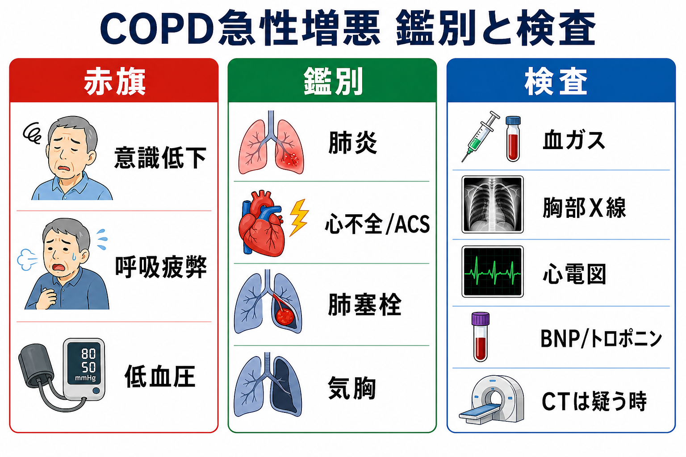
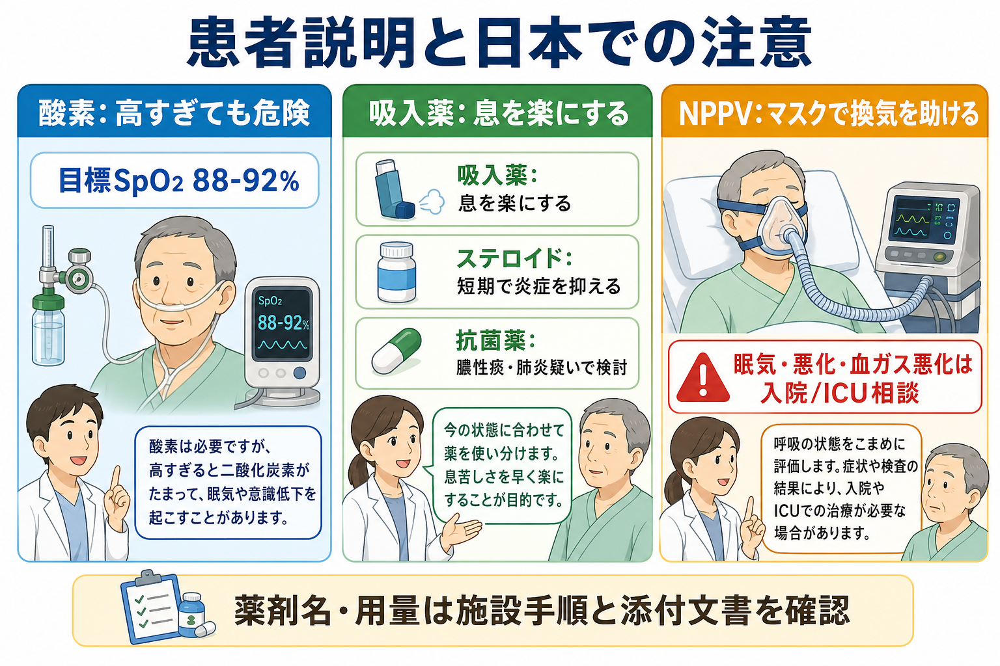

---
title: "COPD急性増悪で救急外来では何をするか"
description: "COPD急性増悪の救急外来初期対応として、酸素目標、気管支拡張薬、ステロイド、抗菌薬、NPPV適応を整理する。"
aliases:
  - "COPD急性増悪"
tags:
  - 領域/救急・初期対応
  - 領域/呼吸器
  - 種類/クリニカルクエスチョン
  - 対象/研修医
question: "COPD急性増悪で救急外来では何をするか"
clinical_area: "救急・初期対応"
audience: "研修医"
evidence_level: "guideline"
created: "2026-04-27"
updated: "2026-04-27"
enableToc: true
---

# COPD急性増悪で救急外来では何をするか

> このノートは研修医教育のための一般的整理であり、個別患者の診断・治療指示ではありません。緊急性が高い、判断に迷う、施設方針が関わる場合は上級医・専門科に相談してください。

## クリニカルクエスチョン

COPD急性増悪で救急外来では何をするか。特に、酸素目標、気管支拡張薬、ステロイド、抗菌薬、NPPV適応をどう整理するか。

## まず結論

- COPD急性増悪は「息切れ・咳・喀痰が急に悪化し、追加治療が必要になった状態」と捉え、同時に肺炎、心不全、ACS、肺塞栓、気胸を除外する[1,3]。
- 酸素は必要だが、CO2貯留リスクがあるため、原則としてSpO2 88-92%を目標に調整し、血ガスでpHとPaCO2を確認する[3-5]。
- 初期気管支拡張薬は短時間作用性β2刺激薬（SABA）を中心に、必要に応じて短時間作用性抗コリン薬（SAMA）を併用する[3,6]。
- 全身ステロイドは回復を早め、治療失敗や入院期間を減らすため、禁忌・感染評価を確認しつつ短期投与を検討する[3,6,8]。
- 抗菌薬は全例ではなく、膿性痰を含む症状増悪、肺炎疑い、または侵襲的/非侵襲的人工呼吸を要する場合に検討する[3,6]。
- pH<7.35かつPaCO2上昇が、初期治療後も持続・出現する急性高CO2性呼吸不全ではNPPVを早期に検討し、意識障害、嘔吐リスク、循環不安定、気道防御困難ではICU/挿管方針を上級医と確認する[2,5,7]。

## 判断の型

1. **本当にCOPD増悪だけかを疑う**: 発熱・胸痛・浮腫・片側呼吸音低下・突然発症・血圧低下があれば、肺炎、ACS/心不全、肺塞栓、気胸を同時に評価する[1,3]。
2. **酸素と換気を分けて評価する**: SpO2だけで安心せず、血ガスでpH、PaCO2、HCO3-を確認する。高CO2血症の既往、傾眠、頭痛、羽ばたき振戦があれば特に急ぐ[4,5]。
3. **薬物療法を並行して入れる**: 酸素を調整しながらSABA±SAMA、全身ステロイド、抗菌薬適応を同時に判断する[3,6]。
4. **NPPVを遅らせない**: 初期治療後もpH<7.35かつPaCO2上昇が残る場合、NPPV適応と禁忌、実施場所、挿管へのエスカレーションを確認する[2,5,7]。

## 初期対応

- ABCDEで、気道開通、呼吸数、努力呼吸、会話困難、意識、チアノーゼ、血圧、発汗、末梢冷感を確認する。
- 酸素投与前から重症低酸素なら酸素をためらわない。ただしCOPD既知またはCO2貯留リスクがある場合は、SpO2 88-92%を目標にベンチュリーマスク、鼻カニューレ、リザーバーマスクを調整する[3-5]。
- 採血、血液ガス、胸部X線、心電図を早めに行い、発熱・膿性痰・低血圧・胸痛・片側所見があれば追加検査を広げる。
- 呼吸疲弊、傾眠、pH低下、循環不安定、NPPV禁忌があれば、救急科・呼吸器内科・ICUへ早期相談する[2,5]。

## 鑑別・見逃し

| 優先度 | 疾患・状態 | 見逃さない理由 | 手がかり |
|---|---|---|---|
| 高 | 肺炎 | COPD増悪の誘因にも鑑別にもなる | 発熱、膿性痰、CRP/WBC上昇、浸潤影 |
| 高 | 心不全/ACS | 喘鳴や呼吸困難でCOPD増悪に見える | 胸痛、浮腫、起座呼吸、BNP高値、心電図変化 |
| 高 | 肺塞栓 | 突然の呼吸困難・低酸素の原因 | 突然発症、胸痛、DVT所見、Dダイマー/造影CT |
| 高 | 気胸 | COPDでは続発性気胸が重症化しやすい | 片側呼吸音低下、胸痛、皮下気腫、X線/エコー |
| 中 | 喘息・ACO | 治療反応や長期管理が変わる | 可逆性、アレルギー歴、好酸球、既往 |
| 中 | 薬剤・鎮静・誤嚥 | 換気低下や肺炎の原因になる | ベンゾジアゼピン、オピオイド、嚥下障害、食後発症 |

## 検査

| 検査 | 目的 | 注意点 |
|---|---|---|
| 動脈/静脈血ガス | pH、PaCO2、HCO3-、乳酸を見て換気不全と代償を評価 | NPPV判断ではpHとPaCO2の推移が重要[5] |
| 胸部X線 | 肺炎、気胸、心不全、無気肺を確認 | 重症例ではX線を待ってNPPVや挿管判断を遅らせない[5] |
| 心電図、トロポニン | ACS、不整脈、右心負荷を評価 | COPD増悪と心疾患は併存しやすい[1,3] |
| BNP/NT-proBNP、心エコー | 心不全らしさを評価 | 腎機能、年齢、慢性肺高血圧で解釈が揺れる |
| CBC、CRP、腎機能、電解質、血糖 | 感染、脱水、薬剤選択、安全性を評価 | ステロイドで血糖上昇、β刺激薬で低Kに注意 |
| 喀痰グラム染色/培養 | 重症、反復増悪、緑膿菌リスク、人工呼吸時の抗菌薬調整 | 抗菌薬開始を不必要に遅らせない |
| Dダイマー/造影CT | 肺塞栓を疑う時 | 腎機能、造影剤アレルギー、前確率を確認 |

## 治療・マネジメント

### 酸素

- 低酸素があれば酸素を投与する。ただしCOPD増悪ではCO2貯留を悪化させることがあり、SpO2 88-92%を目標に調整する[3-5]。
- SpO2が目標に入っても、傾眠、呼吸数増加、努力呼吸、pH低下、PaCO2上昇があれば換気補助を検討する[5]。
- 日本での注意: 酸素デバイス、ベンチュリーマスク、HFNC/NPPVの導入基準は施設差がある。救急外来のプロトコルと酸素火気厳禁の説明を確認する。

### 気管支拡張薬

- SABAを初期治療の中心にし、症状が強い場合や反応不十分な場合はSAMA併用を検討する[3,6]。
- ネブライザーかMDI+スペーサーかは、患者の吸気能力、感染対策、施設運用で選ぶ。
- 日本での注意: サルブタモール吸入液はPMDA添付文書で肺気腫、急・慢性気管支炎などの気道閉塞性障害にもとづく症状緩解に用いられる薬剤だが、投与量・希釈・反復間隔は添付文書と施設手順を確認する[9]。頻脈、振戦、低K、乳酸上昇に注意する。

### ステロイド

- 全身ステロイドはCOPD増悪の回復を早め、治療失敗を減らす。GOLDではプレドニゾロン相当40mg/日を5日間の短期投与として扱う[3,8]。
- 内服可能なら経口、内服困難・嘔吐・重症例では静注を検討するが、経口と静注の優劣よりも早期開始と副作用監視が重要である[6]。
- 日本での注意: プレドニゾロンやメチルプレドニゾロン製剤は添付文書上の効能・禁忌・重大な副作用を確認し、COPD急性増悪での具体的用量は国内ガイドライン、施設手順、上級医判断に合わせる[10]。糖尿病、活動性感染、消化管出血リスク、せん妄、骨粗鬆症に注意する。

### 抗菌薬

- 抗菌薬は「息切れ増悪、喀痰量増加、膿性痰」の3徴、または膿性痰を含む2徴、肺炎疑い、NPPV/挿管を要する重症例で検討する[3,6]。
- 薬剤は地域の耐性、最近の抗菌薬使用、緑膿菌リスク、腎機能、QT延長、アレルギーで選ぶ。
- 日本での注意: 国内では採用薬、保険適用、院内アンチバイオグラム、肺炎診療との兼ね合いが実務上重要である。市中肺炎や誤嚥性肺炎を疑う場合は、COPD増悪単独として狭く見すぎない。

### NPPV、HFNC、挿管相談

- 初期治療後もpH<7.35かつPaCO2上昇が持続・出現するAECOPDでは、NPPVを検討する[2,5,7]。
- NPPV中はSpO2 88-92%を目標にし、pH/PaCO2を再評価する。悪化時の挿管方針を開始前に共有する[5]。
- NPPVを避ける、またはICU/挿管を急ぐ状況は、気道防御不能、嘔吐・誤嚥リスク、顔面外傷、重度の意識障害、循環不安定、分泌物処理困難、NPPV不耐、呼吸停止切迫である[2,5,7]。
- 日本での注意: NPPVは機器、マスク、スタッフ熟練度、病床、DNI方針で安全性が変わる。単独判断で粘らず、救急科・呼吸器内科・ICUと早めに方針を合わせる。

## 図解

## 指導医に確認するポイント

- この呼吸困難はCOPD増悪単独として扱ってよいか、肺炎・心不全・ACS・肺塞栓・気胸の追加評価が必要か。
- 酸素目標はSpO2 88-92%でよいか、既知の在宅酸素、慢性CO2貯留、肺高血圧、心疾患をどう反映するか。
- ステロイドの薬剤、投与経路、期間を施設手順に合わせてどうするか。
- 抗菌薬を開始する根拠があるか、肺炎として扱うべきか、緑膿菌リスクや最近の培養結果があるか。
- NPPVの適応、禁忌、実施場所、再評価時刻、失敗時の挿管/DNI方針。

## 患者説明

- 「COPDの増悪では、気道が狭くなり、痰や炎症で息がしにくくなります。酸素、吸入薬、炎症を抑える薬を使いながら、肺炎や心臓の病気など別の原因が隠れていないかも調べます。」
- 「酸素は多ければ多いほどよいわけではなく、COPDでは酸素を高くしすぎると二酸化炭素がたまり、眠気や意識低下につながることがあります。そのため目標を決めて調整します。」
- 「血液ガスで換気が悪い場合は、マスクで呼吸を助けるNPPVを使うことがあります。状態が悪化する場合は、集中治療や人工呼吸器を含めて相談します。」

## ピットフォール

- SpO2だけを見て高濃度酸素を続け、CO2ナルコーシスを見逃す。
- COPD既往があるだけで肺炎、心不全、ACS、肺塞栓、気胸の評価を省く。
- 膿性痰がない軽症増悪にも抗菌薬を漫然と出す。
- NPPV適応なのに血ガス再検を遅らせる、または禁忌があるのにNPPVで粘る。
- ステロイド短期投与のつもりが、退院後に中止・期間・血糖管理の確認が抜ける。
- 日本の添付文書、院内採用薬、保険・施設運用を確認せず、海外資料の薬剤名・用量をそのまま使う。

## 関連ノート

- 関連ノート候補: `呼吸困難の初期対応.md`
- 関連ノート候補: `低酸素血症で救急外来では何をするか.md`
- 関連ノート候補: `NPPVの適応と禁忌をどう判断するか.md`
- 関連ノート候補: `市中肺炎で救急外来では何をするか.md`
- 関連ノート候補: `心不全急性増悪で救急外来では何をするか.md`

## MOC更新候補

- [[MOC｜救急・初期対応]]
- MOC｜呼吸器.md（本サイト外）

## 参考文献

[1] 日本呼吸器学会. COPD（慢性閉塞性肺疾患）診断と治療のためのガイドライン2022〔第6版〕. https://www.jrs.or.jp/publication/jrs_guidelines/20220512084311.html ; 厚生労働省 e-ヘルスネット. 慢性閉塞性肺疾患 / COPD. https://kennet.mhlw.go.jp/information/information/dictionary/tobacco/yt-046.html

[2] 日本呼吸器学会NPPVガイドライン作成委員会. NPPV（非侵襲的陽圧換気療法）ガイドライン（改訂第2版）. https://www.jrs.or.jp/publication/jrs_guidelines/20150210132448.html ; DOI: https://doi.org/10.11389/jjrs.04030262

[3] Global Initiative for Chronic Obstructive Lung Disease. Global Strategy for Prevention, Diagnosis and Management of COPD: 2026 Report. https://goldcopd.org/2026-gold-report-and-pocket-guide/

[4] O'Driscoll BR, Howard LS, Earis J, Mak V; British Thoracic Society Emergency Oxygen Guideline Group. BTS guideline for oxygen use in adults in healthcare and emergency settings. Thorax. 2017;72(Suppl 1):ii1-ii90. DOI: https://doi.org/10.1136/thoraxjnl-2016-209729

[5] Davidson AC, Banham S, Elliott M, et al. BTS/ICS guideline for the ventilatory management of acute hypercapnic respiratory failure in adults. Thorax. 2016;71(Suppl 2):ii1-ii35. DOI: https://doi.org/10.1136/thoraxjnl-2015-208209

[6] Wedzicha JA, Miravitlles M, Hurst JR, et al. Management of COPD exacerbations: a European Respiratory Society/American Thoracic Society guideline. Eur Respir J. 2017;49:1600791. DOI: https://doi.org/10.1183/13993003.00791-2016

[7] Rochwerg B, Brochard L, Elliott MW, et al. Official ERS/ATS clinical practice guidelines: noninvasive ventilation for acute respiratory failure. Eur Respir J. 2017;50:1602426. DOI: https://doi.org/10.1183/13993003.02426-2016

[8] Leuppi JD, Schuetz P, Bingisser R, et al. Short-term vs conventional glucocorticoid therapy in acute exacerbations of chronic obstructive pulmonary disease: the REDUCE randomized clinical trial. JAMA. 2013;309(21):2223-2231. DOI: https://doi.org/10.1001/jama.2013.5023

[9] PMDA. ベネトリン吸入液0.5%（サルブタモール硫酸塩）医療用医薬品情報. https://www.pmda.go.jp/PmdaSearch/rdSearch/02/2254700G2034?user=1

[10] PMDA. プレドニン錠5mg（プレドニゾロン）およびソル・メドロール静注用（メチルプレドニゾロンコハク酸エステルナトリウム）医療用医薬品情報. https://www.pmda.go.jp/PmdaSearch/rdSearch/02/2456001F1310?user=1 ; https://www.pmda.go.jp/PmdaSearch/rdSearch/02/2456400D1067?user=1

## 更新ログ

- 2026-04-27: 初版作成。
