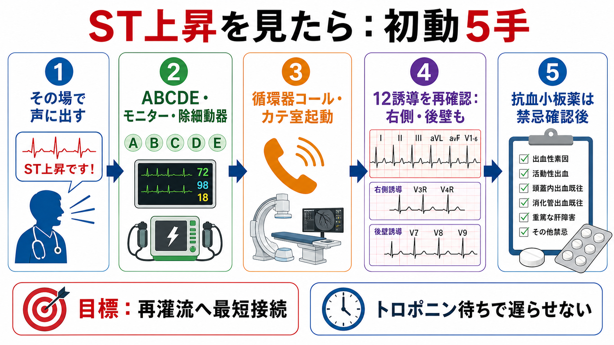
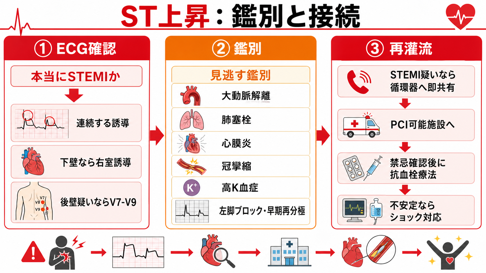
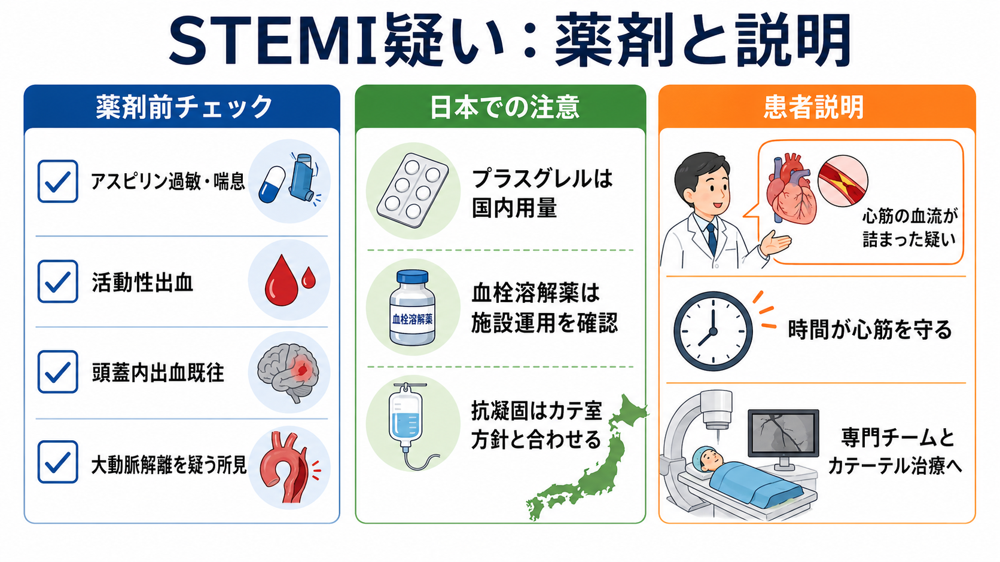

---
title: "ST上昇を見たら救急外来で何をするか"
description: "STEMI疑いでの初期対応、循環器コール、抗血小板薬、再灌流療法への接続を整理する。"
aliases:
  - "STEMI初期対応"
tags:
  - 領域/救急・初期対応
  - 種類/クリニカルクエスチョン
  - 対象/研修医
question: "ST上昇を見たら救急外来で何をするか"
clinical_area: "救急・初期対応"
audience: "研修医"
evidence_level: "guideline"
created: "2026-04-27"
updated: "2026-04-27"
enableToc: true
---

# ST上昇を見たら救急外来で何をするか

> このノートは研修医教育のための一般的整理であり、個別患者の診断・治療指示ではありません。緊急性が高い、判断に迷う、施設方針が関わる場合は上級医・専門科に相談してください。

## クリニカルクエスチョン

救急外来で12誘導心電図にST上昇を見たとき、STEMI疑いとして何を優先し、循環器コール、抗血小板薬、再灌流療法へどう接続するか。

## まず結論

- ST上昇を見たら、最初の仕事は「診断を完成させる」ことではなく、**STEMI疑いを声に出して共有し、再灌流へ接続する**ことである。トロポニン結果を待って循環器コールを遅らせない [1,5]。
- ABCDE、モニター、除細動器、静脈路、バイタル再評価を同時に進める。低血圧、肺水腫、徐脈・頻脈、意識障害があれば心原性ショックとして上級医・循環器・集中治療を早く呼ぶ [1,5]。
- 12誘導は「ST上昇があるか」だけでなく、連続する誘導、相反性変化、下壁梗塞での右室梗塞、後壁梗塞、左脚ブロック、早期再分極、心膜炎、高K血症、大動脈解離を確認する [1,5]。
- 抗血小板薬は早期に検討するが、アスピリン過敏・アスピリン喘息、活動性出血、頭蓋内出血既往、大動脈解離疑い、緊急手術可能性を短く確認し、施設プロトコルと循環器方針に合わせる [2,3,6,7]。
- 再灌流は原則としてprimary PCIへ最短接続する。PCI不能または大幅遅延が見込まれる場合の血栓溶解療法は、適応・禁忌・転送戦略・施設運用の確認が必要である [1,5,8]。
- 日本ではプラスグレルの承認用量が欧米の代表的用量と異なる。海外資料の用量をそのまま救急外来の指示に使わない [2,7]。

## 判断の型

1. **ST上昇を見た瞬間に共有する。** 「STEMI疑いです。循環器コールをお願いします」と声に出し、心電図を上級医・循環器へ見せる。
2. **患者の安定性を決める。** 血圧、意識、SpO2、呼吸仕事量、肺うっ血、末梢冷感、尿量、致死的不整脈を確認する。
3. **心電図を短く読み直す。** 連続する誘導のST上昇、相反性ST低下、異常Q波、T波、右室誘導、後壁誘導、前回心電図との比較を見る。
4. **見逃す鑑別を同時に下げる。** 特に大動脈解離、肺塞栓、心膜炎、冠攣縮、高K血症、左脚ブロック、早期再分極を確認する。
5. **再灌流の経路を決める。** 自施設で緊急PCI可能か、カテ室起動か、PCI可能施設へ転送か、血栓溶解を検討する状況かを循環器と共有する。
6. **抗血栓療法は禁忌確認後に接続する。** アスピリン、P2Y12阻害薬、抗凝固薬は施設手順、出血リスク、PCI方針に合わせる。

## 初期対応

- **応援要請**: 上級医、循環器、看護師、放射線/カテ室、必要時は集中治療・麻酔科を早期に呼ぶ。
- **ABCDE**: 気道、呼吸、循環、意識、体温を確認し、ショック・肺水腫・低酸素を同時に処置する。
- **モニター**: 心電図モニター、血圧反復測定、SpO2、除細動パッドを準備する。VF/VT、房室ブロック、徐脈性ショックに備える。
- **静脈路・採血**: 末梢静脈路、血算、生化学、腎機能、電解質、凝固、血糖、血液ガス、トロポニン、必要時の交差適合を進める。ただし採血結果を待って再灌流判断を止めない [1,5]。
- **12誘導心電図**: 初回を保存し、症状持続・再燃・初回判定が微妙な場合は反復する。下壁梗塞では右側胸部誘導、後壁梗塞疑いではV7-V9を追加する。
- **鎮痛・酸素**: 低酸素があれば酸素投与を行う。疼痛・不安は交感神経緊張を増やすが、血圧低下や呼吸抑制を避け、上級医と薬剤を相談する。
- **患者・家族への説明**: 詳細な病名説明より先に、「心筋の血流が詰まった疑いがあり、時間が重要なので専門チームへつなぐ」と短く共有する。

## 鑑別・見逃し

| 優先度 | 疾患・状態 | 見逃さない理由 | 手がかり |
|---|---|---|---|
| 高 | STEMI | 早期再灌流で心筋壊死と死亡リスクを減らす時間依存性疾患 | 持続胸痛、冷汗、嘔気、連続誘導のST上昇、相反性ST低下、壁運動異常 [1,5] |
| 高 | 大動脈解離 | 抗血栓療法や血栓溶解で致命的出血を起こしうる | 突然の裂ける痛み、背部痛、神経症状、血圧左右差、縦隔拡大、大動脈弁逆流 |
| 高 | 高K血症・電解質異常 | ST上昇様変化やwide QRSを示し、治療が全く異なる | 腎不全、透析、徐脈、テント状T波、QRS延長、採血K高値 |
| 高 | 心膜炎・心筋炎 | 広範ST上昇を来し、抗血栓療法のリスク評価が変わる | 体位で変わる胸痛、発熱、PR低下、びまん性ST上昇、心嚢液 |
| 中 | 冠攣縮 | 一過性ST上昇を来し、症状・ST変化が変動する | 安静時胸痛、喫煙、夜間早朝、硝酸薬反応、ST変化の消退 |
| 中 | 肺塞栓 | 胸痛・失神・右心負荷でACSに見えることがある | 呼吸困難、低酸素、頻脈、DVTリスク、右室負荷、S1Q3T3 |
| 中 | 早期再分極・左室肥大・左脚ブロック | 不要なカテ室起動または真のSTEMI見逃しにつながる | 若年、前回心電図同様、症状乏しい、Sgarbossa/modified Sgarbossaを検討 |

## 検査

| 検査 | 目的 | 注意点 |
|---|---|---|
| 12誘導心電図・反復心電図 | STEMIまたはSTEMI equivalentを拾う | 右室・後壁誘導、前回心電図比較を忘れない [1,5] |
| 心筋トロポニン | 心筋傷害の確認、経時変化の評価 | 発症早期は陰性があり、STEMI疑いでは結果待ちでPCI接続を遅らせない [5] |
| 血算・凝固・腎機能・電解質 | 出血リスク、抗凝固薬、造影剤、K異常の評価 | 採血は重要だが、再灌流判断の停止理由にしない |
| 血液ガス・乳酸 | 低酸素、アシドーシス、ショック評価 | 心原性ショックでは乳酸・末梢循環の再評価を続ける |
| 胸部X線 | 肺水腫、縦隔拡大、気胸など | 解離疑いがあれば画像戦略を上級医・循環器と相談 |
| ベッドサイド心エコー | 壁運動異常、右室梗塞、機械的合併症、心嚢液、右心負荷 | エコーでPCI接続を遅らせない。矛盾所見があれば鑑別を更新する |

## 治療・マネジメント

### STEMI疑いとして再灌流へ接続する

- STEMI疑いでは、心電図と臨床像をもとに緊急再灌流の経路を決める。JCS、ESC、ACC/AHAはいずれも、STEMIを時間依存性疾患として扱い、再灌流療法への迅速な接続を重視している [1,5,6]。
- PCI可能施設では、循環器コール、カテ室起動、同意、造影剤・腎機能・出血リスク確認を並行する。
- PCI非対応施設では、循環器と相談してPCI可能施設への搬送を早期に決める。搬送で再灌流が大幅に遅れる状況では血栓溶解療法を検討することがあるが、禁忌確認と搬送後PCI戦略が必要である [5,8]。
- ショック、肺水腫、持続性VT/VF、高度房室ブロック、機械的合併症疑いでは、再灌流だけでなく集中治療、補助循環、気道・循環管理の相談を同時に行う。

### 抗血小板薬・抗凝固薬は「早く、ただし禁忌確認後」

- アスピリンはACS初期治療の基本薬であり、発現を急ぐ場合は咀嚼または粉砕などを考慮する記載が国内添付文書にもある [3]。
- P2Y12阻害薬はPCI戦略と合わせて選ぶ。国内ではプラスグレル、クロピドグレル、チカグレロルなどの採用・適応・禁忌・出血リスクを施設手順で確認する [2,7]。
- 抗凝固薬はカテ室方針、腎機能、出血リスク、既服薬に左右される。救急外来で単独判断せず、循環器と投与薬・タイミングを合わせる。
- 大動脈解離を疑う所見、活動性出血、重度高血圧、頭蓋内出血既往、最近の手術・外傷、抗凝固薬内服などは、抗血栓療法や血栓溶解療法の前に必ず共有する [3,8]。

### 日本での注意

- **プラスグレル**: 日本の添付文書では、PCIが適用される虚血性心疾患に対する通常用量は初回負荷20mg、その後3.75mg/日で、アスピリン併用下で使う。欧米でよく見る60mg負荷、10mg維持をそのまま日本の初期指示に使わない [2,7]。
- **アスピリン**: 国内添付文書では、消化性潰瘍、出血傾向、アスピリン喘息または既往などが禁忌として整理されている。2026年1月13日の厚生労働省改訂指示では、アスピリン等に「アレルギー反応に伴う急性冠症候群」の注意が追加されている [3,4]。
- **血栓溶解療法**: 国内のアルテプラーゼ添付文書では、急性心筋梗塞における冠動脈血栓溶解は発症後6時間以内などの条件があり、冠動脈造影で血栓確認後が望ましいが困難な場合の条件も記載されている。救急外来単独で始めず、施設運用と専門科判断を優先する [8]。
- **制度・運用**: カテ室起動基準、転送ルート、休日夜間のPCI可否、救急隊からの事前心電図送信、抗血栓薬の院内セットは施設差が大きい。研修医は「誰へ、何分以内に、どの心電図を共有するか」を事前に確認しておく。

## 図解

## 指導医に確認するポイント

- この心電図はSTEMIまたはSTEMI equivalentとしてカテ室起動するか。
- 右側胸部誘導、後壁誘導、前回心電図比較、反復心電図が必要か。
- 大動脈解離、肺塞栓、心膜炎、高K血症、左脚ブロックなどをどこまで同時に評価するか。
- 自施設でprimary PCIへ進むか、PCI可能施設へ転送するか。搬送時の医師同乗、薬剤、モニター、除細動器をどうするか。
- アスピリン、P2Y12阻害薬、ヘパリンなどを、どの薬剤・用量・タイミングで投与するか。
- ショック、肺水腫、徐脈、高度房室ブロック、VT/VFがある場合の補助循環、挿管、昇圧薬、一時ペーシングをどう準備するか。

## 患者説明

- 「心電図で、心臓の筋肉へ行く血流が詰まっている可能性を示す変化があります。」
- 「心筋は時間がたつほど傷みやすいため、専門チームにすぐ連絡し、カテーテル治療が必要かを急いで判断します。」
- 「血を固まりにくくする薬を使うことがありますが、出血やアレルギー、大動脈の病気が隠れていないかを確認しながら進めます。」
- 「今は検査結果を全部待つ段階ではなく、危険な病気として扱いながら、同時に別の重い病気がないかも確認します。」

## ピットフォール

- トロポニン結果を待って循環器コールが遅れる。
- 「ST上昇あり」だけで安心し、大動脈解離や高K血症など抗血栓療法で悪化しうる疾患を確認しない。
- 下壁梗塞で右室梗塞を見落とし、硝酸薬や過度の前負荷低下で低血圧を悪化させる。
- 後壁梗塞をST低下として扱い、V7-V9を追加しない。
- 心電図の写真だけを送り、患者のバイタル、発症時刻、症状持続、ショック所見、既服薬、出血リスクを共有しない。
- 海外ガイドラインの薬剤量を、日本の添付文書、採用薬、施設プロトコルを確認せず使う。
- PCI非対応施設で「搬送か血栓溶解か」の判断を後回しにする。

## 関連ノート

- [[救急外来で初期検査セットはどのように選ぶか]]
- [[救急患者で上級医を呼ぶタイミングはどう判断するか]]
- [[心原性ショックを疑う低血圧患者で何を確認するか]]
- [[頻脈と低血圧がある患者で不整脈治療を急ぐべきか]]
- 関連ノート候補: 胸痛患者で最初に見逃してはいけない疾患は何か
- 関連ノート候補: 大動脈解離を疑う胸背部痛で何を確認するか
- 関連ノート候補: PCI非対応施設でSTEMI疑いを見たらどう転送するか

## MOC更新候補

- [[MOC｜救急・初期対応]]
- MOC｜心電図・循環器.md（本サイト外）
- MOC｜薬剤・処方・副作用.md（本サイト外）

## 参考文献

[1] Kimura K, Kimura T, Ishihara M, et al. JCS 2018 Guideline on Diagnosis and Treatment of Acute Coronary Syndrome. Circulation Journal. 2019;83(5):1085-1196. https://doi.org/10.1253/circj.CJ-19-0133

[2] Nakamura M, Kimura K, Kimura T, et al. JCS 2020 Guideline Focused Update on Antithrombotic Therapy in Patients With Coronary Artery Disease. Circulation Journal. 2020;84(5):831-865. https://doi.org/10.1253/circj.CJ-19-1109

[3] PMDA. バイアスピリン錠100mg 医療用医薬品情報・添付文書情報. 2026. https://www.pmda.go.jp/PmdaSearch/rdSearch/02/3399007H1021?user=1

[4] 厚生労働省. 「使用上の注意」の改訂について（医薬安発0113第4号）. 2026-01-13. https://www.mhlw.go.jp/hourei/doc/tsuchi/T260113I0010.pdf

[5] Byrne RA, Rossello X, Coughlan JJ, et al. 2023 ESC Guidelines for the management of acute coronary syndromes. European Heart Journal. 2023;44(38):3720-3826. https://doi.org/10.1093/eurheartj/ehad191

[6] Rao SV, O'Donoghue ML, Ruel M, et al. 2025 ACC/AHA/ACEP/NAEMSP/SCAI Guideline for the Management of Patients With Acute Coronary Syndromes. Journal of the American College of Cardiology. 2025;85(22):2135-2237. https://doi.org/10.1016/j.jacc.2024.11.009

[7] PMDA. エフィエント錠2.5mg／3.75mg／5mg／OD錠20mg 医療用医薬品情報・添付文書情報. 2026. https://www.pmda.go.jp/PmdaSearch/rdSearch/02/3399009F5025?user=1

[8] PMDA. グルトパ注600万／1200万／2400万 医療用医薬品情報・添付文書情報. 2024. https://www.pmda.go.jp/PmdaSearch/rdSearch/02/3959402D1035?user=1

## 更新ログ

- 2026-04-27: 初版作成。
