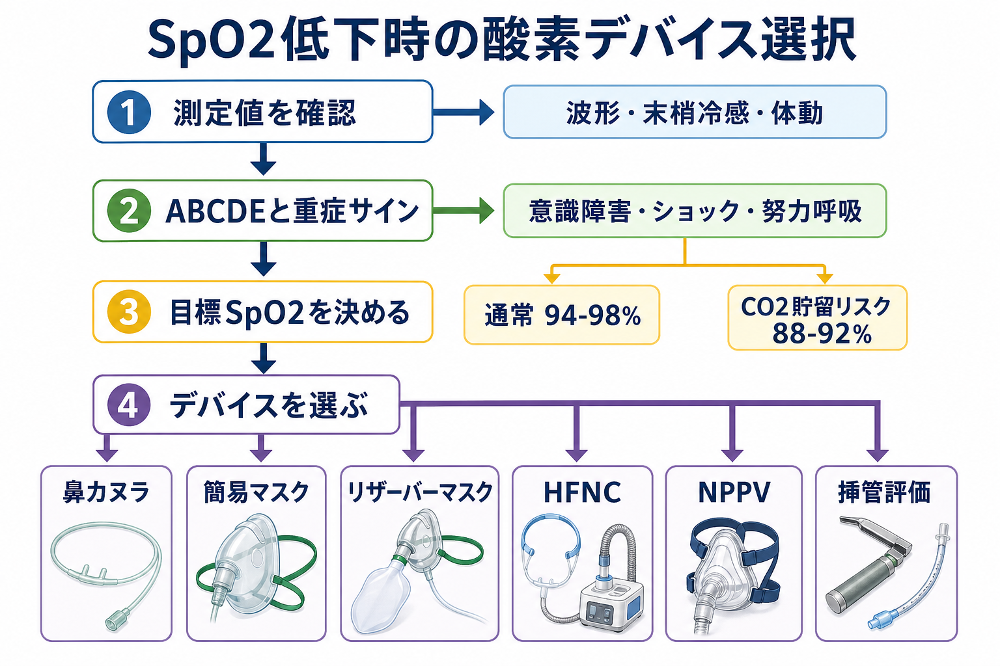
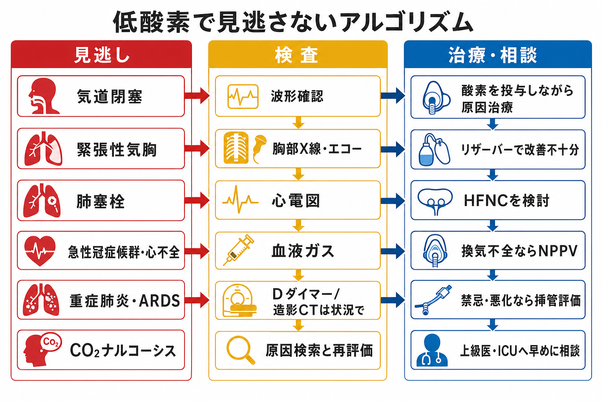
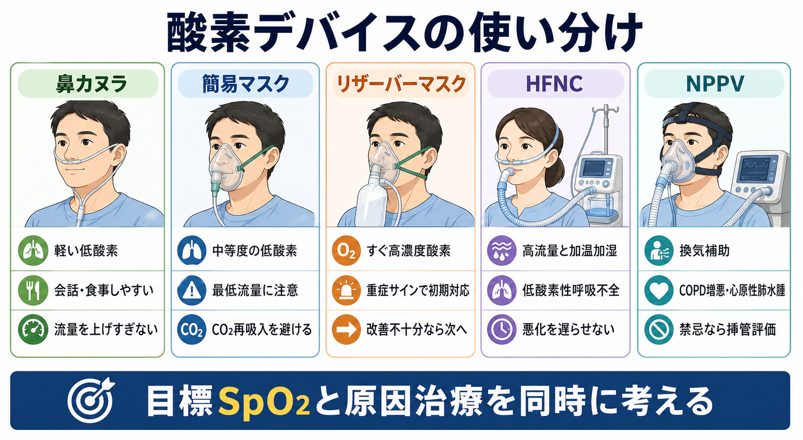

---
title: "SpO2低下を見たとき酸素投与をどう選ぶか"
description: "鼻カヌラ、マスク、リザーバーマスク、HFNC、NPPVをSpO2低下時の初期対応として選び分ける。"
aliases:
  - "酸素投与の選び方"
tags:
  - 領域/救急・初期対応
  - 種類/クリニカルクエスチョン
  - 対象/研修医
question: "SpO2低下を見たとき酸素投与をどう選ぶか"
clinical_area: "救急・初期対応"
audience: "研修医"
evidence_level: "mixed"
created: "2026-04-27"
updated: "2026-04-27"
enableToc: true
---

# SpO2低下を見たとき酸素投与をどう選ぶか

> このノートは研修医教育のための一般的整理であり、個別患者の診断・治療指示ではありません。緊急性が高い、判断に迷う、施設方針が関わる場合は上級医・専門科に相談してください。

## クリニカルクエスチョン

SpO2低下を見たとき、鼻カヌラ、簡易マスク、リザーバーマスク、HFNC、NPPVをどの順番で考え、いつ上級医・ICU・挿管評価へ進めるか。

## まず結論

- SpO2低下を見たら、最初に「測定が本当に正しいか」「患者が危ないか」「目標SpO2はいくつか」を同時に確認する。SpO2の数字だけでデバイスを選ばない。
- 明らかな重症サインがある場合は、原因検索を待たずに高濃度酸素を開始し、上級医・救急・ICUへ早めに相談する。[1][5]
- 目標SpO2は、CO2貯留リスクが低ければ94-98%を目安にし、COPD増悪、肥満低換気、神経筋疾患、胸郭変形などCO2貯留リスクがある患者では88-92%を目安に慎重に調整する。[5]
- 軽い低酸素なら鼻カヌラ、中等度なら簡易マスク、重症または急速な悪化ならリザーバーマスクで初期対応する。改善が乏しければHFNC、換気不全が主ならNPPV、禁忌や悪化があれば挿管評価へ進む。[1][2][6][7]
- 酸素投与は「低酸素を補正する支持療法」であり、肺炎、心不全、気胸、肺塞栓、気道閉塞、換気不全などの原因治療を同時に進める。[1][5]
- 日本では医療用酸素は医薬品として扱われ、添付文書上も医師の指示で使用し、高濃度酸素の長時間投与や火気に注意する。[3][4]

## 判断の型

1. 測定値を確認する  
   SpO2波形、脈拍との一致、末梢冷感、体動、マニキュア、低灌流を確認する。波形が悪いときはプローブ部位を替え、患者の見た目と一致するかを確認する。
2. ABCDEで危険サインを拾う  
   気道閉塞、会話困難、努力呼吸、チアノーゼ、意識障害、ショック、片側呼吸音低下、喘鳴、湿性ラ音を確認する。危険サインがあれば、酸素投与と同時に応援要請を行う。[1][5]
3. 目標SpO2を決める  
   多くの急性期患者では94-98%を目安にする。CO2貯留リスクがある患者では、酸素過多による高二酸化炭素血症を避けるため88-92%を目安にし、血液ガスで確認する。[5]
4. デバイスを選び、5-10分ごとに再評価する  
   鼻カヌラで足りなければ簡易マスク、急ぐならリザーバーマスクへ上げる。高濃度酸素でも改善不十分、呼吸仕事量が高い、または酸素化の維持に高FiO2を要する場合はHFNCを検討する。[7]
5. 「酸素化不全」か「換気不全」かを分ける  
   SpO2だけではCO2貯留を見逃す。眠気、頭痛、羽ばたき振戦、呼吸性アシドーシス、PaCO2上昇があれば換気補助としてNPPVや挿管を考える。[2][6]

## 初期対応

- 人を呼ぶ: SpO2低下が急、酸素投与で改善しない、意識障害・ショック・努力呼吸がある場合は、早めに上級医・救急・ICUへ連絡する。
- 体位: 禁忌がなければ座位または半座位にする。嘔吐リスク、意識障害、気道保護不能があれば気道管理を優先する。
- 酸素: 重症サインがあればリザーバーマスクで高濃度酸素を開始し、原因検索と同時に次の呼吸補助を準備する。[1][5]
- モニタ: SpO2、心電図、血圧、呼吸数、意識、尿量、体温を追う。SpO2だけで安定と判断しない。
- 血液ガス: CO2貯留リスク、意識障害、呼吸疲労、酸素投与後も改善不十分な場合は、動脈血または静脈血ガスでpH、PaCO2、乳酸を確認する。

## 鑑別・見逃し

| 優先度 | 疾患・状態 | 見逃さない理由 | 手がかり |
|---|---|---|---|
| 高 | 気道閉塞・アナフィラキシー | 酸素だけでは解決せず、気道確保や原因治療が必要 | 吸気性喘鳴、嗄声、顔面・舌浮腫、蕁麻疹、急な血圧低下 |
| 高 | 緊張性気胸 | 画像を待たず処置が必要になることがある | 急な呼吸困難、片側呼吸音低下、頸静脈怒張、ショック |
| 高 | 肺塞栓 | SpO2低下が胸部X線所見に比べて強いことがある | 突然の呼吸困難、胸痛、頻脈、DVTリスク、失神 |
| 高 | 急性冠症候群・心原性肺水腫 | 酸素化不良の背景に循環不全がある | 胸痛、冷汗、湿性ラ音、下腿浮腫、心電図変化 |
| 高 | 重症肺炎・ARDS | 急速に酸素需要が増え、HFNC/NPPV/挿管判断が必要 | 発熱、浸潤影、頻呼吸、リザーバーでも不十分 |
| 高 | CO2ナルコーシス | SpO2だけ改善しても換気不全が悪化しうる | COPD、肥満低換気、眠気、頭痛、PaCO2上昇、呼吸性アシドーシス |
| 中 | 貧血・循環不全・末梢循環不良 | SpO2だけでは酸素運搬量や灌流を評価できない | 蒼白、冷汗、低血圧、乳酸上昇、Hb低値 |

## 検査

| 検査 | 目的 | 注意点 |
|---|---|---|
| SpO2波形とプローブ再確認 | 偽低値を除外する | 数字だけで急いで過剰投与しないが、患者が危なければ酸素投与を優先する |
| 血液ガス | 低酸素、CO2貯留、pH、乳酸を評価する | CO2貯留リスク、意識障害、NPPV検討時は特に重要 |
| 胸部X線 | 肺炎、肺水腫、気胸、無気肺を確認する | 緊張性気胸などでは画像を待たず対応する |
| 心電図・心筋マーカー | ACS、不整脈、右心負荷を拾う | 低酸素の原因が循環器疾患のことがある |
| ベッドサイドエコー | 肺水腫、胸水、気胸、心機能、右心負荷を素早く見る | 検者依存性があるため、画像検査や上級医判断と合わせる |
| Dダイマー・造影CT | 肺塞栓などを評価する | 検査前確率、腎機能、造影禁忌、搬送リスクを考える |

## 治療・マネジメント

- 鼻カヌラ: 軽い低酸素、会話や食事を保ちたい患者で使いやすい。一般に1-5 L/分程度から調整する。口呼吸や高い吸気流量では実際のFiO2が安定しにくい。
- 簡易マスク: 鼻カヌラで不足する中等度の低酸素で使う。CO2再吸入を避けるため、施設の手順に従って最低流量を下回らないようにする。
- リザーバーマスク: 重症サイン、急速なSpO2低下、初期評価中に高濃度酸素が必要な場合に使う。バッグが十分ふくらむ流量にし、改善が乏しければHFNC、NPPV、挿管評価へ遅れず進む。[1][5]
- HFNC: 高流量、加温加湿、設定FiO2により、低酸素性急性呼吸不全で従来酸素より有用な場面がある。ERSは低酸素性急性呼吸不全で従来酸素よりHFNCを条件付きで推奨している。[7]
- NPPV: 換気補助が必要なときに考える。COPD増悪による呼吸性アシドーシス、心原性肺水腫などは代表的な適応で、ERS/ATSと日本呼吸器学会ガイドラインでも重要な対象である。[2][6]
- NPPVを避ける・挿管評価を急ぐ状況: 気道保護不能、嘔吐・誤嚥リスク、意識障害、循環不安定、顔面外傷、分泌物が多い、NPPV開始後も悪化する場合は、上級医と挿管を含めて相談する。[2][6]
- 酸素を上げるだけで終わらない: 抗菌薬、利尿薬、気管支拡張薬、抗凝固、胸腔ドレナージ、気道確保など、原因別の治療を同時に進める。
- 日本での注意: 医療用酸素は「酸素欠乏による諸症状の改善」を効能・効果とする吸入ガス剤で、用法・用量は医師の指示による。高濃度酸素の長時間投与では酸素中毒に注意し、ラベル確認、火気厳禁、施設の医療ガス安全手順を守る。[3][4]

## 図解

## 指導医に確認するポイント

- この患者の目標SpO2は94-98%でよいか、CO2貯留リスクを考えて88-92%にするべきか。
- リザーバーマスクで改善が乏しいとき、HFNC、NPPV、挿管評価のどれを優先するか。
- NPPVの禁忌や中止基準に該当しないか。
- 低酸素の原因として、気胸、肺塞栓、心不全、ACS、重症肺炎、気道閉塞をどこまで除外できているか。
- 施設内でHFNC/NPPVを開始できる場所、モニタリング体制、ICU相談基準はどうなっているか。

## 患者説明

- 「血液中の酸素が不足しているため、まず酸素を補いながら原因を調べます。」
- 「酸素の量や器具は、酸素の値、呼吸の苦しさ、二酸化炭素がたまりやすい体質があるかで調整します。」
- 「酸素で値が改善しても、肺炎、心不全、気胸、血栓など原因の治療が必要なことがあります。」
- 「酸素は火が燃え広がりやすくなるため、酸素使用中は火気や喫煙を避ける必要があります。」[4]

## ピットフォール

- SpO2だけ見て、呼吸数、努力呼吸、意識、血圧を見ない。
- COPDなどCO2貯留リスクのある患者に、目標を決めず高濃度酸素を続ける。
- リザーバーマスクで一時的にSpO2が上がったため、原因検索やICU相談が遅れる。
- NPPVの禁忌を確認せず開始し、誤嚥や挿管遅れにつながる。
- HFNCやNPPVを「挿管を避けるための最終手段」と考え、悪化時の撤退基準を決めない。
- 簡易マスクの低流量でCO2再吸入を起こす。
- 酸素ボンベ、配管、火気、移送中の残量確認を軽視する。

## 関連ノート

- 既存ノート未確認: 呼吸困難の初期対応、血液ガスの読み方、急性心不全、肺塞栓、気胸、COPD増悪、NPPV、HFNCに関するノートがあれば関連付け候補。

## MOC更新候補

- [[MOC｜救急・初期対応]]
- MOC｜呼吸器.md（本サイト外）

## 参考文献

[1] 日本呼吸器学会. 酸素療法マニュアル. https://www.jrs.or.jp/publication/jrs_guidelines/20170104152945.html

[2] 日本呼吸器学会. NPPV（非侵襲的陽圧換気療法）ガイドライン（改訂第2版）. https://www.jrs.or.jp/publication/jrs_guidelines/20150210132448.html

[3] 独立行政法人医薬品医療機器総合機構. 日本薬局方 酸素 添付文書情報. https://www.pmda.go.jp/PmdaSearch/rdDetail/iyaku/799070EX1054_1?user=1

[4] 厚生労働省. 在宅酸素療法における火気の取扱いについて. https://www.mhlw.go.jp/stf/houdou/2r98520000003m15_1.html

[5] O'Driscoll BR, Howard LS, Earis J, Mak V; British Thoracic Society Emergency Oxygen Guideline Group. BTS guideline for oxygen use in adults in healthcare and emergency settings. Thorax. 2017;72(Suppl 1):ii1-ii90. https://doi.org/10.1136/thoraxjnl-2016-209729

[6] Rochwerg B, Brochard L, Elliott MW, et al. Official ERS/ATS clinical practice guidelines: noninvasive ventilation for acute respiratory failure. Eur Respir J. 2017;50(2):1602426. https://doi.org/10.1183/13993003.02426-2016

[7] Oczkowski S, Ergan B, Bos L, et al. ERS clinical practice guidelines: high-flow nasal cannula in acute respiratory failure. Eur Respir J. 2022;59(4):2101574. https://doi.org/10.1183/13993003.01574-2021

## 更新ログ

- 2026-04-27: 初版作成。
