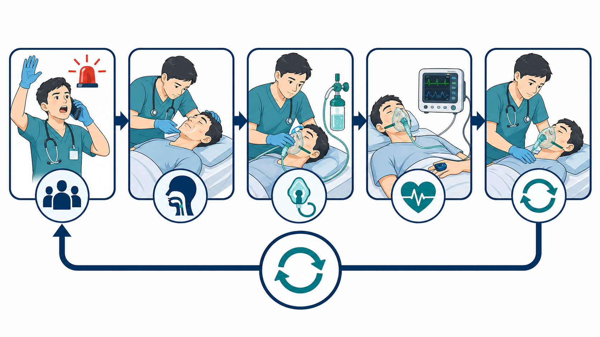
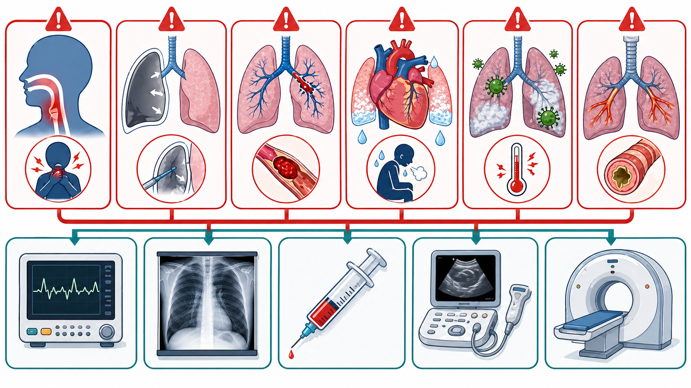
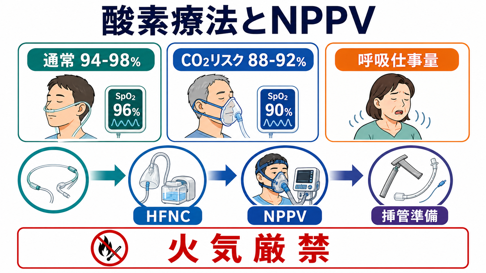

---
title: "呼吸困難患者を見たら最初に何をするか"
description: "酸素化、気道、呼吸仕事量、循環、意識を同時に評価し、酸素療法、NPPV/HFNC、挿管準備、原因検索へつなげる初期対応を整理する。"
aliases:
  - "呼吸困難の初期対応"
tags:
  - 領域/救急・初期対応
  - 種類/クリニカルクエスチョン
  - 対象/研修医
question: "呼吸困難患者を見たら最初に何をするか"
clinical_area: "救急・初期対応"
audience: "研修医"
evidence_level: "guideline"
created: "2026-04-27"
updated: "2026-04-27"
enableToc: true
---

# 呼吸困難患者を見たら最初に何をするか

> このノートは研修医教育のための一般的整理であり、個別患者の診断・治療指示ではありません。緊急性が高い、判断に迷う、施設方針が関わる場合は上級医・専門科に相談してください。

## クリニカルクエスチョン

呼吸困難患者を見たら、原因診断に入る前に、酸素化、気道、呼吸仕事量、循環、意識をどの順番で評価し、酸素療法やNPPV/HFNC、挿管準備につなげるか。

## まず結論

- 呼吸困難は「SpO2が低いか」だけでなく、**気道が保てるか、呼吸仕事量が破綻しそうか、循環不全や意識障害を伴うか**を最初の数分で見る [1,2]。
- 第一声で会話可能かを確認し、話せない、喘鳴・嗄声、チアノーゼ、起坐呼吸、冷汗、意識低下、ショック徴候があれば、原因診断より先に応援要請、モニター、酸素、吸引、バッグバルブマスク、挿管準備を同時に進める [1,2]。
- 多くの急性疾患ではSpO2 94-98%を目安に酸素を調整し、COPD増悪など高CO2血症リスクがある場合は、過剰酸素を避けて88-92%を暫定目標にする考え方が国際的に用いられる [4,5]。
- NPPVはCOPD増悪の急性高CO2性呼吸不全や心原性肺水腫で有用だが、意識障害、嘔吐・誤嚥リスク、気道保護不能、循環不安定、協力困難では危険になり得るため、上級医と適応・禁忌を確認する [6,7]。
- CTや詳細検査は重要だが、酸素化・換気・循環が不安定な患者を検査室へ送ると悪化する。まずベッドサイドで安定化し、搬送可能性を再評価する [1,2,8]。
- 日本では医療用酸素は医薬品として扱われ、火気厳禁、機器・配管・ボンベ管理、施設プロトコルが重要である。投与方法と目標SpO2は院内手順に沿って記録・共有する [3,9,10]。

## 判断の型

1. **見た瞬間に危険度を分ける**: 会話できるか、座位を保てるか、呼吸数が多いか、努力呼吸・チアノーゼ・冷汗・意識低下があるかを見る。
2. **A/B/C/Dを短く回す**: Aは気道、Bは酸素化と換気、Cはショック、Dは意識と血糖を確認する。異常があれば評価を続けながら介入する [1,2]。
3. **酸素化と換気補助を選ぶ**: 鼻カニューラ、酸素マスク、リザーバーマスク、HFNC、NPPV、バッグバルブマスク、挿管準備のどこが必要かを、SpO2だけでなく呼吸仕事量で決める。
4. **見逃し疾患を並行して拾う**: 気道閉塞、緊張性気胸、肺塞栓、急性冠症候群・心不全、肺炎・敗血症、喘息/COPD増悪を先に考える。
5. **介入後に戻る**: 酸素投与、体位、吸引、NPPV、輸液、利尿薬、気管支拡張薬などの後は、Aから再評価する。

## 初期対応

- **応援要請**: 話せない、SpO2低値、呼吸数著増、努力呼吸、意識障害、ショック徴候、片側呼吸音低下、喘鳴/嗄声、胸痛、喀血では、研修医だけで抱えず上級医・救急チーム・看護師へ早く共有する [1,2]。
- **モニターと準備**: SpO2、血圧、心電図、呼吸数、体温、意識、血糖を確認し、酸素、吸引、バッグバルブマスク、気道器具、静脈路、採血を準備する。
- **体位**: 苦しい患者は原則として楽な座位・半座位を保つ。意識低下、嘔吐、気道分泌物がある場合は気道保護と誤嚥リスクを優先する。
- **酸素投与**: 低酸素、チアノーゼ、ショック、重症感があれば酸素を開始し、病態とCO2貯留リスクに応じて目標SpO2を調整する [4,5]。
- **換気補助の見極め**: SpO2が上がっても、呼吸数が減らない、補助呼吸筋を使う、会話不能、疲弊、CO2上昇、意識低下があれば、NPPV/HFNCまたは挿管準備を相談する [6-8]。
- **感染対策**: 発熱、咳嗽、低酸素、流行状況、免疫不全では標準予防策に加え、飛沫・空気感染対策や隔離を施設基準に沿って行う。

## 鑑別・見逃し

| 優先度 | 疾患・状態 | 見逃さない理由 | 手がかり |
|---|---|---|---|
| 高 | 気道閉塞、アナフィラキシー、誤嚥 | 気道が閉じると急速に低酸素・心停止へ進む | 話せない、吸気性喘鳴、嗄声、流涎、顔面・口腔咽頭浮腫、蕁麻疹、嘔吐 |
| 高 | 緊張性気胸 | 低酸素と閉塞性ショックを同時に起こす | 突然の呼吸困難、片側呼吸音低下、胸痛、頸静脈怒張、血圧低下 |
| 高 | 肺塞栓 | SpO2低下が軽くても突然死し得る | 急な呼吸困難、胸痛、失神、頻脈、DVT徴候、悪性腫瘍、術後、妊娠・産褥 |
| 高 | 急性冠症候群、急性心不全 | 呼吸困難だけで発症し、ショック・不整脈へ進む | 胸部圧迫感、冷汗、肺雑音、下腿浮腫、起坐呼吸、心電図変化 |
| 高 | 肺炎、敗血症 | 低酸素と循環不全を合併しやすい | 発熱、低体温、頻呼吸、意識変容、低血圧、免疫不全、肺浸潤影 |
| 高 | 喘息/COPD増悪 | 換気不全、CO2ナルコーシス、呼吸筋疲労を来す | 喘鳴、呼気延長、既往、喫煙歴、サイレントチェスト、CO2上昇 |
| 中 | 代謝性アシドーシス、貧血、中毒、不安発作 | 「息苦しい」原因が肺だけではない | 深大呼吸、血糖異常、腎不全、薬物、CO曝露、Hb低値、過換気 |

## 検査

| 検査 | 目的 | 注意点 |
|---|---|---|
| SpO2、呼吸数、視診、聴診 | 酸素化、呼吸仕事量、左右差、喘鳴、湿性ラ音を評価する | SpO2が正常でも、CO2貯留、CO中毒、代謝性アシドーシス、疲弊は見逃し得る |
| 血液ガス、乳酸 | 低酸素、CO2貯留、アシドーシス、循環不全を評価する | 採血を待って酸素・換気補助・ショック対応を遅らせない |
| 12誘導心電図、心筋逸脱酵素 | ACS、不整脈、右心負荷を拾う | 呼吸困難だけのACSや肺塞栓を見逃さない |
| 胸部X線 | 気胸、肺炎、心不全、胸水、チューブ位置を確認する | 不安定ならポータブル撮影を優先し、撮影室搬送を避ける |
| 採血、血液培養 | 感染、貧血、腎機能、電解質、凝固、Dダイマーなどを評価する | Dダイマーは低リスク除外の文脈で使い、単独で診断しない |
| ベッドサイドエコー | 心機能、肺水腫、気胸、胸水、下肢DVT、IVCを評価する | 画像の限界を理解し、所見が臨床像と合わなければ再評価する |
| CT | 肺塞栓、肺炎、気胸、腫瘍、血管疾患などを精査する | 酸素化・循環が保てるか、酸素供給と人員を含めて搬送前に確認する [1,8] |

## 治療・マネジメント

- **酸素化の目標を置く**: 多くの急性疾患ではSpO2 94-98%を目安にし、COPD増悪など高CO2血症リスクがある場合は88-92%を暫定目標にして、血液ガスでCO2とpHを確認する [4,5]。
- **酸素デバイスを段階的に選ぶ**: 軽症低酸素では鼻カニューラや単純マスク、強い低酸素やショックではリザーバーマスク、持続する低酸素や呼吸仕事量増大ではHFNC/NPPV/挿管準備を検討する [4,8]。
- **NPPVを使う前に禁忌を確認する**: COPD増悪の急性高CO2性呼吸不全や心原性肺水腫では有用性が示される一方、意識障害、嘔吐、気道保護不能、顔面外傷、循環不安定、分泌物過多、協力困難ではリスクが高い [6,7]。
- **原因治療は支持療法と同時に始める**: 気管支拡張薬、ステロイド、抗菌薬、利尿薬、抗凝固、アドレナリン、胸腔穿刺・ドレナージなどは、病態に応じて上級医・専門科と適応を確認する。
- **日本での注意**: 医療用酸素はPMDA添付文書上、酸素欠乏による諸症状の改善などに用いられる医薬品である。酸素投与中は火気厳禁で、ボンベ・配管・流量計・加湿・搬送中残量は院内手順で確認する [9,10]。
- **日本での注意**: NPPV、HFNC、挿管の適応、実施場所、モニタリング、人員配置、保険・物品運用は施設差が大きい。研修医は「導入できるか」だけでなく、観察場所と失敗時の挿管体制を必ず確認する。

## 図解

## 指導医に確認するポイント

- この患者は「低酸素」だけか、「換気不全」「呼吸筋疲労」「ショック」「意識障害」を伴うか。
- 目標SpO2を94-98%に置くか、CO2貯留リスクとして88-92%に置くか。
- HFNC、NPPV、バッグバルブマスク、挿管準備のどこへ進むべきか。
- NPPVを試す場合、禁忌、観察場所、失敗時の挿管基準、担当者は明確か。
- CTへ搬送できる安定度か。搬送中の酸素、モニター、人員、急変対応は準備できているか。
- 抗菌薬、利尿薬、気管支拡張薬、抗凝固、アドレナリン、胸腔ドレナージなど、原因治療の優先順位はどうするか。

## 患者説明

- 「まず、酸素の値だけでなく、空気の通り道、呼吸の力、血圧、意識を同時に確認します。」
- 「苦しさが強いので、原因を調べながら先に酸素や呼吸を助ける処置を行います。」
- 「必要に応じて、マスクの酸素、機械で呼吸を支える治療、または気管に管を入れる準備をします。」
- 「検査に移動する前に、移動しても安全かを確認します。」
- 「酸素を使っている間は火気を近づけないでください。」

## ピットフォール

- SpO2だけを見て、呼吸数、努力呼吸、会話困難、疲弊を見ない。
- 低酸素が改善したために安心し、CO2貯留や意識低下を見逃す。
- COPDらしさだけで酸素を控えすぎ、低酸素を放置する。
- NPPVを「挿管を避ける道具」とだけ考え、禁忌や失敗時の挿管体制を確認しない。
- 気道閉塞、緊張性気胸、肺塞栓、ACSを、胸部X線やSpO2だけで否定したつもりになる。
- CTを急ぎすぎて、搬送中に酸素切れ、モニター外れ、呼吸停止、ショック悪化を起こす。
- 酸素ボンベ残量、火気、MRI室持ち込み、搬送中の酸素供給など、医療用酸素の運用リスクを軽く見る。

## 関連ノート

- [[救急外来で患者を診るときABCDE評価はどの順番で進めるか]]
- [[救急外来でバイタルサイン異常を見たとき何を優先して確認するか]]
- 関連ノート候補: 酸素デバイスの使い分け、NPPV開始前に確認すること、急性心不全の初期対応、喘息/COPD増悪の初期対応、肺塞栓を疑う呼吸困難

## MOC更新候補

- [[MOC｜救急・初期対応]] に「胸痛・呼吸困難」配下の記事として追加候補。
- MOC｜呼吸器.md（本サイト外） に「急性呼吸不全・酸素療法」関連の記事として追加候補。

## 参考文献

[1] World Health Organization and International Committee of the Red Cross. Basic emergency care: approach to the acutely ill and injured. 2018. https://www.who.int/publications-detail-redirect/9789241513081

[2] Resuscitation Council UK. The ABCDE Approach. Updated July 2024. https://www.resus.org.uk/library/abcde-approach

[3] 日本蘇生協議会. JRC蘇生ガイドライン2020. https://www.jrc-cpr.org/jrc-guideline-2020/

[4] 日本呼吸ケア・リハビリテーション学会酸素療法マニュアル作成委員会, 日本呼吸器学会肺生理専門委員会. 酸素療法マニュアル. https://www.jrs.or.jp/publication/jrs_guidelines/20170104152945.html

[5] O'Driscoll BR, Howard LS, Earis J, Mak V. British Thoracic Society Guideline for oxygen use in adults in healthcare and emergency settings. Thorax. 2017;72(Suppl 1):ii1-ii90. https://doi.org/10.1136/thoraxjnl-2016-209729

[6] 日本呼吸器学会NPPVガイドライン作成委員会. NPPV（非侵襲的陽圧換気療法）ガイドライン 改訂第2版. https://www.jrs.or.jp/publication/jrs_guidelines/20150210132448.html

[7] Rochwerg B, Brochard L, Elliott MW, et al. Official ERS/ATS clinical practice guidelines: noninvasive ventilation for acute respiratory failure. Eur Respir J. 2017;50(2):1602426. https://doi.org/10.1183/13993003.02426-2016

[8] ARDS診療ガイドライン2021作成委員会. ARDS診療ガイドライン2021. https://www.jrs.or.jp/publication/jrs_guidelines/20231106085000.html

[9] PMDA. 日本薬局方 酸素 添付文書等情報. https://www.pmda.go.jp/PmdaSearch/rdDetail/iyaku/799070EX1054_1?user=1

[10] 厚生労働省. 在宅酸素療法における火気の取扱いについて. https://www.mhlw.go.jp/stf/houdou/2r98520000003m15_1.html

## 更新ログ

- 2026-04-27: 初版作成。
