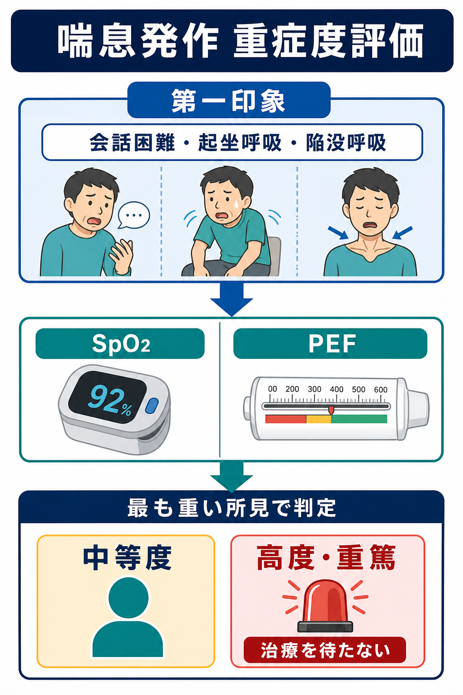
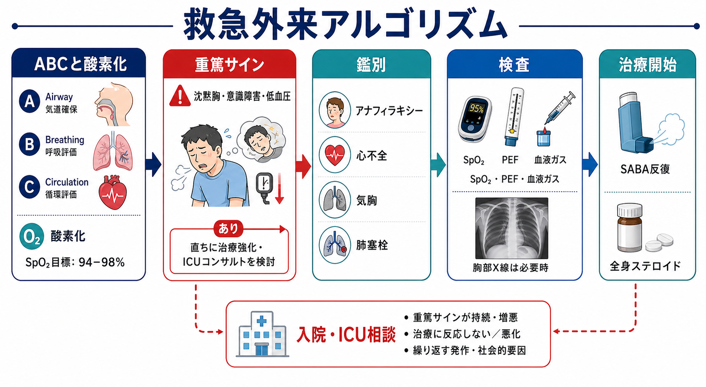
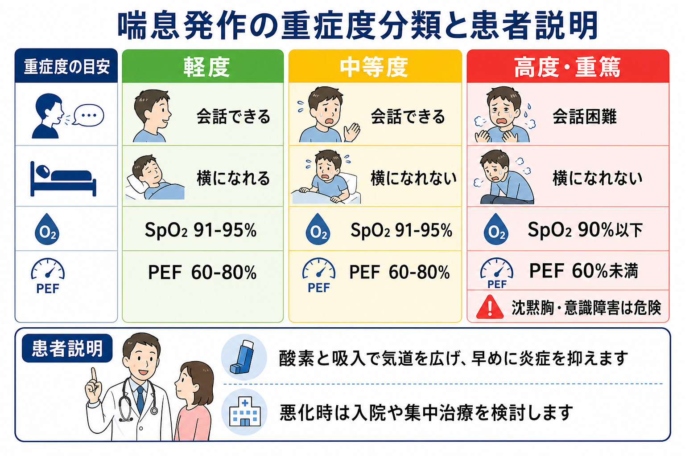

---
title: "喘息発作を救急外来でどう重症度評価するか"
description: "会話困難、陥没呼吸、SpO2、PEFなどから喘息発作の重症度を判断し、治療開始と入院・ICU相談のタイミングを整理する。"
aliases:
  - "喘息発作の重症度評価"
tags:
  - 領域/救急・初期対応
  - 種類/クリニカルクエスチョン
  - 対象/研修医
question: "喘息発作を救急外来でどう重症度評価するか"
clinical_area: "救急・初期対応"
audience: "研修医"
evidence_level: "guideline"
created: "2026-04-27"
updated: "2026-04-27"
enableToc: true
---

# 喘息発作を救急外来でどう重症度評価するか

> このノートは研修医教育のための一般的整理であり、個別患者の診断・治療指示ではありません。緊急性が高い、判断に迷う、施設方針が関わる場合は上級医・専門科に相談してください。

## クリニカルクエスチョン

喘息発作を救急外来でどう重症度評価するか。

## まず結論

- 喘息発作の重症度評価は、問診が終わってからではなく、酸素投与と短時間作用性β2刺激薬（SABA）を開始しながら行う。GINAは、呼吸困難の程度、呼吸数、脈拍、SpO2、肺機能（通常PEF）で評価するとしている [3]。
- 「会話困難」「起坐呼吸」「陥没呼吸・補助筋使用」「沈黙胸」「意識障害」「低血圧」は、数値より先に拾う危険サインである [3,4]。
- PEFは可能なら測るが、苦しくて測れないこと自体が重症所見になり得る。PEFが最良値または予測値の33-50%なら急性重症、33%未満なら生命危機に近い基準として扱う流儀がある [4]。
- SpO2低下は重症度判断の中核で、成人ではSpO2 92%未満を生命危機所見に含める英国基準がある。GINAは治療中の酸素目標を成人・思春期で93-95%としている [3,4]。
- 沈黙胸、傾眠・混乱、チアノーゼ、徐脈、低血圧、PaCO2上昇または正常化を伴う悪化は「換気不全に近い」と考え、ICU・挿管対応可能なチームへ早めに共有する [3,4]。
- 日本では、救急外来で使う吸入薬・全身ステロイドの剤形や用量は添付文書、院内プロトコル、年齢、妊娠、併存疾患で変わる。海外アルゴリズムの用量をそのまま写さず、PMDA添付文書と施設採用薬を確認する [6,7]。
- 評価は1回で終わらない。初期治療後15-30分、遅くとも1時間で症状、SpO2、PEF、呼吸仕事量を再評価し、改善が乏しければ入院・ICU相談に切り替える [3,4]。

## 判断の型

1. **第一印象で危険サインを探す。** 会話が単語のみ、横になれない、肩呼吸・陥没呼吸、冷汗、意識変容、沈黙胸、チアノーゼ、低血圧があれば、検査完了を待たずに上級医へ共有する [3,4]。
2. **SpO2とバイタルを同時に見る。** SpO2、呼吸数、脈拍、血圧、体温を取り、酸素投与が必要かを判断する。GINAは酸素を必要時に使い、成人・思春期で93-95%を目標に調整するとしている [3]。
3. **PEFを「できる範囲で」測る。** 気管支拡張薬前後でPEFを記録できると、重症度と治療反応が見える。苦痛が強い、意識が悪い、努力呼吸が強い場合は無理に測定しない [3,4]。
4. **最も悪い所見で分類する。** SpO2が保たれていても会話困難・沈黙胸があれば重症として扱う。PEFだけ、SpO2だけで軽症と決めない [4]。
5. **反応性で次の場所を決める。** SABA反復、酸素、全身ステロイド後に、症状、SpO2、PEFが明らかに改善するかを見る。改善不十分、再増悪、社会的に帰宅管理が難しい場合は入院を検討する [3,4]。

## 初期対応

- **A/B/Cを先に見る。** 気道閉塞、努力呼吸、呼吸停止前、ショックを確認する。沈黙胸は「喘鳴がないから軽い」ではなく、換気量が落ちた危険所見である [4]。
- **酸素化を測定し、必要時に酸素を開始する。** GINAは成人・思春期でSpO2 93-95%を目標に調整する。COPD合併や慢性CO2貯留が疑われる場合は、施設プロトコルと上級医判断で目標を調整する [3]。
- **吸入治療を遅らせない。** SABA反復投与を開始し、中等度以上では抗コリン薬吸入や全身ステロイドを早期に併用する方針が国際ガイドラインで示されている [3,4]。
- **静脈路・モニターを準備する。** 高度発作、SpO2低下、頻脈、低血圧、意識障害、治療反応不良では、心電図モニター、静脈路、血液ガス、ICU相談を並行する。
- **小児は成人基準をそのまま使わない。** JPGL2023では小児の発作強度とSpO2の関係が年齢で異なることが示されており、年齢別の呼吸数・心拍数、陥没呼吸、哺乳・会話、ぐったり感を重視する [5]。

## 鑑別・見逃し

| 優先度 | 疾患・状態 | 見逃さない理由 | 手がかり |
|---|---|---|---|
| 高 | アナフィラキシー | 喘鳴を伴い喘息発作に見えるが、アドレナリンが遅れると危険 | 蕁麻疹、血圧低下、消化器症状、曝露歴、急速な発症 |
| 高 | 気胸 | 喘息患者でも起こり、片側呼吸音低下を見逃すと悪化する | 突然の胸痛、片側呼吸音低下、皮下気腫、胸部X線・エコー |
| 高 | 心不全・急性冠症候群 | wheezingを伴う心原性喘息があり、気管支拡張薬だけでは悪化する | 高齢、浮腫、頸静脈怒張、胸痛、心電図変化、BNP、肺うっ血 |
| 高 | 肺塞栓 | 呼吸困難と低酸素が喘息様に見えることがある | 胸痛、失神、DVT所見、リスク因子、喘鳴に比べ強い低酸素 |
| 中 | COPD増悪 | 酸素目標、CO2貯留、薬剤選択が変わる | 喫煙歴、慢性咳嗽・喀痰、樽状胸郭、過去の肺機能 |
| 中 | 上気道閉塞・声帯機能不全 | 吸気性喘鳴や喉頭症状は喘息治療への反応が乏しい | 吸気性狭窄音、嗄声、喉の詰まり、突然発症、SpO2保たれる |
| 中 | 肺炎・感染 | 抗菌薬の要否、入院判断が変わる | 発熱、膿性痰、局所性ラ音、浸潤影、炎症反応 |

## 検査

| 検査 | 目的 | 注意点 |
|---|---|---|
| SpO2連続または頻回測定 | 低酸素と治療反応の把握 | 爪、末梢循環、体動で誤差が出る。数値が保たれても重症所見があれば軽症扱いしない |
| PEF | 気流制限の定量化、治療前後比較 | 最良値が不明なら予測値を使う。測定不能・低努力の解釈に注意 |
| 血液ガス | 換気不全、CO2貯留、アシドーシスの評価 | 重症・生命危機所見、SpO2低下、意識障害、治療反応不良で検討。PaCO2が正常化・上昇する悪化は危険 [4] |
| 胸部X線 | 気胸、肺炎、心不全、異物などの鑑別 | GINAは喘息増悪で胸部X線をルーチンに求めないとしている。疑う所見があるときに撮る [3] |
| 心電図・心筋マーカー | ACS、不整脈、β2刺激薬使用時の安全確認 | 胸痛、高齢、心疾患既往、低K血症疑い、強い頻脈で検討 |
| 採血 | 感染、電解質、併存疾患、治療安全性の確認 | β2刺激薬反復で低K血症・頻脈が問題になることがある。重症度評価そのものは臨床所見が中心 |

## 治療・マネジメント

- **治療開始と重症度評価を分けない。** 喘息発作では、評価が終わるまでSABAや酸素を待つのではなく、重症度を見ながら同時進行で治療する [3]。
- **中等度以上なら早期に全身ステロイドを考える。** GINAと英国系アルゴリズムは、中等度から重症の増悪で全身ステロイドを早期に使う方針を示す [3,4]。
- **反応不良なら治療強化と相談を早める。** SABA反復、酸素、全身ステロイドで改善しない高度発作では、イプラトロピウム、硫酸マグネシウム、NIVまたは挿管準備などを上級医・救急・ICUと相談する [3,4]。
- **抗菌薬と胸部X線はルーチンにしない。** 喘息増悪だけなら抗菌薬や胸部X線を routine に行わない方針がGINAで示されている。発熱、浸潤影、膿性痰、免疫抑制、気胸疑いなどがあれば別で考える [3]。
- **退院可否は「今の数値」だけで決めない。** 治療後PEF、SpO2、呼吸仕事量、発作歴、過去の挿管・入院、OCS使用歴、吸入手技、自宅支援、再診可否を含めて判断する [3,4]。
- **日本の成人喘息管理に戻す。** 急性期を越えたら、日本喘息学会PGAMやJGL2024の枠組みに沿って、長期管理、吸入手技、増悪リスク、専門医紹介の要否を見直す [1] [2]。
- **日本での注意。** PMDA添付文書ではベネトリン吸入液0.5%は気管支喘息などの気道閉塞症状の緩解に用いられ、通常成人1回0.3-0.5 mL、小児1回0.1-0.3 mLを吸入器で吸入する記載がある [6]。海外ガイドラインのネブライザー用量と一致しないことがあるため、院内プロトコルと添付文書で確認する。
- **日本での注意。** プレドニゾロンは気管支喘息を含む多くの適応を持つが、感染症、糖尿病、消化性潰瘍、精神症状、妊娠などではリスク評価が必要である [7]。
- **生物学的製剤は救急初期対応の薬ではない。** 厚生労働省の最適使用推進ガイドラインは、テゼペルマブなどを既存治療でもコントロール困難な重症・難治喘息に適正使用するための枠組みであり、急性発作の初期重症度評価を置き換えない [8]。

## 図解

## 指導医に確認するポイント

- この患者は「軽症として帰せる」のか、それとも「中等度以上として観察・入院」なのか。
- 会話困難、起坐呼吸、陥没呼吸、沈黙胸、意識変容など、数値以外の危険サインをどう評価するか。
- PEFが測れない、または最良値不明のとき、予測値・臨床所見・治療反応をどう組み合わせるか。
- 血液ガス、胸部X線、心電図、採血をどこまで行うか。
- ICU、救急科、呼吸器内科、小児科、麻酔科へどの時点で相談するか。
- 退院時のICS含有治療、吸入手技確認、再診時期、アクションプランをどう整えるか。

## 患者説明

- 「今は気管支が狭くなり、息を吐き出しにくい状態です。酸素の値、会話のしやすさ、呼吸の力の入り方、ピークフローを見ながら重さを判断します。」
- 「まず吸入薬で気道を広げ、必要に応じて酸素と炎症を抑える薬を使います。」
- 「数値が改善しても、また悪くなることがあります。治療後にもう一度、呼吸状態とピークフローを確認します。」
- 「意識がぼんやりする、息をする力が落ちる、胸の音が聞こえにくくなる場合は危険なサインなので、入院や集中治療を検討します。」

## ピットフォール

- 喘鳴が大きいほど重症、喘鳴がないほど軽症、と考える。沈黙胸は最重症サインになり得る [4]。
- SpO2が正常だから軽症と判断する。発作初期や酸素投与中は、呼吸仕事量や会話困難の方が先に悪化を示すことがある。
- PEF測定にこだわり、苦しい患者に無理をさせる。測れないことも重症評価に含める。
- 胸部X線や採血を待って吸入治療が遅れる。GINAは治療開始と評価を並行する方針を示す [3]。
- β2刺激薬反復後の頻脈をすべて薬剤性と決めつける。低酸素、脱水、感染、心疾患、不整脈を同時に考える。
- 海外アルゴリズムの薬剤用量を日本の添付文書・施設プロトコル確認なしに流用する [6,7]。
- 一度改善しただけで帰宅にする。過去の挿管・入院、OCS使用、SABA過用、吸入手技不良、フォロー困難は再増悪リスクとして扱う [3,4]。

## 関連ノート

- 喘息の長期管理でICSをどう使うか（本サイト未同梱）（候補）
- 呼吸困難を見たら最初に何を確認するか（本サイト未同梱）（候補）
- 吸入薬の使い方をどう説明するか（本サイト未同梱）（候補）

## MOC更新候補

- [[MOC｜救急・初期対応]]
- MOC｜呼吸器.md（本サイト外）

## 参考文献

[1] Tamaoki J, Nagase H, Sano H, et al. Practical Guidelines for Asthma Management (PGAM): Digest edition. Respiratory Investigation. 2025;63(3):405-421. https://doi.org/10.1016/j.resinv.2025.03.009

[2] 喘息予防・管理ガイドライン2024WG 監修, 『喘息予防・管理ガイドライン2024』作成委員会 作成. 喘息予防・管理ガイドライン2024. 協和企画, 2024. https://www.kk-kyowa.co.jp/service/publishing/book_list/d20241017/

[3] Global Initiative for Asthma. Global Strategy for Asthma Management and Prevention, 2025. https://ginasthma.org/2025-gina-strategy-report/

[4] Right Decisions / BTS, NICE, SIGN asthma pathway. Management of acute asthma in adults in hospital. https://rightdecisions.scot.nhs.uk/asthma-pathway-bts-nice-sign-sign-244/managing-acute-asthma/management-of-acute-asthma-in-adults/asthma-management-algorithms-for-adults/management-of-acute-asthma-in-adults-in-hospital/

[5] 日本小児アレルギー学会. 小児気管支喘息治療・管理ガイドライン2023（web版）. https://www.jspaci.jp/journal/asthma2023/

[6] PMDA. ベネトリン吸入液0.5％（サルブタモール硫酸塩）医療用医薬品情報. https://www.pmda.go.jp/PmdaSearch/rdSearch/02/2254700G2034?user=1

[7] PMDA. プレドニン錠5mg（プレドニゾロン）医療用医薬品情報. https://www.pmda.go.jp/PmdaSearch/rdSearch/02/2456001F1310?user=1

[8] 厚生労働省. テゼペルマブ（遺伝子組換え）製剤の最適使用推進ガイドライン（気管支喘息）について. https://www.mhlw.go.jp/web/t_doc?dataId=00tc7142&dataType=1&pageNo=1

## 更新ログ

- 2026-04-27: 初版作成。
