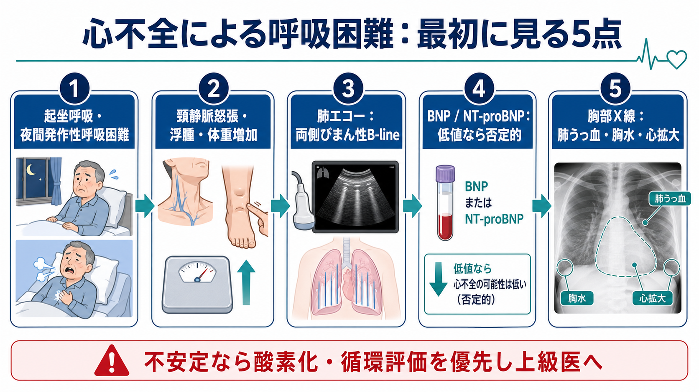
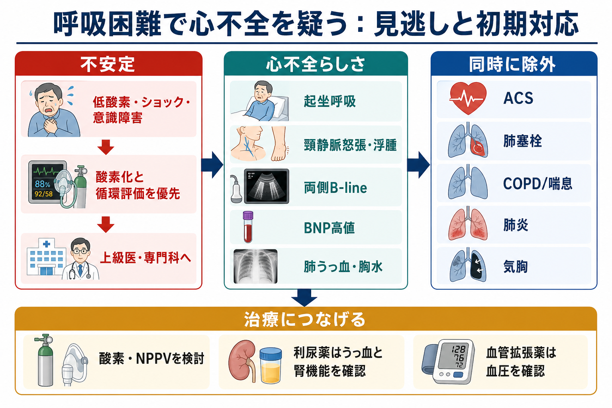
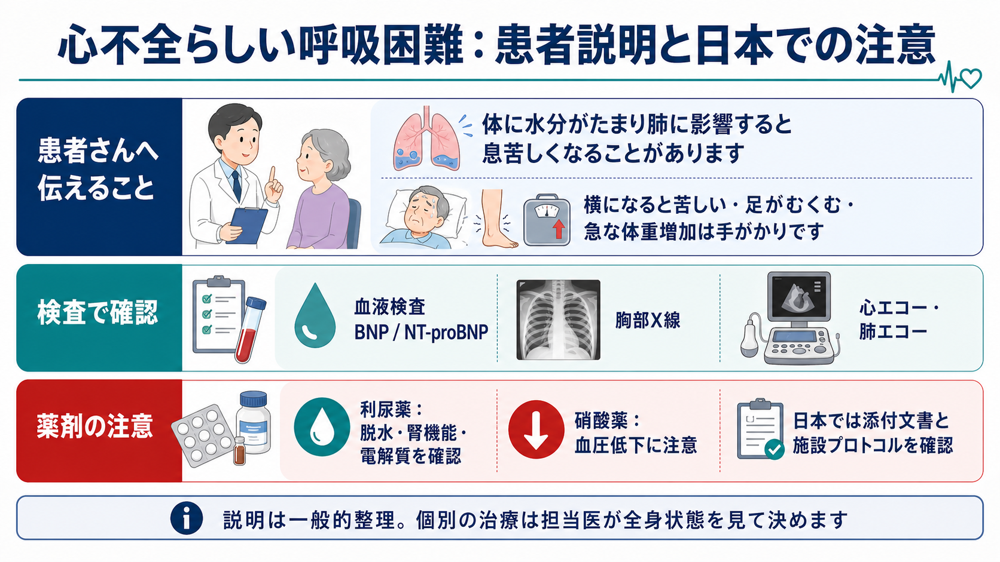

---
title: "心不全による呼吸困難を疑ったら何を見るか"
description: "起坐呼吸、浮腫、肺エコー、BNP、胸部X線から心不全らしさと見逃しを評価し、初期治療につなげる。"
aliases:
  - "心不全 呼吸困難"
tags:
  - 領域/救急・初期対応
  - 種類/クリニカルクエスチョン
  - 対象/研修医
question: "心不全による呼吸困難を疑ったら何を見るか"
clinical_area: "救急・初期対応"
audience: "研修医"
evidence_level: "guideline/review"
created: "2026-04-27"
updated: "2026-04-27"
enableToc: true
---

# 心不全による呼吸困難を疑ったら何を見るか

> このノートは研修医教育のための一般的整理であり、個別患者の診断・治療指示ではありません。緊急性が高い、判断に迷う、施設方針が関わる場合は上級医・専門科に相談してください。

## クリニカルクエスチョン

心不全による呼吸困難を疑ったとき、ベッドサイドで何を見て、どの検査で裏付け、初期治療につなげるか。

## まず結論

- まず「低酸素、ショック、意識障害、胸痛、チアノーゼ」があれば、診断を詰める前に酸素化・循環評価を優先し、上級医・救急・循環器へ早めに共有する。
- 心不全らしさは、起坐呼吸・夜間発作性呼吸困難、頸静脈怒張、末梢浮腫、急な体重増加、湿性ラ音だけでなく、肺エコーの両側びまん性 B-line、BNP/NT-proBNP、胸部X線の肺うっ血・胸水・心拡大を合わせて判断する [1,2]。
- 急性呼吸困難で BNP <100 pg/mL または NT-proBNP <300 pg/mL なら急性心不全は否定的に考えやすいが、肥満では低め、高齢・腎機能低下・心房細動では高めに出るため、単独で断定しない [2,4]。
- 肺エコーは肺うっ血の確認に有用で、B-line は治療反応で短時間に変化しうる。陰性なら心不全の可能性を下げるが、肺炎、間質性肺疾患、ARDS などでも B-line は出る [6,7]。
- 治療は「うっ血があるか」「血圧が保たれているか」「低酸素があるか」「腎機能・電解質が許すか」で組み立てる。利尿薬、NPPV、血管拡張薬は、施設プロトコルと禁忌を確認して使う [1,4,8]。

## 判断の型

1. **不安定性を先に見る**  
   SpO2、呼吸数、血圧、脈拍、意識、末梢冷感、尿量、胸痛を確認する。酸素化不良やショックがあれば、心不全の確定よりも酸素化、循環評価、モニタリングを優先する。
2. **「うっ血の証拠」を集める**  
   起坐呼吸、夜間発作性呼吸困難、頸静脈怒張、下腿浮腫、体重増加、肝腫大、湿性ラ音、肺エコー B-line、胸部X線、BNP/NT-proBNP を組み合わせる [1,2,4]。
3. **「心不全だけでは説明できない所見」を探す**  
   発熱・膿性痰、片側性胸痛、突然発症、喘鳴優位、左右差のある呼吸音、片側下肢腫脹、ST-T変化、トロポニン上昇などは、肺炎、気胸、肺塞栓、ACS、COPD/喘息も同時に考える。
4. **治療前に危険因子を確認する**  
   収縮期血圧、腎機能、電解質、尿量、内服薬、弁膜症、妊娠可能性、アレルギー、DNAR/治療目標を確認する。
5. **反応を再評価する**  
   呼吸仕事量、SpO2、血圧、尿量、症状、B-line、胸部X線、BNP/NT-proBNPの推移を、治療の「効いた/効かない」だけでなく、悪化の早期発見に使う [2,6]。

## 初期対応

- **ABCDE とモニター**: 気道、呼吸仕事量、SpO2、血圧、脈拍、意識、皮膚冷感、尿量を確認し、心電図モニター、静脈路、採血を準備する。
- **酸素化**: 低酸素があれば酸素投与を開始し、呼吸仕事量が強い肺水腫では NPPV の適応を上級医と検討する。COPD 合併やCO2貯留が疑われる場合は血液ガスで確認する。
- **ショックを見逃さない**: 低血圧、乳酸上昇、冷汗、乏尿、意識障害があれば、単純な「利尿」ではなく心原性ショック、ACS、重症弁膜症、不整脈を想定して循環器・集中治療に相談する [1,4]。
- **誘因を探す**: ACS、不整脈、感染、肺塞栓、内服中断、過剰輸液、腎機能悪化、貧血、甲状腺機能異常、NSAIDs などを並行して確認する。
- **日本での注意**: 初期治療薬の具体的な投与量や投与速度は、電子添文、院内プロトコル、患者背景で変わる。フロセミド注射薬は日本の電子添文で心性浮腫に適応があるが、無尿、明らかな低Na/低K、肝性昏睡などは禁忌であり、急速投与による難聴にも注意する [8]。

## 鑑別・見逃し

| 優先度 | 疾患・状態 | 見逃さない理由 | 手がかり |
|---|---|---|---|
| 高 | ACS・急性心筋梗塞 | 急性心不全の誘因で、再灌流や集中治療が必要になる | 胸痛、冷汗、心電図変化、トロポニン上昇、急な肺水腫 |
| 高 | 心原性ショック | 利尿だけでは悪化しうる | 低血圧、冷感、乏尿、乳酸上昇、意識障害 |
| 高 | 肺塞栓 | 突然の呼吸困難と低酸素を来し、抗凝固・血栓溶解判断が必要 | 突然発症、胸痛、頻脈、片側下肢腫脹、Dダイマー、右心負荷 |
| 高 | 気胸 | 片側呼吸音低下なら迅速対応が必要 | 急な胸痛、片側呼吸音低下、胸部X線/エコー |
| 中 | 肺炎・敗血症 | 心不全と併存し、BNP上昇やB-lineを紛らわす | 発熱、膿性痰、浸潤影、CRP/PCT、低血圧 |
| 中 | COPD/喘息増悪 | 喘鳴と呼吸困難を心不全と誤りやすい | 喘鳴、呼気延長、喫煙歴、CO2貯留、過膨張 |
| 中 | 腎不全・過剰輸液 | うっ血の原因にも結果にもなる | 乏尿、Cr上昇、透析歴、輸液歴、体重増加 |

## 検査

| 検査 | 目的 | 注意点 |
|---|---|---|
| 心電図 | ACS、不整脈、伝導障害、心肥大を探す | 正常心電図でも心不全は否定しきれない |
| 胸部X線 | 肺うっ血、胸水、心拡大、肺炎、気胸を確認する | 早期や肥満、臥位撮影では肺うっ血が分かりにくいことがある [4] |
| 肺エコー | B-line、胸水、気胸の手がかりを得る | 両側びまん性B-lineは肺うっ血を支持するが、肺炎や間質性肺疾患でも出る [6,7] |
| BNP/NT-proBNP | 心負荷の補助診断、重症度・予後の参考 | 日本心不全学会は BNP 35/100/200、NT-proBNP 125/300/900 pg/mL を判断の節目として示す。急性では BNP 100、NT-proBNP 300 pg/mL 未満なら否定的に使いやすい [2,4] |
| 採血 | 腎機能、電解質、肝機能、貧血、感染、甲状腺、トロポニンを評価 | 利尿薬開始後はK、Na、Cr、尿量を再確認する |
| 心エコー | LVEF、弁膜症、右心負荷、心嚢液、拡張能を評価 | ショック、急性弁膜症、右心不全疑いでは早めに依頼する [1,4] |
| 血液ガス | 低酸素、CO2貯留、アシドーシス、乳酸を評価 | NPPVや挿管判断の材料にする |

## 治療・マネジメント

- **うっ血が主体なら除水を考える**: 肺うっ血、浮腫、体重増加、胸水、B-line があり、低灌流が目立たなければ、ループ利尿薬を上級医・院内プロトコルに沿って検討する。開始後は尿量、症状、血圧、腎機能、Na/Kを追う [1,4,8]。
- **呼吸仕事量が強ければ NPPV を検討する**: 急性肺水腫で意識が保たれ、気道防御が可能で、禁忌がなければ、酸素投与だけで粘らず早めに相談する。
- **血圧が高く肺水腫が強い場合**: 血管拡張薬は有効な場面があるが、低血圧、右室梗塞、高度大動脈弁狭窄、PDE5阻害薬使用などでは危険になりうる。必ず血圧と禁忌を確認する。
- **低血圧・低灌流なら別ルート**: 利尿薬や血管拡張薬を急ぐ前に、心原性ショック、ACS、重症不整脈、急性弁膜症、心タンポナーデを想定し、循環器・集中治療に相談する。
- **慢性心不全治療へ橋渡しする**: 急性期を抜けたら、EF分類、原因、誘因、再入院予防、退院後フォロー、GDMT、服薬支援、塩分・体重管理を整理する [1,3,5]。
- **日本での注意**: ARNI 使用中は BNP が一時的に上昇しうるため、NT-proBNP や症状・所見との総合評価が必要である [2]。薬剤の適応、投与速度、禁忌、保険運用は日本の電子添文と院内採用薬を確認する [8]。

## 図解

## 指導医に確認するポイント

- この呼吸困難は、心不全単独で説明できるか。ACS、肺塞栓、肺炎、気胸、COPD/喘息をどこまで除外するか。
- 血圧、腎機能、電解質、尿量から、利尿薬・NPPV・血管拡張薬のどれを優先するか。
- 心エコーをどのタイミングで依頼するか。弁膜症、右心不全、心嚢液、局所壁運動異常を疑う所見はあるか。
- ICU/HCU、循環器、救急、腎臓内科、呼吸器内科へ相談する基準は何か。
- 退院後の再増悪予防として、体重管理、内服調整、外来フォロー、心不全教育を誰が担うか。

## 患者説明

- 「息苦しさの原因として、心臓の働きと体の水分バランスが関係している可能性があります。」
- 「横になると苦しい、足がむくむ、急に体重が増える、夜に息苦しくて起きる、という症状は心不全の手がかりになります。」
- 「血液検査、胸のレントゲン、心臓や肺のエコーで、肺に水分がたまっていないか、心臓に負担がかかっていないかを確認します。」
- 「治療は全身状態、血圧、腎臓の働き、電解質を見ながら決めます。利尿薬を使う場合も、尿量や脱水、腎機能を確認しながら進めます。」

## ピットフォール

- BNP/NT-proBNP の値だけで心不全を確定・否定する。肥満では低値、高齢・腎機能低下・心房細動では高値になりやすい [2,4]。
- 胸部X線が目立たないため心不全を否定する。肺エコー、身体所見、BNP/NT-proBNP、心エコーと合わせる。
- B-line を見たら全て心不全と考える。肺炎、ARDS、間質性肺疾患、肺挫傷なども鑑別に残す [6,7]。
- 低血圧・冷感・乏尿があるのに、通常のうっ血として利尿だけで進める。
- 利尿薬後の尿量、K、Na、Crを見ない。特に高齢者、腎機能低下、低Na/低Kでは悪化を見逃しやすい [8]。
- 急性増悪の誘因、内服中断、NSAIDs、感染、不整脈、虚血を探さない。

## 関連ノート

- 既存ノート未確認。作成候補: `急性心不全の初期対応.md`
- 作成候補: `BNPとNT-proBNPをどう読むか.md`
- 作成候補: `肺エコーのB-lineをどう見るか.md`
- 作成候補: `急性呼吸困難の鑑別.md`

## MOC更新候補

- [[MOC｜救急・初期対応]]
- MOC｜心電図・循環器.md（本サイト外）
- MOC｜呼吸器.md（本サイト外）
- MOC｜検査・画像・手技.md（本サイト外）

## 参考文献

[1] 日本循環器学会・日本心不全学会. (2025). 2025年改訂版 心不全診療ガイドライン. https://www.j-circ.or.jp/cms/wp-content/uploads/2025/03/JCS2025_Kato.pdf  
[2] 日本心不全学会. (2023). 血中BNPやNT-proBNPを用いた心不全診療に関するステートメント2023年改訂版. https://www.jhfs.or.jp/statement-guideline/statement20231017.html  
[3] Heidenreich PA, Bozkurt B, Aguilar D, et al. (2022). 2022 AHA/ACC/HFSA Guideline for the Management of Heart Failure. Journal of Cardiac Failure. https://doi.org/10.1016/j.cardfail.2022.02.010  
[4] McDonagh TA, Metra M, Adamo M, et al. (2021). 2021 ESC Guidelines for the diagnosis and treatment of acute and chronic heart failure. European Heart Journal. https://doi.org/10.1093/eurheartj/ehab368  
[5] McDonagh TA, Metra M, Adamo M, et al. (2023). 2023 Focused Update of the 2021 ESC Guidelines for the diagnosis and treatment of acute and chronic heart failure. European Heart Journal. https://doi.org/10.1093/eurheartj/ehad195  
[6] Platz E, Merz AA, Jhund PS, et al. (2017). Dynamic changes and prognostic value of pulmonary congestion by lung ultrasound in acute and chronic heart failure: a systematic review. European Journal of Heart Failure. https://doi.org/10.1002/ejhf.839  
[7] Barzegar A, et al. (2025). Accuracy of Lung Ultrasonography for Diagnosis of Heart Failure; a Systematic Review and Meta-analysis. Archives of Academic Emergency Medicine. https://pmc.ncbi.nlm.nih.gov/articles/PMC11868670/  
[8] 医薬品医療機器総合機構. ラシックス注20mg 医療用医薬品情報・電子添文. https://www.pmda.go.jp/PmdaSearch/rdSearch/02/2139401A2137?user=1

## 更新ログ

- 2026-04-27: 初版作成。
