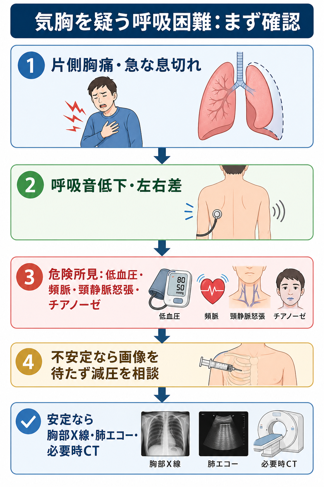
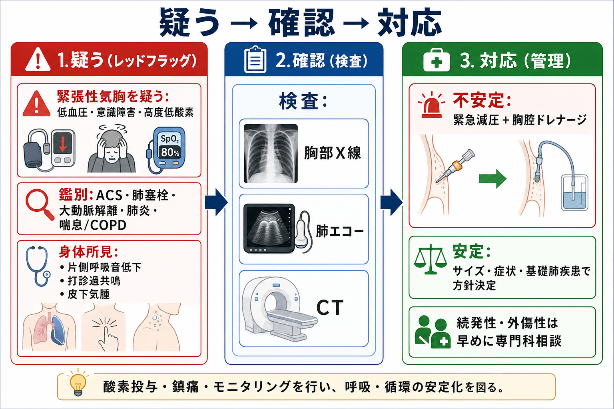
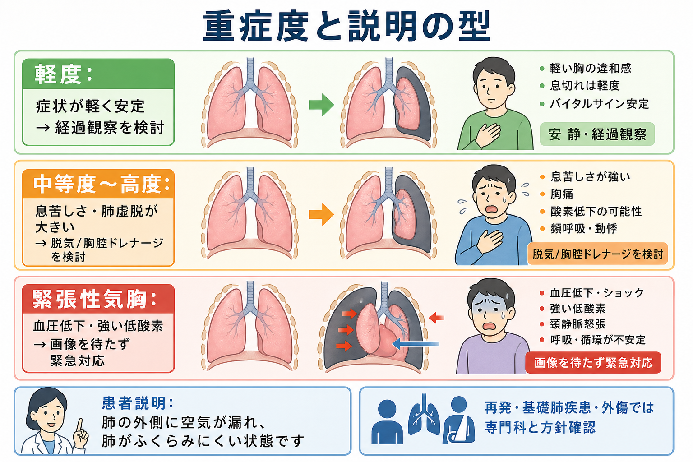

---
title: "気胸を疑う呼吸困難では何を確認するか"
description: "片側胸痛、呼吸音低下、緊張性気胸の危険所見、胸腔ドレナージ適応を初期対応で整理する。"
aliases:
  - "気胸の初期評価"
tags:
  - 領域/救急・初期対応
  - 種類/クリニカルクエスチョン
  - 対象/研修医
question: "気胸を疑う呼吸困難では何を確認するか"
clinical_area: "救急・初期対応"
audience: "研修医"
evidence_level: "mixed"
created: "2026-04-27"
updated: "2026-04-27"
enableToc: true
---

# 気胸を疑う呼吸困難では何を確認するか

> このノートは研修医教育のための一般的整理であり、個別患者への診断・治療指示ではありません。緊急性が高い、判断に迷う、施設方針が関わる場合は、上級医・救急科・呼吸器内科・呼吸器外科に相談してください。

## クリニカルクエスチョン

気胸を疑う呼吸困難では、片側胸痛、患側呼吸音低下、緊張性気胸の危険所見、胸腔ドレナージを急ぐ状況をどう確認するか。

## まず結論

- 突然の片側胸痛、呼吸困難、患側呼吸音低下、打診過共鳴、皮下気腫があれば気胸を疑う。小さい気胸では身体所見が乏しいため、所見がないことだけで除外しない。[1][2]
- 低血圧、ショック、意識障害、高度低酸素、頸静脈怒張、気管偏位、陽圧換気中の急な換気不良があれば緊張性気胸を疑い、画像確認を待たずに緊急減圧と胸腔ドレナージを上級医と進める。[2][5]
- 安定していれば、胸部X線で肺虚脱と縦隔偏位を確認し、臥位・外傷・処置後では肺エコーやCTを組み合わせる。肺エコーではlung sliding消失、B-line消失、lung pointを確認するが、主気管支挿管、無気肺、胸膜癒着などで偽陽性がある。[3][6]
- 方針は「不安定か」「原発性か続発性・外傷性か」「症状が強いか」「陽圧換気・全身麻酔・航空機搬送が予定されるか」で決める。続発性・外傷性・陽圧換気予定では早めにドレナージと専門科相談を考える。[2][4][5]
- 日本での注意として、自然気胸治療の国内ガイドライン書誌はあるがオンライン本文は限定的で、施設ごとの救急手順・胸腔ドレーンキット・呼吸器外科体制の差が大きい。手技前は左右、穿刺部位、体位、画像、同意、局所麻酔薬、ドレーン接続をチームで確認する。[7][8][9]

## 判断の型

1. **まず生理学的に不安定かをみる。** SpO2、呼吸数、血圧、脈拍、意識、末梢冷感、チアノーゼ、発語困難、補助呼吸筋使用を確認する。緊張性気胸は臨床診断であり、疑いが強ければ画像を待たない。[2][5]
2. **片側性を探す。** 痛みの側、呼吸音の左右差、胸郭運動の左右差、打診過共鳴、皮下気腫、外傷痕・処置痕を同じ側でそろえて確認する。[1][2]
3. **背景で重みづけする。** 若年やせ型・喫煙では原発性自然気胸、COPD・間質性肺炎・リンパ脈管筋腫症・肺ランゲルハンス細胞組織球症では続発性気胸、外傷・中心静脈穿刺・胸腔穿刺・人工呼吸では外傷性または医原性気胸を考える。[1][2]
4. **鑑別を同時に捨てない。** 胸痛と呼吸困難ではACS、肺塞栓、大動脈解離、肺炎、喘息/COPD急性増悪、心タンポナーデも並走評価する。[1]
5. **処置が必要な気胸かを判定する。** 症状、虚脱の大きさ、続発性・外傷性、陽圧換気予定、全身麻酔予定、搬送予定、再発、両側性、持続エアリークで上級医・専門科相談の閾値を下げる。[2][4][5]

## 初期対応

- ABCDEで評価し、酸素投与、モニター、静脈路、12誘導心電図、ベッドサイドX線・肺エコーの準備を並行する。気胸だけに固定せず、循環不安定なら心電図、心エコー、FAST/E-FASTも検討する。[5][6]
- 緊張性気胸を疑う所見は、急速に悪化する呼吸困難、低血圧、頻脈、意識障害、高度低酸素、頸静脈怒張、患側呼吸音消失、気管偏位、陽圧換気中の急な気道内圧上昇である。[2][5]
- 不安定で緊張性気胸が強く疑われる場合は、上級医へ即時連絡し、施設手順に従い緊急減圧と胸腔ドレナージを準備する。MSD日本語版では第2肋間鎖骨中線、外傷領域では第4または第5肋間前腋窩線から中腋窩線が推奨されることがあり、施設方針に合わせる。[2][5]
- 安定している場合は、立位または座位の胸部X線を基本に、臥位・外傷・処置後・診断が曖昧な場合は肺エコーやCTを追加する。[2][3][6]
- ドレナージを行う可能性がある時点で、抗凝固薬、血小板数・凝固、同意、アレルギー、局所麻酔薬、左右確認、体位、介助者、閉鎖式ドレナージシステムを確認する。[8][9]

## 鑑別・見逃し

| 優先度 | 疾患・状態 | 見逃せない理由 | 手がかり |
|---|---|---|---|
| 高 | 緊張性気胸 | 数分単位でショック、呼吸停止、心停止に至りうる | 低血圧、頸静脈怒張、患側呼吸音消失、気管偏位、陽圧換気中の急変 |
| 高 | ACS | 胸痛・呼吸困難として重なる | 冷汗、圧迫感、リスク因子、心電図変化、トロポニン |
| 高 | 肺塞栓 | 突然の胸痛・呼吸困難・頻脈で重なる | DVTリスク、低酸素、失神、右心負荷 |
| 高 | 大動脈解離 | 胸背部痛とショックで重なる | 裂ける痛み、左右血圧差、神経症状、縦隔拡大 |
| 中 | 喘息/COPD急性増悪 | 呼吸音低下が両側または局所で紛らわしい | wheeze、既往、感染契機、CO2貯留 |
| 中 | 肺炎・胸膜炎 | 胸膜痛と呼吸困難で重なる | 発熱、咳嗽、浸潤影、炎症反応 |
| 中 | 心タンポナーデ | 低血圧、頸静脈怒張で緊張性気胸と似る | 心音減弱、心エコー、外傷・心嚢液 |

## 検査

| 検査 | 目的 | 注意点 |
|---|---|---|
| 胸部X線 | 気胸の確認、虚脱の大きさ、縦隔偏位、ドレーン位置確認 | 緊張性気胸を強く疑う不安定例では、X線待ちで処置を遅らせない。[2] |
| 肺エコー | ベッドサイドで気胸を示唆する所見を確認 | lung sliding消失は感度が高いが特異的ではない。B-lineが1本でもあればその部位の気胸は否定的。lung pointは特異度が高い。[6] |
| CT | 小さい気胸、外傷、基礎肺疾患、ブラ・嚢胞、合併損傷の評価 | 不安定例では搬送リスクが高い。安定化後に適応を判断する。[5] |
| 心電図・トロポニン | ACS除外 | 胸痛の初期評価として並行する。 |
| 血液ガス | 低酸素・高CO2、換気不全の評価 | COPDなど続発性気胸では呼吸予備能が少ない。 |
| E-FAST/心エコー | 外傷性気胸、血胸、心タンポナーデの評価 | 外傷・ショックでは気胸だけに固定しない。[5] |

## 治療・マネジメント

- **緊張性気胸疑い:** 画像確定を待たず、緊急減圧と胸腔ドレナージを上級医と実施する。減圧後も胸腔ドレナージが必要になるため、処置後のX線、エアリーク、呼吸・循環の再評価を行う。[2][5]
- **無症状または軽症の原発性自然気胸:** 海外のBTS 2023では、生理学的障害がなく症状が最小限なら大きさにかかわらず保存的管理を考慮できるとする。日本では外来フォロー体制、再診可能性、患者背景、施設方針を確認する。[3]
- **症状のある原発性自然気胸:** 穿刺脱気、外来デバイス、胸腔ドレナージを選択肢として検討する。呼吸困難や胸痛が強い場合、虚脱が大きい場合は専門科相談を早める。[2][3]
- **続発性・外傷性・医原性気胸:** 基礎肺疾患や外傷では呼吸予備能が少なく、単純気胸でも悪化しやすい。MSDでは続発性・外傷性は一般に胸腔ドレナージ、WSES-AASTでは外傷性の単純・緊張性気胸に胸腔チューブを治療選択とする。[2][5]
- **陽圧換気・全身麻酔・航空機搬送予定:** 小さい気胸でも緊張性気胸へ進展しうるため、ドレナージを含めて事前に方針確認する。[4]
- **日本での注意:** 胸腔ドレーン関連では肺・大血管損傷、左右取り違え、接続・固定不良・閉塞などが重大事故につながる。PMDA医療安全情報は、挿入時の画像確認、穿刺方向、ドレーン先端位置確認、排液・エアリーク・呼吸状態の観察を強調しており、厚生労働省の医療安全事例集にも胸腔ドレーンの固定・接続確認に関する事例が集計されている。[8][10]
- **局所麻酔薬:** 胸腔ドレーン挿入時にリドカインを使う場合は、添付文書、施設規定、体重、肝機能、併用薬、アドレナリン含有の有無を確認する。最大量や濃度は施設手順と上級医の確認を優先する。[9]

## 図解

## 指導医に確認するポイント

- 緊張性気胸を疑う根拠は何か。画像を待てる状態か、待てない状態か。
- 予定する減圧部位・ドレーン挿入部位は施設手順と合っているか。左右、体位、画像、同意、介助者を確認したか。
- 原発性自然気胸として保存的にみてよいか、続発性・外傷性・医原性として早めにドレナージすべきか。
- 陽圧換気、NPPV、全身麻酔、航空機搬送、長距離転院の予定があるか。
- 呼吸器内科・呼吸器外科・救急科へ相談するタイミング、入院適応、再発予防の説明をどうするか。

## 患者説明

- 「肺の外側に空気が漏れて、肺がふくらみにくくなっている状態です。突然の胸の痛みや息苦しさとして出ることがあります。」
- 「血圧低下や強い低酸素がある場合は、命に関わる緊張性気胸の可能性があり、画像検査を待たずに空気を逃がす処置が必要になることがあります。」
- 「状態が安定していて小さい場合は、酸素投与や安静、画像での経過確認でみることがあります。息苦しさが強い、肺のしぼみが大きい、基礎肺疾患がある場合は、針や管で空気を抜く治療を検討します。」
- 「再発することがあるため、退院後に息苦しさや胸痛が再び出た場合は早めに受診してください。喫煙は再発や肺疾患に関わるため禁煙を勧めます。」

## ピットフォール

- 呼吸音低下が目立たない小さな気胸を、身体所見だけで否定する。
- 緊張性気胸を疑う不安定例で、X線やCTを待って減圧が遅れる。
- 胸痛を気胸で説明して、ACS、肺塞栓、大動脈解離を同時に評価しない。
- 臥位X線で気胸を見落とす。外傷・ICU・処置後では肺エコーやCTを組み合わせる。
- 陽圧換気や全身麻酔前の小気胸を軽く扱う。
- ドレーン挿入時に左右、体位、画像、穿刺部位、ドレーン接続、閉塞・クランプをチームで確認しない。
- 肺エコーのlung sliding消失を気胸と即断する。主気管支挿管、無気肺、胸膜癒着、呼吸停止でも起こりうる。

## 関連ノート

- 関連ノート候補: `胸痛ではまず何を除外するか`
- 関連ノート候補: `呼吸困難の初期対応では何を確認するか`
- 関連ノート候補: `胸腔ドレーン挿入前に何を確認するか`
- 関連ノート候補: `肺エコーで気胸をどう評価するか`

## MOC更新候補

- MOC救急・初期対応.md（本サイト外）
- MOC呼吸器.md（本サイト外）
- MOC検査・画像・手技.md（本サイト外）

## 参考文献

[1] 一般社団法人日本呼吸器学会. G-04 気胸. 呼吸器の病気（2025年9月）. https://www.jrs.or.jp/citizen/disease/g/g-04.html

[2] MSDマニュアル プロフェッショナル版. 気胸. レビュー/改訂 2023年8月. https://www.msdmanuals.com/ja-jp/professional/05-%E8%82%BA%E7%96%BE%E6%82%A3/%E7%B8%A6%E9%9A%94%E3%81%8A%E3%82%88%E3%81%B3%E8%83%B8%E8%86%9C%E3%81%AE%E7%96%BE%E6%82%A3/%E6%B0%97%E8%83%B8

[3] Roberts ME, Rahman NM, Maskell NA, et al. British Thoracic Society Guideline for pleural disease. Thorax. 2023;78(Suppl 3):s1-s42. doi:10.1136/thorax-2022-219784. https://thorax.bmj.com/content/78/Suppl_3/s1

[4] MSDマニュアル プロフェッショナル版. 気胸（外傷性）. https://www.msdmanuals.com/ja-jp/professional/22-%E5%A4%96%E5%82%B7%E3%81%A8%E4%B8%AD%E6%AF%92/%E8%83%B8%E9%83%A8%E5%A4%96%E5%82%B7/%E6%B0%97%E8%83%B8-%E5%A4%96%E5%82%B7%E6%80%A7

[5] Coccolini F, et al. Thoracic trauma WSES-AAST guidelines. World Journal of Emergency Surgery. 2025. https://pmc.ncbi.nlm.nih.gov/articles/PMC12522690/

[6] American College of Emergency Physicians. Sonoguide: Lung. https://www.acep.org/sonoguide/basic/lung/

[7] 日本気胸・嚢胞性肺疾患学会 編. 気胸・嚢胞性肺疾患規約・用語・ガイドライン 2009年版（第2版）. 金原出版; 2009. https://cir.nii.ac.jp/crid/1130282269280913536

[8] PMDA. PMDA医療安全情報 No.60 胸腔ドレーン取扱い時の注意について. 2020年8月. https://www.pmda.go.jp/safety/info-services/medical-safety-info/0001.html

[9] PMDA. 医療用医薬品情報: キシロカイン注射液0.5%/1%/2%（リドカイン）添付文書. https://www.pmda.go.jp/PmdaSearch/rdSearch/02/1214401A1027?user=1

[10] 厚生労働省. 記述情報集計結果（医療安全関連事例集計、胸腔ドレーン固定確認事例を含む）. https://www.mhlw.go.jp/topics/bukyoku/isei/i-anzen/1/syukei10/7.html

## 更新ログ

- 2026-04-27: 初版作成。
