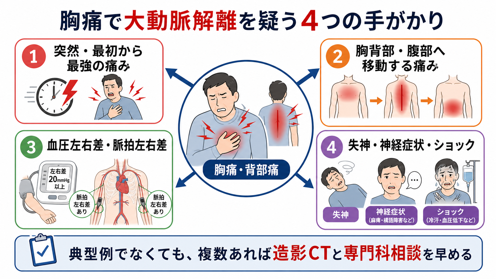
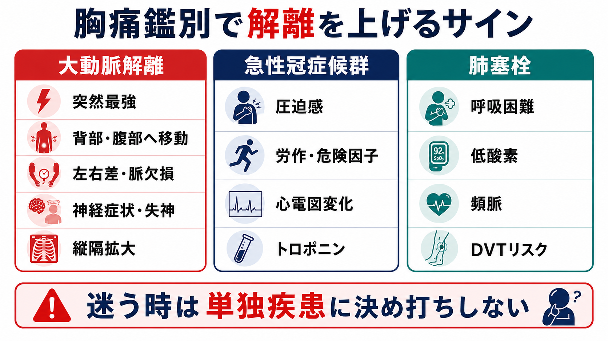
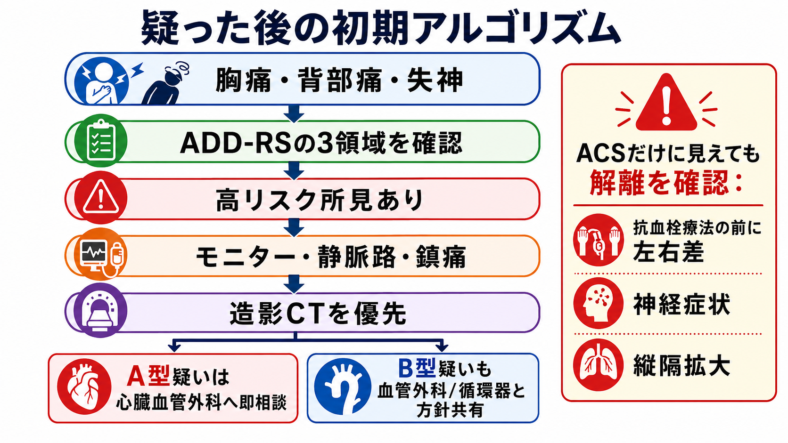

---
title: "胸痛で大動脈解離を疑う所見は何か"
description: "痛みの性状、血圧左右差、神経症状、失神、縦隔拡大から急性大動脈解離を疑い、造影CTと専門科相談につなげるための実践的整理。"
aliases:
  - "胸痛と大動脈解離"
tags:
  - 領域/救急・初期対応
  - 種類/クリニカルクエスチョン
  - 対象/研修医
question: "胸痛で大動脈解離を疑う所見は何か"
clinical_area: "救急・初期対応"
audience: "研修医"
evidence_level: "mixed"
created: "2026-04-27"
updated: "2026-04-27"
enableToc: true
---

# 胸痛で大動脈解離を疑う所見は何か

> このノートは研修医教育のための一般的整理であり、個別患者への診断・治療指示ではありません。緊急性が高い、判断に迷う、施設方針が関わる場合は上級医・専門科に相談してください。

## クリニカルクエスチョン

胸痛・背部痛で来院した患者で、どの所見がそろうと急性大動脈解離を疑い、造影CTや心臓血管外科・循環器への早期相談につなげるべきか。

## まず結論

- 大動脈解離は「突然発症」「発症時から最強」「裂けるような胸背部痛」「痛みの移動」だけでなく、失神、神経症状、ショック、脈拍左右差、血圧左右差、臓器虚血で発症する。典型的な胸痛がないこともあるため、単一所見で否定しない [1], [2], [3]。
- 研修医は、胸痛を見たら ACS、肺塞栓、気胸と並べて「解離を上げる所見」を意識的に確認する。特に抗血小板薬・抗凝固薬・血栓溶解へ進む前に、左右差、神経症状、背部痛、縦隔拡大を再確認する [3], [4]。
- ADD-RS は、ハイリスク背景、ハイリスク疼痛、ハイリスク身体所見の3領域で疑いを構造化する道具である。低リスク例では Dダイマーとの組み合わせが除外補助になるが、疑いが高い例で造影CTを遅らせる検査ではない [4], [5]。
- 胸部X線の縦隔拡大や異常大動脈陰影は疑いを上げるが、正常X線で解離は否定できない。診断の中心は造影CTで、TEEやMRIは状況に応じて選択される [3], [6]。
- A型解離は時間依存性に死亡率が上がる疾患であり、疑った時点でモニター、静脈路、鎮痛、血圧・心拍管理の準備、専門科相談を並行する [1], [3]。

## 判断の型

1. **痛みを聞く**  
   「突然か」「発症時が最大か」「胸から背部・腹部・腰へ移動したか」「裂けるような、今までにない痛みか」を短く確認する。痛みが軽くなっていても、発症時の性状を聞く。

2. **左右差と灌流を測る**  
   両上肢血圧、橈骨・大腿・足背動脈、四肢冷感、尿量、腹痛、下肢痛を見る。収縮期血圧差 20 mmHg 程度、脈拍欠損、四肢虚血は疑いを上げる [3], [4]。

3. **神経症状と失神を拾う**  
   意識障害、失神、一過性片麻痺、構音障害、めまい、対麻痺は、頸動脈・脊髄・脳灌流障害として解離の入口になり得る [1], [2]。

4. **胸部X線と心電図を「除外」ではなく「分岐」に使う**  
   縦隔拡大、胸水、異常大動脈陰影があれば疑いを上げる。心電図変化やトロポニン上昇があっても、冠動脈入口部解離や臓器虚血を伴う解離はあり得る [2], [3]。

5. **疑いが残れば造影CTへ進める**  
   安定して搬送できるなら胸腹部造影CTを検討する。不安定、造影不可、ベッドサイド判断が必要な場合は、上級医とTEE、心エコー、転送を含めて決める [3], [6]。

## 初期対応

- **最初にABCDEとモニター**: 気道、呼吸、循環、意識、体温を確認し、心電図モニター、SpO2、頻回血圧、静脈路を確保する。ショック、意識障害、持続する強い痛みがあれば処置室で上級医へ同時共有する。
- **痛みを先に下げる**: 疼痛・不安は交感神経を上げるため、鎮痛は診断を遅らせない範囲で早めに行う。鎮痛後に症状が軽くなっても解離の疑いは消えない。
- **両上肢血圧と脈拍を記録**: 初回トリアージで片側だけ測って終えない。左右差がない解離もあるが、差があれば診断前確率が上がる [3], [4]。
- **抗血栓療法の前に立ち止まる**: ACSに見える症例で、背部痛、血圧左右差、神経症状、縦隔拡大、失神があれば、抗凝固・血栓溶解を始める前に上級医へ確認する [3], [4]。
- **画像前に搬送安全性を確認**: 造影CTへ送る前に、血圧、意識、酸素化、点滴ルート、付き添い、急変時対応をチームでそろえる。

## 鑑別・見逃し

| 優先度 | 疾患・病態 | 見逃しやすい理由 | 手がかり |
|---|---|---|---|
| 高 | 急性大動脈解離 | 痛みが軽快する、ACS・脳卒中・腹痛として見える | 突然発症、発症時最大、移動痛、血圧左右差、脈拍欠損、神経症状、失神、縦隔拡大 |
| 高 | 急性冠症候群 | 解離でも心電図変化やトロポニン上昇を伴うことがある | 圧迫感、冷汗、危険因子、心電図変化。ただし背部痛・左右差・神経症状があれば解離も残す |
| 高 | 肺塞栓 | 胸痛、失神、ショックが重なる | 呼吸困難、低酸素、頻脈、DVTリスク、右心負荷 |
| 高 | 緊張性気胸 | 急な胸痛・ショックで重なる | 片側呼吸音低下、頸静脈怒張、気管偏位、外傷・処置歴 |
| 高 | 心タンポナーデ | A型解離の合併としても起こる | 低血圧、頸静脈怒張、心音減弱、心エコーで心嚢液 |
| 中 | 食道破裂 | 胸背部痛、ショック、縦隔異常で重なる | 嘔吐後発症、皮下気腫、発熱、縦隔気腫 |
| 中 | 胆石・膵炎・腎疝痛 | 腹部・背部痛として来る | 腹部所見、尿所見、肝胆膵酵素。ただし突然発症・虚血所見があれば解離を残す |

## 検査

| 検査 | 目的 | 注意点 |
|---|---|---|
| 両上肢血圧・四肢脈拍 | 左右差、脈拍欠損、灌流障害を拾う | 差がなくても否定しない。反復測定し、測定条件も確認する |
| 12誘導心電図 | ACS、不整脈、冠動脈入口部病変の確認 | 心電図異常があっても解離を除外しない |
| 胸部X線 | 縦隔拡大、胸水、異常大動脈陰影を拾う | 正常X線で解離は否定できない [3], [6] |
| Dダイマー | 低リスク例の除外補助 | ADD-RS など検査前確率と組み合わせる。高リスク例のCT遅延理由にしない [5] |
| 造影CT | 解離の有無、範囲、分枝虚血、破裂所見の評価 | 腎機能、造影剤アレルギー、妊娠可能性、搬送リスクを確認しつつ、緊急度と利益を上級医と判断する [3], [6] |
| 心エコー・TEE | 心タンポナーデ、大動脈弁逆流、上行大動脈、左室機能の確認 | CTへ行けない不安定例や術前評価で有用。実施可否は施設体制に依存する [3] |

## 治療・マネジメント

- **診断前から専門科相談を早める**: A型疑い、ショック、心タンポナーデ、神経症状、下肢・腸管・腎虚血、持続痛では、画像完了を待たず心臓血管外科・循環器・救急上級医へ共有する [1], [3]。
- **血圧・心拍管理は「単独判断で薬を入れる」よりチーム方針**: 急性大動脈症候群では、疼痛管理とともに血圧・心拍数を下げる治療が検討される。降圧だけで反射性頻脈を作らないよう、β遮断薬と血管拡張薬の順序を上級医と確認する [3], [6]。
- **不安定例はCT搬送よりベッドサイド方針決定が優先になる**: 心タンポナーデ、破裂、重度ショック、気道・呼吸不安定では、搬送中急変のリスクを踏まえ、TEE、心エコー、手術室直行、転送を含めて判断する。
- **日本での注意**: 使用できる降圧薬、β遮断薬、集中治療・手術・ステントグラフトの運用は施設差が大きい。ランジオロール、ニカルジピンなどの薬剤は国内添付文書、院内採用薬、禁忌、保険適用、用法用量を確認し、研修医単独で開始しない [7], [8]。
- **造影CTの注意**: ヨード造影剤の副作用、腎機能、アレルギー歴、妊娠可能性を確認する。ただし、解離疑いが強い場合は検査リスクと診断遅延リスクを上級医と明示的に比較する [3], [9]。

## 図解

## 指導医に確認するポイント

- この患者の ADD-RS は何点相当か。ハイリスク背景、疼痛、身体所見のどこで疑いが上がったか。
- 造影CTへ今すぐ行ける状態か。搬送中急変、腎機能、造影剤アレルギー、妊娠可能性をどう扱うか。
- ACSとして抗血小板薬・抗凝固薬を開始する前に、解離をどの程度下げたか。
- A型疑い、B型疑い、分枝虚血疑いで、どの専門科へどの順番で連絡するか。
- 降圧・心拍管理の目標、使う薬剤、禁忌、院内プロトコルは何か。

## 患者説明

- 「命に関わる胸や背中の血管の病気が隠れていないかを確認します。痛みが少し軽くなっても、血管の病気は残ることがあります。」
- 「左右の血圧、脈、神経症状、胸の写真やCTを組み合わせて判断します。必要なら造影剤を使うCTを急いで行います。」
- 「胸痛、背部痛、失神、しびれ・麻痺、ろれつが回らない、息苦しさ、冷汗、痛みの再燃があれば、我慢せずすぐ知らせてください。」
- 「院外や帰宅後に同じような急な胸背部痛、失神、麻痺、強い息苦しさが出た場合は、地域の救急相談や119番通報を含めて、待たずに助けを求める症状です」[10]。
- 「この説明は一般的な方針です。検査や治療は、今の状態、腎機能、アレルギー、妊娠可能性、施設体制を確認して決めます。」

## ピットフォール

- 「胸痛がない」「心電図変化がある」「トロポニンが上がった」だけで解離を外す。
- 痛みが軽くなった後に、発症時の最大強度や移動痛を聞き忘れる。
- 血圧を片側だけ測り、左右差・脈拍欠損を記録しない。
- 胸部X線が正常だから解離なし、と判断する。
- Dダイマー陰性を、高リスク例の除外根拠として使う。
- ACS疑いで抗凝固・血栓溶解へ進む前に、背部痛・神経症状・縦隔拡大を再確認しない。
- 画像検査に行くことだけに集中し、CT室への搬送安全性を確認しない。

## 関連ノート

- [[救急外来で見逃してはいけないレッドフラッグをどう拾うか]]
- [[救急患者で上級医を呼ぶタイミングはどう判断するか]]
- [[救急外来で初期検査セットはどのように選ぶか]]
- [[救急外来で診断がつかない患者をどうマネジメントするか]]
- 作成候補: 胸痛患者で急性冠症候群をどう初期評価するか
- 作成候補: 胸痛で肺塞栓を疑う所見は何か
- 作成候補: 造影CTを急ぐべき救急疾患は何か

## MOC更新候補

- [[MOC｜救急・初期対応]]
- MOC｜心電図・循環器.md（本サイト外）

## 参考文献

[1] 日本循環器学会. 2020年改訂版 大動脈瘤・大動脈解離診療ガイドライン. https://www.j-circ.or.jp/cms/wp-content/uploads/2020/07/JCS2020_Ogino.pdf

[2] 国立循環器病研究センター. 大動脈瘤と大動脈解離. https://www.ncvc.go.jp/hospital/pub/knowledge/disease/aortic-aneurysm_dissection/

[3] Isselbacher EM, Preventza O, Black JH 3rd, et al. 2022 ACC/AHA Guideline for the Diagnosis and Management of Aortic Disease. Circulation. 2022. https://doi.org/10.1161/CIR.0000000000001106

[4] Rogers AM, Hermann LK, Booher AM, et al. Sensitivity of the Aortic Dissection Detection Risk Score, a Novel Guideline-Based Tool for Identification of Acute Aortic Dissection at Initial Presentation. Circulation. 2011. https://doi.org/10.1161/CIRCULATIONAHA.110.988568

[5] Nazerian P, Mueller C, Soeiro AM, et al. Diagnostic Accuracy of the Aortic Dissection Detection Risk Score Plus D-Dimer for Acute Aortic Syndromes: The ADvISED Prospective Multicenter Study. Circulation. 2018. https://doi.org/10.1161/CIRCULATIONAHA.117.029457

[6] Erbel R, Aboyans V, Boileau C, et al. 2014 ESC Guidelines on the diagnosis and treatment of aortic diseases. European Heart Journal. 2014. https://doi.org/10.1093/eurheartj/ehu281

[7] PMDA. オノアクト点滴静注用50mg／150mg（ランジオロール塩酸塩）医療用医薬品情報. https://www.pmda.go.jp/PmdaSearch/rdSearch/02/2123404D1033?user=1

[8] PMDA. ニカルジピン塩酸塩注射液 医療用医薬品情報. https://www.pmda.go.jp/PmdaSearch/rdSearch/02/2149400A2155?user=1

[9] PMDA. X線造影剤に関する添付文書改訂情報（イオジキサノール、イオヘキソール等）. https://www.pmda.go.jp/files/000235796.pdf

[10] 総務省消防庁. 緊急度判定プロトコル Ver.3. https://www.fdma.go.jp/mission/enrichment/appropriate/appropriate002.html

## 更新ログ

- 2026-04-27: 初版作成。
