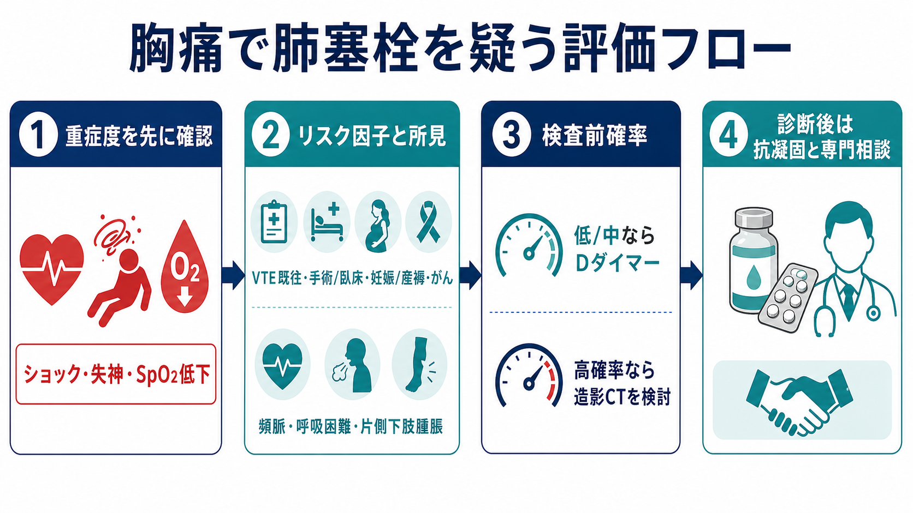
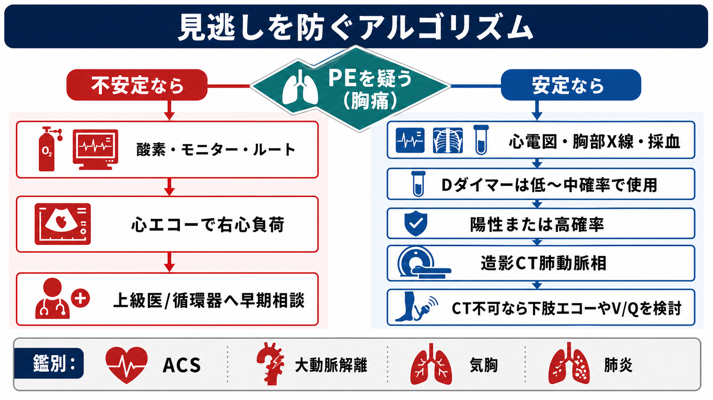
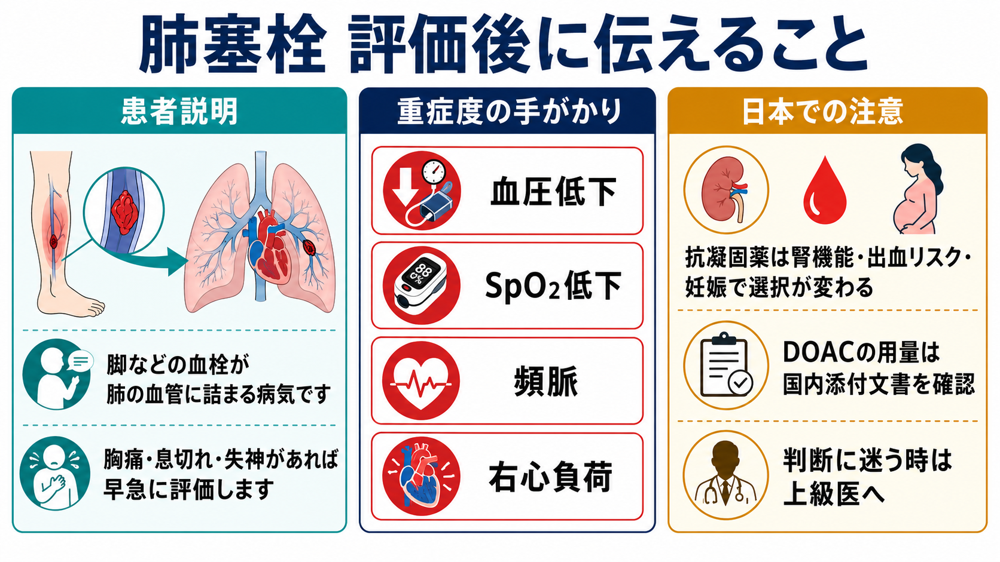

---
title: "胸痛で肺塞栓を疑ったらどう評価するか"
description: "胸痛で肺塞栓を疑う場面で、リスク因子、SpO2低下、頻脈、Dダイマー、造影CTの適応を検査前確率に沿って整理する。"
aliases:
  - "胸痛と肺塞栓"
tags:
  - 領域/救急・初期対応
  - 種類/クリニカルクエスチョン
  - 対象/研修医
question: "胸痛で肺塞栓を疑ったらどう評価するか"
clinical_area: "救急・初期対応"
audience: "研修医"
evidence_level: "guideline/review/mixed"
created: "2026-04-27"
updated: "2026-04-27"
enableToc: true
---

# 胸痛で肺塞栓を疑ったらどう評価するか

> このノートは研修医教育のための一般的整理であり、個別患者の診断・治療指示ではありません。緊急性が高い、判断に迷う、施設方針が関わる場合は上級医・専門科に相談してください。

## クリニカルクエスチョン

胸痛で肺塞栓を疑ったとき、リスク因子、SpO2低下、頻脈、Dダイマー、造影CTの適応をどう整理して評価するか。

## まず結論

- 肺塞栓を疑ったら、最初に「血行動態が不安定か」を見る。ショック、失神、低血圧、SpO2低下、呼吸仕事量増大があれば、診断を待たずに酸素、モニター、静脈路、上級医・循環器/救急/集中治療への相談を始める [1][5]。
- 安定している患者では、症状だけでDダイマーや造影CTへ直行せず、リスク因子と所見から検査前確率を見積もる。低リスクならPERC、低〜中等度リスクならDダイマー、高リスクならDダイマーで除外せず造影CT肺動脈相を検討する [1][2][5][6]。
- Dダイマーは「低〜中等度の検査前確率で陰性なら除外に使う」検査であり、陽性だけで肺塞栓と診断しない。高齢、感染、がん、妊娠、術後、入院中では偽陽性が増える [1][5][7]。
- 造影CTは肺塞栓診断の中心だが、腎機能、造影剤アレルギー、妊娠、循環不安定で搬送困難な状況では、下肢静脈エコー、心エコー、換気血流シンチグラフィなどを施設方針に沿って組み合わせる [1][5]。
- 日本で治療へ進む場合、抗凝固薬の選択と用量は国内添付文書、腎機能、体重、出血リスク、妊娠可能性、血栓溶解や塞栓摘除の必要性で変わる。DOACを「不安定な肺塞栓のヘパリン代替」として安易に使わない [4]。

## 判断の型

1. **危険な胸痛として同時並行で見る**  
   肺塞栓だけに寄せすぎず、ACS、大動脈解離、緊張性気胸、心タンポナーデ、重症肺炎も同時に拾う。バイタル、意識、SpO2、心電図、胸部X線、採血を並行して進める [5]。
2. **肺塞栓らしさを上げる情報を集める**  
   VTE既往、最近の手術・外傷・長期臥床、悪性腫瘍、妊娠・産褥、エストロゲン製剤、片側下肢腫脹、突然の呼吸困難、胸膜痛、血痰、頻脈を確認する [1][3]。
3. **検査前確率で次の検査を選ぶ**  
   低リスクかつPERC陰性なら追加検査を避けられる場合がある。低〜中等度リスクではDダイマー陰性で除外を考える。高リスクではDダイマー陰性に頼らず造影CTを検討する [5][6]。
4. **診断後は重症度をもう一度見る**  
   低血圧、SpO2低下、右心負荷、心筋トロポニン上昇、腎機能低下、sPESI項目を確認し、入院先、抗凝固、血栓溶解、カテーテル治療、外科的塞栓摘除の要否を上級医と判断する [5][9]。

## 初期対応

- ABCDEで評価し、SpO2低下や呼吸困難があれば酸素投与、心電図モニター、血圧反復測定、静脈路確保を行う。ショックや意識障害がある場合は初期対応と専門相談を先行する [1][5]。
- 心電図はACSや頻脈性不整脈の評価にも必要。肺塞栓では洞性頻脈、右心負荷所見などが出ることがあるが、正常でも否定できない。
- 胸部X線は肺塞栓の除外検査ではないが、気胸、肺炎、心不全、胸水などの鑑別と、換気血流シンチグラフィを考える際の背景評価に役立つ [5]。
- 採血はDダイマーだけでなく、血算、腎機能、肝機能、凝固、心筋トロポニン、BNP/NT-proBNP、動脈血/静脈血ガスを状況に応じて確認する。造影CT前には腎機能と造影剤歴を確認する。
- 妊娠可能性がある患者では、妊娠反応と被ばく・造影剤の相談が必要。施設の産婦人科、放射線科、救急科の運用に従う。

## 鑑別・見逃し

| 優先度 | 疾患・状態 | 見逃さない理由 | 手がかり |
|---|---|---|---|
| 高 | 急性冠症候群 | 胸痛の最重要鑑別で、再灌流や抗血栓療法の時間依存性が高い | 圧迫感、冷汗、心電図変化、トロポニン上昇 |
| 高 | 大動脈解離 | 抗凝固が害になる可能性があり、肺塞栓と初期症状が重なる | 突然の裂ける痛み、左右差、神経症状、縦隔拡大 |
| 高 | 緊張性気胸 | 画像を待たず処置が必要になることがある | 片側呼吸音低下、低血圧、頸静脈怒張、急な低酸素 |
| 高 | 肺塞栓 | 胸痛、呼吸困難、失神、頻脈、SpO2低下が非特異的で見逃されやすい | VTEリスク、片側下肢腫脹、突然発症、右心負荷 |
| 中 | 肺炎・胸膜炎 | 胸膜痛と低酸素で肺塞栓に似る | 発熱、咳嗽、炎症反応、浸潤影 |
| 中 | 心不全・不整脈 | 呼吸困難、低酸素、頻脈を説明しうる | ラ音、浮腫、BNP上昇、心電図異常 |

## 検査

| 検査 | 目的 | 注意点 |
|---|---|---|
| 心電図 | ACS、不整脈、右心負荷の評価 | 正常でも肺塞栓は否定できない |
| 胸部X線 | 気胸、肺炎、心不全などの鑑別 | 肺塞栓の感度は不十分 |
| Dダイマー | 低〜中等度リスクでの除外 | 高確率例の除外には使わない。陽性だけで診断しない [1][5][7] |
| 造影CT肺動脈相 | 肺動脈内血栓の確認 | 高確率、Dダイマー陽性、重症所見で検討。腎機能、造影剤歴、妊娠を確認 [1][5] |
| 下肢静脈エコー | DVTの確認、CT困難時の補助 | 陽性ならVTEとして治療判断に直結しうるが、陰性で肺塞栓は否定できない |
| 心エコー | 不安定例の右心負荷評価 | 右心負荷は重症度判断に有用。安定例の除外検査ではない [5] |
| トロポニン、BNP/NT-proBNP | 右心負荷・予後評価 | 診断そのものより重症度層別化に使う |

### Dダイマーの使い方

- 低〜中等度の検査前確率で、感度の高いDダイマーが陰性なら、肺塞栓を除外できる可能性が高い [5][6]。
- 50歳超では年齢調整カットオフがCT削減に有用とされる。FEU表記の高感度Dダイマーでは「年齢×10 μg/L」が代表的だが、施設の測定単位、基準値、DDU/FEUの違いを必ず確認する [6][7]。
- YEARSなど、Dダイマー閾値を臨床項目と組み合わせる戦略もあるが、院内で採用されたプロトコルがない場合は独自運用しない [8]。

### 造影CTを強く考える場面

- 検査前確率が高い。
- Dダイマーが陽性で、肺塞栓を説明しうる症状・所見がある。
- ショック、低血圧、失神、持続するSpO2低下、右心負荷など、見逃した場合の害が大きい。
- 代替診断が不十分で、肺塞栓の診断が抗凝固や入院先の判断を変える。

## 治療・マネジメント

- 診断が確定または強く疑われ、出血リスクが許容される場合は、抗凝固の開始時期を上級医と相談する。画像検査が遅れる高リスク例では、施設プロトコルに沿って経験的抗凝固を検討することがある [5]。
- 血行動態が不安定な肺塞栓では、未分画ヘパリン、血栓溶解、カテーテル治療、外科的塞栓摘除、ECMOなどの選択肢が絡むため、循環器、救急、集中治療、放射線、心臓血管外科に早期相談する [1][5]。
- 低リスク肺塞栓では外来治療が可能な患者もあるが、PESI/sPESIやHestia基準、出血リスク、社会的背景、フォロー体制を満たすことが前提であり、研修医単独で帰宅判断しない [5][6][9]。
- **日本での注意:** DOACは国内で静脈血栓塞栓症の治療・再発抑制に使われるが、薬剤ごとに初期用量、腎機能・体重による調整、禁忌・慎重投与が異なる。PMDAの電子添文では、ショックや低血圧が遷延する肺塞栓、血栓溶解や塞栓摘除が必要な肺塞栓では、ヘパリン代替として投与しない旨の注意が示されている薬剤がある [4]。
- 妊娠、授乳、重度腎機能障害、活動性出血、最近の手術・外傷、頭蓋内病変、抗血小板薬併用では、抗凝固薬の選択とタイミングを必ず上級医と確認する。

## 図解

## 指導医に確認するポイント

- この患者の検査前確率は低、中、高のどれとして扱うか。PERCやDダイマーで止めてよいか。
- 造影CTの適応、腎機能、造影剤アレルギー、妊娠可能性、検査搬送の安全性はどうか。
- 不安定例で、心エコー、下肢静脈エコー、抗凝固、血栓溶解、カテーテル治療をどの順に進めるか。
- 抗凝固開始前に、大動脈解離、活動性出血、頭蓋内病変、最近の手術・外傷をどこまで除外できているか。
- 入院先、モニター管理、酸素需要、PESI/sPESI、帰宅可否の判断を誰と共有するか。

## 患者説明

- 「肺塞栓は、脚などにできた血のかたまりが肺の血管に流れて詰まる病気です。胸の痛み、息切れ、脈が速い、酸素が低い、失神などで疑います。」
- 「血液検査だけで決まる病気ではなく、危険度を見積もったうえで、必要なら造影CTなどで確認します。」
- 「治療では血を固まりにくくする薬を使うことがありますが、出血しやすくなるため、腎機能、妊娠、最近の手術、他の薬を確認して選びます。」
- 「症状が強い、血圧や酸素が不安定、右心臓に負担がある場合は、専門科と相談しながら入院で慎重にみます。」

## ピットフォール

- Dダイマー陽性を肺塞栓診断として扱う。Dダイマーは非特異的で、感染、がん、妊娠、術後、高齢、入院中で上がりやすい [7]。
- 高確率例でDダイマー陰性を理由に終了する。検査前確率が高い場合は画像診断へ進める [1,5]。
- SpO2が正常だから肺塞栓を否定する。小〜中等量の肺塞栓では酸素化が保たれることがある。
- 胸痛を肺塞栓だけで説明し、ACSや大動脈解離を見落とす。抗凝固が害になる鑑別を先に意識する。
- 造影CT前に腎機能、造影剤歴、妊娠可能性、搬送中の急変リスクを確認しない。
- DOACを薬剤名だけで選び、国内添付文書の適応、初期用量、腎機能、出血リスク、不安定PEでの注意を確認しない [4]。

## 関連ノート

- 作成候補: 急性胸痛をどう初期評価するか
- 作成候補: Dダイマーをいつ使うか
- 作成候補: 造影CT前に確認すること
- 作成候補: 抗凝固薬開始前の出血リスク評価

## MOC更新候補

- [[MOC｜救急・初期対応]]
- MOC｜呼吸器.md（本サイト外）
- MOC｜検査・画像・手技.md（本サイト外）
- MOC｜薬剤・処方・副作用.md（本サイト外）

## 参考文献

[1] 日本循環器学会/日本肺高血圧・肺循環学会. 2025年改訂版 肺血栓塞栓症・深部静脈血栓症および肺高血圧症に関するガイドライン. https://www.j-circ.or.jp/cms/wp-content/uploads/2025/03/JCS2025_Tamura.pdf

[2] 孟真, 立石綾, 原田裕輔. 「肺血栓塞栓症・深部静脈血栓症および肺高血圧症に関するガイドライン（2025年改訂版）」における静脈血栓塞栓症の診断. 日本血栓止血学会誌. 2025;36(6):737-743. https://doi.org/10.2491/jjsth.36.737

[3] 厚生労働省/PMDA. 重篤副作用疾患別対応マニュアル 血栓症. 2021年4月改定. https://www.pmda.go.jp/files/000240127.pdf

[4] PMDA. エリキュース錠2.5mg/5mg 医療用医薬品情報（電子添文）. 2026年3月6日改訂. https://www.pmda.go.jp/PmdaSearch/rdSearch/02/3339004F2025?user=1

[5] Konstantinides SV, Meyer G, Becattini C, et al. 2019 ESC Guidelines for the diagnosis and management of acute pulmonary embolism developed in collaboration with the ERS. European Heart Journal. 2020;41(4):543-603. https://doi.org/10.1093/eurheartj/ehz405

[6] American College of Emergency Physicians. Clinical Policy: Acute Venous Thromboembolic Disease. https://www.acep.org/patient-care/clinical-policies/acute-venous-thromboembolic-disease/

[7] Righini M, Van Es J, Den Exter PL, et al. Age-adjusted D-dimer cutoff levels to rule out pulmonary embolism: the ADJUST-PE study. JAMA. 2014;311(11):1117-1124. https://doi.org/10.1001/jama.2014.2135

[8] van der Hulle T, Cheung WY, Kooij S, et al. Simplified diagnostic management of suspected pulmonary embolism (the YEARS study): a prospective, multicentre, cohort study. The Lancet. 2017;390(10091):289-297. https://doi.org/10.1016/S0140-6736(17)30885-1

[9] Jiménez D, Aujesky D, Moores L, et al. Simplification of the Pulmonary Embolism Severity Index for Prognostication in Patients With Acute Symptomatic Pulmonary Embolism. Archives of Internal Medicine. 2010;170(15):1383-1389. https://doi.org/10.1001/archinternmed.2010.199

## 更新ログ

- 2026-04-27: 初版作成。
