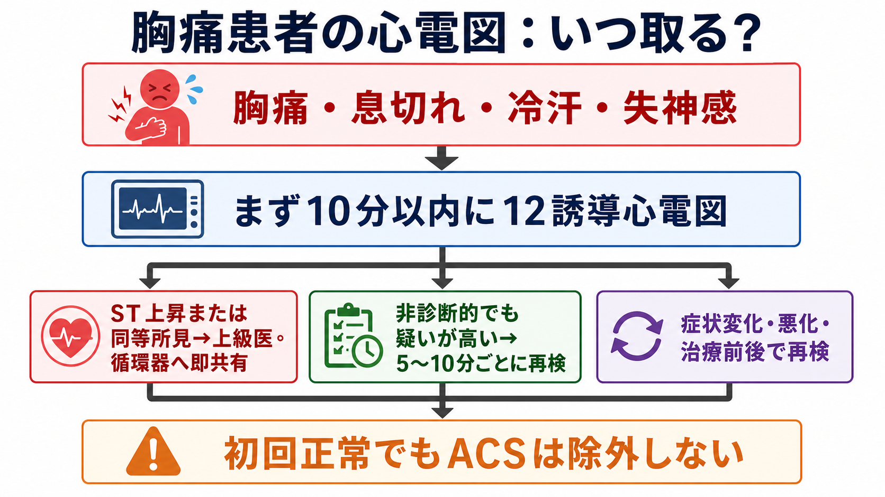
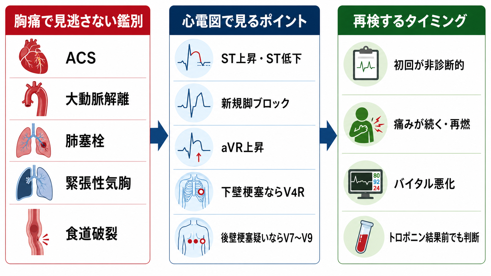
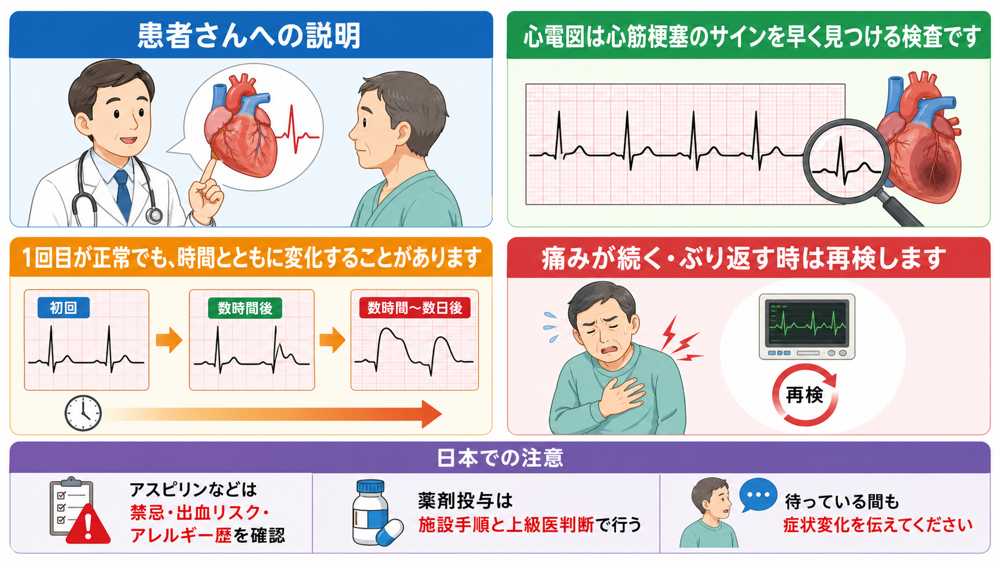

---
title: "胸痛患者で心電図はいつ取るべきか"
description: "急性冠症候群を見逃さないため、来院早期の心電図評価と再検の重要性を学ぶ。"
aliases:
  - "胸痛の心電図"
tags:
  - 領域/救急・初期対応
  - 種類/クリニカルクエスチョン
  - 対象/研修医
question: "胸痛患者で心電図はいつ取るべきか"
clinical_area: "救急・初期対応"
audience: "研修医"
evidence_level: "guideline"
created: "2026-04-27"
updated: "2026-04-27"
enableToc: true
---

# 胸痛患者で心電図はいつ取るべきか

> このノートは研修医教育のための一般的整理であり、個別患者への診断・治療指示ではありません。緊急性が高い、判断に迷う、施設手順が関わる場合は上級医・専門科に相談してください。

## クリニカルクエスチョン

胸痛患者で心電図はいつ取るべきか。

## まず結論

- 胸痛、胸部圧迫感、息切れ、冷汗、失神感、上腹部痛、顎・肩・背部への放散痛などで急性冠症候群（ACS）が鑑別に入る患者では、来院または最初の医療接触から10分以内に12誘導心電図を記録し、解釈まで終えることを目標にする[1][2][3][4]。
- 初回心電図が正常または非診断的でも、ACSは除外できない。痛みが続く、再燃する、バイタルが悪化する、臨床的に疑いが高い場合は、反復して12誘導心電図を取る[1][2][3]。
- 日本循環器学会のACSガイドラインでは、急性心筋梗塞を強く疑うが初回心電図が診断的でない場合、5〜10分間隔で12誘導心電図を反復することが推奨されている[1]。
- 下壁STEMIでは右室梗塞評価のためV4R、後壁梗塞を疑う場合はV7〜V9を追加する。標準12誘導だけで安心しない[1][2][4]。
- 心電図は「一度取って終わり」ではなく、症状・バイタル・トロポニン・過去心電図との比較と一緒に、時間経過で見直す検査である[2][3][4]。

## 判断の型

1. **ACSを疑う症状か**  
   典型的な胸痛だけでなく、胸部圧迫感、息切れ、冷汗、悪心、失神感、上腹部痛、顎・肩・背部痛も胸痛相当症状として扱う。高齢者、糖尿病、女性では症状が非典型的になり得る[3]。
2. **まず10分以内に12誘導心電図**  
   診察、採血、胸部X線、トロポニン結果を待ってからでは遅い。トリアージでACSが鑑別に入った時点で、心電図を先に走らせる[1][2][3][4]。
3. **初回心電図で危険所見があれば即共有**  
   ST上昇、ST低下、aVR上昇、急性冠閉塞を示唆する所見、新規または虚血を疑う脚ブロック、徐脈・頻脈性不整脈、血行動態不安定を見たら、上級医・循環器・救急チームへその場で共有する[2][4]。
4. **非診断的でも疑いが高ければ再検**  
   痛みが続く、再燃する、冷汗や嘔気が強い、血圧低下、SpO2低下、過去心電図と違う、トロポニン結果を待つ間に悪化した、という場合は反復心電図を取る[1][2][3]。
5. **追加誘導を忘れない**  
   下壁梗塞ではV4R、後壁梗塞を疑うV1〜V3のST低下や症状持続ではV7〜V9を追加する[1][2][4]。

## 初期対応

- ABCDE、バイタル、意識、ショック徴候を同時に確認する。心電図は初期対応の一部であり、採血や画像検査より前に遅らせない。
- 胸痛患者を待合や処置室で待たせる場合でも、最初に「心電図が必要な胸痛か」を判断する。
- 12誘導心電図を取ったら、紙または画面をその場で確認する。記録だけして未読のままにしない。
- 過去心電図があれば比較する。左室肥大、脚ブロック、ペーシング、早期再分極などは虚血所見を隠したり紛らわしくしたりする[3]。
- STEMI相当または急性冠閉塞を疑う所見では、カテーテル室起動や転送を含めて施設手順に沿い、上級医へ直ちに相談する[2][4]。

## 鑑別・見逃し

- **ACS**: 初回心電図が正常でも除外しない。症状が続くなら再検し、トロポニン陰性の初回値だけで安心しない[2][3]。
- **大動脈解離**: 突然発症、背部移動痛、左右差、神経症状、ショック、縦隔拡大を確認する。ACSに見えても抗血栓薬が危険になることがある。
- **肺塞栓**: 呼吸困難、頻呼吸、低酸素、失神、DVTリスクを確認する。心電図は補助所見にとどまる。
- **緊張性気胸**: 呼吸音左右差、頸静脈怒張、ショック、気管偏位を確認する。心電図より先に生命危機対応が必要なことがある。
- **心膜炎・心筋炎**: びまん性ST上昇、PR低下、発熱、感染後、心嚢液を考える。
- **食道破裂・消化管疾患**: 嘔吐後胸痛、皮下気腫、腹膜刺激症状を確認する。

## 検査

- **12誘導心電図**: ACSが鑑別に入る急性胸痛では10分以内を目標に取得・読影する[1][2][3][4]。
- **反復12誘導心電図**: 初回非診断的、症状持続・再燃、臨床状態悪化、ACS疑いが高い場合に行う。JCSでは強く疑う急性心筋梗塞で初回非診断的なら5〜10分間隔が推奨される[1]。
- **追加誘導**: 下壁STEMIではV4R、後壁梗塞を疑う場合はV7〜V9を追加する[1][2][4]。
- **心筋トロポニン**: できるだけ早く測定するが、心電図取得やSTEMI対応を待たせるための検査ではない[2][3][4]。
- **胸部X線・CT・心エコー**: 大動脈解離、肺塞栓、気胸、心嚢液などを疑う所見に応じて選ぶ。ACS評価と並行して、見逃し疾患を拾うために使う。

## 治療・マネジメント

- 心電図でSTEMIまたはSTEMI相当所見を疑った時点で、再灌流までの時間短縮を意識して上級医・循環器へ共有する[2][4]。
- 非ST上昇ACSを疑う場合も、心電図、トロポニン、症状、バイタル、リスク因子で短期リスクを評価し、施設のACS診療パスに乗せる[2][4]。
- 鎮痛、酸素、抗血小板薬、抗凝固薬などは施設手順と禁忌確認に沿って行う。特に酸素は低酸素がない患者への routine 投与ではなく、状態に応じて判断する。
- **日本での注意**: 抗血小板薬の用量や選択は海外ガイドラインと日本の承認用量で差がある。JCSではPCI前のアスピリン162〜200 mg、プラスグレルは日本で20 mg負荷・3.75 mg維持など、日本用量が示されている[1]。PMDAのバイアスピリン添付文書では、通常は100 mg 1日1回、症状により1回300 mgまで増量可、初期治療では噛み砕き・粉砕や常用量の数倍投与が望ましい旨が記載されている[5]。
- **日本での注意**: アスピリンは過敏症、消化性潰瘍、出血傾向、アスピリン喘息、出産予定日12週以内の妊婦などで禁忌がある[5]。2026年1月改訂のPMDA情報では、アスピリンの重大な副作用としてアレルギー反応に伴う急性冠症候群が追加されている[5][6]。

## 図解

## 指導医に確認するポイント

- この患者は「ACSを疑う胸痛」として10分以内心電図の対象か。
- 初回心電図にST上昇、ST低下、aVR上昇、脚ブロック、後壁・右室梗塞を疑う所見がないか。
- 初回心電図が非診断的でも、5〜10分間隔または症状変化時の再検が必要な状況か。
- 過去心電図と比べて新規変化があるか。
- 追加誘導（V4R、V7〜V9）を取るべき場面か。
- 抗血小板薬・抗凝固薬を開始する前に、大動脈解離や出血リスク、アレルギー、妊娠可能性をどう確認するか。

## 患者説明

- 「心電図は、心筋梗塞のサインを早く見つけるための検査です。」
- 「1回目が正常でも、心筋梗塞や狭心症の変化が時間とともに出てくることがあります。」
- 「胸の痛みが続く、ぶり返す、息苦しい、冷汗が出る、気分が悪くなる場合は、すぐに教えてください。もう一度心電図を確認します。」
- 「薬を使う場合は、アレルギー、出血しやすさ、胃潰瘍、喘息、妊娠の可能性などを確認してから判断します。」

## ピットフォール

- 「初回心電図が正常」だけでACSを除外する。
- トロポニン結果を待つために、STEMIを示す心電図の共有が遅れる。
- 心電図を記録したが、誰もすぐに読んでいない。
- V1〜V3のST低下を後壁梗塞のサインとして扱わず、V7〜V9を取らない。
- 下壁STEMIで右室梗塞を考えず、V4Rを取らない。
- 胸痛を筋骨格痛や胃痛と決めつけ、ACSのリスク評価を省略する。
- 抗血栓薬投与前に、大動脈解離、出血リスク、アスピリン喘息・過敏症を確認しない。

## 関連ノート

- [[救急外来で再評価はいつ何を見ればよいか]]
- [[救急外来で見逃してはいけないレッドフラッグをどう拾うか]]
- [[救急外来でバイタルサイン異常を見たとき何を優先して確認するか]]
- [[心原性ショックを疑う低血圧患者で何を確認するか]]
- [[頻脈と低血圧がある患者で不整脈治療を急ぐべきか]]

## MOC更新候補

- [[MOC｜救急・初期対応]]
- MOC｜心電図・循環器.md（本サイト外）

## 参考文献

[1] Kimura K, Kimura T, Ishihara M, et al. JCS 2018 Guideline on Diagnosis and Treatment of Acute Coronary Syndrome. Circ J. 2019;83(5):1085-1196. https://doi.org/10.1253/circj.CJ-19-0133

[2] Rao SV, O'Donoghue ML, Ruel M, et al. 2025 ACC/AHA/ACEP/NAEMSP/SCAI Guideline for the Management of Patients With Acute Coronary Syndromes. J Am Coll Cardiol. 2025;85(22):2135-2237. https://doi.org/10.1016/j.jacc.2024.11.009

[3] Gulati M, Levy PD, Mukherjee D, et al. 2021 AHA/ACC/ASE/CHEST/SAEM/SCCT/SCMR Guideline for the Evaluation and Diagnosis of Chest Pain. J Am Coll Cardiol. 2021;78(22):e187-e285. https://doi.org/10.1016/j.jacc.2021.07.053

[4] Byrne RA, Rossello X, Coughlan JJ, et al. 2023 ESC Guidelines for the management of acute coronary syndromes. Eur Heart J. 2023;44(38):3720-3826. https://doi.org/10.1093/eurheartj/ehad191

[5] PMDA. バイアスピリン錠100mg 医療用医薬品添付文書（2026年1月改訂 第4版）. https://www.pmda.go.jp/PmdaSearch/iyakuDetail/630004_3399007H1021_1_21

[6] PMDA. 改訂指示反映履歴：2026年01月13日 医薬安発0113第4号 別紙1. https://www.info.pmda.go.jp/kaiteip/20260113A004/01.pdf

## 更新ログ

- 2026-04-27: 初版作成。
