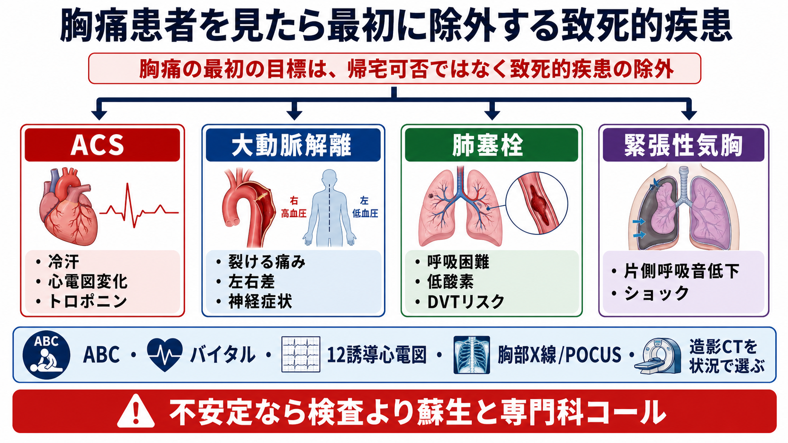
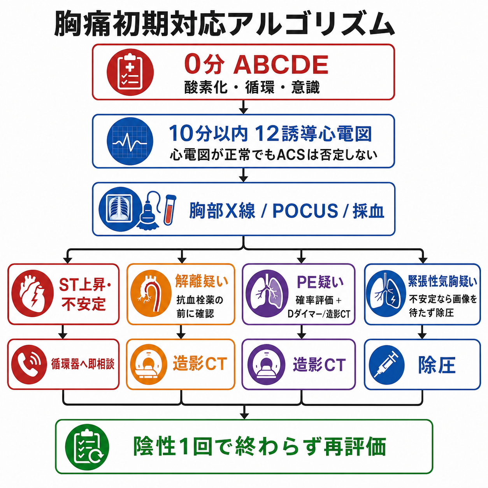
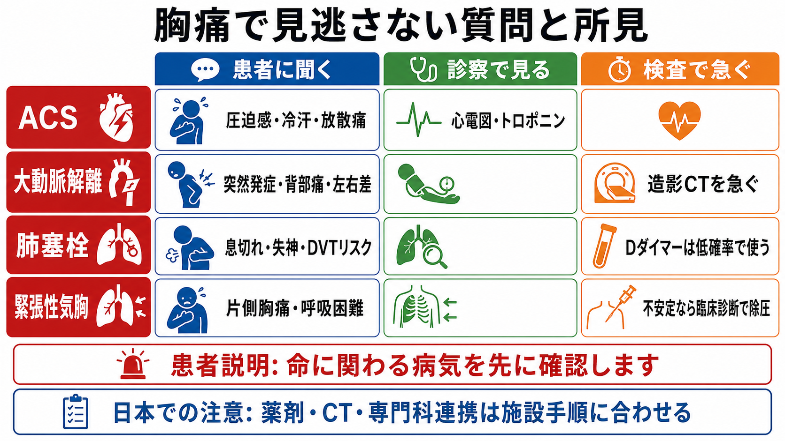

---
title: "胸痛患者を見たら最初に何を除外するか"
description: "急性冠症候群、大動脈解離、肺塞栓、緊張性気胸など致死的疾患を優先して評価する。"
aliases:
  - "胸痛初期対応"
tags:
  - 領域/救急・初期対応
  - 種類/クリニカルクエスチョン
  - 対象/研修医
question: "胸痛患者を見たら最初に何を除外するか"
clinical_area: "救急・初期対応"
audience: "研修医"
evidence_level: "guideline"
created: "2026-04-27"
updated: "2026-04-27"
enableToc: true
---

# 胸痛患者を見たら最初に何を除外するか

> このノートは研修医教育のための一般的整理であり、個別患者の診断・治療指示ではありません。緊急性が高い、判断に迷う、施設方針が関わる場合は上級医・専門科に相談してください。

## クリニカルクエスチョン

胸痛患者を見たら最初に何を除外するか。

## まず結論

- 胸痛の初期評価では、最初に「帰宅できるか」ではなく、短時間で死亡・後遺症につながる疾患を除外する。優先するのは急性冠症候群、急性大動脈症候群/大動脈解離、肺塞栓、緊張性気胸、心タンポナーデ、食道破裂などである[1][4][6][9]。
- 0分でABCDE、バイタル、意識、SpO2、左右差、片側呼吸音低下を確認し、不安定なら検査を待たず蘇生と上級医・専門科コールを並行する[4][9]。
- ACS疑いでは12誘導心電図を早期、目標として10分以内に記録・解釈し、症状が続く、または初回心電図が非診断的な場合は反復する[2][3]。
- 心電図と単回トロポニンが正常でもACSは否定しない。発症時刻、症状経過、リスク、反復心電図、経時的トロポニンで評価する[1][2][3]。
- 大動脈解離を疑う痛み、血圧左右差、神経症状、背部痛がある場合は、抗血栓薬を進める前に上級医へ相談し、造影CTなどで評価する[4][5]。
- 肺塞栓は症状・所見だけでは診断困難で、検査前確率を見積もる。低確率または高くない群ではDダイマー陰性が除外に有用だが、高確率ではDダイマー陰性だけで否定しない[6][7][8]。
- 日本での注意: 抗血小板薬・抗凝固薬、造影CT、心カテ、血栓溶解、胸腔ドレナージは施設手順と専門科連携に依存する。添付文書・禁忌・出血リスクを確認し、研修医単独で開始判断を完結させない[6][10]。

## 判断の型

1. **まず不安定を拾う。** ショック、低酸素、意識障害、持続する強い痛み、不整脈、片側呼吸音低下、頸静脈怒張、冷汗を見たら、診断名を確定する前に蘇生・モニター・応援要請を始める[9]。
2. **次に4大致死的疾患を同時に走査する。** ACS、大動脈解離、肺塞栓、緊張性気胸を「病歴」「身体所見」「心電図」「胸部画像/POCUS」「採血」で並行して確認する[1][4][6][9]。
3. **検査前確率で検査を選ぶ。** すべての胸痛に全検査を出すのではなく、症状の質、発症様式、リスク因子、バイタル、所見から、急ぐ検査と相談先を決める[2][6][7]。

## 初期対応

- 第一印象で重症感、会話可能性、呼吸仕事量、顔色、冷汗、体位を確認する。
- ABCDEに沿って、気道、呼吸、循環、意識、体表を評価する。SpO2、心電図モニター、血圧、脈拍、体温を取り、必要に応じて除細動器が使える環境に置く。
- 12誘導心電図を早期に記録し、過去心電図があれば比較する。ST上昇、ST低下、陰性T波、新規脚ブロック、致死性不整脈を確認する[2][3]。
- 血圧は可能なら両上肢で確認する。左右差、神経症状、背部痛、移動する痛みがあれば解離を意識する[4][5]。
- 呼吸音の左右差、気管偏位、頸静脈怒張、ショックを伴う片側胸痛では緊張性気胸を考え、不安定なら画像確認を待たない[9]。
- 造影CT、心カテ、胸腔処置、抗血栓療法が必要になりそうなら、早い段階で救急上級医、循環器、心臓血管外科、呼吸器/集中治療へ相談する。

## 鑑別・見逃し

| 優先度 | 疾患・状態 | 見逃さない理由 | 手がかり |
|---|---|---|---|
| 高 | 急性冠症候群 | 再灌流・抗血栓療法の遅れが予後に直結する | 圧迫感、冷汗、放散痛、労作誘発、糖尿病・CKD・高齢、心電図変化、トロポニン上昇[1][2][3] |
| 高 | 大動脈解離/急性大動脈症候群 | 破裂、心タンポナーデ、脳梗塞、臓器虚血を来す | 突然発症、最大強度で開始、背部痛、移動痛、血圧左右差、神経症状、Marfan症候群、妊娠・産褥[4][5] |
| 高 | 肺塞栓 | ショック、低酸素、突然死につながる | 呼吸困難、胸膜痛、失神、頻脈、低酸素、DVT症状、手術・長期臥床・悪性腫瘍・妊娠産褥[6][7][8] |
| 高 | 緊張性気胸 | 閉塞性ショックで急速に悪化する | 片側胸痛、呼吸困難、片側呼吸音低下、頸静脈怒張、低血圧、陽圧換気中、外傷・処置後[9] |
| 高 | 心タンポナーデ | 閉塞性ショックの原因になる | 低血圧、頸静脈怒張、心音減弱、外傷、悪性腫瘍、透析、POCUSで心嚢液 |
| 中 | 食道破裂 | 診断遅れで縦隔炎・敗血症を来す | 嘔吐後の胸痛、皮下気腫、発熱、重症感 |
| 中 | 心筋炎・心膜炎 | ACSと紛らわしく、不整脈・心不全を来す | 感染後、体位で変わる痛み、広範ST上昇、心嚢液、トロポニン上昇 |
| 中 | 胆道疾患、膵炎、消化性潰瘍、逆流性食道炎、筋骨格痛 | 致死的疾患除外後に検討する | 食事関連、圧痛、腹部所見、肝胆膵酵素 |

## 検査

| 検査 | 目的 | 注意点 |
|---|---|---|
| 12誘導心電図 | ACS、致死性不整脈、心膜炎などを拾う | 初回正常でもACSを否定しない。症状持続・変化時は反復する[2][3] |
| 心筋トロポニン | 心筋障害の検出、ACSリスク評価 | 発症早期は陰性のことがある。経時変化で判断する[1][2][3] |
| 胸部X線 | 気胸、縦隔拡大、肺炎、心不全、胸水の確認 | 不安定な緊張性気胸では画像を待たない[9] |
| POCUS | 心嚢液、右室負荷、肺スライディング、胸水、心機能を迅速評価 | 所見がないことだけでPEやACSを否定しない。術者依存性がある |
| Dダイマー | PE/DVTを低確率群で除外する補助 | 高確率では陰性でも除外に使いにくい。陽性は非特異的[6][7][8] |
| 造影CT | 大動脈解離、肺塞栓、他の胸腹部疾患の評価 | 腎機能、造影剤アレルギー、妊娠可能性、搬送中の安全性を確認する[4][6] |
| 採血一般 | 貧血、炎症、腎機能、凝固、電解質、肝胆膵疾患、治療前評価 | 検査値待ちで蘇生・心電図・専門科相談を遅らせない |

## 治療・マネジメント

- **不安定なら診断確定前に蘇生を優先する。** 酸素化、循環確保、モニター、除細動器準備、静脈路、応援要請を並行する。
- **ACS疑い:** 早期心電図、反復評価、トロポニン、循環器相談を行う。ST上昇または持続する虚血・不安定があれば再灌流戦略の検討を急ぐ[2][3]。
- **大動脈解離疑い:** 鎮痛、血圧・心拍管理、造影CT、心臓血管外科/循環器相談を優先する。解離があり得る状況で抗血栓薬を先行させると害になり得るため、上級医と確認する[4][5]。
- **肺塞栓疑い:** ショック・低血圧があれば高リスクPEとして早期に上級医・専門科へ相談する。安定例では検査前確率、Dダイマー、造影CT、下肢静脈エコーなどを組み合わせる[6][7][8]。
- **緊張性気胸疑い:** 低血圧や高度呼吸不全を伴い臨床的に強く疑う場合は、画像を待たず緊急除圧を検討し、その後に胸腔ドレナージなどの definitive management へつなぐ[9]。
- **日本での注意:** バイアスピリンなど抗血小板薬は国内添付文書と施設プロトコルを確認する。2026年1月時点のPMDA情報では、アスピリン含有製剤の安全性情報も更新されているため、アレルギー歴・喘息・出血リスクを含めて確認する[10]。

## 図解

## 指導医に確認するポイント

- この患者は「不安定」か。今すぐ蘇生・専門科コール・処置が必要か。
- ACS、大動脈解離、肺塞栓、緊張性気胸のうち、最も先に否定すべきものは何か。
- 抗血小板薬・抗凝固薬を開始してよい状況か。大動脈解離や出血性疾患の可能性は十分に低いか。
- 造影CTへ行く安全性はあるか。モニター、酸素、搬送者、急変時対応は整っているか。
- 帰宅を検討する場合、経時的心電図・トロポニン・バイタル再評価・説明・再受診指示は十分か。

## 患者説明

- 「胸痛には、心筋梗塞、大動脈の病気、肺の血栓、気胸など、早く見つける必要がある病気が含まれます。」
- 「まず命に関わる病気がないかを、心電図、採血、レントゲンやCTなどで順番に確認します。」
- 「最初の検査だけで完全に否定できない病気もあるため、症状や検査結果によっては時間をあけて再検査します。」
- 「急に痛みが強くなる、息苦しい、冷汗が出る、意識が遠のく場合はすぐに知らせてください。」

## ピットフォール

- 若年、女性、糖尿病、高齢者、認知症、腎不全では典型的な胸痛でないACSがある。
- 心電図が正常、または痛みが軽いことだけでACSを否定しない。
- Dダイマー陽性だけでPEと決めつけない。一方でPE高確率ではDダイマー陰性だけで安心しない[6][7][8]。
- 解離を疑う病歴・所見があるのに、ACSとして抗血栓薬だけを先に進めない。
- 緊張性気胸でショックがあるとき、胸部X線待ちで除圧が遅れる。
- 「胸痛が消えた」ことを帰宅可能の根拠にしない。再評価と悪化時対応を必ず確認する。

## 関連ノート

- [[救急外来で患者を診るときABCDE評価はどの順番で進めるか]]
- [[救急外来でバイタルサイン異常を見たとき何を優先して確認するか]]
- [[救急外来で初期検査セットはどのように選ぶか]]
- [[救急外来で再評価はいつ何を見ればよいか]]
- [[閉塞性ショックを疑う場面では何を考えるか]]

## MOC更新候補

- [[MOC｜救急・初期対応]]
- MOC｜心電図・循環器.md（本サイト外）
- MOC｜呼吸器.md（本サイト外）

## 参考文献

[1] 日本循環器学会. 急性冠症候群ガイドライン（2018年改訂版）. https://www.j-circ.or.jp/cms/wp-content/uploads/2018/11/JCS2018_kimura.pdf

[2] American Heart Association. 2025 ACC/AHA/ACEP/NAEMSP/SCAI Guideline for the Management of Patients With Acute Coronary Syndromes. https://professional.heart.org/en/science-news/2025-guideline-for-the-management-of-patients-with-acute-coronary-syndromes

[3] Byrne RA, Rossello X, Coughlan JJ, et al. 2023 ESC Guidelines for the management of acute coronary syndromes. European Heart Journal. 2023;44(38):3720-3826. https://doi.org/10.1093/eurheartj/ehad191

[4] 日本循環器学会/日本心臓血管外科学会/日本胸部外科学会/日本血管外科学会. 2020年改訂版 大動脈瘤・大動脈解離診療ガイドライン. https://www.j-circ.or.jp/cms/wp-content/uploads/2020/07/JCS2020_Ogino.pdf

[5] Isselbacher EM, Preventza O, Hamilton Black J 3rd, et al. 2022 ACC/AHA Guideline for the Diagnosis and Management of Aortic Disease. Circulation. 2022;146(24):e334-e482. https://doi.org/10.1161/CIR.0000000000001106

[6] 日本循環器学会/日本肺高血圧・肺循環学会. 2025年改訂版 肺血栓塞栓症・深部静脈血栓症および肺高血圧症に関するガイドライン. https://www.j-circ.or.jp/cms/wp-content/uploads/2025/03/JCS2025_Tamura.pdf

[7] 孟真, 立石綾, 原田裕輔. 「肺血栓塞栓症・深部静脈血栓症および肺高血圧症に関するガイドライン（2025年改訂版）」における静脈血栓塞栓症の診断. 日本血栓止血学会誌. 2025;36(6):737-743. https://doi.org/10.2491/jjsth.36.737

[8] Konstantinides SV, Meyer G, Becattini C, et al. 2019 ESC Guidelines for the diagnosis and management of acute pulmonary embolism. European Heart Journal. 2020;41(4):543-603. https://doi.org/10.1093/eurheartj/ehz405

[9] MSD Manual Professional Edition. Pneumothorax (Tension). Reviewed/Revised Apr 2024. https://www.msdmanuals.com/professional/injuries-poisoning/thoracic-trauma/pneumothorax-tension

[10] PMDA. バイアスピリン錠100mg 医療用医薬品情報. https://www.pmda.go.jp/PmdaSearch/rdSearch/02/3399007H1021?user=1

## 更新ログ

- 2026-04-27: 初版作成。
