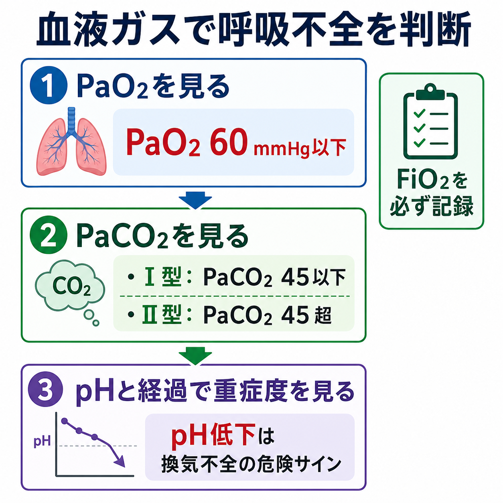
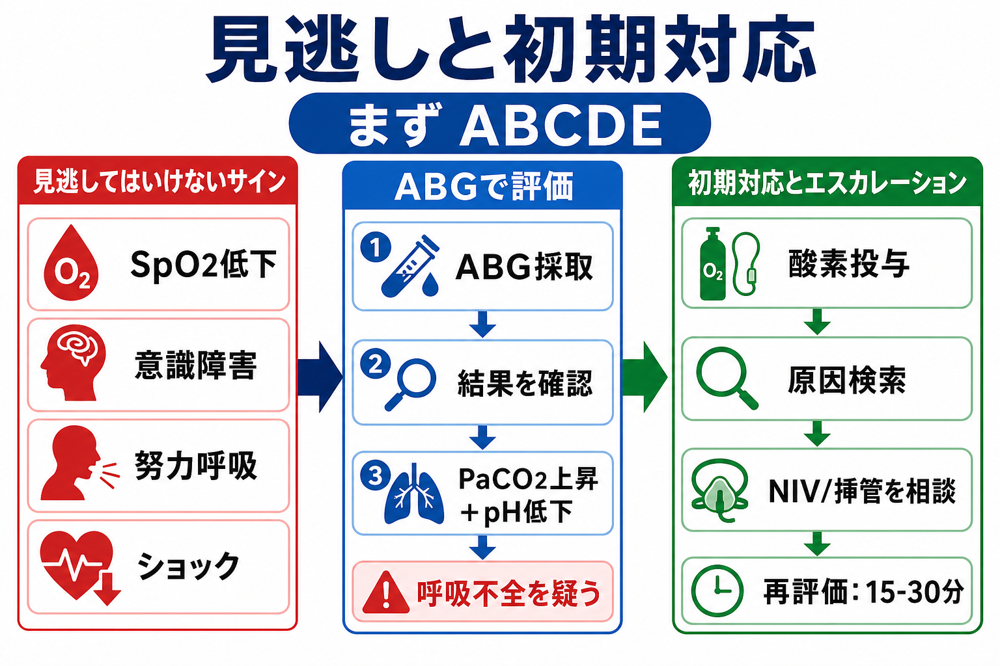
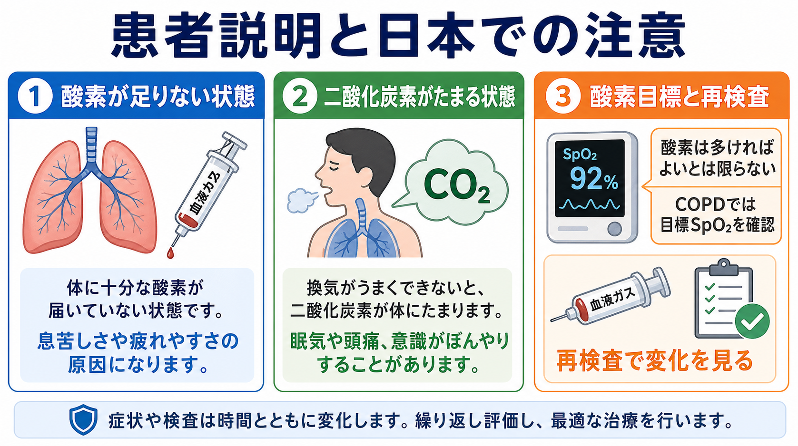

---
title: "血液ガスで呼吸不全をどう判断するか"
description: "低酸素血症と高二酸化炭素血症を区別し、呼吸不全の型と対応を整理する。"
aliases:
  - "血ガスで呼吸不全を判断する"
tags:
  - 領域/救急・初期対応
  - 種類/クリニカルクエスチョン
  - 対象/研修医
question: "血液ガスで呼吸不全をどう判断するか"
clinical_area: "救急・初期対応"
audience: "研修医"
evidence_level: "guideline/review/mixed"
created: "2026-04-27"
updated: "2026-04-27"
enableToc: true
---

# 血液ガスで呼吸不全をどう判断するか

> このノートは研修医教育のための一般的整理であり、個別患者の診断・治療指示ではありません。緊急性が高い、判断に迷う、施設方針が関わる場合は上級医・専門科に相談してください。

## クリニカルクエスチョン

血液ガスで、低酸素血症と高二酸化炭素血症をどう区別し、呼吸不全の型と初期対応につなげるか。

## まず結論

- 室内気で PaO2 が 60 mmHg 以下なら呼吸不全を疑い、PaCO2 が 45 mmHg 以下なら I 型、45 mmHg を超えれば II 型として整理する [1,2]。
- 血ガスは「酸素化: PaO2 または P/F 比」「換気: PaCO2」「急性度: pH」「背景: FiO2 と酸素投与デバイス」をセットで読む。
- 低酸素血症だけなら肺炎、心不全、肺塞栓、ARDS、気胸などのガス交換障害を先に探す。PaCO2 上昇を伴うなら COPD増悪、喘息重積、薬剤性低換気、神経筋疾患、胸郭・肥満低換気を考える。
- SpO2 が低い、意識障害、努力呼吸、ショック、PaCO2 上昇かつ pH 低下があれば、酸素投与と原因検索を同時に行い、NIV・挿管を含めて早めに上級医へ相談する [5,6]。
- COPDなど高二酸化炭素血症リスクがある患者では、酸素は「多いほどよい」ではない。BTSは血ガス結果が出るまで SpO2 88-92% を目標にすることを推奨している [5]。
- 日本で酸素を使う際は、PMDA添付文書のとおり動脈血中の酸素分圧と炭酸ガス分圧を監視し、高濃度酸素の長時間投与や CO2 蓄積に注意する [3]。

## 判断の型

1. まず採血条件を確認する。動脈血か静脈血か、室内気か酸素投与中か、FiO2、デバイス、流量、採血時刻、直前の治療変更を確認する。
2. PaO2 を見る。室内気 PaO2 60 mmHg 以下なら呼吸不全、PaO2 60-70 mmHg は準呼吸不全として再評価する [1,2]。
3. PaCO2 を見る。PaCO2 45 mmHg 以下なら I 型、45 mmHg 超なら II 型として、低酸素血症の機序と換気不全の有無を分ける [1,2]。
4. pH を見る。PaCO2 が高くても pH が保たれていれば慢性代償の可能性があり、pH が低ければ急性または急性増悪の換気不全として重く扱う。
5. 酸素投与中なら PaO2 単独で安心しない。FiO2 と PaO2/FiO2 比を見て、ARDS では P/F 比 300 以下が定義に入る [7]。
6. A-aDO2 を必要時に見る。室内気では概算 PAO2 = 150 - PaCO2/0.8、A-aDO2 = PAO2 - PaO2 として、肺胞低換気だけかガス交換障害を伴うかを考える [1]。

| 読む項目 | 何を判断するか | ベッドサイドでの意味 |
|---|---|---|
| PaO2 / SpO2 | 酸素化 | 酸素投与、肺炎・心不全・肺塞栓などの検索 |
| PaCO2 | 肺胞換気 | 換気補助、薬剤・COPD・神経筋疾患の検索 |
| pH | 急性度と代償 | 低pHなら悪化が速い可能性を考え、早めに相談 |
| HCO3- / BE | 慢性代償 | 慢性高CO2血症か急性上昇かの手がかり |
| FiO2 / デバイス | 重症度補正 | 酸素投与下の PaO2 を過大評価しない |

## 初期対応

- ABCDEで評価する。会話可能か、努力呼吸、チアノーゼ、意識障害、循環不全、胸郭運動、喘鳴・湿性ラ音、片側呼吸音低下を確認する。
- SpO2低下や呼吸窮迫があれば、血ガス結果を待たず酸素投与を開始する。通常は SpO2 94-98% を目標にするが、高二酸化炭素血症リスクがあれば 88-92% を暫定目標にし、血ガスで確認する [5]。
- PaCO2 上昇と pH 低下、意識障害、呼吸疲弊、循環不安定、気道防御困難があれば、NIVまたは挿管管理の適応を上級医・救急・集中治療・呼吸器内科へ早急に相談する [6]。
- 酸素投与後は 15-30分程度を目安に、症状、呼吸数、SpO2、意識、血圧、血ガスを再評価する。悪化していれば酸素デバイスを上げるだけでなく、原因と換気補助を見直す。
- 日本での注意: 医療用酸素は医薬品であり、PMDA添付文書では「医師の指示による」とされる。低酸素血症や高炭酸ガス血症では動脈血中酸素・炭酸ガス分圧を監視しつつ調節する [3]。

## 鑑別・見逃し

| 優先度 | 疾患・状態 | 見逃さない理由 | 手がかり |
|---|---|---|---|
| 高 | 上気道閉塞・誤嚥 | 急速に換気不能となる | 吸気性喘鳴、嗄声、流涎、突然発症 |
| 高 | 重症肺炎・敗血症 | 低酸素とショックが進行する | 発熱、浸潤影、乳酸上昇、低血圧 |
| 高 | 急性心不全・肺水腫 | 酸素化不良が急速に悪化する | 起坐呼吸、湿性ラ音、BNP、胸部X線 |
| 高 | 肺塞栓症 | SpO2低下の割に胸部X線が乏しいことがある | 突然の呼吸困難、胸痛、頻脈、DVTリスク |
| 高 | 気胸・緊張性気胸 | 片側換気不良と循環不全を来す | 片側呼吸音低下、胸痛、血圧低下 |
| 高 | COPD増悪・喘息重積 | PaCO2上昇と疲弊は危険 | 喘鳴、呼気延長、既往、pH低下 |
| 高 | 薬剤性低換気 | 酸素だけでCO2貯留が悪化する | オピオイド、ベンゾジアゼピン、意識低下、縮瞳 |
| 中 | 神経筋疾患・胸郭疾患・肥満低換気 | 肺そのものより換気ポンプ不全 | 浅い呼吸、咳嗽力低下、慢性高HCO3- |
| 中 | ARDS | 酸素投与下でも酸素化が悪い | 両側陰影、P/F比低下、PEEP/CPAP条件 [7] |

## 検査

| 検査 | 目的 | 注意点 |
|---|---|---|
| 動脈血ガス | PaO2、PaCO2、pH、HCO3-、乳酸を同時に評価 | 静脈血ではPaO2評価はできない。FiO2を必ず記録 |
| パルスオキシメータ | 連続的な酸素化モニタ | 低灌流、体動、マニキュア、一酸化炭素中毒などで解釈に注意 |
| 胸部X線 | 肺炎、心不全、気胸、無気肺の評価 | 初期肺塞栓や早期ARDSでは正常に近いことがある |
| 胸部CT / CTPA | 肺塞栓、間質性肺炎、腫瘍、複雑な肺炎の評価 | 搬送リスクと腎機能、造影禁忌を確認 |
| 心電図・心エコー | 心不全、虚血、不整脈、右心負荷の評価 | 呼吸困難の原因が心原性のことがある |
| 採血 | 炎症、貧血、電解質、腎機能、BNP、Dダイマーなど | Dダイマーは事前確率と合わせて使う |
| 呼気CO2 / 経皮CO2 | 換気の連続評価 | 挿管中、鎮静中、NIV中で有用。血ガスで確認する |

## 治療・マネジメント

- I 型呼吸不全では、酸素化を改善しつつ原因を治療する。肺炎なら抗菌薬、心不全なら利尿・血管拡張、肺塞栓なら抗凝固や再灌流、気胸なら脱気など、原因治療を同時に進める。
- II 型呼吸不全では、酸素化だけでなく換気を改善する。COPD増悪などで急性呼吸性アシドーシスがある場合、ERS/ATSは bilevel NIV の使用を推奨している [6]。
- NIVを始めたら、意識、呼吸仕事量、リーク、同調性、pH・PaCO2の改善を短時間で再評価する。改善が乏しい、気道防御困難、循環不安定、分泌物過多なら挿管を遅らせない。
- 酸素投与は目標SpO2を処方・記録する。BTSは一般急性疾患では 94-98%、高二酸化炭素血症リスクでは 88-92% を推奨している [5]。
- 日本での注意: 在宅酸素療法は急性期の酸素投与とは別に、診療報酬上の在宅酸素療法指導管理料 C103 など制度要件がある。退院調整では呼吸器内科、地域連携、業者、保険要件を確認する [4]。
- 高濃度酸素の長時間投与では酸素中毒の危険があり、低酸素血症・高炭酸ガス血症の患者では酸素分圧と炭酸ガス分圧を監視する [3]。

## 図解

## 指導医に確認するポイント

- この血ガスは動脈血として信頼できるか。採血時のFiO2、酸素デバイス、流量は記録できているか。
- PaCO2上昇は急性か慢性代償か。pH、HCO3-、過去の血ガス、COPD・神経筋疾患・肥満低換気の既往をどう見るか。
- 酸素目標は通常の 94-98% でよいか、高二酸化炭素血症リスクとして 88-92% にすべきか [5]。
- NIVで試す状況か、挿管を急ぐ状況か。気道防御、循環、分泌物、意識、患者協力性を確認する [6]。
- 肺炎、心不全、肺塞栓、気胸、ARDSなど、低酸素血症の原因検索をどこまで急ぐか。
- 退院後に酸素が必要な場合、日本の在宅酸素療法の制度要件・導入手順を誰と調整するか [4]。

## 患者説明

- 「血液ガスでは、血液に酸素が十分入っているか、二酸化炭素を外に出せているかを見ています。」
- 「酸素が低い状態と、二酸化炭素がたまる状態では、原因や治療が少し違います。」
- 「酸素は必要な量を使いますが、多ければ多いほどよいとは限りません。特に肺の持病がある方では、二酸化炭素がたまらないか確認しながら調整します。」
- 「症状や検査値は時間で変わるため、酸素を始めた後も繰り返し確認します。」

## ピットフォール

- 酸素投与中の PaO2 だけを見て「大丈夫」と判断する。FiO2が高ければ、PaO2が保たれていても重症のことがある。
- 静脈血ガスで PaO2 を評価する。換気や酸塩基の参考にはなるが、酸素化の判定は動脈血で行う。
- PaCO2が正常だから安全と考える。重症低酸素血症では過換気でPaCO2が低く見えることがあり、疲弊すると急に上昇する。
- COPD疑いに高濃度酸素を漫然と続ける。SpO2目標と再検の時刻を決め、PaCO2とpHを追う [3,5]。
- NIV開始後に再評価しない。改善しないNIVを続けると挿管の遅れにつながる。
- 「呼吸不全の型」だけで診断名が決まったと考える。型は原因検索と初期対応の入口であり、肺・心臓・神経筋・薬剤を並行して評価する。

## 関連ノート

- 関連ノート候補: `酸素投与の目標SpO2をどう決めるか`
- 関連ノート候補: `NIVをいつ開始し、いつ挿管へ切り替えるか`
- 関連ノート候補: `呼吸困難で肺塞栓をどう疑うか`
- 関連ノート候補: `胸部X線で気胸を見逃さない`

## MOC更新候補

- [[MOC｜救急・初期対応]]
- MOC｜呼吸器.md（本サイト外）
- MOC｜検査・画像・手技.md（本サイト外）

## 参考文献

[1] 日本呼吸器学会. 酸素療法マニュアル. https://www.jrs.or.jp/publication/jrs_guidelines/20170104152945.html

[2] 公益社団法人 日本薬学会. 呼吸不全. 薬学用語解説. https://www.pharm.or.jp/words/word00289.html

[3] PMDA. 日本薬局方 酸素 添付文書情報. https://www.pmda.go.jp/PmdaSearch/rdDetail/iyaku/799070EX1054_1

[4] 厚生労働省. 診療報酬の算定方法 C103 在宅酸素療法指導管理料. https://www.mhlw.go.jp/web/t_doc?dataId=84aa9729&dataType=0&pageNo=7

[5] O'Driscoll BR, Howard LS, Earis J, Mak V, on behalf of the British Thoracic Society Emergency Oxygen Guideline Group. BTS guideline for oxygen use in adults in healthcare and emergency settings. Thorax. 2017;72(Suppl 1):ii1-ii90. https://doi.org/10.1136/thoraxjnl-2016-209729

[6] Rochwerg B, Brochard L, Elliott MW, et al. Official ERS/ATS clinical practice guidelines: noninvasive ventilation for acute respiratory failure. Eur Respir J. 2017;50(2):1602426. https://doi.org/10.1183/13993003.02426-2016

[7] ARDS Definition Task Force, Ranieri VM, Rubenfeld GD, Thompson BT, et al. Acute respiratory distress syndrome: the Berlin Definition. JAMA. 2012;307(23):2526-2533. https://doi.org/10.1001/jama.2012.5669

## 更新ログ

- 2026-04-27: 初版作成。
