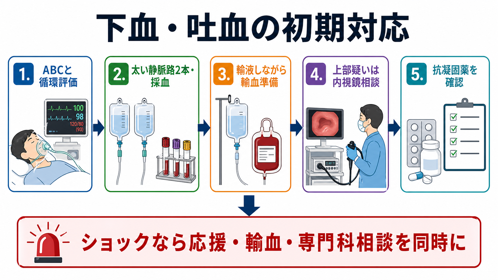
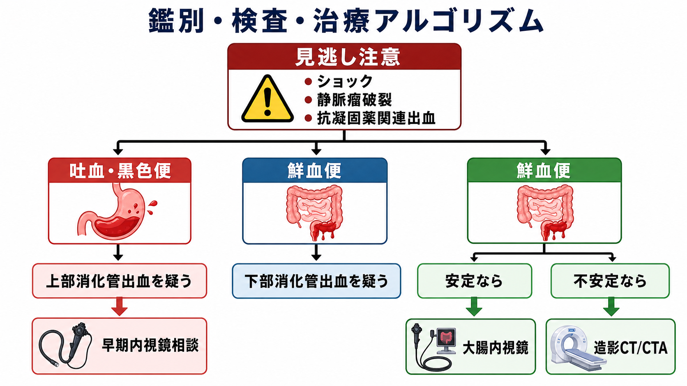
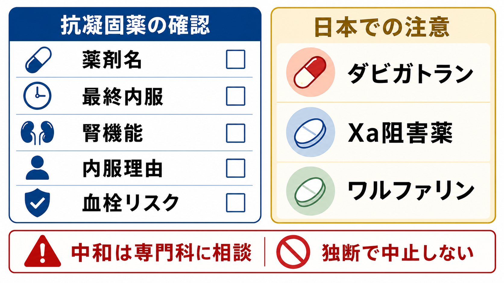

---
title: "下血・吐血患者を見たら最初に何をするか"
description: "下血・吐血患者で最初に行う循環評価、輸液・輸血、内視鏡相談、抗凝固薬確認を整理する。"
aliases:
  - "消化管出血の初期対応"
tags:
  - 領域/救急・初期対応
  - 種類/クリニカルクエスチョン
  - 対象/研修医
question: "下血・吐血患者を見たら最初に何をするか"
clinical_area: "救急・初期対応"
audience: "研修医"
evidence_level: "mixed"
created: "2026-04-27"
updated: "2026-04-27"
enableToc: true
---

# 下血・吐血患者を見たら最初に何をするか

> このノートは研修医教育のための一般的整理であり、個別患者の診断・治療指示ではありません。緊急性が高い、判断に迷う、施設方針が関わる場合は上級医・専門科に相談してください。

## クリニカルクエスチョン

下血・吐血患者を見たら、研修医は最初に何を確認し、どの順番で輸液・輸血、内視鏡相談、抗凝固薬対応につなげるか。

## まず結論

- 最初の仕事は「出血源の診断」ではなく、ショックを見逃さず、ABCと循環を立て直すことである。頻脈、低血圧、冷汗、意識変容、尿量低下、持続する吐血・鮮血便は重症サインとして扱う。
- 太い静脈路を2本、採血、血液型・交差適合、不規則抗体、凝固、腎機能、肝機能を同時に進める。輸液で時間を稼ぎつつ、ショックや大量出血では輸血準備を早めに始める。[4][5]
- 吐血、黒色便、血行動態不安定な血便は上部消化管出血として扱い、消化器内科・内視鏡チームへ早期に相談する。上部消化管出血では、入院例で24時間以内の内視鏡が推奨される。[1][8]
- 鮮血便でも、ショックがあれば上部出血の可能性を残す。下部消化管出血で血行動態が不安定なら、内視鏡前に造影CT/CT angiographyで活動性出血を探す運用が推奨されることがある。[9][10]
- 抗凝固薬・抗血小板薬は、薬剤名、最終内服時刻、腎機能、適応疾患、血栓リスクを確認する。止血困難・生命を脅かす出血では、休薬や中和薬は上級医、消化器、循環器/脳卒中、薬剤部、輸血部と相談して決める。[2][3][6][7]

## 判断の型

1. **死にそうかを先に見る**: 気道、呼吸、循環、意識、皮膚冷感、持続出血、転倒・失神を確認する。吐血で意識障害や大量嘔吐があれば誤嚥・窒息リスクも同時に考える。
2. **循環を立て直しながら原因へ進む**: モニター、酸素、太い末梢静脈路2本、晶質液、採血、血液型・交差適合、輸血依頼を同時並行で進める。[4][5]
3. **上部か下部かを仮決めする**: 吐血・黒色便は上部、鮮血便は下部が多いが、血行動態不安定な鮮血便は大量上部出血も疑う。[8][9]
4. **内視鏡かCTかを相談する**: 上部疑いは消化器内科へ早期内視鏡相談、下部で不安定なら造影CT/CTAやIVRを含めて相談する。[8][10]
5. **止血を邪魔する薬を確認する**: ワルファリン、DOAC、抗血小板薬、NSAIDs、ステロイド、SSRI、透析中の抗凝固などを薬手帳、家族、施設、処方歴で確認する。[2][3]

## 初期対応

- **応援を呼ぶ**: ショック、意識障害、大量吐血、持続する鮮血便、抗凝固薬内服、肝硬変疑いでは、初期から上級医、消化器内科、救急、麻酔科、輸血部に声をかける。
- **ABCDE**: 気道保護、酸素化、呼吸状態、循環、意識、体温を評価する。吐血中の患者は側臥位、吸引、誤嚥対策を準備する。
- **モニターとルート**: 心電図、SpO2、血圧反復測定、可能なら尿道カテーテルで尿量評価。18G以上を目標に末梢静脈路2本、困難なら中心静脈路や骨髄路を上級医と検討する。
- **採血を一度でそろえる**: CBC、血液型、交差適合、不規則抗体、PT-INR、APTT、フィブリノゲン、肝腎機能、電解質、乳酸、血液ガス、妊娠可能性があれば妊娠反応を考える。
- **輸液・輸血**: 晶質液で循環を支えつつ、ショック、進行する貧血、持続出血、心血管疾患合併では輸血準備を早める。安定した上部消化管出血ではHb 7 g/dLを目安とする制限輸血が推奨されるが、ショックや虚血性心疾患では数値だけで待たない。[4][5][8]
- **薬剤確認**: 抗凝固薬・抗血小板薬の薬剤名、最終内服、内服理由、腎機能、併用薬を確認し、内服中止や中和は独断で決めない。[2][3][6][7]
- **内視鏡相談に必要な情報**: バイタル推移、吐血/下血の量と持続、意識、Hb、血小板、PT-INR、抗血栓薬、肝硬変所見、造影CT可否、挿管の必要性を簡潔に伝える。

## 鑑別・見逃し

| 優先度 | 疾患・状態 | 見逃さない理由 | 手がかり |
|---|---|---|---|
| 高 | 出血性ショック | 診断前に循環破綻する | 頻脈、低血圧、冷汗、意識変容、乳酸上昇、尿量低下 |
| 高 | 食道静脈瘤破裂 | 短時間で大量出血し、気道・循環管理が必要 | 肝硬変、腹水、黄疸、血小板低下、大量吐血 |
| 高 | 出血性胃・十二指腸潰瘍 | 内視鏡止血とPPI治療の対象になりうる | 心窩部痛、NSAIDs、低用量アスピリン、黒色便、吐血 [1][8] |
| 高 | 抗凝固薬関連出血 | 止血困難になり、中和薬・輸血方針が変わる | ワルファリン、DOAC、抗血小板薬、多剤併用、腎機能低下 [2][3][6][7] |
| 中 | 大腸憩室出血 | 高齢者の急性鮮血便で多く、再出血がある | 無痛性鮮血便、既往、抗血栓薬 |
| 中 | 虚血性腸炎 | 腹痛を伴う下血で、重症虚血を見逃すと危険 | 左下腹部痛、下痢、血便、動脈硬化、脱水 |
| 中 | 悪性腫瘍・炎症性腸疾患 | 緊急止血後の原因精査が必要 | 体重減少、慢性貧血、便通変化、発熱 |
| 中 | 痔核・裂肛 | よくあるが、重症出血を除外してから考える | 排便時出血、肛門痛、少量付着血 |

## 検査

| 検査 | 目的 | 注意点 |
|---|---|---|
| CBC反復 | 出血量と輸血判断 | 急性出血直後のHbは過小評価にも過大評価にもなりうる。バイタルと経時変化で判断する。 |
| 血液型・交差適合・不規則抗体 | 輸血準備 | ショックでは検査完了を待てない場合があるため、施設の緊急輸血手順を上級医・輸血部と確認する。[5] |
| PT-INR、APTT、フィブリノゲン、血小板 | 凝固異常・抗凝固薬影響の評価 | DOACでは通常凝固検査だけで抗凝固作用を正確に評価できないことがある。薬剤名と最終内服が重要。[3][6][7] |
| BUN/Cr、肝機能、電解質 | 上部出血示唆、薬剤・造影・中和薬判断 | 腎機能低下はDOAC作用持続や造影CT可否に関わる。 |
| 静脈血/動脈血ガス、乳酸 | ショック・組織低灌流の評価 | 乳酸正常でも出血を否定しない。 |
| 上部消化管内視鏡 | 上部出血の診断・止血 | 入院上部消化管出血では24時間以内が目安。循環・気道安定化が先。[1][8] |
| 造影CT/CTA | 活動性出血、下部出血、血行動態不安定例の局在 | 下部出血で不安定なら早期CTAを検討する。腎機能、造影禁忌、IVR可否を同時に確認。[9][10] |

## 治療・マネジメント

- **循環管理**: 出血が続く間は、血圧だけでなく意識、冷汗、末梢冷感、尿量、乳酸、頻脈を追う。若年者やβ遮断薬内服者では代償反応が分かりにくい。
- **輸血**: 安定例では制限輸血を基本にするが、活動性出血、ショック、冠動脈疾患、脳血管疾患、持続する低灌流ではHb値だけで判断しない。[4][8][10]
- **内視鏡止血**: 出血性潰瘍では内視鏡的止血が重要で、噴出性/湧出性出血や露出血管などが対象となる。[1][8]
- **PPI**: 上部消化管出血、特に消化性潰瘍疑いでは、施設方針に沿ってPPI投与を消化器内科と相談する。[1][8]
- **抗凝固薬・抗血小板薬**: 一時中止だけでなく、中止による脳梗塞、弁血栓、冠動脈ステント血栓のリスクも同時に評価する。抗血栓薬服用者の内視鏡対応は、出血リスクだけでなく血栓症リスクを考慮する。[2][3]
- **中和薬の日本での注意**: ダビガトランにはイダルシズマブ、アピキサバン・リバーロキサバン・エドキサバンにはアンデキサネット アルファ、ワルファリンにはビタミンKや4因子プロトロンビン複合体製剤を検討しうる。ただし適応、用量、在庫、投与速度、血栓性事象リスク、院内採用は施設差が大きいため、独断でなく専門科・薬剤部・輸血部と確認する。[6][7]
- **下部出血の流れ**: 安定していれば入院中の大腸内視鏡を検討する。一方、不安定で活動性出血が疑われる場合は、内視鏡前にCTAで局在を確認し、IVRや外科を含めた相談に進むことがある。[9][10]
- **退院・再開判断**: 止血後の抗血栓薬再開、PPI継続、H. pylori検査、NSAIDs回避、再出血時の受診目安は、原因と血栓リスクに応じて専門科と決める。[1][2][3]

## 図解

## 指導医に確認するポイント

- 今の患者はショックとして扱うべきか。輸液だけでよいか、輸血を今すぐ準備するか。
- 緊急輸血、O型赤血球、MTPに相当する状況か。施設の手順では誰に連絡するか。
- 気道保護や鎮静リスクを考えて、内視鏡前に挿管・麻酔科相談が必要か。
- 上部内視鏡を優先するか、造影CT/CTAを先にするか。
- 抗凝固薬・抗血小板薬をどう扱うか。中和薬、ビタミンK、PCC、血小板輸血などの適応があるか。
- 止血後、抗血栓薬をいつ誰の判断で再開するか。

## 患者説明

- 「血を吐いた、または便に血が混じった原因を調べる前に、まず血圧や脈、貧血の進み方を見て、体の循環が保てているかを確認します。」
- 「出血が続く場合や貧血が強い場合は、点滴や輸血、内視鏡での止血が必要になることがあります。」
- 「血を固まりにくくする薬を飲んでいる場合は、出血を止める治療と、薬を止めることで血栓ができる危険の両方を考えて方針を決めます。」
- 「この場では安全確認を優先し、詳しい原因は内視鏡やCTなどで順番に調べます。」

## ピットフォール

- Hbがまだ高いから大丈夫、と判断しない。急性出血では初期Hbが出血量を反映しにくい。
- 鮮血便をすぐ痔と決めない。ショックを伴う鮮血便では大量上部出血も考える。
- 抗凝固薬の有無を「本人が分からない」で終わらせない。薬手帳、家族、施設、処方歴、紹介状を確認する。
- 内視鏡依頼だけして循環管理を止めない。内視鏡室へ運べる状態か、気道・循環を再評価する。
- 抗血栓薬を一律に止めない。止血と血栓症リスクのバランスを専門科と共有する。
- 中和薬を使えば終わり、ではない。血栓性事象、再出血、薬剤再開、原因治療まで計画する。

## 関連ノート

- 関連ノート候補: ショックの初期対応、緊急輸血、抗凝固薬内服患者の出血対応、上部消化管出血、下部消化管出血、肝硬変患者の吐血
- 既存ノート確認: この作成時点で、対象フォルダ内に既存の関連ノートは確認できなかったため、未作成ノートへのwikilinkは置かない。

## MOC更新候補

- [[MOC｜救急・初期対応]]
- MOC｜消化器.md（本サイト外）
- 追加候補項目: 「腹痛・消化管出血」配下に本記事「下血・吐血患者を見たら最初に何をするか」を掲載する。

## 参考文献

[1] 日本消化器病学会. 消化性潰瘍診療ガイドライン2020（改訂第3版）. DOI: https://doi.org/10.15106/9784524225446

[2] 藤本一眞, ほか. 抗血栓薬服用者に対する消化器内視鏡診療ガイドライン. Gastroenterological Endoscopy. 2012;54(7):2075-2102. DOI: https://doi.org/10.11280/gee.54.2075

[3] 加藤元嗣, ほか. 抗血栓薬服用者に対する消化器内視鏡診療ガイドライン 直接経口抗凝固薬（DOAC）を含めた抗凝固薬に関する追補2017. Gastroenterological Endoscopy. 2017;59(7):1547-1558. DOI: https://doi.org/10.11280/gee.59.1547

[4] 日本輸血・細胞治療学会ガイドライン委員会. 科学的根拠に基づいた赤血球製剤の使用ガイドライン（改訂第3版）. 日本輸血細胞治療学会誌. 2024;70(6):579-596. DOI: https://doi.org/10.3925/jjtc.70.579

[5] 厚生労働省. 「血液製剤の使用指針」（改定版）. https://www.mhlw.go.jp/new-info/kobetu/iyaku/kenketsugo/5tekisei3b.html

[6] PMDA. オンデキサ静注用200mg 添付文書（アンデキサネット アルファ）. https://www.pmda.go.jp/PmdaSearch/iyakuDetail/ResultDataSetPDF/670227_3399414D1022_2_05

[7] PMDA. プリズバインド静注液2.5g 添付文書（イダルシズマブ）; ケイセントラ静注用500/1000 添付文書（乾燥濃縮人プロトロンビン複合体）. https://www.pmda.go.jp/PmdaSearch/rdDetail/iyaku/3399412A1027_1?user=1 ; https://www.pmda.go.jp/PmdaSearch/rdDetail/iyaku/6343449D1024_1?user=1

[8] Laine L, Barkun AN, Saltzman JR, Martel M, Leontiadis GI. ACG Clinical Guideline: Upper Gastrointestinal and Ulcer Bleeding. Am J Gastroenterol. 2021;116(5):899-917. DOI: https://doi.org/10.14309/ajg.0000000000001245

[9] Sengupta N, Feuerstein JD, Jairath V, et al. Management of Patients With Acute Lower Gastrointestinal Bleeding: An Updated ACG Guideline. Am J Gastroenterol. 2023;118(2):208-231. DOI: https://doi.org/10.14309/ajg.0000000000002130

[10] Triantafyllou K, Gkolfakis P, Gralnek IM, et al. Diagnosis and management of acute lower gastrointestinal bleeding: European Society of Gastrointestinal Endoscopy (ESGE) Guideline. Endoscopy. 2021;53(8):850-868. DOI: https://doi.org/10.1055/a-1496-8969

## 更新ログ

- 2026-04-27: 初版作成。
