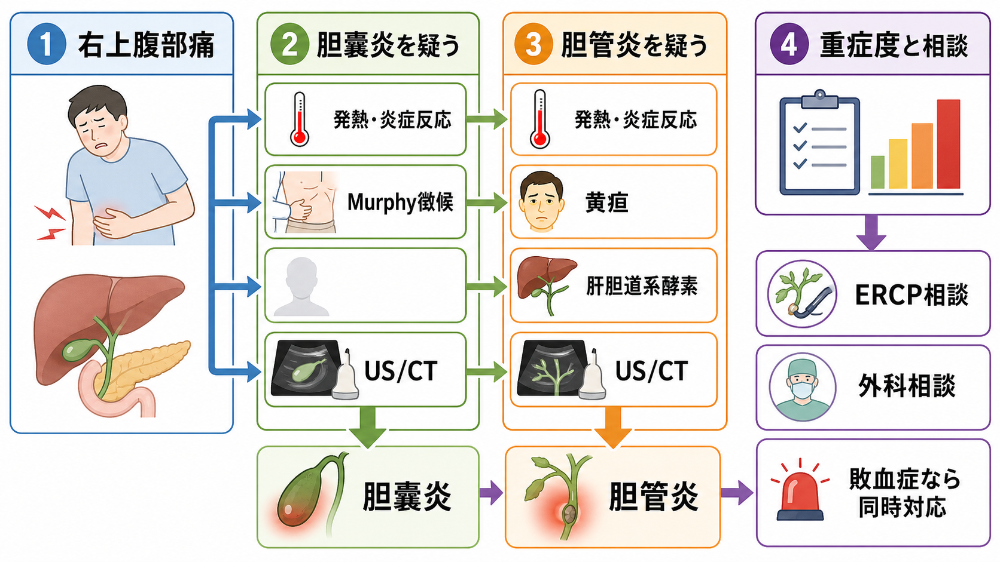
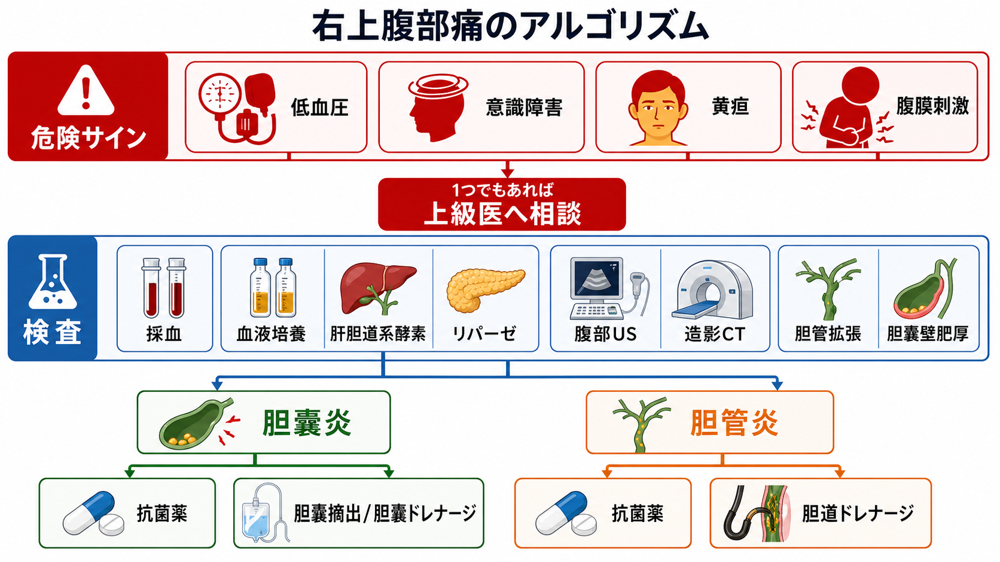
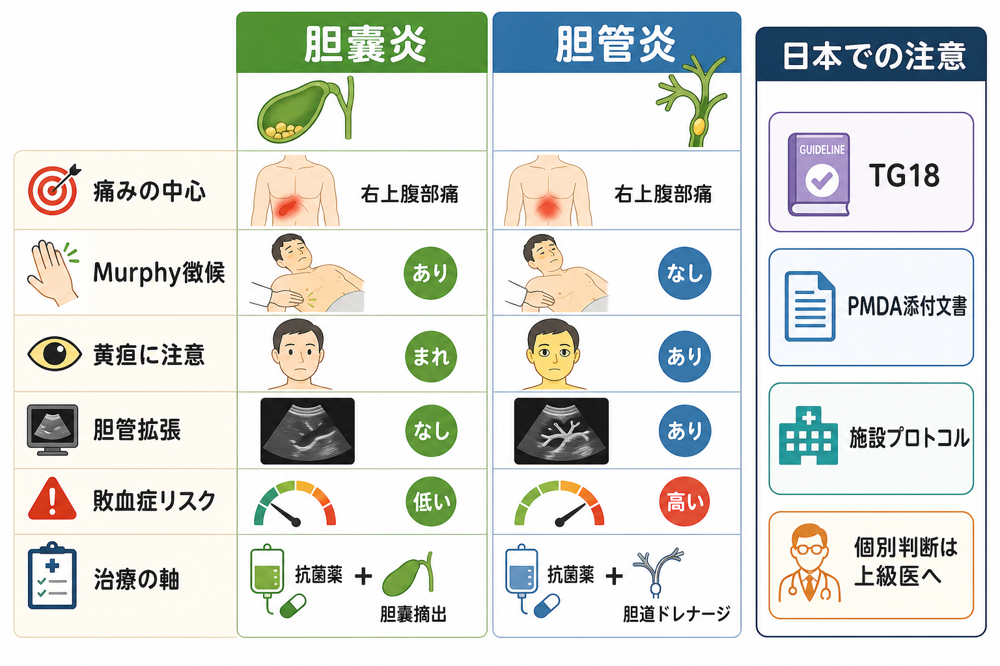

---
title: "右上腹部痛で胆嚢炎・胆管炎をどう見分けるか"
description: "発熱、黄疸、Murphy徴候、肝胆道系酵素、画像から胆嚢炎と胆管炎を見分け、重症度と治療方針を考える。"
aliases:
  - "胆嚢炎と胆管炎の見分け方"
tags:
  - 領域/救急・初期対応
  - 種類/クリニカルクエスチョン
  - 対象/研修医
question: "右上腹部痛で胆嚢炎・胆管炎をどう見分けるか"
clinical_area: "救急・初期対応"
audience: "研修医"
evidence_level: "guideline"
created: "2026-04-27"
updated: "2026-04-27"
enableToc: true
---

# 右上腹部痛で胆嚢炎・胆管炎をどう見分けるか

> このノートは研修医教育のための一般的整理であり、個別患者の診断・治療指示ではありません。緊急性が高い、判断に迷う、施設方針が関わる場合は上級医・専門科に相談してください。

## クリニカルクエスチョン

右上腹部痛の患者で、発熱、黄疸、Murphy徴候、肝胆道系酵素、腹部超音波・CT所見をどう組み合わせると、急性胆嚢炎と急性胆管炎を見分け、重症度と治療方針を考えられるか。

## まず結論

- **胆嚢炎は「右上腹部の局所炎症」、胆管炎は「胆道閉塞に感染が乗った全身感染」として考える。** 胆嚢炎はMurphy徴候、右上腹部圧痛、胆嚢壁肥厚・胆石・周囲液体が軸で、胆管炎は発熱、黄疸、胆汁うっ滞酵素上昇、胆管拡張・総胆管結石が軸になる。[1-3]
- **Charcot 3徴だけで胆管炎を除外しない。** 発熱、右上腹部痛、黄疸がそろえば強く疑うが、そろわない胆管炎もあるため、TG18の「炎症」「胆汁うっ滞」「画像」の3系統で判断する。[1,2]
- **敗血症、低血圧、意識障害、腎障害、呼吸不全、凝固異常があれば、診断名を詰める前に重症胆道感染として同時対応する。** 抗菌薬、培養、輸液、モニタリング、消化器内科・外科・集中治療への相談を並行する。[4,9]
- **胆管炎は胆道ドレナージが治療の軸になることがある。** 中等症以上、重症、または初期治療に反応しない場合は、ERCPなどの胆道ドレナージを早く検討する。[4,7]
- **胆嚢炎は耐術性と重症度で、早期胆嚢摘出か胆嚢ドレナージかを外科と決める。** 軽症・中等症で耐術性があれば早期腹腔鏡下胆嚢摘出が選択肢になり、耐術性が低い場合や重症例では胆嚢ドレナージを検討する。[5,6]
- **日本での注意:** TG18邦文版、施設の胆道感染プロトコル、内視鏡・IVR・外科の当直体制、PMDA添付文書、院内アンチバイオグラムを確認する。海外ガイドラインの薬剤名・用量・検査運用をそのまま持ち込まない。[1,8]

## 判断の型

1. **まず重症かを見る。** 低血圧、意識障害、頻呼吸、低酸素、乏尿、末梢冷感、乳酸上昇、凝固異常があれば、胆道感染による敗血症として上級医を呼ぶ。[4,9]
2. **局所炎症か、胆汁うっ滞かを分ける。** Murphy徴候・右上腹部圧痛が前面なら胆嚢炎、黄疸・直接ビリルビン上昇・ALP/GGT上昇・胆管拡張が前面なら胆管炎を上位に置く。[1-3]
3. **TG18の3系統で整理する。** 胆管炎は「炎症」「胆汁うっ滞」「画像」、胆嚢炎は「局所所見」「全身炎症」「画像」で疑い度を上げる。[2,3]
4. **画像は腹部USを入口に、CT/MRCP/EUS/ERCPの目的を分ける。** 胆嚢壁肥厚・胆石・胆嚢腫大は胆嚢炎、胆管拡張・総胆管結石・閉塞機転は胆管炎の手がかりになる。[1-4]
5. **治療方針は「抗菌薬だけで終わるか」ではなく、閉塞解除・胆嚢摘出・ドレナージの要否で考える。** 胆管炎は胆道ドレナージ、胆嚢炎は手術または胆嚢ドレナージの適応を早く相談する。[4-7]

## 初期対応

- **ABCDEと敗血症評価:** 発熱の有無だけでなく、血圧、呼吸数、SpO2、意識、末梢循環、尿量、乳酸を確認する。胆管炎は閉塞を伴う感染巣コントロール疾患として悪化が速いことがある。[4,9]
- **応援要請:** 低血圧、意識障害、黄疸、乳酸高値、胆管拡張、総胆管結石疑い、腹膜刺激、免疫不全、抗凝固薬内服、妊娠、透析、高齢・フレイルでは早めに上級医へ共有する。
- **絶食・静脈路・補液・鎮痛:** 嘔吐、脱水、敗血症、手術・内視鏡処置の可能性を考え、絶食、静脈路、輸液、制吐、鎮痛を整える。鎮痛で診察ができなくなると考えて我慢させない。
- **培養と抗菌薬:** 発熱、悪寒戦慄、黄疸、敗血症、入院治療が必要そうな胆道感染では、血液培養2セットを考える。ショックや重症疑いでは培養のために抗菌薬を不必要に遅らせない。[4,9]
- **画像の順番:** 腹部USで胆嚢・胆管を素早く見る。診断が不十分、合併症や他疾患を見たい、肥満・腸管ガスでUSが難しい場合はCTを検討する。総胆管結石の精査ではMRCP/EUS、治療を兼ねる場合はERCPが候補になる。[1,4,7]

## 鑑別・見逃し

| 優先度 | 疾患・状態 | 見逃さない理由 | 手がかり |
|---|---|---|---|
| 高 | 急性胆管炎 | 敗血症化しやすく、抗菌薬だけでなく胆道ドレナージが必要なことがある | 発熱、悪寒戦慄、黄疸、ALP/GGT/ビリルビン上昇、胆管拡張、総胆管結石 |
| 高 | 急性胆嚢炎 | 穿孔、膿瘍、壊疽性胆嚢炎へ進むことがあり、外科判断が必要 | 右上腹部痛、Murphy徴候、発熱、CRP/WBC上昇、胆嚢壁肥厚、胆石 |
| 高 | 胆石性膵炎 | 胆管炎を合併すればERCPを急ぐことがある | 心窩部痛、背部放散、リパーゼ上昇、胆石、胆管拡張 |
| 高 | 消化管穿孔・腹膜炎 | 胆嚢炎と思い込むと手術相談が遅れる | 板状硬、反跳痛、free air、急激な悪化 |
| 高 | 肝膿瘍 | 胆道感染と関連し、ドレナージが必要なことがある | 発熱持続、肝内占拠性病変、糖尿病、Klebsiellaリスク |
| 中 | 急性肝炎・薬物性肝障害 | 黄疸と肝酵素上昇で胆管炎に似る | AST/ALT優位、胆管拡張なし、薬剤歴、ウイルスリスク |
| 中 | 右下葉肺炎・胸膜炎 | 右上腹部痛として来ることがある | 咳、呼吸苦、胸部聴診、胸部X線/CT |
| 中 | 急性冠症候群 | 心窩部痛・右上腹部不快感で見えることがある | 高齢、糖尿病、冷汗、心電図変化、トロポニン |

## 検査

| 検査 | 目的 | 注意点 |
|---|---|---|
| CBC、CRP | 炎症反応、重症度、胆嚢炎・胆管炎のTG18項目 | 高齢者・免疫不全では発熱や白血球上昇が目立たないことがある。[1-3] |
| AST/ALT、ALP、GGT、総/直接ビリルビン | 胆汁うっ滞、胆管炎、総胆管結石、肝炎の鑑別 | 胆管炎では胆汁うっ滞所見が重要。AST/ALT優位なら肝炎や虚血も考える。[2] |
| 腎機能、電解質、凝固、血ガス/乳酸 | 臓器障害、造影CT・抗菌薬投与、敗血症評価 | TG18重症度は臓器障害を重視する。処置前の凝固・抗凝固薬確認も必要。[2-4] |
| 血液培養2セット | 菌血症の確認、抗菌薬の狭域化 | 発熱、悪寒戦慄、黄疸、重症疑い、入院治療では低い閾値で検討する。[4,9] |
| リパーゼ | 胆石性膵炎の評価 | 心窩部痛、背部痛、嘔吐、肝胆道系酵素上昇があれば一緒に見る。 |
| 腹部超音波 | 胆石、胆嚢壁肥厚、胆嚢腫大、胆管拡張をベッドサイドで評価 | 陰性でも除外しきれない。術者依存、腸管ガス、肥満で見えにくい。[1,3] |
| 造影CT | 合併症、穿孔、膿瘍、膵炎、腫瘍、他の腹部救急を評価 | 腎機能、アレルギー、妊娠可能性、循環不安定時の搬送リスクを確認する。 |
| MRCP/EUS/ERCP | 総胆管結石・閉塞機転の精査、ERCPは治療も兼ねる | ERCPは侵襲的で膵炎などの合併症があるため、治療目的か診断目的かを専門科と確認する。[7] |

## 治療・マネジメント

- **共通:** 絶食、輸液、鎮痛、制吐、抗菌薬、培養、重症度評価、再評価を並行する。胆道感染は「抗菌薬を入れたから終わり」ではなく、閉塞解除や胆嚢処置が必要かを考える。[1,4-6]
- **胆管炎:** TG18では、初期治療と重症度判定を行い、中等症以上、重症、または初期治療不応例では早期/緊急の胆道ドレナージを検討する。ERCP可能施設か、搬送が必要かを早く確認する。[1,4,7]
- **胆嚢炎:** 軽症・中等症で耐術性があれば早期腹腔鏡下胆嚢摘出が選択肢になる。重症、耐術性が低い、局所炎症が高度、全身状態が悪い場合は、初期治療と胆嚢ドレナージを含めて外科・消化器内科・IVRと相談する。[5,6]
- **抗菌薬:** 胆道感染では腸内細菌科細菌、嫌気性菌、腸球菌、医療関連感染、耐性菌リスクを考える。具体的薬剤・用量は腎機能、肝機能、アレルギー、重症度、院内アンチバイオグラム、PMDA添付文書、施設プロトコルに従う。[1,8]
- **日本での注意:** ピペラシリン/タゾバクタムなどは国内添付文書で胆嚢炎・胆管炎の効能又は効果を確認できるが、実際の選択は重症度、耐性菌リスク、腎機能、施設採用薬で変わる。[8]
- **専門科への伝え方:** 「右上腹部痛、発熱、黄疸、T-Bil、ALP/GGT、AST/ALT、WBC/CRP、血圧、乳酸、腎機能、血液培養、US/CTで胆管拡張または胆嚢壁肥厚、抗菌薬開始状況」をセットで伝える。
- **帰宅判断:** 胆管炎疑い、黄疸、胆管拡張、総胆管結石疑い、発熱持続、強い疼痛、腹膜刺激、経口摂取困難、高齢・免疫不全・妊娠・透析・抗凝固薬内服では、安易に帰宅にしない。

## 図解

## 指導医に確認するポイント

- この患者をTG18で胆管炎疑い、胆管炎確診、胆嚢炎疑い、胆嚢炎確診のどこに置くか。
- 低血圧、意識障害、腎障害、凝固異常、呼吸不全、血小板低下など、Grade III相当の臓器障害がないか。
- 胆管炎としてERCPを急ぐか、MRCP/EUSで精査する余裕があるか、搬送が必要か。
- 胆嚢炎として早期手術を目指すか、胆嚢ドレナージを先に置くか、保存的治療で観察するか。
- 抗菌薬の初回選択、腎機能による用量調整、血液培養・胆汁培養の扱い、AST/ICTへ相談するタイミング。
- 抗凝固薬、抗血小板薬、妊娠可能性、透析、免疫抑制、肝硬変、認知症・フレイルが治療方針にどう影響するか。

## 患者説明

- 「右上のお腹の痛みは、胆嚢や胆管に石や炎症が起きている時に出ることがあります。」
- 「胆嚢炎は胆嚢そのものの炎症、胆管炎は胆汁の通り道が詰まって感染が起きる状態です。胆管炎は血圧低下など全身に影響することがあります。」
- 「血液検査と超音波やCTで、胆嚢の腫れ、胆管の拡張、黄疸の程度を確認します。」
- 「治療は点滴、痛み止め、抗菌薬だけでなく、内視鏡で胆汁の通り道を開く処置や、胆嚢の手術・ドレナージが必要になることがあります。」

## ピットフォール

- Charcot 3徴がそろわないから胆管炎ではない、と判断する。TG18では炎症、胆汁うっ滞、画像を組み合わせて判断する。[1,2]
- Murphy徴候がないから胆嚢炎ではない、と判断する。高齢者、糖尿病、鎮痛後、重症例では典型所見が乏しいことがある。
- AST/ALT上昇だけを見て肝炎と決めつけ、黄疸、胆管拡張、総胆管結石を見逃す。
- 胆嚢炎と思って抗菌薬だけで観察し、胆管拡張や総胆管結石による胆管炎を見落とす。
- 画像検査を待ちすぎて、ショック・敗血症疑いの初期対応、培養、抗菌薬、上級医相談が遅れる。
- ERCPを「診断検査」として安易に考える。胆管炎や総胆管結石では治療手段になり得る一方、合併症もあるため専門科判断が必要。[7]
- 海外の抗菌薬選択や用量をそのまま使う。日本ではPMDA添付文書、施設採用薬、腎機能、AST/ICTの運用を確認する。[8]

## 関連ノート

- [[救急外来で敗血症性ショックを疑ったら何をするか]]
- 関連ノート候補（未作成または所在未確認）: 腹痛で外科疾患をどう見逃さないか、胆石性膵炎を疑ったら何をするか、発熱患者で血液培養はいつ何セット取るべきか、救急外来で腹部超音波をどう使うか

## MOC更新候補

- [[MOC｜救急・初期対応]]
- MOC｜消化器.md（本サイト外）
- MOC｜感染症・抗菌薬.md（本サイト外）

## 参考文献

[1] 急性胆管炎・胆嚢炎診療ガイドライン改訂出版委員会. －TG18新基準掲載－急性胆管炎・胆嚢炎診療ガイドライン2018. Mindsガイドラインライブラリ. https://minds.jcqhc.or.jp/summary/c00467/

[2] Kiriyama S, Kozaka K, Takada T, et al. Tokyo Guidelines 2018: diagnostic criteria and severity grading of acute cholangitis (with videos). Journal of Hepato-Biliary-Pancreatic Sciences. 2018;25(1):17-30. https://doi.org/10.1002/jhbp.512

[3] Yokoe M, Hata J, Takada T, et al. Tokyo Guidelines 2018: diagnostic criteria and severity grading of acute cholecystitis (with videos). Journal of Hepato-Biliary-Pancreatic Sciences. 2018;25(1):41-54. https://doi.org/10.1002/jhbp.515

[4] Miura F, Okamoto K, Takada T, et al. Tokyo Guidelines 2018: initial management of acute biliary infection and flowchart for acute cholangitis. Journal of Hepato-Biliary-Pancreatic Sciences. 2018;25(1):31-40. https://doi.org/10.1002/jhbp.509

[5] Okamoto K, Suzuki K, Takada T, et al. Tokyo Guidelines 2018: flowchart for the management of acute cholecystitis. Journal of Hepato-Biliary-Pancreatic Sciences. 2018;25(1):55-72. https://doi.org/10.1002/jhbp.516

[6] Pisano M, Allievi N, Gurusamy K, et al. 2020 World Society of Emergency Surgery updated guidelines for the diagnosis and treatment of acute calculus cholecystitis. World Journal of Emergency Surgery. 2020;15:61. https://doi.org/10.1186/s13017-020-00336-x

[7] ASGE Standards of Practice Committee, Buxbaum JL, Fehmi SMA, et al. ASGE guideline on the role of endoscopy in the evaluation and management of choledocholithiasis. Gastrointestinal Endoscopy. 2019;89(6):1075-1105.e15. https://doi.org/10.1016/j.gie.2018.10.001

[8] 医薬品医療機器総合機構（PMDA）. ゾシン配合点滴静注用バッグ4.5 医療用医薬品情報・添付文書. https://www.pmda.go.jp/PmdaSearch/rdSearch/02/6139505G1022?user=1

[9] Evans L, Rhodes A, Alhazzani W, et al. Surviving sepsis campaign: international guidelines for management of sepsis and septic shock 2021. Intensive Care Medicine. 2021;47:1181-1247. https://doi.org/10.1007/s00134-021-06506-y

## 更新ログ

- 2026-04-27: 初版作成。
