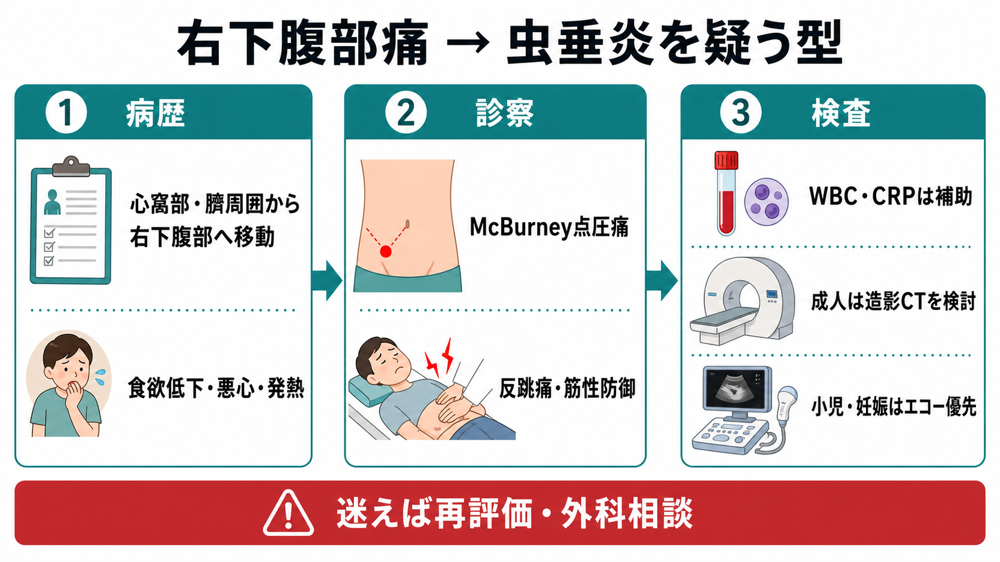
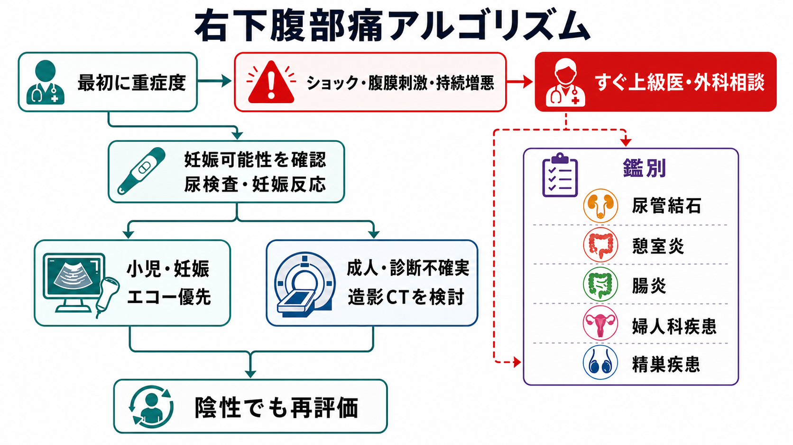
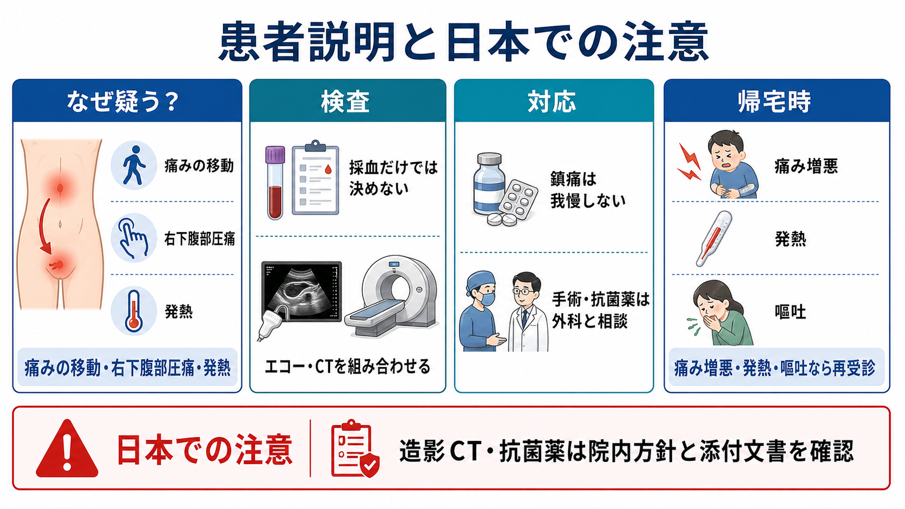

---
title: "右下腹部痛で虫垂炎をどう疑うか"
description: "病歴、圧痛、炎症反応、CT・エコーの使い分けと鑑別から、右下腹部痛で虫垂炎を疑う型を整理する。"
aliases:
  - "右下腹部痛と虫垂炎"
tags:
  - 領域/救急・初期対応
  - 種類/クリニカルクエスチョン
  - 対象/研修医
question: "右下腹部痛で虫垂炎をどう疑うか"
clinical_area: "救急・初期対応"
audience: "研修医"
evidence_level: "mixed"
created: "2026-04-27"
updated: "2026-04-27"
enableToc: true
---

# 右下腹部痛で虫垂炎をどう疑うか

> このノートは研修医教育のための一般的整理であり、個別患者の診断・治療指示ではありません。緊急性が高い、判断に迷う、施設方針が関わる場合は上級医・専門科に相談してください。

## クリニカルクエスチョン

右下腹部痛で虫垂炎をどう疑うか。

病歴、圧痛、炎症反応、CT・エコーの使い分けと鑑別を整理し、救急外来で「見逃さないが、決めつけない」初期評価を行えるようにする。

## まず結論

- 虫垂炎は、右下腹部痛だけで診断する疾患ではない。心窩部・臍周囲痛から右下腹部へ移動する痛み、食欲低下、悪心・嘔吐、発熱、McBurney点周囲の限局圧痛、反跳痛・筋性防御を組み合わせて疑う[1],[2]。
- WBCやCRPは「炎症がありそう」を補助する検査であり、単独で虫垂炎の除外にも確定にも使わない。発症早期では炎症反応が弱いことがあり、経時変化と再診察が重要である[1],[2]。
- 成人で診断が不確実、鑑別が広い、合併症を見たい場合は造影CTが有用で、CTの診断精度は高い。ただし被ばく、造影剤、腎機能、妊娠可能性を確認する[3]-[6]。
- 小児、妊娠可能性が高い患者、妊婦では、被ばくを避ける観点からエコーを優先し、陰性・不十分でも疑いが残れば再評価、MRI、CT、外科・産婦人科相談を検討する[2],[4],[5]。
- ショック、汎発性腹膜刺激、持続増悪、敗血症疑い、穿孔・膿瘍疑い、免疫不全、高齢、妊娠、診断がつかない強い痛みでは、検査を待ちすぎず上級医・外科に相談する[1],[2]。
- 日本での注意として、造影CTの適応、妊婦・小児の画像選択、緊急手術の流れ、抗菌薬選択は施設差が大きい。抗菌薬は院内アンチバイオグラム、腎機能、アレルギー、国内添付文書、抗微生物薬適正使用の方針を確認する[8]-[10]。

## 判断の型

1. **まず重症度を見て、腹膜炎を拾う**  
   見た目、歩行、顔色、冷汗、発熱、頻脈、低血圧、呼吸数、腹部全体の硬さを確認する。汎発性の反跳痛、筋性防御、板状硬、ショック、意識変容があれば、局在診断より先にモニター、静脈路、採血、輸液、鎮痛、外科相談を進める[1],[2]。

2. **病歴で虫垂炎らしさを積み上げる**  
   痛みの始まり、移動、持続性、食欲低下、悪心・嘔吐、発熱、下痢、排尿症状、月経・妊娠可能性、既往手術、抗菌薬や鎮痛薬の内服を聞く。典型例では内臓痛から体性痛へ移るため、心窩部・臍周囲から右下腹部へ痛みが移動する[1],[2]。

3. **診察で限局性と腹膜刺激を確認する**  
   McBurney点周囲の限局圧痛、歩行・咳・振動で響く痛み、反跳痛、筋性防御、Rovsing徴候、腸腰筋徴候、閉鎖筋徴候を確認する。所見は単独では決め手にならないため、病歴・検査・画像と合わせる[2]。

4. **炎症反応は補助として読む**  
   WBC、好中球割合、CRP、発熱は虫垂炎の確率を上げるが、早期虫垂炎や高齢者・免疫不全では目立たないことがある。尿検査は尿管結石・尿路感染、妊娠反応は異所性妊娠などの見逃しを減らす[1],[2]。

5. **検査前確率に合わせて画像を選ぶ**  
   低リスクなら再評価・帰宅時説明、中間リスクなら観察と画像、高リスクや腹膜炎なら外科相談を軸にする。成人ではCT、小児・妊娠ではエコー優先という大枠を置き、施設の画像体制で調整する[1],[4],[5]。

## 初期対応

- **バイタルと重症感**: 頻脈、低血圧、頻呼吸、発熱、冷汗、顔面蒼白、歩けない痛み、意識変容を確認する。ショックや敗血症疑いでは、採血・培養・輸液・抗菌薬の必要性を上級医と早く相談する[1],[8]。
- **絶飲食と外科相談の準備**: 虫垂炎が十分疑わしい、画像で虫垂炎、または腹膜刺激が強い場合は、絶飲食、静脈路、鎮痛、制吐、採血、凝固、血液型、不足する画像を確認し、外科へ相談する[1]。
- **鎮痛は我慢させない**: 鎮痛で診察ができなくなると考えて遅らせない。痛みを下げたうえで、圧痛部位、腹膜刺激、再評価時の変化を見る。
- **女性では妊娠可能性を入口で確認する**: 妊娠反応を確認し、異所性妊娠、卵巣茎捻転、骨盤内炎症性疾患を同時に考える。妊娠中はエコーを初期画像として優先し、疑いが残る場合は産婦人科・外科・放射線科と相談する[1],[4]。
- **小児では観察を軽視しない**: 小児は病歴が取りにくく穿孔に至りやすい。エコーで見えない、採血が軽い、症状が非典型でも、痛みが続く場合は観察、再診察、再画像を組み込む[4]。
- **帰宅候補でも安全網を作る**: 診断が確定しない右下腹部痛では、帰宅前にバイタル再測定、腹部再診察、痛みの変化、経口摂取、再受診条件を確認する。

## 鑑別・見逃し

| 優先度 | 疾患・状態 | 見逃さない理由 | 手がかり |
|---|---|---|---|
| 高 | 穿孔性虫垂炎・汎発性腹膜炎 | 敗血症、膿瘍、緊急手術につながる | 強い腹膜刺激、持続増悪、高熱、頻脈、腹部全体の圧痛、CTで膿瘍・遊離ガス |
| 高 | 異所性妊娠 | 破裂すれば出血性ショック | 妊娠可能性、月経遅延、不正出血、下腹部痛、失神、妊娠反応陽性 |
| 高 | 卵巣茎捻転 | 卵巣温存に時間依存性がある | 突然の片側下腹部痛、嘔吐、付属器腫瘤、妊娠・排卵誘発 |
| 高 | 精巣捻転 | 精巣温存に時間依存性がある | 男性の下腹部痛、陰嚢痛、精巣挙上、悪心、思春期 |
| 高 | 尿管結石 | 強い痛み、感染合併時は重症化 | 疝痛、血尿、CVA叩打痛、尿路感染徴候 |
| 中 | 盲腸憩室炎・大腸憩室炎 | 虫垂炎に似てCTで鑑別する | 右側結腸の炎症、便通変化、発熱、限局圧痛 |
| 中 | 感染性腸炎・終末回腸炎 | 不要な手術や抗菌薬を避ける | 下痢、周囲流行、血便、回腸末端肥厚 |
| 中 | Crohn病・炎症性腸疾患 | 初発が虫垂炎様に見える | 反復腹痛、体重減少、下痢、肛門病変、家族歴 |
| 中 | Meckel憩室炎 | 小児・若年で虫垂炎様 | 下血、臍周囲痛、右下腹部痛 |
| 中 | 鼠径ヘルニア嵌頓 | 腸管虚血へ進む | 鼠径部膨隆、還納不能、嘔吐、腸閉塞症状 |

## 検査

| 検査 | 目的 | 注意点 |
|---|---|---|
| CBC、白血球分画 | 炎症・好中球優位を確認 | 正常でも虫垂炎を否定しない。早期・高齢・免疫不全で弱いことがある[1],[2] |
| CRP | 炎症の経時変化を補助 | 発症早期は上がりきらない。単回値で除外しない |
| 電解質、腎機能、肝胆道系、膵酵素 | 脱水、造影CT可否、鑑別を確認 | 嘔吐・発熱・絶食、造影剤使用前の評価に使う |
| 尿検査 | 尿管結石、尿路感染、脱水を確認 | 虫垂炎でも尿所見が軽く出ることがあり、尿所見だけで決めない |
| 妊娠反応 | 異所性妊娠、画像選択、薬剤選択に関わる | 妊娠可能性がある患者では入口で確認する |
| 腹部エコー | 虫垂腫大、糞石、周囲脂肪織炎、膿瘍、婦人科疾患を評価 | 術者依存、体格、腸管ガスで見えない。陰性でも疑いが残れば再評価する[4],[5] |
| 造影CT | 虫垂炎の診断、穿孔・膿瘍、鑑別を評価 | 成人の診断精度は高い。被ばく、造影剤、腎機能、妊娠可能性を確認する[3],[5],[6] |
| MRI | 妊娠中などでCTを避けたい場合の選択肢 | 施設・時間帯で可用性が限られる。陰性でも臨床的疑いが高ければ相談を続ける[1],[5] |

## 治療・マネジメント

- **診断前からできること**: バイタル監視、静脈路、絶飲食、鎮痛、制吐、補液を行い、経過で腹部所見を再評価する。鎮痛は診断を妨げるものとして遅らせない。
- **外科相談の目安**: 画像で虫垂炎、腹膜刺激が強い、穿孔・膿瘍疑い、敗血症疑い、症状が増悪、妊娠、小児、高齢、免疫不全、診断がつかない強い右下腹部痛では早めに相談する[1],[2]。
- **手術と保存的治療**: 成人の単純性虫垂炎では抗菌薬による保存的治療が検討される場面もあるが、再発、合併症見落とし、糞石、施設方針の影響が大きい。研修医単独で保存的治療を決めず、外科と方針を合わせる[1]。
- **抗菌薬**: 穿孔、膿瘍、腹膜炎、手術周術期などでは腸内細菌と嫌気性菌を意識した抗菌薬が必要になる。日本ではセフメタゾール、タゾバクタム・ピペラシリンなどの採用品、適応、用量、腎機能調整、アレルギー確認を院内方針と添付文書で確認する[8]-[10]。
- **日本での注意**: 救急外来からCT、外科コール、緊急手術、入院先、夜間小児・産婦人科対応までの流れは施設差が大きい。抗菌薬は「虫垂炎らしいから何となく開始」ではなく、重症度、手術予定、培養、ソースコントロール、AMR対策を含めて相談する[8]。

## 図解

## 指導医に確認するポイント

- この患者の虫垂炎の検査前確率は低・中・高のどれか。
- いま外科へ相談すべき所見はあるか。画像前に相談する状況か。
- 成人として造影CTを優先するか、エコーから始めるか。造影禁忌、妊娠可能性、腎機能、アレルギーをどう扱うか。
- 小児・妊娠・婦人科疾患疑いで、外科、産婦人科、小児科、放射線科のどこへどの順に相談するか。
- 帰宅にする場合、何を否定的と判断し、どの再受診条件を説明するか。
- 抗菌薬を開始する場合、手術予定、穿孔・膿瘍の有無、院内採用品、腎機能、アレルギー、培養採取をどうするか。

## 患者説明

- 「右下腹部の痛みの原因として、虫垂炎を含めて確認しています。虫垂炎は採血だけでは決めきれないことがあり、診察の変化や画像検査を組み合わせて判断します。」
- 「痛み止めを使っても、必要な診察や検査は続けられます。痛みを我慢しすぎないでください。」
- 「CTやエコーは、虫垂炎だけでなく、尿管結石、腸炎、婦人科の病気などを見分ける目的もあります。」
- 「現時点で帰宅できる場合でも、痛みが強くなる、発熱する、吐き続ける、歩くと響く、ふらつく、血便・黒色便がある場合は、すぐ再受診してください。」

## ピットフォール

- **右下腹部痛がないから虫垂炎ではない、と考える**: 初期は心窩部・臍周囲痛だけのことがある。痛みの移動と経時変化を聞く。
- **WBC・CRPが低いから除外する**: 発症早期、免疫不全、高齢では炎症反応が弱いことがある。症状が続けば再評価する。
- **エコー陰性で終わる**: 虫垂が描出されない検査は「虫垂炎なし」と同義ではない。検査前確率が中等度以上なら観察、CT、MRI、再エコー、相談を考える。
- **尿所見に引っ張られる**: 虫垂炎でも虫垂の位置によって尿潜血・白血球が出ることがある。尿管結石や尿路感染と決めつけない。
- **女性の右下腹部痛で妊娠反応を忘れる**: 異所性妊娠と卵巣茎捻転は時間依存性の見逃し疾患である。
- **CT陰性を安全宣言にする**: 早期、読影困難、症状進行例では再評価が必要である。痛みが続く・悪化するなら方針を組み直す[1]。
- **抗菌薬だけで安心する**: ソースコントロールが必要な穿孔・膿瘍・汎発性腹膜炎では、抗菌薬開始と同時に外科方針を確認する。

## 関連ノート

- [[救急外来で見逃してはいけないレッドフラッグをどう拾うか]]
- [[救急外来で初期検査セットはどのように選ぶか]]
- [[救急外来で再評価はいつ何を見ればよいか]]
- [[救急患者で上級医を呼ぶタイミングはどう判断するか]]

## MOC更新候補

- [[MOC｜救急・初期対応]]
- MOC｜消化器.md（本サイト外）
- MOC｜検査・画像・手技.md（本サイト外）
- MOC｜感染症・抗菌薬.md（本サイト外）
- MOC｜小児・産婦人科.md（本サイト外）

## 参考文献

[1] Di Saverio S, Podda M, De Simone B, et al. Diagnosis and treatment of acute appendicitis: 2020 update of the WSES Jerusalem guidelines. World Journal of Emergency Surgery. 2020;15:27. https://doi.org/10.1186/s13017-020-00306-3

[2] 日本腹部救急医学会ほか. 急性腹症診療ガイドライン2015. Mindsガイドラインライブラリ. https://minds.jcqhc.or.jp/summary/c00282/

[3] Rud B, Vejborg TS, Rappeport ED, Reitsma JB, Wille-Jørgensen P. Computed tomography for diagnosis of acute appendicitis in adults. Cochrane Database of Systematic Reviews. 2019;11:CD009977. https://doi.org/10.1002/14651858.CD009977.pub2

[4] 日本小児救急医学会診療ガイドライン作成委員会. エビデンスに基づいた子どもの腹部救急診療ガイドライン2017 第II部 小児急性虫垂炎診療ガイドライン. Mindsガイドラインライブラリ. https://minds.jcqhc.or.jp/summary/c00575/

[5] Expert Panel on Gastrointestinal Imaging. ACR Appropriateness Criteria Right Lower Quadrant Pain-Suspected Appendicitis. Journal of the American College of Radiology. 2018;15(11S):S373-S387. https://doi.org/10.1016/j.jacr.2018.09.033

[6] 日本医学放射線学会. 画像診断ガイドライン2021年版（第3版）. https://www.radiology.jp/guideline/diagnostic_imaging_guideline.html

[7] Ohle R, O'Reilly F, O'Brien KK, Fahey T, Dimitrov BD. The Alvarado score for predicting acute appendicitis: a systematic review. BMC Medicine. 2011;9:139. https://doi.org/10.1186/1741-7015-9-139

[8] 厚生労働省. 抗微生物薬適正使用の手引き 第四版. 2026年1月16日. https://www.mhlw.go.jp/stf/seisakunitsuite/bunya/0000120172.html

[9] 医薬品医療機器総合機構. セフメタゾールNa静注用「NP」医療用医薬品情報（添付文書）. https://www.pmda.go.jp/PmdaSearch/rdSearch/02/6132408F3130?user=1

[10] 医薬品医療機器総合機構. ゾシン配合点滴静注用バッグ4.5 医療用医薬品情報（添付文書）. https://www.pmda.go.jp/PmdaSearch/rdSearch/02/6139505G1022?user=1

## 更新ログ

- 2026-04-27: 初版作成。
