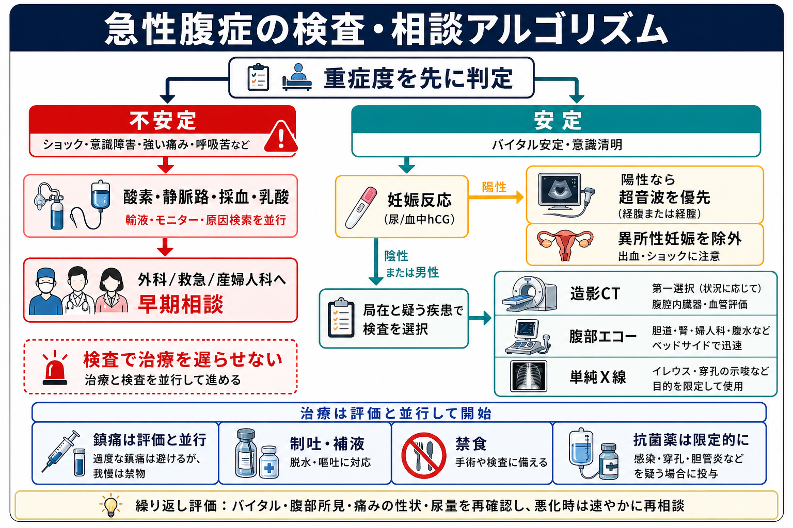
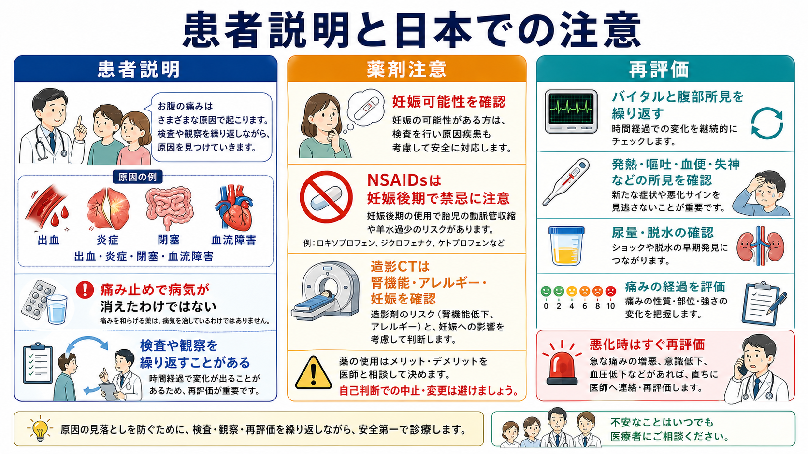

---
title: "急性腹症を見たら最初に何を確認するか"
description: "ショック、腹膜刺激症状、妊娠可能性、外科疾患の有無を早期に評価する。"
aliases:
  - "急性腹症の初期確認"
tags:
  - 領域/救急・初期対応
  - 種類/クリニカルクエスチョン
  - 対象/研修医
question: "急性腹症を見たら最初に何を確認するか"
clinical_area: "救急・初期対応"
audience: "研修医"
evidence_level: "mixed"
created: "2026-04-27"
updated: "2026-04-27"
enableToc: true
---

# 急性腹症を見たら最初に何を確認するか

> このノートは研修医教育のための一般的整理であり、個別患者の診断・治療指示ではありません。緊急性が高い、判断に迷う、施設方針が関わる場合は上級医・専門科に相談してください。

## クリニカルクエスチョン

急性腹症を見たら最初に何を確認するか。

## まず結論

- 最初に病名を当てに行くより、まず「ショックか」「腹膜刺激症状があるか」「妊娠可能性があるか」「緊急外科疾患らしいか」を確認する。
- 急性腹症診療ガイドライン2025第2版は、急性腹症に的確に対応するため、症状と初期対応を重視した国内ガイドラインとして改訂されている[9]。2015版の初期診療アルゴリズム解説では、Step 1でバイタル異常を伴う緊急疾患を拾い、Step 2で出血、臓器虚血、汎発性腹膜炎、臓器急性炎症を鑑別する考え方が示されている[1]。
- 低血圧、意識障害、冷汗、頻呼吸、SpO2低下、乏尿、乳酸上昇などがあれば、検査を待たずに蘇生、モニター、静脈路、採血、上級医・外科・救急への相談を並行する[1,7]。
- 妊娠可能年齢の患者では、問診だけで妊娠を除外せず、尿または血中hCGを早期に確認する。陽性なら異所性妊娠を常に除外対象に入れる[3,6]。
- 鎮痛は診断を放棄することではない。過鎮静を避け、再評価を前提に、痛みの緩和と診断を並行してよい[8]。

## 判断の型

1. **まず重症度**: ABCDE、意識、皮膚冷感、血圧、脈拍、呼吸数、SpO2、体温、尿量、痛みの経過を確認する。ショックなら病名検索より蘇生と相談を先行する[1,7]。
2. **次に腹部所見**: 反跳痛、筋性防御、板状硬、体動で増悪する痛み、腹部膨満、腸蠕動音、鼠径部、背部、CVA叩打痛、直腸診・骨盤診の必要性を考える[1]。
3. **妊娠可能性を確認**: 最終月経、避妊、不正性器出血、失神、肩痛、hCG、超音波を組み合わせる。妊娠反応陽性の腹痛では異所性妊娠を除外するまで安全側に扱う[3,6]。
4. **外科疾患の4分類で考える**: 出血、虚血、穿孔・汎発性腹膜炎、急性炎症を先に拾う[1]。
5. **検査と治療を並行**: 採血、尿検査、画像検査、鎮痛、制吐、補液、禁食、抗菌薬、外科相談は直列ではなく、緊急度に応じて並行させる[1,2,5,7,8]。

## 初期対応

- **ABCDEとモニター**: 気道、呼吸、循環、意識、体温を確認し、心電図、血圧、SpO2を装着する。ショックを疑う場合は太い静脈路、採血、血液型、不規則抗体、乳酸、血液ガス、尿量評価を早める[7]。
- **ショックなら同時進行**: 酸素、輸液、輸血準備、感染源・出血源・虚血の検索、外科・救急・集中治療への相談を並行する。敗血症性ショックを疑う場合は抗菌薬、乳酸測定、輸液、昇圧薬、感染源コントロールの遅れを避ける[7]。
- **禁食とルート確保**: 手術、内視鏡、鎮静、造影検査の可能性がある場合は禁食を指示し、末梢静脈路を確保する。
- **痛みを我慢させない**: 鎮痛前後で痛みの部位、圧痛、腹膜刺激症状、バイタルを記録し、再評価する。オピオイド鎮痛は診断精度を大きく損なうとは示されていないが、過鎮静、呼吸抑制、血圧低下には注意する[8]。
- **日本での注意**: NSAIDsは妊娠後期で禁忌であり、妊娠中期以前や妊娠可能性がある場合も有益性とリスクを慎重に判断する。ロキソプロフェン添付文書では妊娠後期投与禁止、胎児腎機能障害、羊水過少、胎児動脈管収縮への注意が示されている[4]。

## 鑑別・見逃し

| 優先度 | 疾患・状態 | 見逃さない理由 | 手がかり |
|---|---|---|---|
| 高 | 出血性ショック、腹腔内出血、破裂性腹部大動脈瘤 | 数分から数十分で悪化しうる | 低血圧、冷汗、失神、背部痛、貧血進行、抗凝固薬内服 |
| 高 | 腸管虚血、絞扼性腸閉塞 | 早期診断が遅れると腸管壊死に進む | 痛みが強いのに腹部所見が乏しい、乳酸上昇、心房細動、腹部手術歴 |
| 高 | 消化管穿孔、汎発性腹膜炎 | 緊急手術やドレナージが必要になりうる | 板状硬、反跳痛、遊離ガス、発熱、敗血症所見 |
| 高 | 異所性妊娠 | 破裂で生命に関わる出血を起こす | 妊娠反応陽性、下腹部痛、不正出血、失神、肩痛[3,6] |
| 中 | 急性虫垂炎、胆嚢炎、胆管炎、膵炎、憩室炎 | 初期は非典型で、敗血症や穿孔に進むことがある | 発熱、局在痛、炎症反応、肝胆道系酵素、リパーゼ、画像所見 |
| 中 | 尿路結石、腎盂腎炎、精巣捻転、卵巣茎捻転 | 腹痛として来院し、臓器温存に時間制限がある疾患を含む | 側腹部痛、CVA叩打痛、血尿、陰嚢痛、片側下腹部痛 |
| 中 | 心筋梗塞、大動脈解離、肺塞栓 | 腹痛・嘔吐として現れることがある | 胸背部痛、冷汗、心電図変化、低酸素、左右差、リスク因子 |

## 検査

| 検査 | 目的 | 注意点 |
|---|---|---|
| バイタル再測定、意識、尿量 | ショック・敗血症・脱水の把握 | 1回正常でも安心しない。痛み止め後、輸液後、画像待ち中に再評価する[7]。 |
| 血算、生化学、肝胆道系酵素、腎機能、電解質、CRP | 炎症、出血、腎機能、造影可否、臓器障害の把握 | CRP陰性でも早期重症疾患は除外できない。 |
| 血液ガス、乳酸 | 低灌流、敗血症、腸管虚血の補助評価 | 乳酸正常でも腸管虚血は完全除外できない。経時変化を見る。 |
| 尿検査、尿沈渣 | 尿路結石、尿路感染、脱水、妊娠反応の足がかり | 血尿があっても大動脈疾患や婦人科疾患を除外しない。 |
| 尿または血中hCG | 妊娠・異所性妊娠リスクの確認 | 妊娠可能年齢では早期に確認する。陽性なら画像選択と薬剤選択に影響する[3,6]。 |
| 腹部エコー | 胆道、腹水、腹部大動脈、尿路、婦人科領域の迅速評価 | 術者依存性があり、陰性で重症疾患を除外しない。 |
| 造影CT | 出血、穿孔、炎症、閉塞、虚血、血管病変の評価 | 非限局性腹痛や重症疾患検索で有用だが、妊娠、腎機能、造影剤アレルギー、施設方針を確認する[2,5]。 |
| 単純X線 | イレウス、遊離ガス、尿路結石などの補助 | 目的を限定する。CTや超音波が必要な状況を単純X線だけで止めない。 |

## 治療・マネジメント

- **蘇生優先**: ショック、意識障害、低酸素、敗血症疑い、腹膜炎所見があれば、検査完了を待たずに上級医へ共有し、蘇生と原因検索を並行する[1,7]。
- **外科相談の閾値を下げる**: 汎発性腹膜炎、消化管穿孔、腸管虚血、絞扼性腸閉塞、持続するショック、画像で手術・ドレナージが必要そうな所見があれば早期に相談する[1]。
- **妊娠反応陽性なら産婦人科へ早めに相談**: 腹痛、不正出血、失神、腹腔内出血疑いでは異所性妊娠を除外するまで安全側に扱う[3,6]。
- **鎮痛・制吐・補液**: 疼痛緩和、嘔吐への対応、脱水補正を行いながら、所見を記録して再評価する。鎮痛で腹痛が軽くなっても原因疾患が消えたわけではない[8]。
- **抗菌薬**: 胆管炎、穿孔、腹膜炎、腸管壊死、敗血症など感染や汚染を疑う状況では、採血・培養を考慮しつつ抗菌薬開始を遅らせない。ただし培養採取で抗菌薬投与を大きく遅らせない[7]。
- **日本での注意**: 造影CT、NSAIDs、オピオイド、抗菌薬は施設採用薬、腎機能、妊娠可能性、アレルギー、保険適用、院内プロトコルに沿って選択する。妊娠後期のNSAIDsは添付文書上禁忌である[4]。

## 図解

## 指導医に確認するポイント

- この患者は「安定」か「不安定」か。不安定なら、今どの専門科へ同時に連絡するか。
- 腹膜刺激症状、板状硬、痛みと所見の不釣り合い、乳酸上昇をどう解釈するか。
- 妊娠可能性がある患者で、hCG確認前に使ってよい薬剤・避ける薬剤は何か。
- 造影CT、腹部エコー、婦人科エコー、内視鏡、手術相談の順番をどうするか。
- 帰宅可能と判断する場合、再診基準、観察時間、説明内容、記録内容は十分か。

## 患者説明

- 「お腹の強い痛みには、炎症、出血、腸の詰まり、血流の問題、妊娠に関連する病気など、急いで確認すべき原因が含まれます。」
- 「痛み止めで楽になっても、原因がなくなったとは限らないため、診察、血液検査、尿検査、画像検査、再評価を組み合わせて確認します。」
- 「妊娠の可能性がある場合は、薬や画像検査の選び方が変わるため、妊娠反応を確認します。」
- 「症状が悪化する、ふらつく、発熱する、吐き続ける、血便が出る、痛みの場所が変わる場合は、すぐに再評価が必要です。」

## ピットフォール

- 最初から虫垂炎、胃腸炎、尿路結石などの病名に寄せすぎて、ショックと腹膜刺激症状の確認が遅れる。
- 若年女性の腹痛で、妊娠可能性を問診だけで除外する。
- CRPが低い、腹部所見が弱い、単純X線で大きな異常がない、という理由だけで腸管虚血や異所性妊娠を除外する。
- 鎮痛を避け続けて患者を苦痛のまま待たせる一方、鎮痛後の再評価を記録しない。
- 造影CTの前に腎機能、アレルギー、妊娠可能性を確認しない。
- NSAIDsを「腹痛の標準薬」として漫然と使い、妊娠後期、腎機能障害、消化管出血リスクを見落とす[4]。

## 関連ノート

- 現時点で、このジョブ内では存在確認済みの関連ノートは追加していません。
- 作成候補: 急性腹症で造影CTを撮るタイミング
- 作成候補: 妊娠可能年齢の腹痛で何を確認するか
- 作成候補: 腹痛患者の鎮痛薬をどう選ぶか

## MOC更新候補

- [[MOC｜救急・初期対応]]
- MOC｜消化器.md（本サイト外）
- MOC｜産婦人科.md（本サイト外）

## 参考文献

[1] 小豆畑丈夫, 前田重信, 吉田雅博, 真弓俊彦. 急性腹症診療ガイドライン2015：初期診療アルゴリズムが目指すもの. 日本腹部救急医学会雑誌. 2017;37(4):551-557. https://doi.org/10.11231/jaem.37.551

[2] 日本医学放射線学会. 画像診断ガイドライン2021年版（第3版）. 2021. https://www.radiology.jp/guideline/diagnostic_imaging_guideline.html

[3] 日本産科婦人科学会, 日本産婦人科医会. 産婦人科診療ガイドライン－婦人科外来編2023. 2023. https://www.jsog.or.jp/activity/pdf/gl_fujinka_2023.pdf

[4] PMDA. ロキソニン錠60mg／ロキソニン細粒10% 医療用医薬品情報・添付文書. 2025. https://www.pmda.go.jp/PmdaSearch/rdSearch/02/1149019C1149?user=1

[5] Chang KJ, Scheirey CD, et al. ACR Appropriateness Criteria Acute Nonlocalized Abdominal Pain. J Am Coll Radiol. 2018;15(11S):S217-S231. https://doi.org/10.1016/j.jacr.2018.09.010

[6] NICE. Ectopic pregnancy and miscarriage: diagnosis and initial management. NICE guideline NG126. 2019, updated. https://www.nice.org.uk/guidance/ng126

[7] Evans L, Rhodes A, Alhazzani W, et al. Surviving Sepsis Campaign: international guidelines for management of sepsis and septic shock 2021. Intensive Care Med. 2021;47:1181-1247. https://doi.org/10.1007/s00134-021-06506-y

[8] Manterola C, Vial M, Moraga J, Astudillo P. Analgesia in patients with acute abdominal pain. Cochrane Database Syst Rev. 2011;(1):CD005660. https://doi.org/10.1002/14651858.CD005660.pub3

[9] 急性腹症診療ガイドライン2025改訂出版委員会. 急性腹症診療ガイドライン2025 第2版. 医学書院. 2025. https://www.igaku-shoin.co.jp/book/detail/115447

## 更新ログ

- 2026-04-27: 初版作成。
