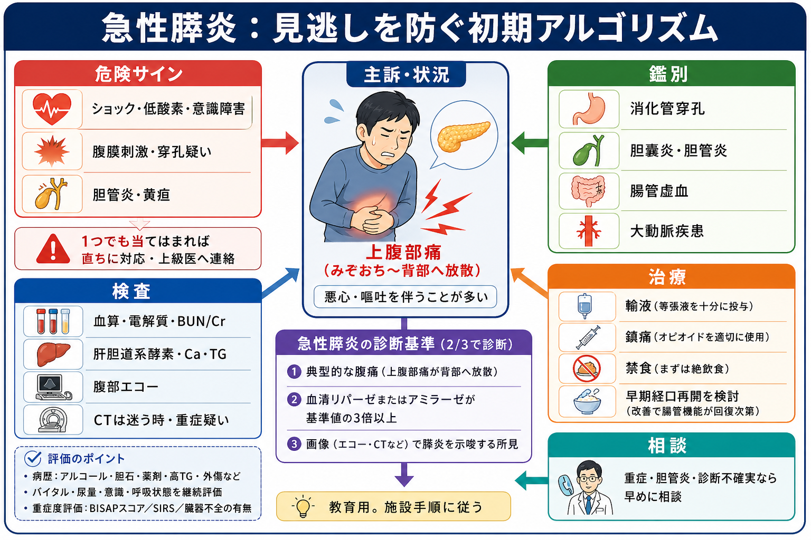
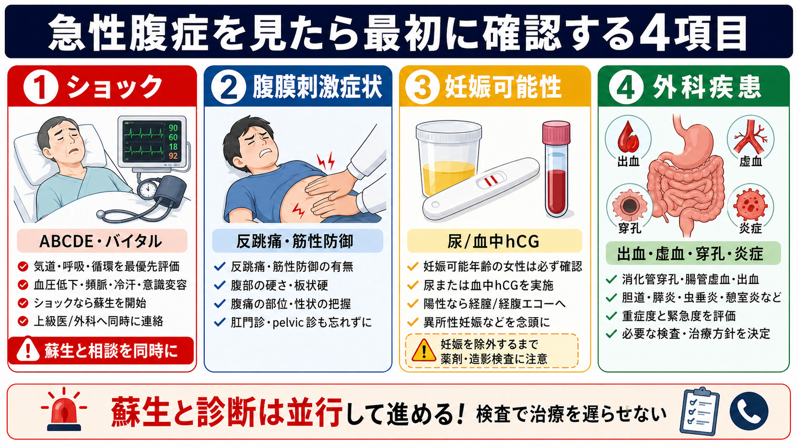
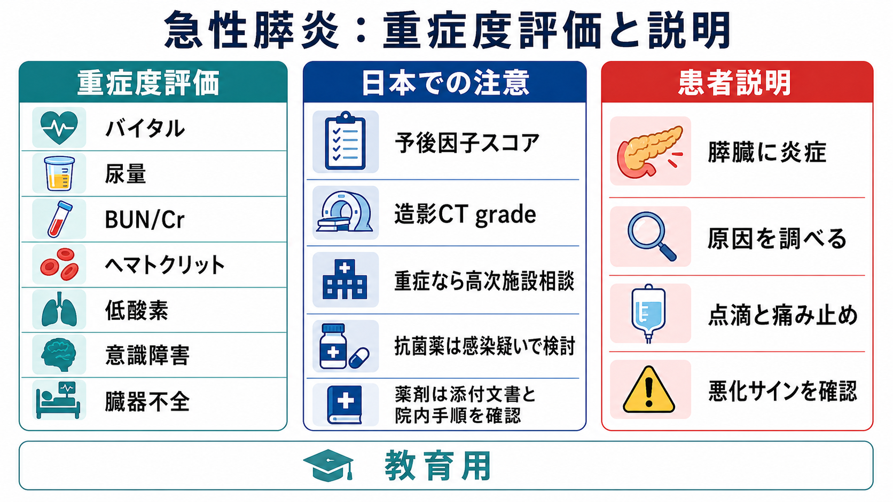

---
title: "急性膵炎を疑ったら救急外来で何をするか"
description: "腹痛、膵酵素、CT適応、輸液、重症度評価を救急外来で使う順に整理する。"
aliases:
  - "急性膵炎初期対応"
  - "急性膵炎の救急対応"
tags:
  - 領域/救急・初期対応
  - 種類/クリニカルクエスチョン
  - 対象/研修医
question: "急性膵炎を疑ったら救急外来で何をするか"
clinical_area: "救急・初期対応"
audience: "研修医"
evidence_level: "guideline"
created: "2026-04-27"
updated: "2026-04-27"
enableToc: true
---

# 急性膵炎を疑ったら救急外来で何をするか

> このノートは研修医教育のための一般的整理であり、個別患者への診断・治療指示ではありません。重症感が強い、診断に迷う、施設方針や搬送判断が関わる場合は、上級医・救急科・消化器内科・外科へ早めに相談してください。

## クリニカルクエスチョン

急性膵炎を疑う腹痛患者で、救急外来の最初の数時間に何を確認し、どの検査を出し、いつCTを撮り、輸液・鎮痛・重症度評価をどう進めるか。

## まず結論

- まず「急性膵炎らしいか」より前に、ショック、低酸素、腹膜刺激、消化管穿孔、腸管虚血、大動脈疾患、胆管炎を同時に拾う。
- 急性膵炎は、典型的腹痛、膵酵素が基準上限の3倍以上、画像所見の3項目中2項目で診断する。血中リパーゼを優先し、アミラーゼだけで安心しない。[1], [4]
- CTは全例の初手ではない。診断不確実、重症疑い、合併症疑い、経過不良、ほかの腹部救急を除外したい場面で検討する。[1], [3]
- 初期治療は、循環評価を反復しながらの適切な輸液、鎮痛、嘔吐対応、原因検索、重症度評価である。過剰輸液は害になりうるため、BUN/Cr、ヘマトクリット、尿量、呼吸状態で調整する。[3], [9]
- 日本では厚労省急性膵炎重症度判定基準に基づく予後因子スコアと造影CT gradeを使い、重症例は高次施設・ICU・専門科へ早くつなぐ。[1], [6]

## 判断の型

1. **まず腹痛の危険疾患を同時に除外する。** 血圧低下、冷汗、意識変容、低酸素、板状硬、反跳痛、黄疸・発熱、突然発症の背部痛では、膵炎だけに固定しない。
2. **診断は2/3基準で置く。** 上腹部痛が背部へ放散し、悪心・嘔吐を伴い、血中リパーゼまたはアミラーゼが基準上限の3倍以上なら、画像なしでも診断できることが多い。[1], [4]
3. **原因を初期から探す。** 胆石、飲酒、高トリグリセリド血症、高カルシウム血症、薬剤、ERCP後、外傷、腫瘍を意識する。胆石性では胆管炎・閉塞性黄疸がERCP相談の分岐になる。[1], [3]
4. **重症化を早く拾う。** 診断時に軽症でも悪化しうるため、バイタル、尿量、呼吸状態、BUN/Cr、ヘマトクリット、SIRS、臓器不全を反復評価する。[3], [6]

## 初期対応

- ABCDEで気道、呼吸、循環、意識、体温を確認し、ショックや低酸素があれば蘇生を優先する。
- 末梢静脈路を確保し、採血を出す。必要なら心電図、胸腹部X線、腹部エコー、妊娠可能性がある患者では妊娠反応も同時に検討する。
- 輸液は「たくさん入れる」ではなく「循環不全を補正し、過剰輸液を避ける」方針で開始する。乳酸リンゲル液を用いた中等量・目標指向型の輸液が海外ガイドラインで重視されるが、心不全・腎不全・高齢者ではより慎重に調整する。[3], [9]
- 疼痛は我慢させない。オピオイドを含む鎮痛薬を、呼吸抑制・血圧・意識・腎機能を見ながら使う。
- 嘔吐、腸管麻痺、重症感が強い間は絶飲食とし、改善すれば早期経口摂取または経腸栄養を検討する。不要な長期絶食は避ける。[2], [5]
- 胆管炎、持続する胆道閉塞、感染性膵壊死が疑われる場合を除き、予防的抗菌薬を漫然と開始しない。[1], [2], [5]

## 鑑別・見逃し

| 優先度 | 疾患・状況 | 見逃さない理由 | 手がかり |
|---|---|---|---|
| 高 | 消化管穿孔・汎発性腹膜炎 | 手術・緊急介入が遅れる | 板状硬、反跳痛、free air、急な増悪 |
| 高 | 腸管虚血 | 早期所見が乏しく致死的 | 強い疼痛、乳酸上昇、心房細動、血便 |
| 高 | 大動脈解離・腹部大動脈瘤破裂 | 背部痛で膵炎に見える | 突然発症、血圧左右差、拍動性腫瘤、ショック |
| 高 | 急性胆管炎・胆嚢炎 | ERCP・抗菌薬・ドレナージの判断が必要 | 発熱、黄疸、胆道系酵素上昇、胆管拡張 |
| 中 | 急性冠症候群 | 心窩部痛で来る | ECG変化、トロポニン、冷汗、リスク因子 |
| 中 | 高TG血症性膵炎・高Ca血症 | 初期原因検索で治療が変わる | TG高値、乳び血清、Ca高値 |

## 検査

| 検査 | 目的 | 注意点 |
|---|---|---|
| 血中リパーゼ | 診断の中心 | アミラーゼより膵特異性が高く、可能なら優先する。[1] |
| 血清アミラーゼ | 診断補助 | 唾液腺疾患、腎不全、腸管疾患でも上がる。発症時期で正常化しうる。 |
| 血算、BUN/Cr、電解質、血糖 | 重症化・脱水・腎機能評価 | BUN上昇、Cr上昇、ヘマトクリット上昇は輸液反応性と重症化評価に使う。[3] |
| AST/ALT、ALP、γ-GTP、Bil | 胆石性・胆管炎の評価 | ALT高値、黄疸、胆管拡張があれば胆道閉塞を疑う。 |
| Ca、TG | 原因検索 | TGは1000 mg/dL以上で原因として強く疑うが、採血タイミングにも注意する。[3] |
| CRP、動脈血ガス、乳酸 | 重症度・鑑別 | 低酸素、代謝性アシドーシス、乳酸上昇は膵炎以外の腹部救急も再考する。 |
| 腹部エコー | 胆石・胆管拡張 | 初期評価に有用。陰性でも胆石性を完全には否定しない。[3] |
| 造影CT | 診断不確実、重症疑い、合併症疑い | 発症早期は壊死評価が不十分なことがあり、腎機能・造影リスクも確認する。[1], [3] |

## 治療・マネジメント

- **輸液:** 循環不全、BUN/Cr上昇、ヘマトクリット上昇、尿量低下があれば補正する。WATERFALL試験では早期の過剰輸液が臨床転帰を改善せず、体液過剰を増やしたため、反復評価で調整する。[9]
- **鎮痛:** 痛みは交感神経亢進、換気低下、評価困難につながる。禁忌を確認し、NSAIDs、アセトアミノフェン、オピオイドを施設手順に沿って使う。
- **栄養:** 軽症で嘔吐や腸管麻痺が落ち着けば、早期経口摂取を検討する。重症で経口困難な場合も、可能なら早期経腸栄養を検討する。[2], [5]
- **抗菌薬:** 予防投与は原則避ける。胆管炎、感染性壊死、肺炎・尿路感染など明確な感染巣があれば、その感染症として治療する。[1], [5]
- **胆石性膵炎:** 胆管炎または持続する胆道閉塞があれば早期ERCPを専門科へ相談する。胆石性軽症例では再発予防の胆嚢摘出時期を入院中に相談する。[3], [5]
- **重症例:** 臓器不全、低酸素、ショック、意識障害、尿量低下、予後因子スコア高値、造影CT grade高値では、ICU・高次施設・消化器内科・外科へ早くつなぐ。[1], [6]

### 日本での注意

- 日本の急性膵炎診療では、厚労省急性膵炎重症度判定基準の予後因子スコアと造影CT gradeが使われる。海外文献のBISAP、SIRS、modified Marshall分類だけで完結させない。[1], [6]
- ナファモスタット、ガベキサートなどの蛋白分解酵素阻害薬は、日本の添付文書上は膵炎の急性症状改善に効能・効果がある製剤がある。ただし、救急外来の初期対応の主役は輸液、鎮痛、重症度評価、原因治療であり、使用は院内方針、添付文書、専門科判断を確認する。[7], [8]
- PMDA添付文書は改訂されるため、投与量、配合変化、禁忌、相互作用、重篤な副作用は投与時点の最新版で確認する。[7], [8]

## 図解

## 指導医に確認するポイント

- この患者は膵炎でよいか、ほかの腹部救急を先に除外すべきか。
- CTを今撮る理由があるか。診断不確実、重症疑い、合併症疑い、鑑別除外のどれか。
- 輸液量は過不足ないか。尿量、BUN/Cr、ヘマトクリット、呼吸状態で調整できているか。
- 重症度判定基準、ICU適応、転送基準、専門科コンサルトのタイミング。
- 胆管炎・胆道閉塞があり、ERCPを急ぐべきか。
- 抗菌薬や蛋白分解酵素阻害薬を使う場合、その根拠と施設方針。

## 患者説明

- 「膵臓に急な炎症が起きている可能性があります。血液検査と必要な画像検査で確認します。」
- 「多くは点滴、痛み止め、吐き気への対応で改善しますが、一部は呼吸・腎臓・循環に影響して重くなるため、何度も状態を見直します。」
- 「原因として胆石、飲酒、脂質、カルシウム、薬剤などを調べます。原因によっては内視鏡や手術の相談が必要です。」
- 「息苦しさ、痛みの増悪、尿が少ない、ぼんやりする、発熱や黄疸が出る場合はすぐ知らせてください。」

## ピットフォール

- アミラーゼが高いだけで膵炎と決めつける。リパーゼ、症状、画像、鑑別を合わせる。
- CTを撮ったから安全と考える。発症早期は壊死や重症化を十分に反映しないことがある。
- 「膵炎らしい腹痛」に引っ張られて、消化管穿孔、腸管虚血、大動脈疾患、ACSを見落とす。
- 初期に大量輸液を固定量で続け、低酸素や体液過剰を見逃す。
- 予防的抗菌薬をルーチンで開始する。
- 胆管炎・閉塞性黄疸を伴う胆石性膵炎でERCP相談が遅れる。
- 重症度判定を診断時だけで終え、24時間以内、24-48時間の再評価を忘れる。

## 関連ノート

- 関連ノート候補: `腹痛で見逃してはいけない疾患.md`
- 関連ノート候補: `急性胆管炎を疑ったら何をするか.md`
- 関連ノート候補: `救急外来での輸液の考え方.md`
- 関連ノート候補: `腹部CTを救急外来でいつ撮るか.md`

## MOC更新候補

- [[MOC｜救急・初期対応]]
- MOC｜消化器.md（本サイト外）
- [[MOC｜腹痛・消化管出血]]

## 参考文献

[1] 急性膵炎診療ガイドライン2021改訂出版委員会. 急性膵炎診療ガイドライン 2021 第5版. Mindsガイドラインライブラリ. https://minds.jcqhc.or.jp/summary/c00697/

[2] 岡本好司. 急性膵炎診療フローチャートとPancreatitis Bundles 2021. 膵臓. 2022;37(5):222-228. https://doi.org/10.2958/suizo.37.222

[3] Tenner S, Vege SS, Sheth SG, et al. American College of Gastroenterology Guidelines: Management of Acute Pancreatitis. Am J Gastroenterol. 2024;119(3):419-437. https://doi.org/10.14309/ajg.0000000000002645

[4] Banks PA, Bollen TL, Dervenis C, et al. Classification of acute pancreatitis--2012: revision of the Atlanta classification and definitions by international consensus. Gut. 2013;62(1):102-111. https://doi.org/10.1136/gutjnl-2012-302779

[5] Crockett SD, Wani S, Gardner TB, et al. American Gastroenterological Association Institute Guideline on Initial Management of Acute Pancreatitis. Gastroenterology. 2018;154(4):1096-1101. https://doi.org/10.1053/j.gastro.2018.01.032

[6] 片岡慶正. 急性膵炎重症度判定基準2008改訂―検証と今後の展開. 日本消化器病学会雑誌. 2008;105(8):1166-1173. https://doi.org/10.11405/nisshoshi.105.1166

[7] PMDA. ナファモスタットメシル酸塩注射用 医療用医薬品情報・添付文書. https://www.pmda.go.jp/PmdaSearch/rdSearch/02/3999407D2358?user=1

[8] PMDA. ガベキサートメシル酸塩注射用 医療用医薬品情報・添付文書. https://www.pmda.go.jp/PmdaSearch/rdSearch/02/3999403D2120?user=1

[9] de-Madaria E, Buxbaum JL, Maisonneuve P, et al. Aggressive or Moderate Fluid Resuscitation in Acute Pancreatitis. N Engl J Med. 2022;387(11):989-1000. https://doi.org/10.1056/NEJMoa2202884

## 更新ログ

- 2026-04-27: 初版作成。急性膵炎の救急外来初期対応、検査、CT適応、輸液、重症度評価、図解3点を追加。
