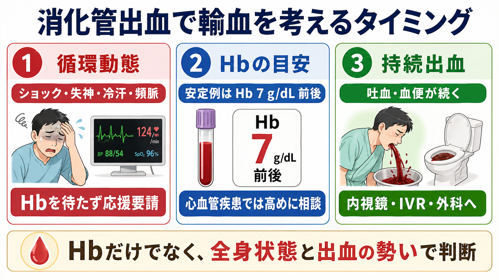
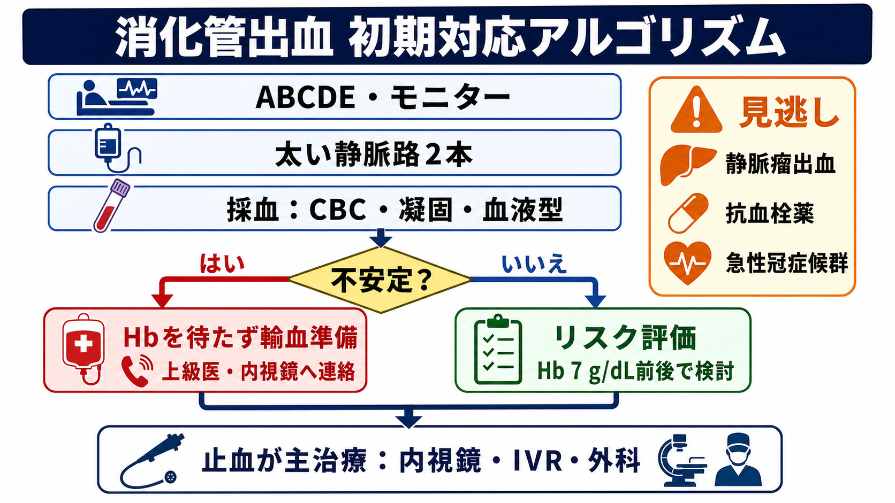
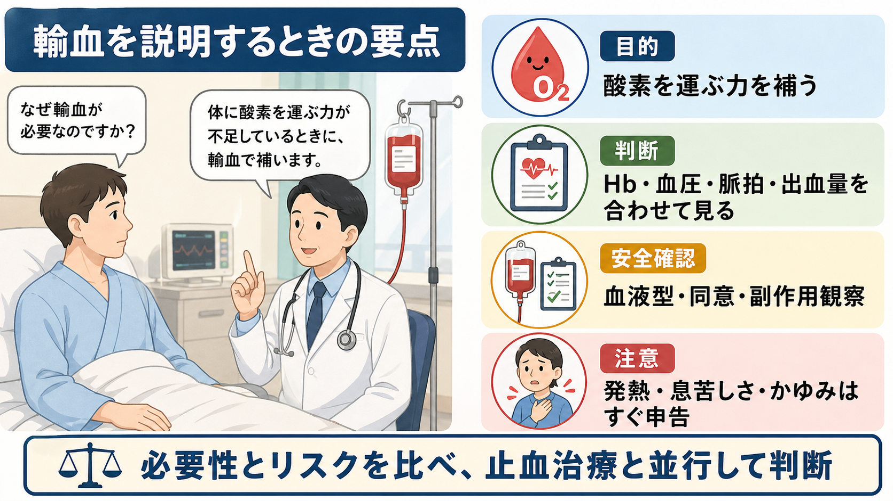

---
title: "消化管出血で輸血を考えるタイミングはいつか"
description: "Hbだけでなく循環動態、持続出血、基礎疾患を踏まえて輸血判断を行う。"
aliases:
  - "消化管出血の輸血タイミング"
tags:
  - 領域/救急・初期対応
  - 種類/クリニカルクエスチョン
  - 対象/研修医
question: "消化管出血で輸血を考えるタイミングはいつか"
clinical_area: "救急・初期対応"
audience: "研修医"
evidence_level: "guideline/review"
created: "2026-04-27"
updated: "2026-04-27"
enableToc: true
---

# 消化管出血で輸血を考えるタイミングはいつか

> このノートは研修医教育のための一般的整理であり、個別患者の診断・治療指示ではありません。緊急性が高い、判断に迷う、施設方針が関わる場合は上級医・専門科に相談してください。

## クリニカルクエスチョン

消化管出血で、Hb値だけでなく循環動態、持続出血、基礎疾患を踏まえて赤血球輸血を考えるタイミングはいつか。

## まず結論

- 消化管出血の輸血判断は「Hb 7 g/dL未満なら輸血、7以上なら不要」という単純な線引きではなく、循環動態、出血の勢い、心血管疾患、年齢、抗血栓薬、止血介入までの時間を合わせて判断する。[1],[2],[6],[8]
- 血行動態が安定している上部消化管出血では、制限的輸血を基本にし、Hb 7 g/dL前後を赤血球輸血検討の目安にする。[1],[6],[9]
- ショック、失神、冷汗、意識障害、持続する吐血・血便、乳酸上昇などがあれば、初回Hbを待たずに応援要請、輸血準備、止血治療への連絡を始める。[1],[2],[3],[8]
- 心血管疾患、症候性貧血、高齢、低酸素、活動性出血では、Hb 7 g/dLだけで待たず、Hb 8 g/dL前後や臨床症状を含めて上級医と相談する。[1],[2],[6],[7]
- 静脈瘤出血では、過剰輸血で門脈圧上昇や再出血が問題になり得るため、循環維持をしながらHb 7-8 g/dL程度を目標にした慎重な輸血が推奨される。[8]
- 日本では、2026年に厚生労働省が従来の使用指針等を廃止し、日本輸血・細胞治療学会の「輸血療法実践ガイド」参照へ整理している。実際の緊急輸血、同意、照合、O型赤血球使用、輸血副作用対応は院内手順に従う。[1],[3],[5]

## 判断の型

1. まず「不安定か」を見る。収縮期血圧低下、頻脈、冷汗、意識障害、失神、尿量低下、乳酸上昇、末梢冷感があれば、Hb値を待たずに出血性ショックとして動く。
2. 次に「今も出ているか」を見る。吐血、鮮血便、黒色便の増加、胃管からの血性排液、直腸診で鮮血、短時間でHb低下があれば、輸血準備と止血介入を同時に進める。
3. 安定していれば、Hb 7 g/dL前後を赤血球輸血検討の目安にし、症状と基礎疾患で補正する。[1],[2],[6]
4. 心筋虚血、重症冠動脈疾患、心不全、低酸素、持続する胸痛・息切れがある場合は、より高いHbで輸血を検討する余地があるため上級医へ相談する。[1],[6],[7]
5. 輸血は止血までの橋渡しであり、内視鏡、IVR、外科、集中治療、輸血部門への連絡を遅らせない。[3],[4],[6],[8]

## 初期対応

- **ABCDEと応援要請**: ショック、吐血中、意識障害、気道リスク、持続する大量血便があれば、上級医、消化器内科、内視鏡チーム、輸血部へ早く連絡する。
- **モニターとルート**: 心電図、SpO2、血圧を装着し、18G以上の末梢静脈路2本を目標に確保する。難しければ早期に別ルートを相談する。
- **採血**: CBC、PT-INR、APTT、フィブリノゲン、血液型、不規則抗体、交差適合、血ガス・乳酸、腎機能、肝機能を出す。抗凝固薬内服中は薬剤名と最終内服を確認する。
- **輸血準備**: 不安定例では交差適合完了を待たずに院内の緊急輸血手順を確認する。血液型確定前のO型赤血球、同型未交差血、交差適合後血の扱いは施設手順に従う。[1],[5]
- **止血ルート**: 上部消化管出血では内視鏡を早期に計画し、非静脈瘤性出血では内視鏡的止血が第一選択になる。[3],[4],[6]
- **過剰輸血を避ける**: 安定例では制限的輸血を基本にする。特に静脈瘤出血では過剰輸血を避け、循環維持と止血治療を並行する。[8],[9]

## 鑑別・見逃し

| 優先度 | 疾患・状態 | 見逃さない理由 | 手がかり |
|---|---|---|---|
| 高 | 出血性ショック | Hbがまだ高くても急速に悪化する。輸血と止血介入を同時に進める必要がある。 | 低血圧、頻脈、冷汗、意識障害、乳酸上昇、尿量低下 |
| 高 | 食道胃静脈瘤出血 | 大量出血、再出血、肝不全を伴いやすい。過剰輸血にも注意が必要。 | 肝硬変、腹水、黄疸、吐血、血小板低下、PT延長 |
| 高 | 非静脈瘤性上部消化管出血 | 内視鏡的止血が主治療で、輸血だけでは解決しない。 | NSAIDs、低用量アスピリン、抗凝固薬、黒色便、心窩部痛 |
| 高 | 急性冠症候群を合併した貧血 | Hb閾値を単純に低く設定しにくく、酸素供給不足が問題になる。 | 胸痛、心電図変化、トロポニン上昇、既知冠動脈疾患 |
| 中 | 下部消化管出血の大量出血 | 上部出血と同様に循環不全を来す。 | 鮮血便、腹痛、憩室、虚血性腸炎、抗血栓薬 |
| 中 | 輸血副作用・TACO/TRALI | 輸血開始後の発熱、呼吸困難、低酸素を見逃すと危険。 | 輸血中から輸血後の発熱、悪寒、息苦しさ、SpO2低下 |

## 検査

| 検査 | 目的 | 注意点 |
|---|---|---|
| CBC | Hb、血小板、短時間変化の把握 | 急性出血直後のHbは出血量を反映しないことがある。初回値だけで安心しない。 |
| PT-INR、APTT、フィブリノゲン | 凝固障害、肝疾患、抗凝固薬影響の評価 | 静脈瘤出血、肝硬変、大量出血では凝固異常を同時に見る。 |
| 血液型、不規則抗体、交差適合 | 安全な赤血球輸血の準備 | 緊急輸血時も採血を可能な限り先に行い、院内手順に従う。[1],[5] |
| 血ガス、乳酸、電解質、Ca | 低灌流、アシドーシス、低Ca血症の確認 | 乳酸上昇はHb値以上に不安定さのサインになり得る。 |
| BUN/Cr、肝機能 | 上部出血、腎機能、肝硬変背景の評価 | 輸血量、薬剤、造影CT、内視鏡前評価にも関わる。 |
| 心電図、トロポニン | 心筋虚血合併の評価 | 胸痛、息切れ、既知冠動脈疾患、重症貧血では輸血閾値判断に影響する。[6],[7] |
| 造影CT、内視鏡 | 出血源と止血方針の決定 | 不安定例ではCTで待たず、内視鏡・IVR・外科へ早期相談する。 |

## 治療・マネジメント

- **安定例の基本**: 血行動態が安定している成人入院患者では、制限的赤血球輸血が多くの集団で支持され、Hb 7 g/dL未満を目安に輸血を考える。[1],[6]
- **消化管出血の目安**: 本邦の輸血療法実践ガイドでは、消化管出血における急性期貧血でHb 7-8 g/dLを輸血トリガー値として考慮する疾患群に含めている。[1]
- **上部消化管出血**: ACGは上部消化管出血でHb 7 g/dLを輸血閾値とする制限的方針を提案している。これは「安定している入院患者」を主な想定に使う。[6]
- **Hbを待たない場面**: ショック、持続吐血・大量血便、意識障害、乳酸上昇、輸液反応不良、止血まで時間がかかる状況では、Hb閾値ではなく危機的出血として輸血準備を進める。[1],[2]
- **心血管疾患**: AABBは血行動態安定成人ではHb 7 g/dL未満を推奨しつつ、心臓手術、整形外科手術、既存心血管疾患では7.5-8 g/dL程度の閾値を選ぶ余地を示している。消化管出血でも心筋虚血や重症冠動脈疾患があれば個別判断にする。[6],[7]
- **静脈瘤出血**: Baveno VIIは保存的な赤血球輸血を推奨し、Hb 7-8 g/dLを目標にしつつ、心血管疾患、年齢、血行動態、持続出血を考慮するとしている。[8]
- **輸血単位と再評価**: 赤血球1単位ごと、または施設運用に応じてバイタル、症状、出血状況、Hb、呼吸状態を再評価する。目標値だけを追って不要な追加輸血をしない。
- **日本での注意**: 赤血球液-LR「日赤」は赤血球不足または機能廃絶に用いる血液製剤で、使用には血液型照合、同意、副作用観察、記録、保管温度などの手順が関わる。[5] 緊急時例外も含め、院内輸血療法委員会の手順に従う。
- **抗血栓薬**: 抗凝固薬・抗血小板薬の中止や中和は、出血リスクと血栓リスクの両方を考える。冠動脈ステント、機械弁、脳梗塞高リスクなどでは勝手に止めず、上級医・専門科へ確認する。[2]

## 図解

## 指導医に確認するポイント

- この患者は血行動態が安定しているか、それともHbを待たずに輸血準備を始める状況か。
- 輸血閾値はHb 7 g/dLでよいか。心筋虚血、冠動脈疾患、心不全、低酸素、持続出血があり、Hb 8 g/dL前後で考えるべきか。
- 緊急輸血の手順は、O型赤血球、同型未交差血、交差適合後血のどれで進めるか。
- 赤血球だけでよいか。大量出血としてFFP、血小板、フィブリノゲン、Ca補正、保温を考える状況か。
- 内視鏡、IVR、外科、ICUのどれを先に呼ぶか。CTに行く余裕があるか。
- 抗凝固薬・抗血小板薬を中止・中和するか。血栓高リスクの背景はないか。

## 患者説明

- 「出血で、体に酸素を運ぶ赤血球が不足している可能性があります。」
- 「輸血が必要かは、血液検査のHbだけでなく、血圧、脈拍、出血が続いているか、心臓の病気があるかを合わせて判断します。」
- 「輸血には発熱、かゆみ、息苦しさなどの副作用やまれな感染症リスクがあります。必要性とリスクを比べながら、出血を止める治療と並行して行います。」
- 「輸血中や輸血後に息苦しさ、寒気、発熱、かゆみ、胸の苦しさがあればすぐ知らせてください。」

## ピットフォール

- 急性出血の初回Hbが正常範囲だから軽症、と判断する。
- Hb 7 g/dLを絶対基準として、ショックや持続出血がある患者の輸血準備を遅らせる。
- 逆に、安定している患者へ慣習的にHb 9-10 g/dLを目標に輸血してしまう。
- 静脈瘤出血で過剰輸血し、再出血リスクや門脈圧への影響を考えない。
- 赤血球輸血だけに集中し、内視鏡・IVR・外科への連絡、抗血栓薬確認、凝固異常、体温管理を忘れる。
- 輸血開始後の発熱、低酸素、呼吸困難、血圧低下を出血そのものと決めつけ、輸血副作用を見逃す。

## 関連ノート

- [[出血性ショックを疑ったとき輸液と輸血をどう考えるか]]
- 関連候補: 上部消化管出血の初期対応、静脈瘤出血を疑ったときの対応、抗凝固薬内服中の出血対応、輸血副作用を疑うタイミング。

## MOC更新候補

- [[MOC｜救急・初期対応]]
- MOC｜消化器.md（本サイト外）
- MOC｜血液・腫瘍・輸血.md（本サイト外）

## 参考文献

[1] 日本輸血・細胞治療学会. 輸血療法実践ガイド. 2026年2月. https://yuketsu.jstmct.or.jp/guidelines/

[2] 日本輸血・細胞治療学会. 科学的根拠に基づいた赤血球製剤の使用ガイドライン（改訂第3版）（2024年12月）. https://yuketsu.jstmct.or.jp/guidelines/

[3] 厚生労働省. 「血液製剤の使用指針」、「輸血療法の実施に関する指針」及び「血液製剤保管管理マニュアル」の廃止並びに「輸血療法実践ガイド」の周知について. 2026-03-24. https://www.mhlw.go.jp/stf/newpage_72052.html

[4] 藤城光弘, ほか. 非静脈瘤性上部消化管出血における内視鏡診療ガイドライン（第2版）. 日本消化器内視鏡学会雑誌. 2024;66(7):1515-1538. https://doi.org/10.11280/gee.66.1515

[5] PMDA. 照射赤血球液-LR「日赤」（1単位）／照射赤血球液-LR「日赤」（2単位） 医療用医薬品情報. https://www.pmda.go.jp/PmdaSearch/rdSearch/02/6342410X4039?user=1

[6] Laine L, Barkun AN, Saltzman JR, Martel M, Leontiadis GI. ACG Clinical Guideline: Upper Gastrointestinal and Ulcer Bleeding. Am J Gastroenterol. 2021;116(5):899-917. https://doi.org/10.14309/ajg.0000000000001245

[7] Carson JL, Stanworth SJ, Guyatt G, et al. Red Blood Cell Transfusion: 2023 AABB International Guidelines. JAMA. 2023;330(19):1892-1902. https://doi.org/10.1001/jama.2023.12914

[8] de Franchis R, Bosch J, Garcia-Tsao G, et al. Baveno VII - Renewing consensus in portal hypertension. J Hepatol. 2022;76(4):959-974. https://doi.org/10.1016/j.jhep.2021.12.022

[9] Villanueva C, Colomo A, Bosch A, et al. Transfusion strategies for acute upper gastrointestinal bleeding. N Engl J Med. 2013;368(1):11-21. https://doi.org/10.1056/NEJMoa1211801

## 更新ログ

- 2026-04-27: 初版作成。
