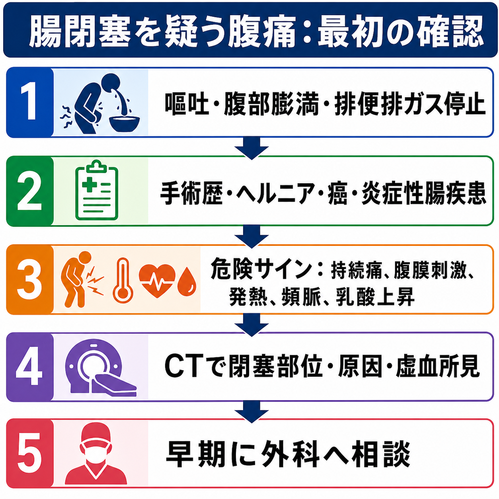
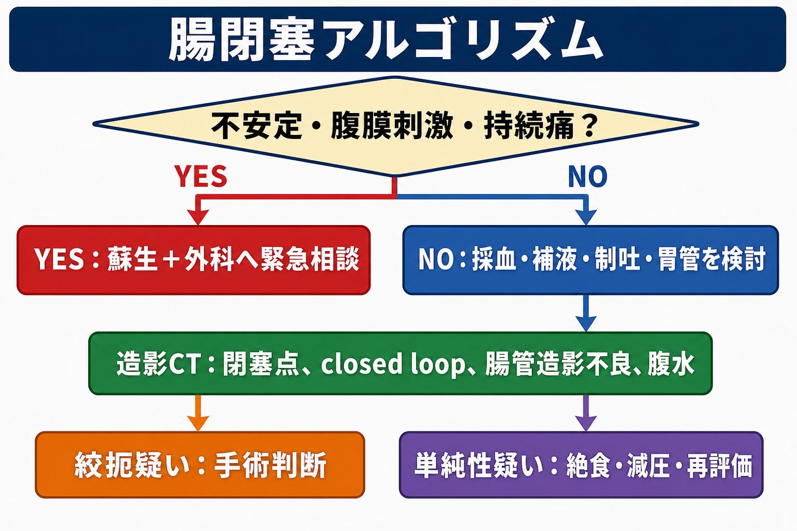
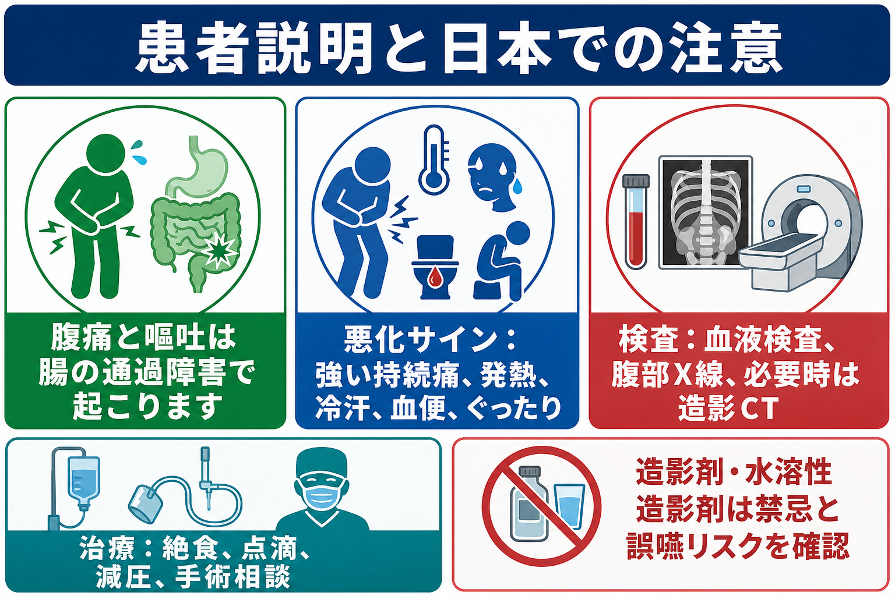

---
title: "腸閉塞を疑う腹痛では何を確認するか"
description: "嘔吐、腹部膨満、手術歴、絞扼の所見、画像評価、外科相談の判断を整理する。"
aliases:
  - "腸閉塞疑いの腹痛"
tags:
  - 領域/救急・初期対応
  - 種類/クリニカルクエスチョン
  - 対象/研修医
question: "腸閉塞を疑う腹痛では何を確認するか"
clinical_area: "救急・初期対応"
audience: "研修医"
evidence_level: "mixed"
created: "2026-04-27"
updated: "2026-04-27"
enableToc: true
---

# 腸閉塞を疑う腹痛では何を確認するか

> このノートは研修医教育のための一般的整理であり、個別患者への診断・治療指示ではありません。緊急性が高い、判断に迷う、施設方針が関わる場合は上級医・外科・放射線科へ早期に相談してください。

## クリニカルクエスチョン

腹痛、嘔吐、腹部膨満、排便・排ガス停止がある患者で、腸閉塞を疑ったときに研修医は何を確認し、どの所見で画像評価・外科相談へつなげるか。

## まず結論

- 腸閉塞を疑う腹痛では、最初に **不安定なバイタル、腹膜刺激、持続する強い痛み、発熱、頻脈、乳酸上昇、血便、意識低下** を確認する。これらは絞扼・虚血・穿孔・敗血症を示唆し、検査完了を待たず外科へ相談する根拠になる[1,2,4]。
- 問診では、嘔吐の性状と頻度、腹部膨満、排便・排ガス停止、腹部手術歴、ヘルニア、悪性腫瘍、炎症性腸疾患、放射線治療歴、便秘、薬剤、妊娠可能性を短時間で拾う。術後癒着は小腸閉塞の重要な原因である[4]。
- 身体診察では、腹部膨隆、蠕動音、圧痛の局在、反跳痛・筋性防御、ヘルニア門、手術瘢痕、脱水所見を反復評価する。初回診察が軽くても悪化しうるため、鎮痛後も再評価する[1,2]。
- 画像は腹部X線だけで終わらせず、閉塞部位、原因、closed loop、腸管壁造影不良、腸間膜浮腫、腹水、free air などを評価する目的で、必要時に造影CTを検討する[3,5,6]。
- 単純性の癒着性小腸閉塞が疑われ、虚血・穿孔・腹膜炎がなければ、絶食、輸液、電解質補正、制吐、減圧、反復診察で保存的にみる選択肢がある。ただし保存方針も外科と共有し、悪化時の手術判断を先に決めておく[4]。

## 判断の型

1. **まず急ぐかを決める。** ABCDE、ショック、腹膜刺激、持続痛、発熱、頻脈、乳酸上昇を確認する。危険サインがあれば、蘇生、抗菌薬や手術適応の相談を含めて外科へ早くつなぐ[1,2,4]。
2. **腸閉塞らしさを集める。** 嘔吐、腹部膨満、排便・排ガス停止、間欠的疝痛、手術歴、ヘルニア、癌既往を確認する。痛みが間欠痛から持続痛へ変わる場合は絞扼を疑う。
3. **閉塞の種類を考える。** 機械的な通過障害を「腸閉塞」、閉塞機転のない麻痺性病態を「イレウス」と区別して考える。日本では混用されることがあるため、申し送りでは「機械的閉塞か、麻痺性か」を言葉で補う[1,2]。
4. **画像で方針に必要な情報を取りに行く。** CTでは「閉塞点」「原因」「小腸か大腸か」「単純性か絞扼性か」「穿孔・虚血・腫瘍・ヘルニア」を見る[3,5,6]。
5. **保存でよいかを外科と共有する。** 保存的管理を選ぶ場合も、再診察間隔、減圧の方法、造影剤使用の可否、手術へ切り替える基準を明確にする[4,8,9]。

## 初期対応

- **安全確保とABCDE:** 嘔吐・誤嚥リスク、低酸素、循環不全、意識障害を先に確認する。反復嘔吐や高度膨満がある患者をCT室へ送る前に、吸引、酸素、静脈路、モニター、搬送体制を整える。
- **NPOと静脈路:** 腸閉塞が疑わしければ経口摂取を止め、補液、電解質補正、腎機能確認を進める。低Cl性代謝性アルカローシス、低K血症、脱水を見落とさない。
- **鎮痛・制吐:** 鎮痛で診断ができなくなると考えて我慢させない。鎮痛後に腹膜刺激や持続痛が残るかを再評価する。
- **減圧の検討:** 反復嘔吐、胃拡張、高度膨満、誤嚥リスクがある場合は、胃管などの減圧を上級医・外科と相談する。挿入前後で気道リスクを確認する。
- **早期共有:** 絞扼、穿孔、閉塞性大腸癌、嵌頓ヘルニア、循環不安定が疑われる場合は、CTや採血結果を待たずに外科・救急上級医へ共有する[1,4]。

## 鑑別・見逃し

| 優先度 | 疾患・病態 | 見逃すと危ない理由 | 手がかり |
|---|---|---|---|
| 高 | 絞扼性腸閉塞・closed loop obstruction | 腸管虚血、壊死、穿孔へ進む | 持続痛、腹膜刺激、発熱、頻脈、乳酸上昇、CTでclosed loop・造影不良・腹水[4,6] |
| 高 | 嵌頓ヘルニア | 閉塞と虚血を同時に起こす | 鼠径部・大腿部・腹壁瘢痕部の膨隆、圧痛、還納不能 |
| 高 | 腸管虚血・上腸間膜動脈閉塞 | 初期診察が軽くても致命的 | 痛みと身体所見の不釣り合い、心房細動、乳酸上昇、血便 |
| 高 | 消化管穿孔・汎発性腹膜炎 | 手術・抗菌薬・蘇生が遅れる | 突然の激痛、板状硬、free air、敗血症所見[1,2] |
| 中 | 閉塞性大腸癌・S状結腸軸捻転 | 大腸閉塞は穿孔リスクを伴う | 高齢、便秘、体重減少、貧血、著明な大腸拡張 |
| 中 | 麻痺性イレウス | 機械的閉塞と管理が異なる | 術後、腹膜炎、電解質異常、オピオイド、敗血症、びまん性腸管拡張 |
| 中 | 急性胃腸炎・便秘 | 腸閉塞を「胃腸炎」と誤認しやすい | 排便排ガス停止、腹部膨満、手術歴、局所的な拡張があれば再考する |

## 検査

| 検査 | 目的 | 注意点 |
|---|---|---|
| バイタル・尿量・再診察 | ショック、敗血症、脱水、虚血進行を拾う | 初回正常でも繰り返す。痛みの性質が持続痛へ変わるかを見る |
| 血算、電解質、腎機能、肝胆膵酵素、CRP | 脱水、炎症、腎機能、鑑別疾患、造影CT可否の評価 | WBCやCRPが軽いだけで絞扼を否定しない |
| 血液ガス、乳酸 | 低灌流・虚血・敗血症の補助評価 | 乳酸正常でも早期虚血は否定しきれない。トレンドを見る |
| 腹部X線 | 腸管拡張、鏡面像、free air、便貯留のスクリーニング | 腸閉塞の原因・虚血評価には限界がある。X線正常で終わらせない[5,6] |
| 腹部超音波 | 腸管拡張、蠕動、腹水、胆道・尿路・婦人科疾患の評価 | ガスで限界がある。CTを遅らせる理由にしない |
| 造影CT | 閉塞点、原因、closed loop、腸管壁造影不良、腹水、穿孔、腫瘍、ヘルニアの評価 | 腎機能、造影剤アレルギー、妊娠可能性、搬送安全性を確認し、必要性を上級医と判断する[3,5,6] |
| 水溶性消化管造影剤 | 癒着性小腸閉塞の通過予測や造影評価に使われることがある | 日本では添付文書上の禁忌、過敏反応、脱水・電解質異常、誤嚥リスクを確認する[7-9] |

## 治療・マネジメント

- **絞扼・虚血・穿孔・腹膜炎が疑わしい場合:** 蘇生、NPO、静脈路、輸液、必要時の抗菌薬、鎮痛、外科緊急相談を並行する。画像や採血がそろうまで相談を遅らせない[1,4]。
- **単純性の癒着性小腸閉塞が疑われる場合:** 虚血・穿孔・腹膜炎がなければ、絶食、輸液、電解質補正、減圧、鎮痛、制吐、反復診察による保存的管理が選択肢になる。ただし保存期間や手術移行基準は外科と決める[4]。
- **大腸閉塞が疑われる場合:** 閉塞性大腸癌、軸捻転、宿便、憩室炎狭窄などを考える。高度拡張や盲腸拡張、穿孔徴候があれば緊急性が高い。
- **ヘルニアを見つけた場合:** 鼠径・大腿・腹壁瘢痕・臍を必ず触る。圧痛、皮膚発赤、還納不能、腸閉塞所見があれば外科へ早く相談する。
- **日本での注意:** 海外文献では「water-soluble contrast challenge」や Gastrografin が管理に組み込まれることがあるが、日本では PMDA 添付文書、施設プロトコル、誤嚥リスク、ヨード造影剤過敏歴、脱水・電解質異常を確認する。治療目的で漫然と投与するのではなく、外科・放射線科と目的を明確にする[7-9]。

## 図解

## 指導医に確認するポイント

- この腹痛は、絞扼・虚血・穿孔・腹膜炎を疑って外科へ緊急相談する段階か。
- CTは単純で足りるか、造影CTが必要か。腎機能、造影剤アレルギー、妊娠可能性、搬送リスクをどう扱うか。
- 胃管・イレウス管・水溶性造影剤を使う目的は何か。誤嚥リスクと禁忌を確認したか。
- 保存的にみる場合、再評価間隔、採血・画像の再検、手術へ切り替える基準は何か。
- 大腸閉塞や閉塞性大腸癌が疑われる場合、外科、消化器内科、内視鏡、放射線科のどこへどの順番で相談するか。

## 患者説明

- 「腸の中身が先へ進みにくくなり、腹痛、吐き気、嘔吐、お腹の張りが起きている可能性があります。」
- 「血流が悪くなったり、腸に穴が開いたりするタイプを見逃さないため、診察、血液検査、画像検査を組み合わせて確認します。」
- 「食事はいったん止め、点滴で水分と電解質を補います。吐き気や張りが強い場合は、胃や腸の内容を抜く管を使うことがあります。」
- 「強い痛みが続く、発熱、冷汗、血便、ぐったりする、吐き気が悪化する場合は、手術を含めて外科と相談します。」

## ピットフォール

- 「腹部X線で典型的でない」だけで腸閉塞を否定する。
- 術後癒着だけに決めつけ、嵌頓ヘルニア、閉塞性大腸癌、腸管虚血、穿孔を見落とす。
- 間欠痛が持続痛へ変わった、鎮痛後も腹膜刺激が残る、頻脈や乳酸上昇が出た、という変化を再評価しない。
- 鼠径部・大腿部・腹壁瘢痕部を診察せず、嵌頓ヘルニアを見逃す。
- CT室へ送る前に、嘔吐・誤嚥、低血圧、酸素化、モニター、付き添いを確認しない。
- 水溶性造影剤を「腸閉塞に効く薬」として扱い、禁忌、誤嚥、脱水・電解質異常、施設運用を確認しない。

## 関連ノート

- [[下血・吐血患者を見たら最初に何をするか]]
- [[救急外来で初期検査セットはどのように選ぶか]]
- [[救急外来で再評価はいつ何を見ればよいか]]
- [[乳酸値が高い患者をどう解釈するか]]

関連ノート候補: `腹痛で外科疾患をどう見逃さないか`、`救急外来でCTをいつ依頼するか`、`腸管虚血を疑う腹痛では何を見るか`。

## MOC更新候補

- [[MOC｜救急・初期対応]]
- MOC｜消化器.md（本サイト外）
- 並列作業との競合を避けるため、このジョブではMOC本文の大規模更新は行わない。

## 参考文献

[1] 急性腹症診療ガイドライン2025改訂出版委員会 編. 急性腹症診療ガイドライン2025 第2版. 医学書院; 2025. https://www.igaku-shoin.co.jp/book/detail/115447

[2] 小豆畑丈夫, 前田重信, 吉田雅博, 真弓俊彦. 急性腹症診療ガイドライン2015：初期診療アルゴリズムが目指すもの. 日本腹部救急医学会雑誌. 2017;37(4):551-557. https://doi.org/10.11231/jaem.37.551

[3] 日本医学放射線学会 編. 画像診断ガイドライン2021年版（第3版）. 2021. https://www.radiology.jp/guideline/diagnostic_imaging_guideline.html

[4] ten Broek RPG, Krielen P, Di Saverio S, et al. Bologna guidelines for diagnosis and management of adhesive small bowel obstruction (ASBO): 2017 update. World J Emerg Surg. 2018;13:24. https://doi.org/10.1186/s13017-018-0185-2

[5] Expert Panel on Gastrointestinal Imaging; Chang KJ, Marin D, Kim DH, et al. ACR Appropriateness Criteria Suspected Small-Bowel Obstruction. J Am Coll Radiol. 2020;17(5S):S305-S314. https://doi.org/10.1016/j.jacr.2020.01.025

[6] Li Z, Zhang L, Liu X, Yuan F, Song B. Diagnostic utility of CT for small bowel obstruction: Systematic review and meta-analysis. PLoS One. 2019;14(12):e0226740. https://doi.org/10.1371/journal.pone.0226740

[7] PMDA. ガストログラフイン経口・注腸用 添付文書（2021年5月改訂 第1版）. https://www.pmda.go.jp/PmdaSearch/iyakuDetail/630004_7211001X1030_2_09

[8] Ceresoli M, Coccolini F, Catena F, et al. Water-soluble contrast agent in adhesive small bowel obstruction: a systematic review and meta-analysis of diagnostic and therapeutic value. Am J Surg. 2016;211(6):1114-1125. https://doi.org/10.1016/j.amjsurg.2015.06.012

[9] Gowell M, Baker DM, McLachlan G, et al. Water-soluble contrast agents in adhesional small bowel obstruction: meta-analysis and PRECIS-2 assessment of trials. BJS Open. 2025;9(3):zraf049. https://doi.org/10.1093/bjsopen/zraf049

## 更新ログ

- 2026-04-27: 初版作成。
