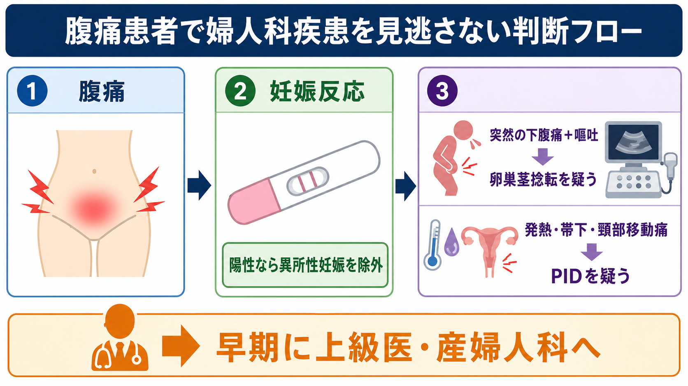
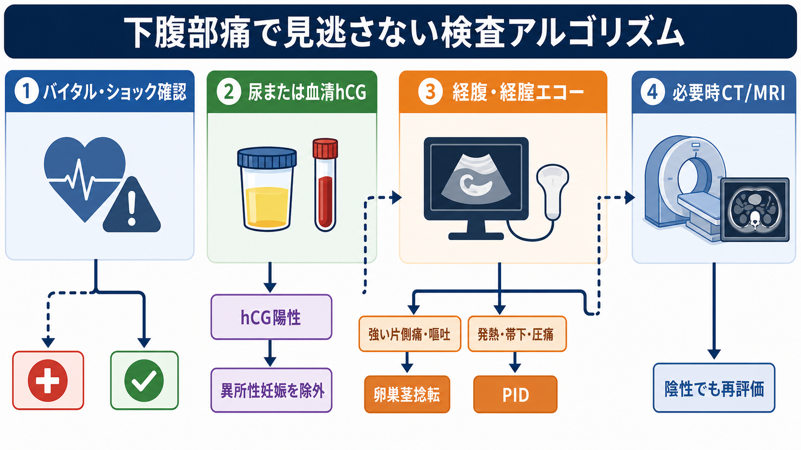
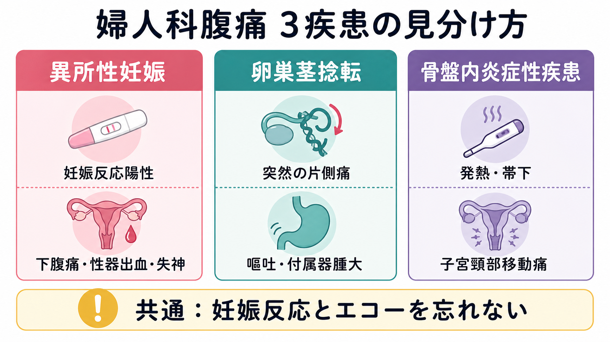

---
title: "腹痛患者で婦人科疾患をどう見逃さないか"
description: "妊娠反応、異所性妊娠、卵巣茎捻転、骨盤内炎症性疾患を腹痛診療の初期から拾い上げるための実践的な型。"
aliases:
  - "腹痛と婦人科疾患"
tags:
  - 領域/救急・初期対応
  - 領域/小児・産婦人科
  - 種類/クリニカルクエスチョン
  - 対象/研修医
question: "腹痛患者で婦人科疾患をどう見逃さないか"
clinical_area: "救急・初期対応"
audience: "研修医"
evidence_level: "mixed"
created: "2026-04-27"
updated: "2026-04-27"
enableToc: true
---

# 腹痛患者で婦人科疾患をどう見逃さないか

> このノートは研修医教育のための一般的整理であり、個別患者への診断・治療指示ではありません。緊急性が高い、判断に迷う、施設方針が関わる場合は上級医・産婦人科へ相談してください。

## クリニカルクエスチョン

腹痛患者で、妊娠反応、異所性妊娠、卵巣茎捻転、骨盤内炎症性疾患をどう見逃さないか。

## まず結論

- 妊娠可能性がある腹痛、下腹部痛、失神、不正出血では、本人申告だけで除外せず、尿または血清 hCG を早めに確認する。異所性妊娠は破裂すると急速大量出血と妊産婦死亡につながりうる [1]。
- hCG陽性なら「子宮内妊娠が見えたか」だけで安心しない。生殖補助医療後などでは正所異所同時妊娠も考慮し、腹痛・出血・ショックがあれば産婦人科へ早期共有する [1]。
- 突然発症の片側下腹部痛、悪心・嘔吐、付属器腫大では卵巣茎捻転を疑う。超音波ドプラ血流が保たれていても否定できず、疑えば時間依存の外科的疾患として扱う [4]。
- 発熱、帯下、性交痛、不正出血、子宮頸部移動痛、子宮圧痛、付属器圧痛があれば PID を疑う。PID は不妊症・異所性妊娠などの後遺症につながるため、診断閾値を下げる [2], [3], [5]。
- 画像は「妊娠反応」と「疑う病態」で選ぶ。婦人科疾患が疑われる急性骨盤痛では、経腹・経腟超音波とドプラが初期画像の中心になる [6]。
- 日本では抗菌薬、メトトレキサート、鎮痛薬、造影検査の運用が海外資料と異なることがある。処方や適応外使用は、PMDA添付文書、院内採用薬、保険適用、施設方針を確認する [8], [9], [10]。

## 判断の型

1. **まず妊娠可能性を検査で確認する。** 月経歴、避妊、最終性交、授乳、産後、流産・中絶後、不妊治療歴を聞くが、検査が必要な場面では本人申告だけで終わらせない。
2. **hCG陽性なら異所性妊娠を最優先に置く。** 下腹部痛、不正出血、失神、肩痛、頻脈、低血圧、腹膜刺激があれば破裂・腹腔内出血を想定し、静脈路、採血、血液型、超音波、産婦人科コールを並行する [1], [7]。
3. **hCG陰性でも婦人科疾患は残る。** 卵巣茎捻転、卵巣出血、PID、虫垂炎、尿路結石、腸管疾患は hCG陰性でも起こる。突然の片側痛と嘔吐は卵巣茎捻転、発熱・帯下・頸部移動痛はPIDの入口にする [2], [4], [5]。
4. **エコーで「否定」しすぎない。** 経腹・経腟超音波は重要だが、卵巣茎捻転は術前に確定できる臨床・画像基準がなく、ドプラ血流だけで判断しない [4]。
5. **再評価で仮説を更新する。** 鎮痛後、検査待ち、画像後、帰宅前に、痛みの部位、圧痛、バイタル、不正出血、発熱、嘔吐、歩行可否を見直す。

## 初期対応

- ABCDE、バイタル、意識、ショック、腹膜刺激、出血量を先に見る。頻脈、冷汗、失神、肩痛、腹部膨満、Hb低下があれば、婦人科出血も含めた出血性ショックとして扱う。
- 妊娠可能性がある患者では、尿hCGを早く提出する。尿が出ない、ショック、結果を急ぐ、尿検査が信用しにくい場合は血清hCGを検討する。
- 静脈路、採血、CBC、生化学、凝固、血液型・不規則抗体、交差適合の準備、尿検査を病態に応じて進める。発熱やPID疑いでは性感染症検査、血液培養、炎症反応を考える。
- 鎮痛は診断を遅らせる理由にしない。ただし妊娠、腎機能、消化性潰瘍、抗凝固薬、アレルギーを確認し、日本の添付文書と院内採用薬に沿って選ぶ。
- ショック、妊娠反応陽性の腹痛・出血、強い片側痛と嘔吐、発熱を伴う強い下腹部痛、卵管卵巣膿瘍疑いでは、検査完了を待たず上級医・産婦人科へ共有する。

## 鑑別・見逃し

| 優先度 | 疾患・病態 | 見逃せない理由 | 手がかり |
|---|---|---|---|
| 高 | 異所性妊娠 | 破裂で急速大量出血、ショック、妊産婦死亡につながる | 妊娠反応陽性、下腹部痛、不正出血、失神、肩痛、腹腔内液体 [1] |
| 高 | 卵巣茎捻転 | 卵巣機能温存に時間が関わる。画像だけで否定しにくい | 突然の片側下腹部痛、悪心・嘔吐、付属器腫大、間欠痛 [4] |
| 高 | PID・卵管卵巣膿瘍 | 不妊症、異所性妊娠、慢性骨盤痛、敗血症につながる | 発熱、帯下、性交痛、不正出血、頸部移動痛、子宮・付属器圧痛 [2], [5] |
| 中 | 卵巣出血・破裂性卵巣嚢胞 | 腹腔内出血や疼痛が強いことがある | 排卵期、突然の下腹痛、腹腔内液体、貧血 |
| 中 | 虫垂炎・尿路結石・腎盂腎炎 | 婦人科疾患に見えて外科・泌尿器疾患のことがある | 右下腹部痛、CVA叩打痛、血尿、発熱、嘔吐 |
| 中 | 性暴力・DV・避妊失敗 | 病歴が取りにくく、妊娠・感染・外傷・安全確保に関わる | 説明の不一致、同伴者との関係、外傷、本人が話せる環境 |

## 検査

| 検査 | 目的 | 注意点 |
|---|---|---|
| 尿または血清 hCG | 妊娠関連救急、画像・薬剤選択の前提確認 | 妊娠可能性がある腹痛・失神・出血では省略しない。陰性でも臨床的に矛盾すれば再評価する [1], [7] |
| 経腹・経腟超音波、ドプラ | 子宮内妊娠、付属器腫瘤、腹腔内液体、卵巣血流、卵管卵巣膿瘍を評価 | hCG陽性の婦人科急性骨盤痛では初期画像として有用。卵巣茎捻転はドプラ血流だけで否定しない [4], [6] |
| CBC、生化学、凝固、血液型 | 出血、感染、腎機能、手術・輸血準備 | Hb初回値が正常でも急性出血を否定しない。経時変化を見る。 |
| 尿検査 | 尿路感染、血尿、結石、脱水の補助 | 尿所見だけでUTIと決めず、婦人科疾患・虫垂炎も再確認する。 |
| CRP、性感染症検査 | PIDの補助、淋菌・クラミジアなどの確認 | CDCはPID診断で単一の病歴・身体所見・検査だけでは十分でないとし、臨床的閾値を下げる考え方を示している [5]。 |
| CT・MRI | 非婦人科疾患、膿瘍、出血、画像で方針が変わる病態の評価 | hCG陽性では超音波が中心。非婦人科疾患が疑わしい、または超音波で不十分なら、妊娠・被ばく・造影剤・施設運用を踏まえて上級医と選ぶ [6]。 |

## 治療・マネジメント

- **異所性妊娠疑い:** ショック、腹膜刺激、失神、腹腔内液体、Hb低下があれば破裂を想定し、輸液・輸血準備、産婦人科、手術室・麻酔科、上級医を早く呼ぶ。薬物療法や待機療法は、緊急対応可能な体制と厳密なhCGフォローが前提であり、救急外来単独で決めない [1]。
- **卵巣茎捻転疑い:** 画像で確定を待ちすぎない。疑いが残る場合は、卵巣機能温存を目的に診断的腹腔鏡を含めて産婦人科と相談する [4]。
- **PID疑い:** 外科的緊急疾患を除外できない、妊娠、経口治療不能、悪心・嘔吐や高熱、卵管卵巣膿瘍、外来治療不応では入院適応を考える [2], [5]。
- **日本での注意:** CDCのPIDレジメンやNICEの異所性妊娠治療条件は、そのまま日本の処方・保険・院内運用に置き換えない。セフトリアキソン、メトロニダゾールなどはPMDA添付文書で適応・用法用量を確認する [8], [9]。
- **メトトレキサートの注意:** 異所性妊娠へのMTX治療は、施設方針、適応、禁忌、説明同意、フォロー体制が重要である。PMDA上の医薬品情報と産婦人科方針を確認し、救急外来で独断しない [1], [10]。

## 図解

## 指導医に確認するポイント

- この患者で妊娠反応を検査で確認すべき理由は何か。尿hCGで十分か、血清hCGが必要か。
- hCG陽性の場合、異所性妊娠をどの所見で下げたか。子宮内妊娠を確認しても同時妊娠のリスクはないか。
- 卵巣茎捻転を疑う所見が残っていないか。ドプラ血流だけで安心していないか。
- PIDとして外来治療できる重症度か。虫垂炎、卵管卵巣膿瘍、妊娠、経口不能、敗血症リスクをどう評価したか。
- 鎮痛薬、抗菌薬、造影CT、MTXなどについて、日本の添付文書、院内採用薬、保険適用、施設運用を確認したか。

## 患者説明

- 「腹痛の原因には、消化管や尿路だけでなく、妊娠に関連する病気、卵巣のねじれ、骨盤内の感染などもあります。」
- 「妊娠しているかどうかは、画像検査や薬の選び方、急ぐべき病気の判断に関わるため、検査で確認します。」
- 「超音波や採血が正常に近くても、時間がたってからはっきりする病気があります。痛みが強くなる、ふらつく、出血が増える、発熱する、吐いて水分が取れない時は再受診が必要です。」
- 「感染が疑われる場合は、本人だけでなくパートナーの検査・治療が必要になることがあります。説明はプライバシーに配慮して行います。」

## ピットフォール

- 「妊娠していないと思う」という申告だけで、妊娠反応を省略する。
- hCG陽性の腹痛を「流産かもしれない」で止め、異所性妊娠破裂を下げない。
- 経腟エコーができない、または結果待ちを理由に、産婦人科相談を遅らせる。
- 卵巣茎捻転をドプラ血流ありで否定する。
- 発熱がない、CRPが低い、帯下が目立たないことを理由にPIDを完全に否定する。
- 尿所見陽性をUTI、右下腹部痛を虫垂炎と決めつけ、婦人科疾患を同時に考えない。
- 海外ガイドラインの抗菌薬用量やMTX条件を、日本の添付文書・保険適用・院内方針の確認なしに使う。

## 関連ノート

- [[救急外来で初期検査セットはどのように選ぶか]]
- [[救急外来で診断がつかない患者をどうマネジメントするか]]
- [[救急外来で見逃してはいけないレッドフラッグをどう拾うか]]
- [[救急患者の帰宅可否はどう判断するか]]
- [[出血性ショックを疑ったとき輸液と輸血をどう考えるか]]
- 関連ノート候補（未作成）: 腹痛で外科疾患をどう見逃さないか、妊娠反応陽性の救急対応、PIDの初期対応、卵巣茎捻転を疑う所見。

## MOC更新候補

- [[MOC｜救急・初期対応]]
- MOC｜小児・産婦人科.md（本サイト外）
- MOC｜消化器.md（本サイト外）

## 参考文献

[1] 日本産科婦人科学会・日本産婦人科医会. 産婦人科診療ガイドライン 産科編2023. CQ203 異所性妊娠の取り扱いは？ https://www.jsog.or.jp/activity/pdf/gl_sanka_2023.pdf

[2] 日本産科婦人科学会・日本産婦人科医会. 産婦人科診療ガイドライン 婦人科外来編2023. CQ110 骨盤内炎症性疾患（PID）の治療は？ https://www.jsog.or.jp/activity/pdf/gl_fujinka_2023.pdf

[3] 日本性感染症学会. 性感染症診断・治療ガイドライン2020. 診断と治療社. https://www.shindan.co.jp/np/isbn/9784787824677/

[4] American College of Obstetricians and Gynecologists. Adnexal Torsion in Adolescents. Committee Opinion No. 783. 2019. https://www.acog.org/clinical/clinical-guidance/committee-opinion/articles/2019/08/adnexal-torsion-in-adolescents

[5] Centers for Disease Control and Prevention. Pelvic Inflammatory Disease (PID). STI Treatment Guidelines, 2021. https://www.cdc.gov/std/treatment-guidelines/pid.htm

[6] American College of Radiology. ACR Appropriateness Criteria: Acute Pelvic Pain in the Reproductive Age Group. Revised 2023. https://acsearch.acr.org/docs/69503/narrative/

[7] National Institute for Health and Care Excellence. Ectopic pregnancy and miscarriage: diagnosis and initial management. NICE guideline NG126. https://www.nice.org.uk/guidance/ng126

[8] PMDA. セフトリアキソンナトリウム点滴用 医療用医薬品添付文書情報. https://www.pmda.go.jp/PmdaSearch/iyakuDetail/ResultDataSetPDF/530100_6132419G1033_7_09

[9] PMDA. メトロニダゾール経口剤等の効能・効果に関する情報（骨盤内炎症性疾患を含む）. https://www.pmda.go.jp/files/000246844.pdf

[10] PMDA. メソトレキセート錠2.5mg 医療用医薬品情報. https://www.pmda.go.jp/PmdaSearch/rdSearch/02/4222001F1027?user=1

## 更新ログ

- 2026-04-27: 初版作成。
