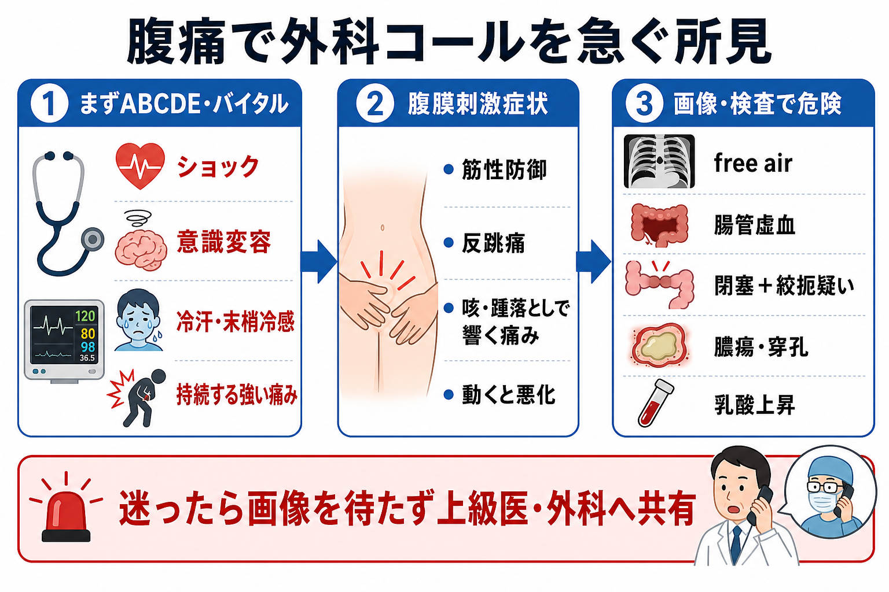
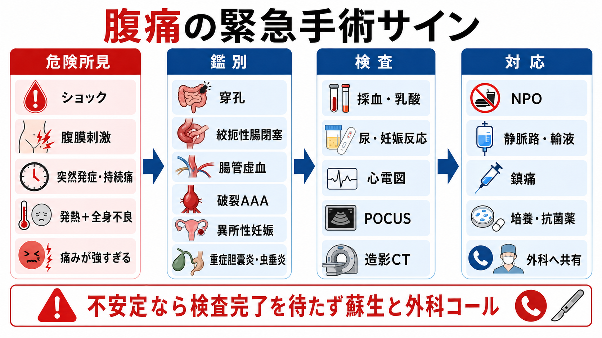
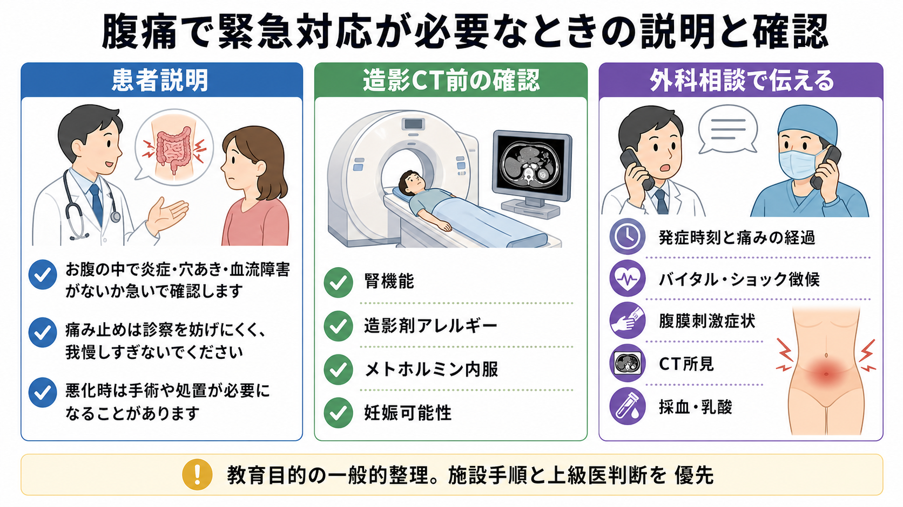

---
title: "腹痛患者で緊急手術を疑う所見は何か"
description: "腹膜刺激症状、持続痛、発熱、ショック、画像所見から外科コールのタイミングを学ぶ。"
aliases:
  - "腹痛の緊急手術サイン"
tags:
  - 領域/救急・初期対応
  - 種類/クリニカルクエスチョン
  - 対象/研修医
question: "腹痛患者で緊急手術を疑う所見は何か"
clinical_area: "救急・初期対応"
audience: "研修医"
evidence_level: "mixed"
created: "2026-04-27"
updated: "2026-04-27"
enableToc: true
---

# 腹痛患者で緊急手術を疑う所見は何か

> このノートは研修医教育のための一般的整理であり、個別患者への診断・治療指示ではありません。緊急性が高い、判断に迷う、施設手順が関わる場合は上級医・専門科に相談してください。

## クリニカルクエスチョン

腹痛患者で緊急手術を疑い、外科へ早期共有すべき所見は何か。

## まず結論

- 腹痛で外科コールを急ぐのは、**ショックまたは臓器障害、腹膜刺激症状、突然発症または持続する強い痛み、発熱を伴う全身状態不良、画像で穿孔・虚血・絞扼・膿瘍を疑う所見**があるときである[1][2][3][4]。
- 腹膜刺激症状は、筋性防御、反跳痛、打診痛、咳・踵落としで響く痛み、動くと悪化してじっとしている様子として拾う。高齢者、免疫抑制、肥満、鎮痛後では所見が弱いことがある[2][3]。
- 「痛みが診察所見より強い」「突然の激痛」「乳酸上昇・アシドーシス」「心房細動や動脈硬化リスク」は腸管虚血を疑う。腹膜刺激が出るまで待つと腸管壊死に近づく[7]。
- 発熱、頻脈、低血圧、意識変容、乳酸上昇を伴う腹痛は、腹腔内感染症や敗血症として、血液培養、抗菌薬、蘇生、感染巣コントロールの検討を並行する[5][6]。
- 造影CTは多くの急性腹症で診断と方針決定に有用だが、不安定例では画像完了を待たずに上級医・外科へ共有する。腎機能、造影剤アレルギー、メトホルミン内服、妊娠可能性は確認する[1][4][8][9]。

## 判断の型

1. **まず不安定かを決める**  
   ABCDE、意識、気道・呼吸、血圧、心拍数、末梢冷感、尿量、乳酸を確認する。ショックや臓器障害があれば、診断名が確定していなくても蘇生と外科共有を始める[5][6]。
2. **腹膜刺激と痛みの質を見る**  
   持続痛、体動で悪化、じっとしている、筋性防御、反跳痛、打診痛は腹膜炎を疑う。鎮痛は診察を妨げる目的で控えるものではなく、再評価しながら行う[2][3]。
3. **「外科疾患らしい画像」を待ちすぎない**  
   free air、腸管壁造影不良、気腫、門脈ガス、closed loop、腸間膜浮腫、腹水、膿瘍、虫垂炎・胆嚢炎の穿孔や壊疽疑いは、外科へ早く共有する[1][4][7]。
4. **見逃すと致命的な鑑別を先に置く**  
   消化管穿孔、絞扼性腸閉塞、急性腸間膜虚血、破裂腹部大動脈瘤、異所性妊娠、腹腔内出血、重症胆道感染、壊疽性胆嚢炎、穿孔性虫垂炎を先に考える[1][2][7]。
5. **外科コールは「手術決定」ではなく「同時評価の開始」**  
   コール時点で確定診断が不要なことが多い。発症時刻、痛みの経過、バイタル、腹膜刺激、採血・乳酸、画像所見、抗菌薬や輸液の状況を短く共有する。

## 初期対応

- ABCDE、モニター、SpO2、血圧再測、体温、意識、疼痛スコアを確認する。
- ショック、意識変容、低酸素、冷汗、末梢冷感、乏尿があれば、太い静脈路、採血、乳酸、血液ガス、輸液、昇圧薬の準備を上級医と進める[5][6]。
- 腹腔内感染症が疑わしく重症なら、血液培養2セットと感染巣検体を可能な範囲で採取し、抗菌薬を遅らせない。敗血症性ショックまたは可能性が高い敗血症では迅速投与が重視される[5][6]。
- NPO、制吐、鎮痛、尿道カテーテルの要否、手術や処置を見据えた抗凝固薬・抗血小板薬内服歴を確認する。
- 妊娠可能性がある患者では尿または血中hCGを早期に確認し、異所性妊娠や卵巣茎捻転を鑑別に残す[1][2]。
- 不安定例、腹膜刺激症状が明らかな例、急速に悪化する例では、CTや採血結果の完了を待たず上級医・外科・麻酔科へ共有する。

## 鑑別・見逃し

| 優先度 | 疾患・状態 | 見逃さない理由 | 手がかり |
|---|---|---|---|
| 高 | 消化管穿孔 | 汎発性腹膜炎、敗血症、緊急手術につながる | 突然の強い痛み、板状硬、free air、NSAIDs・潰瘍歴 |
| 高 | 絞扼性腸閉塞 | 腸管壊死へ進行し得る | 既往手術、嘔吐、腹部膨満、持続痛、closed loop、腹水、乳酸上昇 |
| 高 | 急性腸間膜虚血 | 初期は腹部所見が乏しく死亡率が高い | 痛みが診察所見より強い、心房細動、動脈硬化、乳酸上昇、アシドーシス[7] |
| 高 | 破裂腹部大動脈瘤 | 急速に出血性ショックへ進む | 高齢男性、拍動性腫瘤、背部痛、低血圧、失神 |
| 高 | 異所性妊娠破裂 | 妊娠初期の腹腔内出血を見逃す | 妊娠可能性、下腹部痛、性器出血、ショック、hCG陽性 |
| 中〜高 | 急性胆嚢炎・胆管炎 | 壊疽、穿孔、敗血症のリスク | 右上腹部痛、発熱、黄疸、Murphy徴候、胆嚢壁肥厚 |
| 中〜高 | 虫垂炎・憩室炎の穿孔・膿瘍 | 限局性から汎発性腹膜炎へ進む | 限局痛から持続痛、発熱、腹膜刺激、膿瘍・free air |
| 中 | 膵炎、尿管結石、DKA、心筋梗塞、肺炎 | 非外科疾患でも腹痛で来る | 心電図、血糖・ケトン、リパーゼ、胸部所見、尿所見 |

## 検査

| 検査 | 目的 | 注意点 |
|---|---|---|
| バイタル再評価・乳酸・血液ガス | ショック、低灌流、アシドーシスを拾う | 乳酸は単独で除外に使わず、経時変化と臨床像で見る[5][7] |
| 血算、電解質、腎機能、肝胆道系、凝固、CRP | 感染、出血、臓器障害、造影CTや手術準備を評価 | 白血球やCRPが軽いだけで重症疾患を除外しない[2][3] |
| 尿検査、尿・血中hCG | 尿路疾患、妊娠関連疾患の確認 | 妊娠可能性があれば画像選択と外科・産婦人科相談に影響する[1][2] |
| 心電図 | 心筋梗塞、心房細動、虚血リスクを拾う | 上腹部痛でACS、心房細動で腸間膜塞栓を考える |
| POCUS | AAA、腹水、胆嚢、腎盂拡張、妊娠関連の手がかり | 陰性で穿孔・虚血・虫垂炎を除外しない |
| 造影CT | 穿孔、膿瘍、腸閉塞、虚血、出血、炎症の範囲を評価 | 発熱を伴う非限局性腹痛ではCT腹部骨盤造影が通常適切とされる[4] |
| CTA | 腸間膜虚血、動脈閉塞、AAA、活動性出血を評価 | 腸間膜虚血疑いでは遅延が害になり得る。腎障害時もリスクと利益を上級医・放射線科と相談する[7][8] |

**日本での注意**: 腎障害患者のヨード造影剤使用は、日本腎臓学会・日本医学放射線学会・日本循環器学会のガイドラインで腎機能評価と適正使用が整理されている[8]。メトホルミン内服中は、PMDAと厚生労働省の安全対策資料で、ヨード造影剤検査前の一時中止、緊急検査を除くこと、造影剤投与後48時間は再開しないことなどが示されている[9][10]。ただし、急性腸間膜虚血や破裂AAAなどでは、検査遅延の害が大きいことがあるため、上級医・放射線科とリスクを共有して判断する[7][8][9][10]。

## 治療・マネジメント

- **外科コールの目安**: ショック、腹膜刺激、持続する強い痛み、突然発症、発熱＋全身状態不良、乳酸上昇、画像で穿孔・虚血・絞扼・膿瘍を疑うとき。
- **NPOとルート確保**: 手術・内視鏡・IVRの可能性を考え、NPO、静脈路、輸液、採血、交差適合の要否を確認する。
- **鎮痛**: 痛みを我慢させない。鎮痛後に腹部所見とバイタルを再評価し、所見が変化したら共有する[2][3]。
- **抗菌薬**: 穿孔、胆道感染、虫垂炎・憩室炎の穿孔・膿瘍、腹膜炎、敗血症を疑う場合は、培養採取後に経験的抗菌薬を開始する。ショックでは培養で遅らせない[5][6]。
- **感染巣コントロール**: 腹腔内感染症では、手術、ドレナージ、内視鏡・IVRなどで感染源を制御する発想が重要で、遅れは予後悪化につながる[5][6]。
- **搬送・転院**: 外科、血管外科、産婦人科、IVR、ICU対応が必要で自施設対応が難しい場合は、蘇生と並行して転送先を探す。

## 図解

## 指導医に確認するポイント

- この腹痛は、画像や採血結果を待たずに外科へ共有すべき状態か。
- 腹膜刺激症状は本当に陰性か。高齢者、免疫抑制、鎮痛後で所見が弱く出ていないか。
- 腸管虚血、破裂AAA、異所性妊娠破裂を除外するために必要な情報はそろっているか。
- 造影CT、CTA、超音波、産婦人科診察のどれを優先するか。
- 抗菌薬、輸液、昇圧薬、輸血、ICU、手術室・IVRの準備をどこまで同時進行するか。
- 自施設で対応可能か、早期転院が必要か。

## 患者説明

- 「お腹の中で炎症、穴あき、血流障害、出血が起きていないかを急いで確認します。」
- 「痛み止めは必要に応じて使います。痛みの場所や強さが変わったらすぐ教えてください。」
- 「状態によっては、CT、点滴、抗菌薬、外科の診察を同時に進めます。」
- 「検査の結果や全身状態によって、手術、管で膿を抜く処置、内視鏡、血管内治療が必要になることがあります。」
- 「造影剤を使う場合は、腎臓の機能、アレルギー、糖尿病薬、妊娠の可能性を確認します。」

## ピットフォール

- 「腹痛はよくある主訴」として、バイタル再測と全身状態の評価を省く。
- 腹膜刺激症状がないことだけで、腸管虚血や絞扼性腸閉塞を否定する。
- 鎮痛を避けて患者を苦痛のまま待たせ、再評価の質を下げる。
- 発熱と腹痛を胃腸炎と決めつけ、穿孔、膿瘍、胆道感染を考えない。
- 造影CTの準備に集中し、不安定例の外科コールと蘇生が遅れる。
- 高齢者、ステロイド・免疫抑制、糖尿病、透析患者で症状・所見が軽く見えることを忘れる。
- 妊娠可能性の確認を忘れ、異所性妊娠や画像選択の判断が遅れる。
- 外科へ「CTが出てから相談」と考え、早期共有の機会を逃す。

## 関連ノート

- [[救急外来でバイタルサイン異常を見たとき何を優先して確認するか]]
- [[救急外来で再評価はいつ何を見ればよいか]]
- [[救急外来で見逃してはいけないレッドフラッグをどう拾うか]]
- [[救急外来で敗血症性ショックを疑ったら何をするか]]
- [[意識障害患者で頭部CTを急ぐべき所見は何か]]

## MOC更新候補

- [[MOC｜救急・初期対応]]
- MOC｜消化器.md（本サイト外）
- MOC｜外科・整形・皮膚.md（本サイト外）
- MOC｜検査・画像・手技.md（本サイト外）

## 参考文献

[1] 急性腹症診療ガイドライン2025改訂出版委員会 編. 急性腹症診療ガイドライン2025 第2版. 医学書院; 2025. https://doi.org/10.11477/9784260657730

[2] Morley EJ, Jordan J, Loesche MA, et al. Acute Abdominal Pain in Adults: Evaluation and Diagnosis. Am Fam Physician. 2023;107(6):585-596. https://www.aafp.org/pubs/afp/issues/2023/0600/acute-abdominal-pain-adults.html

[3] Macaluso CR, McNamara RM. Evaluation and management of acute abdominal pain in the emergency department. Int J Gen Med. 2012;5:789-797. https://doi.org/10.2147/IJGM.S25936

[4] Scheirey CD, Fowler KJ, Therrien JA, et al. ACR Appropriateness Criteria Acute Nonlocalized Abdominal Pain. J Am Coll Radiol. 2018;15(11S):S217-S231. https://doi.org/10.1016/j.jacr.2018.09.010

[5] 志馬伸朗, 中田孝明, 矢田部智昭, ほか. 日本版敗血症診療ガイドライン2024. 日本集中治療医学会雑誌. 2024;31(Supplement):S1165-S1313. https://doi.org/10.3918/jsicm.2400001

[6] Sartelli M, Coccolini F, Kluger Y, et al. WSES/GAIS/SIS-E/WSIS/AAST global clinical pathways for patients with intra-abdominal infections. World J Emerg Surg. 2021;16:49. https://doi.org/10.1186/s13017-021-00387-8

[7] Bala M, Catena F, Kashuk J, et al. Acute mesenteric ischemia: updated guidelines of the World Society of Emergency Surgery. World J Emerg Surg. 2022;17:54. https://doi.org/10.1186/s13017-022-00443-x

[8] 日本腎臓学会, 日本医学放射線学会, 日本循環器学会 編. 腎障害患者におけるヨード造影剤使用に関するガイドライン2018. 東京医学社; 2018. https://minds.jcqhc.or.jp/summary/c00490/

[9] PMDA. 使用上の注意改訂情報（令和元年6月18日指示分）：メトホルミン含有製剤等. https://www.pmda.go.jp/safety/info-services/drugs/calling-attention/revision-of-precautions/0353.html

[10] 厚生労働省. 令和元年度第3回安全対策調査会 資料1-4 薬生安発1120第1号関連資料. https://www.mhlw.go.jp/content/11121000/000514022.pdf

## 更新ログ

- 2026-04-27: 初版作成。
