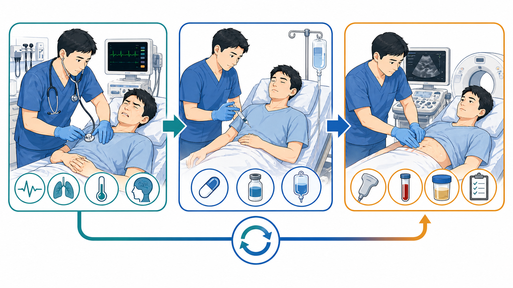
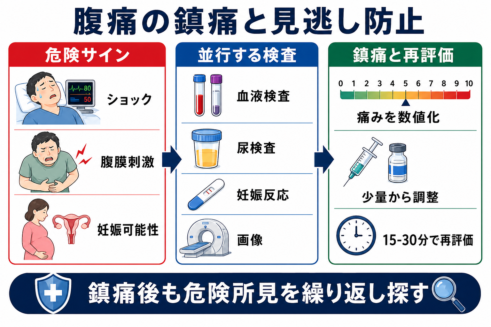
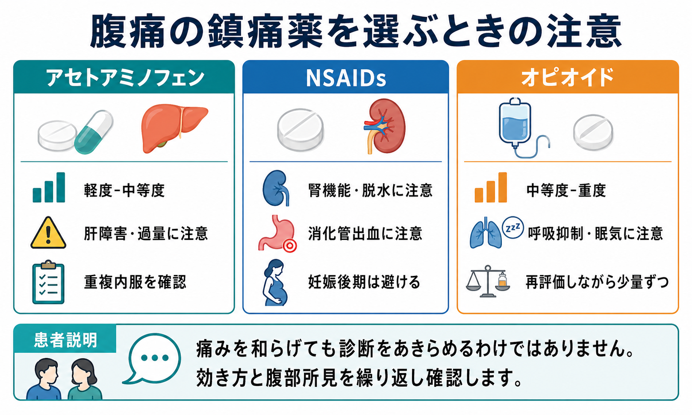

---
title: "腹痛患者に鎮痛薬を使ってよいか"
description: "診断を妨げるという誤解を避け、腹痛患者に適切な鎮痛と再評価を行う考え方を整理する。"
aliases:
  - "腹痛の鎮痛"
tags:
  - 領域/救急・初期対応
  - 種類/クリニカルクエスチョン
  - 対象/研修医
question: "腹痛患者に鎮痛薬を使ってよいか"
clinical_area: "救急・初期対応"
audience: "研修医"
evidence_level: "mixed"
created: "2026-04-27"
updated: "2026-04-27"
enableToc: true
---

# 腹痛患者に鎮痛薬を使ってよいか

> このノートは研修医教育のための一般的な整理であり、個別患者への診断・治療指示ではありません。緊急性が高い、判断に迷う、施設方針が関わる場合は上級医・専門科に相談してください。

## クリニカルクエスチョン

腹痛患者に鎮痛薬を使うと診断を妨げるのか。診断前でも鎮痛を始めてよい場面、避けるべき薬剤、鎮痛後に何を再評価すべきか。

## まず結論

- 腹痛患者への適切な鎮痛は、診断を「隠す」ためではなく、苦痛を減らし、診察・検査・意思決定を進めやすくする医療行為である。成人急性腹痛のレビューでは、オピオイド鎮痛は治療方針の変更を増やし得る一方、重大な診断エラーを明確に増やすとは示されていない[4][5]。
- 「鎮痛薬を使う前に診断名を確定する」ではなく、ABCDE、バイタル、腹膜刺激、ショック、妊娠可能性、血管疾患・消化管穿孔・腸管虚血などのレッドフラッグを先に拾い、鎮痛と検査を並行する[1][2]。
- 日本の急性腹症診療では、バイタル異常を伴う緊急疾患を先に評価し、その後に緊急手術が必要な病態を探す2ステップ法が重視される[2][3]。診断前からの鎮痛薬投与も国内解説で明示されている[3]。
- 鎮痛後は「痛みが減ったから安全」ではない。痛みスコア、バイタル、腹部所見、尿量、検査結果、画像、患者の表情・歩行・嘔吐などを再評価し、方針を更新する。
- 薬剤選択は病態で変える。アセトアミノフェン、NSAIDs、オピオイドはいずれも使いどころがあるが、腎機能障害・脱水・消化管出血・妊娠後期・肝障害・呼吸抑制・意識障害などでは禁忌や注意を確認する[7][8][9]。

## 判断の型

1. **まず危険な腹痛かを分ける**: ショック、発熱を伴う重症感、腹膜刺激、持続する強い痛み、突然発症、背部痛・失神、吐血・下血、妊娠可能性、免疫抑制、高齢者、抗凝固薬内服を確認する[1][2]。
2. **鎮痛前のベースラインを残す**: 痛みの部位、NRS 0-10、腹膜刺激、圧痛移動、嘔吐、歩行、バイタル、初期の仮説を記録する。
3. **薬剤を病態で選ぶ**: 軽度から中等度ではアセトアミノフェンを考え、腎機能・脱水・出血リスクが低い筋骨格性や炎症性疼痛ではNSAIDsを検討する。中等度から重度で診察や検査が困難な痛みでは、オピオイドを少量から再評価しながら使う。
4. **鎮痛と検査を止めない**: 鎮痛薬を使っても、血液検査、尿検査、妊娠反応、心電図、超音波、CT、外科・婦人科・泌尿器科相談の必要性は別に判断する。
5. **再評価で方針を変える**: 鎮痛後に痛みの性状が変わる、腹膜刺激が明らかになる、バイタルが悪化する、検査が不一致なら、診断名より先に上級医・専門科へ共有する。

## 初期対応

- ABCDE、意識、呼吸数、SpO2、血圧、脈拍、体温、ショック徴候を確認する。バイタル異常があれば、急性腹症の2ステップ法ではまず緊急疾患として蘇生・専門科相談を優先する[2]。
- 妊娠可能年齢では、本人申告だけでなく妊娠反応を早めに確認する。異所性妊娠、卵巣茎捻転、骨盤内炎症性疾患は鎮痛で痛みが軽くなっても除外されない。
- 痛みをNRS 0-10で記録し、鎮痛薬投与時刻、薬剤、量、反応、眠気・呼吸抑制・悪心などを残す。
- 強い痛みで診察が困難な場合は、診断確定を待つより、上級医に共有しながら鎮痛を開始する。成人急性腹痛のエビデンスは、適切な鎮痛が診断の妨げになるという従来の不安を支持していない[4][5]。
- 鎮痛後は15-30分程度を目安に、痛みスコア、腹部所見、バイタル、鎮静、呼吸状態を再評価する。時間間隔は重症度、薬剤、施設プロトコルで短くする。

## 鑑別・見逃し

| 優先度 | 疾患・状況 | 見逃さない理由 | 手がかり |
|---|---|---|---|
| 高 | 腹部大動脈瘤破裂・大動脈解離 | 鎮痛で一時的に落ち着いても致死的 | 突然発症、背部痛、失神、低血圧、拍動性腫瘤、左右差 |
| 高 | 消化管穿孔・汎発性腹膜炎 | 手術遅れが転帰に直結 | 板状硬、反跳痛、発熱、free air、乳酸上昇 |
| 高 | 腸管虚血 | 初期に腹部所見が乏しいことがある | 強い痛みと所見の不一致、心房細動、動脈硬化、乳酸上昇 |
| 高 | 急性胆管炎・膵炎・重症感染 | 鎮痛だけで方針を遅らせない | 発熱、黄疸、肝胆道系酵素、リパーゼ、敗血症徴候 |
| 高 | 異所性妊娠・卵巣茎捻転 | 妊娠・婦人科疾患は腹痛診療で抜けやすい | 妊娠反応、性器出血、下腹部痛、失神、片側痛 |
| 中 | 尿管結石・腎盂腎炎 | 鎮痛反応がよくても閉塞感染は危険 | 側腹部痛、血尿、発熱、膿尿、水腎症 |
| 中 | 虫垂炎・憩室炎・腸閉塞 | 初期検査が決め手にならないことがある | 痛みの移動、局所圧痛、嘔吐、排ガス停止、画像 |
| 中 | 薬剤性・代謝性・心筋梗塞 | 腹痛として来る非腹部疾患 | NSAIDs、抗凝固薬、糖尿病、心電図変化、電解質異常 |

## 検査

| 検査 | 目的 | 注意点 |
|---|---|---|
| CBC、生化学、肝胆道系、腎機能、電解質、CRP | 炎症、貧血、腎機能、胆道・膵疾患、脱水を評価 | 正常でも早期虫垂炎、腸管虚血、婦人科疾患は除外できない |
| 血液ガス・乳酸 | ショック、低灌流、腸管虚血、敗血症の補助 | 乳酸正常でも腸管虚血は除外しない |
| 尿検査・尿沈渣 | 尿路感染、血尿、脱水、ケトン | 尿路所見があっても虫垂炎・婦人科疾患を併存し得る |
| 妊娠反応 | 異所性妊娠、画像・薬剤選択の確認 | 妊娠可能性があれば優先度は高い |
| 心電図・トロポニン | 心筋梗塞など腹痛様症状の除外 | 高齢者、糖尿病、心血管リスクでは低い閾値で行う |
| 超音波 | 胆嚢、胆管、腹水、尿路閉塞、婦人科疾患の評価 | 陰性でもCTや専門科評価が必要なことがある |
| CT | 穿孔、腸閉塞、虫垂炎、憩室炎、血管疾患などの評価 | 造影は腎機能、アレルギー、妊娠可能性を確認する |

## 治療・マネジメント

- **アセトアミノフェン**: 腎機能障害、脱水、消化管出血リスクがありNSAIDsを避けたい場面で候補になる。肝障害、アルコール多飲、低栄養、総合感冒薬・OTCとの重複に注意する[7]。
- **NSAIDs**: 尿管結石などでは有用なことがあるが、消化性潰瘍・消化管出血、重篤な血液異常、重篤な肝・腎機能障害、重篤な心機能不全、アスピリン喘息、妊娠後期などでは禁忌・注意がある[8]。脱水、敗血症、腎前性腎障害疑いでは避ける方向で考える。
- **オピオイド**: 中等度から重度の腹痛で、診察や検査が困難な苦痛を早く下げたいときに検討する。呼吸抑制、眠気、悪心、低血圧、腸管運動低下を監視し、少量から反応を見て調整する[4][5][9]。
- **制吐・輸液・抗菌薬・手術相談**: 鎮痛は単独治療ではない。嘔吐、脱水、敗血症、胆道感染、穿孔、腸閉塞、婦人科救急が疑われる場合は、原因治療と専門科相談を並行する[1][2]。
- **日本での注意**: 海外文献の「morphine」「fentanyl」「ketorolac」などをそのまま日本の処方に置き換えない。日本では採用薬、添付文書、麻薬管理、診療報酬、院内プロトコル、CTアクセス、夜間の専門科体制が施設で異なる。医療用麻薬は管理・記録の制度も確認する[6][9]。
- **鎮痛後の帰宅判断**: 痛みが下がったことだけで帰宅可能とはしない。再診基準、再評価時刻、検査未確定項目、家族・交通手段、夜間対応、抗凝固薬や妊娠可能性などを確認する。

## 図解

## 指導医に確認するポイント

- この患者で「鎮痛より先に外科・婦人科・泌尿器科へ共有すべき所見」は何か。
- オピオイドを使う場合、施設の初回量、追加間隔、モニタリング、ナロキソン準備、帰宅可否の基準はどうなっているか。
- NSAIDsを避けるべき腎機能、脱水、消化管出血、抗凝固薬、妊娠可能性、心不全の評価は十分か。
- 鎮痛後の再評価で、痛みスコア以外にどの腹部所見とバイタルを記録するか。
- CTや超音波が陰性でも観察・再検・専門科相談を残す条件は何か。

## 患者説明

- 「痛み止めを使っても、病気を見逃してよいという意味ではありません。痛みを和らげながら、原因を調べます。」
- 「痛み止めの効き方、腹部の診察所見、血液検査や画像検査を合わせて判断します。」
- 「痛みが軽くなっても、発熱、嘔吐、ふらつき、冷汗、血便、黒色便、強い痛みの再燃、尿が出ない、息苦しさ、意識がぼんやりする場合はすぐ知らせてください。」
- 「妊娠の可能性、腎臓・肝臓の病気、胃潰瘍、喘息、抗凝固薬、薬のアレルギー、普段飲んでいる市販薬を確認させてください。」

## ピットフォール

- 「外科に見せるまで鎮痛しない」と決めてしまい、患者の苦痛と診察協力を悪化させる。
- 鎮痛後に痛みが軽くなったことを、危険疾患の除外と誤解する。
- NSAIDsを脱水、腎機能障害、消化管出血疑い、妊娠後期、抗凝固薬内服で機械的に使う。
- オピオイド投与後に呼吸数、SpO2、意識、血圧、眠気を再評価しない。
- 妊娠反応、尿検査、心電図など、腹痛で忘れやすい検査を痛みの強さだけで後回しにする。
- 画像検査が陰性だったことを、発症早期・撮像範囲・造影有無・読影限界を考えずに「異常なし」と扱う。

## 関連ノート

- [[救急外来で再評価はいつ何を見ればよいか]]
- [[救急外来で見逃してはいけないレッドフラッグをどう拾うか]]
- [[救急患者で上級医を呼ぶタイミングはどう判断するか]]
- [[救急患者の帰宅可否はどう判断するか]]

## MOC更新候補

- [[MOC｜救急・初期対応]]
- MOC｜消化器.md（本サイト外）
- 追加候補: 「腹痛・消化管出血」配下の急性腹症・鎮痛・再評価の入口として本ノートを掲載する。

## 参考文献

[1] 急性腹症診療ガイドライン2025 第2版. 日本超音波医学会公開ページ. https://www.jsum.or.jp/members/guideline/kyuuseihukusyou2025/

[2] 小豆畑丈夫, 前田重信, 吉田雅博, 真弓俊彦. 急性腹症診療ガイドライン2015：初期診療アルゴリズムが目指すもの. 日本腹部救急医学会雑誌. 2017;37(4):551-557. https://doi.org/10.11231/jaem.37.551

[3] 辻川知之. 診療のすすめかた 急性腹症診療ガイドライン2015のポイント. 診断と治療. 2021;109(1):39-44. https://doi.org/10.34433/J00697.2021107064

[4] Manterola C, Astudillo P, Losada H, et al. Analgesia in patients with acute abdominal pain. Cochrane Database of Systematic Reviews. 2011;1:CD005660. https://doi.org/10.1002/14651858.CD005660.pub3

[5] Gavriilidis P, de'Angelis N, Evans J, Di Saverio S, Kang P. Analgesia in patients with acute abdominal pain: a systematic review and network meta-analysis. International Journal of Surgery. 2019;66:120-126. https://doi.org/10.1016/j.ijsu.2019.04.012

[6] 厚生労働省. 医療用麻薬・向精神薬の適正管理. https://www.mhlw.go.jp/stf/seisakunitsuite/bunya/kenkou_iryou/iyakuhin/yakubuturanyou/index.html

[7] PMDA. アセリオ静注液1000mgバッグ 医療用医薬品情報・添付文書. https://www.pmda.go.jp/PmdaSearch/rdDetail/iyaku/1141400A2020_1?user=1

[8] PMDA. ロキソプロフェンナトリウム錠60mg 医療用医薬品情報・添付文書. https://www.pmda.go.jp/PmdaSearch/rdSearch/02/1149019F1595?user=1

[9] PMDA. モルヒネ塩酸塩注射液 医療用医薬品情報・添付文書. https://www.pmda.go.jp/PmdaSearch/rdSearch/02/8114401A2135?user=1

## 更新ログ

- 2026-04-27: 初版作成。
